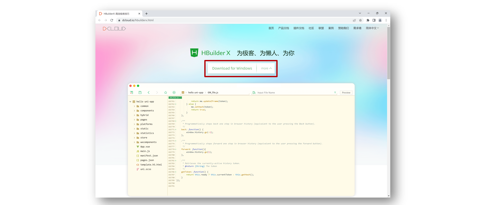
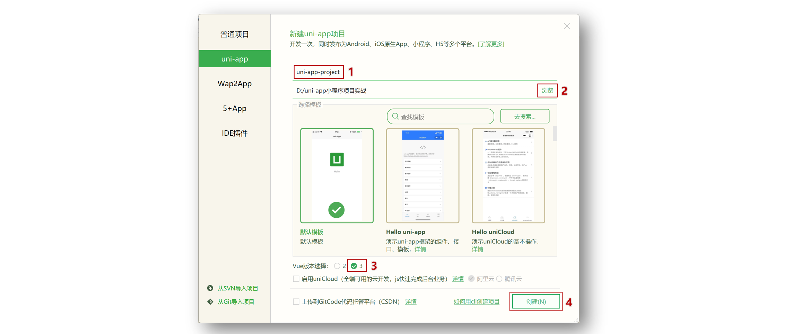
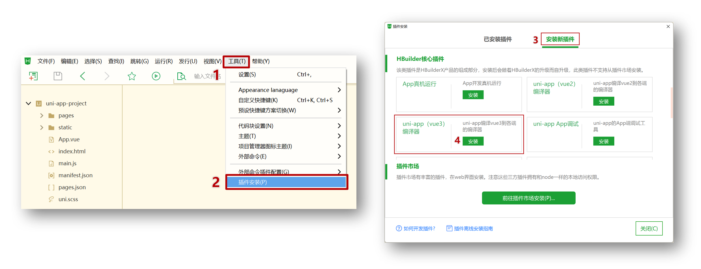
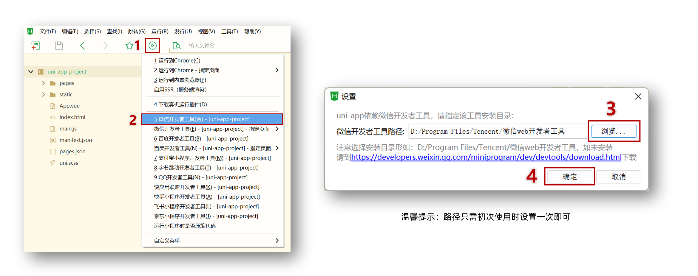
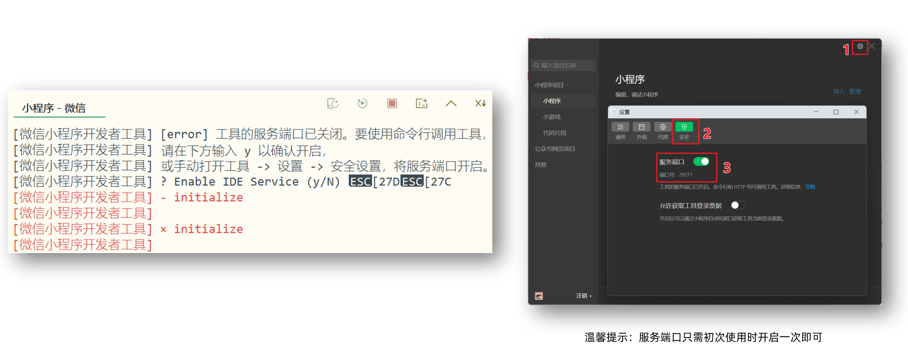
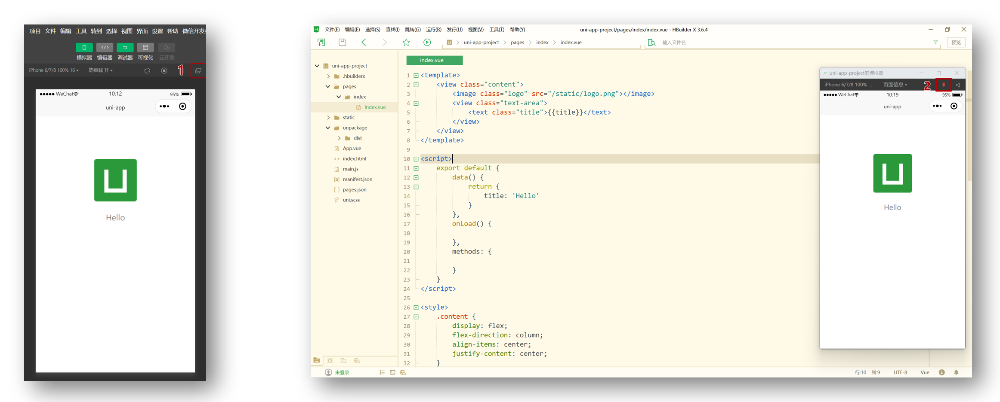
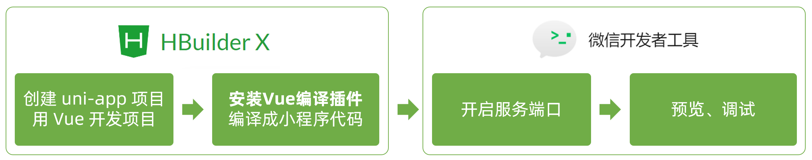
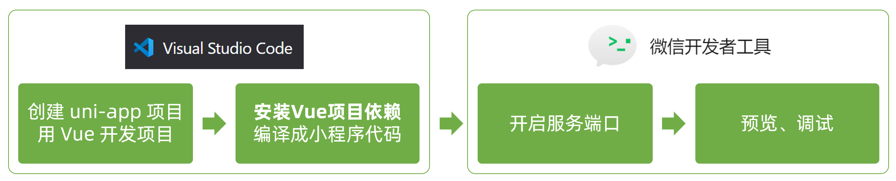
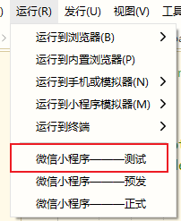
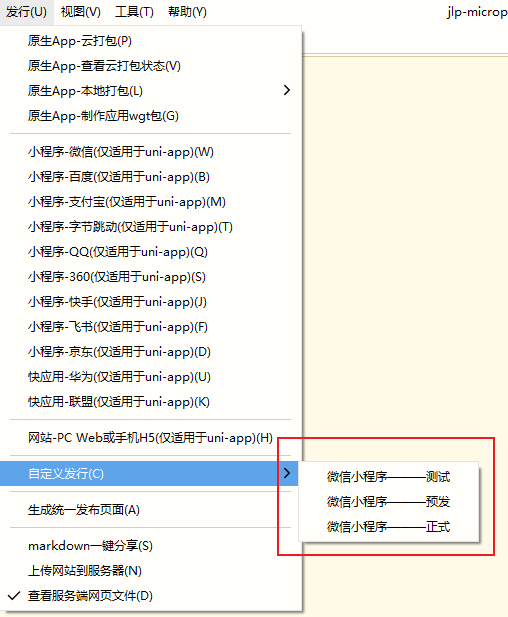

# uni-app 基础

## 创建 uni-app 项目方式

**uni-app 支持两种方式创建项目：**

1.  通过 HBuilderX 创建

2.  通过命令行创建（更推荐）

## HBuilderX 创建 uni-app 项目

### 创建步骤

**1.下载安装 HbuilderX 编辑器**



**2.通过 HbuilderX 创建 uni-app vue3 项目**



**3.安装 uni-app vue3 编译器插件**



**4.编译成微信小程序端代码**



**5.开启服务端口**



**小技巧分享：模拟器窗口分离和置顶**



**Hbuildex 和 微信开发者工具 关系**



温馨提示：**Hbuildex** 和 **uni-app** 都属于 [DCloud](https://dcloud.io) 公司的产品。

  

### 目录结构

我们先来认识 uni-app 项目的目录结构。

```shell
├─pages            业务页面文件存放的目录
│  └─index
│     └─index.vue  index页面
├─static           存放应用引用的本地静态资源的目录(注意：静态资源只能存放于此)
├─unpackage        非工程代码，一般存放运行或发行的编译结果
├─index.html       H5端页面
├─main.js          Vue初始化入口文件
├─App.vue          配置App全局样式、监听应用生命周期
├─pages.json       **配置页面路由、导航栏、tabBar等页面类信息**
├─manifest.json    **配置appid**、应用名称、logo、版本等打包信息
└─uni.scss         uni-app内置的常用样式变量
```

### 解读 pages.json

用于配置页面路由、导航栏、tabBar 等页面类信息

**参考代码**

```json
{
  // 页面路由
  "pages": [
    {
      "path": "pages/index/index",
      // 页面样式配置
      "style": {
        "navigationBarTitleText": "首页"
      }
    },
    {
      "path": "pages/my/my",
      "style": {
        "navigationBarTitleText": "我的"
      }
    }
  ],
  // 全局样式配置
  "globalStyle": {
    "navigationBarTextStyle": "white",
    "navigationBarTitleText": "uni-app",
    "navigationBarBackgroundColor": "#27BA9B",
    "backgroundColor": "#F8F8F8"
  },
  // tabBar 配置
  "tabBar": {
    "selectedColor": "#27BA9B",
    "list": [
      {
        "pagePath": "pages/index/index",
        "text": "首页",
        "iconPath": "static/tabs/home_default.png",
        "selectedIconPath": "static/tabs/home_selected.png"
      },
      {
        "pagePath": "pages/my/my",
        "text": "我的",
        "iconPath": "static/tabs/user_default.png",
        "selectedIconPath": "static/tabs/user_selected.png"
      }
    ]
  }
}
```

## uni-app 和原生小程序开发区别

### 主要区别

uni-app 项目每个页面是一个 `.vue` 文件，数据绑定及事件处理同 `Vue.js` 规范：

1.  属性绑定 `src="{ { url }}"` 升级成 `:src="url"`

2.  事件绑定 `bindtap="eventName"` 升级成 `@tap="eventName"`，**支持（）传参**

3.  支持 Vue 常用**指令** `v-for`、`v-if`、`v-show`、`v-model` 等

### 其他区别补充

1.  调用接口能力，**建议**前缀 `wx` 替换为 `uni` ，养成好习惯，这样支持多端开发。

2.  `<style></style>` 样式不需要写 `scoped`

3.  生命周期分为三部分：应用生命周期(小程序)，页面生命周期(小程序)，组件生命周期(Vue)

  

## 命令行创建 uni-app 项目

**优势**

通过命令行创建 uni-app 项目，**不必依赖 HBuilderX**，TypeScript 类型支持友好。

**命令行创建** **uni-app** **项目：**

vue3 + ts 版

```shell
npx degit dcloudio/uni-preset-vue#vite-ts 项目名称
```

创建其他版本可查看：[uni-app 官网](https://uniapp.dcloud.net.cn/quickstart-cli.html)

### 编译和运行 uni-app 项目

1.  安装依赖 `pnpm install`

2.  编译成微信小程序 `pnpm dev:mp-weixin`

3.  导入微信开发者工具

温馨提示: 在 `manifest.json` 文件添加小程序 `appid` 方便真机预览

## 用 VS Code 开发 uni-app 项目

### 为什么选择 VS Code？

-   VS Code 对 **TS 类型支持友好**，前端开发者**主流的编辑器** 👍

-   HbuilderX 对 TS 类型支持暂不完善，期待官方完善 👀

### 用 VS Code 开发配置

-   安装 uni-app 插件

-   **uni-create-view** ：快速创建 uni-app 页面

-   **uni-helper uni-app** ：代码提示

-   **uniapp 小程序扩展** ：鼠标悬停查文档

-   TS 类型校验

-   安装类型声明文件 `pnpm i -D @types/wechat-miniprogram @uni-helper/uni-app-types`

-   配置 `tsconfig.json`

-   JSON 注释问题

-   设置文件关联，把 `manifest.json` 和 `pages.json` 设置为 `jsonc`

```json
// tsconfig.json
{
  "extends": "@vue/tsconfig/tsconfig.json",
  "compilerOptions": {
    "sourceMap": true,
    "baseUrl": ".",
    "paths": {
      "@/*": ["./src/*"]
    },
    "lib": ["esnext", "dom"],
    "types": [
      "@dcloudio/types",
+      "@types/wechat-miniprogram",
+      "@uni-helper/uni-app-types"
    ]
  },
  "include": ["src/**/*.ts", "src/**/*.d.ts", "src/**/*.tsx", "src/**/*.vue"]
}
```

注意：原配置 `experimentalRuntimeMode` 现无需添加。

## 开发工具回顾

选择自己习惯的编辑器开发 uni-app 项目即可。

**VS Code 和 微信开发者工具 关系**  


**HbuilderX 和 微信开发者工具 关系**  


  

# 小程序多环境配置

## 概述

-   在开发 web 时，有时需要一套代码编译发布到不同的站点，比如主站和微信 h5 站。
-   在开发小程序时，经常有扩展小程序平台，比如基于阿里小程序的钉钉小程序、淘宝小程序。
-   在开发中，需要区分多个环境，如测试、预发和正式环境等

## 开发环境和生产环境

-   小程序运行时为`development`，发行时为`production`

```javascript
if (process.env.NODE_ENV === "development") {
  console.log("开发环境");
} else {
  console.log("生产环境");
}
```

## 配置环境

```json
{
  /**
   * package.json其它原有配置
   */
  "uni-app": {
    // 扩展配置
    "scripts": {
      "dev": {
        //自定义编译平台配置，可通过cli方式调用
        "title": "微信小程序——测试", // 在HBuilderX中会显示在 运行/发行 菜单中
        "browser": "", //运行到的目标浏览器，仅当UNI_PLATFORM为h5时有效
        "env": {
          //环境变量
          "UNI_PLATFORM": "", //基准平台
          "VUE_APP_BASE_URL": "https://dev.com" // ... 其他自定义环境变量
        },
        "define": {
          //自定义条件编译
          "CUSTOM-CONST": true //自定义条件编译常量，建议为大写
        }
      }
    }
  }
}
```

配置之后就可以通过`process.env`进行环境变量获取，如`process.env.VUE_APP_BASE_URL`

```javascript
console.log(process.env.VUE_APP_BASE_URL);
// https://dev.com
```
> 拷贝代码后请去掉注释！有注释会运行失败！！！

-   `UNI_PLATFORM` 仅支持填写`uni-app`默认支持的基准平台，目前仅限如下枚举值：`h5`、`mp-weixin`、`mp-alipay`、`mp-baidu`、`mp-toutiao`、`mp-qq`
-   `browser` 仅在 `UNI_PLATFORM` 为 `h5` 时有效,目前仅限如下枚举值：`chrome`、`firefox`、`ie`、`edge`、`safari`、`hbuilderx`
-   `package.json`文件中不允许出现注释，否则扩展配置无效
-   `vue-cli`需更新到最新版，`HBuilderX`需升级到 `2.1.6+` 版本

## 条件编译

-   在指定的环境下才会触发对应的代码

```javascript
// #ifdef MP
小程序平台通用代码（含钉钉）
// #endif

// #ifdef MP-ALIPAY
支付宝平台通用代码（含钉钉）
// #endif

// #ifdef MP-DINGTALK
钉钉平台特有代码
// #endif

// #ifdef CUSTOM-CONST
自定义条件编译
// #endif
```

## 运行



## 发布



  

# 小程序开发技巧

以下是`uniapp`开发小程序的常见技巧，如果是多端开发，可能需要检查下各端方法是否统一。

## 安全区域

### 顶部安全区域

```typescript
const { statusBarHeight } = uni.getWindowInfo();
// statusBarHeight就是顶部安全区域高度
```

### 底部安全区域

1.  使用苹果官方推出的 css 函数 env()、constant()适配

这种方案是苹果官方推荐使用 env()，constant()来适配，开发者不需要管数值具体是多少。

env 和 constant 是 IOS11 新增特性，有 4 个预定义变量：

-   safe-area-inset-left：安全区域距离左边边界的距离
-   safe-area-inset-right：安全区域距离右边边界的距离
-   safe-area-inset-top：安全区域距离顶部边界的距离
-   safe-area-inset-bottom ：安全距离底部边界的距离

具体用法如下：

```css
/* constant 和 env 不能调换位置 */
.safe-bottom {
  padding-bottom: constant(safe-area-inset-bottom); /* 兼容 iOS < 11.2 */
  padding-bottom: env(safe-area-inset-bottom); /* 兼容 iOS >= 11.2 */
}
```

2.  使用小程序提供的方法

```typescript
const { safeArea } = uni.getWindowInfo();
console.log(safeArea.bottom); // 底部安全区域高度
```

## 胶囊信息

获取小程序右上角菜单按钮(胶囊)的信息

```typescript
uni.getMenuButtonBoundingClientRect();
console.log(res.width);
console.log(res.height);
console.log(res.top);
console.log(res.right);
console.log(res.bottom);
console.log(res.left);
```

## 检测更新

```typescript
// 在App.vue的onLoad钩子函数中调用
// 每次进入都会检查更新
onLoad(() => {
  autoUpdate();
});
const autoUpdate = () => {
  if (uni.canIUse("getUpdateManager")) {
    // 兼容小程序版本
    const updateManager = uni.getUpdateManager();
    //1. 检查小程序是否有新版本发布
    updateManager.onCheckForUpdate((res) => {
      if (res.hasUpdate) {
        // 如果存在更新的版本
        updateManager.onUpdateReady(() => {
          uni.showModal({
            title: "更新提示",
            content: "新版本已经准备好，是否重启应用？",
            success(res) {
              if (res.confirm) {
                // 执行更新
                updateManager.applyUpdate();
              }
            },
          });
        });
      }
    });
  }
};
```

## 扫码传参处理

[扫描普通二维码打开小程序](https://developers.weixin.qq.com/miniprogram/introduction/qrcode.html#%E5%8A%9F%E8%83%BD%E4%BB%8B%E7%BB%8D)，进入到指定页面，并传递参数。

二维码链接内容会以参数 `q` 的形式带给页面，在`onLoad`事件中提取 `q` 参数并自行 `decodeURIComponent` 一次。

```typescript
onLoad(options){
    // 获取到二维码原始链接内容。如：https://www.test.com?id=123&name=test
    if(options.q){
        const url = decodeURIComponent(query.q)
        const params = queryURLParams(url)
        console.log(params) // 将参数处理成对象形式 {id:123,name:'test'}
    }
}
// 获取url参数
const queryURLParams = (url: string) => {
    const pattern = /(\w+)=(\w+)/gi; //定义正则表达式
    const parames: Record<string, any> = {}; // 定义参数对象
    url.replace(pattern, ($, $1, $2) => {
        parames[$1] = $2;
        return "";
    });
    return parames;
};
```

## 页面交互

### 页面通讯

场景：当我们从一个页面跳转到另外一个页面时，可能需要触发页面某些事件。

1.  `A`页面跳转到`B`页面，通知`B`页面刷新列表数据

```typescript
// A.vue
uni.navigateTo({
  url: "/pages/index/index",
  events: {
    // 为指定事件添加一个监听器，获取被打开页面传送到当前页面的数据
    acceptDataFromOpenedPage: function(data) {
      console.log(data)
    },
    someEvent: function(data) {
      console.log(data)
    }
  },
  success(res) {
    // navigateTo方法的success中能拿到 EventChannel对象,通过eventChannel向被打开页面传送数据
    res.eventChannel.emit("refreshList", { data: "data from starter page" });
  },
});

// B.vue
onLoad(option) {
  const eventChannel = this.getOpenerEventChannel();
  // 向监听器页面传送数据
  eventChannel.emit('acceptDataFromOpenedPage', {data: 'data from test page'});
  eventChannel.emit('someEvent', {data: 'data from test page for someEvent'});
  // 监听refreshList事件，获取上一页面通过eventChannel传送到当前页面的数据
  eventChannel.on('refreshList', function(data) {
    console.log(data)
  })
}
```

2.  `B`页面返回`A`页面，触发`A`页面事件

```typescript
// B.vue
let instance = null
onLoad(()=>{
    instance = getCurrentInstance()?.proxy;
})
const onBack = ()=>{
    uni.navigateBack({
        success(){
            // 获取通讯对象
            const eventChannel = instance.getOpenerEventChannel();
            // 触发事件
            eventChannel.emit("informA",{name:'word'});
        }
    })
}
// A.vue
onLoad(){
    const instance = getCurrentInstance()?.proxy;
    // 获取通讯对象
    const eventChannel = instance.getOpenerEventChannel();
    // 绑定事件
    eventChannel.on("informA",(data)=>{
        console.log(data)
    });
}
```

### 全局页面通讯

`uni`提供了全局的通讯方法，跨任意组件，页面。

-   uni.$emit(eventName,Object) 触发全局事件
-   uni.$on(eventName,function) 绑定全局事件

场景：从`A`页面跳到`B`页面，`B`页面触发`A`页面事件

```typescript
// A.vue
onLoad(() => {
  uni.$on("informA", (data) => {
    console.log(data);
  });
});
// B.vue
const onClick = () => {
  uni.$emit("informA", { name: "word" });
};
```

## 小程序登录流程

[小程序登录流程](https://developers.weixin.qq.com/miniprogram/dev/framework/open-ability/login.html)可以查看官网给的流程图

在这里用文字描述一下大致流程

-   首先通过 `uni.login` 获取到 `code` 临时凭证
-   将 `code` 发送给后端
-   后端 根据 `code` 获取到 `openid` 生成 `token`
-   前端拿到`token`进行存储，后续每次请求都带上`token`
-   如果是手机号授权登录，需要用到手机号授权组件（收费）
-   `uni.login`给到后端能拿到`openId`等信息，手机号组件给到后端能拿到手机号，需要将两者进行绑定

### 1\. 微信授权登录

```typescript
const login = () => {
  uni.login({
    async success(res) {
      const data = await Http.login(res.code);
      console.log(data.token);
    },
  });
};
```

### 2\. 手机号授权登录

-   手机号授权需要用户手动通过按钮触发，该组件需要收费的。
-   组件返回的`code`和`uni.login`返回的`code`是不一样的，不能混淆。

```vue
<template>
  <!-- 手机号授权按钮组件 -->
  <button open-type="getPhoneNumber" @getphonenumber="getPhoneNumber"></button>

</template>

<script setup lang="ts">
let loginCode = null;
onLoad(() => {
  uni.login({
    success(res) {
      loginCode = res.code;
    },
  });
});
const getphonenumber = async (e) => {
  if (e.detail.errMsg.indexOf("ok") > -1) {
    // 将两个code都发送给后端，后端将手机号和用户进行绑定
    const userInfo = Http.login({
      phoneCode: e.detail.code,
      loginCode,
    });
    console.log(userInfo);
  }
};
</script>

```