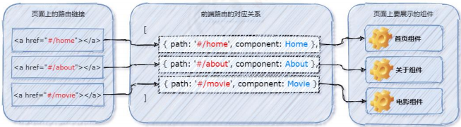

# 前端路由的概念与原理

## 什么是路由？

路由（英文：router）就是对应关系。

## SPA

SPA 指的是一个 web 网站只有唯一的一个 HTML 页面，所有组件的展示与切换都在这唯一的一个页面内完成。此时，不同组件之间的切换需要通过前端路由来实现。

结论：在 SPA 项目中，不同功能之间的切换，要依赖于前端路由来完成！

## 前端路由

通俗易懂的概念：Hash 地址与组件之间的对应关系。

## 前端路由的工作方式

-   用户点击了页面上的路由链接

-   导致了 URL 地址栏中的 Hash 值发生了变化

-   前端路由监听了到 Hash 地址的变化

-   前端路由把当前 Hash 地址对应的组件渲染都浏览器中  
      
    结论：前端路由，指的是 Hash 地址与组件之间的对应关系！

## 实现简易的前端路由

```vue
<template>
<!-- <a> 链接添加对应的 hash 值： -->
    <a href="#/home">Home</a>

    <a href="#/about">About</a>

<!--通过 <component> 标签，结合 组件名 动态渲染组件。-->
    <component :is="comName"></component>

</template>

<script>
export default{
    data(){
        return{
            comName:'Home'
        }
    },
    created(){
        // 在 created 生命周期函数中，
        //监听浏览器地址栏中 hash 地址的变化，
        //动态切换要展示的组件的名称
      window.onhanshchange=()=>{
        switch(location.hash){
            case '#/home':
                this.comName = 'Home'
                break
            case '#/about':
                this.comName = 'About'
                break
        }
      }
    }
}
</script>

```

# vue-router

vue-router 是 vue.js 官方给出的路由解决方案。它只能结合 vue 项目进行使用，能够轻松的管理 SPA 项目中组件的切换。

[vue-router 的官方文档地址](https://router.vuejs.org/zh/)

## 安装 vue-router 包

```javascript
npm install vue-router
```

## 创建路由模块

在 src 源代码目录下，新建 router/index.js 路由模块，并初始化如下的代码：

```javascript
// 导入包
import VueRouter from 'vue-router'
// 将vue-router挂载到vue上
// 创建vue-router实例对象
const router = new VueRouter()
export default router
```

## 导入并挂载路由模块

在 src/main.js 入口文件中，导入并挂载路由模块。示例代码如下：

```javascript
import Vue from 'vue'
import App from './App.vue'
import VueRouter from './router'
Vue.use(VueRouter)
new Vue({
    render:h=>h(App),
    router
}).$mount('#app')

```

## 声明路由链接和占位符

在 src/App.vue 组件中，使用 vue-router 提供的 `<router-link>` 和 `<router-view>` 声明路由链接和占位符：

```vue
<template>
    <!-- 路由跳转 -->
    <router-link to="/home">首页</router-link>

    <!-- 路由展示 -->
    <router-view />
</template>

```

## 声明路由的匹配规则

在 src/router/index.js 路由模块中，通过 routes 数组声明路由的匹配规则。示例代码如下：

```javascript
import VueRouter from 'vue-router'
const router = new VueRouter({
    routes:[
        {path:'/home',component:()=>import('./Home.vue')}
    ]
}) 
```

# vue-router 的常见用法

## 路由重定向

路由重定向指的是：用户在访问地址 A 的时候，强制用户跳转到地址 C ，从而展示特定的组件页面。

通过路由规则的 redirect 属性，指定一个新的路由地址，可以很方便地设置路由的重定向：

```javascript
import VueRouter from "vue-router";
const router = new VueRouter({
  routes: [
    // 重定向到Home组件
    { path: "/", redirect: "/home" },
    { path: "/home", component: () => import("./Home.vue") },
  ],
});
```

## 嵌套路由

```javascript
import VueRouter from "vue-router";
const router = new VueRouter({
  routes: [
    // 重定向到Home组件
    { path: "/", redirect: "/home" },
    { path: "/home", component: () => import("./Home.vue") },
    {
      path: "/page",
      component: Layout,
      children: [
        //嵌套路由
        { path: "/page/page1", component: () => import("./page1.vue") },
      ],
    },
  ],
});
```

## 编程式路由

vue-router 提供了许多编程式导航的 API，其中最常用的导航 API 分别是：

1.  this.$router.push('地址')  
    跳转到指定 hash 地址，并增加一条历史记录
2.  this.$router.replace('地址')  
    跳转到指定的 hash 地址，并替换掉当前的历史记录
3.  this.$router.go(数值 n)  
    实现导航历史前进、后退
4.  $router.back()  
    在历史记录中，后退到上一个页面
5.  $router.forward()  
    在历史记录中，前进到下一个页面

## 路由传参

### 1\. params 传参

```javascript
import VueRouter from "vue-router";
const router = new VueRouter({
  routes: [
    // 定义参数
    { path: "/home/:id", component: () => import("./Home.vue") },
  ],
});

// 使用 $router.push传参
this.$router.push("/home/1");
//接收参数
this.$router.params.id;
```

### 2\. query 传参

```javascript
// 使用 $router.push传参
this.$router.push({ path: "/home/", query: { id: 1 } });
//接收参数
this.$router.query.id;
```

## 全局前置守卫

```javascript
import VueRouter from "vue-router";
const router = new VueRouter({});
router.beforeEach((to, from, next) => {
  // to 将要访问的路由信息对象
  // from 将要离开的路由信息对象
  next();
  //  当前用户拥有后台主页的访问权限，直接放行：next()
  // 当前用户没有后台主页的访问权限，强制其跳转到登录页面：next('/login')
  // 当前用户没有后台主页的访问权限，不允许跳转到后台主页：next(false)
});
```

## 全局后置守卫

```javascript
import VueRouter from "vue-router";
const router = new VueRouter({});
router.afterEach((to, from, next) => {
  // to 将要访问的路由信息对象
  // from 将要离开的路由信息对象
  next();
  //  当前用户拥有后台主页的访问权限，直接放行：next()
  // 当前用户没有后台主页的访问权限，强制其跳转到登录页面：next('/login')
  // 当前用户没有后台主页的访问权限，不允许跳转到后台主页：next(false)
});
```