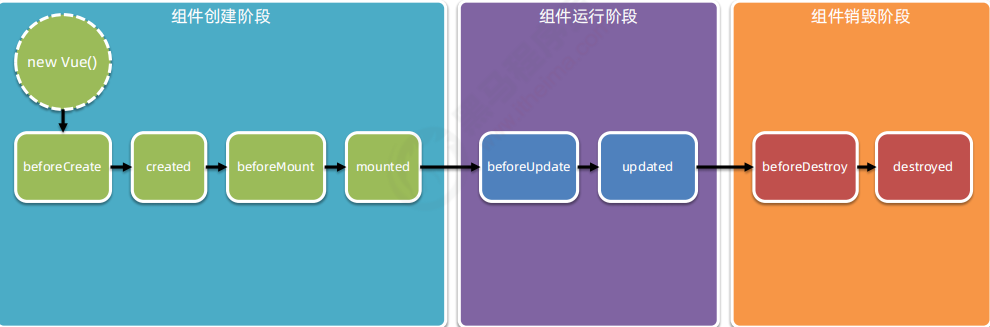

# vue入门

## 什么是 vue

1.  构建用户界面

-   用 vue 往 html 页面中填充数据，非常的方便

2.  框架

-   框架是一套现成的解决方案，程序员只能遵守框架的规范，去编写自己的业务功能！

-   要学习 vue，就是在学习 vue 框架中规定的用法！

-   vue 的指令、组件（是对 UI 结构的复用）、路由、Vuex、vue 组件库

-   只有把上面老师罗列的内容掌握以后，才有开发 vue 项目的能力！

  

## vue 的两个特性

1.  数据驱动视图：

-   数据的变化**会驱动视图**自动更新

-   好处：程序员只管把数据维护好，那么页面结构会被 vue 自动渲染出来！

2.  双向数据绑定：

> 在网页中，form 表单负责**采集数据**，Ajax 负责**提交数据**。

-   js 数据的变化，会被自动渲染到页面上

-   页面上表单采集的数据发生变化的时候，会被 vue 自动获取到，并更新到 js 数据中

> 注意：数据驱动视图和双向数据绑定的底层原理是 MVVM（Mode 数据源、View 视图、ViewModel 就是 vue 的实例）

# 指令

-   本质就是自定义属性
-   Vue中指定都是以 v- 开头

## v-cloak

-   防止页面加载时出现闪烁问题

```html
 <style type="text/css">
  /* 
    1、通过属性选择器 选择到 带有属性 v-cloak的标签  让他隐藏
 */
  [v-cloak]{
    /* 元素隐藏    */
    display: none;
  }
  </style>

<body>
  <div id="app">
    <!-- 2、 让带有插值 语法的   添加 v-cloak 属性 
         在 数据渲染完场之后，v-cloak 属性会被自动去除，
         v-cloak一旦移除也就是没有这个属性了  属性选择器就选择不到该标签
         也就是对应的标签会变为可见
    -->
    <div  v-cloak  >{{msg}}</div>

  </div>

  <script type="text/javascript" src="js/vue.js"></script>

  <script type="text/javascript">
    var vm = new Vue({
      //  el   指定元素 id 是 app 的元素  
      el: '#app',
      //  data  里面存储的是数据
      data: {
        msg: 'Hello Vue'
      }
    });
</script>

</body>

</html>

```

  

## v-text

-   v-text指令用于将数据填充到标签中，作用于插值表达式类似，但是没有闪动问题
-   如果数据中有HTML标签会将html标签一并输出
-   注意：此处为单向绑定，数据对象上的值改变，插值会发生变化；但是当插值发生变化并不会影响数据对象的值

```html
<div id="app">
    <!--  
        注意:在指令中不要写插值语法  直接写对应的变量名称 
        在 v-text 中 赋值的时候不要在写 插值语法
        一般属性中不加 {{}}  直接写 对应 的数据名 
    -->
    <p v-text="msg"></p>

    <p>
        <!-- Vue  中只有在标签的 内容中 才用插值语法 -->
        {{msg}}
    </p>

</div>

<script>
    new Vue({
        el: '#app',
        data: {
            msg: 'Hello Vue.js'
        }
    });

</script>

```

## v-html

-   用法和v-text 相似 但是他可以将HTML片段填充到标签中
-   可能有安全问题, 一般只在可信任内容上使用 `v-html`，**永不**用在用户提交的内容上
-   它与v-text区别在于v-text输出的是纯文本，浏览器不会对其再进行html解析，但v-html会将其当html标签解析后输出。

```html
<div id="app">
　　<p v-html="html"></p> <!-- 输出：html标签在渲染的时候被解析 -->
    
    <p>{{message}}</p> <!-- 输出：<span>通过双括号绑定</span> -->
    
　　<p v-text="text"></p> <!-- 输出：<span>html标签在渲染的时候被源码输出</span> -->
</div>

<script>
　　let app = new Vue({
　　el: "#app",
　　data: {
　　　　message: "<span>通过双括号绑定</span>",
　　　　html: "<span>html标签在渲染的时候被解析</span>",
　　　　text: "<span>html标签在渲染的时候被源码输出</span>",
　　}
 });
</script>

```

## v-pre

-   显示原始信息跳过编译过程
-   跳过这个元素和它的子元素的编译过程。
-   **一些静态的内容不需要编译加这个指令可以加快渲染**

```html
    <span v-pre>{{ this will not be compiled }}</span>    
    <!--  显示的是{{ this will not be compiled }}  -->
    <span v-pre>{{msg}}</span>  
     <!--   即使data里面定义了msg这里仍然是显示的{{msg}}  -->
<script>
    new Vue({
        el: '#app',
        data: {
            msg: 'Hello Vue.js'
        }
    });

</script>

```

## **v-once**

-   执行一次性的插值【当数据改变时，插值处的内容不会继续更新】

```html
  <!-- 即使data里面定义了msg 后期我们修改了 仍然显示的是第一次data里面存储的数据即 Hello Vue.js  -->
     <span v-once>{{ msg}}</span>    
<script>
    new Vue({
        el: '#app',
        data: {
            msg: 'Hello Vue.js'
        }
    });
</script>

```

  

## 双向数据绑定

-   当数据发生变化的时候，视图也就发生变化
-   当视图发生变化的时候，数据也会跟着同步变化

## v-model

-   **v-model**是一个指令，限制在 `<input>、<select>、<textarea>、components`中使用

```html
 <div id="app">
      <div>{{msg}}</div>

      <div>
          当输入框中内容改变的时候，  页面上的msg  会自动更新
        <input type="text" v-model='msg'>
      </div>

  </div>

```

## mvvm

-   MVC 是后端的分层开发概念； MVVM是前端视图层的概念，主要关注于 视图层分离，也就是说：MVVM把前端的视图层，分为了 三部分 Model, View , VM ViewModel
-   m model

-   数据层 Vue 中 数据层 都放在 data 里面

-   v view 视图

-   Vue 中 view 即 我们的HTML页面

-   vm （view-model） 控制器 将数据和视图层建立联系

-   vm 即 Vue 的实例 就是 vm

## v-on

-   用来绑定事件的
-   形式如：v-on:click 缩写为 @click;

## v-on事件函数中传入参数

```html

<body>
    <div id="app">
        <div>{{num}}</div>

        <div>
            <!-- 如果事件直接绑定函数名称，那么默认会传递事件对象作为事件函数的第一个参数 -->
            <button v-on:click='handle1'>点击1</button>

            <!-- 2、如果事件绑定函数调用，那么事件对象必须作为最后一个参数显示传递，
                 并且事件对象的名称必须是$event 
            -->
            <button v-on:click='handle2(123, 456, $event)'>点击2</button>

        </div>

    </div>

    <script type="text/javascript" src="js/vue.js"></script>

    <script type="text/javascript">
        var vm = new Vue({
            el: '#app',
            data: {
                num: 0
            },
            methods: {
                handle1: function(event) {
                    console.log(event.target.innerHTML)
                },
                handle2: function(p, p1, event) {
                    console.log(p, p1)
                    console.log(event.target.innerHTML)
                    this.num++;
                }
            }
        });
    </script>

```

## 事件修饰符

-   在事件处理程序中调用 `event.preventDefault()` 或 `event.stopPropagation()` 是非常常见的需求。
-   Vue 不推荐我们操作DOM 为了解决这个问题，Vue.js 为 `v-on` 提供了**事件修饰符**
-   修饰符是由点开头的指令后缀来表示的

```html
<!-- 阻止单击事件继续传播 -->
<a v-on:click.stop="doThis"></a>

<!-- 提交事件不再重载页面 -->
<form v-on:submit.prevent="onSubmit"></form>

<!-- 修饰符可以串联   即阻止冒泡也阻止默认事件 -->
<a v-on:click.stop.prevent="doThat"></a>

<!-- 只当在 event.target 是当前元素自身时触发处理函数 -->
<!-- 即事件不是从内部元素触发的 -->
<div v-on:click.self="doThat">...</div>

使用修饰符时，顺序很重要；相应的代码会以同样的顺序产生。因此，用 v-on:click.prevent.self 会阻止所有的点击，而 v-on:click.self.prevent 只会阻止对元素自身的点击。
```

## 按键修饰符

-   在做项目中有时会用到键盘事件，在监听键盘事件时，我们经常需要检查详细的按键。Vue 允许为 `v-on` 在监听键盘事件时添加按键修饰符

```html
<!-- 只有在 `keyCode` 是 13 时调用 `vm.submit()` -->
<input v-on:keyup.13="submit">

<!-- -当点击enter 时调用 `vm.submit()` -->
<input v-on:keyup.enter="submit">

<!--当点击enter或者space时  时调用 `vm.alertMe()`   -->
<input type="text" v-on:keyup.enter.space="alertMe" >

常用的按键修饰符
.enter =>    enter键
.tab => tab键
.delete (捕获“删除”和“退格”按键) =>  删除键
.esc => 取消键
.space =>  空格键
.up =>  上
.down =>  下
.left =>  左
.right =>  右

<script>
    var vm = new Vue({
        el:"#app",
        methods: {
              submit:function(){},
              alertMe:function(){},
        }
    })

</script>

```

## 自定义按键修饰符别名

-   在Vue中可以通过`config.keyCodes`自定义按键修饰符别名

```html
<div id="app">
    预先定义了keycode 116（即F5）的别名为f5，因此在文字输入框中按下F5，会触发prompt方法
    <input type="text" v-on:keydown.f5="prompt()">
</div>

<script>
    
    Vue.config.keyCodes.f5 = 116;

    let app = new Vue({
        el: '#app',
        methods: {
            prompt: function() {
                alert('我是 F5！');
            }
        }
    });
</script>

```

## v-bind

-   v-bind 指令被用来响应地更新 HTML 属性
-   v-bind:href 可以缩写为 :href;

```html
<!-- 绑定一个属性 -->


<!-- 缩写 -->

```

## 绑定对象

-   我们可以给v-bind:class 一个对象，以动态地切换class。
-   注意：v-bind:class指令可以与普通的class特性共存

```html
<!-- 1、 v-bind 中支持绑定一个对象 
    如果绑定的是一个对象 则 键为 对应的类名  值 为对应data中的数据  -->
<!-- 
    HTML最终渲染为 <ul class="box textColor textSize"></ul>

    注意：
        textColor，textSize  对应的渲染到页面上的CSS类名	
        isColor，isSize  对应vue data中的数据  如果为true 则对应的类名 渲染到页面上 

        当 isColor 和 isSize 变化时，class列表将相应的更新，
        例如，将isSize改成false，
        class列表将变为 <ul class="box textColor"></ul>

-->

<ul class="box" v-bind:class="{textColor:isColor, textSize:isSize}">
    <li>学习Vue</li>

    <li>学习Node</li>

    <li>学习React</li>

</ul>

  <div v-bind:style="{color:activeColor,fontSize:activeSize}">对象语法</div>

<script>
var vm= new Vue({
    el:'.box',
    data:{
        isColor:true,
        isSize:true，
        activeColor:"red",
        activeSize:"25px",
    }
})
</script>

<style>

    .box{
        border:1px dashed #f0f;
    }
    .textColor{
        color:#f00;
        background-color:#eef;
    }
    .textSize{
        font-size:30px;
        font-weight:bold;
    }
</style>

```

## 绑定class

```html
<!-- 2、  v-bind 中支持绑定一个数组    数组中classA和 classB 对应为data中的数据 -->

这里的classA  对用data 中的  classA
这里的classB  对用data 中的  classB
<ul class="box" :class="[classA, classB]">
    <li>学习Vue</li>

    <li>学习Node</li>

    <li>学习React</li>

</ul>

<script>
var vm= new Vue({
    el:'.box',
    data:{
        classA:‘textColor‘,
        classB:‘textSize‘
    }
})
</script>

<style>
    .box{
        border:1px dashed #f0f;
    }
    .textColor{
        color:#f00;
        background-color:#eef;
    }
    .textSize{
        font-size:30px;
        font-weight:bold;
    }
</style>

```

## 绑定对象和绑定数组 的区别

-   绑定对象的时候 对象的属性 即要渲染的类名 对象的属性值对应的是 data 中的数据
-   绑定数组的时候数组里面存的是data 中的数据

## 绑定style

```html
 <div v-bind:style="styleObject">绑定样式对象</div>'
 
<!-- CSS 属性名可以用驼峰式 (camelCase) 或短横线分隔 (kebab-case，记得用单引号括起来)    -->
 <div v-bind:style="{ color: activeColor, fontSize: fontSize,background:'red' }">内联样式</div>

<!--组语法可以将多个样式对象应用到同一个元素 -->
<div v-bind:style="[styleObj1, styleObj2]"></div>

<script>
    new Vue({
      el: '#app',
      data: {
        styleObject: {
          color: 'green',
          fontSize: '30px',
          background:'red'
        }，
        activeColor: 'green',
           fontSize: "30px"
      },
      styleObj1: {
             color: 'red'
       },
       styleObj2: {
            fontSize: '30px'
       }

</script>

```

## 分支结构

## v-if 使用场景

-   1- 多个元素 通过条件判断展示或者隐藏某个元素。或者多个元素
-   2- 进行两个视图之间的切换

```html
<div id="app">
        <!--  判断是否加载，如果为真，就加载，否则不加载-->
        <span v-if="flag">
           如果flag为true则显示,false不显示!
        </span>

</div>

<script>
    var vm = new Vue({
        el:"#app",
        data:{
            flag:true
        }
    })
</script>

----------------------------------------------------------

    <div v-if="type === 'A'">
       A
    </div>

  <!-- v-else-if紧跟在v-if或v-else-if之后   表示v-if条件不成立时执行-->
    <div v-else-if="type === 'B'">
       B
    </div>

    <div v-else-if="type === 'C'">
       C
    </div>

  <!-- v-else紧跟在v-if或v-else-if之后-->
    <div v-else>
       Not A/B/C
    </div>

<script>
    new Vue({
      el: '#app',
      data: {
        type: 'C'
      }
    })
</script>

```

## v-show 和 v-if的区别

-   v-show本质就是标签display设置为none，控制隐藏

-   v-show只编译一次，后面其实就是控制css，而v-if不停的销毁和创建，故v-show性能更好一点。

-   v-if是动态的向DOM树内添加或者删除DOM元素

-   v-if切换有一个局部编译/卸载的过程，切换过程中合适地销毁和重建内部的事件监听和子组件

## 循环结构

## v-for

-   用于循环的数组里面的值可以是对象，也可以是普通元素

```html
<ul id="example-1">
   <!-- 循环结构-遍历数组  
    item 是我们自己定义的一个名字  代表数组里面的每一项  
    items对应的是 data中的数组-->
  <li v-for="item in items">
    {{ item.message }}
  </li> 

</ul>

<script>
 new Vue({
  el: '#example-1',
  data: {
    items: [
      { message: 'Foo' },
      { message: 'Bar' }
    ]，
   
  }
})
</script>

```

-   **不推荐**同时使用 `v-if` 和 `v-for`
-   当 `v-if` 与 `v-for` 一起使用时，`v-for` 具有比 `v-if` 更高的优先级。

```html
   <!--  循环结构-遍历对象
        v 代表   对象的value
        k  代表对象的 键 
        i  代表索引	
    ---> 
     <div v-if='v==13' v-for='(v,k,i) in obj'>{{v + '---' + k + '---' + i}}</div>

<script>
 new Vue({
  el: '#example-1',
  data: {
    items: [
      { message: 'Foo' },
      { message: 'Bar' }
    ]，
    obj: {
        uname: 'zhangsan',
        age: 13,
        gender: 'female'
    }
  }
})
</script>

```

-   key 的作用

-   **key来给每个节点做一个唯一标识**
-   **key的作用主要是为了高效的更新虚拟DOM**

```html
<ul>
  <li v-for="item in items" :key="item.id">...</li>

</ul>

```

## 自定义指令

-   内置指令不能满足我们特殊的需求
-   Vue允许我们自定义指令

## Vue.directive 注册全局指令

```html
<!-- 
  使用自定义的指令，只需在对用的元素中，加上'v-'的前缀形成类似于内部指令'v-if'，'v-text'的形式。 
-->
<input type="text" v-focus>
<script>
// 注意点： 
//   1、 在自定义指令中  如果以驼峰命名的方式定义 如  Vue.directive('focusA',function(){}) 
//   2、 在HTML中使用的时候 只能通过 v-focus-a 来使用 
    
// 注册一个全局自定义指令 v-focus
Vue.directive('focus', {
      // 当绑定元素插入到 DOM 中。 其中 el为dom元素
      inserted: function (el) {
            // 聚焦元素
            el.focus();
     }
});
new Vue({
　　el:'#app'
});
</script>

```

## Vue.directive 注册全局指令 带参数

```html
  <input type="text" v-color='msg'>
 <script type="text/javascript">
    /*
      自定义指令-带参数
      bind - 只调用一次，在指令第一次绑定到元素上时候调用

    */
    Vue.directive('color', {
      // bind声明周期, 只调用一次，指令第一次绑定到元素时调用。在这里可以进行一次性的初始化设置
      // el 为当前自定义指令的DOM元素  
      // binding 为自定义的函数形参   通过自定义属性传递过来的值 存在 binding.value 里面
      bind: function(el, binding){
        // 根据指令的参数设置背景色
        // console.log(binding.value.color)
        el.style.backgroundColor = binding.value.color;
      }
    });
    var vm = new Vue({
      el: '#app',
      data: {
        msg: {
          color: 'blue'
        }
      }
    });
  </script>

```

## 自定义指令局部指令

-   局部指令，需要定义在 directives 的选项 用法和全局用法一样
-   局部指令只能在当前组件里面使用
-   当全局指令和局部指令同名时以局部指令为准

```html
<input type="text" v-color='msg'>
 <input type="text" v-focus>
 <script type="text/javascript">
    /*
      自定义指令-局部指令
    */
    var vm = new Vue({
      el: '#app',
      data: {
        msg: {
          color: 'red'
        }
      },
         //局部指令，需要定义在  directives 的选项
      directives: {
        color: {
          bind: function(el, binding){
            el.style.backgroundColor = binding.value.color;
          }
        },
        focus: {
          inserted: function(el) {
            el.focus();
          }
        }
      }
    });
  </script>

```

## 表单基本操作

-   获取单选框中的值

```html
     <!-- 
        1、 两个单选框需要同时通过v-model 双向绑定 一个值 
        2、 每一个单选框必须要有value属性  且value 值不能一样 
        3、 当某一个单选框选中的时候 v-model  会将当前的 value值 改变 data 中的 数据

        gender 的值就是选中的值，我们只需要实时监控他的值就可以了
    -->
   <input type="radio" id="male" value="1" v-model='gender'>
   <label for="male">男</label>

   <input type="radio" id="female" value="2" v-model='gender'>
   <label for="female">女</label>

<script>
    new Vue({
         data: {
             // 默认会让当前的 value 值为 2 的单选框选中
                gender: 2,  
            },
    })

</script>

```

-   通过v-model

-   获取复选框中的值

```html
    <!-- 
        1、 复选框需要同时通过v-model 双向绑定 一个值 
        2、 每一个复选框必须要有value属性  且value 值不能一样 
        3、 当某一个单选框选中的时候 v-model  会将当前的 value值 改变 data 中的 数据

        hobby 的值就是选中的值，我们只需要实时监控他的值就可以了
    -->

<div>
   <span>爱好：</span>

   <input type="checkbox" id="ball" value="1" v-model='hobby'>
   <label for="ball">篮球</label>

   <input type="checkbox" id="sing" value="2" v-model='hobby'>
   <label for="sing">唱歌</label>

   <input type="checkbox" id="code" value="3" v-model='hobby'>
   <label for="code">写代码</label>

 </div>

<script>
    new Vue({
         data: {
                // 默认会让当前的 value 值为 2 和 3 的复选框选中
                hobby: ['2', '3'],
            },
    })
</script>

```

-   通过v-model
-   和获取单选框中的值一样
-   复选框 `checkbox` 这种的组合时 data 中的 hobby 我们要定义成数组 否则无法实现多选

-   获取下拉框和文本框中的值

```html
   <div>
      <span>职业：</span>

       <!--
            1、 需要给select  通过v-model 双向绑定 一个值 
            2、 每一个option  必须要有value属性  且value 值不能一样 
            3、 当某一个option选中的时候 v-model  会将当前的 value值 改变 data 中的 数据
             occupation 的值就是选中的值，我们只需要实时监控他的值就可以了
        -->
       <!-- multiple  多选 -->
      <select v-model='occupation' multiple>
          <option value="0">请选择职业...</option>

          <option value="1">教师</option>

          <option value="2">软件工程师</option>

          <option value="3">律师</option>

      </select>

         <!-- textarea 是 一个双标签   不需要绑定value 属性的  -->
        <textarea v-model='desc'></textarea>

  </div>

<script>
    new Vue({
         data: {
                // 默认会让当前的 value 值为 2 和 3 的下拉框选中
                 occupation: ['2', '3'],
                  desc: 'nihao'
            },
    })
</script>

```

-   通过v-model

## 表单修饰符

-   .number 转换为数值

-   注意点：
-   当开始输入非数字的字符串时，因为Vue无法将字符串转换成数值
-   所以属性值将实时更新成相同的字符串。即使后面输入数字，也将被视作字符串。

-   .trim 自动过滤用户输入的首尾空白字符

-   只能去掉首尾的 不能去除中间的空格

-   .lazy 将input事件切换成change事件

-   .lazy 修饰符延迟了同步更新属性值的时机。即将原本绑定在 input 事件的同步逻辑转变为绑定在 change 事件上

-   在失去焦点 或者 按下回车键时才更新

```html
<!-- 自动将用户的输入值转为数值类型 -->
<input v-model.number="age" type="number">

<!--自动过滤用户输入的首尾空白字符   -->
<input v-model.trim="msg">

<!-- 在“change”时而非“input”时更新 -->
<input v-model.lazy="msg" >
```

  

# 组件

-   组件 (Component) 是 Vue.js 最强大的功能之一
-   组件可以扩展 HTML 元素，封装可重用的代

## 组件注册

### 1.全局注册

-   Vue.component('组件名称', { }) 第 1 个参数是标签名称，第 2 个参数是一个选项对象
-   **全局组件**注册后，任何**vue 实例**都可以用

### 2.组件基础用

```html
<div id="example">
  <!-- 2、 组件使用 组件名称 是以HTML标签的形式使用  -->
  <my-component></my-component>

</div>

<script>
  //   注册组件
  // 1、 my-component 就是组件中自定义的标签名
  Vue.component("my-component", {
    template: "<div>A custom component!</div>",
  });

  // 创建根实例
  new Vue({
    el: "#example",
  });
</script>

```

### 3.组件注意事项

-   组件参数的 data 值必须是函数同时这个函数要求返回一个对象
-   组件模板必须是单个根元素
-   组件模板的内容可以是模板字符串

```html
<div id="app">
  <!-- 
        4、  组件可以重复使用多次 
          因为data中返回的是一个对象所以每个组件中的数据是私有的
          即每个实例可以维护一份被返回对象的独立的拷贝   
    -->
  <button-counter></button-counter>

  <button-counter></button-counter>

  <button-counter></button-counter>

  <!-- 8、必须使用短横线的方式使用组件 -->
  <hello-world></hello-world>

</div>

<script type="text/javascript">
  //5  如果使用驼峰式命名组件，那么在使用组件的时候，只能在字符串模板中用驼峰的方式使用组件，
  // 7、但是在普通的标签模板中，必须使用短横线的方式使用组件
  Vue.component("HelloWorld", {
    data: function () {
      return {
        msg: "HelloWorld",
      };
    },
    template: "<div>{{msg}}</div>",
  });

  Vue.component("button-counter", {
    // 1、组件参数的data值必须是函数
    // 同时这个函数要求返回一个对象
    data: function () {
      return {
        count: 0,
      };
    },
    //  2、组件模板必须是单个根元素
    //  3、组件模板的内容可以是模板字符串
    template: `
        <div>
          <button @click="handle">点击了{{count}}次</button>

          <button>测试123</button>

            #  6 在字符串模板中可以使用驼峰的方式使用组件	
           <HelloWorld></HelloWorld>

        </div>

      `,
    methods: {
      handle: function () {
        this.count += 2;
      },
    },
  });
  var vm = new Vue({
    el: "#app",
    data: {},
  });
</script>

```

### 4.局部注册

-   只能在当前注册它的 vue 实例中使用

```html
<div id="app">
  <my-component></my-component>

</div>

<script>
  // 定义组件的模板
  var Child = {
    template: "<div>A custom component!</div>",
  };
  new Vue({
    //局部注册组件
    components: {
      // <my-component> 将只在父模板可用  一定要在实例上注册了才能在html文件中使用
      "my-component": Child,
    },
  });
</script>

```

## Vue 组件之间传值

### 1.父组件向子组件传值

-   父组件发送的形式是以属性的形式绑定值到子组件身上。
-   然后子组件用属性 props 接收
-   在 props 中使用驼峰形式，模板中需要使用短横线的形式字符串形式的模板中没有这个限制

```html
<div id="app">
  <div>{{pmsg}}</div>

  <!--1、menu-item  在 APP中嵌套着 故 menu-item   为  子组件      -->
  <!-- 给子组件传入一个静态的值 -->
  <menu-item title="来自父组件的值"></menu-item>

  <!-- 2、 需要动态的数据的时候 需要属性绑定的形式设置 此时 ptitle  来自父组件data 中的数据 . 
          传的值可以是数字、对象、数组等等
    -->
  <menu-item :title="ptitle" content="hello"></menu-item>

</div>

<script type="text/javascript">
  Vue.component("menu-item", {
    // 3、 子组件用属性props接收父组件传递过来的数据
    props: ["title", "content"],
    data: function () {
      return {
        msg: "子组件本身的数据",
      };
    },
    template: '<div>{{msg + "----" + title + "-----" + content}}</div>',
  });
  var vm = new Vue({
    el: "#app",
    data: {
      pmsg: "父组件中内容",
      ptitle: "动态绑定属性",
    },
  });
</script>

```

### 2.子组件向父组件传值

-   子组件用`$emit()`触发事件
-   `$emit()` 第一个参数为 自定义的事件名称 第二个参数为需要传递的数据
-   父组件用 v-on 监听子组件的事件

```html
<div id="app">
  <div :style='{fontSize: fontSize + "px"}'>{{pmsg}}</div>

  <!-- 2 父组件用v-on 监听子组件的事件
        这里 enlarge-text  是从 $emit 中的第一个参数对应   handle 为对应的事件处理函数	
    -->
  <menu-item :parr="parr" @enlarge-text="handle($event)"></menu-item>

</div>

<script type="text/javascript" src="js/vue.js"></script>

<script type="text/javascript">
  /*
      子组件向父组件传值-携带参数
    */

  Vue.component("menu-item", {
    props: ["parr"],
    template: `
        <div>
          <ul>
            <li :key='index' v-for='(item,index) in parr'>{{item}}</li>

          </ul>

            ###  1、子组件用$emit()触发事件
            ### 第一个参数为 自定义的事件名称   第二个参数为需要传递的数据  
          <button @click='$emit("enlarge-text", 5)'>扩大父组件中字体大小</button>

          <button @click='$emit("enlarge-text", 10)'>扩大父组件中字体大小</button>

        </div>

      `,
  });
  var vm = new Vue({
    el: "#app",
    data: {
      pmsg: "父组件中内容",
      parr: ["apple", "orange", "banana"],
      fontSize: 10,
    },
    methods: {
      handle: function (val) {
        // 扩大字体大小
        this.fontSize += val;
      },
    },
  });
</script>

```

### 3.兄弟之间的传递

-   兄弟之间传递数据需要借助于事件中心，通过事件中心传递数据

-   提供事件中心 var hub = new Vue()

-   传递数据方，通过一个事件触发 hub.$emit(方法名，传递的数据)
-   接收数据方，通过 mounted(){} 钩子中 触发 hub.$on()方法名
-   销毁事件 通过 hub.$off()方法名销毁之后无法进行传递数据

```html
<div id="app">
  <div>父组件</div>

  <div>
    <button @click="handle">销毁事件</button>

  </div>

  <test-tom></test-tom>

  <test-jerry></test-jerry>

</div>

<script type="text/javascript" src="js/vue.js"></script>

<script type="text/javascript">
  /*
      兄弟组件之间数据传递
    */
  //1、 提供事件中心
  var hub = new Vue();

  Vue.component("test-tom", {
    data: function () {
      return {
        num: 0,
      };
    },
    template: `
        <div>
          <div>TOM:{{num}}</div>

          <div>
            <button @click='handle'>点击</button>

          </div>

        </div>

      `,
    methods: {
      handle: function () {
        //2、传递数据方，通过一个事件触发hub.$emit(方法名，传递的数据)   触发兄弟组件的事件
        hub.$emit("jerry-event", 2);
      },
    },
    mounted: function () {
      // 3、接收数据方，通过mounted(){} 钩子中  触发hub.$on(方法名
      hub.$on("tom-event", (val) => {
        this.num += val;
      });
    },
  });
  Vue.component("test-jerry", {
    data: function () {
      return {
        num: 0,
      };
    },
    template: `
        <div>
          <div>JERRY:{{num}}</div>

          <div>
            <button @click='handle'>点击</button>

          </div>

        </div>

      `,
    methods: {
      handle: function () {
        //2、传递数据方，通过一个事件触发hub.$emit(方法名，传递的数据)   触发兄弟组件的事件
        hub.$emit("tom-event", 1);
      },
    },
    mounted: function () {
      // 3、接收数据方，通过mounted(){} 钩子中  触发hub.$on()方法名
      hub.$on("jerry-event", (val) => {
        this.num += val;
      });
    },
  });
  var vm = new Vue({
    el: "#app",
    data: {},
    methods: {
      handle: function () {
        //4、销毁事件 通过hub.$off()方法名销毁之后无法进行传递数据
        hub.$off("tom-event");
        hub.$off("jerry-event");
      },
    },
  });
</script>

```

## 组件插槽

-   组件的最大特性就是复用性，而用好插槽能大大提高组件的可复用能力

### 1.匿名插槽

```html
  <div id="app">
    <!-- 这里的所有组件标签中嵌套的内容会替换掉slot  如果不传值 则使用 slot 中的默认值  -->
    <alert-box>有bug发生</alert-box>

    <alert-box>有一个警告</alert-box>

    <alert-box></alert-box>

  </div>

  <script type="text/javascript">
    /*
      组件插槽：父组件向子组件传递内容
    */
    Vue.component('alert-box', {
      template: `
        <div>
          <strong>ERROR:</strong>

        # 当组件渲染的时候，这个 <slot> 元素将会被替换为“组件标签中嵌套的内容”。
        # 插槽内可以包含任何模板代码，包括 HTML
          <slot>默认内容</slot>

        </div>

      `
    });
    var vm = new Vue({
      el: '#app',
      data: {

      }
    });
  </script>

</body>

</html>

```

### 2.具名插槽

-   具有名字的插槽
-   使用 `<slot>` 中的 "name" 属性绑定元素

```html
<div id="app">
    <base-layout>
       <!-- 2、 通过slot属性来指定, 这个slot的值必须和下面slot组件得name值对应上
                如果没有匹配到 则放到匿名的插槽中   -->
      <p slot='header'>标题信息</p>

      <p>主要内容1</p>

      <p>主要内容2</p>

      <p slot='footer'>底部信息信息</p>

    </base-layout>

    <base-layout>
      <!-- 注意点：template临时的包裹标签最终不会渲染到页面上     -->
      <template slot='header'>
        <p>标题信息1</p>

        <p>标题信息2</p>

      </template>

      <p>主要内容1</p>

      <p>主要内容2</p>

      <template slot='footer'>
        <p>底部信息信息1</p>

        <p>底部信息信息2</p>

      </template>

    </base-layout>

  </div>

  <script type="text/javascript" src="js/vue.js"></script>

  <script type="text/javascript">
    /*
      具名插槽
    */
    Vue.component('base-layout', {
      template: `
        <div>
          <header>
            ###	1、 使用 <slot> 中的 "name" 属性绑定元素 指定当前插槽的名字
            <slot name='header'></slot>

          </header>

          <main>
            <slot></slot>

          </main>

          <footer>
            ###  注意点：
            ###  具名插槽的渲染顺序，完全取决于模板，而不是取决于父组件中元素的顺序
            <slot name='footer'></slot>

          </footer>

        </div>

      `
    });
    var vm = new Vue({
      el: '#app',
      data: {

      }
    });
  </script>

</body>

</html>

```

### 3.作用域插槽

-   父组件对子组件加工处理
-   既可以复用子组件的 slot，又可以使 slot 内容不一致

```html
  <div id="app">
    <!--
        1、当我们希望li 的样式由外部使用组件的地方定义，因为可能有多种地方要使用该组件，
        但样式希望不一样 这个时候我们需要使用作用域插槽

    -->
    <fruit-list :list='list'>
       <!-- 2、 父组件中使用了<template>元素,而且包含scope="slotProps",
            slotProps在这里只是临时变量
        --->
      <template slot-scope='slotProps'>
        <strong v-if='slotProps.info.id==3' class="current">
            {{slotProps.info.name}}
         </strong>

        <span v-else>{{slotProps.info.name}}</span>

      </template>

    </fruit-list>

  </div>

  <script type="text/javascript" src="js/vue.js"></script>

  <script type="text/javascript">
    /*
      作用域插槽
    */
    Vue.component('fruit-list', {
      props: ['list'],
      template: `
        <div>
          <li :key='item.id' v-for='item in list'>
            ###  3、 在子组件模板中,<slot>元素上有一个类似props传递数据给组件的写法msg="xxx",
            ###   插槽可以提供一个默认内容，如果如果父组件没有为这个插槽提供了内容，会显示默认的内容。
                    如果父组件为这个插槽提供了内容，则默认的内容会被替换掉
            <slot :info='item'>{{item.name}}</slot>

          </li>

        </div>

      `
    });
    var vm = new Vue({
      el: '#app',
      data: {
        list: [{
          id: 1,
          name: 'apple'
        },{
          id: 2,
          name: 'orange'
        },{
          id: 3,
          name: 'banana'
        }]
      }
    });
  </script>

</body>

</html>

```

# 生命周期

生命周期（Life Cycle）是指一个组件从创建 -> 运行 -> 销毁的整个阶段，强调的是一个时间段。

生命周期函数：是由 vue 框架提供的内置函数，会伴随着组件的生命周期，自动按次序执行。

注意：生命周期强调的是时间段，生命周期函数强调的是时间点。  


## 常用的钩子函数

| beforeCreate | 在实例初始化之后，数据观测和事件配置之前被调用 此时data 和 methods 以及页面的DOM结构都没有初始化 什么都做不了 |
| --- | --- |
| created | 在实例创建完成后被立即调用此时data 和 methods已经可以使用 但是页面还没有渲染出来 |
| beforeMount | 在挂载开始之前被调用 此时页面上还看不到真实数据 只是一个模板页面而已 |
| mounted | el被新创建的vm.$el替换，并挂载到实例上去之后调用该钩子。 数据已经真实渲染到页面上 在这个钩子函数里面我们可以使用一些第三方的插件 |
| beforeUpdate | 数据更新时调用，发生在虚拟DOM打补丁之前。 页面上数据还是旧的 |
| updated | 由于数据更改导致的虚拟DOM重新渲染和打补丁，在这之后会调用该钩子。 页面上数据已经替换成最新的 |
| beforeDestroy | 实例销毁之前调用 |
| destroyed | 实例销毁后调用 |

# 计算属性 computed

-   模板中放入太多的逻辑会让模板过重且难以维护 使用计算属性可以让模板更加的简洁
-   **计算属性是基于它们的响应式依赖进行缓存的**
-   computed比较适合对多个变量或者对象进行处理后返回一个结果值，也就是数多个变量中的某一个值发生了变化则我们监控的这个值也就会发生变化

```html
 <div id="app">
     <!--  
        当多次调用 reverseString  的时候 
        只要里面的 num 值不改变 他会把第一次计算的结果直接返回
        直到data 中的num值改变 计算属性才会重新发生计算
     -->
    <div>{{reverseString}}</div>

    <div>{{reverseString}}</div>

     <!-- 调用methods中的方法的时候  他每次会重新调用 -->
    <div>{{reverseMessage()}}</div>

    <div>{{reverseMessage()}}</div>

  </div>

  <script type="text/javascript">
    /*
      计算属性与方法的区别:计算属性是基于依赖进行缓存的，而方法不缓存
    */
    var vm = new Vue({
      el: '#app',
      data: {
        msg: 'Nihao',
        num: 100
      },
      methods: {
        reverseMessage: function(){
          console.log('methods')
          return this.msg.split('').reverse().join('');
        }
      },
      //computed  属性 定义 和 data 已经 methods 平级 
      computed: {
        //  reverseString   这个是我们自己定义的名字 
        reverseString: function(){
          console.log('computed')
          var total = 0;
          //  当data 中的 num 的值改变的时候  reverseString  会自动发生计算  
          for(var i=0;i<=this.num;i++){
            total += i;
          }
          // 这里一定要有return 否则 调用 reverseString 的 时候无法拿到结果    
          return total;
        }
      }
    });
  </script>

```

# 侦听器 watch

-   使用watch来响应数据的变化
-   一般用于异步或者开销较大的操作
-   watch 中的属性 一定是data 中 已经存在的数据
-   **当需要监听一个对象的改变时，普通的watch方法无法监听到对象内部属性的改变，只有data中的数据才能够监听到变化，此时就需要deep属性对对象进行深度监听**

```html
 <div id="app">
        <div>
            <span>名：</span>

            <span>
        <input type="text" v-model='firstName'>
      </span>

        </div>

        <div>
            <span>姓：</span>

            <span>
        <input type="text" v-model='lastName'>
      </span>

        </div>

        <div>{{fullName}}</div>

    </div>

  <script type="text/javascript">
        /*
              侦听器
            */
        var vm = new Vue({
            el: '#app',
            data: {
                firstName: 'Jim',
                lastName: 'Green',
                // fullName: 'Jim Green'
            },
             //watch  属性 定义 和 data 已经 methods 平级 
            watch: {
                //   注意：  这里firstName  对应着data 中的 firstName 
                //   当 firstName 值 改变的时候  会自动触发 watch
                firstName: function(val) {
                    this.fullName = val + ' ' + this.lastName;
                },
                //   注意：  这里 lastName 对应着data 中的 lastName 
                lastName: function(val) {
                    this.fullName = this.firstName + ' ' + val;
                }
            }
        });
    </script>

```

# 过滤器

-   Vue.js允许自定义过滤器，可被用于一些常见的文本格式化。
-   过滤器可以用在两个地方：双花括号插值和v-bind表达式。
-   过滤器应该被添加在JavaScript表达式的尾部，由“管道”符号指示
-   支持级联操作
-   过滤器不改变真正的`data`，而只是改变渲染的结果，并返回过滤后的版本
-   全局注册时是filter，没有s的。而局部过滤器是filters，是有s的

```html
  <div id="app">
    <input type="text" v-model='msg'>
      <!-- upper 被定义为接收单个参数的过滤器函数，表达式  msg  的值将作为参数传入到函数中 -->
    <div>{{msg | upper}}</div>

    <!--  
      支持级联操作
      upper  被定义为接收单个参数的过滤器函数，表达式msg 的值将作为参数传入到函数中。
      然后继续调用同样被定义为接收单个参数的过滤器 lower ，将upper 的结果传递到lower中
     -->
    <div>{{msg | upper | lower}}</div>

    <div :abc='msg | upper'>测试数据</div>

  </div>

<script type="text/javascript">
   //  lower  为全局过滤器     
   Vue.filter('lower', function(val) {
      return val.charAt(0).toLowerCase() + val.slice(1);
    });
    var vm = new Vue({
      el: '#app',
      data: {
        msg: ''
      },
       //filters  属性 定义 和 data 已经 methods 平级 
       //  定义filters 中的过滤器为局部过滤器 
      filters: {
        //   upper  自定义的过滤器名字 
        //    upper 被定义为接收单个参数的过滤器函数，表达式  msg  的值将作为参数传入到函数中
        upper: function(val) {
         //  过滤器中一定要有返回值 这样外界使用过滤器的时候才能拿到结果
          return val.charAt(0).toUpperCase() + val.slice(1);
        }
      }
    });
  </script>

```

## 过滤器中传递参数

```html
    <div id="box">
        <!--
            filterA 被定义为接收三个参数的过滤器函数。
              其中 message 的值作为第一个参数，
            普通字符串 'arg1' 作为第二个参数，表达式 arg2 的值作为第三个参数。
        -->
        {{ message | filterA('arg1', 'arg2') }}
    </div>

    <script>
        // 在过滤器中 第一个参数 对应的是  管道符前面的数据   n  此时对应 message
        // 第2个参数  a 对应 实参  arg1 字符串
        // 第3个参数  b 对应 实参  arg2 字符串
        Vue.filter('filterA',function(n,a,b){
            if(n<10){
                return n+a;
            }else{
                return n+b;
            }
        });
        
        new Vue({
            el:"#box",
            data:{
                message: "哈哈哈"
            }
        })

    </script>

```
