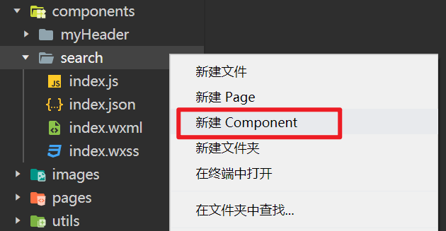
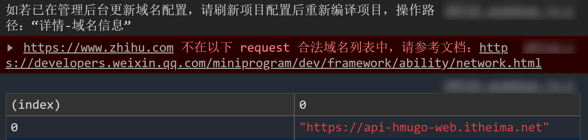
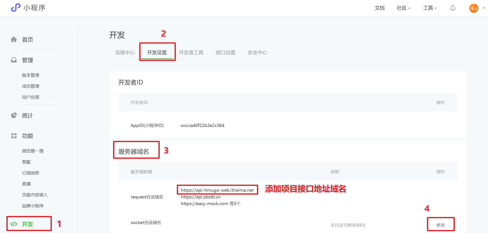
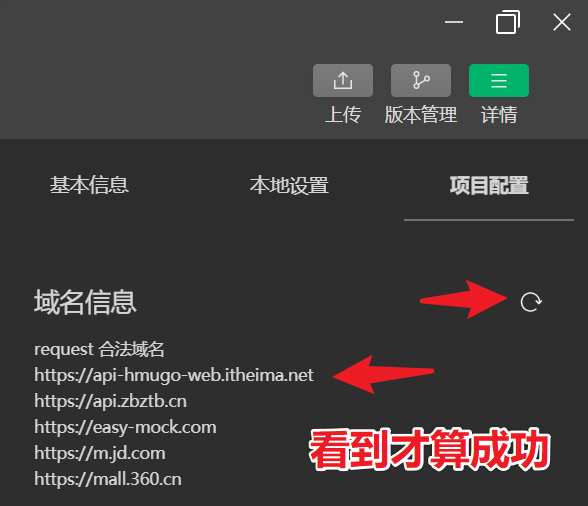

# 小程序 WXML 模板语法

## 属性绑定

在小程序中不管是属性值，还是标签的内容，数据绑定统一都是用两对花括号 `{{ }}`

```javascript
// ✅ 正确写法
autoplay="{{false}}"          值是布尔类型

// ❌ 常见错误
autoplay="false"       		  值是字符串
:autoplay="false"		      这是 Vue 的写法，小程序不不生效
```

## 变量绑定

1.  在 `js` 文件中定义变量和值

```javascript
Page({
  /** * 页面的初始数据 */
  data: {
    // msg 变量可以直接在页面中通过 {{ msg }}  使用
    msg: '狠话',
    activeIndex: 0,
  },
})
```

2.  在 `wxml` 模板文件中使用。

```jsx
<view>{{ msg }}</view>

<button class="{{  activeIndex === 0 ? 'active' : ''  }}">选中</button>

```

## 列表渲染

1.  在 `js` 文件中定义数组

```jsx
Page({
  /** * 页面的初始数据 */
  data: {
    foodsList : [
      { id:1, food:'猪脚饭',price:13 },
      { id:2, food:'黄焖鸡米饭',price:15 },
      { id:3, food:'煲仔饭',price:16 },
      { id:4, food:'肠粉',price:4.5 },
    ],
    searchTips: ['鞋子','衣服','帽子','老婆']
  },
})
```

2.  在 `wxml` 文件中列表渲染

```jsx
// ✅ 正确写法      wx:for   和   wx:key 
<view wx:for="{{ foodsList }}" wx:key="id">
  {{ index }} 食物名称：{{ item.food }}  -- 价格： {{ item.price }}
</view>

// ✅ 正确写法 - 变量改名      wx:for-item  和   wx:for-index
<view 
  wx:for="{{ foodsList }}" 
  wx:for-item="aa"
  wx:for-index="bb"
  wx:key="id"  
>
  {{ bb }} 食物名称：{{ aa.food }}  -- 价格： {{ aa.price }}
</view>

// ✅ 特殊的 key 值写法，无重复项的字符串数组    *this    
<view wx:for="{{ searchTips }}" wx:key="*this">
   {{ item }}
</view>

// ❌ 常见错误 - Vue 的写法在小程序中不支持
<view v-for="(item,index) in foodsList" :key="item.id">
  食物名称：{{ item.food }}  -- 价格： {{ item.price }}
</view>

```

## 列表渲染写法对比小结

1.  `wx:key="id"` ，直接写对象的属性名即可， 无需写 `item.` 。
2.  `wx:for="{{ 数组 }}"` 无需写 `item` 和 `index`，`wx:for` 结构内可直接使用 `item` 和 `index` 变量。
3.  列表嵌套时，可通过 `wx:for-item` 和 `wx:for-index` 属性修改 `item` 和 `index` 的变量名。
4.  每项是`字符串`或`数字`的数组 (无重复项)，`wx:key` 的值用 `*this`（官方规定）。

## 条件渲染

`wx:if` `wx:elif` `wx:else`功能和 `v-if` `v-else-if` `v-else` 一样。

```jsx
// ❓❓ 思考：页面中共渲染输出多少个内容 ？
<view wx:if="{{ true }}">条件渲染的内容1</view>

<view wx:elif="{{ true }}">条件渲染的内容2</view>

<view wx:elif="{{ true }}">条件渲染的内容3</view>

<view wx:else>条件渲染的内容4</view>

```

> 注意：一组完整的 `wx:if` `wx:elif` `wx:else` 结构，只渲染其中的一个。

# 小程序手册中常见的数据类型

| 手册的数据类型 | 说明 | 备注 |
| --- | --- | --- |
| String[] | `数组`里面每一项都是`字符串` |  |
| Object[] | `数组`里面每一项都是`对象` |  |
| string | 字符串 | 不同的属性字符串的特殊值不一样。 |
| boolean | 布尔类型 | 布尔类型属性写了就代表为 true |
| number | 数值型 | 如果不是数值型，会隐式转换成数值型 |
| HexColor | 十六进制颜色 | 这种颜色格式不能写成 `rgb()` ，`pink` 等颜色类型，有兼容问题 |
| color | 支持所有类型的颜色 |  |
| eventhandle | 用于事件绑定 | 事件知识点的时候讲到 |

# WXSS 微信样式表

`WXSS` 与 `CSS` 相比，`WXSS` 扩展的特性有：

-   尺寸单位
-   样式导入

## 样式导入 - 不难

在某个样式表中导入其他样式表，写法和 `less` 样式导入写法完全一样。

```less
@import 'xxx.wxss';
```

## 尺寸单位 - 不难

```javascript
项目中用到的三种相对单位：
      1. %            相对于父容器
      2. vw           相对于视口宽度    分为100份     
      3. rpx          相对于视口宽度    分为750份
```

## 注意事项

1.  新增：开发微信小程序时设计师可以用 `iPhone6/7/8/X` 作为视觉稿的标准，宽度 `750px`。
2.  新增：`@import` 样式导入。
3.  修改：删除了通配符选择器 `*` ，开发者不能使用 `*{ }`。
4.  修改：样式表中`不能`引入 本地背景图片，本地字体文件等，需要用 网络图片，网络的字体文件。

# 事件绑定

## 事件基础

```jsx
// pages/demo05/index.wxml
<button bind:tap="clickHandle">点我触发事件</button>

// pages/demo05/index.js
Page({
  clickHandle(){
    console.log('点击了按钮');
  }
})
```

## 事件传参

```jsx
// pages/demo05/index.wxml
<button data-aaa="{{ 111 }}" data-bbb="你好" bind:tap="clickHandle">点我并传参</button>

// pages/demo05/index.js
Page({
  clickHandle(e){
    console.log('点击了按钮', e.currentTarget.dataset);    // 结果：{ aaa: 111,  bbb: "你好"}
  }
})
```

## 小程序 和 `Vue` 事件绑定差别

1.  小程序事件绑定`不能`使用 `@` 符号简写，需使用 `bind` 这种写法。
2.  小程序中删除了 `click` 事件类型，用 `tap` 事件取代 `click` 事件。
3.  小程序的事件处理函数直接 `Page({ })` 结构的`第一层`，`不需要`写到 `methods` 结构中。
4.  小程序的事件传参，需要配合自定义属性 `data-xxx` 实现参数传递，通过 `e.currentTarget.dataset` 获取。

## target 和 currentTarget 区别

### `target` 和 `currentTarget` 区别

`target`： 触发事件的元素。

`currentTarget` ： 绑定事件的元素。

PS：网页端同理，小程序端其实是借鉴了网页端的`target` 和 `currentTarget` 。

### 更稳妥的事件参数获取

-   在小程序中事件`参数获取`建议使用 `currentTarget` 。🚩
-   因为`currentTarget` 表示 `绑定事件的元素`。
-   不管点击元素自身还是子元素，`currentTarget` 都可以正确获取到事件绑定时传递的参数。

​  

# 修改 data 数据并更新视图

🚩 原生小程序修改 data 数据并更新视图，只有以下一种写法。

```jsx
// ✅ 原生小程序正确写法
this.setData({ aaa: bbb, xxx: yyy });

// ❌ 原生小程序错误写法
this.aaa = bbb;
this.xxx = yyy;
```

> 注意：`不要`用 `vue` 那种`赋值`方式修改 `data` 数据，在小程序中无效。

# 自定义组件

## 组件使用步骤

1.  新建组件 `Component`，在新建的组件内写代码。
2.  导入并注册组件，通过 `json` 配置文件的 `usingComponents` 配置项导入并注册。
3.  在页面中使用组件必须和注册的名称相同，驼峰不会自动转换为横线需注意，单标签，双标签写法都可以。

## 新建组件注意事项

1.  组件的 `json` 配置项中会有 `{ "component": true }`。
2.  组件的 `js` 文件入口函数是 `Component({ })`。
3.  不要在 `app.json` 的 `pages` 书写组件的路径，因为这种方式自动生成的 `json` 文件和 `js` 文件是不正确的。



## 页面注册组件 和 全局注册组件

在 页面的 `json` 配置项中注册的组件能提供给单个页面使用，按需注册，性能好。

-   只有 3 个页面用到了搜索框，使用到的页面导入注册即可。

在 全局 `app.json` 配置项注册的组件，所有页面都可使用，使用方便，会占用一定性能。

-   自定义头部组件，多个页面都需要使用到，可以全局注册。

## 插槽 slot

```jsx
// 调用自定义组件的时候传递了一个 icon 组件
<search>
    <icon type="search"/>
</search>

// 自定义组件内部需要通过 slot 插槽接收传递的结构
<view class="search">
  <view class="search_in"><slot></slot>搜索</view>

</view>

```

PS：小程序页支持多个具名插槽 `<slot name="xxx"></slot>` ，须需要添加： `{ multipleSlots: true }`。

[https://developers.weixin.qq.com/miniprogram/dev/framework/custom-component/wxml-wxss.html#%E7%BB%84%E4%BB%B6%20wxml%20%E7%9A%84%20slot](https://developers.weixin.qq.com/miniprogram/dev/framework/custom-component/wxml-wxss.html#%E7%BB%84%E4%BB%B6%20wxml%20%E7%9A%84%20slot)

## 数据父传子

-   父组件通过 `属性` 传递。

```jsx
<myHeader msg="你有新的消息，请注意查收."></myHeader>

<myHeader price="{{ 11 }}"></myHeader>

<myHeader></myHeader>

```

-   子组件通过 `properties` 接收。

```jsx
// components/myHeader/index.js
Component({
  /**
   * 组件的属性列表
   */
  properties: {
    price: Number, // 简写
    msg: {
      type: String, // 属性数据类型，如果数据类型不符合规则，小程序自动转换
      value: "默认值", // 不传递数据时候的默认值
    },
  },
});
```

-   注意事项

-   小程序子组件接收属性通过 `properties`，等价于 `Vue` 的 `props`。
-   小程序的 `properties` 的属性必须指定数据类型，❌ 小程序错误写法 `properties:['price', 'msg']` 。
-   使用 `this.properties.xxx`

## 数据子传父

-   父组件通过自定义事件，传递回调函数子组件。

```jsx
// pages/demo10/index.wxml
<view class="title">数据子传父</view>

<sonToFather bind:aaa="bbb"></sonToFather>

// pages/demo10/index.js
Page({
  // 给孩子触发的事件处理函数
  bbb(e){
    const { msg } = e.detail;
    console.log(msg);
    console.log('给孩子触发的事件处理函数',e);
  }
})
```

-   子组件通过 `this.triggerEvent('自定义事件名', 数据)` 触发父组件的自定义事件。

```jsx
// components/sonToFather/index.wxml
<button bind:tap="ccc">传递数据给父组件</button>;

// components/sonToFather/index.js
Component({
  /** 组件的方法列表 */
  methods: {
    ccc() {
      this.triggerEvent("aaa", { msg: "叫爸爸" });
    },
  },
});
```

## 组件生命周期

```javascript
Component({
  lifetimes: {
    attached: function () {
      // 在组件实例进入页面节点树时执行
    },
    detached: function () {
      // 在组件实例被从页面节点树移除时执行
    },
  },
  // 以下是旧式的定义方式，可以保持对 <2.2.3 版本基础库的兼容
  attached: function () {
    // 在组件实例进入页面节点树时执行
  },
  detached: function () {
    // 在组件实例被从页面节点树移除时执行
  },
  // ...
});
```

# 生命周期函数

## 生命周期概念

生命周期

-   出生
-   死亡

生命周期(回调)函数

-   出生时自动执行的(回调)函数
-   死亡是自动执行的(回调)函数

## 小程序生命周期函数分类

-   `App` 生命周期函数，`全局`生命周期函数。
-   `Page` 生命周期函数，`页面`生命周期函数。🚩
-   `Component` 生命周期函数，`组件`生命周期函数。

## `App` 全局生命周期函数

必须在 `app.js` 中调用，必须调用且只能调用一次。不然会出现无法预期的后果。

| 属性 | 类型 | 说明 | 备注 |
| --- | --- | --- | --- |
| [onLaunch](https://developers.weixin.qq.com/miniprogram/dev/reference/api/App.html#onLaunch-Object-object) | function | 生命周期回调——监听小程序初始化。 | 全局只触发一次 |
| [onShow](https://developers.weixin.qq.com/miniprogram/dev/reference/api/App.html#onShow-Object-object) | function | 生命周期回调——监听小程序启动或切前台。 | 主要显示的时候触发 |
| [onHide](https://developers.weixin.qq.com/miniprogram/dev/reference/api/App.html#onHide) | function | 生命周期回调——监听小程序切后台。 | 隐藏微信和隐藏小程序的时候触发 |

> 注意：小程序点击右上角按钮其实并不是直接把小程序关闭掉，其实还是会在后台运行，大概 2 ~ 5 分钟 都没进入小程序才会把小程序真正关闭掉。

## `Page` 页面生命周期函数

注册小程序中的一个页面。

| 属性 | 类型 | 说明 | 备注 |
| --- | --- | --- | --- |
| [onLoad](https://developers.weixin.qq.com/miniprogram/dev/reference/api/Page.html#onLoad-Object-query) | function | 生命周期回调—监听页面加载 | 大部分发送请求都写这里 |
| [onShow](https://developers.weixin.qq.com/miniprogram/dev/reference/api/Page.html#onShow) | function | 生命周期回调—监听页面显示 | 购物车页，每次打开都用最新的数量 |
| [onHide](https://developers.weixin.qq.com/miniprogram/dev/reference/api/Page.html#onHide) | function | 生命周期回调—监听页面隐藏 |  |
| [onUnload](https://developers.weixin.qq.com/miniprogram/dev/reference/api/Page.html#onUnload) | function | 生命周期回调—监听页面卸载 | 普通页跳转 `tabBar` 页会卸载普通页 |
| [onReady](https://developers.weixin.qq.com/miniprogram/dev/reference/api/Page.html#onReady) | function | 生命周期回调—监听页面初次渲染完成 | 了解即可 |

注意：`tabBar` 页加载后就一直在内存中，所以 `tabBar` 页`不会触发卸载`的生命周期函数。

## 组件生命周期

| 属性 | 类型 | 说明 |
| --- | --- | --- |
| [created](https://developers.weixin.qq.com/miniprogram/dev/framework/custom-component/lifetimes.html) | function | 在组件实例刚刚被创建时执行 |
| [attached](https://developers.weixin.qq.com/miniprogram/dev/framework/custom-component/lifetimes.html) | function | 在组件实例进入页面节点树时执行 |
| [ready](https://developers.weixin.qq.com/miniprogram/dev/framework/custom-component/lifetimes.html) | function | 在组件在视图层布局完成后执行 |
| [moved](https://developers.weixin.qq.com/miniprogram/dev/framework/custom-component/lifetimes.html) | function | 在组件实例被移动到节点树另一个位置时执行 |
| [detached](https://developers.weixin.qq.com/miniprogram/dev/framework/custom-component/lifetimes.html) | function | 在组件实例被从页面节点树移除时执行 |
| [error](https://developers.weixin.qq.com/miniprogram/dev/framework/custom-component/lifetimes.html) | function | 每当组件方法抛出错误时执行 |

# 小程序端发起网络请求

## 请求三要素

1.  请求方式。`GET` `POST` `PUT` `DELETE` `...`
2.  请求地址。
3.  请求参数。

## 浏览器端发送网络请求(回顾)

浏览器原生：`XMLHTTPRequest` 对象(小黄人)

`JQ` 库：`$.ajax({ })`，基于 `XMLHTTPRequest` 封装。

`axios` 库： `this.$axios`，基于 `XMLHTTPRequest` 封装。

拓展补充：浏览器中通过 `fetch` 也可以发送网络请求。

```javascript
fetch('https://api-hmugo-web.itheima.net/api/public/v1/home/swiperdata')
.then(res=>{
  return res.json();  // 把返回的数据流处理成 json
})
.then(res2=>{
  console.log(res2);  // 打印 json
});
```

## 小程序端发送网络请求

```javascript
wx.request({
      method:'请求方式',
      url: '请求地址',
      data:{ 请求参数 },
      header: {  },        // 请求头 (如：添加 token)
      success:(res)=>{ },  // 成功
      fail:()=>{ },        // 失败
      complete:()=>{ }     // 完成
});
```

## request 合法域名

微信小程序默认情况下，所有网络请求的地址都是认为是不安全的，因为没有在 `request` 合法域名列表中配置过。



## 添加合法域名步骤

1.  登录微信小程序`开发者管理系统`。[https://mp.weixin.qq.com/](https://mp.weixin.qq.com/)
2.  在 `开发 - 开发设置 - 服务器域名`，添加项目接口地址的域名即可。



3.  开发工具中 `详情 - 域名信息 - 刷新`，刷新后看到添加的域名才算成功。



## 注意事项（这是要后端要注意的问题，因为接口地址是后端提供的）

-   服务器域名需经过 `ICP`备案。
-   域名格式不支持`IP`地址。
-   必须是 `https` 服务器。

# 界面交互

## 界面交互 `API`

| 名称 | 功能说明 |
| --- | --- |
| [wx.showModal](https://developers.weixin.qq.com/miniprogram/dev/api/ui/interaction/wx.showModal.html) | 显示模态对话框 |
| [wx.showToast](https://developers.weixin.qq.com/miniprogram/dev/api/ui/interaction/wx.showToast.html) | 显示消息提示框 |
| [wx.hideToast](https://developers.weixin.qq.com/miniprogram/dev/api/ui/interaction/wx.hideToast.html) | 隐藏消息提示框 |
| [wx.showLoading](https://developers.weixin.qq.com/miniprogram/dev/api/ui/interaction/wx.showLoading.html) | 显示 loading 提示框 |
| [wx.hideLoading](https://developers.weixin.qq.com/miniprogram/dev/api/ui/interaction/wx.hideLoading.html) | 隐藏 loading 提示框 |

# 小程序路由 API

## 小程序页面跳转

小程序跳转页面主要有两种方式：

-   `<navigator>` 组件直接跳转。
-   事件绑定内部通过 `WX API`跳转。

## 路由 `API`

| `WX API` | 备注 | 官方功能说明 |
| --- | --- | --- |
| [wx.switchTab](https://developers.weixin.qq.com/miniprogram/dev/api/route/wx.switchTab.html) | 跳转 `tabBar` 页 | 跳转到 `tabBar` 页面，并关闭其他所有非 `tabBar` 页面 |
| [wx.reLaunch](https://developers.weixin.qq.com/miniprogram/dev/api/route/wx.reLaunch.html) | 重启整个小程序 | 关闭所有页面，打开到应用内的某个页面 |
| [wx.redirectTo](https://developers.weixin.qq.com/miniprogram/dev/api/route/wx.redirectTo.html) | 替换页面 | 关闭当前页面，跳转到应用内的某个页面 |
| [wx.navigateTo](https://developers.weixin.qq.com/miniprogram/dev/api/route/wx.navigateTo.html) | 跳转普通页 | 保留当前页面，跳转到应用内的某个页面 |
| [wx.navigateBack](https://developers.weixin.qq.com/miniprogram/dev/api/route/wx.navigateBack.html) | 普通页的后退 | 关闭当前页面，返回上一页面或多级页面 |

## `<navigator>` 组件写法

```xml
<navigator open-type="navigate">跳转普通页</navigator>

<navigator open-type="redirect">替换普通页</navigator>

<navigator open-type="switchTab">跳转tabBar页</navigator>

<navigator open-type="reLaunch">重启小程序</navigator>

<navigator open-type="navigateBack">后退返回</navigator>

```

  

| open-type 的合法值 | 说明 |
| --- | --- |
| navigate | 对应 [wx.navigateTo](https://developers.weixin.qq.com/miniprogram/dev/api/route/wx.navigateTo.html) 的功能 |
| redirect | 对应 [wx.redirectTo](https://developers.weixin.qq.com/miniprogram/dev/api/route/wx.redirectTo.html) 的功能 |
| switchTab | 对应 [wx.switchTab](https://developers.weixin.qq.com/miniprogram/dev/api/route/wx.switchTab.html) 的功能 |
| reLaunch | 对应 [wx.reLaunch](https://developers.weixin.qq.com/miniprogram/dev/api/route/wx.reLaunch.html) 的功能 |
| navigateBack | 对应 [wx.navigateBack](https://developers.weixin.qq.com/miniprogram/dev/api/route/wx.navigateBack.html) 的功能 |

# 模板

WXML 提供模板（template），可以在模板中定义代码片段，然后在不同的地方调用。

## 定义模板

使用 name 属性，作为模板的名字。然后在内定义代码片段，如：

```vue
<!--
  index: int
  msg: string
  time: string
-->
<template name="msgItem">
  <view>
    <text> {{ index }}: {{ msg }} </text>

    <text> Time: {{ time }} </text>

  </view>

</template>

```

## 使用模板

使用 is 属性，声明需要的使用的模板，然后将模板所需要的 data 传入，如：

```vue
<template is="msgItem" data="{{...item}}" />
<!-- is 属性可以使用 Mustache 语法，来动态决定具体需要渲染哪个模板： -->
<!-- 
    <template name="odd">
        <view> odd </view>

    </template>

    <template name="even">
        <view> even </view>

    </template>

    <block wx:for="{{[1, 2, 3, 4, 5]}}">
        <template is="{{item % 2 == 0 ? 'even' : 'odd'}}"/>
    </block> 
-->
```
```javascript
Page({
  data: {
    item: {
      index: 0,
      msg: "this is a template",
      time: "2016-09-15",
    },
  },
});
```

## 模板的作用域

模板拥有自己的作用域，只能使用 data 传入的数据以及模板定义文件中定义的 模块。

## 引用

WXML 提供两种文件引用方式 import 和 include。

### import

import 可以在该文件中使用目标文件定义的 template，如：

在 item.wxml 中定义了一个叫 item 的 template：

```vue
<!-- item.wxml -->
<template name="item">
  <text>{{ text }}</text>

</template>

```

在 index.wxml 中引用了 item.wxml，就可以使用 item 模板：

```vue
<import src="item.wxml" />
<template is="item" data="{{text: 'forbar'}}" />
```

### import 的作用域

import 有作用域的概念，即只会 import 目标文件中定义的 template，而不会 import 目标文件 import 的 template。

如：C import B，B import A，在 C 中可以使用 B 定义的 template，在 B 中可以使用 A 定义的 template，但是 C 不能使用 A 定义的 template。

```vue
<!-- A.wxml -->
<template name="A">
  <text> A template </text>

</template>

<!-- B.wxml -->
<import src="a.wxml" />
<template name="B">
  <text> B template </text>

</template>

<!-- C.wxml -->
<import src="b.wxml" />
<template is="A" />
<!-- Error! Can not use tempalte when not import A. -->
<template is="B" />
```

### include

include 可以将目标文件除了 外的整个代码引入，相当于是拷贝到 include 位置，如：

```vue
<!-- index.wxml -->
<include src="header.wxml" />
<view> body </view>

<include src="footer.wxml" />
<!-- header.wxml -->
<view> header </view>

<!-- footer.wxml -->
<view> footer </view>

```

# WXS

WXS（WeiXin Script）是小程序的一套脚本语言，结合 WXML，可以构建出页面的结构。

WXS 与 JavaScript 是不同的语言，有自己的语法，并不和 JavaScript 一致。

WXS 代码可以编写在 wxml 文件中的 `<wxs>` 标签内，或以 .wxs 为后缀名的文件内。

每一个 .wxs 文件和 `<wxs>` 标签都是一个单独的模块。

每个模块都有自己独立的作用域。即在一个模块里面定义的变量与函数，默认为私有的，对其他模块不可见。

一个模块要想对外暴露其内部的私有变量与函数，只能通过 module.exports 实现。

## .wxs 文件

在微信开发者工具里面，右键可以直接创建 .wxs 文件，在其中直接编写 WXS 脚本。

```javascript
// /pages/comm.wxs

var foo = "'hello world' from comm.wxs";
var bar = function (d) {
  return d;
};
module.exports = {
  foo: foo,
  bar: bar,
};
```

上述例子在 `/pages/comm.wxs` 的文件里面编写了 WXS 代码。该 .wxs 文件可以被其他的 .wxs 文件 或 WXML 中的 `<wxs>` 标签引用。

## module 对象

每个 wxs 模块均有一个内置的 module 对象。

exports: 通过该属性，可以对外共享本模块的私有变量与函数。

```javascript
// /pages/tools.wxs

var foo = "'hello world' from tools.wxs";
var bar = function (d) {
  return d;
}
module.exports = {
  FOO: foo,
  bar: bar,
};
module.exports.msg = "some msg";

// <!-- page/index/index.wxml -->
<wxs src="./../tools.wxs" module="tools" />
<view> {{tools.msg}} </view>

<view> {{tools.bar(tools.FOO)}} </view>

// 页面输出
// some msg
// 'hello world' from tools.wxs
```

## require 函数

在.wxs 模块中引用其他 wxs 文件模块，可以使用 require 函数。

引用的时候，要注意如下几点：

-   只能引用 .wxs 文件模块，且必须使用相对路径。
-   wxs 模块均为单例，wxs 模块在第一次被引用时，会自动初始化为单例对象。多个页面，多个地方，多次引用，使用的都是同一个 wxs 模块对象。
-   如果一个 wxs 模块在定义之后，一直没有被引用，则该模块不会被解析与运行。

```javascript
// /pages/tools.wxs

var foo = "'hello world' from tools.wxs";
var bar = function (d) {
  return d;
};
module.exports = {
  FOO: foo,
  bar: bar,
};
module.exports.msg = "some msg";
// /pages/logic.wxs

var tools = require("./tools.wxs");

console.log(tools.FOO);
console.log(tools.bar("logic.wxs"));
console.log(tools.msg);

// <!-- /page/index/index.wxml -->
<wxs src="./../logic.wxs" module="logic" />;

// 控制台输出：
// 'hello world' from tools.wxs
// logic.wxs
// some msg
```

## `<wxs>` 标签

-   module 属性：当前 `<wxs>` 标签的模块名。必填字段。

```javascript
<wxs module="foo">
var some_msg = "hello world";
module.exports = {
  msg : some_msg,
}
</wxs>

<view> {{foo.msg}} </view>

// 输出 hello world
```

-   src 属性：当前 `<wxs>` 引用 .wxs 文件的相对路径。仅当本标签为单闭合标签或标签的内容为空时有效。

```javascript
Page({
  data: {
    msg: "'hello wrold' from js",
  }
})

// <!-- /pages/index/index.wxml -->

<wxs src="./../comm.wxs" module="some_comms"></wxs>

// <!-- 也可以直接使用单标签闭合的写法
// <wxs src="./../comm.wxs" module="some_comms" />
// -->

// <!-- 调用 some_comms 模块里面的 bar 函数，且参数为 some_comms 模块里面的 foo -->
<view> {{some_comms.bar(some_comms.foo)}} </view>

// <!-- 调用 some_comms 模块里面的 bar 函数，且参数为 page/index/index.js 里面的 msg -->
<view> {{some_comms.bar(msg)}} </view>

```

## 注意事项

> -   `<wxs>` 模块只能在定义模块的 WXML 文件中被访问到。使用 `<include>` 或 `<import>` 时，`<wxs>` 模块不会被引入到对应的 WXML 文件中。
> -   `<template>` 标签中，只能使用定义该 `<template>` 的 WXML 文件中定义的 `<wxs>` 模块。