# 微信小程序端 和 网页端 的区别

## 网页端开发三大标准

结构 ：HTML - div, span, h1, p 标签

样式： CSS - .box{ color:#fff; } 选择器{ 样式 }

行为： JS - ECMAScript (语法) + BOM(浏览器对象模型) + DOM(文档对象模型)

## 微信小程序开发四大标准

ML 标记语言 markup language

结构 ：`WXML` - `<view>` `<text>` ，不要用 `html` 标签

样式： `WXSS` - CSS + 微信小程序独特的功能

行为： `JS` - ECMAScript (语法) + WX 对象(调用微信功能)

配置：`JSON` - 小程序项目配置

  

# 开发工具和注册账号

## 微信开发者工具下载

下载地址：

[https://developers.weixin.qq.com/miniprogram/dev/devtools/download.html](https://developers.weixin.qq.com/miniprogram/dev/devtools/download.html)

建议下载稳定版，或者预发布版，如果安装不上继续换其他版本，所有版本都安装不了，只能重装系统。

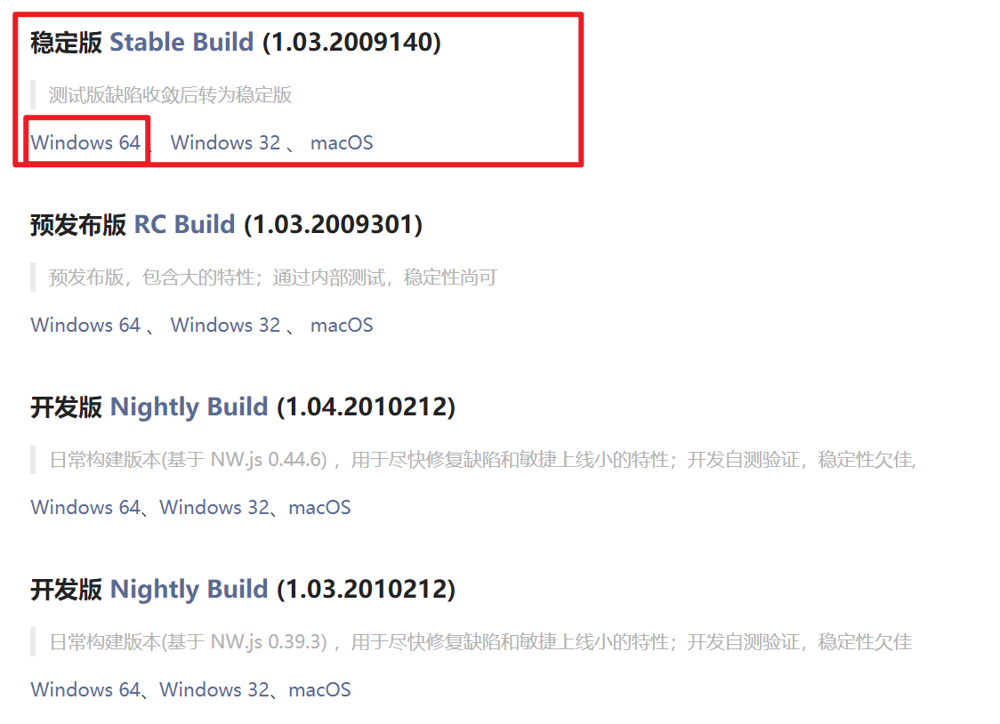

## 微信开发者账号注册

### 微信公众平台注册地址

[https://mp.weixin.qq.com/wxopen/waregister?action=step1&token=&lang=zh\_CN](https://mp.weixin.qq.com/wxopen/waregister?action=step1&token=&lang=zh_CN)

### 注意事项

1.  账号信息。

-   学习阶段建议大家使用一个`全新`的邮箱 (小号)，注册开发者(因为久了没用账号会被微信冻结)。
-   邮箱使用 163 邮箱，qq 邮箱 都可以，没有邮箱就注册个新的邮箱账号。

2.  邮箱激活。

-   登录邮箱点击邮件激活即可。

3.  管理员信息登记 - 重要

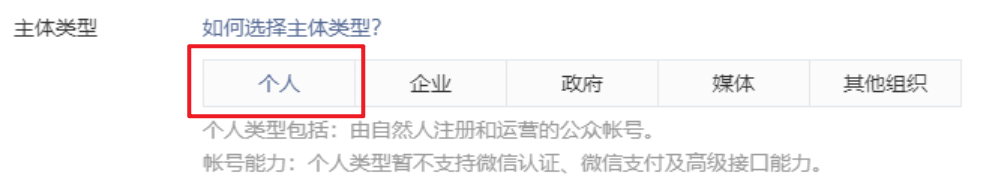

-   主体类型 - 选择 《个人》🚩
-   真实身份证号码，真实手机号码登记。
-   小程序管理员微信号要求：绑定过 **银行卡** 的微信扫码验证。

## 添加项目成员

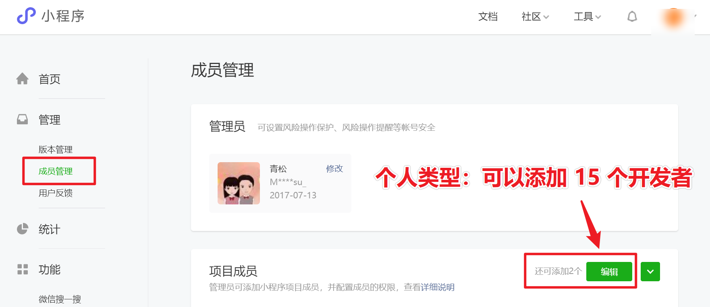

## 项目成员权限

1.  可以共享当前小程序的 `appid`。
2.  可以 扫码 或 通过分享 `打开未上线的项目`。
3.  如果有账号密码，可以登录小程序后台管理系统。
4.  可以上传小程序开发代码。

# 新建微信小程序项目

> 注意：新建项目的时候需要填写小程序 `appid`。

## 获取 `APPID`

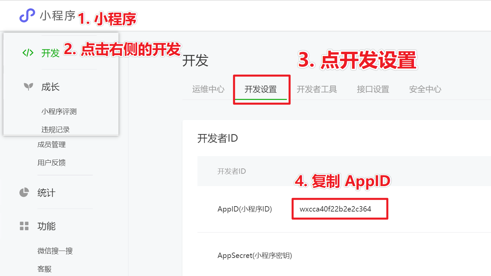

## 新建项目

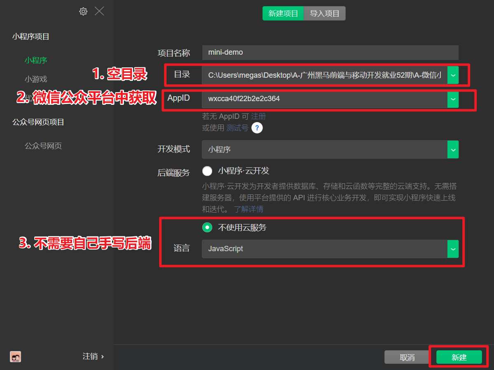

## 手机端预览

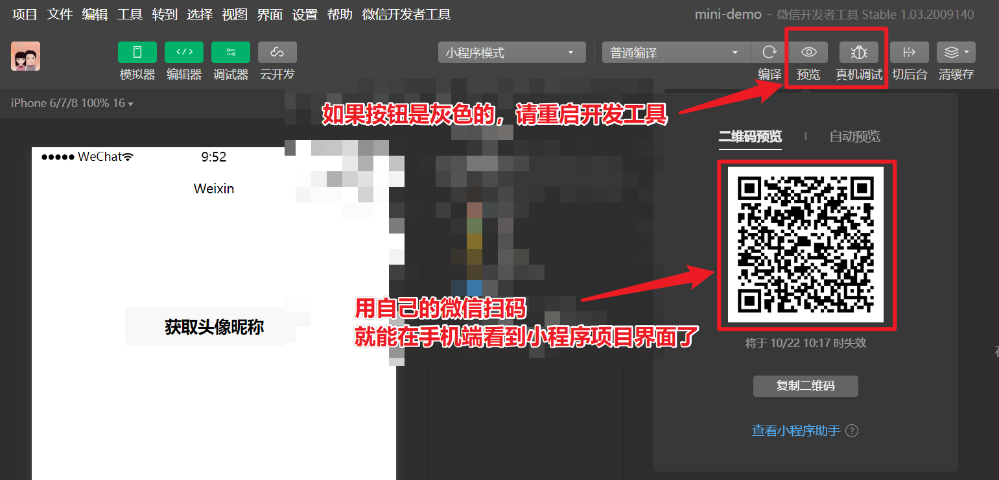

## 项目目录结构

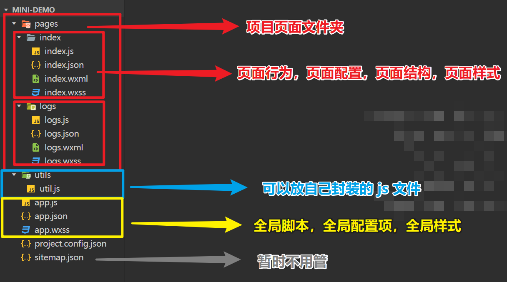

## 查看当前页面路径

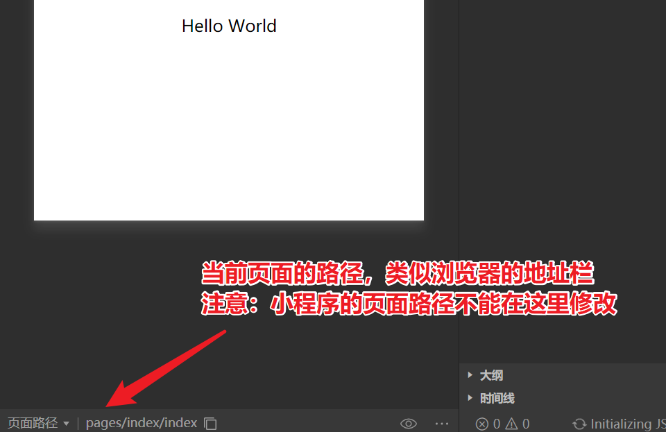

## 切换项目页面

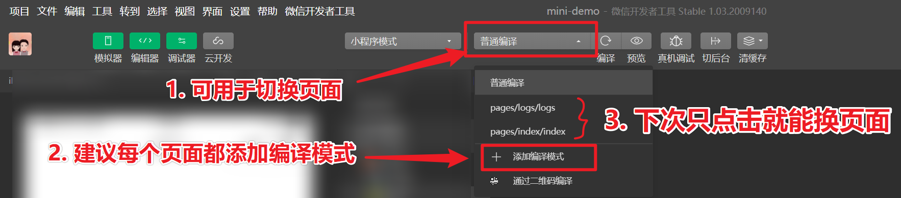

## 页面路径和页面参数

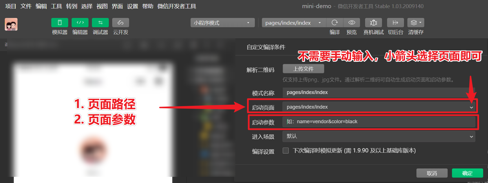

## 微信开发工具小结

微信开发工具：可以理解为 Chrome (浏览器) + VS Code (编辑器) + WebPack (打包构建工具)

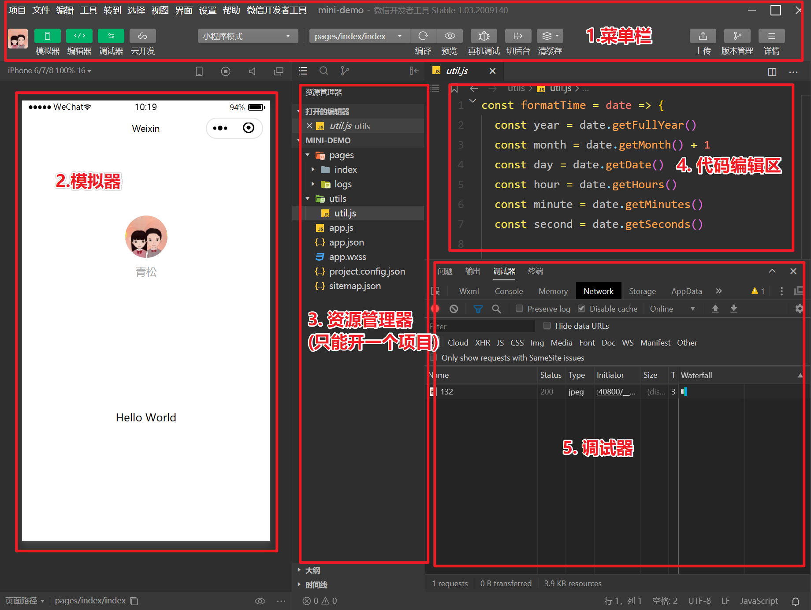

  

# 小程序配置项

## `json` 语法注意

小程序的 `json` 是严格版的语法，需要注意以下问题：

1.  不能写注释。
2.  同级数据最后一项不允许多余的逗号。
3.  字符串和键名称只能使用 双引号。
4.  布尔类型值，数字类型值 就 不能带引号。

## `app.json` 全局配置项

小程序根目录下的 `app.json` 文件用来对微信小程序进行`全局配置`。

决定页面文件的路径、窗口表现、设置网络超时时间、设置多 tab 等。

## 常用配置项 - 重点

| 配置项 | 功能 | 备注 |
| --- | --- | --- |
| `"pages":[]` | 页面文件的路径 | 用户默认打开数组的第一项 (启动页) |
| `"window":{}` | 窗口表现 | 原生微信 `App` 的头部，性能很好，但是修改也会有限制。 |
| `"tabBar":{ "list": [ ] }` | 多 tab 页面切换 | **只能配置最少 2 个、最多 5 个 tab**。 |

## 注意事项

1.  `pages`添加页面配置后，微信开发工具会自动`增量新建`对应的 `wxml,wxss,js,json` 文件，如果新建错误需要手动删除。
2.  小程序的界面中，背景默认在页面后面，需要下拉后才能看到背景部分。
3.  通过 `window` 的 `"enablePullDownRefresh": true` 开启页面下拉功能。

## 参考代码

```json
{
  "pages":[
    "pages/index/index",
    "pages/logs/logs",
    "pages/demo01/index",
    "pages/demo02/index",
    "pages/demo03/index",
    "pages/demo04/index"
  ],
  "window":{
    "enablePullDownRefresh":true,
    "backgroundTextStyle":"dark",
    "backgroundColorTop":"#F4B096",
    "backgroundColor":"#f00",
    "pageOrientation":"portrait",
    "navigationBarBackgroundColor": "#00B26A",
    "navigationBarTitleText": "铁头娃",
    "navigationBarTextStyle":"white",
    "navigationStyle":"default"
  },
  "tabBar": {
    "color": "#585858",
    "selectedColor": "#E74C57",
    "backgroundColor":"#FFF",
    "position":"bottom",
    "borderStyle":"black",
    "custom":false,
    "list":[
      {
        "pagePath": "pages/demo01/index",
        "text": "第一页",
        "iconPath": "../images/tabs/index.png",
        "selectedIconPath": "../images/tabs/index_selected.png"
      },
      {
        "pagePath": "pages/demo02/index",
        "text": "第二页",
        "iconPath": "../images/tabs/cart.png",
        "selectedIconPath": "../images/tabs/cart_selected.png"
      },
      {
        "pagePath": "pages/demo03/index",
        "text": "第三页",
        "iconPath": "../images/tabs/category.png",
        "selectedIconPath": "../images/tabs/category_selected.png"
      },
      {
        "pagePath": "pages/demo04/index",
        "text": "第四页",
        "iconPath": "../images/tabs/user.png",
        "selectedIconPath": "../images/tabs/user_selected.png"
      }
    ]
  },
  "style": "v2",
  "sitemapLocation": "sitemap.json"
}

```

# 切换页面两种方式

## 方式1，添加编译模式 - 推荐

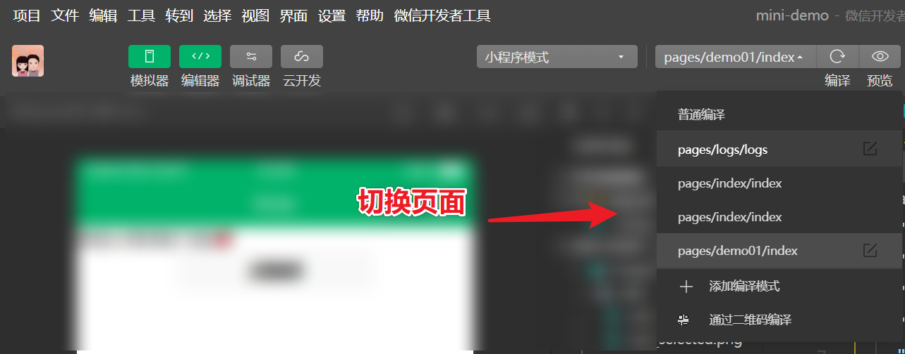

## 方式2 , 修改 `app.json`

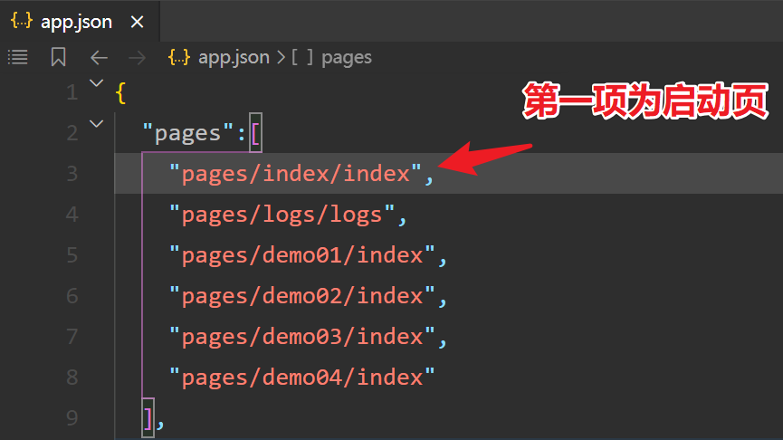

  

# 小程序页面组成

## 共分为四部分

1.  窗口导航 (原生 `App`)
2.  背景 (原生 `App`)
3.  页面 ( 只有这部分才是我们自己写的`布局和样式` 操作的 )
4.  `tabBar` (原生`App`)

## 界面组成图示

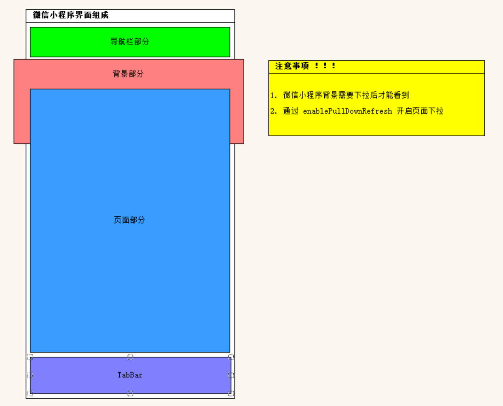

  

## xxx.json 局部配置项

## 概述

每一个小程序页面也可以使用 `.json` 文件来对本页面的窗口表现进行配置。

页面中配置项在当前页面会覆盖 `app.json` 的 `window` 中相同的配置项。

注意事项：

1.  页面的 `json` 配置项属于局部配置，只对单个页面生效。
2.  页面配置项结构和全局配置项不一样，页面配置项，不要写 `window`，写了反而是错的。

## 全局配置项和页面配置项 对比

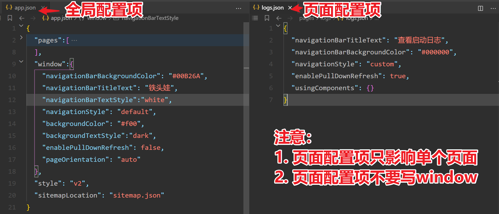

  

# 手机端预览

## 二维码预览 和 自动预览

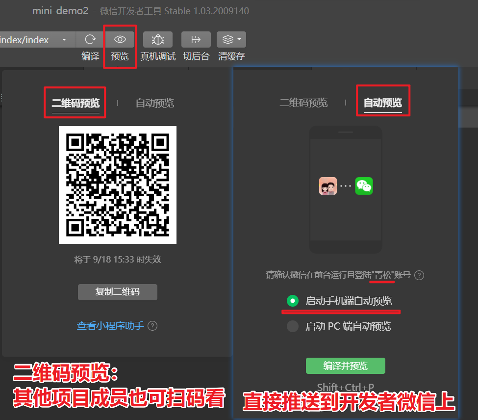

## 注意

1.  PC端的只是模拟器，模拟和真实的手机端运行会有差异，一切以手机端效果为主。
2.  开发的时候大部分情况使用自动预览，更方便。
3.  如果在模拟器中运行正常，但是手机运行不了的时候，可使用真机调试，调试手机端 Bug。

# 常用组件 - 标签

## `page` 页面根组件

小程序的页面根标签为 `<page>`，相当于 `html` 的 `body` 标签。

## `view` 容器组件

代替之前 `html` 的 `<div>`

`h1 ~ h6，p，ul ，ol， li, dl， dt， dd ，table , header, nav, section` 等都不支持。

所以在小程序开发的时候不需要注意标签语义化问题。布局的时候首选都是 view 标签。

`<view>` 标签可通过添加类名，配合 `wxss` 样式的方式实现不同的页面布局。

## `text` 文本组件

1.  text 组件支持回车键换行，也可以通过 `\n` 换行。
2.  长按文字可以复制（只有 text 标签有这个功能，手机端和模拟器长按选择效果有差异）
3.  只能嵌套 text

| 属性 | 类型 | 默认值 | 说明 |
| --- | --- | --- | --- |
| user-select | boolean | false | 文本是否可选，该属性会使文本节点显示为 inline-block |
| decode | boolean | false | 是否解码，`&emsp;` 一个字符大小 |
| space | string |  | 显示连续空格，`space="emsp" `一个字符大小 |

## `image` 图片组件

1.  图片标签，image 组件默认宽高（🧨记得手动设置宽高）。
2.  支持懒加载。

```xml
<image src="../../../images/tabs/cart.png" />

<image src="/../images/tabs/cart_selected.png" />
```

| 属性名 | 类型 | 默认值 | 说明 |
| --- | --- | --- | --- |
| src | String |  | 图片资源地址 |
| mode | String | `scaleToFill` | 图片裁剪、缩放的模式 |
| lazy-load | Boolean | false | 图片`懒加载` |
| webp | Boolean | false | `webp`图片格式比 `jpg` 和 `png` 更小，旧版手机和微信不支持 |

**mode 有效值：**

| 值 | 说明 | 备注 |
| --- | --- | --- |
| `aspectFit` | 保持纵横比缩放图片，使图片的长边能完全显示出来。 | 预览大图（图片能完整显示） |
| `aspectFill` | 保持纵横比缩放图片，只保证图片的短边能完全显示出来。 | 头像容器，朋友圈多图展示 |
| `widthFix` | 宽度不变，高度自动变化，保持原图宽高比不变 | 高度自适应 |
| `heightFix` | 缩放模式，高度不变，宽度自动变化，保持原图宽高比不变 | 宽度自适应 |

建议：模式使用的时候不要死记硬背属性的值，特容易混淆，建议查看文档，第一个不是想要的就换第二个...。

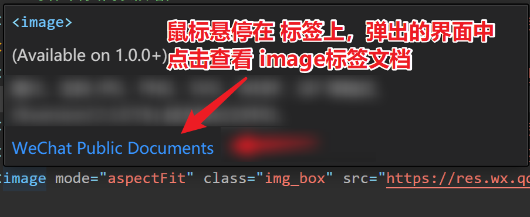

## `swiper` 滑动组件

1.  `swiper` 容器组件默认样式有高度 `150px` (🧨开发的时候记得修改)
2.  `<swiper-item>` 容器有 `width:100%; height:100%; postion:absolute;`

```xml
<swiper>
    <swiper-item>滑动项1</swiper-item>

    <swiper-item>滑动项2</swiper-item>

    <swiper-item>滑动项3</swiper-item>

</swiper>

```

`<swiper>` 组件属性：

| 属性名 | 类型 | 默认值 | 说明 |
| --- | --- | --- | --- |
| indicator-dots | Boolean | false | 是否显示面板指示点 |
| indicator-color | Color | rgba(0, 0, 0, .3) | 指示点颜色 |
| indicator-active-color | Color | #000000 | 当前选中的指示点颜色 |
| autoplay | Boolean | false | 是否自动切换 |
| interval | Number | 5000 | 自动切换时间间隔 |
| circular | Boolean | false | 是否循环轮播 |

## button 按钮

### 超级按钮 - 调用微信开放能力

微信开放能力是`原生微信 App` 里面的功能，模拟器无法模拟原生 `app`，以下功能都需要微信扫码体验真实效果。

| **open-type 的合法值** | 功能描述 | 备注 |
| --- | --- | --- |
| `share` | 调用分享功能 | 可以分享给个人，微信群，项目成员有权访问未上线的项目 |
| `contact` | 调用客服功能 | 登录微信公众平台，配套客服管理系统 |
| `getUserInfo` | 调用获取用户信息功能 | 需要通过小程序的事件获取 |
| `getPhoneNumber` | 获取用户手机号功能 | 个人开发者没法调用，需要企业账号才能调用 |

### 微信开放能力 - 客服聊天

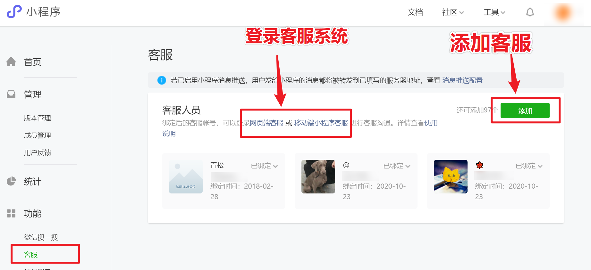

## navigator 导航组件

### 参考代码

```jsx
<text class="title">导航标签-基础</text>

<navigator url="../demo06/index">跳转到demo06</navigator>

<navigator url="/pages/demo06/index">跳转到demo06</navigator>

<navigator url="/pages/demo07/index">跳转到demo07自己</navigator>

<text class="title">导航标签-跳转tabBar页 🚩</text>

<navigator open-type="switchTab" url="/pages/demo01/index">tabBar页demo01</navigator>

<navigator open-type="switchTab" url="/pages/demo02/index">tabBar页demo02</navigator>

<navigator open-type="switchTab" url="/pages/demo03/index">tabBar页demo03</navigator>

<navigator open-type="switchTab" url="/pages/demo04/index">tabBar页demo04</navigator>

<text class="title">导航标签-替换页面</text>

<navigator open-type="navigate" url="/pages/demo06/index">跳转到demo06</navigator>

<navigator open-type="redirect" url="/pages/demo06/index">替换到demo06</navigator>

<text class="title">导航标签-返回上一页</text>

<navigator url="/pages/demo07/index">跳转到新的demo07</navigator>

<navigator open-type="navigateBack" delta="1">返回上一页</navigator>

<navigator open-type="navigateBack" delta="2">回退两级</navigator>

```

### 小程序页面分类

-   `tabBar` 页，在 `app.json` 的 `tabBar` 中配置过的页面，最多 5 个，`tabBar` 页打开后就一直在内存中。
-   普通页，底部没有 tab 栏的，普通页没法展示 `tabBar`，普通页点击了返回后会被销毁。

### 打开方式

| **open-type 的合法值** | 功能说明 | 备注 |
| --- | --- | --- |
| `open-type="navigate"` | 打开新的普通页 | 默认值，可以省略不写 |
| `open-type="switchTab"` | 切换 `tabBar` 页 | 打开 `tabBar` 页的时候会`销毁`所有`普通页` |
| `open-type="redirect"` | 替换普通页面 | 支付成功后，登录成功后 |
| `open-type="navigateBack"` | 返回上一页 | 自定义返回按钮 |

### 小结

1.  小程序是多页面应用，`Vue` 是单页面应用。
2.  小程序页面分两类，`普通页` 和 `tabBar` 页。
3.  最多同时保留`10`个普通页面，到达10页后无法再打开新的普通页。
4.  跳转 `tabBar` 页需要指定 `open-type="switchTab"`，否则无法跳转。
5.  `tabBar` 左上角没有返回箭头，跳转 `tabBar` 的时候，所有`普通页`都会被`销毁`。

## rich-text 富文本(渲染)组件

功能相当于 `Vue` 中的 `v-html`。

可以在小程序中渲染静态的 `html` 内容。

```jsx
<rich-text nodes="{{ 富文本内容 }}"></rich-text>

```

## 其他组件

### `icon` 组件

```xml
<icon type="success"></icon>

<icon type="success_no_circle"></icon>

<icon type="info"></icon>

<icon type="warn"></icon>

<icon type="waiting"></icon>

<icon type="cancel"></icon>

<icon type="download"></icon>

<icon type="search"></icon>

<icon type="clear"></icon>

```

### `checkbox` 组件

```jsx
<checkbox-group bind:change="getCheckboxValue">
  <label>吃饭：<checkbox value="chifan" color="#FA5151"></checkbox></label>

  <label>睡觉：<checkbox value="shuijiao"  color="#FA5151"></checkbox></label>

  <label>打豆豆：<checkbox  value="dadoudou"  color="#FA5151"></checkbox></label>

</checkbox-group>

// pages/demo09/index.js
Page({
  // 获取 checkbox 复选按钮编组的值，获取的数据格式是数组
  getCheckboxValue(e){
    console.log(e.detail.value);    // ["dadoudou", "chifan", "shuijiao"]
  },
})
```

### `radio` 组件

```jsx
<radio-group bind:change="getRadioValue">
  <label>吃饭：<radio checked value="chifan" color="#FA5151"></radio></label>

  <label>睡觉：<radio disabled value="shuijiao"  color="#FA5151"></radio></label>

  <label>打豆豆：<radio  value="dadoudou"  color="#FA5151"></radio></label>

</radio-group>

// pages/demo09/index.js
Page({
  // 获取单选框的值，获取的数据格式是字符串
  getRadioValue(e){
    console.log(e.detail.value);    // "chifan"
  }
})
```

### 注意事项

1.  `icon` 组件可以改大小和颜色。
2.  `checkbox` `radio` 微信只提供颜色的修改属性，不能修改大小。