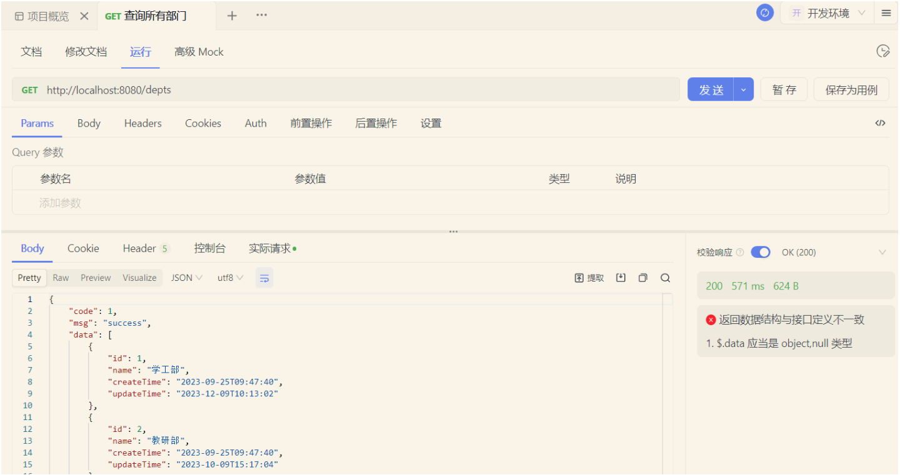
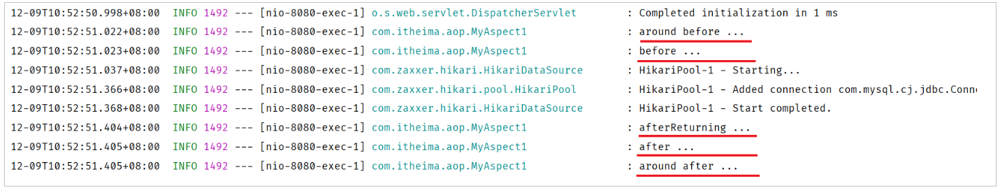
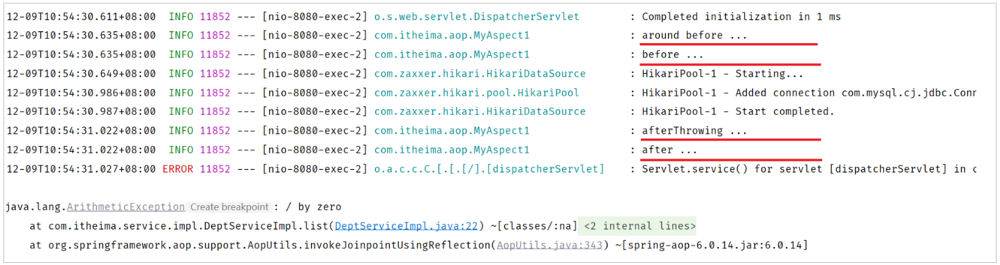
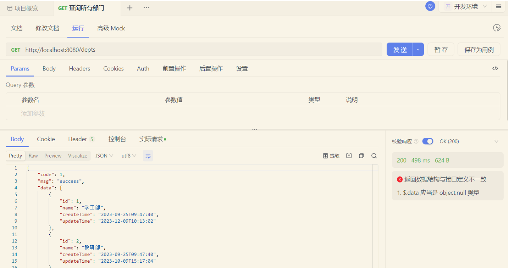
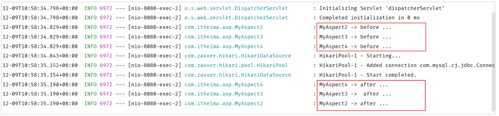
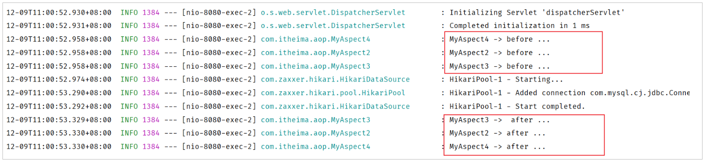
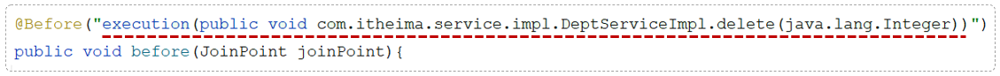
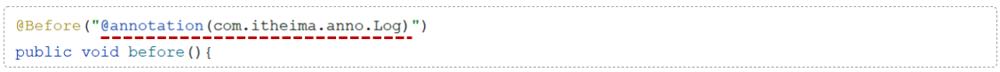
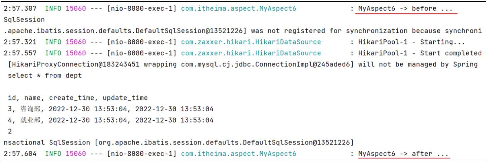

# AOP进阶

AOP的基础知识学习完之后，下面我们对AOP当中的各个细节进行详细的学习。主要分为4个部分：

1. 通知类型

2. 通知顺序

3. 切入点表达式


我们先来学习第一部分通知类型。

## 通知类型

在入门程序当中，我们已经使用了一种功能最为强大的通知类型：Around环绕通知。

```Java
@Component
@Aspect //当前类为切面类
@Slf4j
public class TimeAspect {

    @Around("execution(* com.itheima.service.impl.DeptServiceImpl.*(..))")
    public Object recordTime(ProceedingJoinPoint pjp) throws Throwable {
        //记录方法执行开始时间
        long begin = System.currentTimeMillis();
        //执行原始方法
        Object result = pjp.proceed();
        //记录方法执行结束时间
        long end = System.currentTimeMillis();
        //计算方法执行耗时
        log.info("方法执行耗时: {}毫秒",end-begin);
        return result;
    }
}
```

只要我们在通知方法上加上了`@Around`注解，就代表当前通知是一个环绕通知。


|**Spring AOP 通知类型**||
|---|---|
|@Around|环绕通知，此注解标注的通知方法在目标方法前、后都被执行|
|@Before|前置通知，此注解标注的通知方法在目标方法前被执行|
|@After|后置通知，此注解标注的通知方法在目标方法后被执行，无论是否有异常都会执行|
|@AfterReturning|返回后通知，此注解标注的通知方法在目标方法后被执行，有异常不会执行|
|@AfterThrowing|异常后通知，此注解标注的通知方法发生异常后执行|

下面我们通过代码演示，来加深对于不同通知类型的理解：

```Java
@Slf4j
@Component
@Aspect
public class MyAspect1 {
    //前置通知
    @Before("execution(* com.itheima.service.*.*(..))")
    public void before(JoinPoint joinPoint){
        log.info("before ...");

    }

    //环绕通知
    @Around("execution(* com.itheima.service.*.*(..))")
    public Object around(ProceedingJoinPoint proceedingJoinPoint) throws Throwable {
        log.info("around before ...");

        //调用目标对象的原始方法执行
        Object result = proceedingJoinPoint.proceed();
        
        //原始方法如果执行时有异常，环绕通知中的后置代码不会在执行了
        
        log.info("around after ...");
        return result;
    }

    //后置通知
    @After("execution(* com.itheima.service.*.*(..))")
    public void after(JoinPoint joinPoint){
        log.info("after ...");
    }

    //返回后通知（程序在正常执行的情况下，会执行的后置通知）
    @AfterReturning("execution(* com.itheima.service.*.*(..))")
    public void afterReturning(JoinPoint joinPoint){
        log.info("afterReturning ...");
    }

    //异常通知（程序在出现异常的情况下，执行的后置通知）
    @AfterThrowing("execution(* com.itheima.service.*.*(..))")
    public void afterThrowing(JoinPoint joinPoint){
        log.info("afterThrowing ...");
    }
}

```


重新启动SpringBoot服务，进行测试：

**1\)\. 没有异常情况下：**

使用 Apifox 测试查询所有部门数据



查看idea中控制台日志输出：



> 程序没有发生异常的情况下，@AfterThrowing标识的通知方法不会执行。
> 
> 


**2\)\. 出现异常情况下：**

修改DeptServiceImpl业务实现类中的代码： 添加异常

```Java
@Slf4j
@Service
public class DeptServiceImpl implements DeptService {
    @Autowired
    private DeptMapper deptMapper;

    @Override
    public List<Dept> list() {

        List<Dept> deptList = deptMapper.list();
        //模拟异常
        int num = 10/0;
        return deptList;
    }
    
    //省略其他代码...
}
```

重新启动SpringBoot服务，测试发生异常情况下通知的执行：


查看idea中控制台日志输出



> 程序发生异常的情况下：
> 
> - @AfterReturning标识的通知方法不会执行，@AfterThrowing标识的通知方法执行了
> 
> - @Around环绕通知中原始方法调用时有异常，通知中的环绕后的代码逻辑也不会在执行了 （因为原始方法调用已经出异常了）
> 
> 


在使用通知时的注意事项：

- @Around环绕通知需要自己调用 ProceedingJoinPoint\.proceed\(\) 来让原始方法执行，其他通知不需要考虑目标方法执行

- @Around环绕通知方法的返回值，必须指定为Object，来接收原始方法的返回值，否则原始方法执行完毕，是获取不到返回值的。


五种常见的通知类型，我们已经测试完毕了，此时我们再来看一下刚才所编写的代码，有什么问题吗？

```Java
//前置通知
@Before("execution(* com.itheima.service.*.*(..))")

//环绕通知
@Around("execution(* com.itheima.service.*.*(..))")
  
//后置通知
@After("execution(* com.itheima.service.*.*(..))")

//返回后通知（程序在正常执行的情况下，会执行的后置通知）
@AfterReturning("execution(* com.itheima.service.*.*(..))")

//异常通知（程序在出现异常的情况下，执行的后置通知）
@AfterThrowing("execution(* com.itheima.service.*.*(..))")
```

我们发现啊，每一个注解里面都指定了切入点表达式，而且这些切入点表达式都一模一样。此时我们的代码当中就存在了大量的重复性的切入点表达式，假如此时切入点表达式需要变动，就需要将所有的切入点表达式一个一个的来改动，就变得非常繁琐了。

怎么来解决这个切入点表达式重复的问题？ 答案就是：**抽取**


Spring提供了`@PointCut`注解，该注解的作用是将公共的切入点表达式抽取出来，需要用到时引用该切入点表达式即可。

```Java
@Slf4j
@Component
@Aspect
public class MyAspect1 {

    //切入点方法（公共的切入点表达式）
    @Pointcut("execution(* com.itheima.service.*.*(..))")
    private void pt(){}

    //前置通知（引用切入点）
    @Before("pt()")
    public void before(JoinPoint joinPoint){
        log.info("before ...");

    }

    //环绕通知
    @Around("pt()")
    public Object around(ProceedingJoinPoint proceedingJoinPoint) throws Throwable {
        log.info("around before ...");

        //调用目标对象的原始方法执行
        Object result = proceedingJoinPoint.proceed();
        //原始方法在执行时：发生异常
        //后续代码不在执行

        log.info("around after ...");
        return result;
    }

    //后置通知
    @After("pt()")
    public void after(JoinPoint joinPoint){
        log.info("after ...");
    }

    //返回后通知（程序在正常执行的情况下，会执行的后置通知）
    @AfterReturning("pt()")
    public void afterReturning(JoinPoint joinPoint){
        log.info("afterReturning ...");
    }

    //异常通知（程序在出现异常的情况下，执行的后置通知）
    @AfterThrowing("pt()")
    public void afterThrowing(JoinPoint joinPoint){
        log.info("afterThrowing ...");
    }
}
```


需要注意的是：当切入点方法使用`private`修饰时，仅能在当前切面类中引用该表达式， 当外部其他切面类中也要引用当前类中的切入点表达式，就需要把`private`改为`public`，而在引用的时候，具体的语法为：

```Java
@Slf4j
@Component
@Aspect
public class MyAspect2 {
    //引用MyAspect1切面类中的切入点表达式
    @Before("com.itheima.aspect.MyAspect1.pt()")
    public void before(){
        log.info("MyAspect2 -> before ...");
    }
}
```


## 通知顺序

讲解完了Spring中AOP所支持的5种通知类型之后，接下来我们再来研究通知的执行顺序。

当在项目开发当中，我们定义了多个切面类，而多个切面类中多个切入点都匹配到了同一个目标方法。此时当目标方法在运行的时候，这多个切面类当中的这些通知方法都会运行。

此时我们就有一个疑问，这多个通知方法到底哪个先运行，哪个后运行？ 下面我们通过程序来验证（这里呢，我们就定义两种类型的通知进行测试，一种是前置通知`@Before`，一种是后置通知`@After`）


定义多个切面类：

```Java
@Slf4j
@Component
@Aspect
public class MyAspect2 {
    //前置通知
    @Before("execution(* com.itheima.service.*.*(..))")
    public void before(){
        log.info("MyAspect2 -> before ...");
    }

    //后置通知
    @After("execution(* com.itheima.service.*.*(..))")
    public void after(){
        log.info("MyAspect2 -> after ...");
    }
}
```

```Java
@Slf4j
@Component
@Aspect
public class MyAspect3 {
    //前置通知
    @Before("execution(* com.itheima.service.*.*(..))")
    public void before(){
        log.info("MyAspect3 -> before ...");
    }

    //后置通知
    @After("execution(* com.itheima.service.*.*(..))")
    public void after(){
        log.info("MyAspect3 ->  after ...");
    }
}
```

```Java
@Slf4j
@Component
@Aspect
public class MyAspect4 {
    //前置通知
    @Before("execution(* com.itheima.service.*.*(..))")
    public void before(){
        log.info("MyAspect4 -> before ...");
    }

    //后置通知
    @After("execution(* com.itheima.service.*.*(..))")
    public void after(){
        log.info("MyAspect4 -> after ...");
    }
}
```

重新启动SpringBoot服务，测试通知的执行顺序：

> 备注：
> 
> 1. 把DeptServiceImpl实现类中模拟异常的代码删除或注释掉。
> 
> 2. 注释掉其他切面类\(把`@Aspect`注释即可\)，仅保留MyAspect2、MyAspect3、MyAspect4 ，这样就可以清晰看到执行的结果，而不被其他切面类干扰。
> 
> 


使用 Apifox 测试查询所有部门数据。



查看idea中控制台日志输出



- 通过以上程序运行可以看出在不同切面类中，默认按照切面类的类名字母排序：

    - 目标方法前的通知方法：字母排名靠前的先执行

    - 目标方法后的通知方法：字母排名靠前的后执行


如果我们想控制通知的执行顺序有两种方式：

1. 修改切面类的类名（这种方式非常繁琐、而且不便管理）

2. 使用Spring提供的`@Order`注解


使用@Order注解，控制通知的执行顺序：

```Java
@Slf4j
@Component
@Aspect
@Order(2)  //切面类的执行顺序（前置通知：数字越小先执行; 后置通知：数字越小越后执行）
public class MyAspect2 {
    //前置通知
    @Before("execution(* com.itheima.service.*.*(..))")
    public void before(){
        log.info("MyAspect2 -> before ...");
    }

    //后置通知 
    @After("execution(* com.itheima.service.*.*(..))")
    public void after(){
        log.info("MyAspect2 -> after ...");
    }
}
```

```Java
@Slf4j
@Component
@Aspect
@Order(3)  //切面类的执行顺序（前置通知：数字越小先执行; 后置通知：数字越小越后执行）
public class MyAspect3 {
    //前置通知
    @Before("execution(* com.itheima.service.*.*(..))")
    public void before(){
        log.info("MyAspect3 -> before ...");
    }

    //后置通知
    @After("execution(* com.itheima.service.*.*(..))")
    public void after(){
        log.info("MyAspect3 ->  after ...");
    }
}
```

```Java
@Slf4j
@Component
@Aspect
@Order(1) //切面类的执行顺序（前置通知：数字越小先执行; 后置通知：数字越小越后执行）
public class MyAspect4 {
    //前置通知
    @Before("execution(* com.itheima.service.*.*(..))")
    public void before(){
        log.info("MyAspect4 -> before ...");
    }

    //后置通知
    @After("execution(* com.itheima.service.*.*(..))")
    public void after(){
        log.info("MyAspect4 -> after ...");
    }
}
```

重新启动SpringBoot服务，测试通知执行顺序：



**通知的执行顺序大家主要知道两点即可：**

1. **不同的切面类当中，默认情况下通知的执行顺序****是与切面类的类名字母排序是有关系的**

2. **可以在切面类上面加上@Order注解，来控制不同的切面类通知的执行顺序**


## 切入点表达式

从AOP的入门程序到现在，我们一直都在使用切入点表达式来描述切入点。下面我们就来详细的介绍一下切入点表达式的具体写法。

切入点表达式：描述切入点方法的一种表达式

- 作用：主要用来决定项目中的哪些方法需要加入通知

- 常见形式：

    - execution\(……\)：根据方法的签名来匹配



    - @annotation\(……\) ：根据注解匹配



首先我们先学习第一种最为常见的execution切入点表达式。


### execution

execution主要根据方法的返回值、包名、类名、方法名、方法参数等信息来匹配，语法为：

```Java
execution(访问修饰符?  返回值  包名.类名.?方法名(方法参数) throws 异常?)
```

其中带`?`的表示可以省略的部分

- 访问修饰符：可省略（比如: public、protected）

- 包名\.类名： 可省略

- throws 异常：可省略（注意是方法上声明抛出的异常，不是实际抛出的异常）

示例：

```Java
@Before("execution(void com.itheima.service.impl.DeptServiceImpl.delete(java.lang.Integer))")
```

可以使用通配符描述切入点

- `*` ：单个独立的任意符号，可以通配任意返回值、包名、类名、方法名、任意类型的一个参数，也可以通配包、类、方法名的一部分

- `..` ：多个连续的任意符号，可以通配任意层级的包，或任意类型、任意个数的参数


切入点表达式的语法规则：

1. 方法的访问修饰符可以省略

2. 返回值可以使用`*`号代替（任意返回值类型）

3. 包名可以使用`*`号代替，代表任意包（一层包使用一个`*`）

4. 使用`..`配置包名，标识此包以及此包下的所有子包

5. 类名可以使用`*`号代替，标识任意类

6. 方法名可以使用`*`号代替，表示任意方法

7. 可以使用 `*`  配置参数，一个任意类型的参数

8. 可以使用`..` 配置参数，任意个任意类型的参数


**切入点表达式示例**

- 省略方法的修饰符号 

```Java
execution(void com.itheima.service.impl.DeptServiceImpl.delete(java.lang.Integer))
```

- 使用`*`代替返回值类型

```Java
execution(* com.itheima.service.impl.DeptServiceImpl.delete(java.lang.Integer))
```

- 使用`*`代替包名（一层包使用一个`*`）

```Java
execution(* com.itheima.*.*.DeptServiceImpl.delete(java.lang.Integer))
```

- 使用`..`省略包名

```Java
execution(* com..DeptServiceImpl.delete(java.lang.Integer))  
```

- 使用`*`代替类名

```Java
execution(* com..*.delete(java.lang.Integer))
```

- 使用`*`代替方法名

```Java
execution(* com..*.*(java.lang.Integer))
```

- 使用 `*` 代替参数

```Java
execution(* com.itheima.service.impl.DeptServiceImpl.delete(*))
```

- 使用`..`省略参数

```Java
execution(* com..*.*(..))
```


**注意事项：**

- 根据业务需要，可以使用 且（\&\&）、或（\|\|）、非（\!） 来组合比较复杂的切入点表达式。

```Java
execution(* com.itheima.service.DeptService.list(..)) || execution(* com.itheima.service.DeptService.delete(..))
```

切入点表达式的书写建议：

- 所有业务方法名在命名时尽量规范，方便切入点表达式快速匹配。如：查询类方法都是 find 开头，更新类方法都是update开头

```Java
//业务类
@Service
public class DeptServiceImpl implements DeptService {
    
    public List<Dept> findAllDept() {
       //省略代码...
    }
    
    public Dept findDeptById(Integer id) {
       //省略代码...
    }
    
    public void updateDeptById(Integer id) {
       //省略代码...
    }
    
    public void updateDeptByMoreCondition(Dept dept) {
       //省略代码...
    }
    //其他代码...
}
```

- //匹配DeptServiceImpl类中以find开头的方法

```Java
execution(* com.itheima.service.impl.DeptServiceImpl.find*(..))
```

- 描述切入点方法通常基于接口描述，而不是直接描述实现类，增强拓展性

```Java
execution(* com.itheima.service.DeptService.*(..))
```

- 在满足业务需要的前提下，尽量缩小切入点的匹配范围。如：包名匹配尽量不使用 \.\.，使用 \* 匹配单个包

```Java
execution(* com.itheima.*.*.DeptServiceImpl.find*(..))
```


> **切入点表达式书写建议：**
> 
> - 所有业务方法名在命名时尽量规范，方便切入点表达式快速匹配。如：findXxx，updateXxx。
> 
> - 描述切入点方法通常基于接口描述，而不是直接描述实现类，增强拓展性。
> 
> - 在满足业务需要的前提下，尽量缩小切入点的匹配范围。如：包名尽量不使用\.\.，使用 `*` 匹配单个包。
> 
> 


### @annotation

已经学习了execution切入点表达式的语法。那么如果我们要匹配多个无规则的方法，比如：list\(\)和 delete\(\)这两个方法。这个时候我们基于execution这种切入点表达式来描述就不是很方便了。而在之前我们是将两个切入点表达式组合在了一起完成的需求，这个是比较繁琐的。

我们可以借助于另一种切入点表达式 `@annotation` 来描述这一类的切入点，从而来简化切入点表达式的书写。


实现步骤：

1. 编写自定义注解

2. 在业务类要做为连接点的方法上添加自定义注解


**自定义注解**：`LogOperation`

```Java
@Target(ElementType.METHOD)
@Retention(RetentionPolicy.RUNTIME)
public @interface LogOperation{
}
```


**业务类**：`DeptServiceImpl`

```Java
@Slf4j
@Service
public class DeptServiceImpl implements DeptService {
    @Autowired
    private DeptMapper deptMapper;

    @Override
    @LogOperation //自定义注解（表示：当前方法属于目标方法）
    public List<Dept> list() {
        List<Dept> deptList = deptMapper.list();
        //模拟异常
        //int num = 10/0;
        return deptList;
    }

    @Override
    @LogOperation //自定义注解（表示：当前方法属于目标方法）
    public void delete(Integer id) {
        //1. 删除部门
        deptMapper.delete(id);
    }


    @Override
    public void save(Dept dept) {
        dept.setCreateTime(LocalDateTime.now());
        dept.setUpdateTime(LocalDateTime.now());
        deptMapper.save(dept);
    }

    @Override
    public Dept getById(Integer id) {
        return deptMapper.getById(id);
    }

    @Override
    public void update(Dept dept) {
        dept.setUpdateTime(LocalDateTime.now());
        deptMapper.update(dept);
    }
}
```


**切面类**

```Java
@Slf4j
@Component
@Aspect
public class MyAspect6 {
    //针对list方法、delete方法进行前置通知和后置通知

    //前置通知
    @Before("@annotation(com.itheima.anno.LogOperation)")
    public void before(){
        log.info("MyAspect6 -> before ...");
    }
    
    //后置通知
    @After("@annotation(com.itheima.anno.LogOperation)")
    public void after(){
        log.info("MyAspect6 -> after ...");
    }
}
```

重启SpringBoot服务，测试查询所有部门数据，查看控制台日志：



到此我们两种常见的切入点表达式我已经介绍完了。

- execution切入点表达式

    - 根据我们所指定的方法的描述信息来匹配切入点方法，这种方式也是最为常用的一种方式

    - 如果我们要匹配的切入点方法的方法名不规则，或者有一些比较特殊的需求，通过execution切入点表达式描述比较繁琐

- annotation 切入点表达式

    - 基于注解的方式来匹配切入点方法。这种方式虽然多一步操作，我们需要自定义一个注解，但是相对来比较灵活。我们需要匹配哪个方法，就在方法上加上对应的注解就可以了


根据业务需要，可以使用 \&\& ，\|\|，！ 来组合比较复杂的切入点表达式。


