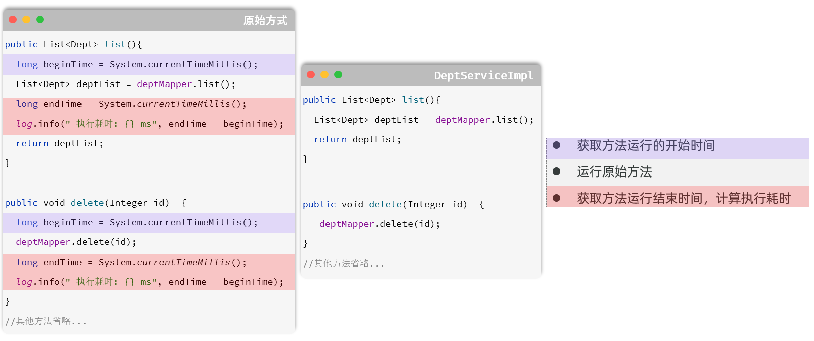
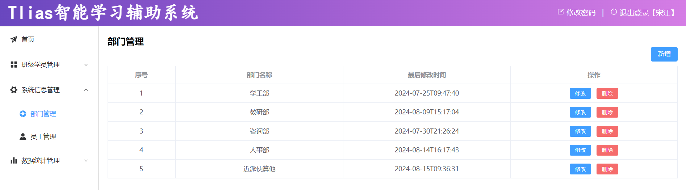
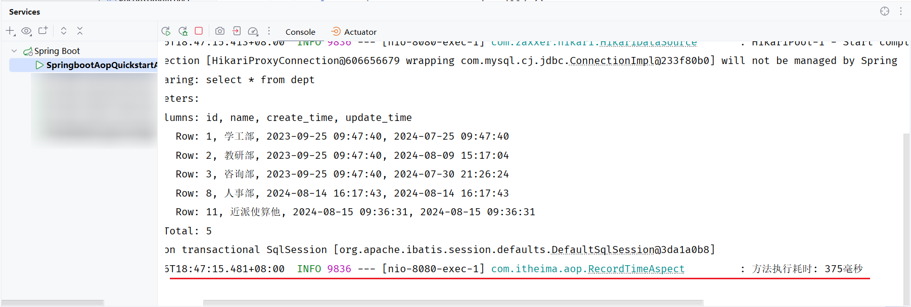
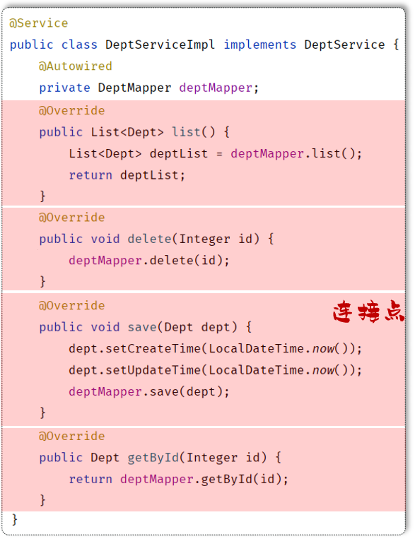
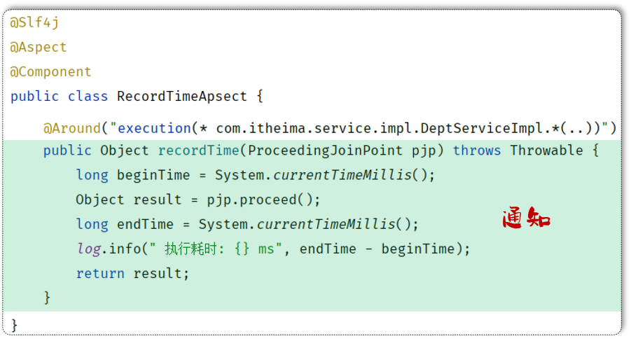
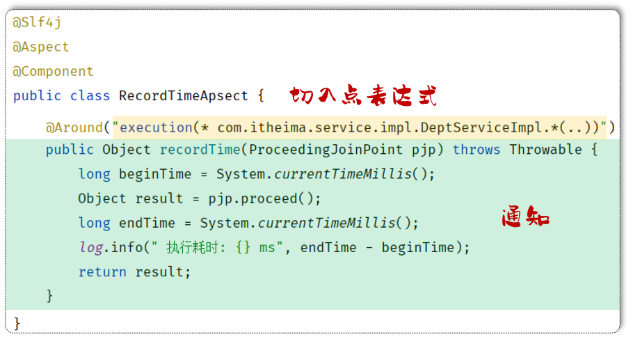
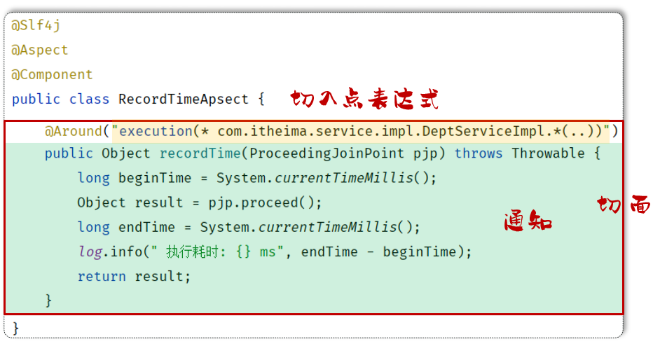
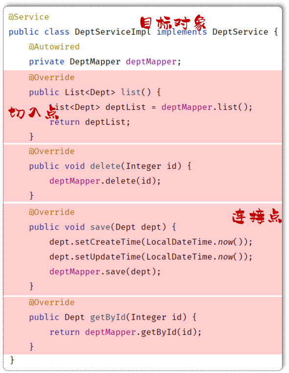
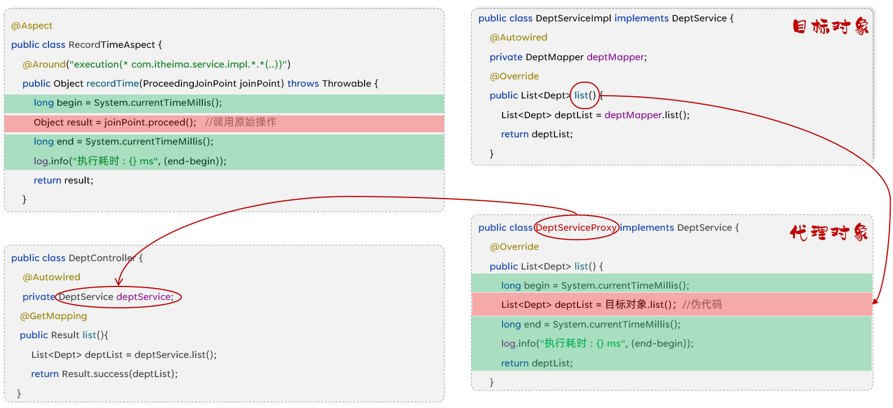

# AOP基础

## AOP入门

在了解了什么是AOP后，我们下面通过一个快速入门程序，体验下AOP的开发，并掌握Spring中AOP的开发步骤。

- **需求：统计部门管理各个业务层方法执行耗时。**

- **原始方式：**

在原始的实现方式中，我们需要在业务层的也一个方法执行执行，获取方法运行的开始时间； 然后运行原始的方法逻辑； 最后在每一个方法运行结束时，获取方法运行结束时间，计算执行耗时。




- **SpringAOP实现步骤：**

为演示方便，可以直接导入资料中提供的`springboot-aop-quickstart`项目工程

1\)\. 导入依赖：在 pom\.xml 文件中导入 AOP 的依赖

```XML
<dependency>
    <groupId>org.springframework.boot</groupId>
    <artifactId>spring-boot-starter-aop</artifactId>
</dependency>
```


2\)\. 编写AOP程序：针对于特定方法根据业务需要进行编程

```Java
@Component
@Aspect //当前类为切面类
@Slf4j
public class RecordTimeAspect {

    @Around("execution(* com.itheima.service.impl.DeptServiceImpl.*(..))")
    public Object recordTime(ProceedingJoinPoint pjp) throws Throwable {
        //记录方法执行开始时间
        long begin = System.currentTimeMillis();

        //执行原始方法
        Object result = pjp.proceed();

        //记录方法执行结束时间
        long end = System.currentTimeMillis();

        //计算方法执行耗时
        log.info("方法执行耗时: {}毫秒",end-begin);
        return result;
    }
}
```


重新启动SpringBoot服务，打开浏览器访问部门管理的功能进行测试：



我们可以看到，在控制台中输出了方法的执行耗时：




我们通过AOP入门程序完成了业务方法执行耗时的统计，那其实AOP的功能远不止于此，常见的应用场景如下：

- 记录系统的操作日志

- 权限控制

- 事务管理：我们前面所讲解的Spring事务管理，底层其实也是通过AOP来实现的，只要添加@Transactional注解之后，AOP程序自动会在原始方法运行前先来开启事务，在原始方法运行完毕之后提交或回滚事务

这些都是AOP应用的典型场景。


通过入门程序，我们也应该感受到了AOP面向切面编程的一些优势：

- 代码无侵入：没有修改原始的业务方法，就已经对原始的业务方法进行了功能的增强或者是功能的改变

- 减少了重复代码

- 提高开发效率

- 维护方便


## AOP核心概念

通过SpringAOP的快速入门，感受了一下AOP面向切面编程的开发方式。下面我们再来学习AOP当中涉及到的一些核心概念。

- **连接点：****JoinPoint**，可以被AOP控制的方法（暗含方法执行时的相关信息）

    - 连接点指的是可以被aop控制的方法。例如：入门程序当中所有的业务方法都是可以被aop控制的方法。

    - 在SpringAOP提供的JoinPoint当中，封装了连接点方法在执行时的相关信息。（后面会有具体的讲解）




- **通知：****Advice**，指哪些重复的逻辑，也就是共性功能（最终体现为一个方法）

    - 在入门程序中是需要统计各个业务方法的执行耗时的，此时我们就需要在这些业务方法运行开始之前，先记录这个方法运行的开始时间，在每一个业务方法运行结束的时候，再来记录这个方法运行的结束时间。

    - 是在AOP面向切面编程当中，我们只需要将这部分重复的代码逻辑抽取出来单独定义。抽取出来的这一部分重复的逻辑，也就是共性的功能。




- **切入点：****PointCut**，匹配连接点的条件，通知仅会在切入点方法执行时被应用。

    - 在通知当中，我们所定义的共性功能到底要应用在哪些方法上？此时就涉及到了切入点pointcut概念。切入点指的是匹配连接点的条件。通知仅会在切入点方法运行时才会被应用。

    - 在aop的开发当中，我们通常会通过一个切入点表达式来描述切入点\(后面会有详解\)。



    - 假如：切入点表达式改为DeptServiceImpl\.list\(\)，此时就代表仅仅只有list这一个方法是切入点。只有list\(\)方法在运行的时候才会应用通知。


- **切面：Aspect**，描述通知与切入点的对应关系（通知\+切入点）

当通知和切入点结合在一起，就形成了一个切面。通过切面就能够描述当前aop程序需要针对于哪个原始方法，在什么时候执行什么样的操作。



而切面所在的类，称之为切面类（被`@Aspect`注解标识的类）。


- **目标对象：Target**，通知所应用的对象

目标对象指的就是通知所应用的对象，我们就称之为目标对象。




AOP的核心概念我们介绍完毕之后，接下来我们再来分析一下我们所定义的通知是如何与目标对象结合在一起，对目标对象当中的方法进行功能增强的。



Spring的AOP底层是基于动态代理技术来实现的，也就是说在程序运行的时候，会自动的基于动态代理技术为目标对象生成一个对应的代理对象。在代理对象当中就会对目标对象当中的原始方法进行功能的增强。


SpringAOP 旨在管理bean对象的过程中，主要通过底层的动态代理机制，对特定的方法进行编程 。


