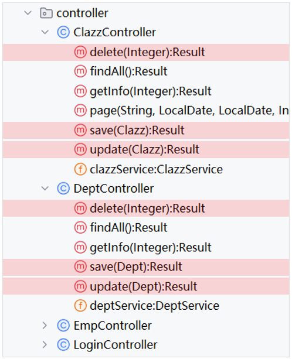
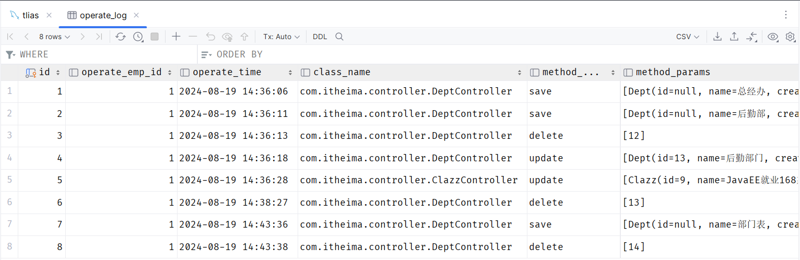
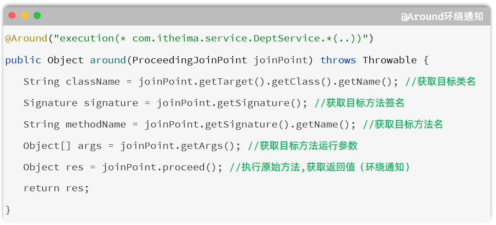
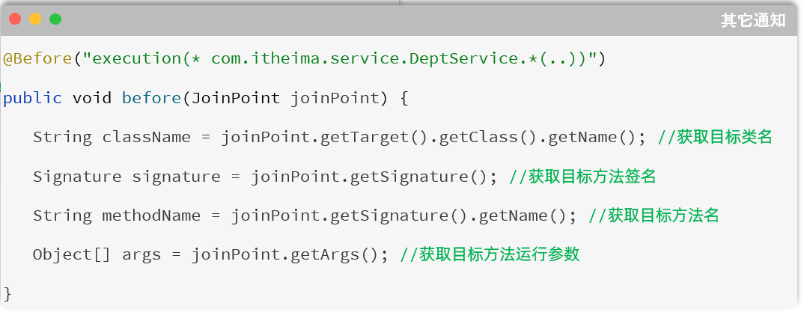
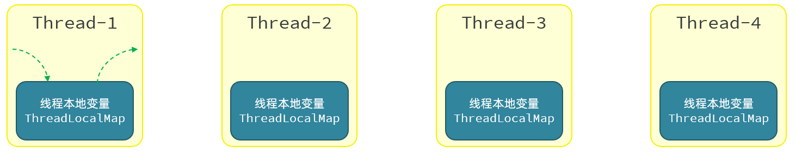
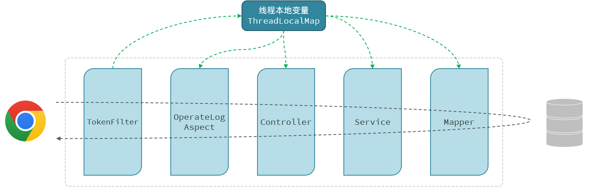
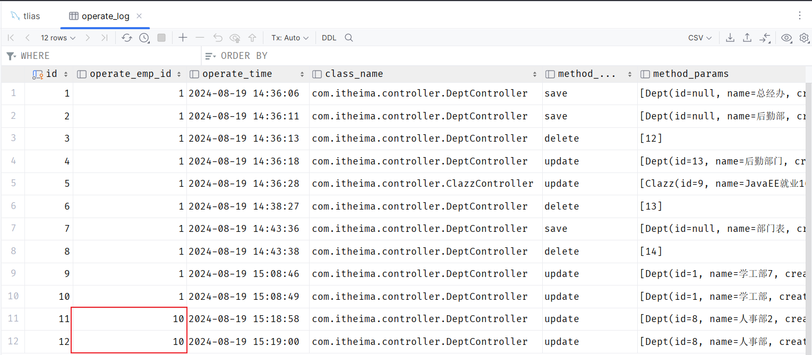

# AOP案例

SpringAOP的相关知识我们就已经全部学习完毕了。最后我们要通过一个案例来对AOP进行一个综合的应用。


## 需求

需求：将案例（Tlias智能学习辅助系统）中增、删、改相关接口的操作日志记录到数据库表中

- 就是当访问部门管理和员工管理当中的增、删、改相关功能接口时，需要详细的操作日志，并保存在数据表中，便于后期数据追踪。


操作日志信息包含：

- 操作人、操作时间、执行方法的全类名、执行方法名、方法运行时参数、返回值、方法执行时长


> 所记录的日志信息包括当前接口的操作人是谁操作的，什么时间点操作的，以及访问的是哪个类当中的哪个方法，在访问这个方法的时候传入进来的参数是什么，访问这个方法最终拿到的返回值是什么，以及整个接口方法的运行时长是多长时间。
> 
> 


## 分析

- 问题1：项目当中增删改相关的方法是不是有很多？

    - 很多

- 问题2：我们需要针对每一个功能接口方法进行修改，在每一个功能接口当中都来记录这些操作日志吗？

    - 这种做法比较繁琐

以上两个问题的解决方案：可以使用AOP解决\(每一个增删改功能接口中要实现的记录操作日志的逻辑代码是相同\)。

可以把这部分记录操作日志的通用的、重复性的逻辑代码抽取出来定义在一个通知方法当中，我们通过AOP面向切面编程的方式，在不改动原始功能的基础上来对原始的功能进行增强。目前我们所增强的功能就是来记录操作日志，所以也可以使用AOP的技术来实现。使用AOP的技术来实现也是最为简单，最为方便的。


- 问题3：既然要基于AOP面向切面编程的方式来完成的功能，那么我们要使用 AOP五种通知类型当中的哪种通知类型？

    - 答案：环绕通知 `@Around`。因为所记录的操作日志当中包括：操作人、操作时间，访问的是哪个类、哪个方法、方法运行时参数、方法的返回值、方法的运行时长。方法返回值，是在原始方法执行后才能获取到的。方法的运行时长，需要原始方法运行之前记录开始时间，原始方法运行之后记录结束时间。通过计算获得方法的执行耗时。基于以上的分析我们确定要使用Around环绕通知。

- 问题4：最后一个问题，切入点表达式我们该怎么写？

    - 答案：使用 `@annotation` 来描述切入点表达式。要匹配业务接口当中所有的增删改的方法，而增删改方法在命名上没有共同的前缀或后缀。此时如果使用`execution`切入点表达式也可以，但是会比较繁琐。 当遇到增删改的方法名没有规律时，就可以使用 `@annotation`切入点表达式




## 步骤

简单分析了一下大概的实现思路后，接下来我们就要来完成案例了。案例的实现步骤其实就两步：

- 准备工作

    1. 引入AOP的起步依赖

    2. 导入资料中准备好的数据库表结构，并引入对应的实体类

- 编码实现\(基于AI实现\)

    1. 自定义注解`@LogOperation`

    2. 定义切面类，完成记录操作日志的逻辑


## 代码实现

请帮我基于Spring AOP中的环绕通知 @Around 实现记录系统所有增、删、改功能接口的操作日志。具体信息如下：

1. 日志信息包含：操作人、操作时间、执行方法的全类名、执行方法名、方法运行时参数、返回值、方法执行时长

2. 功能接口所在包为 com\.itheima\.controller

3. 日志表为 operate\_log 表，对应的实体类为 OperateLog。 具体表结构如下：

create table operate\_log\(

id int unsigned primary key auto\_increment comment 'ID',

operate\_emp\_id int unsigned comment '操作人ID',

operate\_time datetime comment '操作时间',

class\_name varchar\(100\) comment '操作的类名',

method\_name varchar\(100\) comment '操作的方法名',

method\_params varchar\(1000\) comment '方法参数',

return\_value varchar\(2000\) comment '返回值',

cost\_time int comment '方法执行耗时, 单位:ms'

\) comment '操作日志表';

4. 并且已经提供了OperateLogMapper接口来操作 operate\_log, 并在其中已经定义好了 insert 方法用来保存日志数据\.


**1\)\. 准备工作**

- 在 pom\.xml 中引入AOP的依赖

```XML
<dependency>
    <groupId>org.springframework.boot</groupId>
    <artifactId>spring-boot-starter-aop</artifactId>
</dependency>
```

- 创建数据库表结构

```SQL
-- 操作日志表
create table operate_log(
    id int unsigned primary key auto_increment comment 'ID',
    operate_emp_id int unsigned comment '操作人ID',
    operate_time datetime comment '操作时间',
    class_name varchar(100) comment '操作的类名',
    method_name varchar(100) comment '操作的方法名',
    method_params varchar(1000) comment '方法参数',
    return_value varchar(2000) comment '返回值, 存储json格式',
    cost_time int comment '方法执行耗时, 单位:ms'
) comment '操作日志表';
```

- 引入资料中准备的实体类

```Java
package com.itheima.pojo;

import lombok.AllArgsConstructor;
import lombok.Data;
import lombok.NoArgsConstructor;
import java.time.LocalDateTime;

@Data
@NoArgsConstructor
@AllArgsConstructor
public class OperateLog {
    private Integer id; //ID
    private Integer operateEmpId; //操作人ID
    private LocalDateTime operateTime; //操作时间
    private String className; //操作类名
    private String methodName; //操作方法名
    private String methodParams; //操作方法参数
    private String returnValue; //操作方法返回值
    private Long costTime; //操作耗时
}

```

- 引入资料中准备的日志操作Mapper接口 `OperateLogMapper`

```Java
package com.itheima.mapper;

import com.itheima.pojo.OperateLog;
import org.apache.ibatis.annotations.Insert;
import org.apache.ibatis.annotations.Mapper;

@Mapper
public interface OperateLogMapper {
    
    //插入日志数据
    @Insert("insert into operate_log (operate_emp_id, operate_time, class_name, method_name, method_params, return_value, cost_time) " +
            "values (#{operateEmpId}, #{operateTime}, #{className}, #{methodName}, #{methodParams}, #{returnValue}, #{costTime});")
    public void insert(OperateLog log);
    
}

```


**1\)\. 自定义注解 ****`@LogOperation`**

```Java
/**
 *  自定义注解，用于标识哪些方法需要记录日志
 */
@Target(ElementType.METHOD)
@Retention(RetentionPolicy.RUNTIME)
public @interface LogOperation {
}
```


**2\)\. 定义AOP记录日志的切面类**

```Java
import com.itheima.anno.LogOperation;
import com.itheima.mapper.OperateLogMapper;
import com.itheima.pojo.OperateLog;
import org.aspectj.lang.ProceedingJoinPoint;
import org.aspectj.lang.annotation.Around;
import org.aspectj.lang.annotation.Aspect;
import org.springframework.beans.factory.annotation.Autowired;
import org.springframework.stereotype.Component;
import java.time.LocalDateTime;
import java.util.Arrays;

@Aspect
@Component
public class OperationLogAspect {

    @Autowired
    private OperateLogMapper operateLogMapper;

    // 环绕通知
    @Around("@annotation(log)")
    public Object around(ProceedingJoinPoint joinPoint, LogOperation log) throws Throwable {
        // 记录开始时间
        long startTime = System.*currentTimeMillis*();
        // 执行方法
        Object result = joinPoint.proceed();
        // 当前时间
        long endTime = System.*currentTimeMillis*();
        // 耗时
        long costTime = endTime - startTime;

        // 构建日志对象
        OperateLog operateLog = new OperateLog();
        operateLog.setOperateEmpId(getCurrentUserId()); // 需要实现 getCurrentUserId 方法
        operateLog.setOperateTime(LocalDateTime.*now*());
        operateLog.setClassName(joinPoint.getTarget().getClass().getName());
        operateLog.setMethodName(joinPoint.getSignature().getName());
        operateLog.setMethodParams(Arrays.*toString*(joinPoint.getArgs()));
        operateLog.setReturnValue(result.toString());
        operateLog.setCostTime(costTime);

        // 插入日志
        operateLogMapper.insert(operateLog);
        return result;
    }
    
    // 示例方法，获取当前用户ID
    private int getCurrentUserId() {
        // 这里应该根据实际情况从认证信息中获取当前登录用户的ID
        return 1; // 示例返回值
    }
}
```


**3\)\. 在需要记录的日志的****Controller层****的方法上，加上注解 ****`@LogOperation`**

```Java
@RestController
@RequestMapping("/clazzs")
public class ClazzController {

    @Autowired
    private ClazzService clazzService;

    */***
*     * 新增班级*
*     */*
*    *@LogOperation
    @PostMapping
    public Result save(@RequestBody Clazz clazz){
        clazzService.save(clazz);
        return Result.*success*();
    }
}    
```


重启SpringBoot服务，测试操作日志记录功能：

打开浏览器，针对于员工的数据、部门的数据进行增删改之后。我们打开数据库表结构可以来看一下：



我们会看到，在数据库表中，就清晰的记录了谁、什么时间点、调用了哪个类的哪个方法、传入了什么参数、返回了什么数据，都清晰的记录在数据库中了。


## 连接点

我们前面在讲解AOP核心概念的时候，我们提到过什么是连接点，连接点可以简单理解为可以被AOP控制的方法。

我们目标对象当中所有的方法是不是都是可以被AOP控制的方法。而在SpringAOP当中，连接点又特指方法的执行。

在Spring中用JoinPoint抽象了连接点，用它可以获得方法执行时的相关信息，如目标类名、方法名、方法参数等。

- 对于`@Around`通知，获取连接点信息只能使用`ProceedingJoinPoint`类型



- 对于其他四种通知，获取连接点信息只能使用`JoinPoint`，它是`ProceedingJoinPoint`的父类型




## 获取当前登录员工

- 员工登录成功后，哪里存储的有当前登录员工的信息？ 给客户端浏览器下发的jwt令牌中

- 如何从JWT令牌中获取当前登录用户的信息呢？ 获取请求头中传递的jwt令牌，并解析

- TokenFilter 中已经解析了令牌的信息，如何传递给AOP程序、Controller、Service呢？ThreadLocal


### ThreadLocal

- ThreadLocal** **并不是一个Thread，而是Thread的局部变量。

- ThreadLocal为每个线程提供一份单独的存储空间，具有线程隔离的效果，不同的线程之间不会相互干扰。



- 常见方法：

    - `public void set(T value)`` `  设置当前线程的线程局部变量的值

    - `public T get()`` `                    返回当前线程所对应的线程局部变量的值

    - `public void remove()`` `         移除当前线程的线程局部变量


### 记录当前登录员工



具体操作步骤：

1. 定义ThreadLocal操作的工具类，用于操作当前登录员工ID。

在 `com.itheima.utils` 引入工具类 `CurrentHolder`

```Java
package com.itheima.utils;

public class CurrentHolder {

    private static final ThreadLocal<Integer> *CURRENT_LOCAL *= new ThreadLocal<>();

    public static void setCurrentId(Integer employeeId) {
        *CURRENT_LOCAL*.set(employeeId);
    }

    public static Integer getCurrentId() {
        return *CURRENT_LOCAL*.get();
    }

    public static void remove() {
        *CURRENT_LOCAL*.remove();
    }
}
```


2. 在`TokenFilter`中，解析完当前登录员工ID，将其存入ThreadLocal（用完之后需将其删除）。

```Java
package com.itheima.filter;

import com.itheima.utils.CurrentHolder;
import com.itheima.utils.JwtUtils;
import io.jsonwebtoken.Claims;
import jakarta.servlet.*;
import jakarta.servlet.annotation.WebFilter;
import jakarta.servlet.http.HttpServletRequest;
import jakarta.servlet.http.HttpServletResponse;
import lombok.extern.slf4j.Slf4j;
import java.io.IOException;

@Slf4j
@WebFilter(urlPatterns = "/*")
public class TokenFilter implements Filter {
    @Override
    public void doFilter(ServletRequest servletRequest, ServletResponse servletResponse, FilterChain filterChain) throws IOException, ServletException {
        HttpServletRequest request = (HttpServletRequest) servletRequest;
        HttpServletResponse response = (HttpServletResponse) servletResponse;

        //1. 获取请求的url地址
        String uri = request.getRequestURI(); // /employee/login
        //String url = request.getRequestURL().toString(); // http://localhost:8080/employee/login

        //2. 判断是否是登录请求, 如果url地址中包含 login, 则说明是登录请求, 放行
        if (uri.contains("login")) {
            *log*.info("登录请求, 放行");
            filterChain.doFilter(request, response);
            return;
        }

        //3. 获取请求中的token
        String token = request.getHeader("token");

        //4. 判断token是否为空, 如果为空, 响应401状态码
        if (token == null || token.isEmpty()) {
            *log*.info("token为空, 响应401状态码");
            response.setStatus(401); // 响应401状态码
            return;
        }

        //5. 如果token不为空, 调用JWtUtils工具类的方法解析token, 如果解析失败, 响应401状态码
        try {
            Claims claims = JwtUtils.*parseJWT*(token);
            Integer empId = Integer.*valueOf*(claims.get("id").toString());
            CurrentHolder.*setCurrentId*(empId);
            *log*.info("token解析成功, 放行");
        } catch (Exception e) {
            *log*.info("token解析失败, 响应401状态码");
            response.setStatus(401);
            return;
        }

        //6. 放行
        filterChain.doFilter(request, response);

        //7. 清空当前线程绑定的id
        CurrentHolder.*remove*();
    }
}
```


3. 在AOP程序中，从ThreadLocal中获取当前登录员工的ID。

```Java
package com.itheima.aop;

import com.itheima.anno.LogOperation;
import com.itheima.mapper.OperateLogMapper;
import com.itheima.pojo.OperateLog;
import com.itheima.utils.CurrentHolder;
import org.aspectj.lang.ProceedingJoinPoint;
import org.aspectj.lang.annotation.Around;
import org.aspectj.lang.annotation.Aspect;
import org.springframework.beans.factory.annotation.Autowired;
import org.springframework.stereotype.Component;

import java.time.LocalDateTime;
import java.util.Arrays;

@Aspect
@Component
public class OperationLogAspect {

    @Autowired
    private OperateLogMapper operateLogMapper;

    // 环绕通知
    @Around("@annotation(log)")
    public Object around(ProceedingJoinPoint joinPoint, LogOperation log) throws Throwable {
        // 记录开始时间
        long startTime = System.*currentTimeMillis*();
        // 执行方法
        Object result = joinPoint.proceed();
        // 当前时间
        long endTime = System.*currentTimeMillis*();
        // 耗时
        long costTime = endTime - startTime;

        // 构建日志对象
        OperateLog operateLog = new OperateLog();
        operateLog.setOperateEmpId(getCurrentUserId()); // 需要实现 getCurrentUserId 方法
        operateLog.setOperateTime(LocalDateTime.*now*());
        operateLog.setClassName(joinPoint.getTarget().getClass().getName());
        operateLog.setMethodName(joinPoint.getSignature().getName());
        operateLog.setMethodParams(Arrays.*toString*(joinPoint.getArgs()));
        operateLog.setReturnValue(result.toString());
        operateLog.setCostTime(costTime);

        // 插入日志
        operateLogMapper.insert(operateLog);
        return result;
    }

    // 示例方法，获取当前用户ID
    private int getCurrentUserId() {
        return CurrentHolder.*getCurrentId*();
    }
}
```

代码优化完毕之后，我们重新启动服务测试。就可以看到，可以获取到不同的登录用户信息了。




在同一个线程/同一个请求中，进行数据共享就可以使用 ThreadLocal。


