# JDBC

## 介绍

**JDBC：（Java DataBase Connectivity），就是使用****Java语言操作关系型数据库的一套API****。**

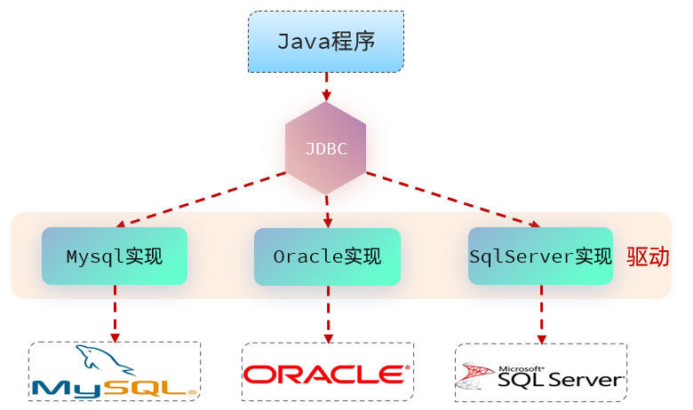

**本质：**

- sun公司官方定义的一套操作所有关系型数据库的规范，即接口。

- 各个数据库厂商去实现这套接口，提供数据库驱动jar包。

- 我们可以使用这套接口\(JDBC\)编程，真正执行的代码是驱动jar包中的实现类。


那有了JDBC之后，我们就可以直接在java代码中来操作数据库了，只需要编写这样一段java代码，就可以来操作数据库中的数据。 示例代码如下：

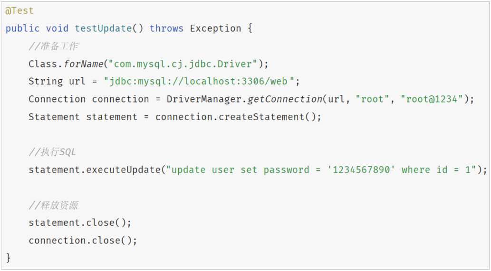


## 查询数据

### 需求

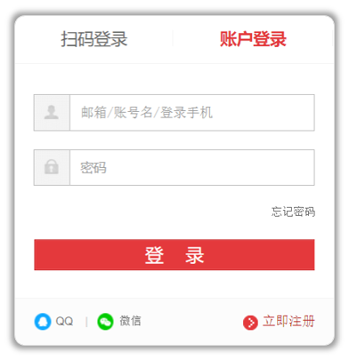

**需求：**基于JDBC实现用户登录功能。

**本质：**其本质呢，其实就是基于JDBC程序，执行如下select语句，并将查询的结果输出到控制台。SQL语句：

```SQL
select * from user where username = 'linchong' and password = '123456';
```


### 准备工作

1\)\. 创建一个maven项目

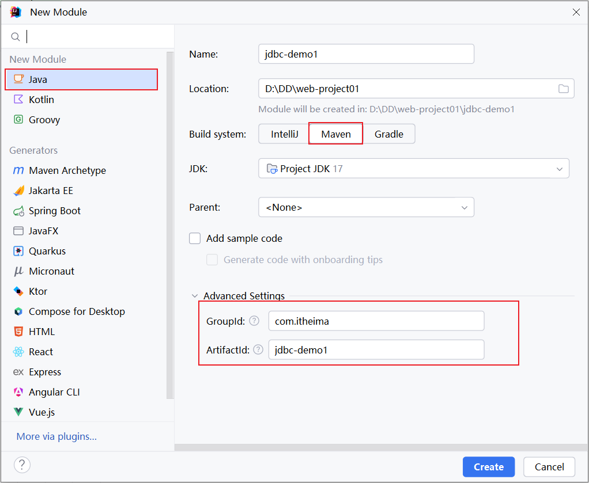


2\)\. 创建一个数据库 web，并在该数据库中创建user表

```SQL
create table user(
    id int unsigned primary key auto_increment comment 'ID,主键',
    username varchar(20) comment '用户名',
    password varchar(32) comment '密码',
    name varchar(10) comment '姓名',
    age tinyint unsigned comment '年龄'
) comment '用户表';

insert into user(id, username, password, name, age) values (1, 'daqiao', '123456', '大乔', 22),
                                                           (2, 'xiaoqiao', '123456', '小乔', 18),
                                                           (3, 'diaochan', '123456', '貂蝉', 24),
                                                           (4, 'lvbu', '123456', '吕布', 28),
                                                           (5, 'zhaoyun', '12345678', '赵云', 27);
```


### 代码实现

**AI提示词（prompt）：**

你是一名java开发工程师，帮我基于JDBC程序来操作数据库，执行如下SQL语句：

select \* from user where username = 'daqiao' and password = '123456'

**具体的代码为：**

1\)\. 在 pom\.xml 文件中引入依赖

```XML
<dependencies>
    <!-- MySQL JDBC driver -->
    <dependency>
        <groupId>mysql</groupId>
        <artifactId>mysql-connector-java</artifactId>
        <version>8.0.30</version>
    </dependency>

    <dependency>
        <groupId>org.junit.jupiter</groupId>
        <artifactId>junit-jupiter</artifactId>
        <version>5.9.3</version>
        <scope>test</scope>
    </dependency>
</dependencies>
```


2\)\. 在 `src/main/test/java` 目录下编写测试类，定义测试方法

```Java
public class JDBCTest {

    */***
*     * 编写JDBC程序, 查询数据*
*     */*
*    *@Test
    public void testJdbc() throws Exception {
        // 获取连接
        Connection conn = DriverManager.*getConnection*("jdbc:mysql://localhost:3306/web", "root", "1234");
        // 创建预编译的PreparedStatement对象
        PreparedStatement pstmt = conn.prepareStatement("SELECT * FROM user WHERE username = ? AND password = ?");
        // 设置参数
        pstmt.setString(1, "daqiao"); // 第一个问号对应的参数
        pstmt.setString(2, "123456"); // 第二个问号对应的参数
        // 执行查询
        ResultSet rs = pstmt.executeQuery();
        // 处理结果集
        while (rs.next()) {
            int id = rs.getInt("id");
            String uName = rs.getString("username");
            String pwd = rs.getString("password");
            String name = rs.getString("name");
            int age = rs.getInt("age");

            System.*out*.println("ID: " + id + ", Username: " + uName + ", Password: " + pwd + ", Name: " + name + ", Age: " + age);
        }
        // 关闭资源
        rs.close();
        pstmt.close();
        conn.close();
    }

}
```

而上述的单元测试中，我们在SQL语句中，将将 用户名 和密码的值都写死了，而这两个值应该是动态的，是将来页面传递到服务端的。 那么，我们可以基于前面所讲解的JUnit中的参数化测试进行单元测试，代码改造如下：

```Java
public class JDBCTest {

    */***
*     * 编写JDBC程序, 查询数据*
*     */*
*    *@ParameterizedTest
    @CsvSource({"daqiao,123456"})
    public void testJdbc(String _username, String _password) throws Exception {
        // 获取连接
        Connection conn = DriverManager.*getConnection*("jdbc:mysql://localhost:3306/web", "root", "1234");
        // 创建预编译的PreparedStatement对象
        PreparedStatement pstmt = conn.prepareStatement("SELECT * FROM user WHERE username = ? AND password = ?");
        // 设置参数
        pstmt.setString(1, _username); // 第一个问号对应的参数
        pstmt.setString(2, _password); // 第二个问号对应的参数
        // 执行查询
        ResultSet rs = pstmt.executeQuery();
        // 处理结果集
        while (rs.next()) {
            int id = rs.getInt("id");
            String uName = rs.getString("username");
            String pwd = rs.getString("password");
            String name = rs.getString("name");
            int age = rs.getInt("age");

            System.*out*.println("ID: " + id + ", Username: " + uName + ", Password: " + pwd + ", Name: " + name + ", Age: " + age);
        }
        // 关闭资源
        rs.close();
        pstmt.close();
        conn.close();
    }

}
```

如果在测试时，需要传递一组参数，可以使用  `@``CsvSource` 注解。


### 代码剖析

#### ResultSet

ResultSet（结果集对象）：封装了DQL查询语句查询的结果。

- next\(\)：将光标从当前位置向前移动一行，并判断当前行是否为有效行，返回值为boolean。

    - true：有效行，当前行有数据

    - false：无效行，当前行没有数据

- getXxx\(…\)：获取数据，可以根据列的编号获取，也可以根据列名获取（推荐）。


结果解析步骤：

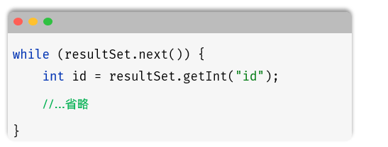


#### 预编译SQL

其实我们在编写SQL语句的时候，有两种风格：

- 静态SQL（参数硬编码）

```Java
conn.prepareStatement("SELECT * FROM user WHERE username = 'daqiao' AND password = '123456'");
ResultSet resultSet = pstmt.executeQuery();
```

这种呢，就是参数值，直接拼接在SQL语句中，参数值是写死的。


- 预编译SQL（参数动态传递）

```Java
conn.prepareStatement("SELECT * FROM user WHERE username = ? AND password = ?");
pstmt.setString(1, "daqiao");
pstmt.setString(2, "123456");
ResultSet resultSet = pstmt.executeQuery();
```

这种呢，并未将参数值在SQL语句中写死，而是使用 ？ 进行占位，然后再指定每一个占位符对应的值是多少，而最终在执行SQL语句的时候，程序会将SQL语句（SELECT \* FROM user WHERE username = ? AND password = ?），以及参数值（"daqiao", "123456"）都发送给数据库，然后在执行的时候，会使用参数值，将？占位符替换掉。


那这种预编译的SQL，也是在项目开发中推荐使用的SQL语句。主要的作用有两个：

- 防止SQL注入

- 性能更高

那接下来，我们就来介绍一下这两点。


##### SQL注入

- SQL注入：通过控制输入来修改事先定义好的SQL语句，以达到执行代码对服务器进行攻击的方法。 

SQL注入最典型的场景，就是用户登录功能。


**注入演示：**

1\)\. 打开课程资料中的文件夹 `资料/02. SQL注入演示`，运行其中的jar包 `sql_Injection_demo-0.0.1-SNAPSHOT.jar`，进入该目录后，执行命令：

```Java
java -jar sql_Injection_demo-0.0.1-SNAPSHOT.jar
```

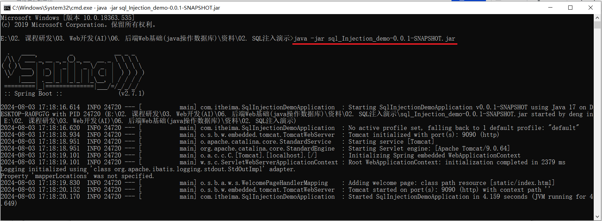


2\)\. 打开浏览器访问 `http://localhost:9090/`，必须登录后才能访问到系统。我们先测试正常的用户名和密码

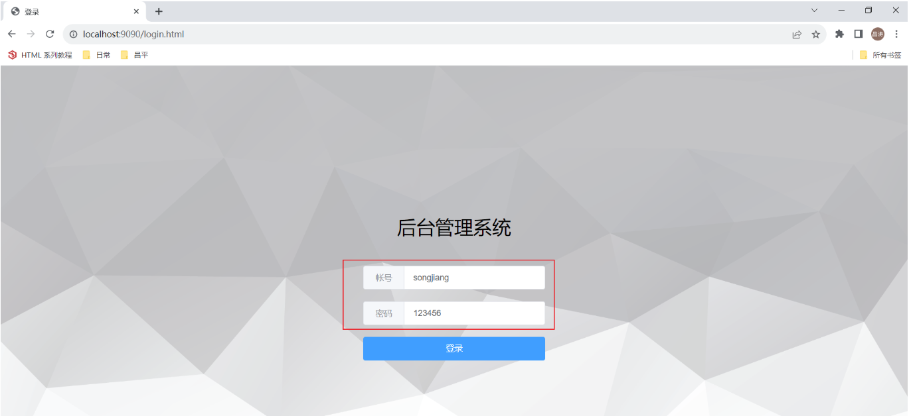

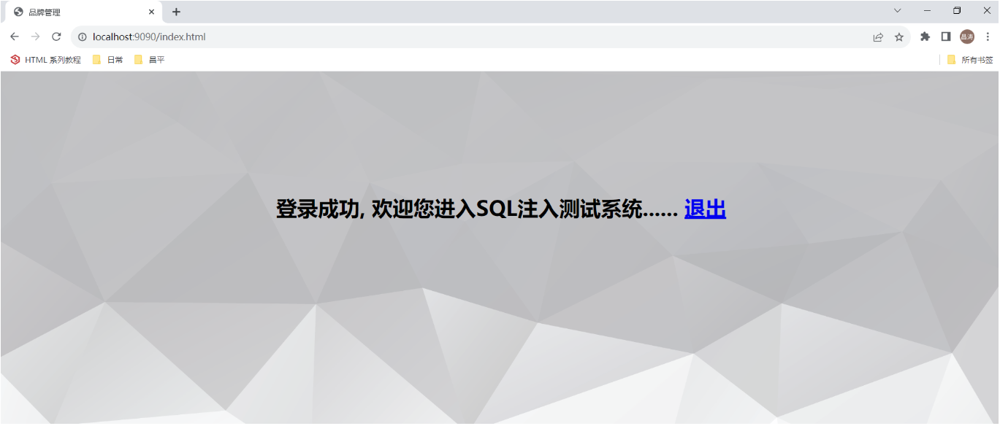


3\)\. 接下来，我们再来测试一下错误的用户名和密码 。

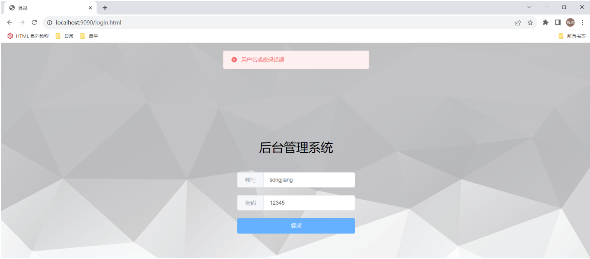

我们看到，如果用户名密码错误，是不能进入到系统中进行访问的，会提示 `用户名和密码错误`。


4\)\. 那接下来，我们就要演示一下SQL注入现象，我们可以通过控制表单输入，来修改事先定义好的SQL语句的含义。 从而来攻击服务器。

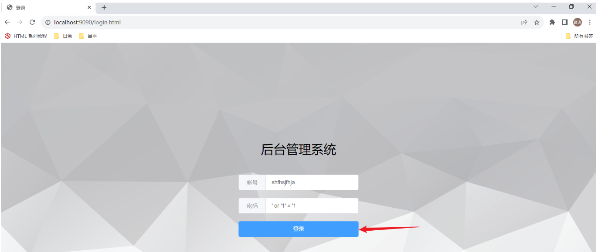

点击登录后，我们看到居然可以成功进入到系统中。


为什么会出现这种现象呢？

在进行登录操作时，怎么样才算登录成功呢？ 如果我们查询到了数据，就说明用户名密码是对的。 如果没有查询到数据，就说明用户名或密码错误。

而出现上述现象，原因就是因为，我们我们编写的SQL语句是基于字符串进行拼接的 。 我们输入的用户名无所谓，比如：`shfhsjfhja` ，而密码呢，就是我们精心设计的，如：`' or '1' = '1` 。

那最终拼接的SQL语句，如下所示：

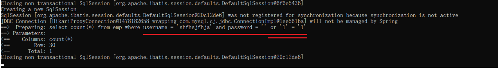

我们知道，`or` 连接的条件，是或的关系，两者满足其一就可以。 所以，虽然用户名密码输入错误，也是可以查询返回结果的，而只要查询到了数据，就说明用户名和密码是正确的。


##### SQL注入解决

而通过预编译SQL（select \* from user where username = ? and password = ?），就可以直接解决上述SQL注入的问题。 接下来，我们再来演示一下，通过预编译SQL是否能够解决SQL注入问题。


1\)\. 打开课程资料中的文件夹 `资料/02. SQL注入演示`，运行其中的jar包 `sql_prepared_demo-0.0.1-SNAPSHOT.jar`，进入该目录后，执行命令：

```Java
java -jar sql_prepared_demo-0.0.1-SNAPSHOT.jar
```

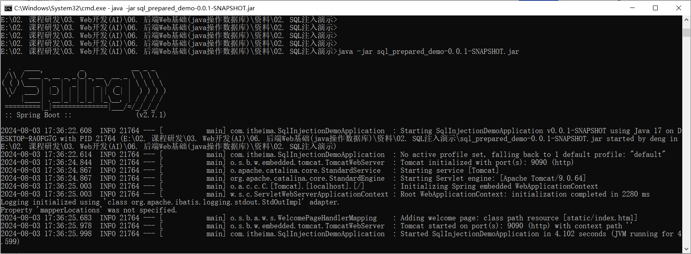


2\)\. 打开浏览器访问 `http://localhost:9090/` ，必须登录后才能访问到系统 。我们先测试正常的用户名和密码 

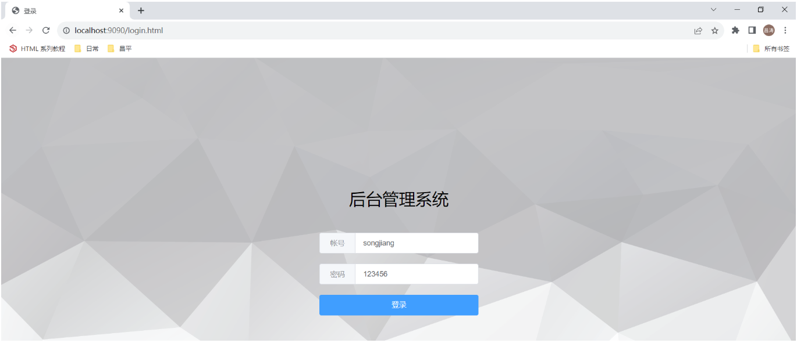


3\)\. 那接下来，我们就要演示一下是否可以基于上述的密码 `' or '1' = '1`，来完成SQL注入 。

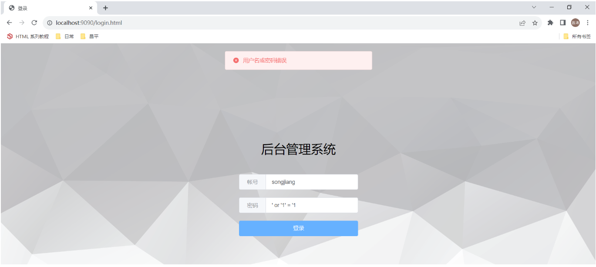

通过控制台，可以看到输入的SQL语句，是预编译SQL语句。

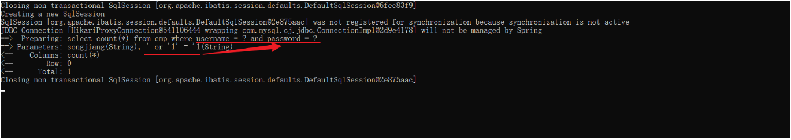

而在预编译SQL语句中，当我们执行的时候，会把整个`' or '1'='1`作为一个完整的参数，赋值给第2个问号（`' or '1'='1`进行了转义，只当做字符串使用）

那么此时再查询时，就查询不到对应的数据了，登录失败。

**注意：在以后的项目开发中，我们使用的基本全部都是预编译SQL语句。 **


##### 性能更高

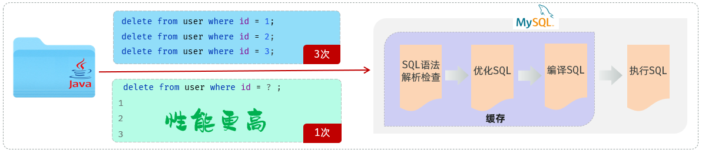


## 增删改数据

### 需求

- 需求：基于JDBC程序，执行如下update语句。

- SQL：

```Java
update user set password = '123456', gender = 2 where id = 1;
```


### 代码实现

**AI提示词（prompt）：**

你是一名java开发工程师，帮我基于JDBC程序来操作数据库，执行如下SQL语句：

update user set password = '123456', gender = 2 where id = 1;


代码实现如下：

```Java
@ParameterizedTest
@CsvSource({"1,123456,25"})
public void testUpdate(int userId, String newPassword, int newAge) throws Exception {
    // 建立数据库连接
    Connection conn = DriverManager.*getConnection*("jdbc:mysql://localhost:3306/web", "root", "1234");
    // SQL 更新语句
    String sql = "UPDATE user SET password = ?, age = ? WHERE id = ?";
    // 创建预编译的PreparedStatement对象
    PreparedStatement pstmt = conn.prepareStatement(sql);

    // 设置参数
    pstmt.setString(1, newPassword); // 第一个问号对应的参数
    pstmt.setInt(2, newAge);      // 第二个问号对应的参数
    pstmt.setInt(3, userId);         // 第三个问号对应的参数

    // 执行更新
    int rowsUpdated = pstmt.executeUpdate();

    // 输出结果
    System.*out*.println(rowsUpdated + " row(s) updated.");

    // 关闭资源
    pstmt.close();
    conn.close();
}
```


- JDBC程序执行DML语句：int rowsUpdated = pstmt\.executeUpdate\(\);  //返回值是影响的记录数

- JDBC程序执行DQL语句：ResultSet resultSet = pstmt\.executeQuery\(\); //返回值是查询结果集


