# Mybatis

## 介绍


什么是MyBatis?

- MyBatis是一款优秀的 **持久层** **框架**，用于简化JDBC的开发。

- MyBatis本是 Apache的一个开源项目iBatis，2010年这个项目由apache迁移到了google code，并且改名为MyBatis 。2013年11月迁移到Github。

- 官网：https://mybatis\.org/mybatis\-3/zh/index\.html 


在上面我们提到了两个词：一个是持久层，另一个是框架。

- 持久层：指的是就是数据访问层\(dao\)，是用来操作数据库的。

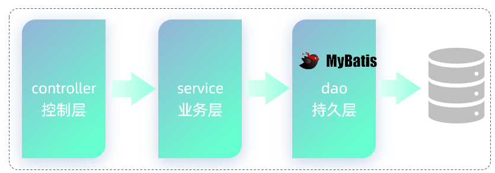

- 框架：是一个半成品软件，是一套可重用的、通用的、软件基础代码模型。在框架的基础上进行软件开发更加高效、规范、通用、可拓展。


通过Mybatis就可以大大简化原生的JDBC程序的代码编写，比如 通过 `select * from user` 查询所有的用户数据，通过JDBC程序操作呢，需要大量的代码实现，而如果通过Mybatis实现相同的功能，只需要简单的三四行就可以搞定。

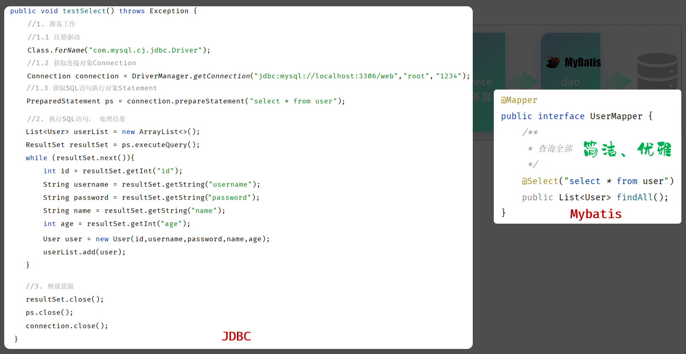


### 快速入门

需求：使用Mybatis查询所有用户数据 。


**1\)\. 创建springboot工程，并导入 mybatis的起步依赖、mysql的驱动包、lombok。**

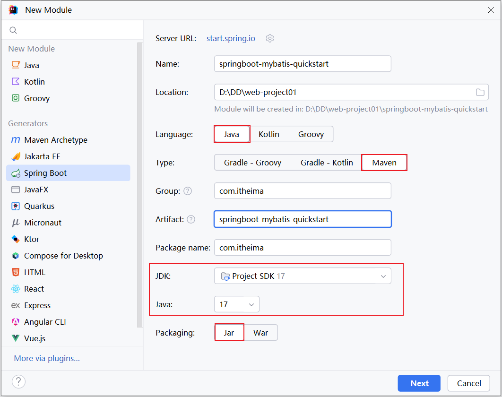

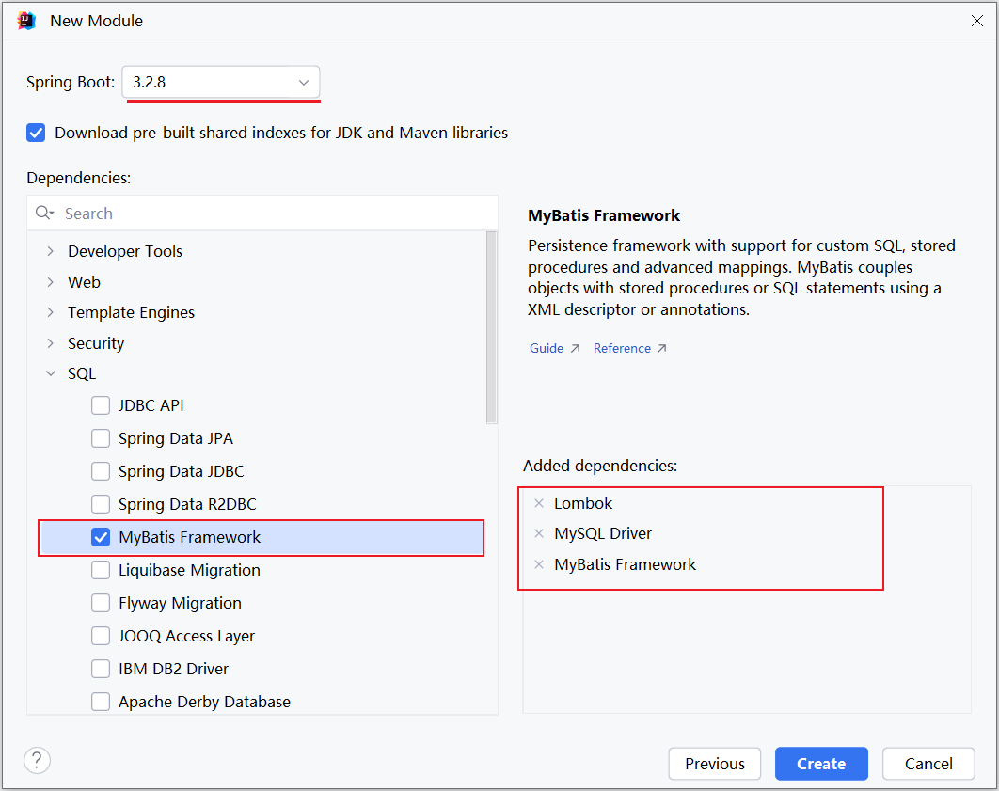

项目工程创建完成后，自动在pom\.xml文件中，导入Mybatis依赖和MySQL驱动依赖。如下所示：

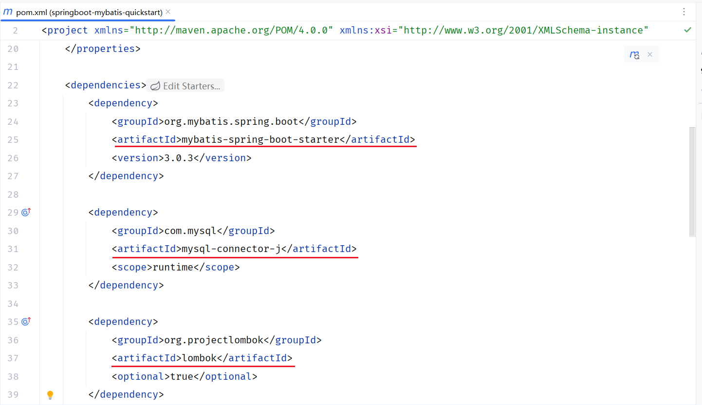


**2\)\. 数据准备：创建用户表user，并创建对应的实体类User。**

- 用户表 user（如果已经存在，就不用创建了）

```Java
create table user(
    id int unsigned primary key auto_increment comment 'ID,主键',
    username varchar(20) comment '用户名',
    password varchar(32) comment '密码',
    name varchar(10) comment '姓名',
    age tinyint unsigned comment '年龄'
) comment '用户表';

insert into user(id, username, password, name, age) values (1, 'daqiao', '123456', '大乔', 22),
                                                           (2, 'xiaoqiao', '123456', '小乔', 18),
                                                           (3, 'diaochan', '123456', '貂蝉', 24),
                                                           (4, 'lvbu', '123456', '吕布', 28),
                                                           (5, 'zhaoyun', '12345678', '赵云', 27);
```

- 实体类：实体类的属性名与表中的字段名一一对应。 实体类放在 `com.itheima.pojo` 包下。

```Java
@Data
@NoArgsConstructor
@AllArgsConstructor
public class User {
    private Integer id; //ID
    private String username; //用户名
    private String password; //密码
    private String name; //姓名
    private Integer age; //年龄
}
```

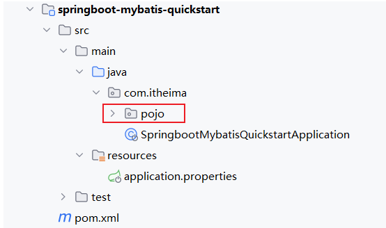


**3\)\. 配置Mybatis**

在 `application.properties` 中配置数据库的连接信息。

```Properties
#数据库访问的url地址
spring.datasource.url=jdbc:mysql://localhost:3306/web
#数据库驱动类类名
spring.datasource.driver-class-name=com.mysql.cj.jdbc.Driver
#访问数据库-用户名
spring.datasource.username=root
#访问数据库-密码
spring.datasource.password=root@1234
```

上述的配置，可以直接复制过去，不要敲错了。 全部都是 `spring.datasource.xxxx` 开头。


**4\)\. 编写Mybatis程序：编写Mybatis的持久层接口，定义SQL语句（注解）**

在创建出来的springboot工程中，在引导类所在包下，在创建一个包 `mapper` 。在 `mapper` 包下创建一个接口 `UserMapper` ，这是一个持久层接口（Mybatis的持久层接口规范一般都叫 XxxMapper）。

UserMapper接口的内容如下：

```Java
import com.itheima.pojo.User;
import org.apache.ibatis.annotations.Mapper;
import org.apache.ibatis.annotations.Select;
import java.util.List;

@Mapper
public interface UserMapper {
    /**
     * 查询全部
     */
    @Select("select * from user")
    public List<User> findAll();
}
```

**注解说明：**

- @Mapper注解：表示是mybatis中的Mapper接口

程序运行时，框架会自动生成接口的实现类对象\(代理对象\)，并给交Spring的IOC容器管理

- @Select注解：代表的就是select查询，用于书写select查询语句


**5\)\. 单元测试**

在创建出来的SpringBoot工程中，在src下的test目录下，已经自动帮我们创建好了测试类 ，并且在测试类上已经添加了注解 `@SpringBootTest`，代表该测试类已经与SpringBoot整合。 

该测试类在运行时，会自动通过引导类加载Spring的环境（IOC容器）。我们要测试那个bean对象，就可以直接通过`@Autowired`注解直接将其注入进行，然后就可以测试了。 


测试类代码如下：

```Java
@SpringBootTest
class SpringbootMybatisQuickstartApplicationTests {

    @Autowired
    private UserMapper userMapper;

    @Test
    public void testFindAll(){
        List<User> userList = userMapper.findAll();
        for (User user : userList) {
            System.*out*.println(user);
        }
    }
}
```

运行结果：

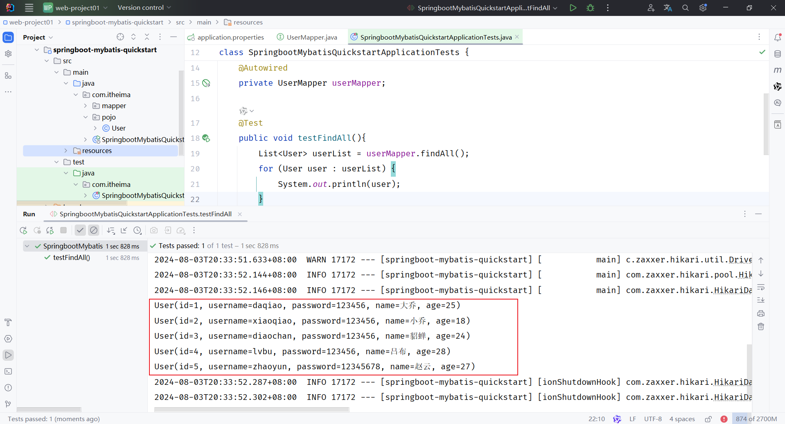

注意：测试类所在包，需要与引导类所在包相同。


### 辅助配置

#### 配置SQL提示

默认我们在UserMapper接口上加的 `@Select` 注解中编写SQL语句是没有提示的。 如果想让idea给我们提示对应的SQL语句，我们需要在IDEA中配置与MySQL数据库的链接。 

默认我们在UserMapper接口上的 `@Select` 注解中编写SQL语句是没有提示的。如果想让idea给出提示，可以做如下配置：

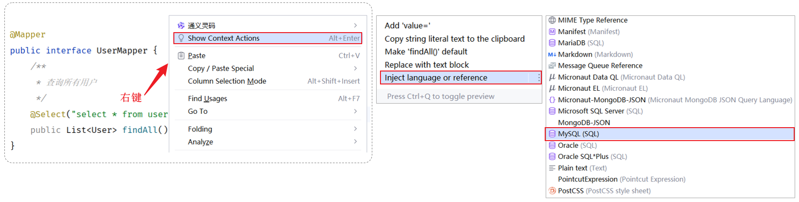

配置完成之后，发现SQL语句中的关键字有提示了，但还存在不识别表名\(列名\)的情况：

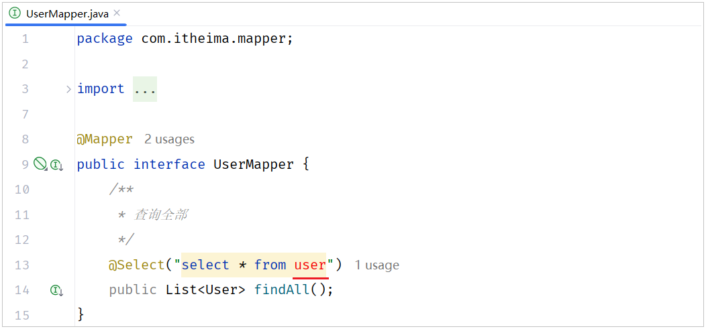

- 产生原因：Idea和数据库没有建立连接，不识别表信息

- 解决方案：在Idea中配置MySQL数据库连接


按照如下方如下方式，来配置当前IDEA关联的MySQL数据库（必须要指定连接的是哪个数据库）。

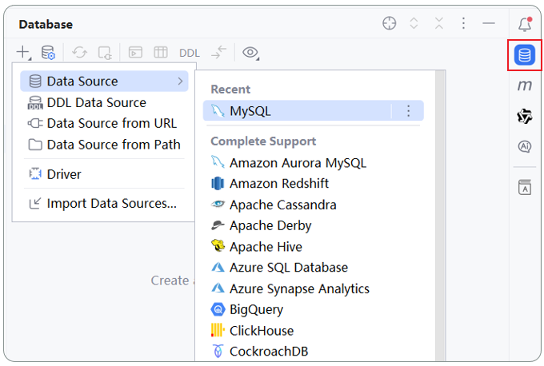

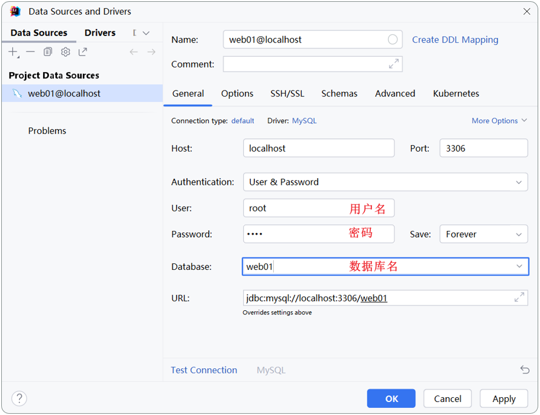

在配置的时候指定连接那个数据库，如上图所示连接的就是mybatis数据库（自己的数据库名是什么就指定什么）。

**注意：**该配置的目的，仅仅是为了在编写SQL语句时，有语法提示（写错了会报错），不会影响运行，即使不配置也是可以的。


#### 配置Mybatis日志输出

默认情况下，在Mybatis中，SQL语句执行时，我们并看不到SQL语句的执行日志。 在`application.properties`加入如下配置，即可查看日志： 

```Properties
#mybatis的配置
mybatis.configuration.log-impl=org.apache.ibatis.logging.stdout.StdOutImpl
```

打开上述开关之后，再次运行单元测试，就可以看到控制台输出的SQL语句是什么样子的。

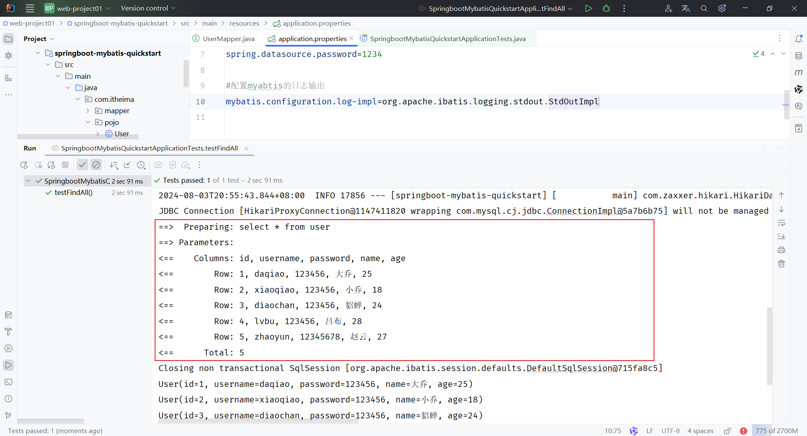


### JDBC VS  Mybatis

JDBC程序的**缺点**：

- url、username、password 等相关参数全部硬编码在java代码中。

- 查询结果的解析、封装比较繁琐。

- 每一次操作数据库之前，先获取连接，操作完毕之后，关闭连接。 频繁的获取连接、释放连接造成资源浪费。


分析了JDBC的缺点之后，我们再来看一下在mybatis中，是如何解决这些问题的：

- 数据库连接四要素\(驱动、链接、用户名、密码\)，都配置在springboot默认的配置文件 application\.properties中

- 查询结果的解析及封装，由mybatis自动完成映射封装，我们无需关注

- 在mybatis中使用了数据库连接池技术，从而避免了频繁的创建连接、销毁连接而带来的资源浪费。

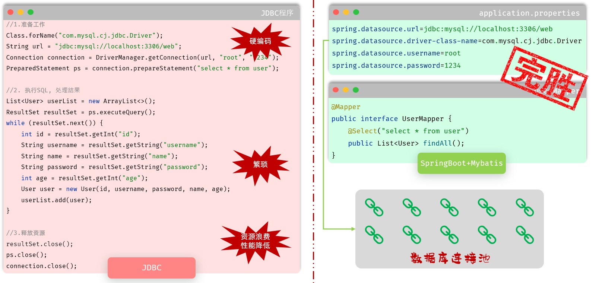

使用SpringBoot\+Mybatis的方式操作数据库，能够提升开发效率、降低资源浪费


而对于Mybatis来说，我们在开发持久层程序操作数据库时，需要重点关注以下两个方面：

1. application\.properties

```Properties
#驱动类名称
spring.datasource.driver-class-name=com.mysql.cj.jdbc.Driver
#数据库连接的url
spring.datasource.url=jdbc:mysql://localhost:3306/web01
#连接数据库的用户名
spring.datasource.username=root
#连接数据库的密码
spring.datasource.password=1234
```


2. Mapper接口（编写SQL语句）

```Java
@Mapper
public interface UserMapper {
    @Select("select * from user")
    public List<User> list();
}
```


### 数据库连接池

在前面我们所讲解的mybatis中，使用了数据库连接池技术，避免频繁的创建连接、销毁连接而带来的资源浪费。

下面我们就具体的了解下数据库连接池。

#### 介绍

1\)\. 没有数据库连接池的情况

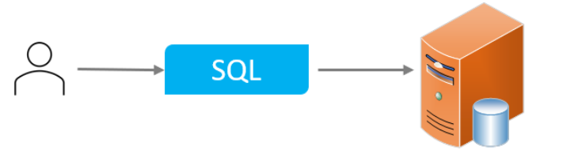

客户端执行SQL语句：要先创建一个新的连接对象，然后执行SQL语句，SQL语句执行后又需要关闭连接对象从而释放资源，每次执行SQL时都需要创建连接、销毁链接，这种频繁的重复创建销毁的过程是比较耗费计算机的性能。


2\)\. 有数据库连接池的情况

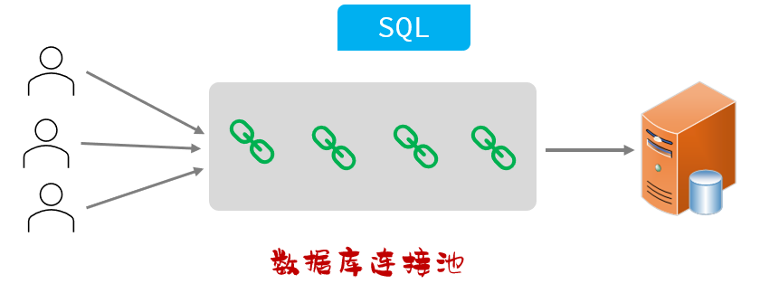

数据库连接池是个容器，负责分配、管理数据库连接\(Connection\)

- 程序在启动时，会在数据库连接池\(容器\)中，创建一定数量的Connection对象


允许应用程序重复使用一个现有的数据库连接，而不是再重新建立一个

- 客户端在执行SQL时，先从连接池中获取一个Connection对象，然后在执行SQL语句，SQL语句执行完之后，释放Connection时就会把Connection对象归还给连接池（Connection对象可以复用）


释放空闲时间超过最大空闲时间的连接，来避免因为没有释放连接而引起的数据库连接遗漏

- 客户端获取到Connection对象了，但是Connection对象并没有去访问数据库\(处于空闲\)，数据库连接池发现Connection对象的空闲时间 \> 连接池中预设的最大空闲时间，此时数据库连接池就会自动释放掉这个连接对象


数据库连接池的好处：

- 资源重用

- 提升系统响应速度

- 避免数据库连接遗漏


#### 产品

要怎么样实现数据库连接池呢？

- 官方\(sun\)提供了数据库连接池标准（javax\.sql\.DataSource接口）

- 功能：获取连接 

    ```Java
    public Connection getConnection() throws SQLException;
    ```

- 第三方组织必须按照DataSource接口实现


常见的数据库连接池：**C3P0 ****、****DBCP ****、****Druid ****、****Hikari \(springboot默认\)**

现在使用更多的是：**Hikari、Druid  （性能更优越）**


**1\)\. Hikari（追光者） \[默认的连接池\]** 

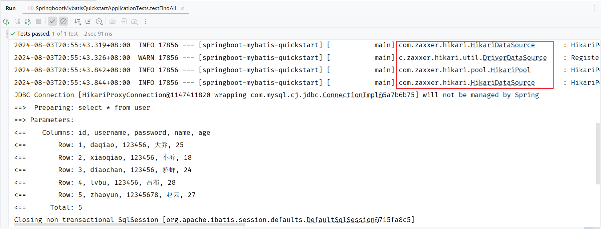

从控制台输出的日志，我们也可以看出，springboot底层默认使用的数据库连接池就是 Hikari。


**2\)\. Druid（德鲁伊）**

- Druid连接池是阿里巴巴开源的数据库连接池项目 

- 功能强大，性能优秀，是Java语言最好的数据库连接池之一


如果我们想把默认的数据库连接池切换为Druid数据库连接池，只需要完成以下两步操作即可：

> 参考官方地址：[https://github\.com/alibaba/druid/tree/master/druid\-spring\-boot\-starter](https://github.com/alibaba/druid/tree/master/druid-spring-boot-starter)
> 
> 


①\. 在`pom.xml`文件中引入依赖

```XML
<dependency>
    <!-- Druid连接池依赖 -->
    <groupId>com.alibaba</groupId>
    <artifactId>druid-spring-boot-starter</artifactId>
    <version>1.2.19</version>
</dependency>
```


②\. 在`application.properties`中引入数据库连接配置

```Properties
spring.datasource.type=com.alibaba.druid.pool.DruidDataSource
spring.datasource.druid.driver-class-name=com.mysql.cj.jdbc.Driver
spring.datasource.druid.url=jdbc:mysql://localhost:3306/web
spring.datasource.druid.username=root
spring.datasource.druid.password=1234
```

配置完毕之后，我们再次运行单元测试，大家会看到控制台输出的日志中，已经将连接池切换为了 Druid连接池。

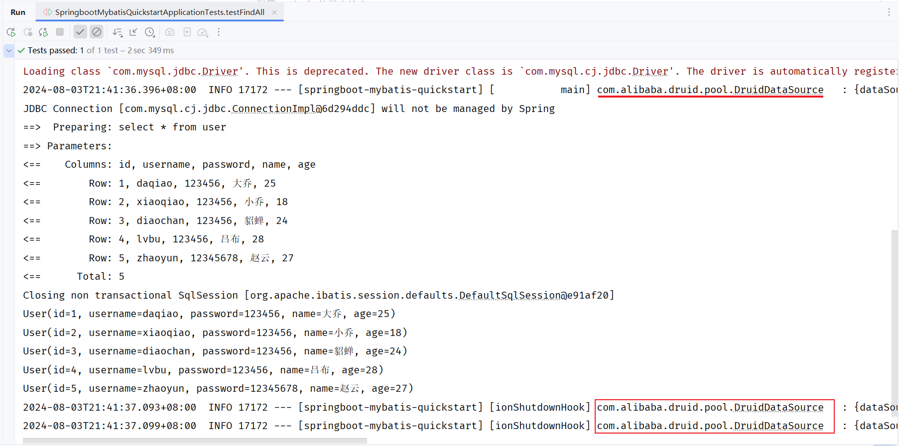


### 增删改查操作

#### 删除

- 需求：根据ID删除用户信息

- SQL：delete from user where id = 5;

- Mapper接口方法：

    - 方式一：

    ```Java
    */***
    * * 根据id删除*
    * */*
    @Delete("delete from user where id = 5")
    public void deleteById();
    ```

这种方式执行删除操作，调用deleteById方法只能删除id为5的用户信息，因为将id直接写死在代码中了，不可取。

- 方式二：

```Java
*/***
* * 根据id删除*
* */*
@Delete("delete from user where id = #{id}")
public void deleteById(Integer id);
```

在Mybatis中，我们可以通过参数占位符号 `#{...}` 来占位，在调用`deleteById`方法时，传递的参数值，最终会替换占位符。

- 编写单元测试方法进行测试

    在单元测试类中,增加如下测试方法\.

    ```Java
    @Test
    public void testDeleteById(){
        userMapper.deleteById(36);
    }
    ```

运行单元测试，结果如下：

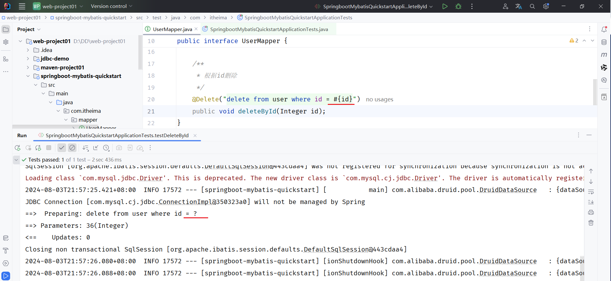

运行之后，我们发现，`#{...}` 占位符，其实最终被替换成了 ？占位符，生成的是预编译的SQL语句。【推荐】


- DML语句执行完毕，是有返回值的，我们可以为Mapper接口方法定义返回值来接收，如下：

    ```Java
    */***
    * * 根据id删除*
    * */*
    @Delete("delete from user where id = #{id}")
    public Integer deleteById(Integer id);
    ```

Integer类型的返回值，表示DML语句执行完毕影响的记录数。


- Mybatis的提供的符号，有两个，一个是 `#{...}`，另一个是 `${...}`，区别如下：

**那在企业项目开发中，****强烈建议使用 \#\{\.\.\.\} ****。**


#### 新增

- 需求：添加一个用户

- SQL：insert into user\(username,password,name,age\) values\('zhouyu','123456','周瑜',20\);

- Mapper接口：

```Java
*/***
* * 添加用户*
* */*
@Insert("insert into user(username,password,name,age) values(#{username},#{password},#{name},#{age})")
public void insert(User user);
```

如果在SQL语句中，我们需要传递多个参数，我们可以把多个参数封装到一个对象中。然后在SQL语句中，我们可以通过`#{对象``属性``名}`的方式，获取到对象中封装的属性值。

- 单元测试：

在测试类中添加测试方法，代码如下：

```Java
@Test
public void testInsert(){
    User user = new User();
    user.setUsername("admin");
    user.setPassword("123456");
    user.setName("管理员");
    user.setAge(30);
    userMapper.insert(user);
}
```

运行结果如下：

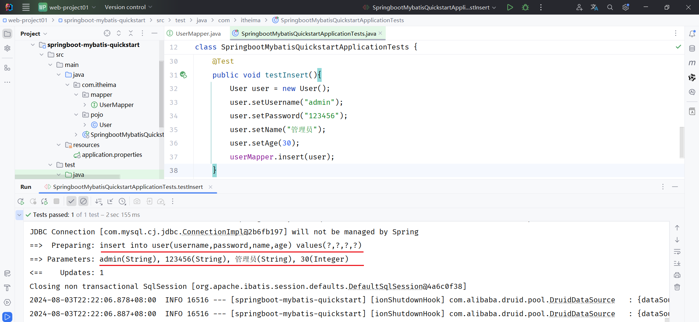


#### 修改

- 需求：根据ID更新用户信息

- SQL：update user set username = 'zhouyu', password = '123456', name = '周瑜', age = 20 where id = 1；

- Mapper接口方法：

```Java
*/***
* * 根据id更新用户信息*
* */*
@Update("update user set username = #{username},password = #{password},name = #{name},age = #{age} where id = #{id}")
public void update(User user);
```

- 单元测试：

在测试类中添加测试方法，代码如下：

```Java
@Test
public void testUpdate(){
    User user = new User();
    user.setId(6);
    user.setUsername("admin666");
    user.setPassword("123456");
    user.setName("管理员");
    user.setAge(30);
    userMapper.update(user);
}
```

运行结果如下：

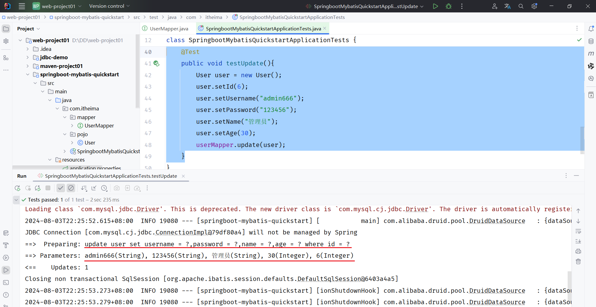


#### 查询

- 需求：根据用户名和密码查询用户信息

- SQL：select\** *fromuser whereusername = 'zhouyu' and password = '123456'

- Mapper接口方法：

```Java
*/***
* * 根据用户名和密码查询用户信息*
* */*
@Select("select * from user where username = #{username} and password = #{password}")
public User findByUsernameAndPassword(@Param("username") String username, @Param("password") String password);
```

@param注解的作用是为接口的方法形参起名字的。（由于用户名唯一的，所以查询返回的结果最多只有一个，可以直接封装到一个对象中）

- 单元测试：

在测试类中添加测试方法，代码如下：

```Java
@Test
public void testFindByUsernameAndPassword(){
    User user = userMapper.findByUsernameAndPassword("admin666", "123456");
    System.*out*.println(user);
}
```

运行结果如下：

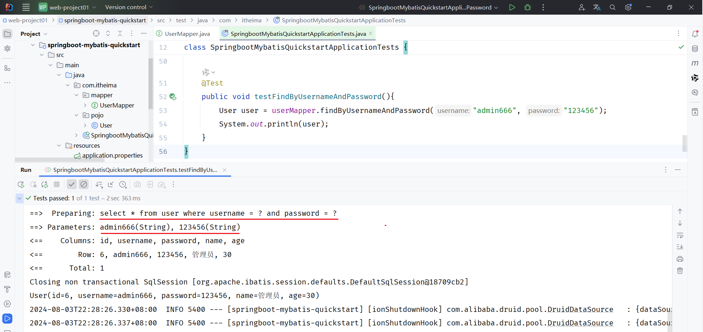


**说明：**基于官方骨架创建的springboot项目中，接口编译时会保留方法形参名，@Param注解可以省略 \(\#\{形参名\}\)。

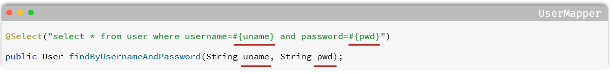


### PageHelper分页插件

#### 介绍

前面我们已经完了基础的分页查询，大家会发现：分页查询功能编写起来比较繁琐。 而分页查询的功能是非常常见的，我们查询员工信息需要分页查询，将来在做其他项目时，查询用户信息、订单信息、商品信息等等都是需要进行分页查询的。

而分页查询的思路、步骤是比较固定的。 在Mapper接口中定义两个方法执行两条不同的SQL语句：

1. 查询总记录数

2. 指定页码的数据列表

在Service当中，调用Mapper接口的两个方法，分别获取：总记录数、查询结果列表，然后在将获取的数据结果封装到PageBean对象中。

大家思考下：在未来开发其他项目，只要涉及到分页查询功能\(例：订单、用户、支付、商品\)，都必须按照以上操作完成功能开发

结论：原始方式的分页查询，存在着"步骤固定"、"代码频繁"的问题

解决方案：可以使用一些现成的分页插件完成。对于Mybatis来讲现在最主流的就是PageHelper。


**PageHelper是第三方提供的Mybatis框架中的一款功能强大、方便易用的分页插件，支持任何形式的单标、多表的分页查询。**

官网：https://pagehelper\.github\.io/


那接下来，我们可以对比一下，使用PageHelper分页插件进行分页 与 原始方式进行分页代码实现的上的差别。

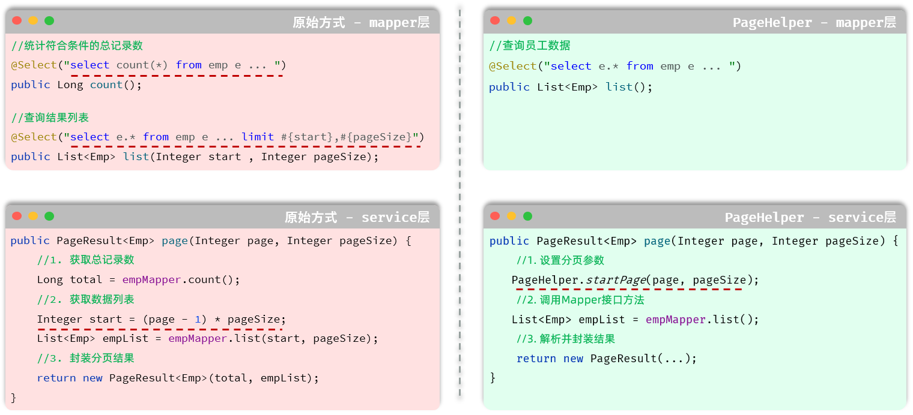

- Mapper接口层：

    - 原始的分页查询功能中，我们需要在Mapper接口中定义两条SQL语句。

    - PageHelper实现分页查询之后，只需要编写一条SQL语句，而且不需要考虑分页操作，就是一条正常的查询语句。

- Service层：

    - 需要根据页码、每页展示记录数，手动的计算起始索引。

    - 无需手动计算起始索引，直接告诉PageHelper需要查询那一页的数据，每页展示多少条记录即可。


#### 代码实现

当使用了PageHelper分页插件进行分页，就无需再Mapper中进行手动分页了。 在Mapper中我们只需要进行正常的列表查询即可。在Service层中，调用Mapper的方法之前设置分页参数，在调用Mapper方法执行查询之后，解析分页结果，并将结果封装到PageResult对象中返回。

1\)\. 在pom\.xml引入依赖

```XML
<!--分页插件PageHelper-->
<dependency>
    <groupId>com.github.pagehelper</groupId>
    <artifactId>pagehelper-spring-boot-starter</artifactId>
    <version>1.4.7</version>
</dependency>
```


2\)\. EmpMapper

```Java
/**
 * 查询所有的员工及其对应的部门名称
 */
@Select("select e.*, d.name deptName from emp as e left join dept as d on e.dept_id = d.id")
public List<Emp> list();
```


3\)\. EmpServiceImpl

```Java
@Override
public PageResult page(Integer page, Integer pageSize) {
    //1. 设置分页参数
    PageHelper.startPage(page,pageSize);

    //2. 执行查询
    List<Emp> empList = empMapper.list();
    Page<Emp> p = (Page<Emp>) empList;

    //3. 封装结果
    return new PageResult(p.getTotal(), p.getResult());
}
```


#### 功能测试

功能开发完成后，我们重启项目工程，打开Apifox，发起GET请求，访问：`http://localhost:8080/emps?page=1&pageSize=5`


我们可以看到数据可以正常查询返回，是可以正常实现分页查询的。


#### 实现机制

我们打开Idea的控制台，可以看到在进行分页查询时，输出的SQL语句。


我们看到执行了两条SQL语句，而这两条SQL语句，其实是从我们在Mapper接口中定义的SQL演变而来的。

- 第一条SQL语句，用来查询总记录数。

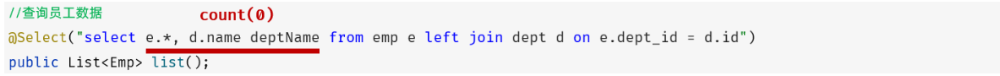

其实就是将我们编写的SQL语句进行的改造增强，将查询返回的字段列表替换成了 `count(0)` 来统计总记录数。


- 第二条SQL语句，用来进行分页查询，查询指定页码对应 的数据列表。

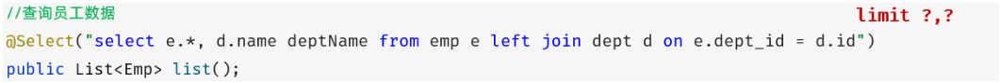

其实就是将我们编写的SQL语句进行的改造增强，在SQL语句之后拼接上了limit进行分页查询，而由于测试时查询的是第一页，起始索引是0，所以简写为limit ？。


而PageHelper在进行分页查询时，会执行上述两条SQL语句，并将查询到的总记录数，与数据列表封装到了 `Page<Emp>` 对象中，我们再获取查询结果时，只需要调用Page对象的方法就可以获取。


**注意：**

- PageHelper实现分页查询时，SQL语句的结尾一定一定一定不要加分号\(;\)\.。

- PageHelper只会对紧跟在其后的第一条SQL语句进行分页处理。


### XML映射配置

Mybatis的开发有两种方式：

1. 注解

2. XML


#### XML配置文件规范

使用Mybatis的注解方式，主要是来完成一些简单的增删改查功能。如果需要实现复杂的SQL功能，建议使用XML来配置映射语句，也就是将SQL语句写在XML配置文件中。


**在Mybatis中使用XML映射文件方式开发，****需要符合一定的规范****：**

1. XML映射文件的名称与Mapper接口名称一致，并且将XML映射文件和Mapper接口放置在相同包下（同包同名）

2. XML映射文件的namespace属性为Mapper接口全限定名一致

3. XML映射文件中sql语句的id与Mapper接口中的方法名一致，并保持返回类型一致。

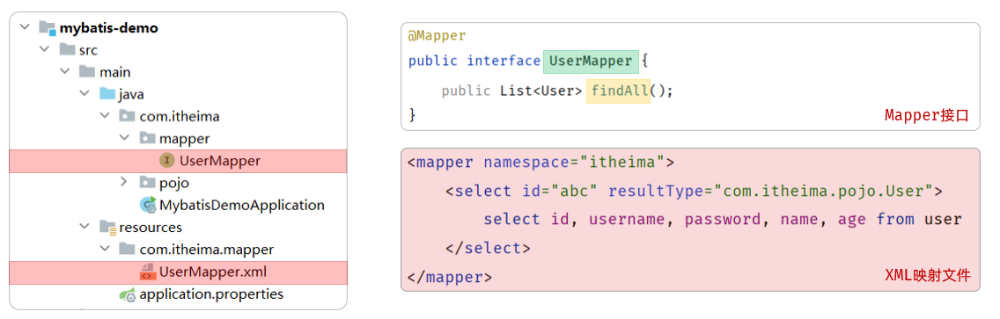

> \<select\>标签：就是用于编写select查询语句的。
> 
> - resultType属性，指的是查询返回的单条记录所封装的类型。
> 
> 


#### XML配置文件实现

**第1步： 创建XML映射文件**

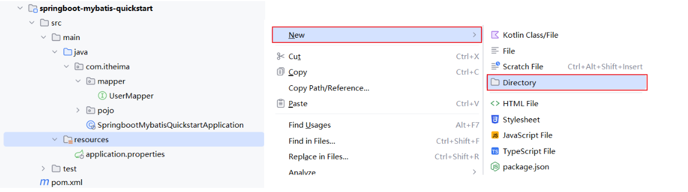

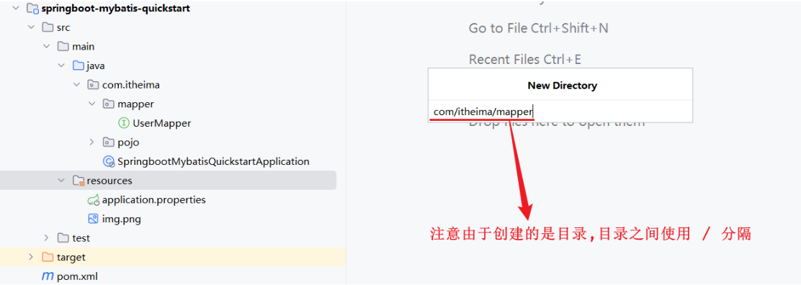


**第2步：编写XML映射文件**

> xml映射文件中的dtd约束，直接从mybatis官网复制即可; 或者直接AI生成。
> 
> 

```XML
<?xml version="1.0" encoding="UTF-8" ?>
<!DOCTYPE mapper
  PUBLIC "-//mybatis.org//DTD Mapper 3.0//EN"
  "https://mybatis.org/dtd/mybatis-3-mapper.dtd">
<mapper namespace="">
 
</mapper>
```


**第3步：配置**

**a\. XML映射文件的namespace属性为Mapper接口全限定名**

```XML
<?xml version="1.0" encoding="UTF-8" ?>
<!DOCTYPE mapper
        PUBLIC "-//mybatis.org//DTD Mapper 3.0//EN"
        "https://mybatis.org/dtd/mybatis-3-mapper.dtd">
<mapper namespace="com.itheima.mapper.UserMapper">

</mapper>
```


**b\. XML映射文件中sql语句的id与Mapper接口中的方法名一致，并保持返回类型一致**

```XML
<?xml version="1.0" encoding="UTF-8" ?>
<!DOCTYPE mapper
        PUBLIC "-//mybatis.org//DTD Mapper 3.0//EN"
        "https://mybatis.org/dtd/mybatis-3-mapper.dtd">
<mapper namespace="com.itheima.mapper.EmpMapper">

    <!--查询操作-->
    <select id="findAll" resultType="com.itheima.pojo.User">
        select * from user
    </select>
    
</mapper>
```

resultType 属性的值，与查询返回的单条记录封装的类型一致。

运行测试类，执行结果：

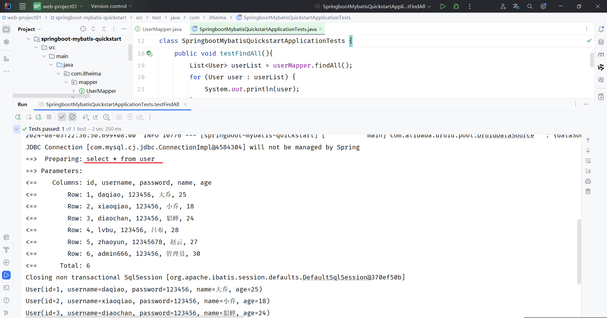


**注意****：一个接口方法对应的SQL语句，要么使用注解配置，要么使用XML配置，切不可同时配置。**


#### MybatisX的使用

MybatisX是一款基于IDEA的快速开发Mybatis的插件，为效率而生。

MybatisX的安装：

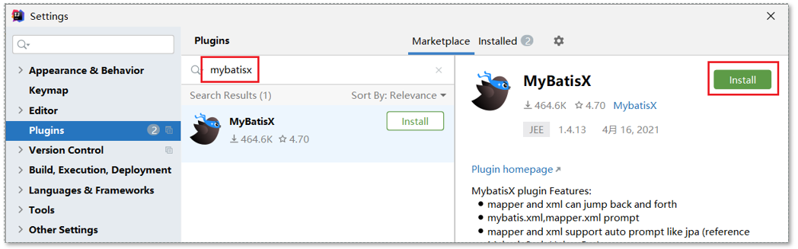

可以通过MybatisX快速定位：

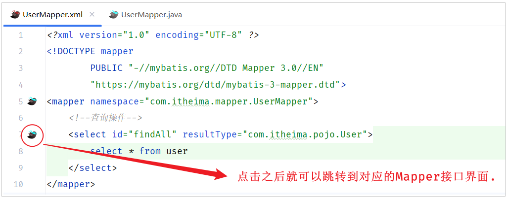

MybatisX的使用在后续学习中会继续分享。


- 学习了Mybatis中XML配置文件的开发方式了，大家可能会存在一个疑问：到底是使用注解方式开发还是使用XML方式开发？

官方说明：https://mybatis\.net\.cn/getting\-started\.html。下面是官方说明:


**结论：**使用Mybatis的注解，主要是来完成一些简单的增删改查功能。如果需要实现复杂的SQL功能，建议使用XML来配置映射语句。

