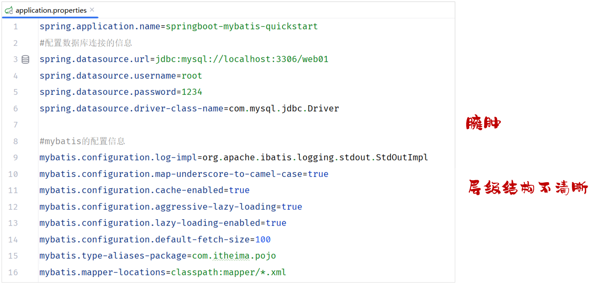
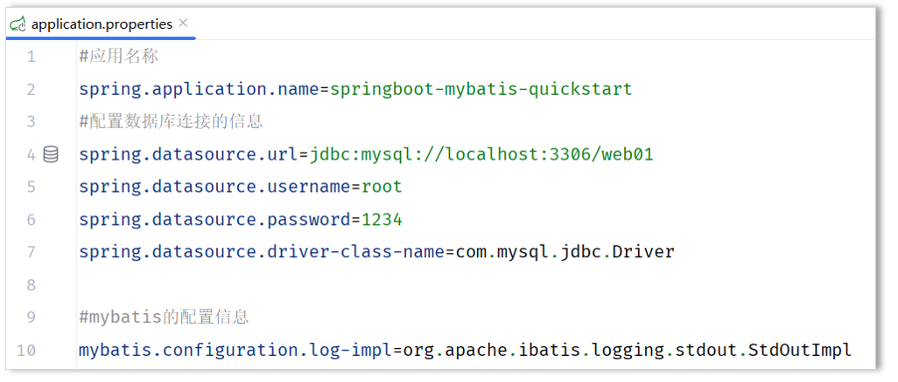
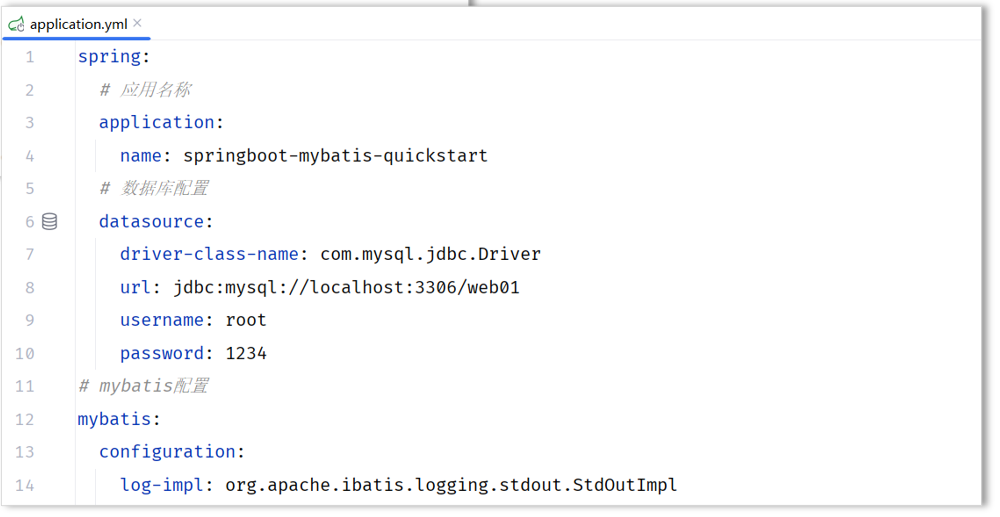

# SpringBoot配置文件

## 介绍

前面我们一直使用springboot项目创建完毕后自带的`application.properties`进行属性的配置，而如果在项目中，我们需要配置大量的属性，采用properties配置文件这种 `key=value` 的配置形式，就会显得配置文件的层级结构不清晰，也比较臃肿。



那其实呢，在springboot项目当中是支持多种配置方式的，除了支持properties配置文件以外，还支持另外一种类型的配置文件，就是我们接下来要讲解的yml格式的配置文件。yml格式配置文件名字为：`application.yaml` , `application.yml` 这两个配置文件的后缀名虽然不一样，但是里面配置的内容形式都是一模一样的。

我们可以来对比一下，采用 `application.properties` 和 `application.yml` 来配置同一段信息\(数据库连接信息\)，两者之间的配置对比：


在项目开发中，我们推荐使用application\.yml配置文件来配置信息，简洁、明了、以数据为中心。


## 语法

简单的了解过springboot所支持的配置文件，以及不同类型配置文件之间的优缺点之后，接下来我们就来了解下yml配置文件的基本语法：

- 大小写敏感

- 数值前边必须有空格，作为分隔符

- 使用缩进表示层级关系，缩进时，不允许使用Tab键，只能用空格（idea中会自动将Tab转换为空格）

- 缩进的空格数目不重要，只要相同层级的元素左侧对齐即可

- `#`表示注释，从这个字符一直到行尾，都会被解析器忽略


了解完yml格式配置文件的基本语法之后，接下来我们再来看下yml文件中常见的数据格式。在这里我们主要介绍最为常见的两类：

1. 定义对象或Map集合

2. 定义数组、list或set集合


- 对象/Map集合

```YAML
user:
  name: zhangsan
  age: 18
  password: 123456
```


- 数组/List/Set集合

```YAML
hobby: 
  - java
  - game
  - sport
```

在yml格式的配置文件中，如果配置项的值是以 0 开头的，值需要使用 '' 引起来，因为以0开头在yml中表示8进制的数据。


## 案例

熟悉完了yml文件的基本语法后，我们修改下之前案例中使用的配置文件，变更为application\.yml配置方式：

1. 修改application\.properties名字为：`_application.properties`（名字随便更换，只要加载不到即可）

2. 创建新的配置文件： `application.yml`


- 原有的 `application.properties` 配置文件



- 新建的 `application.`yml 配置文件




配置文件的内容如下：

```YAML
#数据源配置
spring:
  datasource:
    driver-class-name: com.mysql.cj.jdbc.Driver
    url: jdbc:mysql://localhost:3306/web01
    username: root
    password: root@1234
#mybatis配置
mybatis:
  configuration:
    log-impl: org.apache.ibatis.logging.stdout.StdOutImpl
```


