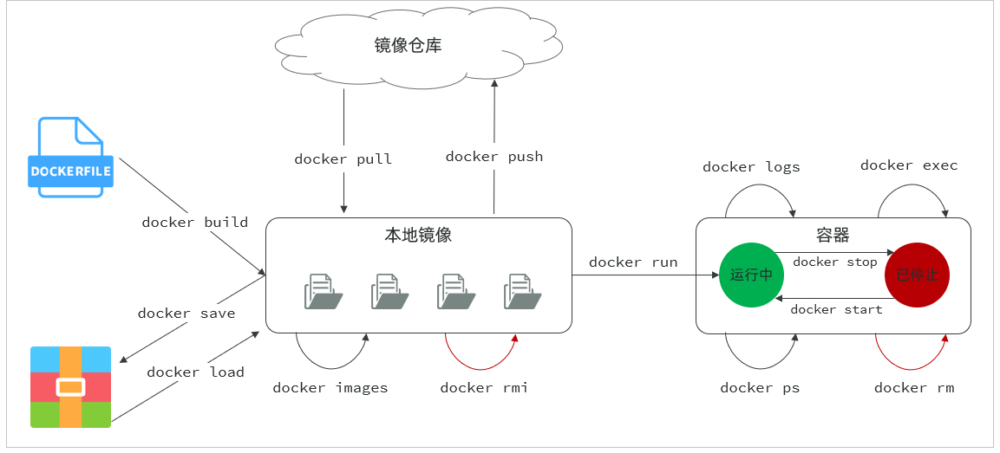
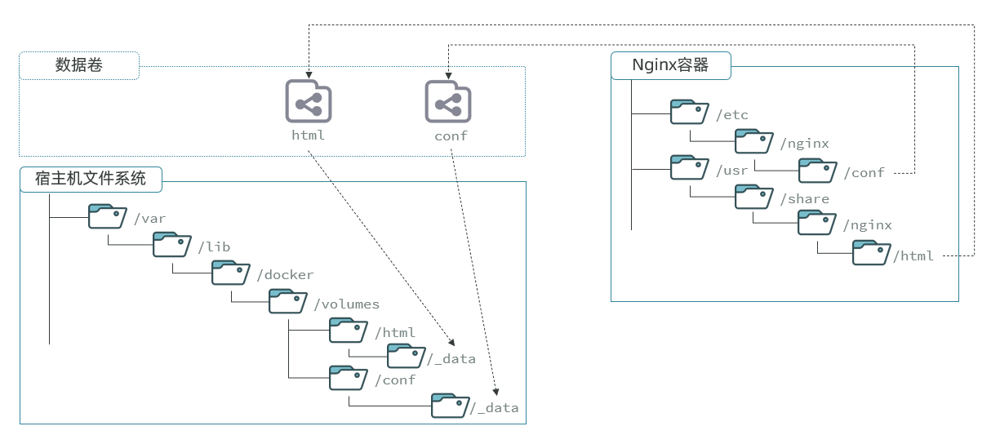
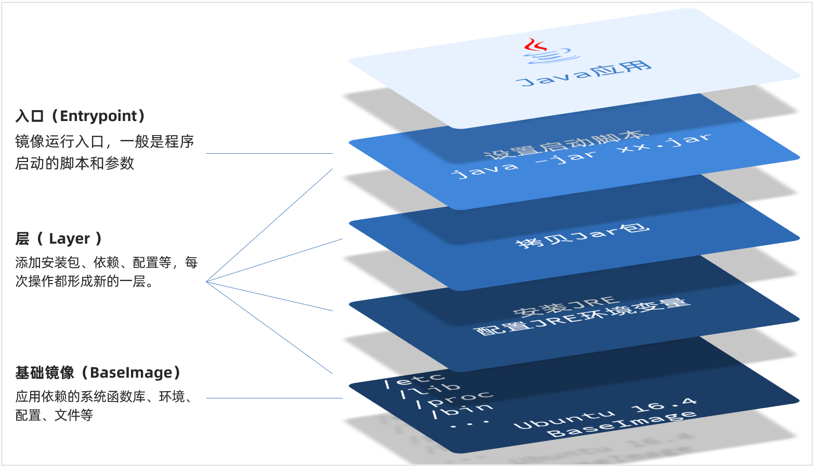
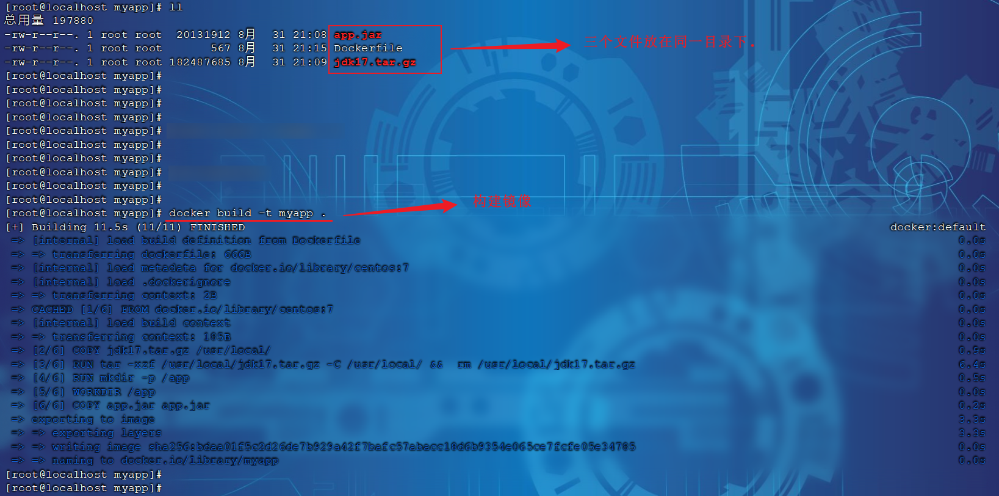

# Docker基础

接下来，我们一起来学习Docker使用的一些基础知识，为将来部署项目打下基础。

## 常见命令

### 命令介绍

其中，比较常见的命令有：

|**命令**|**说明**|**文档地址**|
|---|---|---|
|docker pull|拉取镜像|[docker pull](https://docs.docker.com/engine/reference/commandline/pull/)|
|docker push|推送镜像到DockerRegistry|[docker push](https://docs.docker.com/engine/reference/commandline/push/)|
|docker images|查看本地镜像|[docker images](https://docs.docker.com/engine/reference/commandline/images/)|
|docker rmi|删除本地镜像|[docker rmi](https://docs.docker.com/engine/reference/commandline/rmi/)|
|docker run|创建并运行容器（不能重复创建）|[docker run](https://docs.docker.com/engine/reference/commandline/run/)|
|docker stop|停止指定容器|[docker stop](https://docs.docker.com/engine/reference/commandline/stop/)|
|docker start|启动指定容器|[docker start](https://docs.docker.com/engine/reference/commandline/start/)|
|docker restart|重新启动容器|[docker restart](https://docs.docker.com/engine/reference/commandline/restart/)|
|docker rm|删除指定容器|[docs\.docker\.com](https://docs.docker.com/engine/reference/commandline/rm/)|
|docker ps|查看容器|[docker ps](https://docs.docker.com/engine/reference/commandline/ps/)|
|docker logs|查看容器运行日志|[docker logs](https://docs.docker.com/engine/reference/commandline/logs/)|
|docker exec|进入容器|[docker exec](https://docs.docker.com/engine/reference/commandline/exec/)|
|docker save|保存镜像到本地压缩文件|[docker save](https://docs.docker.com/engine/reference/commandline/save/)|
|docker load|加载本地压缩文件到镜像|[docker load](https://docs.docker.com/engine/reference/commandline/load/)|
|docker inspect|查看容器详细信息|[docker inspect](https://docs.docker.com/engine/reference/commandline/inspect/)|

用一副图来表示这些命令的关系：




**补充：**

默认情况下，每次重启虚拟机我们都需要手动启动Docker和Docker中的容器。通过命令可以实现开机自启：

```PowerShell
# Docker开机自启
systemctl enable docker

# Docker容器开机自启
docker update --restart=always [容器名/容器id]
```


### 演示

我们以Nginx为例给大家演示上述命令。

```PowerShell
# 第1步，去DockerHub查看nginx镜像仓库及相关信息

# 第2步，拉取Nginx镜像 (比较耗时)
docker pull nginx:1.20.2

# 第3步，查看镜像
docker images

# 第4步，创建并允许Nginx容器
docker run -d --name nginx -p 80:80 nginx

# 第5步，查看运行中容器
docker ps

# 也可以加格式化方式访问，格式会更加清爽
docker ps --format "table {{.ID}}\t{{.Image}}\t{{.Ports}}\t{{.Status}}\t{{.Names}}"

# 第6步，访问网页，地址：http://虚拟机地址

# 第7步，停止容器
docker stop nginx

# 第8步，查看所有容器
docker ps -a --format "table {{.ID}}\t{{.Image}}\t{{.Ports}}\t{{.Status}}\t{{.Names}}"

# 第9步，再次启动nginx容器
docker start nginx

# 第10步，再次查看容器
docker ps --format "table {{.ID}}\t{{.Image}}\t{{.Ports}}\t{{.Status}}\t{{.Names}}"

# 第11步，查看容器详细信息
docker inspect nginx

# 第12步，进入容器,查看容器内目录
docker exec -it nginx bash

# 或者，可以进入MySQL
docker exec -it mysql mysql -uroot -p

# 第13步，删除容器
docker rm nginx

# 发现无法删除，因为容器运行中，强制删除容器
docker rm -f nginx
```


## 数据卷

容器是隔离环境，容器内程序的文件、配置、运行时产生的容器都在容器内部，我们要读写容器内的文件非常不方便。大家思考几个问题：

- 如果要升级MySQL版本，需要销毁旧容器，那么数据岂不是跟着被销毁了？

- MySQL、Nginx容器运行后，如果我要修改其中的某些配置该怎么办？

- 我想要让Nginx代理我的静态资源怎么办？


因此，容器提供程序的运行环境，但是 **程序运行产生的数据、程序运行依赖的配置都应该与容器解耦**。


### 介绍

**数据卷（volume）**是一个虚拟目录，是**容器内目录**与**宿主机目录**之间映射的桥梁。

以Nginx为例，我们知道Nginx中有两个关键的目录：

- `html`：放置一些静态资源

- `conf`：放置配置文件

如果我们要让Nginx代理我们的静态资源，最好是放到`html`目录；如果我们要修改Nginx的配置，最好是找到`conf`下的`nginx.conf`文件。

但遗憾的是，容器运行的Nginx所有的文件都在容器内部。所以我们必须利用数据卷将两个目录与宿主机目录关联，方便我们操作。


**如图：**




在上图中：

- 我们创建了两个数据卷：`conf`、`html`

- Nginx容器内部的`conf`目录和`html`目录分别与两个数据卷关联。

- 而数据卷conf和html分别指向了宿主机的`/var/lib/docker/volumes/conf/_data`目录和`/var/lib/docker/volumes/html/``_data`目录


这样以来，容器内的`conf`和`html`目录就 与宿主机的`conf`和`html`目录关联起来，我们称为**挂载**。

此时，我们操作宿主机的`/var/lib/docker/volumes/html/_data`就是在操作容器内的`/usr/share/nginx/html/``_data`目录。只要我们将静态资源放入宿主机对应目录，就可以被Nginx代理了。


**小提示**：

`/var/lib/docker/volumes`这个目录就是默认的存放所有容器数据卷的目录，其下再根据数据卷名称创建新目录，格式为`/数据卷名/_data`。


**为什么不让容器目录直接指向宿主机目录呢**？

- 因为直接指向宿主机目录就与宿主机强耦合了，如果切换了环境，宿主机目录就可能发生改变了。由于容器一旦创建，目录挂载就无法修改，这样容器就无法正常工作了。

- 但是容器指向数据卷，一个逻辑名称，而数据卷再指向宿主机目录，就不存在强耦合。如果宿主机目录发生改变，只要改变数据卷与宿主机目录之间的映射关系即可。


不过，我们通过由于数据卷目录比较深，不好寻找，通常我们也**允许让容器直接与宿主机目录挂载而不使用数据卷**，具体参考2\.2\.3小节。


### 命令

数据卷的相关命令有：

|**命令**|**说明**|**文档地址**|
|---|---|---|
|docker volume create|创建数据卷|[docker volume create](https://docs.docker.com/engine/reference/commandline/volume_create/)|
|docker volume ls|查看所有数据卷|[docs\.docker\.com](https://docs.docker.com/engine/reference/commandline/volume_ls/)|
|docker volume rm|删除指定数据卷|[docs\.docker\.com](https://docs.docker.com/engine/reference/commandline/volume_prune/)|
|docker volume inspect|查看某个数据卷的详情|[docs\.docker\.com](https://docs.docker.com/engine/reference/commandline/volume_inspect/)|
|docker volume prune|清除数据卷|[docker volume prune](https://docs.docker.com/engine/reference/commandline/volume_prune/)|

注意：容器与数据卷的挂载要在创建容器时配置，对于创建好的容器，是不能设置数据卷的。而且**创建容器的过程中，数据卷会自动创建**。


教学**演示环节**：演示一下nginx的html目录挂载

```PowerShell
# 1.首先创建容器并指定数据卷，注意通过 -v 参数来指定数据卷
docker run -d --name nginx -p 80:80 -v html:/usr/share/nginx/html nginx:1.20.2

# 2.然后查看数据卷
docker volume ls


# 3.查看数据卷详情
docker volume inspect html


# 4.查看/var/lib/docker/volumes/html/_data目录
ll /var/lib/docker/volumes/html/_data


# 5.进入该目录，并随意修改index.html内容
cd /var/lib/docker/volumes/html/_data
vi index.html

# 6.打开页面，查看效果

# 7.进入容器内部，查看/usr/share/nginx/html目录内的文件是否变化
docker exec -it nginx bash
```


教学**演示环节**：演示一下MySQL的匿名数据卷

```PowerShell
# 1.查看MySQL容器详细信息
docker inspect mysql

# 关注其中.Config.Volumes部分和.Mounts部分
```

我们关注两部分内容，第一是`.Config.Volumes`部分：

```PowerShell
{
  "Config": {
    // ... 略
    "Volumes": {
      "/var/lib/mysql": {}
    }
    // ... 略
  }
}
```

可以发现这个容器声明了一个本地目录，需要挂载数据卷，但是**数据卷未定义**。这就是匿名卷。

然后，我们再看结果中的`.Mounts`部分：

```PowerShell
{
  "Mounts": [
    {
      "Type": "volume",
      "Name": "29524ff09715d3688eae3f99803a2796558dbd00ca584a25a4bbc193ca82459f",
      "Source": "/var/lib/docker/volumes/29524ff09715d3688eae3f99803a2796558dbd00ca584a25a4bbc193ca82459f/_data",
      "Destination": "/var/lib/mysql",
      "Driver": "local",
    }
  ]
}
```

可以发现，其中有几个关键属性：

- Name：数据卷名称。由于定义容器未设置容器名，这里的就是匿名卷自动生成的名字，一串hash值。

- Source：宿主机目录

- Destination : 容器内的目录

上述配置是将容器内的`/var/lib/mysql`这个目录，与数据卷`29524ff09715d3688eae3f99803a2796558dbd00ca584a25a4bbc193ca82459f`挂载。于是在宿主机中就有了`/var/lib/docker/volumes/29524ff09715d3688eae3f99803a2796558dbd00ca584a25a4bbc193ca82459f/_data`这个目录。这就是匿名数据卷对应的目录，其使用方式与普通数据卷没有差别。


接下来，可以查看该目录下的MySQL的data文件：

```PowerShell
ls -l /var/lib/docker/volumes/29524ff09715d3688eae3f99803a2796558dbd00ca584a25a4bbc193ca82459f/_data
```


注意：每一个不同的镜像，将来创建容器后内部有哪些目录可以挂载，可以参考DockerHub对应的页面 。


### 挂载本地目录或文件

可以发现，数据卷的目录结构较深，如果我们去操作数据卷目录会不太方便。在很多情况下，我们会直接将容器目录与宿主机指定目录挂载。挂载语法与数据卷类似：

```PowerShell
# 挂载本地目录
-v 本地目录:容器内目录

# 挂载本地文件
-v 本地文件:容器内文件
```

**注意**：本地目录或文件必须以 `/` 或 `./`开头，如果直接以名字开头，会被识别为数据卷名而非本地目录名。


**例如：**

```PowerShell
-v mysql:/var/lib/mysql # 会被识别为一个数据卷叫mysql，运行时会自动创建这个数据卷

-v ./mysql:/var/lib/mysql # 会被识别为当前目录下的mysql目录，运行时如果不存在会创建目录
```


**教学演示**，删除并重新创建mysql容器，并完成本地目录挂载：

- 挂载`/root/mysql/data`到容器内的`/var/lib/mysql`目录

- 挂载`/root/mysql/init`到容器内的`/docker-entrypoint-initdb.d`目录（初始化的SQL脚本目录）

- 挂载`/root/mysql/conf`到容器内的`/etc/mysql/conf.d`目录（这个是MySQL配置文件目录）

在课前资料中已经准备好了mysql 的`init`目录、`conf`目录、`data`目录，可以直接将其上传到Linux服务器中的 /root/mysql 目录下。

最终执行的指令如下：

```PowerShell
docker run -d \
--name mysql \
-p 3307:3306 \
-e MYSQL_ROOT_PASSWORD=123 \
-e TZ=Asia/Shanghai \
-v /root/mysql/data:/var/lib/mysql \
-v /root/mysql/init:/docker-entrypoint-initdb.d \
-v /root/mysql/conf:/etc/mysql/conf.d \
mysql:8
```


## 自定义镜像

前面我们一直在使用别人准备好的镜像，那如果我要部署一个Java项目，把它打包为一个镜像该怎么做呢？ 那接下来，我们就来介绍一下如何自定义镜像。


### 镜像结构

要想自己构建镜像，必须先了解镜像的结构。

之前我们说过，镜像之所以能让我们快速跨操作系统部署应用而忽略其运行环境、配置，就是因为镜像中包含了程序运行需要的系统函数库、环境、配置、依赖。

因此，自定义镜像本质就是依次准备好程序运行的基础环境、依赖、应用本身、运行配置等文件，并且打包而成。


举个例子，我们要从0部署一个Java应用，大概流程是这样：

- 准备一个linux服务（CentOS或者Ubuntu均可）

- 安装并配置JDK

- 上传Jar包

- 运行jar包


那因此，我们打包镜像也是分成这么几步：

- 准备Linux运行环境（java项目并不需要完整的操作系统，仅仅是基础运行环境即可）

- 安装并配置JDK

- 拷贝jar包

- 配置启动脚本


上述步骤中的每一次操作其实都是在生产一些文件（系统运行环境、函数库、配置最终都是磁盘文件），所以**镜像就是一堆文件的集合**。

但需要注意的是，镜像文件不是随意堆放的，而是按照操作的步骤分层叠加而成，每一层形成的文件都会单独打包并标记一个唯一id，称为**Layer**（**层**）。这样，如果我们构建时用到的某些层其他人已经制作过，就可以直接拷贝使用这些层，而不用重复制作。


例如，第一步中需要的Linux运行环境，通用性就很强，所以Docker官方就制作了这样的只包含Linux运行环境的镜像。我们在制作java镜像时，就无需重复制作，直接使用Docker官方提供的CentOS或Ubuntu镜像作为基础镜像。然后再搭建其它层即可，这样逐层搭建，最终整个Java项目的镜像结构如图所示：




### Dockerfile

由于制作镜像的过程中，需要逐层处理和打包，比较复杂，所以Docker就提供了自动打包镜像的功能。我们只需要将打包的过程，每一层要做的事情用固定的语法写下来，交给Docker去执行即可。而这种记录镜像结构的文件就称为**Dockerfile****。**


其中的语法比较多，比较常用的有：

|**指令**|**说明**|**示例**|
|---|---|---|
|**FROM**|指定基础镜像|`FROM centos:7`|
|**ENV**|设置环境变量，可在后面指令使用|`ENV key value`|
|**COPY**|拷贝本地文件到镜像的指定目录|`COPY ./xx.jar /tmp/app.jar`|
|**RUN**|执行Linux的shell命令，一般是安装过程的命令|`RUN yum install gcc`|
|**EXPOSE**|指定容器运行时监听的端口，是给镜像使用者看的|EXPOSE 8080|
|**ENTRYPOINT**|镜像中应用的启动命令，容器运行时调用|ENTRYPOINT java \-jar xx\.jar|


例如，要基于 centos:7 镜像来构建一个Java应用，其Dockerfile内容如下：

```PowerShell
# 使用 CentOS 7 作为基础镜像
FROM centos:7

# 添加 JDK 到镜像中
COPY jdk17.tar.gz /usr/local/
RUN tar -xzf /usr/local/jdk17.tar.gz -C /usr/local/ &&  rm /usr/local/jdk17.tar.gz

# 设置环境变量
ENV JAVA_HOME=/usr/local/jdk-17.0.10
ENV PATH=$JAVA_HOME/bin:$PATH

# 创建应用目录
RUN mkdir -p /app
WORKDIR /app

# 复制应用 JAR 文件到容器
COPY app.jar app.jar

# 暴露端口
EXPOSE 8080

# 运行命令
ENTRYPOINT ["java","-Djava.security.egd=file:/dev/./urandom","-jar","/app/app.jar"]
```


Dockerfile文件编写好了之后，就可以使用如下命令来构建镜像了。

```PowerShell
docker build -t 镜像名 .
```

- \-t ：是给镜像起名，格式依然是repository:tag的格式，不指定tag时，默认为latest

- \.  ：是指定Dockerfile所在目录，如果就在当前目录，则指定为"\."


**演示****:**




## 网络

上节课我们创建了一个Java项目的容器，而Java项目往往需要访问其它各种中间件，例如MySQL、Redis等。现在，我们的容器之间能否互相访问呢？我们来测试一下

首先，我们查看下MySQL容器的详细信息，重点关注其中的网络IP地址：

```PowerShell
# 1.用基本命令，寻找Networks.bridge.IPAddress属性
docker inspect mysql

# 也可以使用format过滤结果
docker inspect --format='{{range .NetworkSettings.Networks}}{{println .IPAddress}}{{end}}' mysql

# 得到IP地址如下：
172.17.0.2

# 2.然后通过命令进入dd容器
docker exec -it dd bash

# 3.在容器内，通过ping命令测试网络
ping 172.17.0.2

*# 结果*
*PING 172.17.0.2 (172.17.0.2) 56(84) bytes of data.*
*64 bytes from 172.17.0.2: icmp_seq=1 ttl=64 time=0.053 ms*
*64 bytes from 172.17.0.2: icmp_seq=2 ttl=64 time=0.059 ms*
*64 bytes from 172.17.0.2: icmp_seq=3 ttl=64 time=0.058 ms*
```

发现可以互联，没有问题。


但是，容器的网络IP其实是一个虚拟的IP，其值并不固定与某一个容器绑定，如果我们在开发时写死某个IP，而在部署时很可能MySQL容器的IP会发生变化，连接会失败。


常见命令有：

|**命令**|**说明**|
|---|---|
|docker network create|创建一个网络|
|docker network ls|查看所有网络|
|docker network rm|删除指定网络|
|docker network prune|清除未使用的网络|
|docker network connect|使指定容器连接加入某网络|
|docker network disconnect|使指定容器连接离开某网络|
|docker network inspect|查看网络详细信息|


**教学演示：****自定义网络**

```PowerShell
# 1.首先通过命令创建一个网络
docker network create itheima

# 2.然后查看网络
docker network ls

# 结果：
*NETWORK ID     NAME      DRIVER    SCOPE*
*639bc44d0a87   bridge    bridge    local*
*403f16ec62a2   itheima     bridge    local*
*0dc0f72a0fbb   host      host      local*
*cd8d3e8df47b   none      null      local*
# 其中，除了itheima以外，其它都是默认的网络


# 3.让 myapp 和 mysql 都加入该网络
# 3.1.mysql容器，加入 itheima 网络
docker network connect itheima mysql

# 3.2.myapp容器，也就是我们的java项目, 加入 itheima 网络
docker network connect itheima myapp


# 4.进入dd容器，尝试利用别名访问db
# 4.1.进入容器
docker exec -it myapp bash

# 4.2.用容器名访问
ping mysql

# 结果：
*PING mysql (172.18.0.2) 56(84) bytes of data.*
*64 bytes from mysql.itheima (172.18.0.2): icmp_seq=1 ttl=64 time=0.044 ms*
*64 bytes from mysql.itheima (172.18.0.2): icmp_seq=2 ttl=64 time=0.054 ms*
```

OK，现在无需记住IP地址也可以实现容器互联了。


