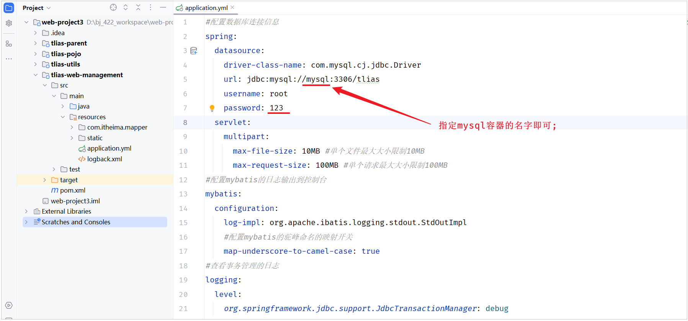
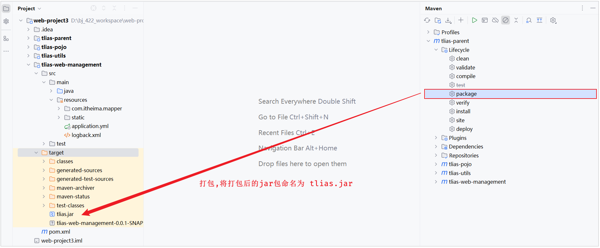
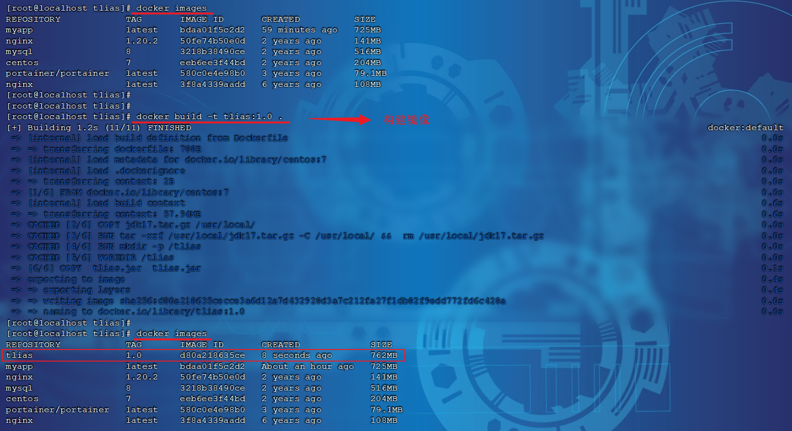
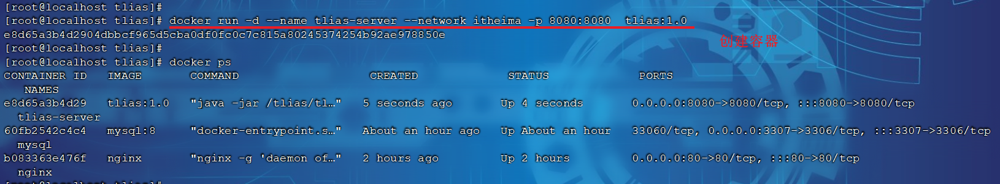
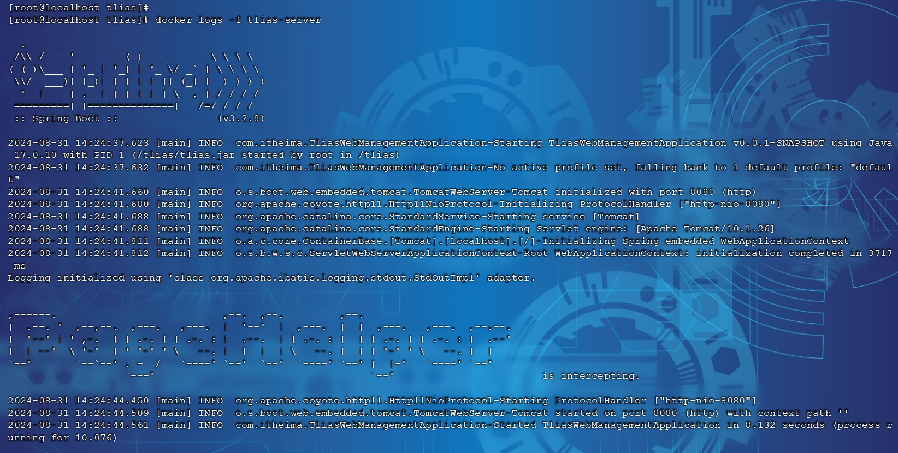
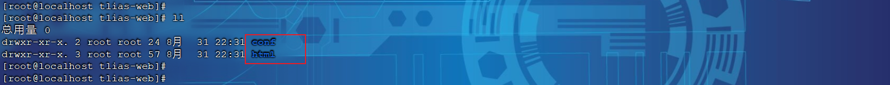
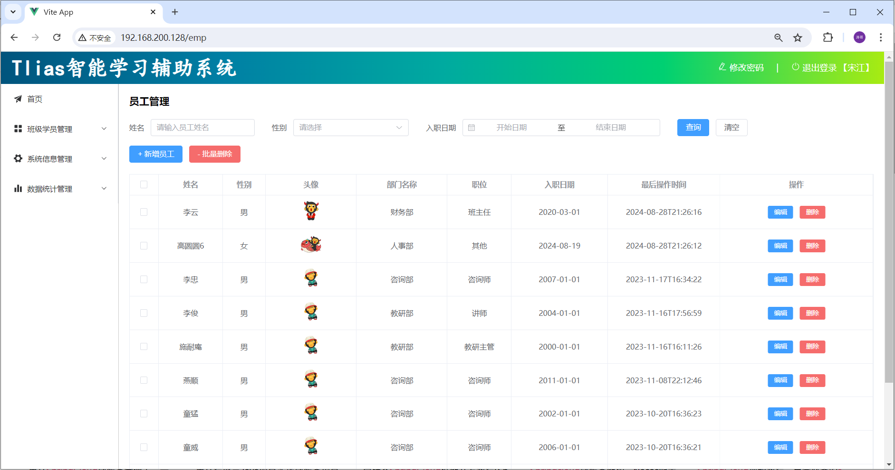
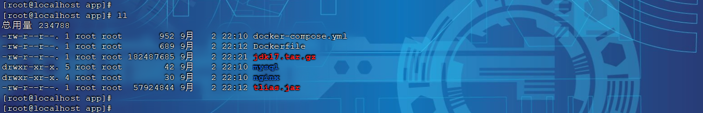
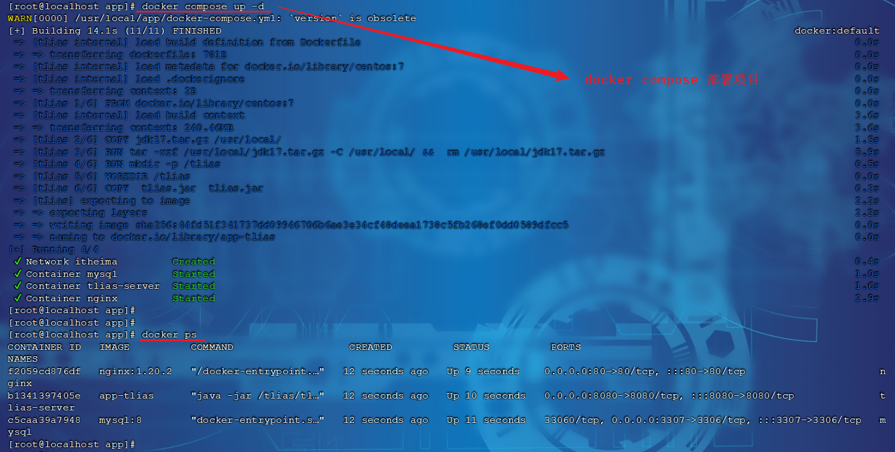
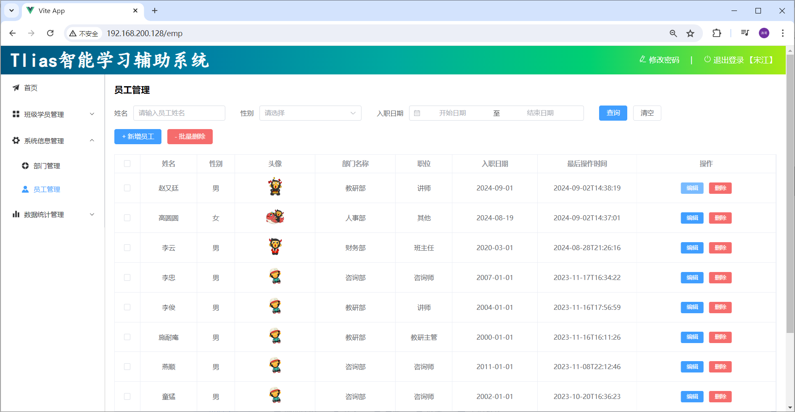

# 项目部署

## 部署服务端

- 需求：将我们开发的 tlias\-web\-management 项目打包为镜像，并部署。

- 步骤：
  1. 修改项目的配置文件，修改数据库服务地址（打包package）。

  2. 编写Dockerfile文件（AI辅助）。

  3. 构建Docker镜像，部署Docker容器，运行测试。

**1\)\. 修改项目的配置文件，修改数据库服务地址（打包package）。**



然后，执行maven中的package生命周期，进行打包\(**跳过测试**\)，并将打包后的jar包命名为 tlias\.jar 。



**2\)\. 编写Dockerfile文件\*\***（AI辅助）\***\*。**

文件名 Dockerfile:

```PowerShell
# 使用 CentOS 7 作为基础镜像
FROM centos:7

# 添加 JDK 到镜像中
COPY jdk17.tar.gz /usr/local/
RUN tar -xzf /usr/local/jdk17.tar.gz -C /usr/local/ &&  rm /usr/local/jdk17.tar.gz

# 设置环境变量
ENV JAVA_HOME=/usr/local/jdk-17.0.10
ENV PATH=$JAVA_HOME/bin:$PATH

# 阿里云OSS环境变量
ENV OSS_ACCESS_KEY_ID= ${OSS_ACCESS_KEY_ID}
ENV OSS_ACCESS_KEY_SECRET= ${OSS_ACCESS_KEY_SECRET}

#统一编码
ENV LANG=en_US.UTF-8
ENV LANGUAGE=en_US:en
ENV LC_ALL=en_US.UTF-8

# 创建应用目录
RUN mkdir -p /tlias
WORKDIR /tlias

# 复制应用 JAR 文件到容器
COPY  tlias.jar  tlias.jar

# 暴露端口
EXPOSE 8080

# 运行命令
ENTRYPOINT ["java","-jar","/tlias/tlias.jar"]
```

由于项目要运行，需要依赖jdk的环境，所以这里我们需要将tlias\.jar，jdk17\.tar\.gz，Dockerfile三个文件，上传到Linux服务器的 /root/tlias 目录下（如果没有这个目录，提前创建好）。


**3\)\. 构建Docker镜像，部署Docker容器，运行测试。**

- 构建Docker镜像

```PowerShell
docker build -t tlias:1.0 .
```



- 部署Docker容器

```PowerShell
docker run -d --name tlias-server --network itheima -p 8080:8080  tlias:1.0
```

\-\-network itheima ：将创建的容器，加入到itheima网络，就可以和itheima网络中的容器通信了。



通过 `docker logs ``-f`` 容器名`，就可以查看容器的运行日志。



这样后端服务，就已经启动起来了。

## 部署前端

- 需求：创建一个新的nginx容器，将资料中提供的前端项目的静态资源部署到nginx中。

- 步骤：
  - 在宿主机上准备静态文件及配置文件存放目录\(在 `/usr/local` 目录下创建 `tlias-web` 目录\)。

    `-v /usr/local/tlias-web/html:/usr/share/nginx/html`

    `-v /usr/local/tlias-web/conf/nginx.conf:/etc/nginx/nginx.conf`

  - 部署nginx容器

**1\)\. 部署nginx容器（设置目录映射）。**

- 将资 **资料/04\. 项目部署/前端项目 **中的 目录`html`和 配置文件存放目录 `conf`，上传至服务器端的 `/usr/local/tlias-web`目录下。



- 执行如下命令，部署nginx容器

```PowerShell
docker run -d \
--name nginx-tlias \
-v /usr/local/tlias-web/html:/usr/share/nginx/html \
-v /usr/local/tlias-web/conf/nginx.conf:/etc/nginx/nginx.conf \
--network itheima \
-p 80:80 \
nginx:1.20.2
```

前后端都部署完毕后，就可以打开浏览器，来测试一下。访问前端的nginx服务器 。



## DockerCompose

大家可以看到，我们部署一个简单的java项目，其中包含3个容器：

- MySQL

- Nginx

- Java项目

而稍微复杂的项目，其中还会有各种各样的其它中间件，需要部署的东西远不止3个。如果还像之前那样手动的逐一部署，就太麻烦了。

而Docker Compose就可以帮助我们实现**多个相互关联的Docker容器的快速部署**。它允许用户通过一个单独的 docker\-compose\.yml 模板文件（YAML 格式）来定义一组相关联的应用容器。

### 基本语法

docker\-compose文件中可以定义多个相互关联的应用容器，每一个应用容器被称为一个服务（service）。由于service就是在定义某个应用的运行时参数，因此与`docker run`参数非常相似。

举例来说，用docker run部署MySQL的命令如下：

```PowerShell
docker run -d \
--name nginx-tlias \
-p 80:80 \
-v /usr/local/app/html:/usr/share/nginx/html \
-v /usr/local/app/conf/nginx.conf:/etc/nginx/nginx.conf \
--network itheima \
nginx:1.20.2
```

如果用`docker-compose.yml`文件来定义，就是这样：

```YAML
services:
  mysql:
    image: "nginx:1.20.2"
    container_name: nginx-tlias
    ports:
      - "80:80"
    volumes:
      - "/usr/local/app/html:/usr/share/nginx/html"
      - "/usr/local/app/conf/nginx.conf:/etc/nginx/nginx.conf"
    networks:
      - myit
networks:
  itheima:
    name: myit
```

对比如下：

| **docker run 参数** | **docker compose 指令** | **说明**   |
| ------------------- | ----------------------- | ---------- |
| \-\-name            | container_name          | 容器名称   |
| \-p                 | ports                   | 端口映射   |
| \-e                 | environment             | 环境变量   |
| \-v                 | volumes                 | 数据卷配置 |
| \-\-network         | networks                | 网络       |

明白了其中的对应关系，相信编写`docker-compose`文件应该难不倒大家。

```YAML
services:
  mysql:
    image: mysql:8
    container_name: mysql
    ports:
      - "3307:3306"
    environment:
      TZ: Asia/Shanghai
      MYSQL_ROOT_PASSWORD: 123
    volumes:
      - "/usr/local/app/mysql/conf:/etc/mysql/conf.d"
      - "/usr/local/app/mysql/data:/var/lib/mysql"
      - "/usr/local/app/mysql/init:/docker-entrypoint-initdb.d"
    networks:
      - tlias-net
  tlias:
    build:
      context: .
      dockerfile: Dockerfile
    container_name: tlias-server
    ports:
      - "8080:8080"
    networks:
      - tlias-net
    depends_on:
      - mysql
  nginx:
    image: nginx:1.20.2
    container_name: nginx
    ports:
      - "80:80"
    volumes:
      - "/usr/local/app/nginx/conf/nginx.conf:/etc/nginx/nginx.conf"
      - "/usr/local/app/nginx/html:/usr/share/nginx/html"
    depends_on:
      - tlias
    networks:
      - tlias-net
networks:
  tlias-net:
    name: itheima
```

### 基础命令

编写好docker\-compose\.yml文件，就可以部署项目了。语法如下：

```YAML
docker compose [OPTIONS] [COMMAND]
```

其中，OPTIONS和COMMAND都是可选参数，比较常见的有：

| **类型**     | **参数或指令** | **说明**                                                                         |
| ------------ | -------------- | -------------------------------------------------------------------------------- |
| Options      | \-f            | 指定compose文件的路径和名称                                                      |
|              | \-p            | 指定project名称。project就是当前compose文件中设置的多个service的集合，是逻辑概念 |
| Commands<br> | up             | 创建并启动所有service容器                                                        |
|              | down           | 停止并移除所有容器、网络                                                         |
|              | ps             | 列出所有启动的容器                                                               |
|              | logs           | 查看指定容器的日志                                                               |
|              | stop           | 停止容器                                                                         |
|              | start          | 启动容器                                                                         |
|              | restart        | 重启容器                                                                         |
|              | top            | 查看运行的进程                                                                   |
|              | exec           | 在指定的运行中容器中执行命令                                                     |

### 操作演示

1\)\. 在 Linux 服务器的 `/usr/local` 目录下创建目录 app，并切换到 `/usr/local/app` 目录。

2\)\. 上传资料中提供的 "资料/05\. Docker Compose" 中的文件及文件夹到 `/usr/local/app` 目录中，如下所示：



注意，资料中提供的Dockerfile文件中的阿里云OSS的 AccessKeyId，AccessKeySecret需要替换成自己的。

3\)\. 执行如下指令，基于DockerCompose部署项目。

```YAML
docker compose up -d
```



项目启动完毕之后，就可以启动服务器测试喽 。


