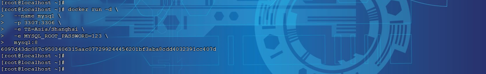
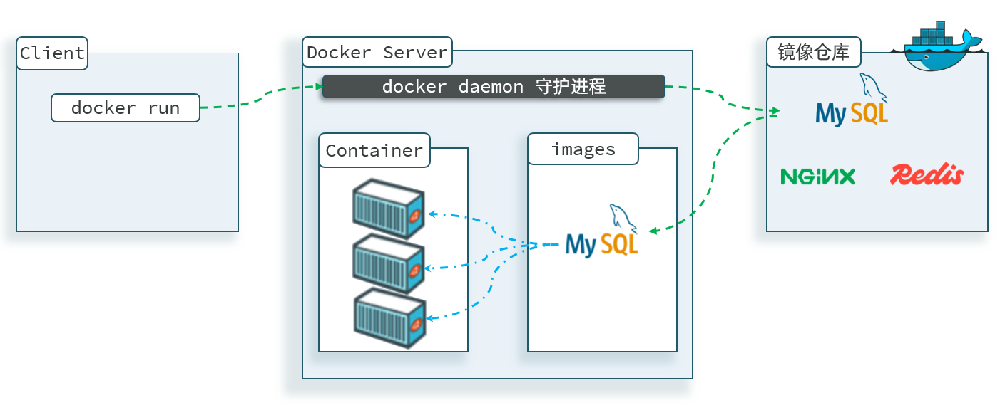

# 快速入门

要想让Docker帮我们安装和部署软件，肯定要保证你的机器上有Docker。由于大家的操作系统各不相同，安装方式也不同。为了便于大家学习，我们统一在之前提供给大家的CentOS的虚拟机中**已经安装了Docker**，统一学习环境。


如果大家需要自己在别的机器上安装Docker环境，可以参照最后的 **附录中的：Docker安装文档**


## 部署MySQL

首先，我们利用Docker来安装一个MySQL软件，大家可以对比一下之前传统的安装方式，看看哪个效率更高一些。

如果是利用传统方式部署MySQL，大概的步骤有：

- 搜索并下载MySQL安装包

- 上传至Linux环境

- 解压和配置环境

- 安装

- 初始化和配置


而使用Docker安装，仅仅需要一步即可，在命令行输入下面的命令（建议采用CV大法）：

```PowerShell
docker run -d \
  --name mysql \
  -p 3307:3306 \
  -e TZ=Asia/Shanghai \
  -e MYSQL_ROOT_PASSWORD=123 \
  mysql:8
```

运行效果如图（在给大家提供的资料中，已经下载好了mysql 8版本的镜像）：



MySQL安装完毕！通过任意客户端工具即可连接到MySQL。


**说明：**

其实，当我们执行命令后，Docker做的第一件事情，是去自动搜索并下载了MySQL，然后会自动运行MySQL，我们完全不用插手，是非常方便的 。

而且，这种安装方式你完全不用考虑运行的操作系统环境，它不仅仅在CentOS系统是这样，在Ubuntu系统、macOS系统、甚至是装了WSL的Windows下，都可以使用这条命令来安装MySQL 。

要知道，不同操作系统下其安装包、运行环境是都不相同的！如果是手动安装，必须手动解决安装包不同、环境不同的、配置不同的问题！

而使用Docker，这些完全不用考虑。就是因为Docker会自动搜索并下载MySQL。


**注意：**

这里下载的不是安装包，而是**镜像。**镜像中不仅包含了MySQL本身，还包含了其运行所需要的环境、配置、系统级函数库。因此它在运行时就有自己独立的环境，就可以跨系统运行，也不需要手动再次配置环境了。这套独立运行的隔离环境我们称为**容器**。

说明：

- 镜像：英文是image

- 容器：英文是container


> 因此，Docker安装软件的过程，就是自动搜索下载镜像，然后创建并运行容器的过程。
> 
> 

Docker会根据命令中的镜像名称自动搜索并下载镜像，那么问题来了，它是去哪里搜索和下载镜像的呢？这些镜像又是谁制作的呢？

Docker官方提供了一个专门管理、存储镜像的网站，并对外开放了镜像上传、下载的权利。Docker官方提供了一些基础镜像，然后各大软件公司又在基础镜像基础上，制作了自家软件的镜像，全部都存放在这个网站。这个网站就成了Docker镜像交流的社区：https://hub\.docker\.com

基本上我们常用的各种软件都能在这个网站上找到，我们甚至可以自己制作镜像上传上去。【**但是该网站，目前国内上不去了**】


像这种提供存储、管理Docker镜像的服务器，被称为DockerRegistry，可以翻译为**镜像仓库**。DockerHub网站是官方仓库，阿里云、华为云会提供一些第三方仓库，我们也可以自己搭建私有的镜像仓库。

官方仓库在国外，下载速度较慢，一般我们都会使用第三方仓库提供的镜像加速功能，提高下载速度。而企业内部的机密项目，往往会采用私有镜像仓库。

总之，镜像的来源有两种：

- 基于官方基础镜像自己制作

- 直接去DockerRegistry下载

**总结一下**：

Docker本身包含一个后台服务，我们可以利用Docker命令告诉Docker服务，帮助我们快速部署指定的应用。Docker服务部署应用时，首先要去搜索并下载应用对应的镜像，然后根据镜像创建并允许容器，应用就部署完成了。


用一幅图表示如下：




## 命令解读

利用Docker快速的安装了MySQL，非常的方便，不过我们执行的命令到底是什么意思呢？

```PowerShell
docker run -d \
  --name mysql \
  -p 3307:3306 \
  -e TZ=Asia/Shanghai \
  -e MYSQL_ROOT_PASSWORD=123 \
  mysql:8
```

> **解读：**
> 
> - `docker run -d` ：创建并运行一个容器，`-d`则是让容器以后台进程运行
> 
> 
> 
> - `--name mysql ` : 给容器起个名字叫`mysql`，你可以叫别的
> 
> 
> 
> - `-p 3307:3306` : 设置端口映射。
> 
>     - **容器是隔离环境**，外界不可访问。但是可以**将宿主机端口映射容器内到端口**，当访问宿主机指定端口时，就是在访问容器内的端口了。
> 
>     - 容器内端口往往是由容器内的进程决定，例如MySQL进程默认端口是3306，因此容器内端口一定是3306；而宿主机端口则可以任意指定，一般与容器内保持一致。
> 
>     - 格式： `-p 宿主机端口:容器内端口`，示例中就是将宿主机的3307映射到容器内的3306端口
> 
>     
> 
> - `-``e`` TZ=Asia/Shanghai` : 配置容器内进程运行时的一些参数
> 
>     - 格式：`-e KEY=VALUE`，KEY和VALUE都由容器内进程决定
> 
>     - 案例中，`TZ=Asia/Shanghai`是设置时区；`MYSQL_ROOT_PASSWORD=123`是设置MySQL默认密码
> 
>     
> 
> - `mysql:8` : 设置**镜像**名称，Docker会根据这个名字搜索并下载镜像
> 
>     - 格式：`REPOSITORY:TAG`，例如`mysql:8.0`，其中`REPOSITORY`可以理解为镜像名，`TAG`是版本号
> 
>     - 在未指定`TAG`的情况下，默认是最新版本，也就是`mysql:latest`
> 
> 


镜像的名称不是随意的，而是要到DockerRegistry中寻找，镜像运行时的配置也不是随意的，要参考镜像的帮助文档，这些在DockerHub网站或者软件的官方网站中都能找到。

如果我们要安装其它软件，也可以到DockerRegistry中寻找对应的镜像名称和版本，阅读相关配置即可。


