# Linux常用命令

## Linux命令初体验

- Linux 命令格式：`command ``[``-options``] [``parameter``]`

- 说明：

    - command：命令名

    - \[\-options\]：选项，可用来对命令进行控制，也可以省略 （可选）

    - \[parameter\]：参数，可以是零个、一个或多个（可选）

- 例如：

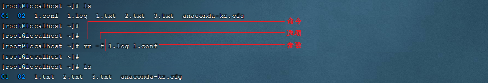

**使用技巧：**

- Tab键自动补全

- 连续两次Tab键，给出操作提示

- 使用上下箭头快速调出曾经使用过的命令

- 使用clear命令或Ctrl\+l快捷键实现清屏

## 目录操作命令

### ls

- 作用: 显示指定目录下的内容

- 语法: `ls [-al] ``[dir]`

- 说明:

`-a` 显示所有文件及目录 \(\. 开头的隐藏文件也会列出\)

`-l` 除文件名称外，同时将文件型态\(d表示目录，\-表示文件\)、权限、拥有者、文件大小等信息详细列出

- 注意:

由于我们使用ls命令时经常需要加入\-l选项，所以Linux为 `ls -l` 命令提供了一种简写方式，即 `ll`   

- 常见用法:

`ls -al`           查看当前目录的所有文件及目录详细信息

`ls -al /etc`  查看/etc目录下所有文件及目录详细信息

`ll`                 查看当前目录文件及目录的详细信息 

**操作示例:**

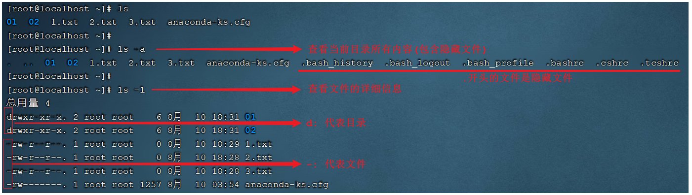

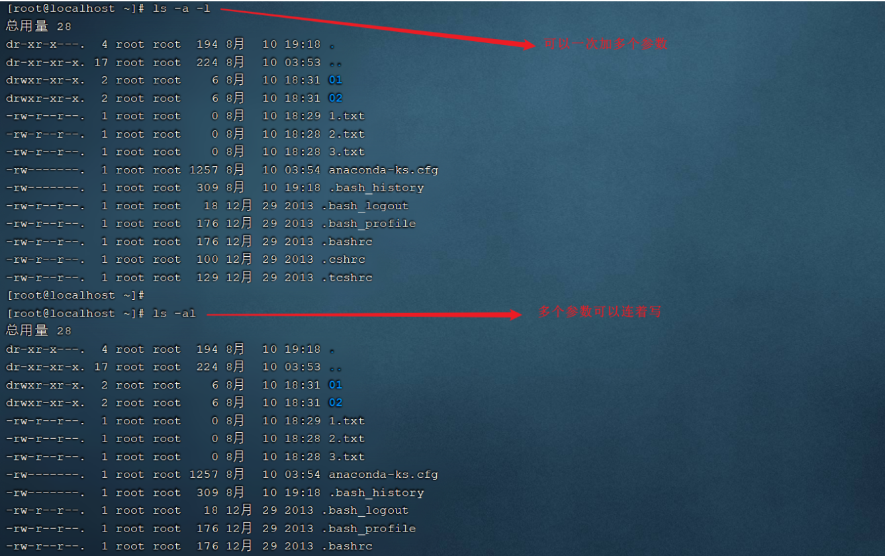

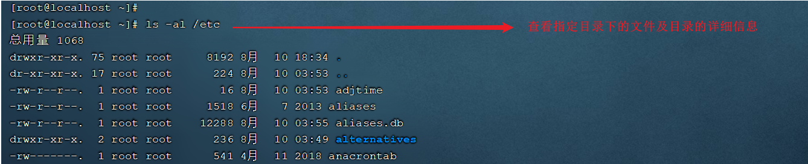

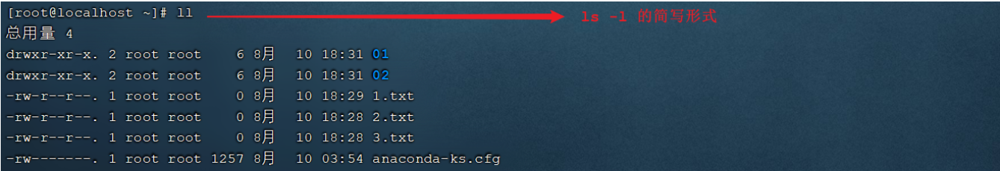

### cd

- 作用: 用于切换当前工作目录，即进入指定目录

- 语法: cd \[dirName\]

- 特殊说明:

\~        表示用户的home目录

\.         表示目前所在的目录

\.\.        表示目前目录位置的上级目录

- 举例:

cd         \.\.                切换到当前目录的上级目录

cd         \~                切换到用户的home目录

cd         /usr/local     切换到/usr/local目录

- 备注: 

用户的home目录 

root用户        /root

其他用户        /home/xxx

**操作示例: **

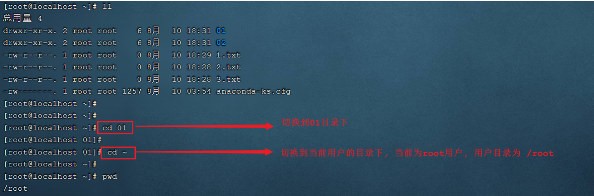

cd \.\. 切换到当前目录位置的上级目录; 可以通过 cd \.\./\.\. 来切换到上级目录的上级目录。

### mkdir

- 作用: 创建目录

- 语法: `mkdir [-p] dirName`

- 说明:

\-p: 确保目录名称存在，不存在的就创建一个。通过此选项，可以实现多层目录同时创建

- 举例:

mkdir itcast  在当前目录下，建立一个名为itcast的子目录

mkdir \-p itcast/test   在工作目录下的itcast目录中建立一个名为test的子目录，若itcast目录不存在，则建立一个

**操作演示:**

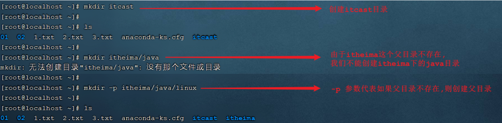

### rm

- 作用: 删除文件或者目录

- 语法: `rm [-rf] name`

- 说明:

 \-r: 将目录及目录中所有文件（目录）逐一删除，即递归删除

\-f: 无需确认，直接删除 

- 举例:

`rm -r itcast/`    删除名为itcast的目录和目录中所有文件，删除前需确认

`rm -rf itcast/`    无需确认，直接删除名为itcast的目录和目录中所有文件

`rm -f hello.txt`   无需确认，直接删除hello\.txt文件

**操作示例:** 

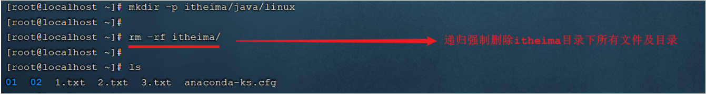

注意: 对于 `rm -rf xxx` 这样的指令，在执行的时候，一定要慎重，确认无误后再进行删除，避免误删。

## 文件操作命令

### cat

- 作用: 用于显示文件内容

- 语法: `cat [-n] fileName`

- 说明:

`-n`: 由1开始对所有输出的行数编号

- 举例:

`cat /etc/profile`                查看/etc目录下的profile文件内容

**操作演示:** 

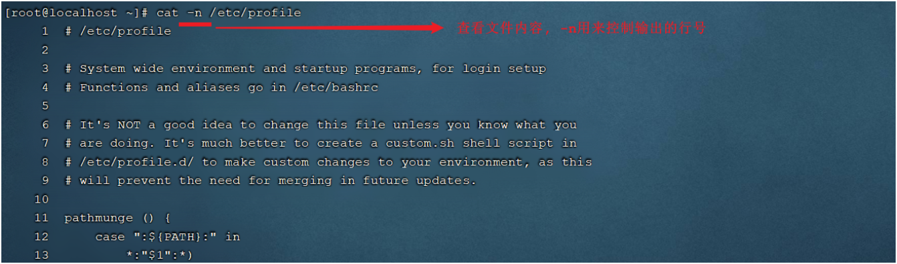

cat 指令会一次性查看文件的所有内容，如果文件内容比较多，这个时候查看起来就不是很方便了，这个时候我们可以通过一个新的指令more。

### more

- 作用: 以分页的形式显示文件内容

- 语法: `more fileName`

- 操作说明:

    - 回车键               向下滚动一行

    - 空格键               向下滚动一屏

    - b                       返回上一屏

    - q或者Ctrl\+C        退出more 

- 举例：

    - more /etc/profile                以分页方式显示/etc目录下的profile文件内容

操作示例：

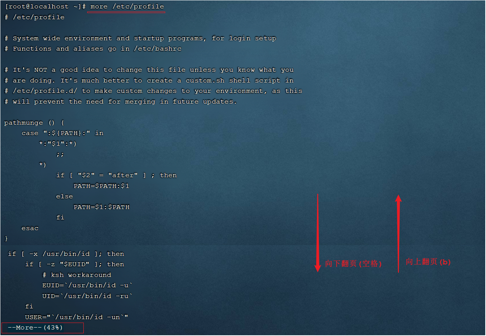

当我们在查看一些比较大的文件时，我们可能需要经常查询文件尾部的数据信息，那这个时候如果文件很大，我们要一直向下翻页，直到最后一页，去看最新添加的数据，这种方式就比较繁琐了，此时，我们可以借助于tail指令。

### head

- 作用：查看文件开头的内容

- 语法：`head`` [``-n``] ``fileName`

- 说明:

    - \-n ：输出文件开头的n行内容

- 举例：

    - head 1\.log  默认显示1\.log文件开头的10行内容

    - head \-20 1\.log  显示1\.log文件开头的20行内容

### tail

- 作用: 查看文件末尾的内容

- 语法: tail \[\-f\] fileName

- 说明:

\-f : 动态读取文件末尾内容并显示，通常用于日志文件的内容输出   

- 举例: 

    - tail /etc/profile                显示/etc目录下的profile文件末尾10行的内容

    - tail \-20 /etc/profile           显示/etc目录下的profile文件末尾20行的内容

    - tail \-f /itcast/my\.log          动态读取/itcast目录下的my\.log文件末尾内容并显示

**操作示例：** 

A\. 默认查询文件尾部10行记录

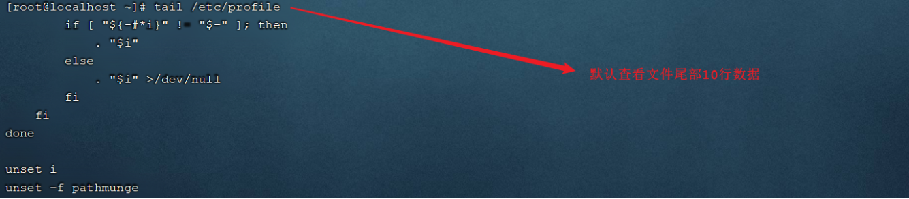

B\. 可以通过指定参数设置查询尾部指定行数的数据

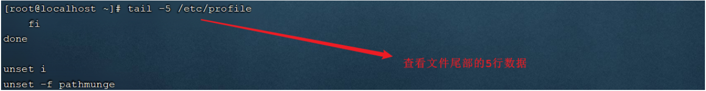

C\. 动态读取文件尾部的数据

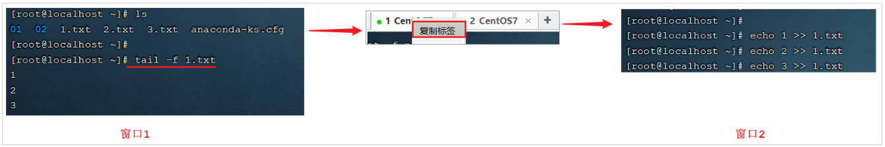

在窗口1中执行指令 `tail -f 1.txt` 动态查看文件尾部的数据。然后在顶部的标签中右键选择 "复制标签"，打开新的窗口2 , 此时再新打开的窗口2中执行指令 `echo 1 >> 1.txt` , 往1\.txt文件尾部追加内容，然后我们就可以在窗口1中看到最新的文件尾部的数据。

如果我们不想查看文件尾部的数据了，可以直接使用快捷键 Ctrl\+C ， 结束当前进程。

## 拷贝移动命令

### cp

- 作用: 用于复制文件或目录

- 语法: cp \[\-r\] source dest

- 说明:

\-r: 如果复制的是目录需要使用此选项，此时将复制该目录下所有的子目录和文件

- 举例:

cp hello\.txt itcast/            将hello\.txt复制到itcast目录中

cp hello\.txt \./hi\.txt           将hello\.txt复制到当前目录，并改名为hi\.txt

   cp \-r itcast/ \./itheima/            将itcast目录和目录下所有文件复制到itheima目录下

cp \-r itcast/\* \./itheima/                  将itcast目录下所有文件复制到itheima目录下

**操作示例:** 

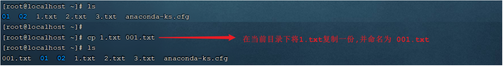

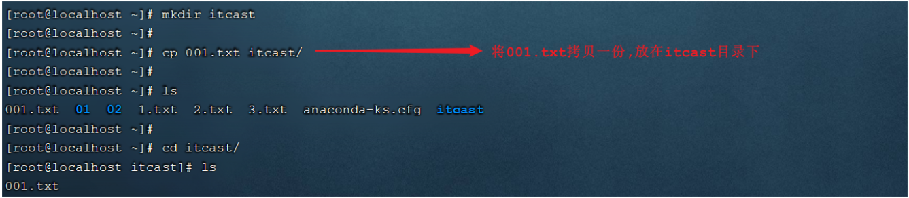

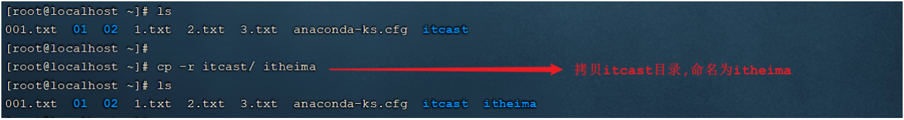

如果拷贝的内容是目录，需要加上参数 \-r 

### mv

- 作用: 为文件或目录改名、或将文件或目录移动到其它位置

- 语法: mv source dest

- 举例:

    - mv hello\.txt hi\.txt                   将hello\.txt改名为hi\.txt

    - mv hi\.txt itheima/                   将文件hi\.txt移动到itheima目录中

    - mv hi\.txt itheima/hello\.txt        将hi\.txt移动到itheima目录中，并改名为hello\.txt

    - mv itcast/ itheima/                 如果itheima目录不存在，将itcast目录改名为itheima

    - mv itcast/ itheima/                 如果itheima目录存在，将itcast目录移动到itheima目录中

**操作示例:** 

mv 命令既能够改名，又可以移动，具体是改名还是移动,系统会根据我们输入的参数进行判定\(如果第二个参数dest是一个已存在的目录,将执行移动操作,其他情况都是改名\)

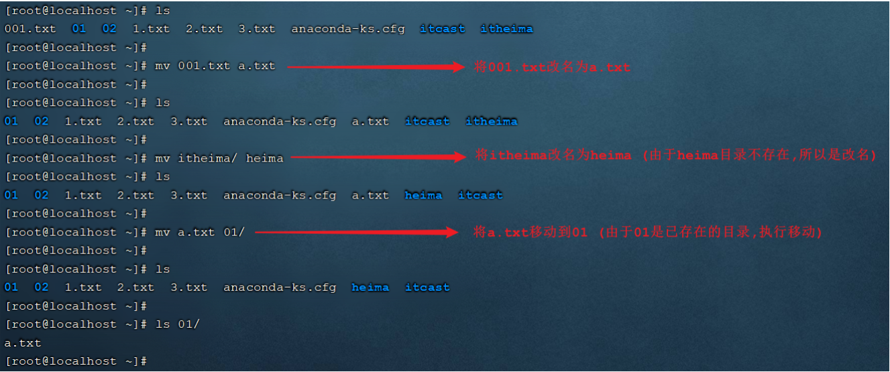

## 打包压缩命令

- 作用: 对文件进行打包、解包、压缩、解压

- 语法: `tar  [-zcxvf]  ``fileName  ``[files]`

  包文件后缀为\.tar表示只是完成了打包，并没有压缩

包文件后缀为\.tar\.gz表示打包的同时还进行了压缩

- 说明:

    - \-z: z代表的是gzip，通过gzip命令处理文件，gzip可以对文件压缩或者解压

    - \-c: c代表的是create，即创建新的包文件

    - \-x: x代表的是extract，实现从包文件中还原文件

    - \-v: v代表的是verbose，显示命令的执行过程

    - \-f: f代表的是file，用于指定包文件的名称

- 举例：

    - 打包

        - tar \-cvf hello\.tar \./\*                                  将当前目录下所有文件打包，打包后的文件名为hello\.tar

        - tar \-zcvf hello\.tar\.gz \./\*                          将当前目录下所有文件打包并压缩，打包后的文件名为hello\.tar\.gz

    - 解包

        - tar \-xvf hello\.tar                                          将hello\.tar文件进行解包，并将解包后的文件放在当前目录

        - tar \-zxvf hello\.tar\.gz                                  将hello\.tar\.gz文件进行解压，并将解压后的文件放在当前目录

        - tar \-zxvf hello\.tar\.gz \-C /usr/local     将hello\.tar\.gz文件进行解压，并将解压后的文件放在/usr/local目录

**操作示例:** 

A\. 打包

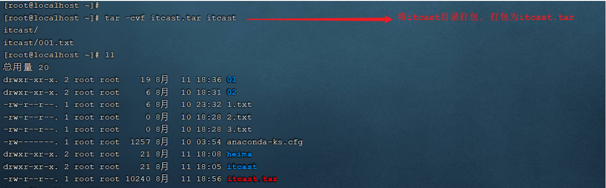

B\. 打包并压缩

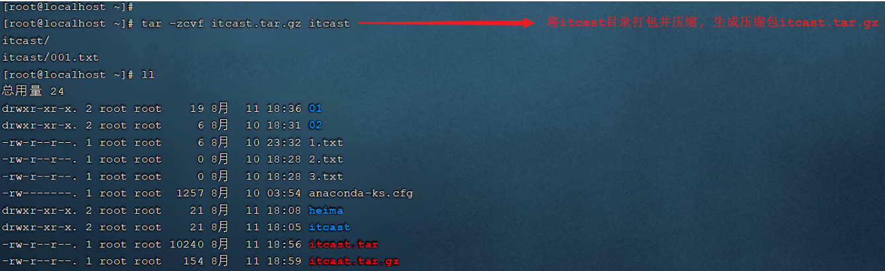

C\. 解包

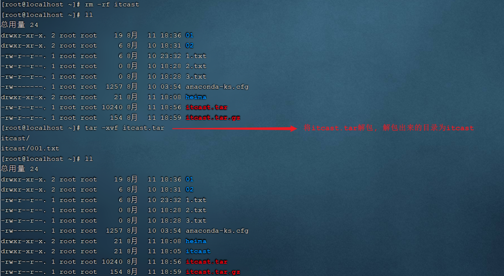

D\. 解压

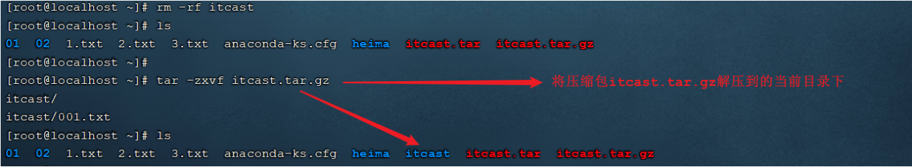

解压到指定目录,需要加上参数 \-C

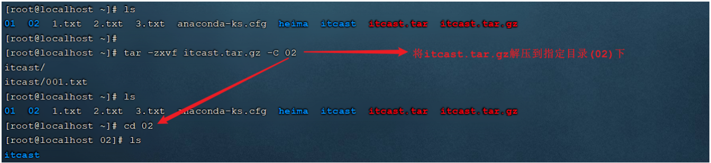

## 文本编辑命令

文本编辑的命令，主要包含两个: `vi` 和 `vim`，两个命令的用法类似，我们课程中主要讲解vim的使用。

### vi \& vim介绍

- 作用: vi命令是Linux系统提供的一个文本编辑工具，可以对文件内容进行编辑，类似于Windows中的记事本

- 语法: vi fileName

- 说明:

    - 1\)\. vim是从vi发展来的一个功能更加强大的文本编辑工具，编辑文件时可以对文本内容进行着色，方便我们对文件进行编辑处理，所以实际工作中vim更加常用。

    - 2\)\. 要使用vim命令，需要我们自己完成安装。可以使用下面的命令来完成安装：`yum install vim`

### vim安装

命令： `yum install vim`

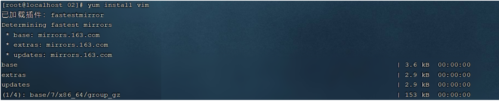

安装过程中，会有确认提示，此时输入 y，然后回车，继续安装：

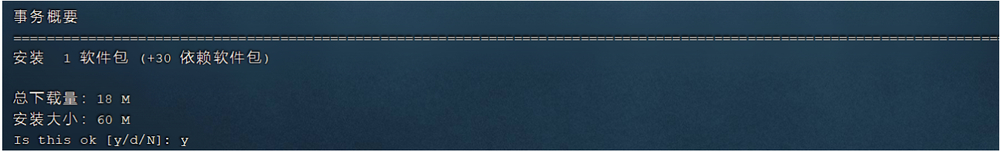

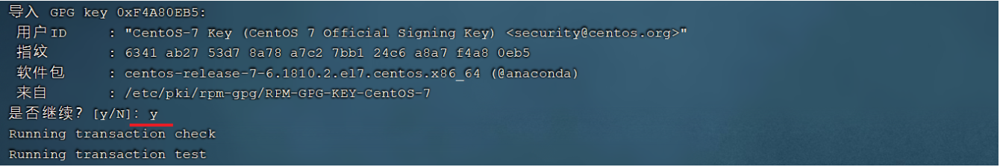

### vim使用

- 作用: 对文件内容进行编辑，vim其实就是一个文本编辑器

- 语法: vim fileName

- 说明:

    - 1\)\. 在使用vim命令编辑文件时，如果指定的文件存在则直接打开此文件。如果指定的文件不存在则新建文件。

    - 2\)\. vim在进行文本编辑时共分为三种模式，分别是 命令模式（Command mode），插入模式（Insert mode）和底行模式（Last line mode）。这三种模式之间可以相互切换。我们在使用vim时一定要注意我们当前所处的是哪种模式。

- 三种模式:

    - 命令模式

        - A\. 命令模式下可以查看文件内容、移动光标（上下左右箭头、gg、G\)

        - B\. 通过vim命令打开文件后，默认进入命令模式

        - C\. 另外两种模式需要首先进入命令模式，才能进入彼此

        |        **命令模式指令**|        **含义**|
        |---|---|
        |        **gg**|        定位到文本内容的第一行|
        |        **G**|        定位到文本内容的最后一行|
        |        **dd**|        删除光标所在行的数据|
        |        **n****dd**|        删除当前光标所在行及之后的n行数据|
        |        **u**|        撤销操作|
        |        **i 或 a 或 o **|        进入插入模式\(进入后光标所处的位置不同而已\)|

    - 插入模式

        - A\. 插入模式下可以对文件内容进行编辑

        - B\. 在命令模式下按下\[i,a,o\]任意一个，可以进入插入模式。进入插入模式后，下方会出现【insert】字样

        - C\. 在插入模式下按下ESC键，回到命令模式

- 底行模式

    - A\. 底行模式下可以通过命令对文件内容进行查找、显示行号、退出等操作

    - B\. 在命令模式下按下\[:,/\]任意一个，可以进入底行模式

    - C\. 通过/方式进入底行模式后，可以对文件内容进行查找

    - D\. 通过:方式进入底行模式后，可以输入wq（保存并退出）、q\!（不保存退出）、set nu（显示行号）

    |    **底行模式指令**|    **含义**|
    |---|---|
    |    **:wq**|    保存并退出|
    |    **:q\!**|    不保存退出|
    |    **:set ****nu**|    显示行号|
    |    **:set nonu**|    取消行号显示|
    |    **:n**|    定位到第n行，如 :10 就是定位到第10行|

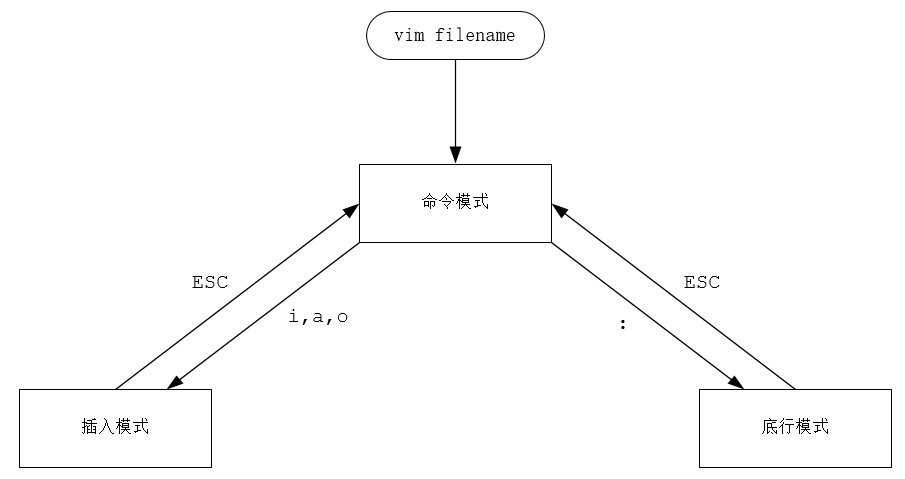

## 查找命令

### find

- 作用: 在指定目录下查找文件

- 语法: find dirName \-option fileName

- 举例:

    - `find  .  ``–name`` "*.java`*`"`**                        在当前目录及其子目录下查找\.java结尾文件*

    - `find  ``/itcast``  -name "*.java"`             在/itcast目录及其子目录下查找\.java结尾的文件

**操作示例:** 

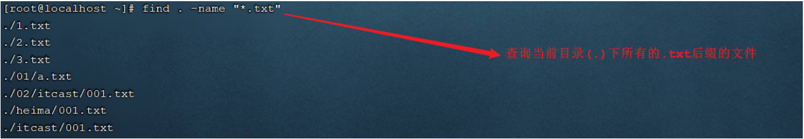

### grep

- 作用: 从指定文件中查找指定的文本内容

- 语法: `grep word fileName`

- 选项：

    - \-i: 检索的关键字忽略\(ignore\)大小写

    - \-n: 显示关键字所在的这一行的行号

    - \-A: 输出关键字所在行及之后\(After\)的几行记录 \(如:\-A5 表示输出关键字所在行之后的5行记录\)

    - \-B: 输出关键字所在行及之前\(Before\)的几行记录 \(如:\-B5 表示输出关键字所在行之前的5行记录\)

- 举例:

    - grep Hello HelloWorld\.java        查找HelloWorld\.java文件中出现的Hello字符串的位置

    - grep hello \*\.java                        查找当前目录中所有\.java结尾的文件中包含hello字符串的位置

**操作示例:** 

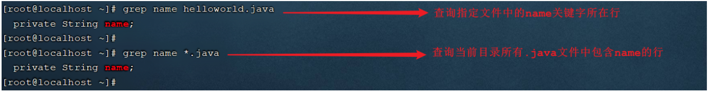

