# Linux概述

## 主流操作系统

不同领域的主流操作系统，主要分为以下这么几类： 桌面操作系统、服务器操作系统、移动设备操作系统、嵌入式操作系统。接下来，这几个领域中，代表性的操作系统是那些?

**1\)\. 桌面操作系统**

**2\)\. 服务器操作系统**

**3\)\. 移动设备操作系统**

## Linux系统版本

Linux系统的版本分为两种，分别是： 内核版 和 发行版。

**1\)\. 内核版**

- 由Linus Torvalds及其团队开发、维护

- 免费、开源

- 负责控制硬件

**2\)\. 发行版**

- 基于Linux内核版进行扩展

- 由各个Linux厂商开发、维护

- 有收费版本和免费版本

我们使用Linux操作系统，实际上选择的是Linux的发行版本。在linux系统中，有各种各样的发行版本，具体如下： 

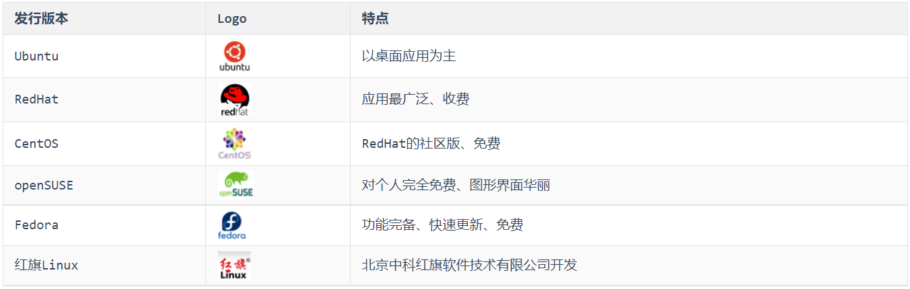

除了上述罗列出来的发行版，还有很多Linux发行版，这里，我们就不再一一列举了。

## 系统安装

### 安装方式

Linux系统的安装方式，主要包含以下两种：

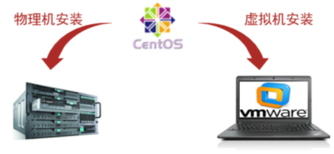

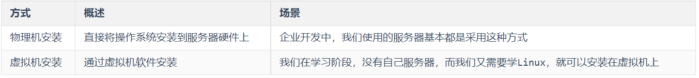

**虚拟机**（Virtual Machine）指通过软件模拟的具有完整硬件系统功能、运行在完全隔离环境中的完整计算机系统。常用虚拟机软件： 

- VMWare 

- VirtualBox

- VMLite WorkStation

- Qemu

- HopeddotVOS

那么我们就可以在课程中将Linux操作系统安装在虚拟机中，我们课上选择的虚拟机软件是**VMware**。

### 安装VMware

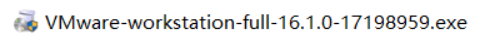

在我们的课程资料中提供了VMware的安装程序。找到课程资料中的 Vmware的安装包（exe文件），然后双击下一步下一步的安装即可。

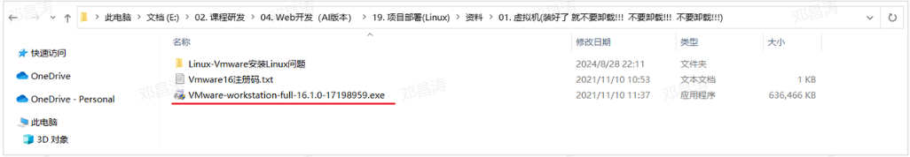

**备注：如果之前安装过，就不用安装了。不要卸载！！！！ 不要卸载！！！！  不要卸载！！！！**

**安装步骤:**

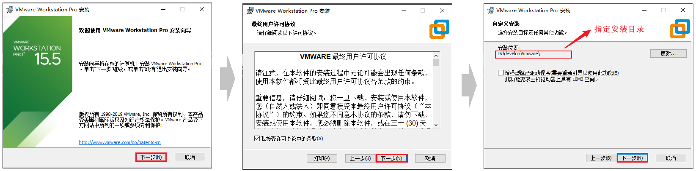

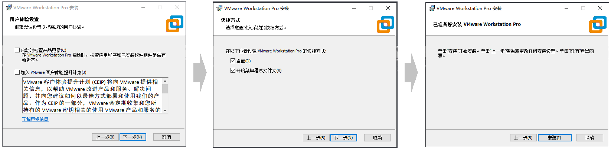

以上就是VMware在安装时的每一步操作，基本上就是点击 "下一步" 一直进行安装。

### 挂载Linux系统

**1\)\. 打开Vmware虚拟机，打开 ****`编辑`**** \-\> ****`虚拟网络编辑器(N)...`**

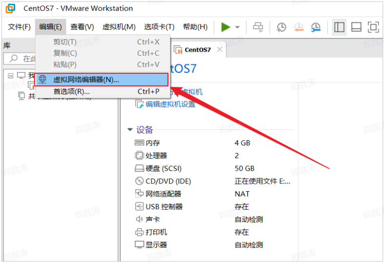

选择 `NAT模式`，然后选择右下角的 `更改设置`。

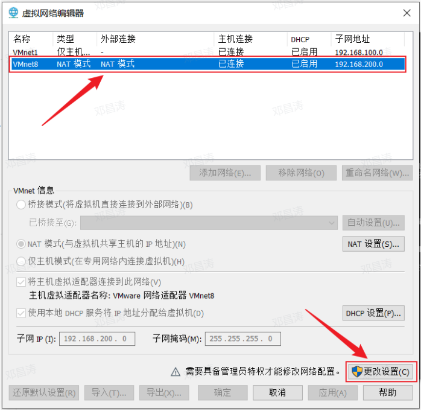

设置子网IP为 **`192.168.100.0`**，然后选择 `应用` \-\> `确定`。

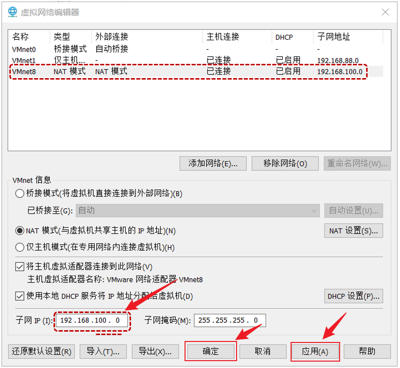

**2\)\. 解压 ****`资料/Linux`****`镜像`****`/CentOS7-1.zip`**** 到一个比较大的磁盘中 \(没有中文的目录\)。**

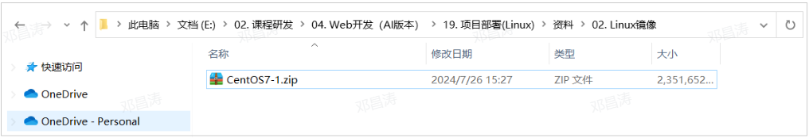

**3\)\. 打开解压目录，双击 ****`.vmx`**** 文件，选择以 ****`Vmware Workstation`**** 打开这个文件。**

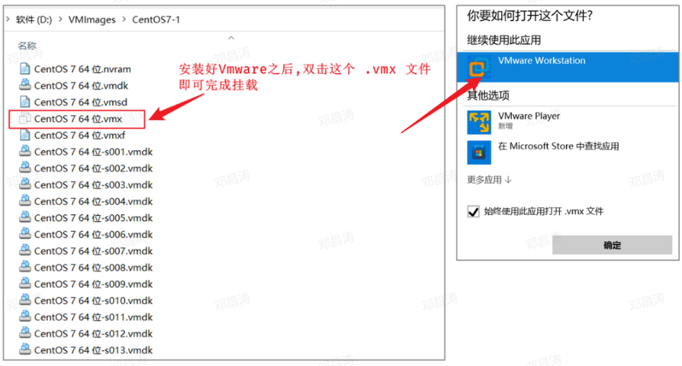

**4\)\. 挂载完毕之后，启动Linux服务器。**

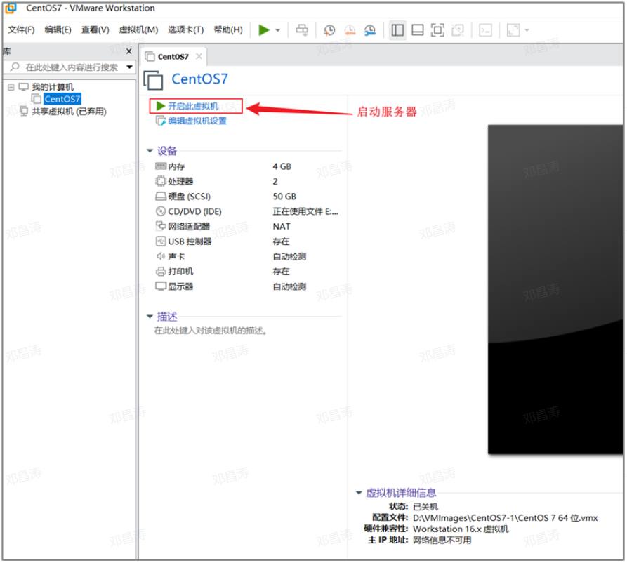

启动过程中，如果出现如下界面，选择 **`我已移动该虚拟机`**。

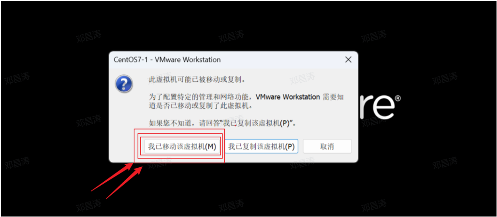

**5\)\. 启动完毕之后，登录服务器。 输入用户名：****`root`****，密码：****`1234`****  ****（注意：linux系统输入密码是不显示的，输入完毕，回车即可登录）**

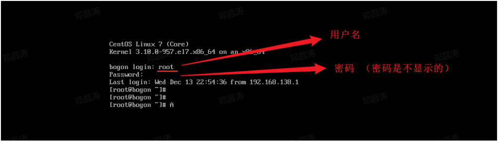

## 安装SSH连接工具

### SSH连接工具介绍

Linux已经安装并且配置好了，接下来我们要来学习Linux的基本操作指令。而在学习之前，我们还需要做一件事情，由于我们企业开发时，Linux服务器一般都是在远程的机房部署的，我们要操作服务器，不会每次都跑到远程的机房里面操作，而是会直接通过SSH连接工具进行连接操作。

SSH（Secure Shell），建立在应用层基础上的安全协议。常用的SSH连接工具: 

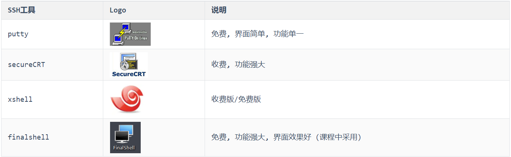

### FinalShell安装

在课程资料中，提供了finalShell的安装包（**"资料/03\. 远程连接工具"**）。

双击\.exe文件，然后进行正常的安装即可。

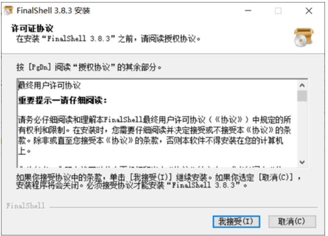

### 连接Linux

- 打开FinalShell，选择SSH连接。

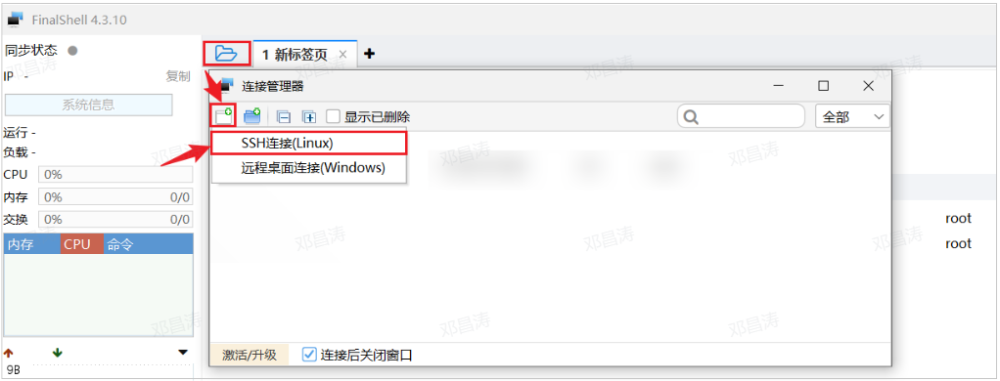

- 连接服务器，输入服务器的信息，IP固定的：**`192.168.100.128`**，用户名：**`root`**，密码：**`1234`**

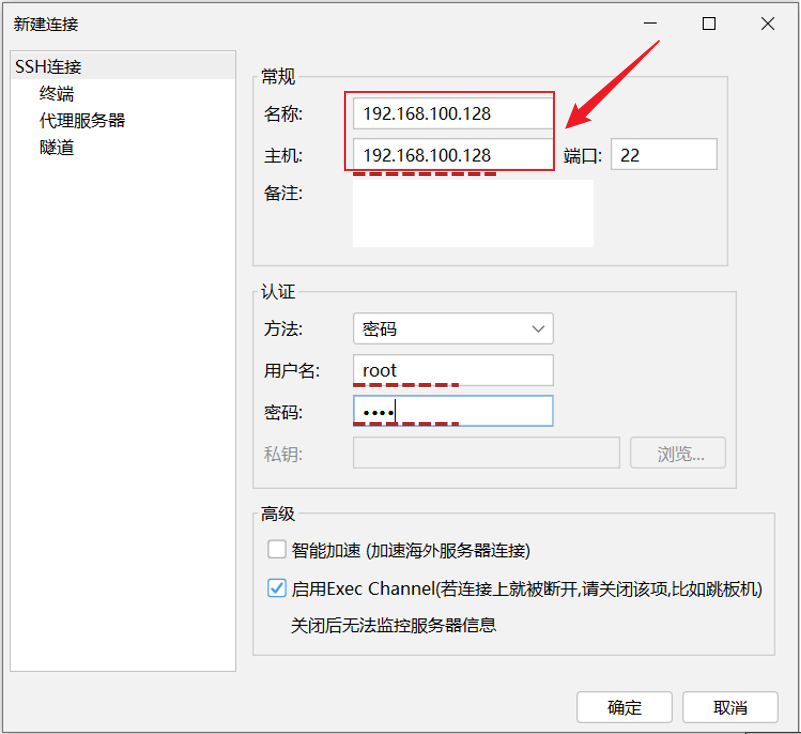

- 配置完毕后,双击即可连接服务器。

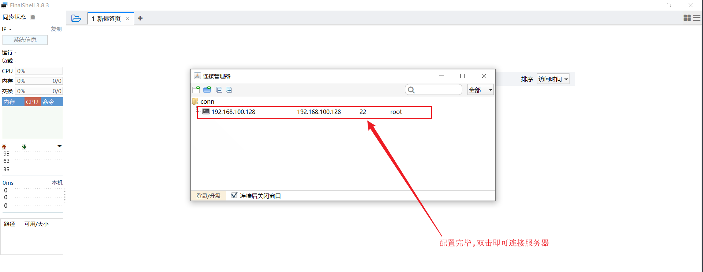

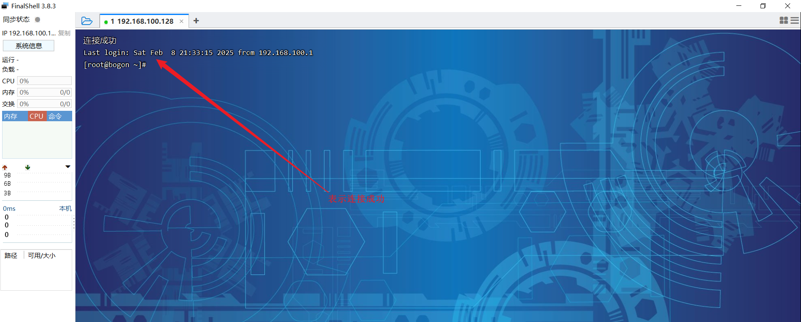

## 目录结构

登录到Linux系统之后，我们需要先来熟悉一下Linux的目录结构。在Linux系统中，也是存在目录的概念的，但是Linux的目录结构和Windows的目录结构是存在比较多的差异的 在Windows目录下，是一个一个的盘符\(C盘、D盘、E盘\)，目录是归属于某一个盘符的。Linux系统中的目录有以下特点： 

- **/ 是所有目录的顶点**

- **目录结构像一颗倒挂的树**

**Linux 和 Windows的目录结构对比:** 

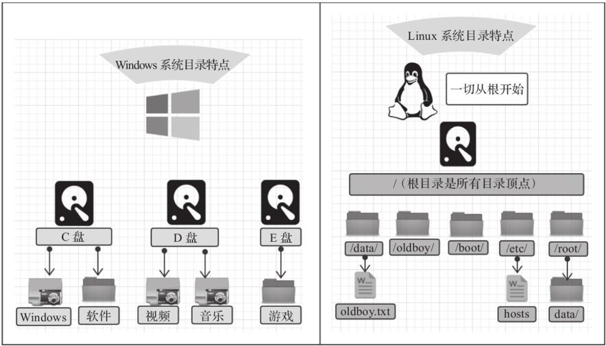

Linux的目录结构，如下： 

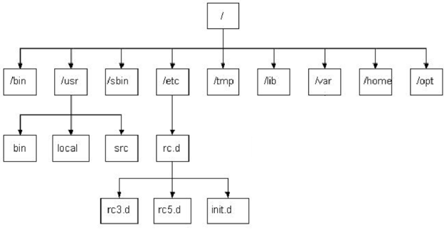

根目录 / 下各个目录的作用及含义说明:  

