# 项目部署

## 前端项目部署

**1\)\. 将nginx的安装目录的html中的静态资源文件先删除掉。**

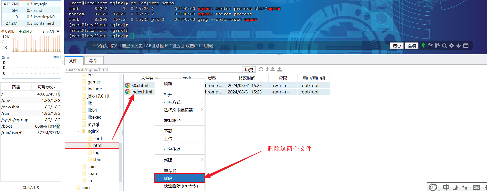

**2\)\. 将资料中提供的 \*\***"资料/06\. 项目部署/前端/页面资源"\***\* 目录下的静态资源文件，全部上传到nginx安装目录下的 html 目录中\.**

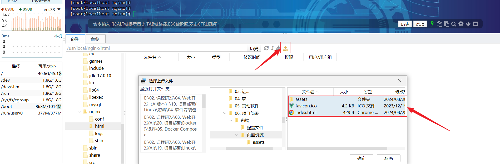

**3\)\. \*\***修改资料中提供的 \***\*`nginx.conf`\*\*** 配置文件\***\*，将其上传到nginx安装目录下的 conf 目录中\.**

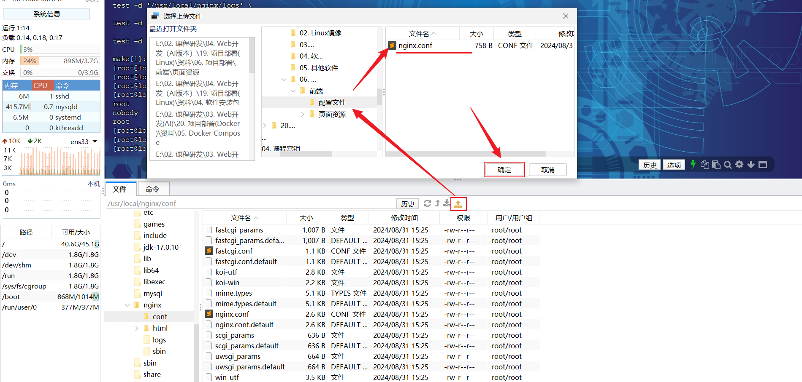

**4\)\. \*\***重新加载nginx服务的配置文件\*\*

```Shell
#重新加载配置文件
sbin/nginx -s reload
```

**5\)\. 再次访问nginx \(可能会存在浏览器缓存, 可以按Ctrl\+F5, 强制刷新清理缓存\)**

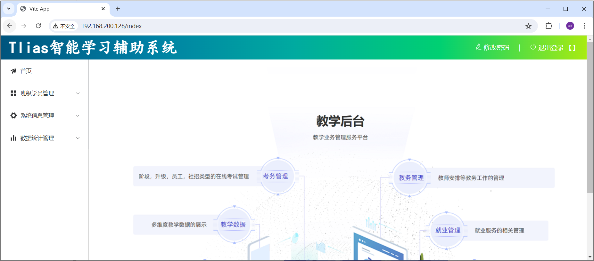

**nginx服务常见操作指令: **

- 启动: sbin/nginx

- 重载: sbin/nginx \-s reload

- 停止: sbin/nginx \-s stop

## 后端项目部署

之前我们讲解Linux操作系统时，就提到，我们服务端开发工程师学习Linux系统的目的就是将来我们开发的项目绝大部分情况下都需要部署在Linux系统中。

### 环境准备

那现在，项目要上线了，要部署到linux服务器上了，我们也需要使用linux服务器上所安装的mysql数据库。

那此时，我们就可以再准备一份文件 `application.yml` 将里面的配置的mysql的ip地址及相关配置信息修改一下（配置Linux上安装的MySQL的信息）：

```YAML
*#配置数据库连接信息*
spring:
  datasource:
    driver-class-name: com.mysql.cj.jdbc.Driver
    url: jdbc:mysql://192.168.100.128:3306/tlias
    username: root
    password: 1234
  servlet:
    multipart:
      max-file-size: 10MB *#单个文件最大大小限制10MB*
*      *max-request-size: 100MB *#单个请求最大大小限制100MB*

*#配置mybatis的日志输出到控制台*
mybatis:
  configuration:
    log-impl: org.apache.ibatis.logging.stdout.StdOutImpl
    *#配置mybatis的驼峰命名的映射开关*
*    *map-underscore-to-camel-case: true
*#查看事务管理的日志*
logging:
  level:
    org.springframework.jdbc.support.JdbcTransactionManager: debug

*#阿里云oss配置*
aliyun:
  oss:
    endpoint: ${endpoint}
    bucketName: ${bucketName}
```

改造完毕之后，可以在本地的idea中先启动当前项目，然后访问一下，看看工程是否正常访问。

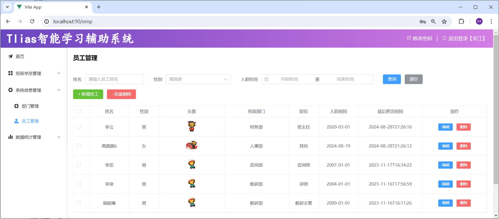

### 打包部署

1\)\. 执行 `package` 指令，进行打包操作，将当前的springboot项目，打成一个jar包。 \(**跳过测试**\)

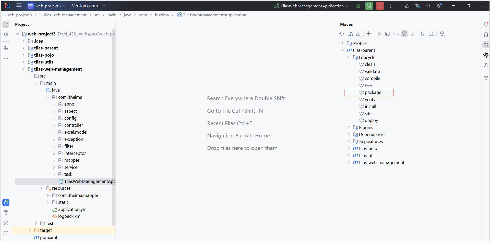

2\)\. 在Linux服务器上创建一个目录，将jar包上传到服务器 。

```YAML
mkdir -p /usr/local/app
```

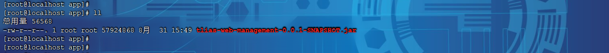

3\)\. 通过java命令，启动项目

```YAML
*#进入目录/usr/local/app *
cd /usr/local/app

#运行jar包
java -jar tlias-web-management-0.0.1-SNAPSHOT.jar
```

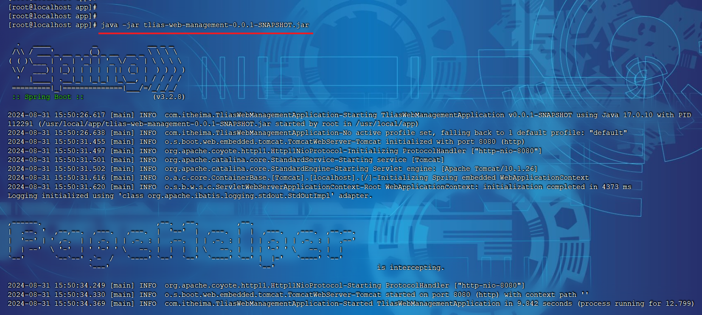

项目启动起来之后，就可以打开浏览器测试啦。

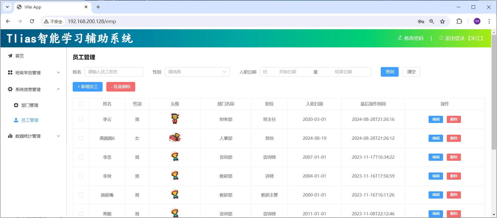

### 阿里云OSS秘钥配置

由于在开发的时候，我们将访问阿里云OSS的AccessKeyId，AccessKeySecret都配置在了系统的环境变量中了。那现在项目部署到了Linux服务器中，调用阿里云OSS进行文件上传时，程序就会获取Linux系统中的环境变量。所以此时，我们需要将AccessKeyId，AccessKeySecret配置为Linux系统的环境变量。

1\)\. 查看Windows系统之前配置的环境变量

```YAML
echo %OSS_ACCESS_KEY_ID%

echo %OSS_ACCESS_KEY_SECRET%
```

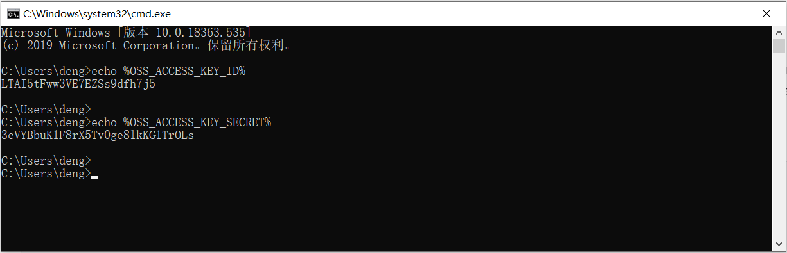

我们将上述自己的 AccessKeyId 与 AccessKeySecret 复制出来，然后在linux系统中配置环境变量。

2\)\. 执行如下指令：

```YAML
echo "export OSS_ACCESS_KEY_ID=${OSS_ACCESS_KEY_ID}" >> /etc/profile

echo "export OSS_ACCESS_KEY_SECRET=${OSS_ACCESS_KEY_SECRET}" >> /etc/profile

source /etc/profile
```

**注意\!\!\!：**上述的绿色背景部分，是自己的阿里云OSS账号的 OSS_ACCESS_KEY_ID， OSS_ACCESS_KEY_SECRET，一个字符都不能错，在记事本中将命令组装好，然后再到命令行中执行。

**注意\!\!\!：**上述的绿色背景部分，是自己的阿里云OSS账号的 OSS_ACCESS_KEY_ID， OSS_ACCESS_KEY_SECRET，一个字符都不能错，在记事本中将命令组装好，然后再到命令行中执行。

**注意\!\!\!：**上述的绿色背景部分，是自己的阿里云OSS账号的 OSS_ACCESS_KEY_ID， OSS_ACCESS_KEY_SECRET，一个字符都不能错，在记事本中将命令组装好，然后再到命令行中执行。

执行完毕后，将finalShell的窗口关闭掉，重新打开一个新窗口（让环境变量生效），重新运行项目测试。

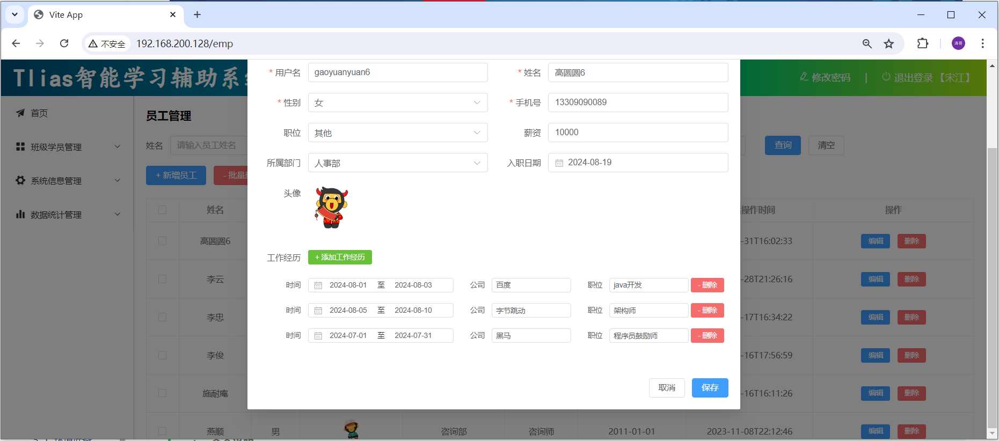

当前程序中存在的问题:

- 线上程序不会采用控制台霸屏的形式运行程序，而是将程序在后台运行

- 线上程序不会将日志输出到控制台，而是输出到日志文件，方便运维查阅信息

要解决上述这两个问题，我们就可以通过 nohup 指令让程序在后台运行。

### 后台运行

1\)\. 后台运行程序

```YAML
nohup java -jar tlias-web-management-0.0.1-SNAPSHOT.jar &> tlias.log &
```

通过上述指令就可以后台运行服务，服务运行之后， 所有的日志信息都会输出到 tlias\.log 文件中。

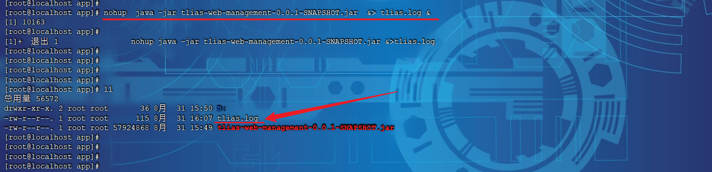

2\)\. 停止服务

```YAML
#查看服务的进程信息
ps -ef|grep tlias

#杀掉进程
kill -9 xxxxx
```

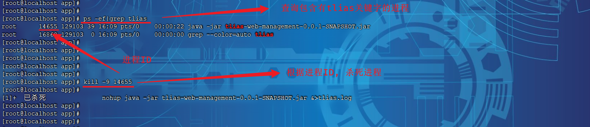

**nohup命令说明:**

- **nohup命令：**英文全称 no hang up（不挂起），用于不挂断地运行指定命令，退出终端不会影响程序的运行

- **语法格式：** `nohup command [ args … ] [&]`

- **参数说明：**
  - command：要执行的命令

  - args：一些参数，可以指定输出文件

  - \&：让命令在后台运行

- **举例：**
  - `nohup java -jar boot工程.jar &> hello.log &`

上述指令的含义为： 后台运行 java \-jar 命令，并将日志输出到hello\.log文件
