# 软件安装

## 软件安装方式

在Linux系统中，安装软件的方式主要有四种，这四种安装方式的特点如下：


## 安装JDK

上述我们介绍了Linux系统软件安装的四种形式，接下来我们就通过第一种\(二进制发布包\)形式来安装JDK。 JDK对应的二进制发布包，在课程资料中已经提供，如下：


JDK具体安装步骤如下： 

**1\)\. 上传安装包**

使用FinalShell自带的上传工具将jdk的二进制发布包上传到Linux

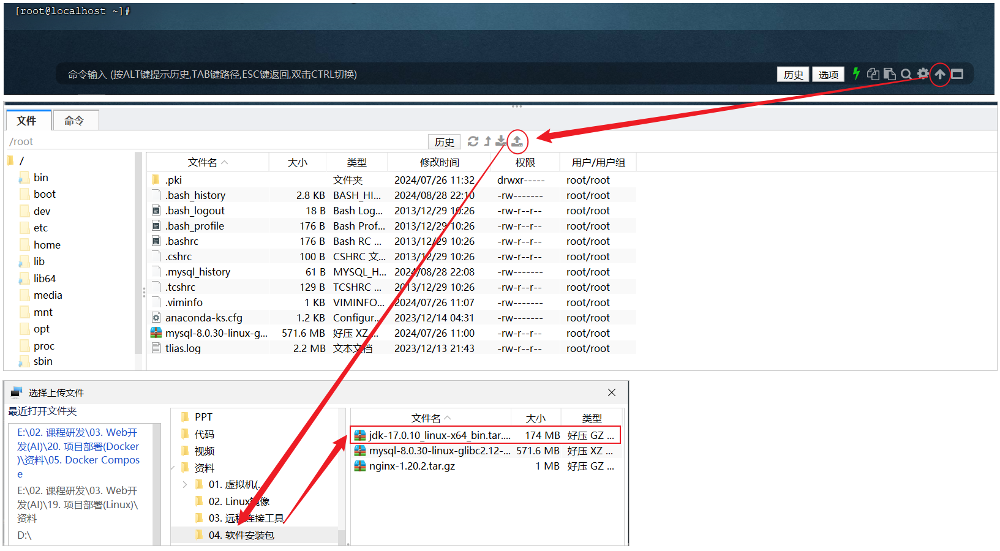

由于上述在进行文件上传时，选择的上传目录 /root，上传完毕后，我们执行指令 cd /root 切换到根目录下，查看上传的安装包。

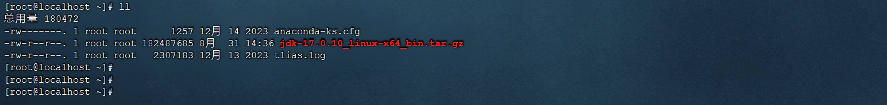


**2\)\. 解压安装包**

执行如下指令，将上传上来的压缩包进行解压，并通过\-C参数指定解压文件存放目录为 /usr/local。

```Shell
tar -zxvf jdk-21_linux-x64_bin.tar.gz -C /usr/local/
```

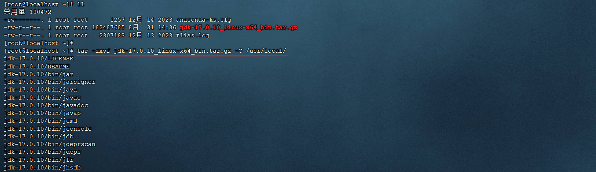


**3\)\. 配置环境变量**

使用vim命令修改`/etc/profile`文件，在文件末尾加入如下配置

```Shell
export JAVA_HOME=/usr/local/jdk-17.0.10
export PATH=$JAVA_HOME/bin:$PATH
```


具体操作指令如下: 

```Shell
1). 编辑/etc/profile文件，进入命令模式
    vim /etc/profile

2). 在命令模式中，输入指令 G ， 切换到文件最后
    G

3). 在命令模式中输入 i/a/o 进入插入模式，然后切换到文件最后一行
    i

4). 将上述的配置拷贝到文件中
    export JAVA_HOME=/usr/local/jdk-17.0.10
    export PATH=$JAVA_HOME/bin:$PATH
        
5). 从插入模式，切换到指令模式
    ESC
        
6). 按:进入底行模式，然后输入wq，回车保存
    :wq
```


**4\)\. 重新加载profile文件**

为了使更改的配置立即生效，需要重新加载profile文件，执行命令:

```Shell
source /etc/profile
```


**5\)\. 检查安装是否成功**

```Shell
java -version
```

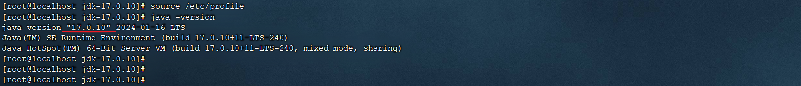


## 安装MySQL

### MySQL安装

对于MySQL数据库的安装，我们将要使用前面讲解的第一种安装方式进行安装。


**1\)\. 准备工作**

在安装MySQL数据库之前，我们需要先检查一下当前Linux系统中，是否安装的有MySQL的相关服务（很多linux安装完毕之后，自带了低版本的mysql的依赖包），如果有，先需要卸载掉，然后再进行安装。


A\. 通过rpm相关指令，来**查询**当前系统中是否存在已安装的mysql软件包，执行指令如下：

- `rpm -``qa`                                  查询当前系统中安装的所有软件

- `rpm -qa ``|`` grep mysql`            查询当前系统中安装的名称带mysql的软件

- `rpm -qa`` | grep mariadb`        查询当前系统中安装的名称带mariadb的软件


通过rpm \-qa 查询到系统通过rpm安装的所有软件，太多了，不方便查看，所以我们可以通过管道符 \| 配合着grep进行过滤查询。


通过查询，我们发现在当前系统中存在mariadb数据库，是CentOS7中自带的，而这个数据库和MySQL数据库是冲突的，所以要想保证MySQL成功安装，需要卸载mariadb数据库。

**RPM：**全称为 Red\-Hat Package Manager，RPM软件包管理器，是红帽Linux用于管理和安装软件的工具。


B\. 通过 rpm 相关指令，来卸载对应的组件，执行指令如下：

在rpm中，卸载软件的语法为：`rpm -e --nodeps``  软件名称`

那么，我们就可以通过指令，卸载 mariadb，具体指令为： `rpm -e --nodeps mariadb-libs-5.5.60-1.el7_5.x86_64`


我们看到执行完毕之后， 再次查询 mariadb，就查不到了，因为已经被成功卸载了。


**2\)\. 将资料中提供的MySQL安装包上传到Linux并解压**

A\. 上传MySQL安装包

在课程资料中，提供的有MySQL的安装包 ，我们需要将该安装包上传到Linux系统的根目录 /root 下面。


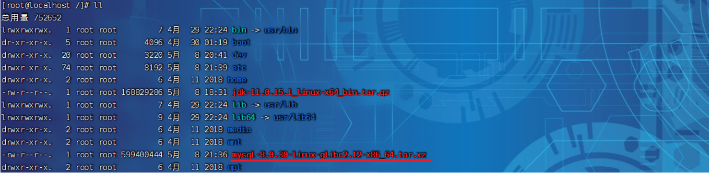


B\. 解压到 当前目录

执行如下指令: 

```PowerShell
tar -xvf mysql-8.0.30-linux-glibc2.12-x86_64.tar.xz
```

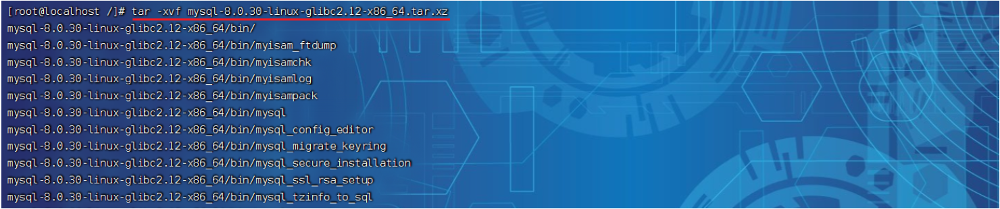


C\. 将解压后的文件夹移动到 /usr/local 目录下， 并改名为 mysql

```Shell
mv mysql-8.0.30-linux-glibc2.12-x86_64 /usr/local/mysql

cd /usr/local/mysql
```


**3\)\. 配置系统环境变量**

配置MySQL的环境变量, 通过vi编辑器编辑 `/etc/profile` 文件, 在尾部追加:

```Shell
export MYSQL_HOME=/usr/local/mysql
export PATH=$MYSQL_HOME/bin:$PATH
```


并执行如下指令, 注册MySQL为系统服务:

```Shell
cp /usr/local/mysql/support-files/mysql.server /etc/init.d/mysql
chkconfig --add mysql
```


**5\)\. 初始化数据库**

```Shell
#创建一个用户组, 组名就叫mysql
groupadd mysql

#创建一个系统用户 mysql, 并归属于用户组 mysql 
useradd -r -g mysql -s /bin/false mysql
```

```Shell
#初始化mysql
mysqld --initialize --user=mysql --basedir=/usr/local/mysql --datadir=/usr/local/mysql/data
```

执行上述指令时, 会输入如下日志，在日志中就输出了MySQL中root用户的一个临时密码【**记得复制出来，记录下来**】： 

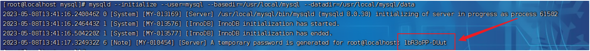


### 启动MySQL

A\. 启动MySQL服务

```Shell
systemctl start mysql
```


B\. 通过命令, 登录MySQL

```Shell
#xxxxx 代表上述生成的root的临时密码
mysql -uroot -pxxxxx
```

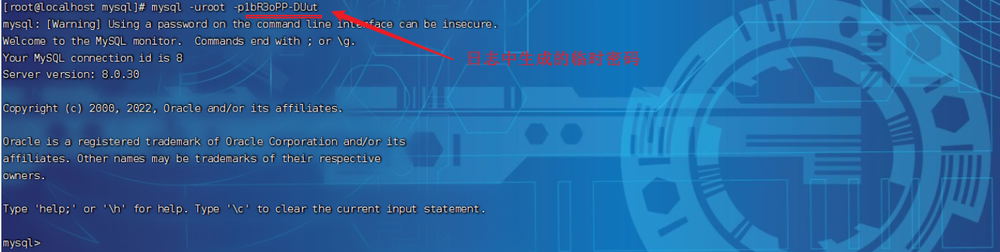


### 配置MySQL

A\. 修改root用户的密码

```Shell
ALTER USER 'root'@'localhost' IDENTIFIED WITH mysql_native_password BY '1234';
```

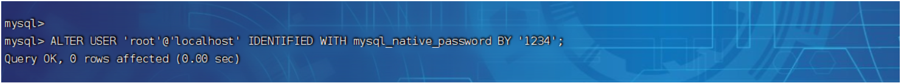

**注意: 这个root账号仅仅能够在本机****localhost****上访问，我们在windows上是无法访问的。如果需要在window上或其他服务器上也能远程访问，需要创建一个账号，用于远程访问的。**


B\. 创建账号, 并授权远程访问

```Shell
CREATE USER 'root'@'%' IDENTIFIED BY '1234';

GRANT ALL PRIVILEGES ON *.* TO 'root'@'%';

FLUSH PRIVILEGES;
```

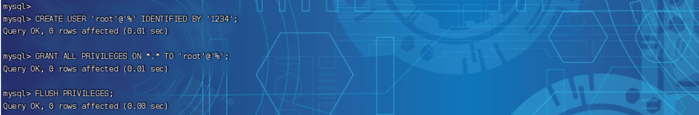

我们已经开启了MySQL的远程访问的权限，为什么还是连接不上MySQL服务器呢？？ 这是因为Linux系统的防火墙，将我们的访问拦截了。

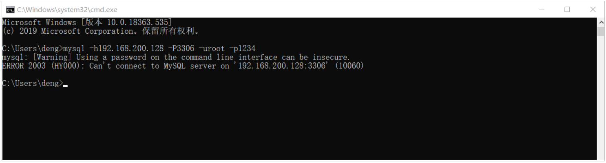


### 防火墙操作

Linux系统安装完毕后，系统启动时，防火墙自动启动，防火墙拦截了所有端口的访问。接下来我们就需要学习一下，如何操作防火墙，具体指令如下： 

注意： 要想在windows上能够访问MySQL，需要开放防火墙的3306端口  或者 直接关闭防火墙 ，执行如下指令:

```Shell
#开发防火墙的3306端口号
firewall-cmd --zone=public --add-port=3306/tcp --permanent

#重新加载
firewall-cmd --reload

#查看开放的端口号
firewall-cmd --zone=public --list-ports
```

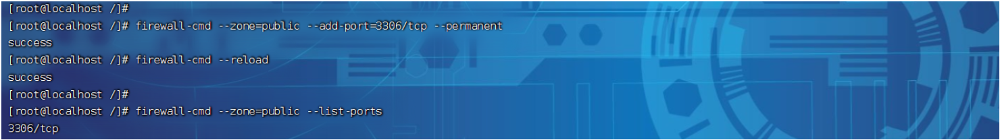


或者直接关闭防火墙: 

```Shell
systemctl stop firewalld
```

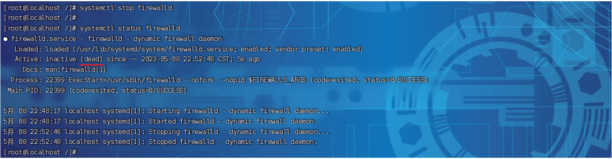


### 连接测试

关闭掉linux系统的防火墙之后，我们就可以打开windows上的命令行，通过mysql的客户端\(命令行/图形化界面\)来连接远程linux上安装的MySQL数据库了。


1\)\. 客户端连接

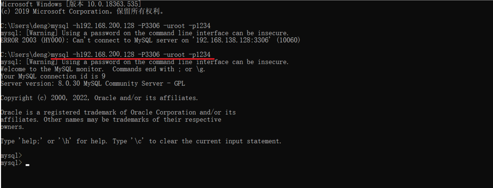


2\)\. 打开DataGrip图形化工具连接

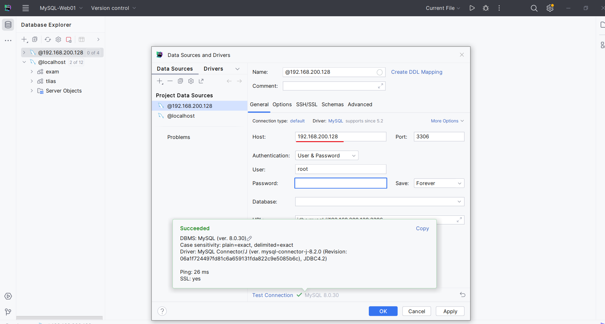


执行资料中提供的SQL脚本 `tlias.sql` 。

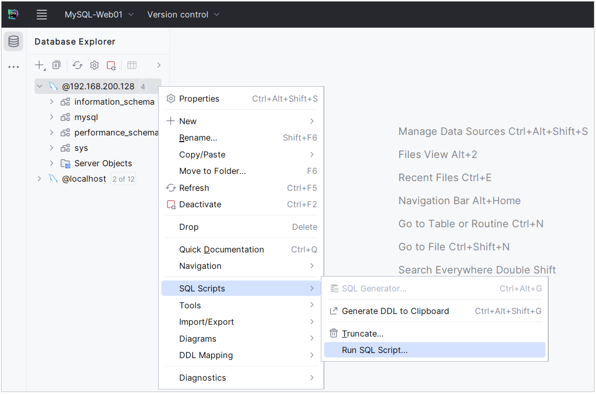

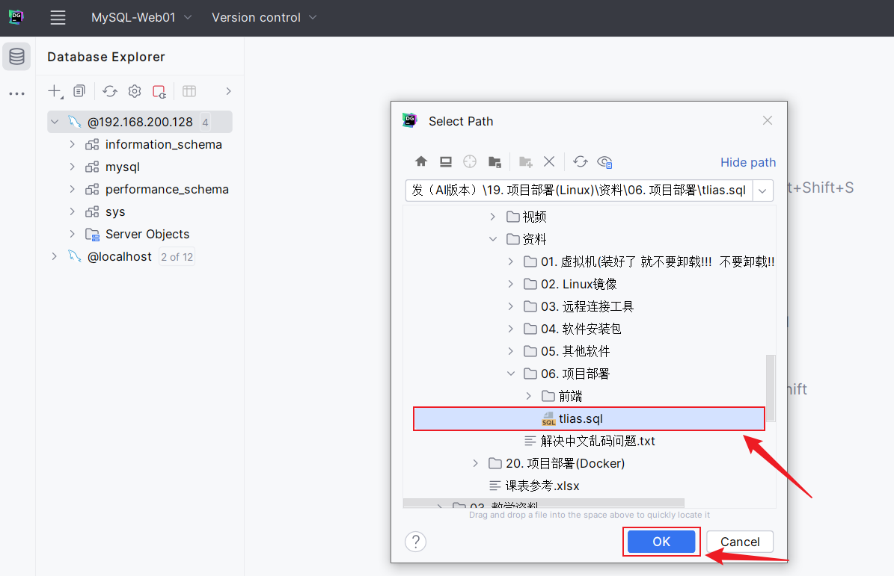

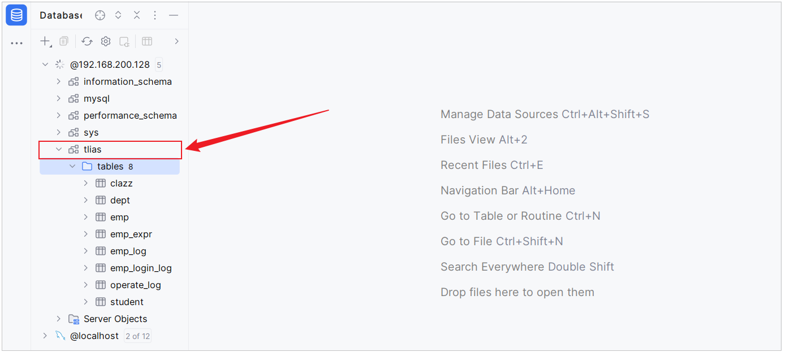


## 安装Nginx

### 安装

Nginx的安装包，从官方下载下来的是c语言的源码包，我们需要自己编译安装。具体操作步骤如下：

1\)\. 安装Nginx运行时需要的依赖

```Shell
yum install -y pcre pcre-devel zlib zlib-devel openssl openssl-devel
```

安装C语言的编译环境\.

```Shell
yum install gcc-c++
```


2\)\. 上传Nginx的源码包


3\)\. 解压源码包到当前目录

```Shell
tar -zxvf nginx-1.20.2.tar.gz
```


4\)\. 进入到解压目录后，执行指令

```Shell
#进入解压目录
cd nginx-1.20.2

#执行命令配置, 生成Makefile文件
./configure --prefix=/usr/local/nginx
```


5\)\. 执行命令进行编译和安装

```Shell
#编译
make

#编译安装
make install
```


### 启动Nginx

进入到nginx安装目录`/usr/local/nginx`，启动nginx服务

```Shell
cd /usr/local/nginx/
sbin/nginx
```


启动完毕之后，我们可以通过 `ps` 指令查询当前系统中的nginx进程，从而确认nginx是否启动 。

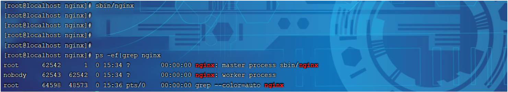


然后，我们就可以打开浏览器，访问服务器上的nginx 。

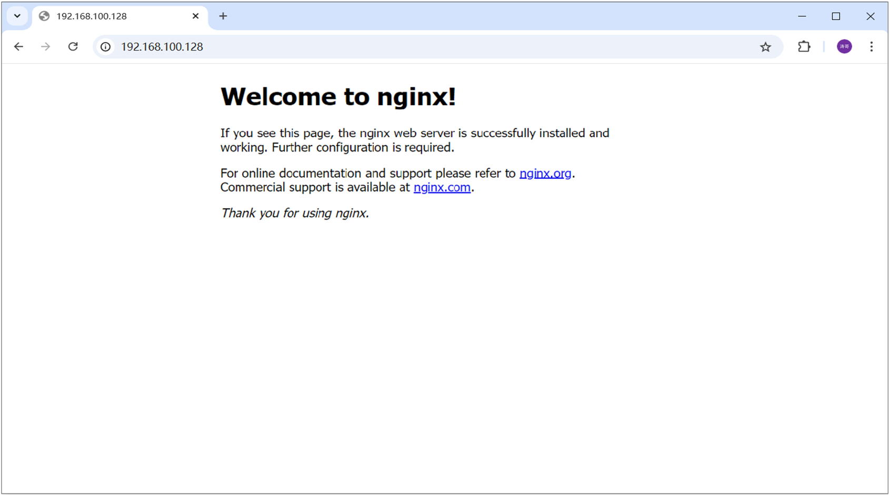


