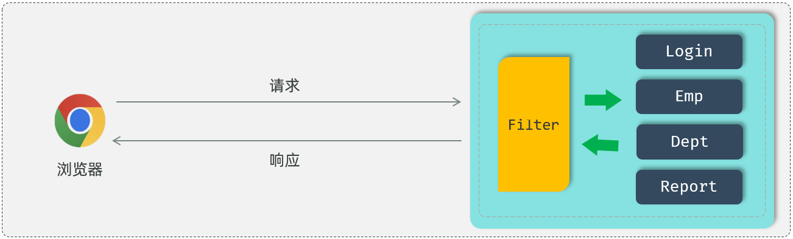
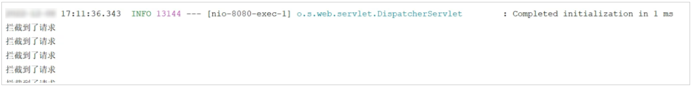
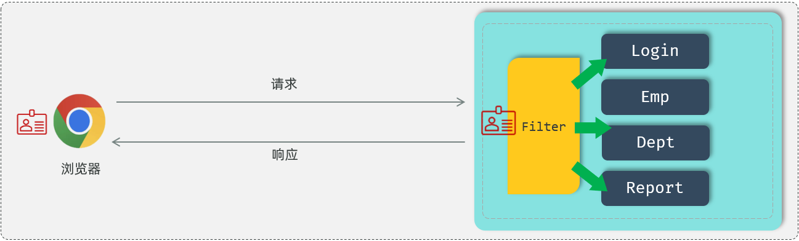
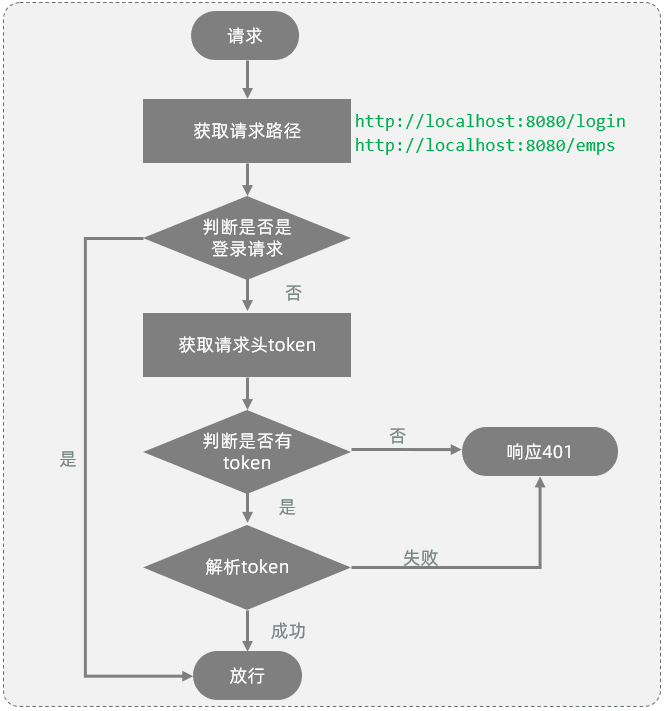
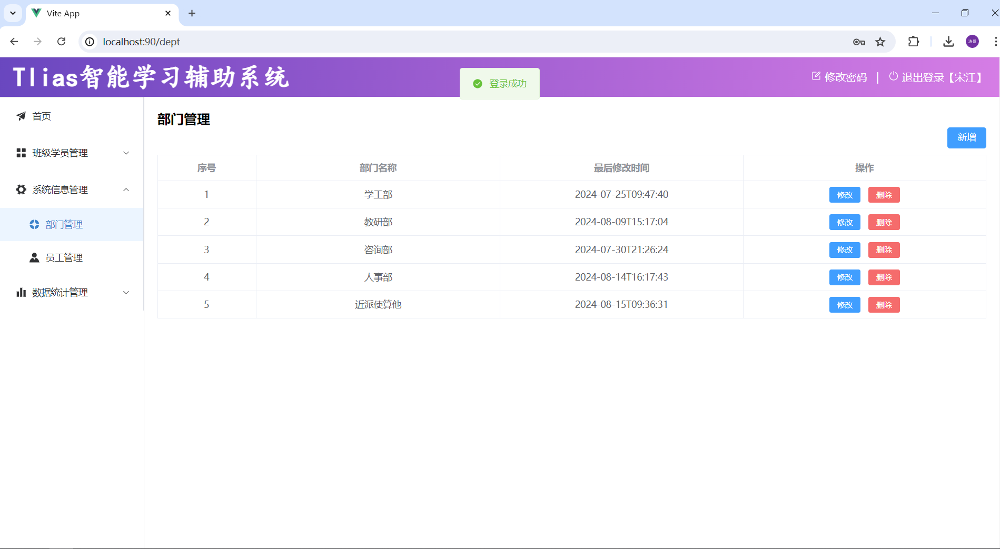
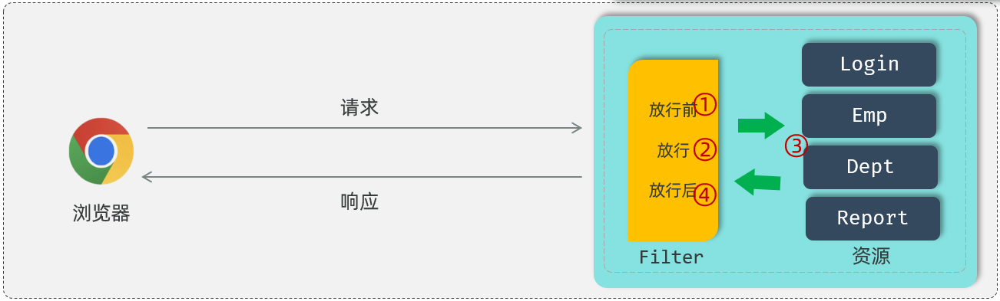
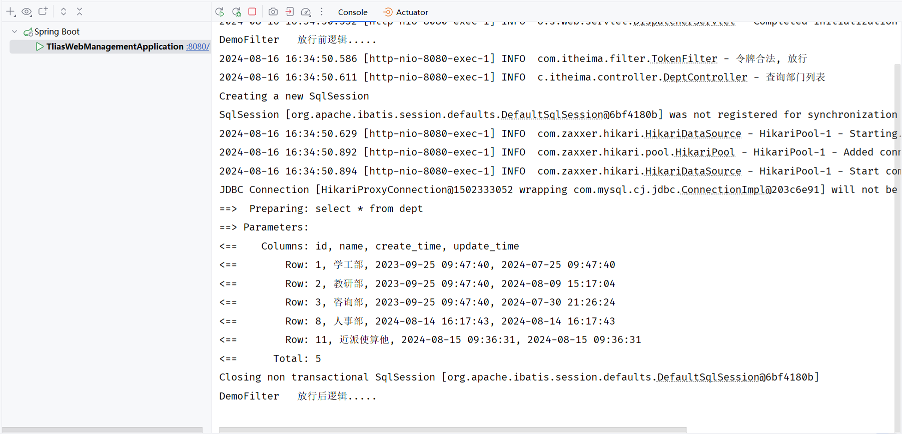
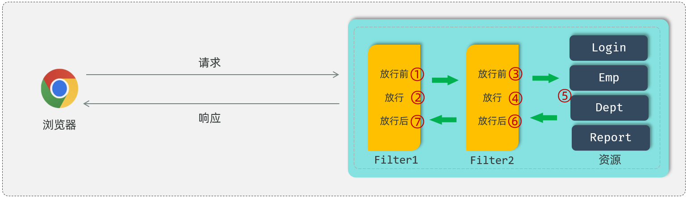

# 过滤器Filter

刚才通过浏览器的开发者工具，我们可以看到在后续的请求当中，都会在请求头中携带JWT令牌到服务端，而服务端需要统一拦截所有的请求，从而判断是否携带的有合法的JWT令牌。

那怎么样来统一拦截到所有的请求校验令牌的有效性呢？这里我们会学习两种解决方案：

1. Filter过滤器

2. Interceptor拦截器


我们首先来学习过滤器Filter。


## Filter快速入门

什么是Filter？

- Filter表示过滤器，是 JavaWeb三大组件\(Servlet、Filter、Listener\)之一。

- 过滤器可以把对资源的请求拦截下来，从而实现一些特殊的功能

    - 使用了过滤器之后，要想访问web服务器上的资源，必须先经过滤器，过滤器处理完毕之后，才可以访问对应的资源。

- 过滤器一般完成一些通用的操作，比如：登录校验、统一编码处理、敏感字符处理等。




下面我们通过Filter快速入门程序掌握过滤器的基本使用操作：

- 第1步，定义过滤器 ：1\.定义一个类，实现 Filter 接口，并重写其所有方法。

- 第2步，配置过滤器：Filter类上加 @WebFilter 注解，配置拦截资源的路径。引导类上加 @ServletComponentScan 开启Servlet组件支持。


**1\)\. 定义过滤器**

```Java
public class DemoFilter implements Filter {
    //初始化方法, web服务器启动, 创建Filter实例时调用, 只调用一次
    public void init(FilterConfig filterConfig) throws ServletException {
        System.out.println("init ...");
    }

    //拦截到请求时,调用该方法,可以调用多次
    public void doFilter(ServletRequest servletRequest, ServletResponse servletResponse, FilterChain chain) throws IOException, ServletException {
        System.out.println("拦截到了请求...");
    }

    //销毁方法, web服务器关闭时调用, 只调用一次
    public void destroy() {
        System.out.println("destroy ... ");
    }
}
```

- init方法：过滤器的初始化方法。在web服务器启动的时候会自动的创建Filter过滤器对象，在创建过滤器对象的时候会自动调用init初始化方法，这个方法只会被调用一次。

- doFilter方法：这个方法是在每一次拦截到请求之后都会被调用，所以这个方法是会被调用多次的，每拦截到一次请求就会调用一次doFilter\(\)方法。

- destroy方法： 是销毁的方法。当我们关闭服务器的时候，它会自动的调用销毁方法destroy，而这个销毁方法也只会被调用一次。


**2\)\. 配置过滤器**

在定义完Filter之后，Filter其实并不会生效，还需要完成Filter的配置，Filter的配置非常简单，只需要在Filter类上添加一个注解：`@WebFilter`，并指定属性`urlPatterns`，通过这个属性指定过滤器要拦截哪些请求

```Java
@WebFilter(urlPatterns = "/*") //配置过滤器要拦截的请求路径（ /* 表示拦截浏览器的所有请求 ）
public class DemoFilter implements Filter {
    //初始化方法, web服务器启动, 创建Filter实例时调用, 只调用一次
    public void init(FilterConfig filterConfig) throws ServletException {
        System.out.println("init ...");
    }

    //拦截到请求时,调用该方法,可以调用多次
    public void doFilter(ServletRequest servletRequest, ServletResponse servletResponse, FilterChain chain) throws IOException, ServletException {
        System.out.println("拦截到了请求...");
    }

    //销毁方法, web服务器关闭时调用, 只调用一次
    public void destroy() {
        System.out.println("destroy ... ");
    }
}
```

当我们在Filter类上面加了@WebFilter注解之后，接下来我们还需要在启动类上面加上一个注解`@ServletComponentScan`，通过这个`@ServletComponentScan`注解来开启SpringBoot项目对于Servlet组件的支持。

```Java
@ServletComponentScan //开启对Servlet组件的支持
@SpringBootApplication
public class TliasManagementApplication {
    public static void main(String[] args) {
        SpringApplication.run(TliasManagementApplication.class, args);
    }
}
```

重新启动服务，打开浏览器，执行部门管理的请求，可以看到控制台输出了过滤器中的内容：  




**注意事项：**在过滤器Filter中，如果不执行放行操作，将无法访问后面的资源。 放行操作：`chain.doFilter(request, response);`


## 登录校验过滤器

### 分析

过滤器Filter的快速入门以及使用细节我们已经介绍完了，接下来最后一步，我们需要使用过滤器Filter来完成案例当中的登录校验功能。



我们先来回顾下前面分析过的登录校验的基本流程：

- 要进入到后台管理系统，我们必须先完成登录操作，此时就需要访问登录接口login。

- 登录成功之后，我们会在服务端生成一个JWT令牌，并且把JWT令牌返回给前端，前端会将JWT令牌存储下来。

- 在后续的每一次请求当中，都会将JWT令牌携带到服务端，请求到达服务端之后，要想去访问对应的业务功能，此时我们必须先要校验令牌的有效性。

- 对于校验令牌的这一块操作，我们使用登录校验的过滤器，在过滤器当中来校验令牌的有效性。如果令牌是无效的，就响应一个错误的信息，也不会再去放行访问对应的资源了。如果令牌存在，并且它是有效的，此时就会放行去访问对应的web资源，执行相应的业务操作。


大概清楚了在Filter过滤器的实现步骤了，那在正式开发登录校验过滤器之前，我们思考两个问题：

1. 所有的请求，拦截到了之后，都需要校验令牌吗 ？

    - 答案：**登录请求例外**

2. 拦截到请求后，什么情况下才可以放行，执行业务操作 ？

    - 答案：**有令牌，且令牌校验通过\(合法\)；否则都返回未登录错误结果**


### 具体流程

我们要完成登录校验，主要是利用Filter过滤器实现，而Filter过滤器的流程步骤：



基于上面的业务流程，我们分析出具体的操作步骤：

1. 获取请求url

2. 判断请求url中是否包含login，如果包含，说明是登录操作，放行

3. 获取请求头中的令牌（token）

4. 判断令牌是否存在，如果不存在，响应 401

5. 解析token，如果解析失败，响应 401

6. 放行


### 代码实现

在 `com.itheima.filter` 包下创建`TokenFilter`，具体代码如下：

```Java
package com.itheima.filter;

import com.itheima.utils.JwtUtils;
import jakarta.servlet.*;
import jakarta.servlet.annotation.WebFilter;
import jakarta.servlet.http.HttpServletRequest;
import jakarta.servlet.http.HttpServletResponse;
import lombok.extern.slf4j.Slf4j;
import org.apache.http.HttpStatus;
import org.springframework.util.StringUtils;
import java.io.IOException;

*/***
* * 令牌校验过滤器*
* */*
@Slf4j
@WebFilter(urlPatterns = "/*")
public class TokenFilter implements Filter {

    @Override
    public void doFilter(ServletRequest req, ServletResponse resp, FilterChain chain) throws IOException, ServletException {
        HttpServletRequest request = (HttpServletRequest) req;
        HttpServletResponse response = (HttpServletResponse) resp;
        //1. 获取请求url。
        String url = request.getRequestURL().toString();

        //2. 判断请求url中是否包含login，如果包含，说明是登录操作，放行。
        if(url.contains("login")){ //登录请求
            *log*.info("登录请求 , 直接放行");
            chain.doFilter(request, response);
            return;
        }

        //3. 获取请求头中的令牌（token）。
        String jwt = request.getHeader("token");

        //4. 判断令牌是否存在，如果不存在，返回错误结果（未登录）。
        if(!StringUtils.*hasLength*(jwt)){ //jwt为空
            *log*.info("获取到jwt令牌为空, 返回错误结果");
            response.setStatus(HttpStatus.*SC_UNAUTHORIZED*);
            return;
        }

        //5. 解析token，如果解析失败，返回错误结果（未登录）。
        try {
            JwtUtils.*parseJWT*(jwt);
        } catch (Exception e) {
            e.printStackTrace();
            *log*.info("解析令牌失败, 返回错误结果");
            response.setStatus(HttpStatus.*SC_UNAUTHORIZED*);
            return;
        }

        //6. 放行。
        *log*.info("令牌合法, 放行");
        chain.doFilter(request , response);
    }

}
```

登录校验的过滤器我们编写完成了，接下来我们就可以重新启动服务来做一个测试：


- 测试1：未登录是否可以访问部门管理页面

首先关闭浏览器，重新打开浏览器，在地址栏中输入：`http://localhost:90`

由于用户没有登录，登录校验过滤器返回错误信息，前端页面根据返回的错误信息结果，自动跳转到登录页面了  


- 测试2：先进行登录操作，再访问部门管理页面

登录校验成功之后，可以正常访问相关业务操作页面




## Filter详解

Filter过滤器的快速入门程序我们已经完成了，接下来我们就要详细的介绍一下过滤器Filter在使用中的一些细节。主要介绍以下3个方面的细节：

1. 过滤器的执行流程

2. 过滤器的拦截路径配置

3. 过滤器链


### 执行流程

首先我们先来看下过滤器的执行流程：



过滤器当中我们拦截到了请求之后，如果希望继续访问后面的web资源，就要执行放行操作，放行就是调用 FilterChain对象当中的doFilter\(\)方法，在调用doFilter\(\)这个方法之前所编写的代码属于放行之前的逻辑。

在放行后访问完 web 资源之后还会回到过滤器当中，回到过滤器之后如有需求还可以执行放行之后的逻辑，放行之后的逻辑我们写在doFilter\(\)这行代码之后。


测试代码：

```Java
@WebFilter(urlPatterns = "/*") 
public class DemoFilter implements Filter {
    
    @Override //初始化方法, 只调用一次
    public void init(FilterConfig filterConfig) throws ServletException {
        System.out.println("init 初始化方法执行了");
    }
    
    @Override
    public void doFilter(ServletRequest servletRequest, ServletResponse servletResponse, FilterChain filterChain) throws IOException, ServletException {
        
        System.out.println("DemoFilter   放行前逻辑.....");

        //放行请求
        filterChain.doFilter(servletRequest,servletResponse);

        System.out.println("DemoFilter   放行后逻辑.....");
        
    }

    @Override //销毁方法, 只调用一次
    public void destroy() {
        System.out.println("destroy 销毁方法执行了");
    }
}
```

启动之后运行测试：




### 拦截路径

执行流程我们搞清楚之后，接下来再来介绍一下过滤器的拦截路径，Filter可以根据需求，配置不同的拦截资源路径：

下面我们来测试"拦截具体路径"：

```Java
@WebFilter(urlPatterns = "/login")  //拦截/login具体路径
public class DemoFilter implements Filter {
    @Override
    public void doFilter(ServletRequest servletRequest, ServletResponse servletResponse, FilterChain filterChain) throws IOException, ServletException {
        System.out.println("DemoFilter   放行前逻辑.....");

        //放行请求
        filterChain.doFilter(servletRequest,servletResponse);

        System.out.println("DemoFilter   放行后逻辑.....");
    }


    @Override
    public void init(FilterConfig filterConfig) throws ServletException {
        Filter.super.init(filterConfig);
    }

    @Override
    public void destroy() {
        Filter.super.destroy();
    }
}
```


### 过滤器链

最后我们在来介绍下过滤器链，什么是过滤器链呢？所谓过滤器链指的是在一个web应用程序当中，可以配置多个过滤器，多个过滤器就形成了一个过滤器链。



比如：在我们web服务器当中，定义了两个过滤器，这两个过滤器就形成了一个过滤器链。

而这个链上的过滤器在执行的时候会一个一个的执行，会先执行第一个Filter，放行之后再来执行第二个Filter，如果执行到了最后一个过滤器放行之后，才会访问对应的web资源。

访问完web资源之后，按照我们刚才所介绍的过滤器的执行流程，还会回到过滤器当中来执行过滤器放行后的逻辑，而在执行放行后的逻辑的时候，顺序是反着的。

先要执行过滤器2放行之后的逻辑，再来执行过滤器1放行之后的逻辑，最后在给浏览器响应数据。


过滤器链上过滤器的执行顺序：注解配置的Filter，优先级是按照过滤器类名（字符串）的自然排序。 比如：

- AbcFilter

- DemoFilter

这两个过滤器来说，AbcFilter 会先执行，DemoFilter会后执行。


