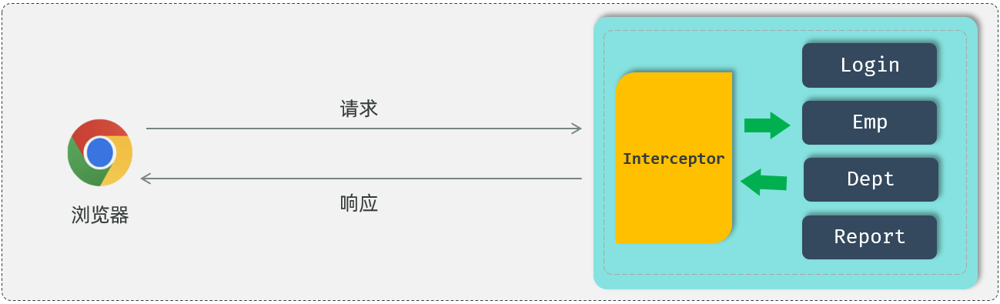
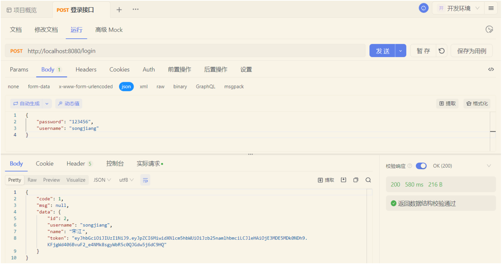
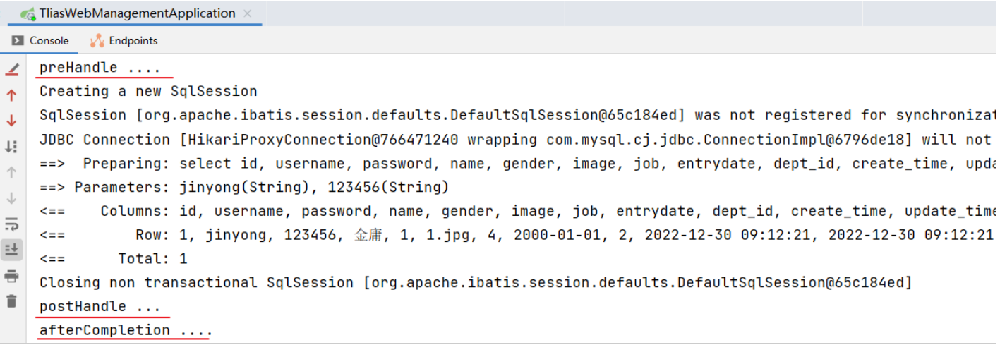
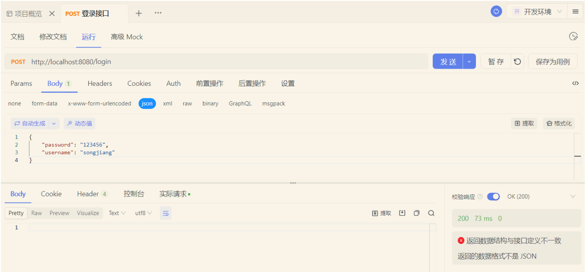
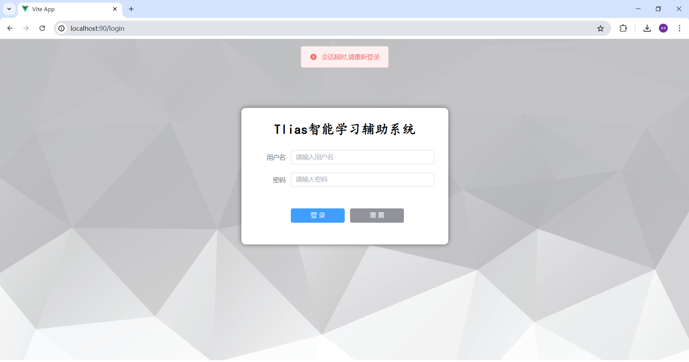
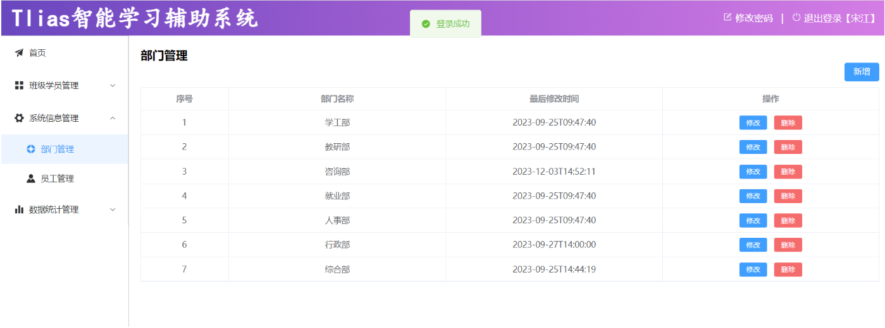
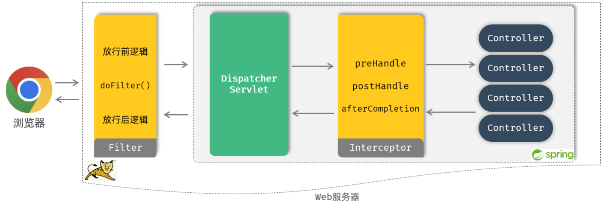

# 拦截器Interceptor

## 快速入门

什么是拦截器？

- 是一种动态拦截方法调用的机制，类似于过滤器。

- 拦截器是Spring框架中提供的，用来动态拦截控制器方法的执行。

- 拦截器的作用：拦截请求，在指定方法调用前后，根据业务需要执行预先设定的代码。



在拦截器当中，我们通常也是做一些通用性的操作，比如：我们可以通过拦截器来拦截前端发起的请求，将登录校验的逻辑全部编写在拦截器当中。在校验的过程当中，如发现用户登录了\(携带JWT令牌且是合法令牌\)，就可以直接放行，去访问spring当中的资源。如果校验时发现并没有登录或是非法令牌，就可以直接给前端响应未登录的错误信息。


下面我们通过快速入门程序，来学习下拦截器的基本使用。拦截器的使用步骤和过滤器类似，也分为两步：

1. 定义拦截器

2. 注册配置拦截器


**1\)\. 自定义拦截器**

实现HandlerInterceptor接口，并重写其所有方法

```Java
//自定义拦截器
@Component
public class DemoInterceptor implements HandlerInterceptor {
    //目标资源方法执行前执行。 返回true：放行    返回false：不放行
    @Override
    public boolean preHandle(HttpServletRequest request, HttpServletResponse response, Object handler) throws Exception {
        System.out.println("preHandle .... ");
        
        return true; //true表示放行
    }

    //目标资源方法执行后执行
    @Override
    public void postHandle(HttpServletRequest request, HttpServletResponse response, Object handler, ModelAndView modelAndView) throws Exception {
        System.out.println("postHandle ... ");
    }

    //视图渲染完毕后执行，最后执行
    @Override
    public void afterCompletion(HttpServletRequest request, HttpServletResponse response, Object handler, Exception ex) throws Exception {
        System.out.println("afterCompletion .... ");
    }
}
```

注意：

- preHandle方法：目标资源方法执行前执行。 返回true：放行    返回false：不放行

- postHandle方法：目标资源方法执行后执行

- afterCompletion方法：视图渲染完毕后执行，最后执行


**2\)\.**** 注册配置拦截器**

在 `com.itheima`下创建一个包，然后创建一个配置类 `WebConfig`， 实现 `WebMvcConfigurer` 接口，并重写 `addInterceptors` 方法

```Java
@Configuration  
public class WebConfig implements WebMvcConfigurer {

    //自定义的拦截器对象
    @Autowired
    private DemoInterceptor demoInterceptor;

    
    @Override
    public void addInterceptors(InterceptorRegistry registry) {
       //注册自定义拦截器对象
        registry.addInterceptor(demoInterceptor).addPathPatterns("/**");//设置拦截器拦截的请求路径（ /** 表示拦截所有请求）
    }
}
```

重新启动SpringBoot服务，打开Apifox测试：



可以看到控制台输出的日志：




接下来我们再来做一个测试：将拦截器中返回值改为false

使用Apifox，再次点击send发送请求后，没有响应数据，说明请求被拦截了没有放行




## 令牌校验Interceptor

讲解完了拦截器的基本操作之后，接下来我们需要完成最后一步操作：通过拦截器来完成案例当中的登录校验功能。

登录校验的业务逻辑以及操作步骤我们前面已经分析过了，和登录校验Filter过滤器当中的逻辑是完全一致的。现在我们只需要把这个技术方案由原来的过滤器换成拦截器interceptor就可以了。


**1\)\. TokenInterceptor**

在 `com.itheima.interceptor` 包下创建 `TokenInterceptor`

```Java
@Slf4j
@Component
public class TokenInterceptor implements HandlerInterceptor {
    @Override
    public boolean preHandle(HttpServletRequest request, HttpServletResponse response, Object handler) throws Exception {
        //1. 获取请求url。
        String url = request.getRequestURL().toString();

        //2. 判断请求url中是否包含login，如果包含，说明是登录操作，放行。
        if(url.contains("login")){ //登录请求
            log.info("登录请求 , 直接放行");
            return true;
        }

        //3. 获取请求头中的令牌（token）。
        String jwt = request.getHeader("token");

        //4. 判断令牌是否存在，如果不存在，返回错误结果（未登录）。
        if(!StringUtils.hasLength(jwt)){ //jwt为空
            log.info("获取到jwt令牌为空, 返回错误结果");
            response.setStatus(HttpStatus.SC_UNAUTHORIZED);
            return false;
        }

        //5. 解析token，如果解析失败，返回错误结果（未登录）。
        try {
            JwtUtils.parseJWT(jwt);
        } catch (Exception e) {
            e.printStackTrace();
            log.info("解析令牌失败, 返回错误结果");
            response.setStatus(HttpStatus.SC_UNAUTHORIZED);
            return false;
        }

        //6. 放行。
        log.info("令牌合法, 放行");
        return true;
    }

}
```


**2\)\. ****配置拦截器**

```Java
@Configuration  
public class WebConfig implements WebMvcConfigurer {
    //拦截器对象
    @Autowired
    private TokenInterceptor tokenInterceptor;

    @Override
    public void addInterceptors(InterceptorRegistry registry) {
       //注册自定义拦截器对象
        registry.addInterceptor(tokenInterceptor).addPathPatterns("/**");
    }
}

```


登录校验的拦截器编写完成后，接下来我们就可以重新启动服务来做一个测试： （**关闭登录校验Filter过滤器**）


- 测试1：未登录是否可以访问部门管理页面

首先关闭浏览器，重新打开浏览器，在地址栏中输入：`http://localhost:90`

由于用户没有登录，校验机制返回错误信息，前端页面根据返回的错误信息结果，自动跳转到登录页面了




- 测试2：先进行登录操作，再访问部门管理页面

登录校验成功之后，可以正常访问相关业务操作页面



到此我们也就验证了所开发的登录校验的拦截器也是没问题的。登录校验的过滤器和拦截器，我们只需要使用其中的一种就可以了。


## Interceptor详解

拦截器的入门程序完成之后，接下来我们来介绍拦截器的使用细节。拦截器的使用细节我们主要介绍两个部分：

1. 拦截器的拦截路径配置

2. 拦截器的执行流程


## 拦截路径

首先我们先来看拦截器的拦截路径的配置，在注册配置拦截器的时候，我们要指定拦截器的拦截路径，通过`addPathPatterns("要拦截路径")`方法，就可以指定要拦截哪些资源。

在入门程序中我们配置的是`/**`，表示拦截所有资源，而在配置拦截器时，不仅可以指定要拦截哪些资源，还可以指定不拦截哪些资源，只需要调用`excludePathPatterns("不拦截路径")`方法，指定哪些资源不需要拦截。

```Java
@Configuration  
public class WebConfig implements WebMvcConfigurer {

    //拦截器对象
    @Autowired
    private DemoInterceptor demoInterceptor;

    @Override
    public void addInterceptors(InterceptorRegistry registry) {
        //注册自定义拦截器对象
        registry.addInterceptor(demoInterceptor)
                .addPathPatterns("/**")//设置拦截器拦截的请求路径（ /** 表示拦截所有请求）
                .excludePathPatterns("/login");//设置不拦截的请求路径
    }
}
```


在拦截器中除了可以设置`/**`拦截所有资源外，还有一些常见拦截路径设置：


## 执行流程

介绍完拦截路径的配置之后，接下来我们再来介绍拦截器的执行流程。通过执行流程，大家就能够清晰的知道过滤器与拦截器的执行时机。



- 当我们打开浏览器来访问部署在web服务器当中的web应用时，此时我们所定义的过滤器会拦截到这次请求。拦截到这次请求之后，它会先执行放行前的逻辑，然后再执行放行操作。而由于我们当前是基于springboot开发的，所以放行之后是进入到了spring的环境当中，也就是要来访问我们所定义的controller当中的接口方法。

- Tomcat并不识别所编写的Controller程序，但是它识别Servlet程序，所以在Spring的Web环境中提供了一个非常核心的Servlet：DispatcherServlet（前端控制器），所有请求都会先进行到DispatcherServlet，再将请求转给Controller。

- 当我们定义了拦截器后，会在执行Controller的方法之前，请求被拦截器拦截住。执行`preHandle()`方法，这个方法执行完成后需要返回一个布尔类型的值，如果返回true，就表示放行本次操作，才会继续访问controller中的方法；如果返回false，则不会放行（controller中的方法也不会执行）。

- 在controller当中的方法执行完毕之后，再回过来执行`postHandle()`这个方法以及`afterCompletion()` 方法，然后再返回给DispatcherServlet，最终再来执行过滤器当中放行后的这一部分逻辑的逻辑。执行完毕之后，最终给浏览器响应数据。


以上就是拦截器的执行流程。通过执行流程分析，大家应该已经清楚了过滤器和拦截器之间的区别，其实它们之间的区别主要是两点：

- **接口规范不同：过滤器需要实现Filter接口，而拦截器需要实现HandlerInterceptor接口。**

- **拦截范围不同：****过滤器Filter会拦截所有的资源，而Interceptor只会拦截Spring环境中的资源****。**


