# 会话技术

介绍了登录校验的大概思路之后，我们先来学习下会话技术。

## 介绍

什么是会话？

- 在我们日常生活当中，会话指的就是谈话、交谈。

- 在web开发当中，会话指的就是浏览器与服务器之间的一次连接，我们就称为一次会话。

在用户打开浏览器第一次访问服务器的时候，这个会话就建立了，直到有任何一方断开连接，此时会话就结束了。在一次会话当中，是可以包含多次请求和响应的。

比如：打开了浏览器来访问web服务器上的资源（浏览器不能关闭、服务器不能断开）


- 第1次：访问的是登录的接口，完成登录操作

- 第2次：访问的是部门管理接口，查询所有部门数据

- 第3次：访问的是员工管理接口，查询员工数据


只要浏览器和服务器都没有关闭，以上3次请求都属于一次会话当中完成的。

需要注意的是：会话是和浏览器关联的，当有三个浏览器客户端和服务器建立了连接时，就会有三个会话。同一个浏览器在未关闭之前请求了多次服务器，这多次请求是属于同一个会话。比如：1、2、3这三个请求都是属于同一个会话。当我们关闭浏览器之后，这次会话就结束了。而如果我们是直接把web服务器关了，那么所有的会话就都结束了。

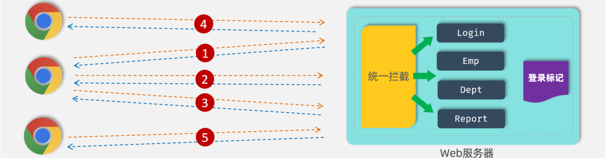

知道了会话的概念了，接下来我们再来了解下会话跟踪。

**会话跟踪：**一种维护浏览器状态的方法，服务器需要识别多次请求是否来自于同一浏览器，以便在同一次会话的多次请求间共享数据。

> 服务器会接收很多的请求，但是服务器是需要识别出这些请求是不是同一个浏览器发出来的。比如：1和2这两个请求是不是同一个浏览器发出来的，3和5这两个请求不是同一个浏览器发出来的。如果是同一个浏览器发出来的，就说明是同一个会话。如果是不同的浏览器发出来的，就说明是不同的会话。而识别多次请求是否来自于同一浏览器的过程，我们就称为会话跟踪。
> 
> 


我们使用会话跟踪技术就是要完成在同一个会话中，多个请求之间进行共享数据。

> 为什么要共享数据呢？
> 
> 由于HTTP是无状态协议，在后面请求中怎么拿到前一次请求生成的数据呢？此时就需要在一次会话的多次请求之间进行数据共享
> 
> 


会话跟踪技术有两种：

1. Cookie（客户端会话跟踪技术）：数据存储在客户端浏览器当中

2. Session（服务端会话跟踪技术）：数据存储在储在服务端

3. 令牌技术


## 会话跟踪方案

上面我们介绍了什么是会话，什么是会话跟踪，并且也提到了会话跟踪 3 种常见的技术方案。接下来，我们就来对比一下这 3 种会话跟踪的技术方案，来看一下具体的实现思路，以及它们之间的优缺点。


### 方案一：Cookie

cookie 是客户端会话跟踪技术，它是存储在客户端浏览器的，我们使用 cookie 来跟踪会话，我们就可以在浏览器第一次发起请求来请求服务器的时候，我们在服务器端来设置一个cookie。

比如第一次请求了登录接口，登录接口执行完成之后，我们就可以设置一个cookie，在 cookie 当中我们就可以来存储用户相关的一些数据信息。比如我可以在 cookie 当中来存储当前登录用户的用户名，用户的ID。

服务器端在给客户端在响应数据的时候，会**自动**的将 cookie 响应给浏览器，浏览器接收到响应回来的 cookie 之后，会**自动**的将 cookie 的值存储在浏览器本地。接下来在后续的每一次请求当中，都会将浏览器本地所存储的 cookie **自动**地携带到服务端。

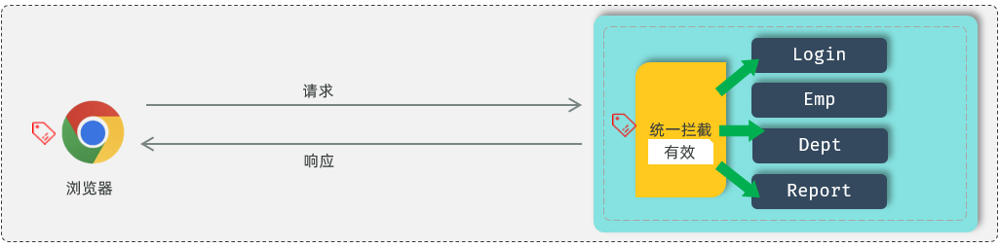

接下来在服务端我们就可以获取到 cookie 的值。我们可以去判断一下这个 cookie 的值是否存在，如果不存在这个cookie，就说明客户端之前是没有访问登录接口的；如果存在 cookie 的值，就说明客户端之前已经登录完成了。这样我们就可以基于 cookie 在同一次会话的不同请求之间来共享数据。


我刚才在介绍流程的时候，用了 3 个自动：

- 服务器会 **自动** 的将 cookie 响应给浏览器。

- 浏览器接收到响应回来的数据之后，会 **自动** 的将 cookie 存储在浏览器本地。

- 在后续的请求当中，浏览器会 **自动** 的将 cookie 携带到服务器端。


**为什么这一切都是自动化进行的？**

是因为 cookie 它是 HTP 协议当中所支持的技术，而各大浏览器厂商都支持了这一标准。在 HTTP 协议官方给我们提供了一个响应头和请求头：

- 响应头 Set\-Cookie ：设置Cookie数据的

- 请求头 Cookie：携带Cookie数据的

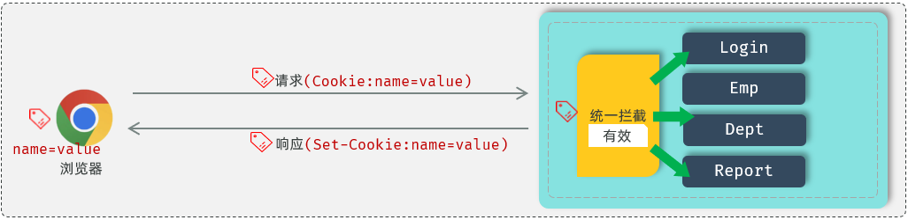


**代码测试：**

```Java
@Slf4j
@RestController
public class SessionController {

    //设置Cookie
    @GetMapping("/c1")
    public Result cookie1(HttpServletResponse response){
        response.addCookie(new Cookie("login_username","itheima")); //设置Cookie/响应Cookie
        return Result.success();
    }
        
    //获取Cookie
    @GetMapping("/c2")
    public Result cookie2(HttpServletRequest request){
        Cookie[] cookies = request.getCookies();
        for (Cookie cookie : cookies) {
            if(cookie.getName().equals("login_username")){
                System.out.println("login_username: "+cookie.getValue()); //输出name为login_username的cookie
            }
        }
        return Result.success();
    }
}    
```


A\. 访问c1接口，设置Cookie，`http://localhost:8080/c1`

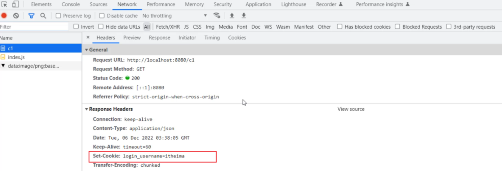

我们可以看到，设置的cookie，通过\*\*响应头Set\-Cookie\*\*响应给浏览器，并且浏览器会将Cookie，存储在浏览器端。

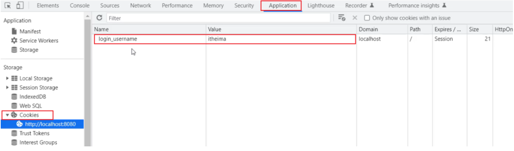


B\. 访问c2接口 `http://localhost:8080/c2`，此时浏览器会自动的将Cookie携带到服务端，是通过\*\*请求头Cookie\*\*，携带的。

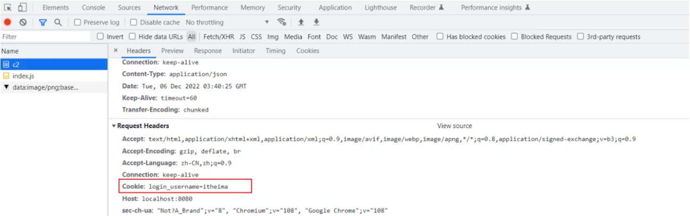

**优缺点：**

- 优点：HTTP协议中支持的技术（像Set\-Cookie 响应头的解析以及 Cookie 请求头数据的携带，都是浏览器自动进行的，是无需我们手动操作的）

- 缺点：

    - 移动端APP\(Android、IOS\)中无法使用Cookie

    - 不安全，用户可以自己禁用Cookie

    - Cookie不能跨域

> **跨域介绍：**
> 
> 
> 
> - 现在的项目，大部分都是前后端分离的，前后端最终也会分开部署，前端部署在服务器 192\.168\.150\.200 上，端口 80，后端部署在 192\.168\.150\.100上，端口 8080
> 
> - 我们打开浏览器直接访问前端工程，访问url：[http://192\.168\.150\.200/login\.html](http://192.168.150.200/login.html)
> 
> - 然后在该页面发起请求到服务端，而服务端所在地址不再是localhost，而是服务器的IP地址192\.168\.150\.100，假设访问接口地址为：[http://192\.168\.150\.100:8080/login](http://192.168.150.100:8080/login)
> 
> - 那此时就存在跨域操作了，因为我们是在 [http://192\.168\.150\.200/login\.html](http://192.168.150.200/login.html) 这个页面上访问了[http://192\.168\.150\.100:8080/login](http://192.168.150.100:8080/login) 接口
> 
> - 此时如果服务器设置了一个Cookie，这个Cookie是不能使用的，因为Cookie无法跨域
> 
> 
> 
> 区分跨域的维度（三个维度有任何一个维度不同，那就是跨域操作）：
> 
> - 协议
> 
> - IP/协议
> 
> - 端口
> 
> 
> 
> 举例：
> 
> - [http://192\.168\.150\.200/login\.html](http://192.168.150.200/login.html) \-\-\-\-\-\-\-\-\-\-\> [https://192\.168\.150\.200/login](https://192.168.150.200/login)                    \[协议不同，跨域\]
> 
> - [http://192\.168\.150\.200/login\.html](http://192.168.150.200/login.html) \-\-\-\-\-\-\-\-\-\-\> [http://192\.168\.150\.100/login](http://192.168.150.100/login)                     \[IP不同，跨域\]
> 
> - [http://192\.168\.150\.200/login\.html](http://192.168.150.200/login.html) \-\-\-\-\-\-\-\-\-\-\> [http://192\.168\.150\.200:8080/login](http://192.168.150.200:8080/login)             \[端口不同，跨域\]
> 
> - [http://192\.168\.150\.200/login\.html](http://192.168.150.200/login.html) \-\-\-\-\-\-\-\-\-\-\> [http://192\.168\.150\.200/login](http://192.168.150.200/login)                     \[不跨域\]   
> 
> 


### 方案二：Session

前面介绍的时候，我们提到Session，它是服务器端会话跟踪技术，所以它是存储在服务器端的。而 Session 的底层其实就是基于我们刚才所介绍的 Cookie 来实现的。


- 获取Session

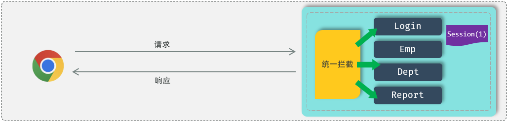

如果我们现在要基于 Session 来进行会话跟踪，浏览器在第一次请求服务器的时候，我们就可以直接在服务器当中来获取到会话对象Session。如果是第一次请求Session ，会话对象是不存在的，这个时候服务器会自动的创建一个会话对象Session 。而每一个会话对象Session ，它都有一个ID（示意图中Session后面括号中的1，就表示ID），我们称之为 Session 的ID。


- 响应Cookie \(JSESSIONID\)

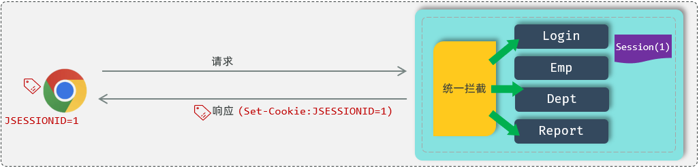

接下来，服务器端在给浏览器响应数据的时候，它会将 Session 的 ID 通过 Cookie 响应给浏览器。其实在响应头当中增加了一个 Set\-Cookie 响应头。这个  Set\-Cookie  响应头对应的值是不是cookie？ cookie 的名字是固定的 JSESSIONID 代表的服务器端会话对象 Session 的 ID。浏览器会自动识别这个响应头，然后自动将Cookie存储在浏览器本地。


- 查找Session

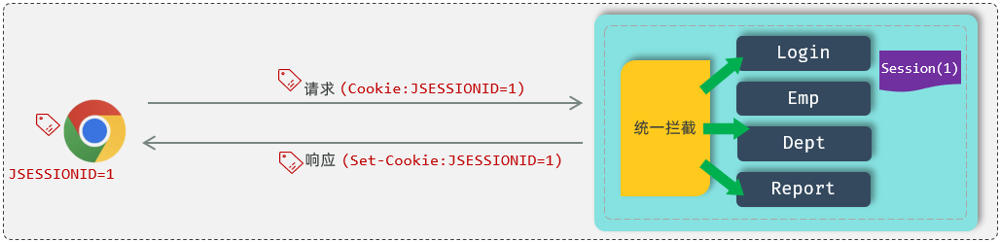

接下来，在后续的每一次请求当中，都会将 Cookie 的数据获取出来，并且携带到服务端。接下来服务器拿到JSESSIONID这个 Cookie 的值，也就是 Session 的ID。拿到 ID 之后，就会从众多的 Session 当中来找到当前请求对应的会话对象Session。

这样我们是不是就可以通过 Session 会话对象在同一次会话的多次请求之间来共享数据了？好，这就是基于 Session 进行会话跟踪的流程。


**代码测试**

```Java
@Slf4j
@RestController
public class SessionController {

    @GetMapping("/s1")
    public Result session1(HttpSession session){
        log.info("HttpSession-s1: {}", session.hashCode());

        session.setAttribute("loginUser", "tom"); //往session中存储数据
        return Result.success();
    }

    @GetMapping("/s2")
    public Result session2(HttpServletRequest request){
        HttpSession session = request.getSession();
        log.info("HttpSession-s2: {}", session.hashCode());

        Object loginUser = session.getAttribute("loginUser"); //从session中获取数据
        log.info("loginUser: {}", loginUser);
        return Result.success(loginUser);
    }
}
```


A\. 访问 s1 接口，`http://localhost:8080/s1`

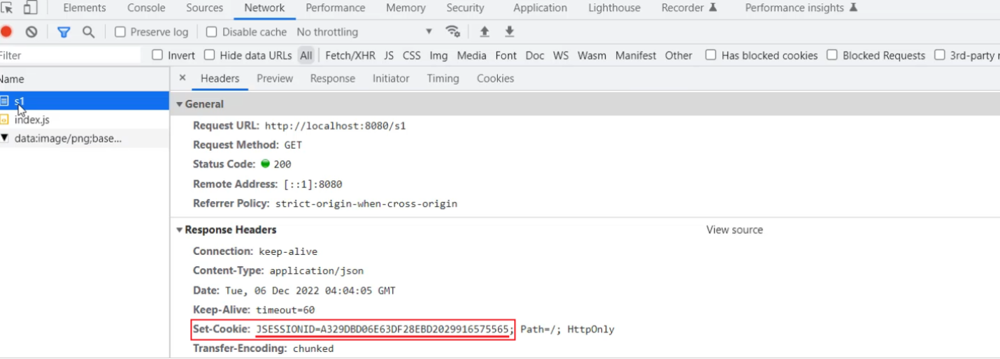

请求完成之后，在响应头中，就会看到有一个Set\-Cookie的响应头，里面响应回来了一个Cookie，就是JSESSIONID，这个就是服务端会话对象 Session 的ID。


B\. 访问 s2 接口，`http://localhost:8080/s2`

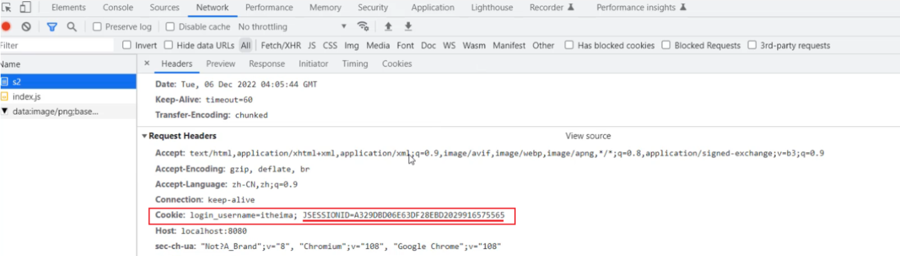

接下来，在后续的每次请求时，都会将Cookie的值，携带到服务端，那服务端呢，接收到Cookie之后，会自动的根据JSESSIONID的值，找到对应的会话对象Session。

那经过这两步测试，大家也会看到，在控制台中输出如下日志：


两次请求，获取到的Session会话对象的hashcode是一样的，就说明是同一个会话对象。而且，第一次请求时，往Session会话对象中存储的值，第二次请求时，也获取到了。 那这样，我们就可以通过Session会话对象，在同一个会话的多次请求之间来进行数据共享了。


**优缺点**

- 优点：Session是存储在服务端的，安全

- 缺点：

    - 服务器集群环境下无法直接使用Session

    - 移动端APP\(Android、IOS\)中无法使用Cookie

    - 用户可以自己禁用Cookie

    - Cookie不能跨域

PS：Session 底层是基于Cookie实现的会话跟踪，如果Cookie不可用，则该方案，也就失效了。


> **服务器集群环境为何无法使用Session？**
> 
> 
> 
> - 首先第一点，我们现在所开发的项目，一般都不会只部署在一台服务器上，因为一台服务器会存在一个很大的问题，就是单点故障。所谓单点故障，指的就是一旦这台服务器挂了，整个应用都没法访问了。
> 
> 
> 
> - 所以在现在的企业项目开发当中，最终部署的时候都是以集群的形式来进行部署，也就是同一个项目它会部署多份。比如这个项目我们现在就部署了 3 份。
> 
> - 而用户在访问的时候，到底访问这三台其中的哪一台？其实用户在访问的时候，他会访问一台前置的服务器，我们叫负载均衡服务器，我们在后面项目当中会详细讲解。目前大家先有一个印象负载均衡服务器，它的作用就是将前端发起的请求均匀的分发给后面的这三台服务器。
> 
> 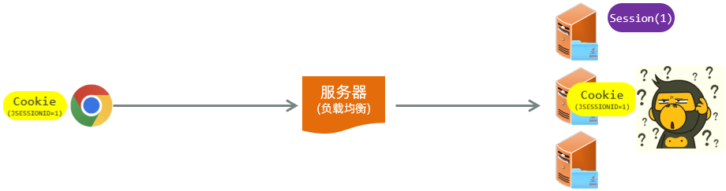
> 
> - 此时假如我们通过 session 来进行会话跟踪，可能就会存在这样一个问题。用户打开浏览器要进行登录操作，此时会发起登录请求。登录请求到达负载均衡服务器，将这个请求转给了第一台 Tomcat 服务器。
> 
> 
> 
> Tomcat 服务器接收到请求之后，要获取到会话对象session。获取到会话对象 session 之后，要给浏览器响应数据，最终在给浏览器响应数据的时候，就会携带这么一个 cookie 的名字，就是 JSESSIONID ，下一次再请求的时候，是不是又会将 Cookie 携带到服务端？
> 
> 
> 
> 好。此时假如又执行了一次查询操作，要查询部门的数据。这次请求到达负载均衡服务器之后，负载均衡服务器将这次请求转给了第二台 Tomcat 服务器，此时他就要到第二台 Tomcat 服务器当中。根据JSESSIONID 也就是对应的 session 的 ID 值，要找对应的 session 会话对象。
> 
> 
> 
> 我想请问在第二台服务器当中有没有这个ID的会话对象 Session， 是没有的。此时是不是就出现问题了？我同一个浏览器发起了 2 次请求，结果获取到的不是同一个会话对象，这就是Session这种会话跟踪方案它的缺点，在服务器集群环境下无法直接使用Session。
> 
> 


大家会看到上面这两种传统的会话技术，在现在的企业开发当中是不是会存在很多的问题。 为了解决这些问题，在现在的企业开发当中，基本上都会采用第三种方案，通过令牌技术来进行会话跟踪。接下来我们就来介绍一下令牌技术，来看一下令牌技术又是如何跟踪会话的。


### 方案三 \- 令牌技术

这里我们所提到的令牌，其实它就是一个用户身份的标识，看似很高大上，很神秘，其实本质就是一个字符串。


如果通过令牌技术来跟踪会话，我们就可以在浏览器发起请求。在请求登录接口的时候，如果登录成功，我就可以生成一个令牌，令牌就是用户的合法身份凭证。接下来我在响应数据的时候，我就可以直接将令牌响应给前端。

接下来我们在前端程序当中接收到令牌之后，就需要将这个令牌存储起来。这个存储可以存储在 cookie 当中，也可以存储在其他的存储空间\(比如：localStorage\)当中。

接下来，在后续的每一次请求当中，都需要将令牌携带到服务端。携带到服务端之后，接下来我们就需要来校验令牌的有效性。如果令牌是有效的，就说明用户已经执行了登录操作，如果令牌是无效的，就说明用户之前并未执行登录操作。

此时，如果是在同一次会话的多次请求之间，我们想共享数据，我们就可以将共享的数据存储在令牌当中就可以了。


**优缺点**

- 优点：

    - 支持PC端、移动端

    - 解决集群环境下的认证问题

    - 减轻服务器的存储压力（无需在服务器端存储）

- 缺点：需要自己实现（包括令牌的生成、令牌的传递、令牌的校验）


**针对于这三种方案，现在企业开发当中使用的最多的就是第三种令牌技术进行会话跟踪。而前面的这两种传统的方案，现在企业项目开发当中已经很少使用了。所以在我们的课程当中，我们也将会采用令牌技术来解决案例项目当中的会话跟踪问题。**


JWT令牌最典型的应用场景就是登录认证：

1. 在浏览器发起请求来执行登录操作，此时会访问登录的接口，如果登录成功之后，我们需要生成一个jwt令牌，将生成的 jwt令牌返回给前端。

2. 前端拿到jwt令牌之后，会将jwt令牌存储起来。在后续的每一次请求中都会将jwt令牌携带到服务端。

3. 服务端统一拦截请求之后，先来判断一下这次请求有没有把令牌带过来，如果没有带过来，直接拒绝访问，如果带过来了，还要校验一下令牌是否是有效。如果有效，就直接放行进行请求的处理。


在JWT登录认证的场景中我们发现，整个流程当中涉及到两步操作：

1. 在登录成功之后，要生成令牌。

2. 每一次请求当中，要接收令牌并对令牌进行校验。


稍后我们再来学习如何来生成jwt令牌，以及如何来校验jwt令牌。


