# 依赖管理

## 依赖配置

### 基本配置

依赖：指当前项目运行所需要的jar包。一个项目中可以引入多个依赖：

例如：在当前工程中，我们需要用到logback来记录日志，此时就可以在maven工程的pom\.xml文件中，引入logback的依赖。具体步骤如下：

1. 在pom\.xml中编写`<dependencies>`标签

2. 在`<dependencies>`标签中使用`<dependency>`引入坐标

3. 定义坐标的 `groupId`、`artifactId`、`version`

```XML
<dependencies>
    <!-- 依赖 : spring-context -->
    <dependency>
        <groupId>org.springframework</groupId>
        <artifactId>spring-context</artifactId>
        <version>6.1.4</version>
    </dependency>
</dependencies>
```

4. 点击刷新按钮，引入最新加入的坐标

刷新依赖：保证每一次引入新的依赖，或者修改现有的依赖配置，都可以加入最新的坐标

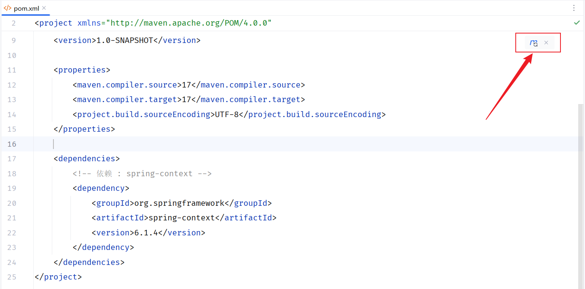


**注意事项：**

1. 如果引入的依赖，在本地仓库中不存在，将会连接远程仓库 / 中央仓库，然后下载依赖（这个过程会比较耗时，耐心等待）

2. 如果不知道依赖的坐标信息，可以到mvn的中央仓库（https://mvnrepository\.com/）中搜索


### **查找依赖**

1. 利用中央仓库搜索的依赖坐标，以常见的logback\-classic为例。

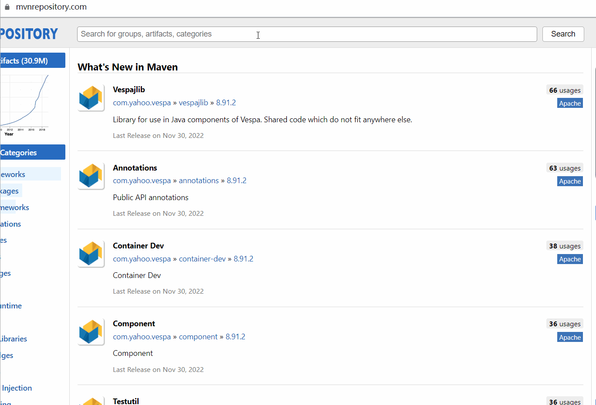


2. 利用IDEA工具搜索依赖，以常见的logback\-classic为例。


3. 熟练上手maven后，快速导入依赖，以常见的logback\-classic为例。

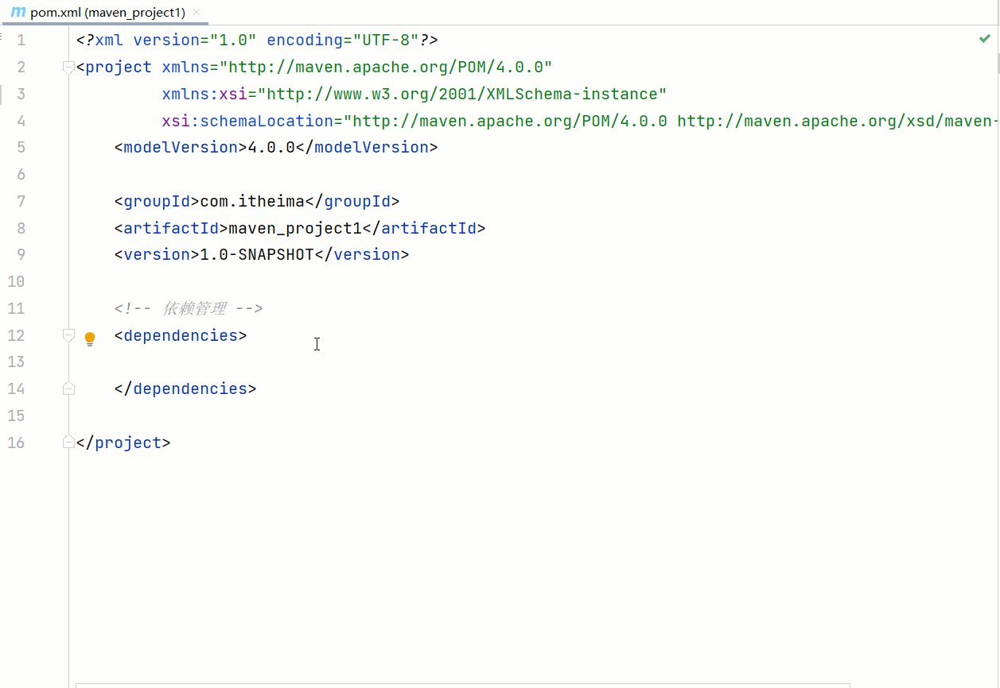


### 依赖传递

我们上面在pom\.xml中配置了一项依赖，就是spring\-context，但是我们通过右侧的maven面板可以看到，其实引入进来的依赖，并不是这一项，有非常多的依赖，都引入进来了。我们可以看到如下图所示：

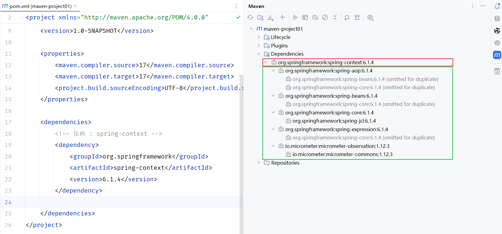

为什么会出现这样的现象呢? 那这里呢，就涉及到maven中非常重要的一个特性，那就是Maven中的**依赖传递**。

所谓maven的依赖传递，指的就是如果在maven项目中，A 依赖了B，B依赖了C，C依赖了D，那么在A项目中，也会有C、D依赖，因为依赖会传递。


那如果，传递下来的依赖，在项目开发中，我们确实不需要，此时，我们可以通过Maven中的排除依赖功能，来将这个依赖排除掉。


### 排除依赖

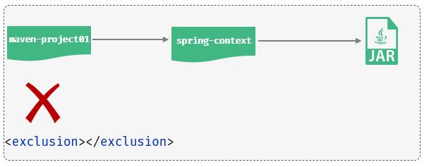

- 排除依赖：指主动断开依赖的资源，被排除的资源无需指定版本。

- 配置形式如下：

```XML
<dependency>
    <groupId>org.springframework</groupId>
    <artifactId>spring-context</artifactId>
    <version>6.1.4</version>

    <!--排除依赖, 主动断开依赖的资源-->
    <exclusions>
        <exclusion>
            <groupId>io.micrometer</groupId>
            <artifactId>micrometer-observation</artifactId>
        </exclusion>
    </exclusions>
</dependency>
```


**依赖排除示例：**

1. 默认通过maven的依赖传递，传递下来了 `micrometer-observation` 的依赖。

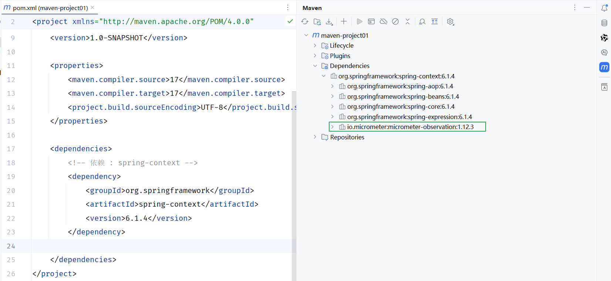


2. 加入排除依赖的配置之后，该依赖就被排除掉了。

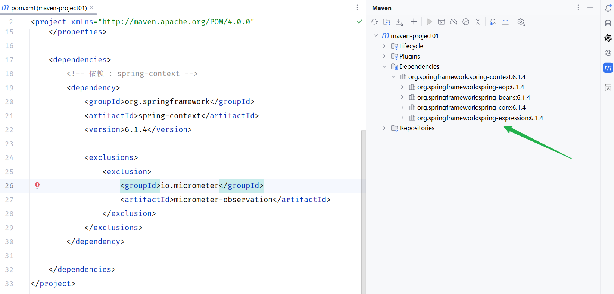


## 生命周期

### 介绍

Maven的生命周期就是为了对所有的构建过程进行抽象和统一。 描述了一次项目构建，经历哪些阶段。


在Maven出现之前，项目构建的生命周期就已经存在，软件开发人员每天都在对项目进行清理，编译，测试及部署。虽然大家都在不停地做构建工作，但公司和公司间、项目和项目间，往往使用不同的方式做类似的工作。


Maven从大量项目和构建工具中学习和反思，然后总结了一套高度完美的，易扩展的项目构建生命周期。这个生命周期包含了项目的清理，初始化，编译，测试，打包，集成测试，验证，部署和站点生成等几乎所有构建步骤。


Maven对项目构建的生命周期划分为3套（相互独立）：

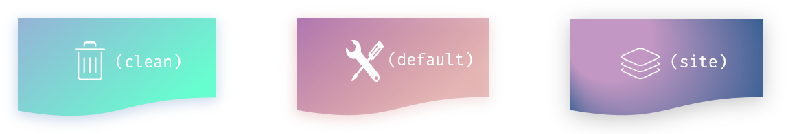

- clean：清理工作。

- default：核心工作。如：编译、测试、打包、安装、部署等。

- site：生成报告、发布站点等。


三套生命周期又包含哪些具体的阶段呢, 我们来看下面这幅图:

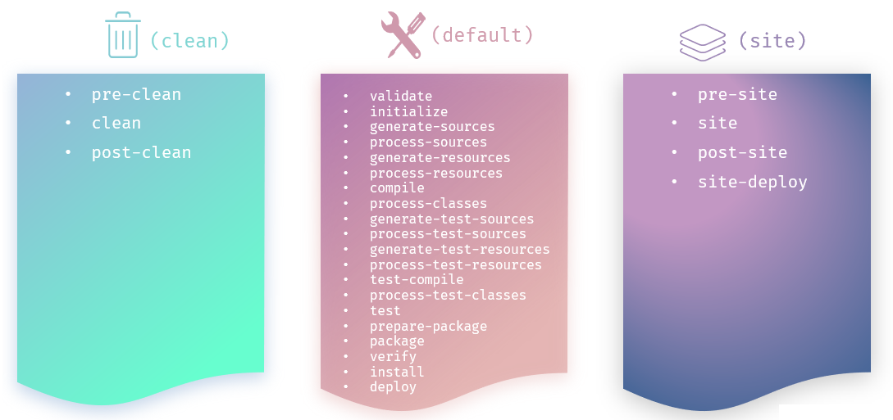


每套生命周期包含一些阶段（phase），阶段是有顺序的，后面的阶段依赖于前面的阶段。

我们看到这三套生命周期，里面有很多很多的阶段，这么多生命周期阶段，其实我们常用的并不多，主要关注以下几个：

- clean：移除上一次构建生成的文件

- compile：编译项目源代码

- test：使用合适的单元测试框架运行测试\(junit\)

- package：将编译后的文件打包，如：jar、war等

- install：安装项目到本地仓库


Maven的生命周期是抽象的，这意味着生命周期本身不做任何实际工作。**在Maven的设计中，实际任务（如源代码编译）都交由****插件****来完成。**


IDEA工具为了方便程序员使用maven生命周期，在右侧的maven工具栏中，已给出快速访问通道。


- 生命周期的顺序是：`clean` \-\-\> `validate` \-\-\> `compile` \-\-\> `test` \-\-\> `package` \-\-\> `verify` \-\-\> `install` \-\-\> `site` \-\-\> `deploy`

- 我们需要关注的就是：`clean` \-\-\>  `compile` \-\-\> `test` \-\-\> `package`  \-\-\> `install`

**说明：**在同一套生命周期中，我们在执行后面的生命周期时，前面的生命周期都会执行。

**思考：**当运行package生命周期时，clean、compile生命周期会不会运行？

clean不会运行，compile会运行。  因为compile与package属于同一套生命周期，而clean与package不属于同一套生命周期。


### 执行

在日常开发中，当我们要执行指定的生命周期时，有两种执行方式：

1. 在idea工具右侧的maven工具栏中，选择对应的生命周期，双击执行

2. 在DOS命令行中，通过maven命令执行


**方式一：在idea中执行生命周期**

- 选择对应的生命周期，双击执行

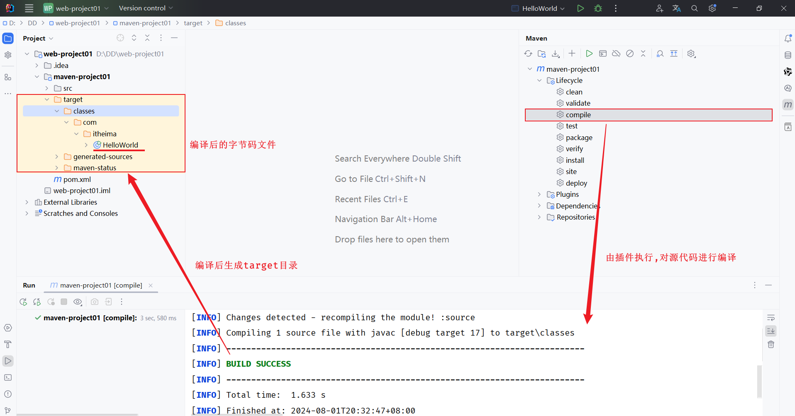

其他的生命周期都是类似的道理，双击运行即可。


**方式二：在命令行中执行生命周期**

1. 打开maven项目对应的磁盘目录

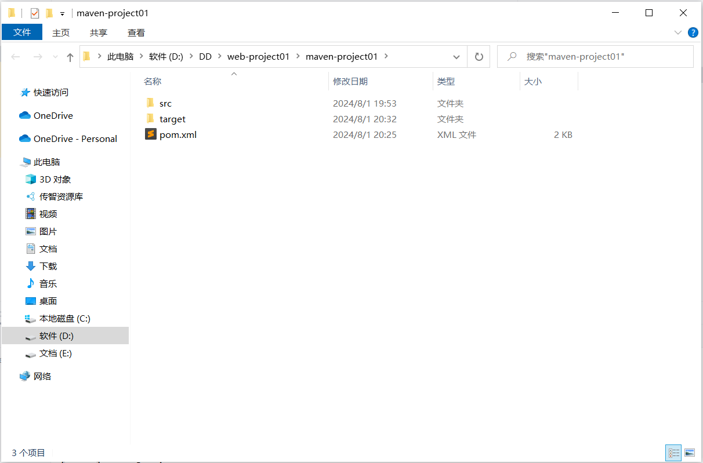


2. 在当前目录下打开CMD

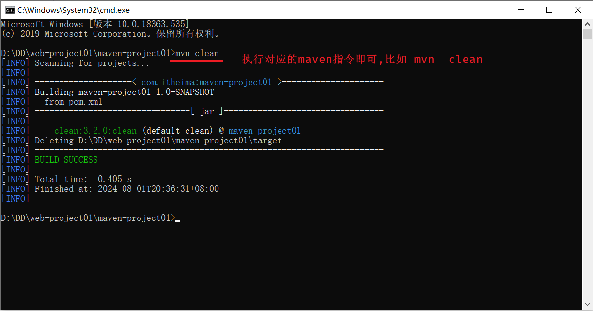

类似的道理，我们也可以在命令执行：

- mvn compile

- mvn test

- mvn package

- mvn install    


