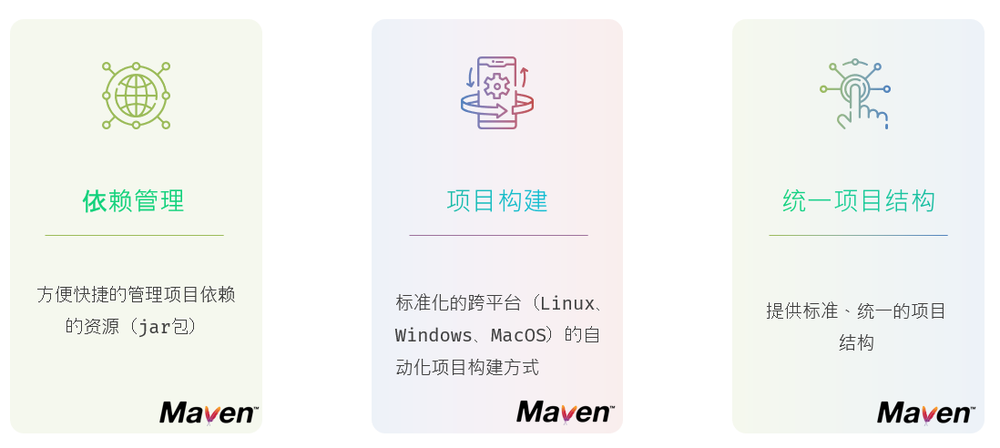
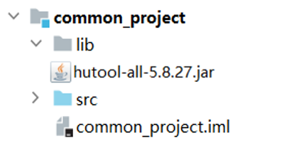
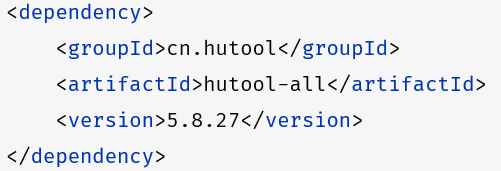
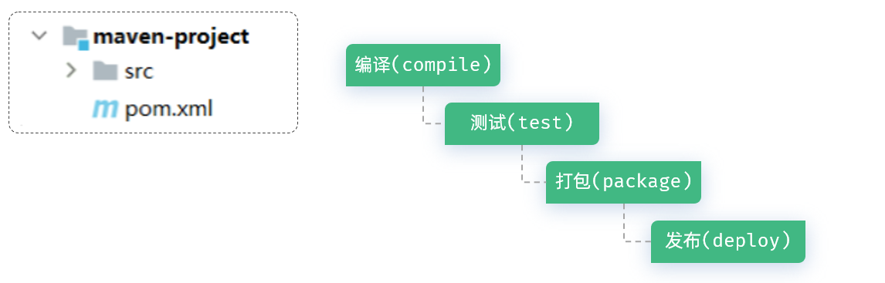
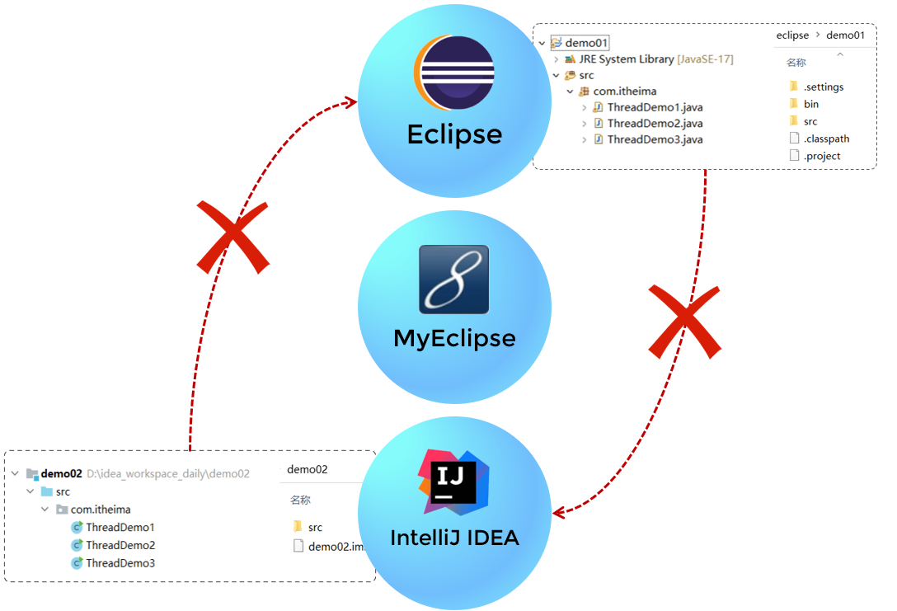
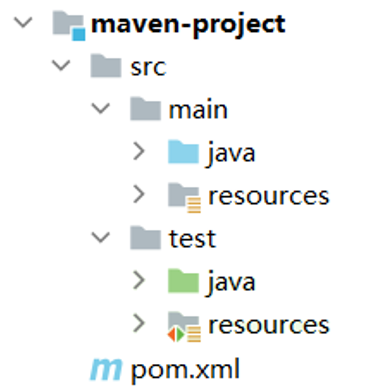

# 初识Maven

## 介绍

Maven 是一款用于管理和构建Java项目的工具，是Apache旗下的一个开源项目 。

> Apache 软件基金会，成立于1999年7月，是目前世界上最大的最受欢迎的开源软件基金会，也是一个专门为支持开源项目而生的非盈利性组织。
>
> 开源项目：https://www\.apache\.org/index\.html\#projects\-list

那我们之前在JavaSE阶段，没有使用Maven，依然可以构建Java项目。 我们为什么现在还要学习Maven呢 ? 那接下来，我们就来聊聊Maven的作用。

## Maven的作用

### 依赖管理

方便快捷的管理项目依赖的资源\(jar包\)，避免版本冲突问题。

**1\)\. 使用maven前**

我们项目中要想使用某一个jar包，就需要把这个jar包从官方网站下载下来，然后再导入到项目中。然后在这个项目中，就可以使用这个jar包了。

**2\)\. 使用maven后**

当使用maven进行项目依赖\(jar包\)管理，则很方便的可以解决这个问题。 我们只需要在maven项目的pom\.xml文件中，添加一段如下图所示的配置即可实现。

在maven项目的配置文件中，加入上面这么一段配置信息之后，maven会自动的根据配置信息的描述，去下载对应的依赖。 然后在项目中，就可以直接使用了。

### 项目构建

Maven还提供了标准化的跨平台的自动化构建方式。

如上图所示我们开发了一套系统，代码需要进行编译、测试、打包、发布等过程，这些操作是所有项目中都需要做的，如果需要反复进行就显得特别麻烦，而Maven提供了一套简单的命令来完成项目构建。

通过Maven中的命令，就可以很方便的完成项目的编译\(compile\)、测试\(test\)、打包\(package\)、发布\(deploy\) 等操作。

而且这些操作都是跨平台的，也就是说无论你是Windows系统，还是Linux系统，还是Mac系统，这些命令都是支持的。

### 统一项目结构

Maven 还提供了标准、统一的项目结构 。

**1\)\. 未使用Maven**

由于java的开发工具呢，有很多，除了大家熟悉的IDEA以外，还有像早期的Eclipse、MyEclipse。而不同的开发工具，创建出来的java项目的目录结构是存在差异的，那这就会出现一个问题。

Eclipse创建的java项目，并不能直接导入IDEA中。 IDEA创建的java项目，也没有办法直接导入到Eclipse中。

**2\)\. 使用Maven**

而如果我们使用了Maven这一款项目构建工具，它给我们提供了一套标准的java项目目录。如下所示：

也就意味着，无论我们使用的是什么开发工具，只要是基于maven构建的java项目，最终的目录结构都是相同的，如图所示。 那这样呢，我们使用Eclipse、MyEclipse、IDEA创建的maven项目，就可以在各个开发工具直接直接导入使用了，更加方便、快捷。

而在上面的maven项目的目录结构中，main目录下存放的是项目的源代码，test目录下存放的是项目的测试代码。 而无论是在main还是在test下，都有两个目录，一个是java，用来存放源代码文件；另一个是resources，用来存放配置文件。

最后呢，一句话总结一下什么是Maven。 **Maven就是一款管理和构建java项目的工具。**

Maven的内容，我们进行了分层的设计和讲解，分为两个部分：Maven核心和Maven进阶。 那今天，我们先来讲解Maven核心部分的内容，在Web开发的最后，我们再来讲解Maven进阶部分的内容。
