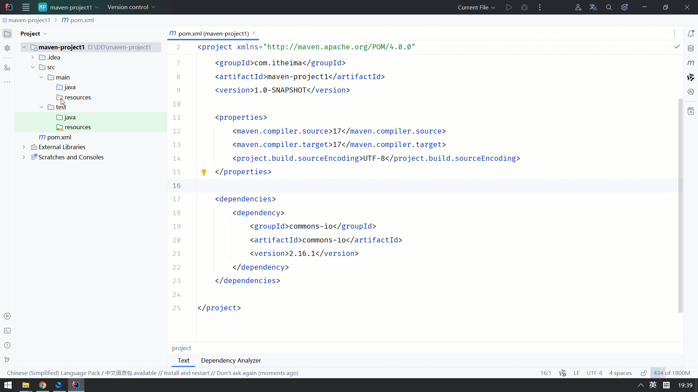
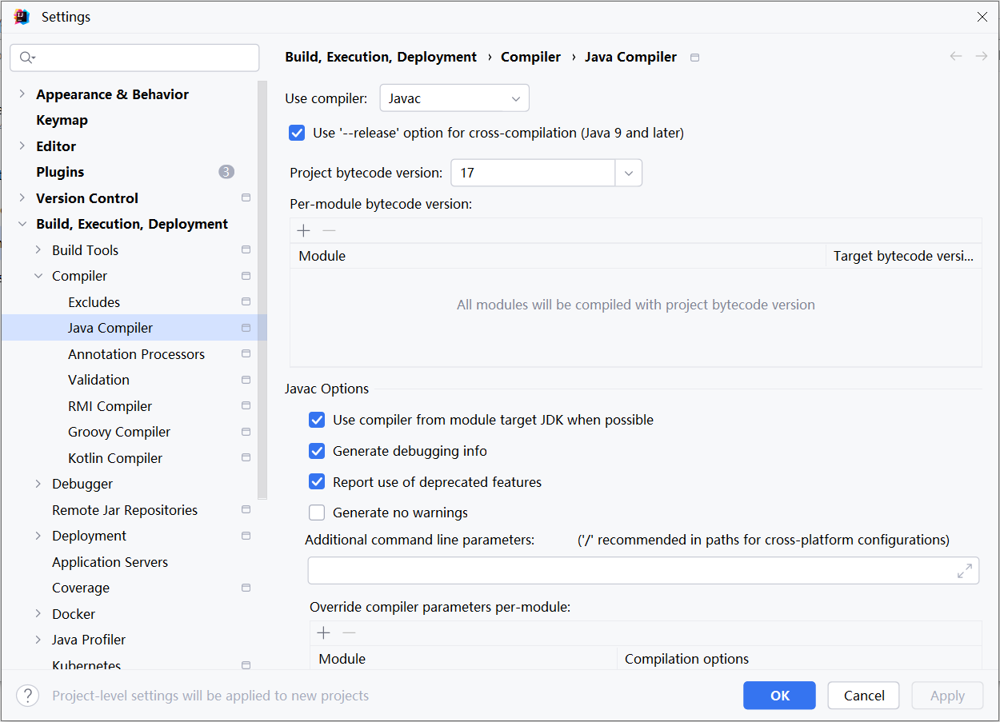
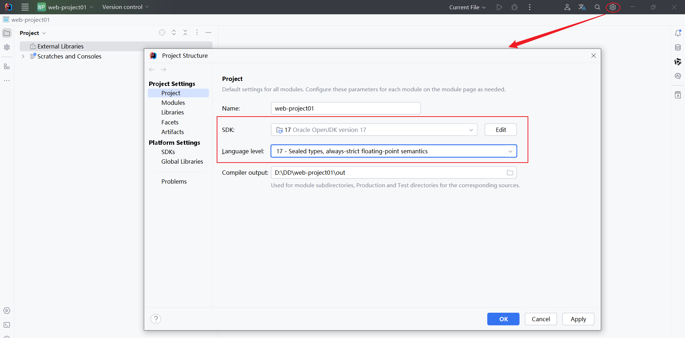
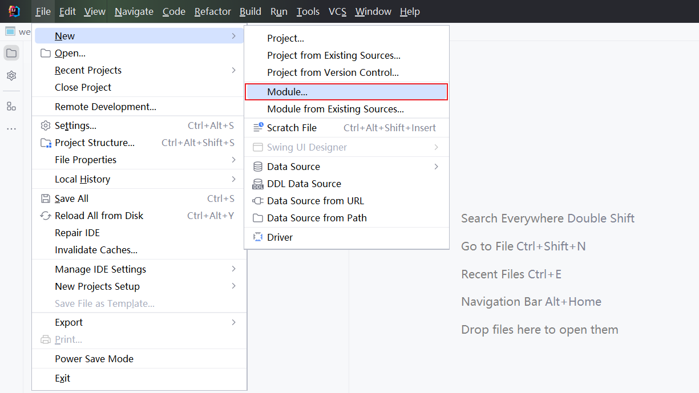
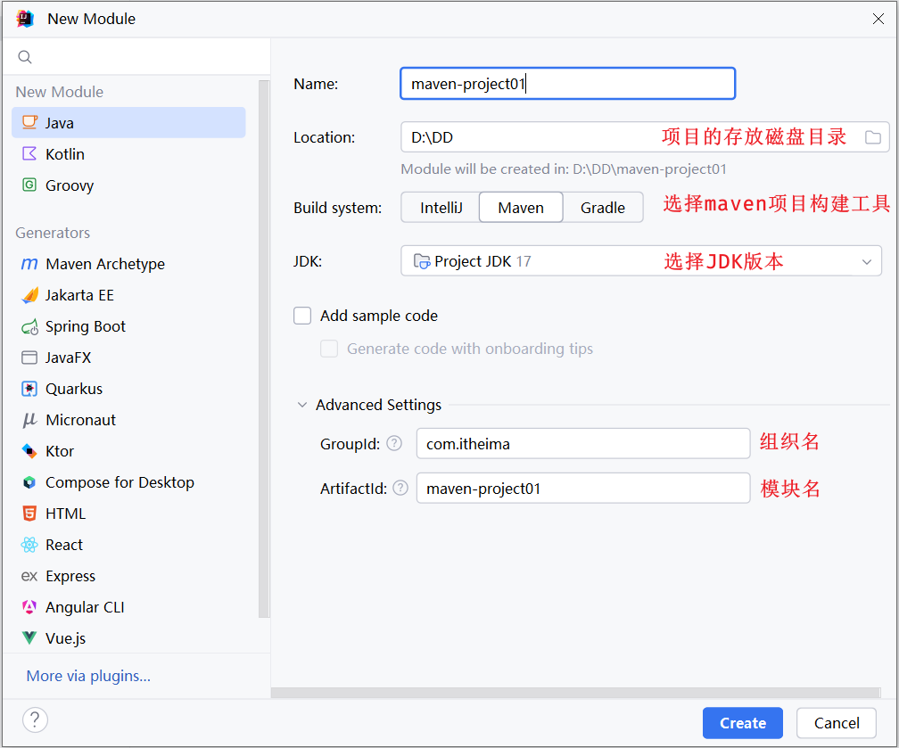
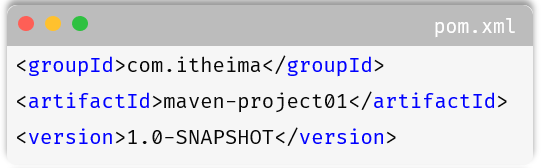
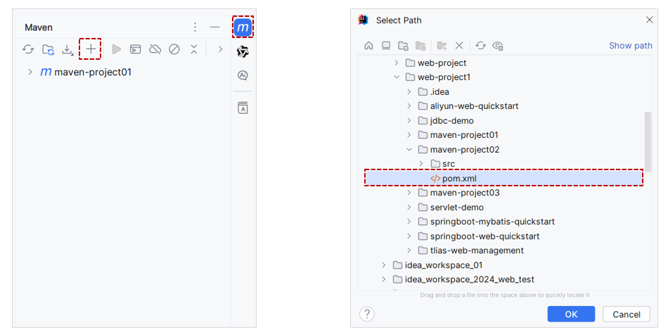

# IDEA集成Maven

我们要想在IDEA中使用Maven进行项目构建，就需要在IDEA中集成Maven，那么就需要在IDEA中配置与maven的关联。

## 创建Maven项目

### 全局设置

1. 进入IDEA的欢迎页面

    选择 IDEA中 File  =\>  `close project` =\> `Customize` =\> `All settings`




2. 打开 All settings , 选择 `Build,Execution,Deployment`  =\>  `Build Tools`  =\>  `Maven`


3. 配置工程的编译版本为17



这里所设置的maven的环境信息，并未指定任何一个project，此时设置的信息就属于全局配置信息。 以后，我们再创建project，默认就是使用我们全局配置的信息。


### 创建项目

1. 创建一个空项目，命名为 web\-project01


2. 创建好项目之后，进入项目中，要设置JDK的版本号。选择小齿轮，选择 **`Project Structure`**




3. 创建模块，选择Java语言，选择Maven。 填写模块的基本信息






4. 在maven项目中，创建HelloWorld类，并运行


**Maven项目的目录结构:**

**maven\-project01**

 \|\-\-\-  src  \(源代码目录和测试代码目录\)

\|\-\-\-  main \(源代码目录\)

\|\-\-\- java \(源代码java文件目录\)

\|\-\-\- resources \(源代码配置文件目录\)

\|\-\-\-  test \(测试代码目录\)

\|\-\-\- java \(测试代码java目录\)

\|\-\-\- resources \(测试代码配置文件目录\)

 \|\-\-\- target \(编译、打包生成文件存放目录\)


### pom文件详解

POM \(Project Object Model\) ：指的是项目对象模型，用来描述当前的maven项目。

- 使用pom\.xml文件来描述当前项目。 pom\.xml文件如下：

```XML
*<?*xml version="1.0" encoding="UTF-8"*?>*
<project xmlns="http://maven.apache.org/POM/4.0.0"
         xmlns:xsi="http://www.w3.org/2001/XMLSchema-instance"
         xsi:schemaLocation="http://maven.apache.org/POM/4.0.0 http://maven.apache.org/xsd/maven-4.0.0.xsd">
    <!-- POM模型版本 -->
    <modelVersion>4.0.0</modelVersion>

    <!-- 当前项目坐标 -->
    <groupId>com.itheima</groupId>
    <artifactId>maven-project01</artifactId>
    <version>1.0-SNAPSHOT</version>
    
    <!-- 项目的JDK版本及编码 -->
    <properties>
        <maven.compiler.source>17</maven.compiler.source>
        <maven.compiler.target>17</maven.compiler.target>
        <project.build.sourceEncoding>UTF-8</project.build.sourceEncoding>
    </properties>

</project>
```

**pom文件详解：**

- `<project>`` `：pom文件的根标签，表示当前maven项目

- `<modelVersion>`：声明项目描述遵循哪一个POM模型版本

    - 虽然模型本身的版本很少改变，但它仍然是必不可少的。目前POM模型版本是4\.0\.0

- 坐标 ：

    - `<groupId>` `<artifactId>` `<version>`

    - 定位项目在本地仓库中的位置，由以上三个标签组成一个坐标

- `<maven.compiler.source>` ：编译JDK的版本

- `<maven.compiler.target>` ：运行JDK的版本

- `<project.build.sourceEncoding>` : 设置项目的字符集


## Maven坐标

什么是坐标？

- Maven中的坐标是**资源****的唯一标识** , 通过该坐标可以唯一定位资源位置

- 使用坐标来定义项目或引入项目中需要的依赖


Maven坐标主要组成：

- groupId：定义当前Maven项目隶属组织名称（通常是域名反写，例如：com\.itheima）

- artifactId：定义当前Maven项目名称（通常是模块名称，例如 order\-service、goods\-service）

- version：定义当前项目版本号

    - SNAPSHOT: 功能不稳定、尚处于开发中的版本，即快照版本

    - RELEASE: 功能趋于稳定、当前更新停止，可以用于发行的版本


如下图就是使用坐标表示一个项目：




> **注意：**
> 
> - 上面所说的资源可以是插件、依赖、当前项目。
> 
> - 我们的项目如果被其他的项目依赖时，也是需要坐标来引入的。
> 
> 


## 导入Maven项目

在IDEA中导入Maven项目，有两种方式。

- 方式一：`File` \-\> `Project Structure` \-\> `Modules` \-\> `Import Module` \-\> `选择maven项目的pom.xml`。


- 方式二：`Maven面板` \-\> `+（Add Maven Projects）` \-\> `选择maven项目的pom.xml`。




