# 继承与聚合

在案例项目分模块开发之后啊，我们会看到 `tlias-pojo`、`tlias-utils`、`tlias-web-management` 中都引入了一个依赖 `lombok` 的依赖。我们在三个模块中分别配置了一次。

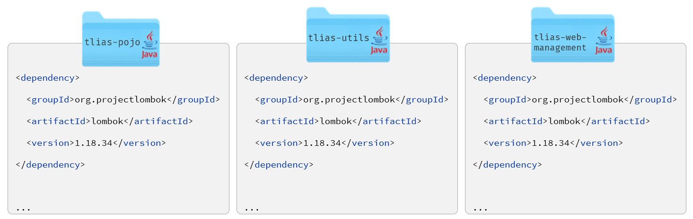

如果是做一个大型的项目，这三个模块当中重复的依赖可能会很多很多。如果每一个 Maven 模块里面，我们都来单独的配置一次，功能虽然能实现，但是配置是比较 **繁琐** 的 。


而接下来我们要讲解的 Maven 的继承用来解决这问题的。

## 继承

我们可以再创建一个父工程 tlias\-parent ，然后让上述的三个模块 tlias\-pojo、tlias\-utils、tlias\-web\-management 都来继承这个父工程 。 然后再将各个模块中都共有的依赖，都提取到父工程 tlias\-parent中进行配置，只要子工程继承了父工程，依赖它也会继承下来，这样就无需在各个子工程中进行配置了。

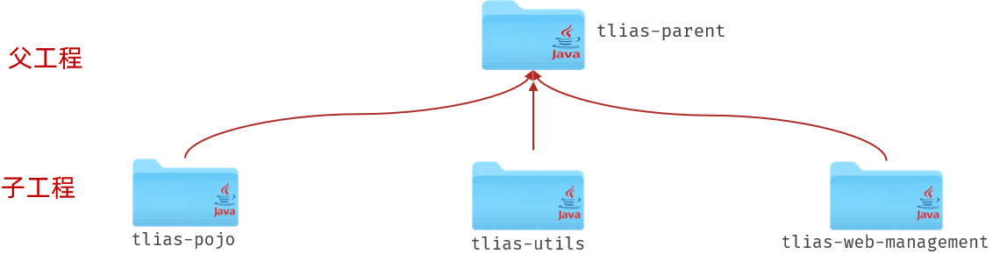

- 概念：继承描述的是两个工程间的关系，与java中的继承相似，子工程可以继承父工程中的配置信息，常见于依赖关系的继承。

- 作用：简化依赖配置、统一管理依赖

- 实现：

```XML
<parent>
    <groupId>...</groupId>
    <artifactId>...</artifactId>
    <version>...</version>
    <relativePath>....</relativePath>
</parent>
```

这是我们在这里先介绍一下什么是继承以及继承的作用，以及在 maven 当中如何来实现这层继承关系。接下来我们就来创建这样一个 parent 父工程，我们就可以将各个子工程当中共有的这部分依赖统一的定义在父工程 parent 当中，从而来简化子工程的依赖配置。接下来我们来看一下具体的操作步骤。


我们在这里先介绍一下什么是继承以及继承的作用，以及在 maven 当中如何来实现这层继承关系。接下来我们就来创建这样一个 parent 父工程，我们就可以将各个子工程当中共有的这部分依赖，统一的定义在父工程 parent 当中，从而来简化子工程的依赖配置。


### 继承关系

#### 思路分析

我们当前的项目 `tlias-web-management`，还稍微有一点特殊，因为是一个springboot项目，而所有的springboot项目都有一个统一的父工程，就是 `spring-boot-starter-parent`。 与java语言类似，Maven不支持多继承，一个maven项目只能继承一个父工程，如果继承了`spring-boot-starter-parent`，就没法继承我们自己定义的父工程 `tlias-parent`了。


那我们怎么来解决这个问题呢？

那此时，大家可以想一下，Java虽然不支持多继承，但是可以支持多重继承，比如：A 继承 B， B 继承C。 那在Maven中也是支持多重继承的，所以呢，我们就可以让 我们自己创建的三个模块，都继承 `tlias-parent`，而 `tlias-parent` 再继承 `spring-boot-starter-parent`，就可以了。 具体结构如下：

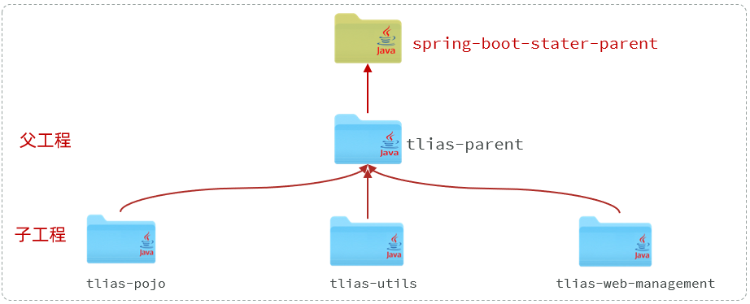


#### 实现

**1\)\. 创建maven模块 ****`tlias-parent`**** ，该工程为父工程，设置****打包方式pom\(默认jar\)****。**

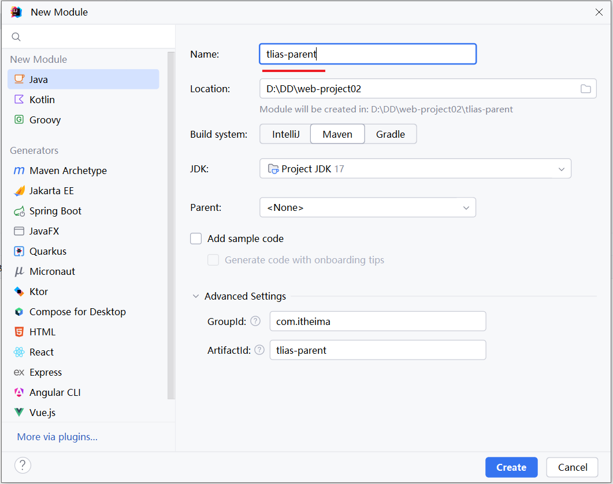

工程结构如下（src目录不需要，直接删除）：

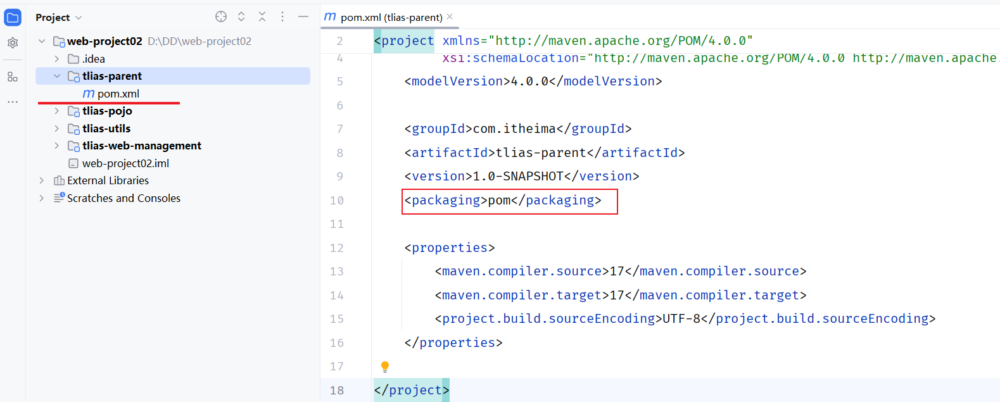


父工程`tlias-parent`的 `pom.xml` 文件配置如下：

```XML
*<?*xml version="1.0" encoding="UTF-8"*?>*
<project xmlns="http://maven.apache.org/POM/4.0.0"
         xmlns:xsi="http://www.w3.org/2001/XMLSchema-instance"
         xsi:schemaLocation="http://maven.apache.org/POM/4.0.0 http://maven.apache.org/xsd/maven-4.0.0.xsd">
    <modelVersion>4.0.0</modelVersion>

    <parent>
        <groupId>org.springframework.boot</groupId>
        <artifactId>spring-boot-starter-parent</artifactId>
        <version>3.2.8</version>
        <relativePath/> <!-- lookup parent from repository -->
    </parent>

    <groupId>com.itheima</groupId>
    <artifactId>tlias-parent</artifactId>
    <version>1.0-SNAPSHOT</version>
    <packaging>pom</packaging>

    <properties>
        <maven.compiler.source>17</maven.compiler.source>
        <maven.compiler.target>17</maven.compiler.target>
        <project.build.sourceEncoding>UTF-8</project.build.sourceEncoding>
    </properties>

</project>
```


**Maven打包方式：**

- jar：普通模块打包，springboot项目基本都是jar包（内嵌tomcat运行）

- war：普通web程序打包，需要部署在外部的tomcat服务器中运行

- pom：父工程或聚合工程，该模块不写代码，仅进行依赖管理


**2\)\. 在子工程（****`tlias-pojo`****、****`tlias-utils`****、****`tlias-web-management`****）的pom\.xml文件中，配置继承关系。**

```XML
<parent>
    <groupId>com.itheima</groupId>
    <artifactId>tlias-parent</artifactId>
    <version>1.0-SNAPSHOT</version>
    <relativePath>../tlias-parent/pom.xml</relativePath>
</parent>

<artifactId>tlias-utils</artifactId>
<version>1.0-SNAPSHOT</version>
```

这里是以 `tlias-utils` 为例，指定了其父工程。其他的模块，都是相同的配置方式。


**注意：**

- 在子工程中，配置了继承关系之后，坐标中的groupId是可以省略的，因为会自动继承父工程的 。

- relativePath指定父工程的pom文件的相对位置（如果不指定，将从本地仓库/远程仓库查找该工程）。

    - \.\./ 代表的上一级目录


**3\)\. 在父工程中配置各个工程共有的依赖（子工程会自动继承父工程的依赖）。**

```XML
*<?*xml version="1.0" encoding="UTF-8"*?>*
<project xmlns="http://maven.apache.org/POM/4.0.0"
         xmlns:xsi="http://www.w3.org/2001/XMLSchema-instance"
         xsi:schemaLocation="http://maven.apache.org/POM/4.0.0 http://maven.apache.org/xsd/maven-4.0.0.xsd">
    <modelVersion>4.0.0</modelVersion>

    <parent>
        <groupId>org.springframework.boot</groupId>
        <artifactId>spring-boot-starter-parent</artifactId>
        <version>3.2.8</version>
        <relativePath/> <!-- lookup parent from repository -->
    </parent>

    <groupId>com.itheima</groupId>
    <artifactId>tlias-parent</artifactId>
    <version>1.0-SNAPSHOT</version>
    <packaging>pom</packaging>

    <properties>
        <maven.compiler.source>17</maven.compiler.source>
        <maven.compiler.target>17</maven.compiler.target>
        <project.build.sourceEncoding>UTF-8</project.build.sourceEncoding>
    </properties>

    <dependencies>
        <dependency>
            <groupId>org.springframework.boot</groupId>
            <artifactId>spring-boot-starter</artifactId>
            <version>3.2.8</version>
        </dependency>

        <dependency>
            <groupId>org.projectlombok</groupId>
            <artifactId>lombok</artifactId>
            <version>1.18.34</version>
        </dependency>
    </dependencies>

</project>
```

此时，我们已经将各个子工程中共有的依赖（`lombok` 和 `spring-boot-starter`），都定义在了父工程中，子工程中的这一项依赖，就可以直接删除了。删除之后，我们会看到父工程中配置的依赖 lombok，子工程直接继承下来了。

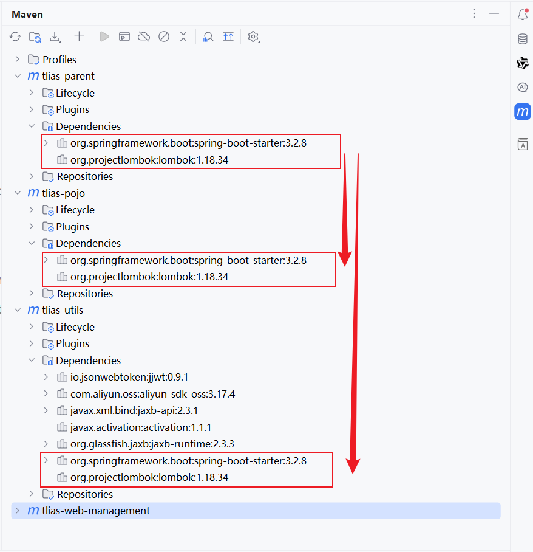


**工程结构说明:**

- 我们当前的项目结构为：

    - `tlias-parent`

    - `tlias-pojo`

    - `tlias-utils`

    - `tlias-web-management`

因为我们是项目开发完毕之后，给大家基于现有项目拆分的各个模块，`tlias-web-management` 已经存在了，然后再创建各个模块与父工程，所以父工程与模块之间是平级的。

**工程结构说明:**

- 而实际项目中，可能还会见到下面的工程结构：

    - `tlias-parent`

        - `tlias-pojo`

        - `tlias-utils`

        - `tlias-web-management`

而在真实的企业开发中，都是先设计好模块之后，再开始创建模块，开发项目。 那此时呢，一般都会先创建父工程 tlias\-parent，然后将创建的各个子模块，都放在父工程parent下面。 这样层级结构会更加清晰一些。 

**PS：上面两种工程结构，都是可以正常使用的，没有一点问题。 只不过，第二种结构，看起来，父子工程结构更加清晰、更加直观。**


### 版本锁定

#### 场景

如果项目中各个模块中都公共的这部分依赖，我们可以直接定义在父工程中，从而简化子工程的配置。 然而在项目开发中，还有一部分依赖，并不是各个模块都共有的，可能只是其中的一小部分模块中使用到了这个依赖。


比如：在tlias\-web\-management、tlias\-web\-system、tlias\-web\-report这三个子工程中，都使用到了jwt的依赖。 但是 tlias\-pojo、tlias\-utils中并不需要这个依赖，那此时，这个依赖，我们不会直接配置在父工程 tlias\-parent中，而是哪个模块需要，就在哪个模块中配置。


而由于是一个项目中的多个模块，那多个模块中，我们要使用的同一个依赖的版本要一致，这样便于项目依赖的统一管理。比如：这个jwt依赖，我们都使用的是 0\.9\.1 这个版本。

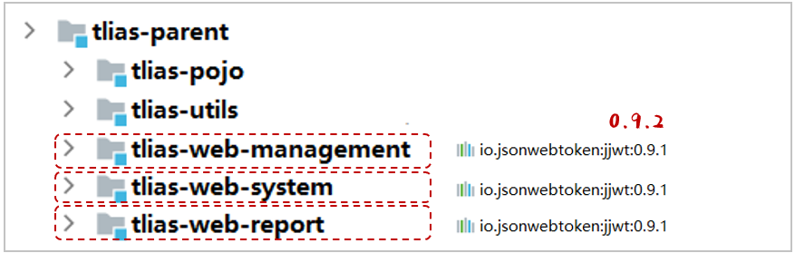

那假如说，我们项目要升级，要使用到jwt最新版本 0\.9\.2 中的一个新功能，那此时需要将依赖的版本升级到0\.9\.2，那此时该怎么做呢 ？

第一步：去找当前项目中所有的模块的pom\.xml配置文件，看哪些模块用到了jwt的依赖。

第二步：找到这个依赖之后，将其版本version，更换为 0\.9\.2。


**问题：如果项目拆分的模块比较多，每一次更换版本，我们都得找到这个项目中的每一个模块，一个一个的更改。 很容易就会出现，遗漏掉一个模块，忘记更换版本的情况。**


那我们又该如何来解决这个问题，如何来统一管理各个依赖的版本呢？ 

答案：Maven的版本锁定功能。


#### 介绍

在maven中，可以在父工程的pom文件中通过 `<dependencyManagement>` 来统一管理依赖版本。

- 父工程：

```XML
<!--统一管理依赖版本-->
<dependencyManagement>
    <dependencies>
        <!--JWT令牌-->
        <dependency>
            <groupId>io.jsonwebtoken</groupId>
            <artifactId>jjwt</artifactId>
            <version>0.9.1</version>
        </dependency>
    </dependencies>
</dependencyManagement>
```


- 子工程：

```XML
<dependencies>
    <!--JWT令牌-->
    <dependency>
        <groupId>io.jsonwebtoken</groupId>
        <artifactId>jjwt</artifactId>
    </dependency>
</dependencies>
```


**注意：**

- 在父工程中所配置的 `<dependencyManagement>` 只能统一管理依赖版本，并不会将这个依赖直接引入进来。 这点和 `<dependencies>` 是不同的。

- 子工程要使用这个依赖，还是需要引入的，只是此时就无需指定 `<version>` 版本号了，父工程统一管理。变更依赖版本，只需在父工程中统一变更。


#### 实现

接下来，我们就可以将 `tlias-utils` 模块中单独配置的依赖，将其版本统一交给 `tlias-parent` 进行统一管理。

具体步骤如下：

**1\)\. ****`tlias-parent`**** 中的配置**

```XML
<dependencyManagement>
    <dependencies>
        <!-- JWT依赖-->
        <dependency>
            <groupId>io.jsonwebtoken</groupId>
            <artifactId>jjwt</artifactId>
            <version>0.9.1</version>
        </dependency>

        <dependency>
            <groupId>com.aliyun.oss</groupId>
            <artifactId>aliyun-sdk-oss</artifactId>
            <version>3.17.4</version>
        </dependency>
        <dependency>
            <groupId>javax.xml.bind</groupId>
            <artifactId>jaxb-api</artifactId>
            <version>2.3.1</version>
        </dependency>
        <dependency>
            <groupId>javax.activation</groupId>
            <artifactId>activation</artifactId>
            <version>1.1.1</version>
        </dependency>
        <!-- no more than 2.3.3-->
        <dependency>
            <groupId>org.glassfish.jaxb</groupId>
            <artifactId>jaxb-runtime</artifactId>
            <version>2.3.3</version>
        </dependency>
    </dependencies>
</dependencyManagement>
```


2\)\. `tlias-utils` 中的pom\.xml配置

如果依赖的版本已经在父工程进行了统一管理，所以在子工程中就无需再配置依赖的版本了。

```XML
<dependencies>
    <!-- JWT依赖-->
    <dependency>
        <groupId>io.jsonwebtoken</groupId>
        <artifactId>jjwt</artifactId>
    </dependency>

    <dependency>
        <groupId>com.aliyun.oss</groupId>
        <artifactId>aliyun-sdk-oss</artifactId>
    </dependency>
    <dependency>
        <groupId>javax.xml.bind</groupId>
        <artifactId>jaxb-api</artifactId>
    </dependency>
    <dependency>
        <groupId>javax.activation</groupId>
        <artifactId>activation</artifactId>
    </dependency>
    <!-- no more than 2.3.3-->
    <dependency>
        <groupId>org.glassfish.jaxb</groupId>
        <artifactId>jaxb-runtime</artifactId>
    </dependency>
</dependencies>
```


我们之所以，在springboot项目中很多时候，引入依赖坐标，都不需要指定依赖的版本 `<version>` ，是因为在父工程 spring\-boot\-starter\-parent中已经通过 `<dependencyManagement>`对依赖的版本进行了统一的管理维护。


#### 属性配置

我们也可以通过自定义属性及属性引用的形式，在父工程中将依赖的版本号进行集中管理维护。 

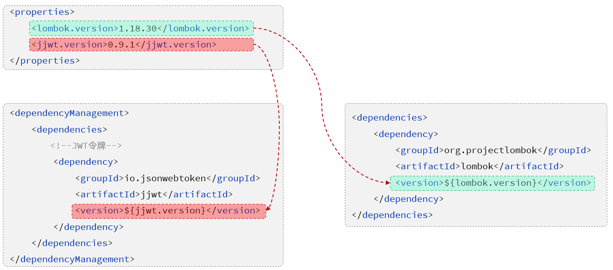

具体语法为：

1\)\. 自定义属性

```XML
<properties>
    <lombok.version>1.18.34</lombok.version>
</properties>
```


2\)\. 引用属性

```XML
<dependency>
    <groupId>org.projectlombok</groupId>
    <artifactId>lombok</artifactId>
    <version>${lombok.version}</version>
</dependency>
```


接下来，我们就可以在父工程中，将所有的版本号，都集中管理维护起来。

```XML
*<?*xml version="1.0" encoding="UTF-8"*?>*
<project xmlns="http://maven.apache.org/POM/4.0.0"
         xmlns:xsi="http://www.w3.org/2001/XMLSchema-instance"
         xsi:schemaLocation="http://maven.apache.org/POM/4.0.0 http://maven.apache.org/xsd/maven-4.0.0.xsd">
    <modelVersion>4.0.0</modelVersion>

    <parent>
        <groupId>org.springframework.boot</groupId>
        <artifactId>spring-boot-starter-parent</artifactId>
        <version>3.2.8</version>
        <relativePath/> <!-- lookup parent from repository -->
    </parent>

    <groupId>com.itheima</groupId>
    <artifactId>tlias-parent</artifactId>
    <version>1.0-SNAPSHOT</version>
    <packaging>pom</packaging>

    <properties>
        <maven.compiler.source>17</maven.compiler.source>
        <maven.compiler.target>17</maven.compiler.target>
        <project.build.sourceEncoding>UTF-8</project.build.sourceEncoding>

        <spring-boot.version>3.2.8</spring-boot.version>
        <lombok.version>1.18.34</lombok.version>
        <jwt.version>0.9.1</jwt.version>
        <aliyun.oss.version>3.17.4</aliyun.oss.version>
        <jaxb.version>2.3.1</jaxb.version>
        <javax.activation.version>1.1.1</javax.activation.version>
        <jaxb.runtime.version>2.3.3</jaxb.runtime.version>
    </properties>

    <dependencies>
        <dependency>
            <groupId>org.springframework.boot</groupId>
            <artifactId>spring-boot-starter</artifactId>
            <version>${spring-boot.version}</version>
        </dependency>

        <dependency>
            <groupId>org.projectlombok</groupId>
            <artifactId>lombok</artifactId>
            <version>${lombok.version}</version>
        </dependency>
    </dependencies>

    <dependencyManagement>
        <dependencies>
            <!-- JWT依赖-->
            <dependency>
                <groupId>io.jsonwebtoken</groupId>
                <artifactId>jjwt</artifactId>
                <version>${jwt.version}</version>
            </dependency>

            <dependency>
                <groupId>com.aliyun.oss</groupId>
                <artifactId>aliyun-sdk-oss</artifactId>
                <version>${aliyun.oss.version}</version>
            </dependency>
            <dependency>
                <groupId>javax.xml.bind</groupId>
                <artifactId>jaxb-api</artifactId>
                <version>${jaxb.version}</version>
            </dependency>
            <dependency>
                <groupId>javax.activation</groupId>
                <artifactId>activation</artifactId>
                <version>${javax.activation.version}</version>
            </dependency>
            <!-- no more than 2.3.3-->
            <dependency>
                <groupId>org.glassfish.jaxb</groupId>
                <artifactId>jaxb-runtime</artifactId>
                <version>${jaxb.runtime.version}</version>
            </dependency>
        </dependencies>
    </dependencyManagement>

</project>
```

版本集中管理之后，我们要想修改依赖的版本，就只需要在父工程中自定义属性的位置，修改对应的属性值即可。


**面试题：****`<dependencyManagement>`**** 与 ****`<dependencies>`**** 的区别是什么?**

- `<dependencies>` 是直接依赖，在父工程配置了依赖，子工程会直接继承下来。 

- `<dependencyManagement>` 是统一管理依赖版本，不会直接依赖，还需要在子工程中引入所需依赖\(无需指定版本\)


## 聚合

分模块设计与开发之后啊，我们的项目被拆分为多个模块，而模块之间的关系，可能错综复杂。 那就比如我们当前的案例项目，结构如下（相对还是比较简单的）：

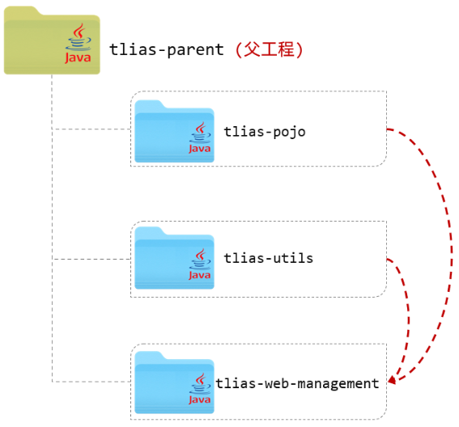

此时，`tlias-web-management` 模块的父工程是 `tlias-parent`，该模块又依赖了 `tlias-pojo`、`tlias-utils` 模块。 那此时，我们要想将 `tlias-web-management` 模块打包，是比较繁琐的。因为在进行项目打包时，maven会从本地仓库中来查找 `tlias-parent` 父工程，以及它所依赖的模块 `tlias-pojo`、`tlias-utils`，而本地仓库目前是没有这几个依赖的。


所以，我们再打包`tlias-web-management` 模块前，需要将 `tlias-parent`、`tlias-pojo`、`tlias-utils` 分别执行install生命周期安装到maven的本地仓库，然后再针对于 `tlias-web-management` 模块执行package进行打包操作。


那此时，大家试想一下，如果开发一个大型项目，拆分的模块很多，模块之间的依赖关系错综复杂，那此时要进行项目的打包、安装操作，是非常繁琐的。 而我们接下来，要讲解的maven的聚合就是来解决这个问题的，通过maven的聚合就可以轻松实现项目的一键构建（清理、编译、测试、打包、安装等）。


### 介绍

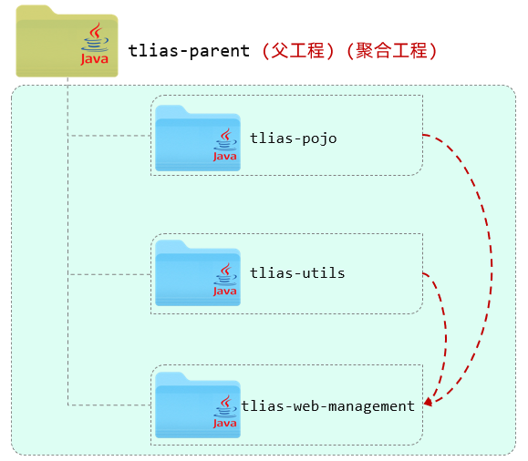

- **聚合：**将多个模块组织成一个整体，同时进行项目的构建。

- **聚合工程：**一个不具有业务功能的“空”工程（有且仅有一个pom文件） 【PS：一般来说，继承关系中的父工程与聚合关系中的聚合工程是同一个】

- **作用：**快速构建项目（无需根据依赖关系手动构建，直接在聚合工程上构建即可）


### 实现

在maven中，我们可以在聚合工程中通过 `<moudules>` 设置当前聚合工程所包含的子模块的名称。我们可以在 tlias\-parent中，添加如下配置，来指定当前聚合工程，需要聚合的模块：

```XML
<!-- 聚合其他模块 -->
<modules>
    <module>../tlias-pojo</module>
    <module>../tlias-utils</module>
    <module>../tlias-web-management</module>
</modules>
```


那此时，我们要进行编译、打包、安装操作，就无需在每一个模块上操作了。只需要在聚合工程上，统一进行操作就可以了。

**测试：**执行在聚合工程 tlias\-parent 中执行 package 打包指令

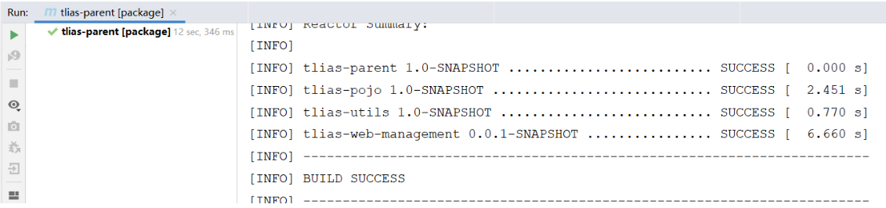

那 `tlias-parent` 中所聚合的其他模块全部都会执行 package 指令，这就是通过聚合实现项目的一键构建（一键清理clean、一键编译compile、一键测试test、一键打包package、一键安装install等）。


## 继承与聚合对比

- **作用**

    - 聚合用于快速构建项目

    - 继承用于简化依赖配置、统一管理依赖

- **相同点：**

    - 聚合与继承的pom\.xml文件打包方式均为pom，通常将两种关系制作到同一个pom文件中

    - 聚合与继承均属于设计型模块，并无实际的模块内容

- **不同点：**

    - 聚合是在聚合工程中配置关系，聚合可以感知到参与聚合的模块有哪些

    - 继承是在子模块中配置关系，父模块无法感知哪些子模块继承了自己


