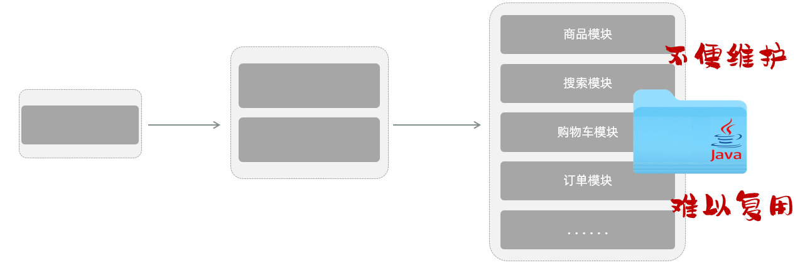
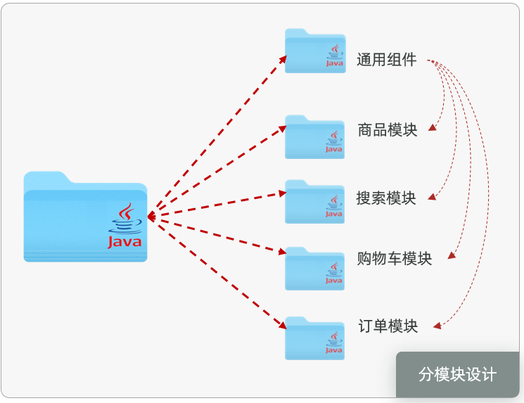
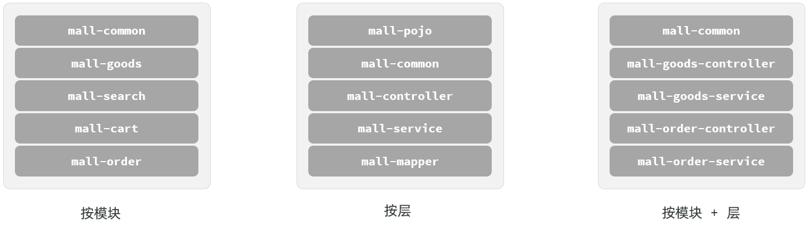
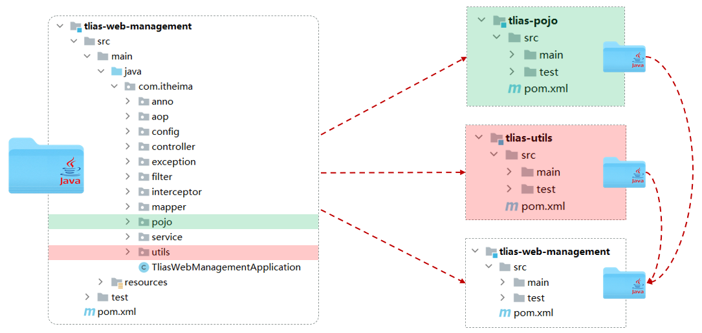
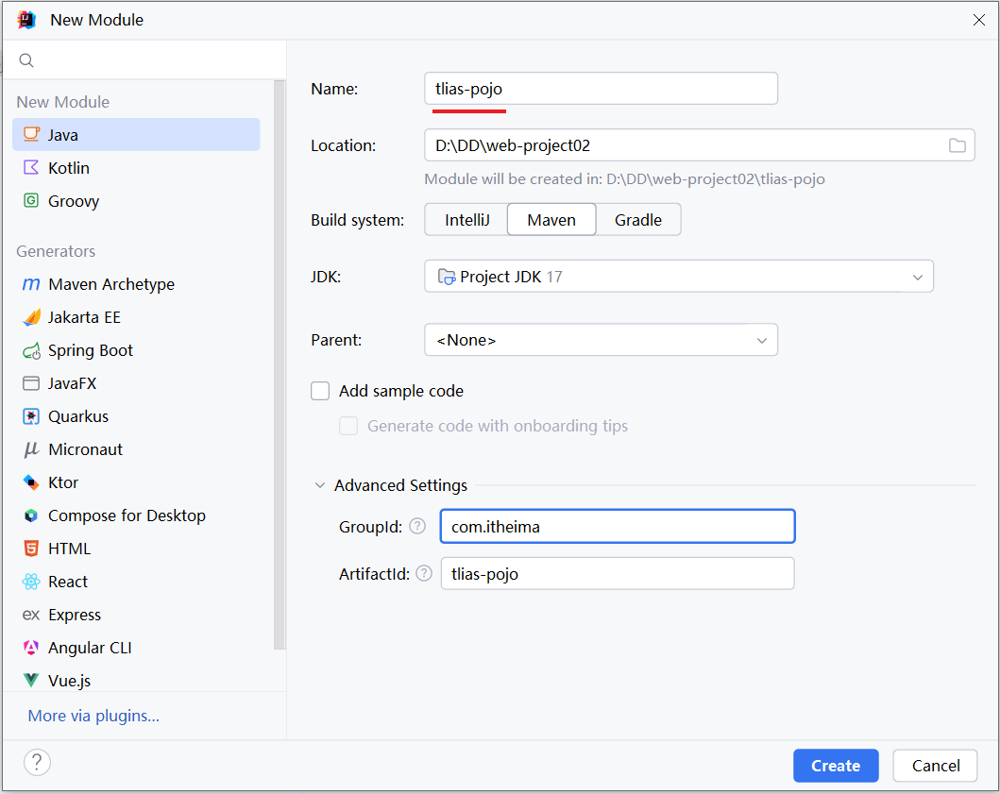
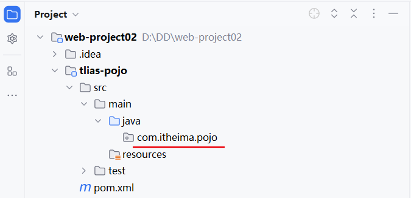
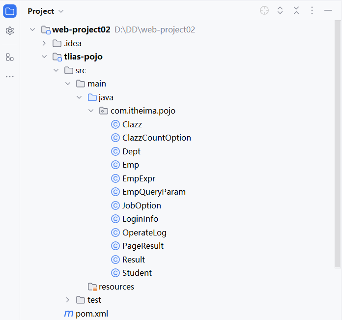
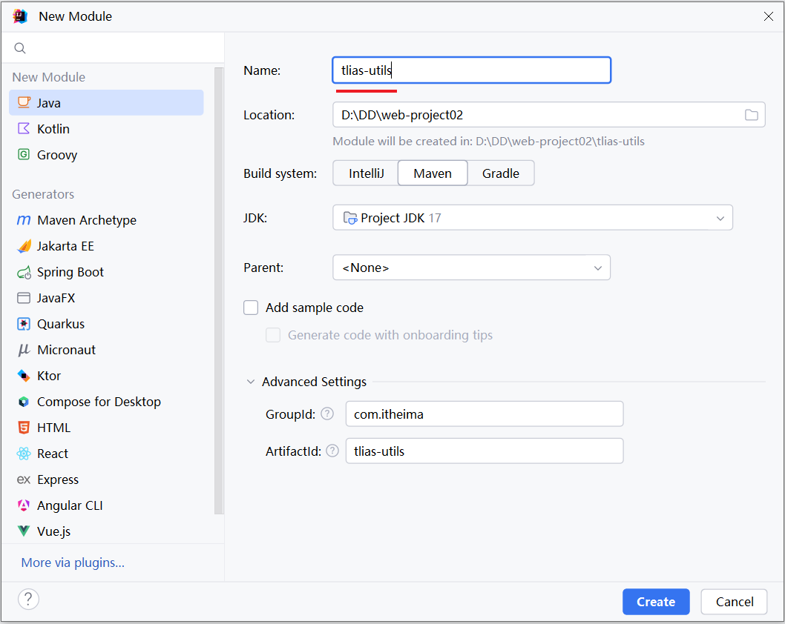
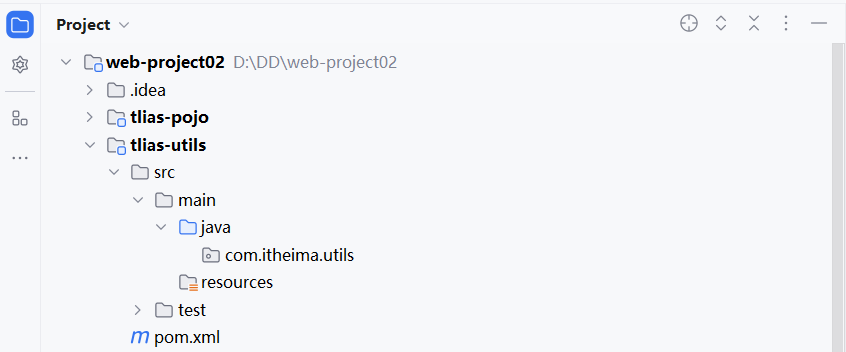
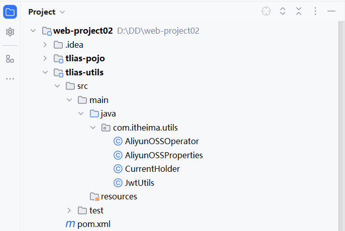

# 分模块设计与开发

## 介绍

所谓分模块设计，顾名思义指的就是我们在设计一个 Java 项目的时候，将一个 Java 项目拆分成多个模块进行开发。


**1\)\. 未分模块设计的问题**



如果项目不分模块，也就意味着所有的业务代码是不是都写在这一个 Java 项目当中。随着这个项目的业务扩张，项目当中的业务功能可能会越来越多。


假如我们开发的是一个大型的电商项目，里面可能就包括了商品模块的功能、搜索模块的功能、购物车模块、订单模块、用户中心等等。这些所有的业务代码我们都在一个 Java 项目当中编写。


此时大家可以试想一下，假如我们开发的是一个大型的电商网站，这个项目组至少几十号甚至几百号开发人员，这些开发人员全部操作这一个 Java 项目。此时大家就会发现我们项目管理和维护起来将会非常的困难。而且大家再来看，假如在我们的项目当中，我们自己定义了一些通用的工具类以及通用的组件，而公司还有其他的项目组，其他项目组也想使用我们所封装的这些组件和工具类，其实是非常不方便的。因为 Java 项目当中包含了当前项目的所有业务代码，所以就造成了这里面所封装的一些组件会难以复用。


**总结起来，主要两点问题：不方便项目的维护和管理、项目中的通用组件难以复用。**


**2\)\. 分模块设计**

分模块设计我们在进行项目设计阶段，就可以将一个大的项目拆分成若干个模块，每一个模块都是独立的。



比如我们可以将商品的相关功能放在商品模块当中，搜索的相关业务功能我都封装在搜索模块当中，还有像购物车模块、订单模块。而为了组件的复用，我们也可以将项目当中的实体类、工具类以及我们定义的通用的组件都单独的抽取到一个模块当中。


如果当前这个模块，比如订单模块需要用到这些实体类以及工具类或者这些通用组件，此时直接在订单模块当中引入工具类的坐标就可以了。这样我们就将一个项目拆分成了若干个模块儿，这就是分模块儿设计。


分模块儿设计之后，大家再来看。我们在进行项目管理的时候，我就可以几个人一组，几个人来负责订单模块儿，另外几个人来负责购物车模块儿，这样更加便于项目的管理以及项目的后期维护。


而且分模块设计之后，如果我们需要用到另外一个模块的功能，我们直接依赖模块就可以了。比如商品模块、搜索模块、购物车订单模块都需要依赖于通用组件当中封装的一些工具类，我只需要引入通用组件的坐标就可以了。


**分模块设计就是将项目按照功能/结构拆分成若干个子模块，方便项目的管理维护、拓展，也方便模块键的相互调用、资源共享。**


## 策略

1. 策略一：按照功能模块拆分，比如：公共组件、商品模块、搜索模块、购物车模块、订单模块等。

2. 策略二：按层拆分，比如：公共组件、实体类、控制层、业务层、数据访问层。

3. 策略三：按照功能模块 \+ 层拆分。




## 实践

### 分析

好，我们明白了什么是分模块设计以及分模块设计的优势之后，接下来我们就来看一下我们之前所开发的案例工程。


我们可以看到在这个项目当中，除了我们所开发的部门管理以及员工管理、登录认证等相关业务功能以外，我们是不是也定义了一些实体类，也就是pojo包下存放的一些类，像分页结果的封装类PageBean、 统一响应结果Result，我们还定义了一些通用的工具类，像Jwts、阿里云OSS操作的工具类等等。


如果在当前公司的其他项目组当中，也想使用我们所封装的这些公共的组件，该怎么办？大家可以思考一下。

- 方案一：直接依赖我们当前项目 `tlias-web-management` ，但是存在两大缺点：

    - 这个项目当中包含所有的业务功能代码，而想共享的资源，仅仅是pojo下的实体类，以及 utils 下的工具类。如果全部都依赖进来，项目在启动时将会把所有的类都加载进来，会\*\*影响性能\*\*。

    - 如果直接把这个项目都依赖进来了，那也就意味着我们所有的业务代码都对外公开了，这个是非常\*\*不安全\*\*的。


- 方案二：分模块设计

    - 将pojo包下的实体类，抽取到一个maven模块中 `tlias-pojo`

    - 将utils包下的工具类，抽取到一个maven模块中 `tlias-utils`

    - 其他的业务代码，放在`tlias-web-management`这个模块中，在该模块中需要用到实体类pojo、工具类utils，直接引入对应的依赖即可。



**注意：分模块开发需要先针对模块功能进行设计，再进行编码。不会先将工程开发完毕，然后进行拆分。**

PS：当前我们是为了演示分模块开发，所以是基于我们前面开发的案例项目进行拆分的，实际中都是分模块设计，然后再开发的。


### 实现

思路我们分析完毕，接下来，我们就根据我们分析的思路，按照如下模块进行拆分：


**1\. ****创建maven模块 ****`tlias-pojo`****，存放实体类**

A\. 创建一个正常的Maven模块，模块名 `tlias-pojo`




B\. 然后在tlias\-pojo中创建一个包 `com.itheima.pojo` \(和原来案例项目中的pojo包名一致\)




C\. 将原来案例项目 `tlias-web-management` 中的pojo包下的实体类，复制到 `tlias-pojo` 模块中




D\. 在 `tlias-pojo` 模块的`pom.xml`文件中引入依赖

```XML
<dependencies>
    <dependency>
        <groupId>org.projectlombok</groupId>
        <artifactId>lombok</artifactId>
        <version>1.18.34</version>
    </dependency>
    
    <dependency>
        <groupId>org.springframework.boot</groupId>
        <artifactId>spring-boot-starter</artifactId>
        <version>3.2.8</version>
    </dependency>
</dependencies>
```

因为在实体类中，还用到了Spring框架中的 @DateTimeFormat 这样的注解，所以这里再引入一个springboot的基础起步依赖。


E\. 删除原有案例项目 `tlias-web-management` 的pojo包【直接删除不要犹豫，我们已经将该模块拆分出去了】，然后在`pom.xml`中引入 `tlias-pojo`的依赖

```XML
<dependency>
    <groupId>com.itheima</groupId>
    <artifactId>tlias-pojo</artifactId>
    <version>1.0-SNAPSHOT</version>
</dependency>
```


**2\. 创建Maven模块 tlias\-utils，存放相关工具类**

A\. 创建一个正常的Maven模块，模块名 `tlias-utils`




B\. 然后在 `tlias-utils` 中创建一个包 `com.itheima.utils` \(和原来案例项目中的utils包名一致\)




C\. 将原来案例项目 `tlias-web-management` 中的util包下的实体类，复制到 `tlias-utils` 模块中




D\. 在 `tlias-utils` 模块的 `pom.xml` 文件中引入依赖。

```XML
<dependencies>
    <!-- JWT依赖-->
    <dependency>
        <groupId>io.jsonwebtoken</groupId>
        <artifactId>jjwt</artifactId>
        <version>0.9.1</version>
    </dependency>

    <dependency>
        <groupId>com.aliyun.oss</groupId>
        <artifactId>aliyun-sdk-oss</artifactId>
        <version>3.17.4</version>
    </dependency>
    <dependency>
        <groupId>javax.xml.bind</groupId>
        <artifactId>jaxb-api</artifactId>
        <version>2.3.1</version>
    </dependency>
    <dependency>
        <groupId>javax.activation</groupId>
        <artifactId>activation</artifactId>
        <version>1.1.1</version>
    </dependency>
    <!-- no more than 2.3.3-->
    <dependency>
        <groupId>org.glassfish.jaxb</groupId>
        <artifactId>jaxb-runtime</artifactId>
        <version>2.3.3</version>
    </dependency>

    <dependency>
        <groupId>org.springframework.boot</groupId>
        <artifactId>spring-boot-starter</artifactId>
        <version>3.2.8</version>
    </dependency>

    <dependency>
        <groupId>org.projectlombok</groupId>
        <artifactId>lombok</artifactId>
        <version>1.18.34</version>
    </dependency>
</dependencies>
```


E\. 删除原有案例项目 `tlias-web-management` 的util包【直接删除不要犹豫，我们已经将该模块拆分出去了】，然后在pom\.xml中引入 `tlias-utils` 的依赖。

```XML
<dependency>
    <groupId>com.itheima</groupId>
    <artifactId>tlias-utils</artifactId>
    <version>1.0-SNAPSHOT</version>
</dependency>
```


**到此呢，就已经完成了模块的拆分，拆分出了 ****`tlias-pojo`****、****`tlias-utils`****、****`tlias-web-management`**** ，如果其他项目中需要用到 pojo，或者 utils工具类，就可以直接引入依赖。** 


- **什么是分模块设计：**将项目按照功能拆分成若干个子模块

- **为什么要分模块设计：**方便项目的管理维护、扩展，也方便模块间的相互调用，资源共享

- **注意事项：**分模块设计需要先针对模块功能进行设计，再进行编码。不会先将工程开发完毕，然后进行拆分


