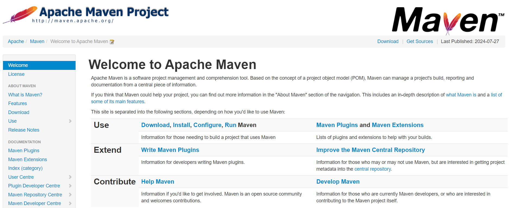
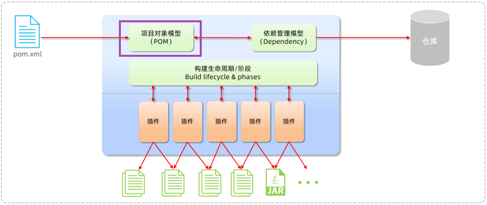
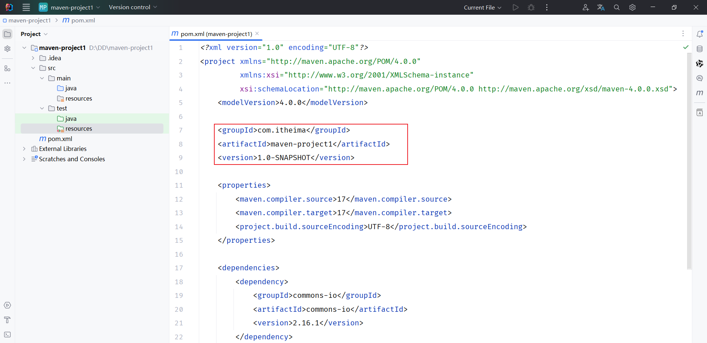
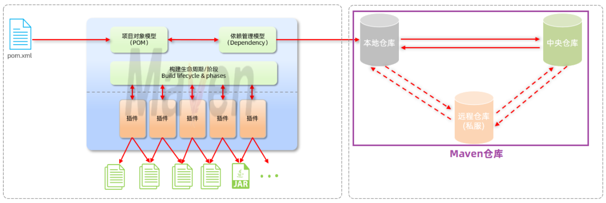
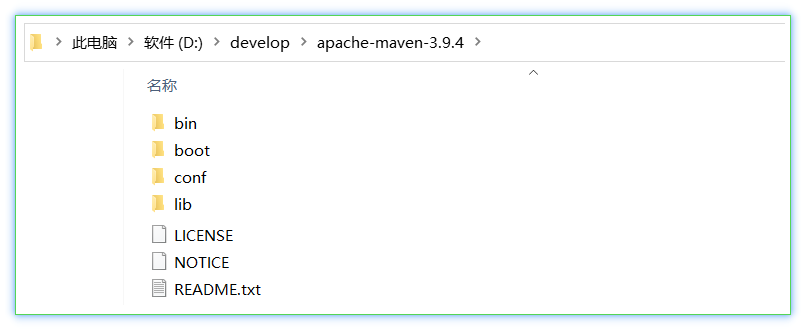
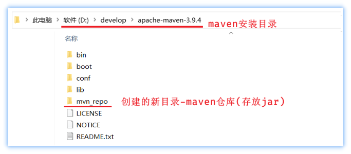
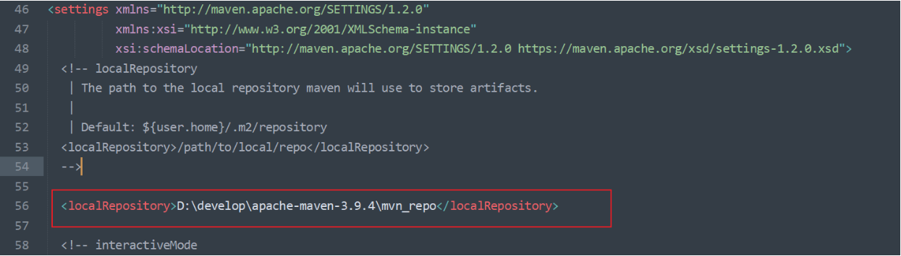
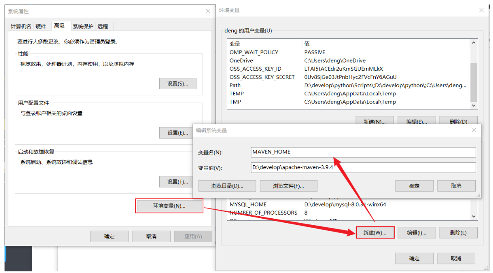
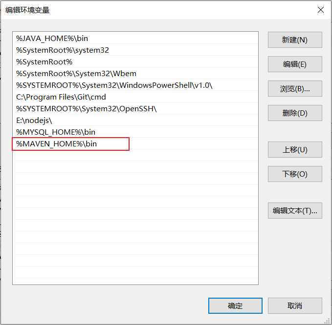
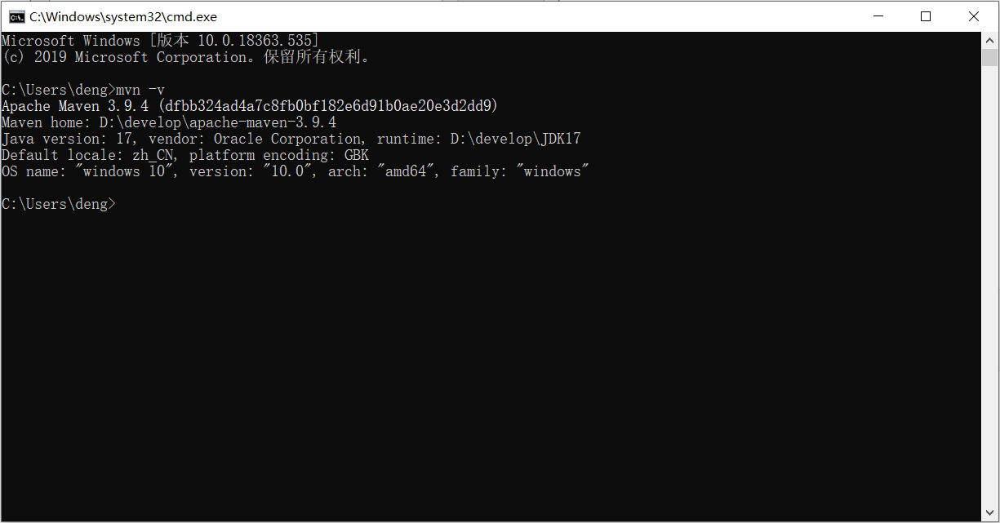

# Maven概述

## Maven介绍

Apache Maven是一个项目管理和构建工具，它基于项目对象模型\(Project Object Model , 简称: POM\)的概念，通过一小段描述信息来管理项目的构建、报告和文档。

官网：[https://maven\.apache\.org/](https://maven.apache.org/)



Maven的作用： 

1. 方便的依赖管理

2. 统一的项目结构

3. 标准的项目构建流程


## Maven模型

- 项目对象模型 \(Project Object Model\)

- 依赖管理模型\(Dependency\)

- 构建生命周期/阶段\(Build lifecycle \& phases\)


1\)\. 构建生命周期/阶段\(Build lifecycle \& phases\)


以上图中紫色框起来的部分，就是用来完成标准化构建流程 。当我们需要编译，Maven提供了一个编译插件供我们使用；当我们需要打包，Maven就提供了一个打包插件供我们使用等。 


2\)\. 项目对象模型 \(Project Object Model\)



以上图中紫色框起来的部分属于项目对象模型，就是将我们自己的项目抽象成一个对象模型，有自己专属的坐标，如下图所示是一个Maven项目：



> 坐标，就是资源\(jar包\)的唯一标识，通过坐标可以定位到所需资源\(jar包\)位置。
> 
> 坐标的组成部分：
> 
> - groupId: 组织名
> 
> - arfitactId: 模块名
> 
> - Version: 版本号
> 
> 


3\)\. 依赖管理模型\(Dependency\)


以上图中紫色框起来的部分属于依赖管理模型，是使用坐标来描述当前项目依赖哪些第三方jar包。


之前我们项目中需要jar包时，直接就把jar包复制到项目下的lib目录，而现在我们只需要在pom\.xml中配置依赖的配置文件即可。 而这个依赖对应的jar包其实就在我们本地电脑上的maven仓库中。 

如下图，就是老师本地的maven仓库中的jar文件：


## Maven仓库

仓库：用于存储资源，管理各种jar包

> **仓库的本质**就是一个目录\(文件夹\)，这个目录被用来存储开发中所有依赖\(就是jar包\)和插件
> 
> 


Maven仓库分为：

- 本地仓库：自己计算机上的一个目录\(用来存储jar包\)

- 中央仓库：由Maven团队维护的全球唯一的。仓库地址：https://repo1\.maven\.org/maven2/

- 远程仓库\(私服\)：一般由公司团队搭建的私有仓库



当项目中使用坐标引入对应依赖jar包后，

- 首先会查找本地仓库中是否有对应的jar包

    - 如果有，则在项目直接引用

    - 如果没有，则去中央仓库中下载对应的jar包到本地仓库

- 如果还可以搭建远程仓库\(私服\)，将来jar包的查找顺序则变为： 本地仓库 \-\-\> 远程仓库\-\-\> 中央仓库


## Maven安装

认识了Maven后，我们就要开始使用Maven了，那么首先我们要进行Maven的下载与安装。

### 下载

- 下载地址：https://maven\.apache\.org/download\.cgi

- 在提供的资料中，已经提供了下载好的安装包。如下： 

apache\-maven\-3\.9\.4\-bin\.zip


### 安装步骤

Maven安装配置步骤：

1. 解压安装

2. 配置仓库

3. 配置阿里云私服

4. 配置Maven环境变量


**1\)\. 解压 apache\-maven\-3\.9\.4\-bin\.zip（解压即安装）**

建议解压到没有中文、特殊字符的路径下。如课程中解压到 `E:\develop` 下。

解压缩后的目录结构如下：



- bin目录 ： 存放的是可执行命令。（mvn 命令重点关注）

- conf目录 ：存放Maven的配置文件。（settings\.xml配置文件后期需要修改）

- lib目录 ：存放Maven依赖的jar包。（Maven也是使用java开发的，所以它也依赖其他的jar包）


**2\)\. 配置本地仓库**

1. 在自己计算机上新一个目录（本地仓库，用来存储jar包）




2. 进入到conf目录下修改`settings.xml`配置文件 

    1. 使用超级记事本软件，打开settings\.xml文件，定位到53行

    2. 复制`<localRepository>`标签，粘贴到注释的外面（55行）

    3. 复制之前新建的用来存储jar包的路径，替换掉`<localRepository>`标签体内容 




**3\)\. 配置阿里云私服**

由于中央仓库在国外，所以下载jar包速度可能比较慢，而阿里公司提供了一个远程仓库，里面基本也都有开源项目的jar包。

进入到conf目录下修改settings\.xml配置文件：

1. 使用超级记事本软件，打开settings\.xml文件，定位到160行左右

2. 在`<mirrors>`标签下为其添加子标签`<mirror>`，内容如下：

```XML
<mirror>
    <id>alimaven</id>
    <name>aliyun maven</name>
    <url>http://maven.aliyun.com/nexus/content/groups/public/</url>
    <mirrorOf>central</mirrorOf>
</mirror>
```

注意配置的位置，在`<mirrors> ... </mirrors>`中间添加配置。如下图所示：


**4\)\.**** 配置环境****变量**

Maven环境变量的配置类似于JDK环境变量配置一样

1. 在系统变量处新建一个变量MAVEN\_HOME。 MAVEN\_HOME环境变量的值，设置为maven的解压安装目录




2. 在Path中进行配置。 PATH环境变量的值，设置为：%MAVEN\_HOME%\\bin




3. 打开DOS命令提示符进行验证，出现如图所示表示安装成功 。

命令为：**`mvn -v`**




**5\)\. 配置关联的JDK****版****本\(****可选****\)**

进入到conf目录下修改settings\.xml配置文件，在 `<profiles> </profiles>`中增加如下配置:

```SQL
<profile>
        <id>jdk-17</id>
        <activation>
                <activeByDefault>true</activeByDefault>
                <jdk>17</jdk>
        </activation>
        <properties>
                <maven.compiler.source>17</maven.compiler.source>
                <maven.compiler.target>17</maven.compiler.target>
                <maven.compiler.compilerVersion>17</maven.compiler.compilerVersion>
        </properties>
</profile>
```


