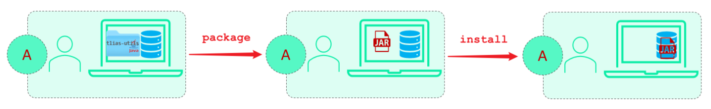
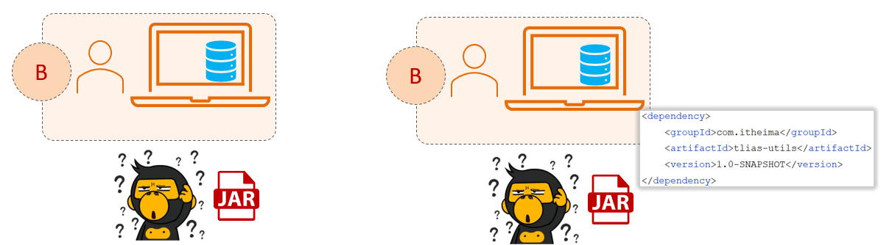
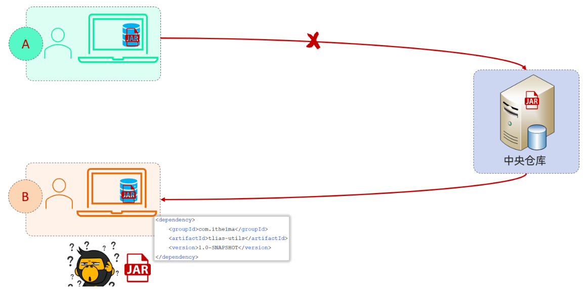
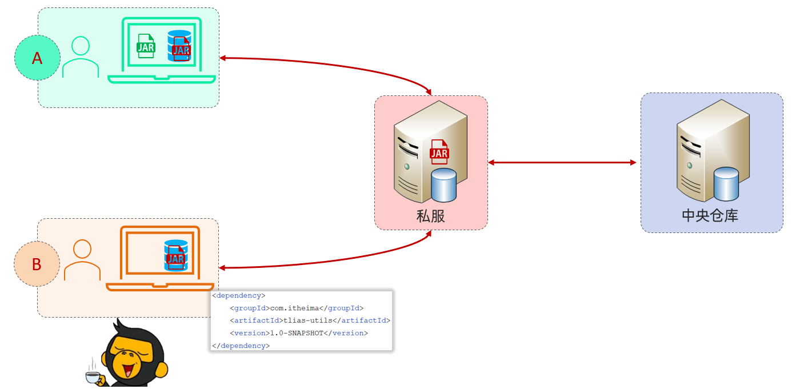
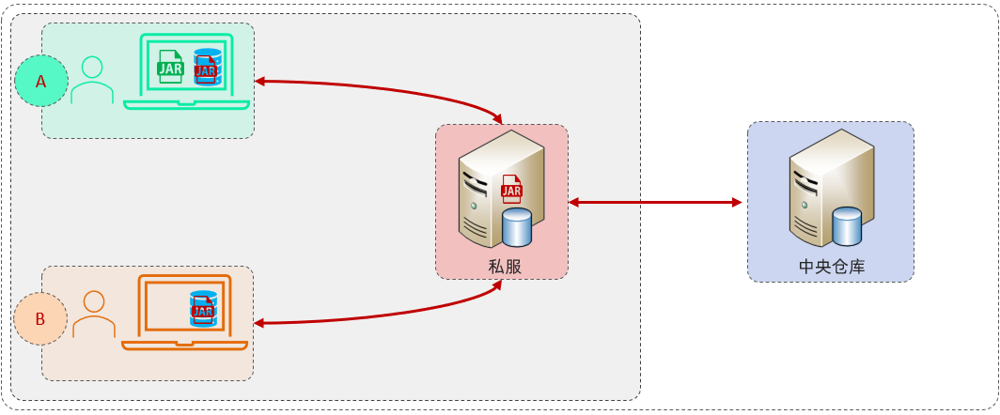
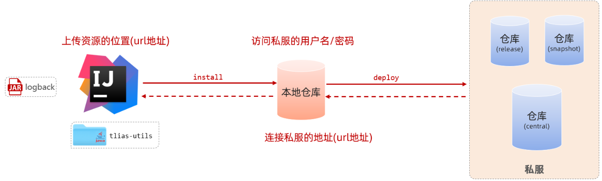
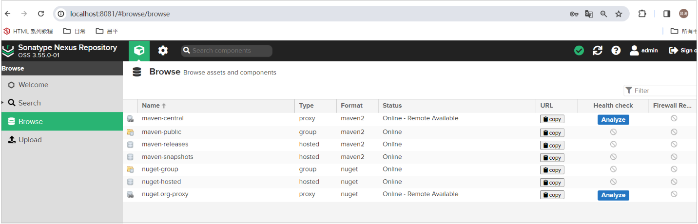
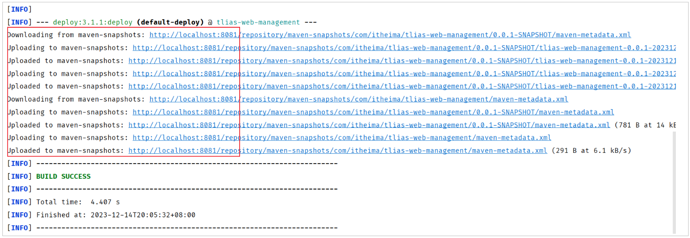
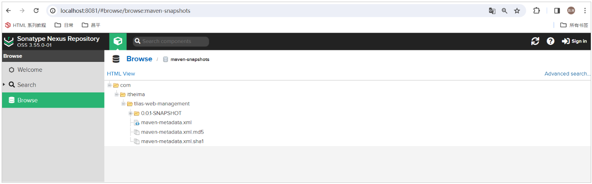

# 私服

前面我们在讲解多模块开发的时候，我们讲到我们所拆分的模块是可以在同一个公司各个项目组之间进行资源共享的。这个模块的资源共享，就需要通过我们接下来所讲解的 Maven 的私服来实现。


首先我们先介绍一下什么是私服，以及它的作用是什么。再来介绍一下我们如何将每位模块打包上传到私服，以及从私服当中来下载。


## 场景

在介绍什么是私服之前，我们先来分析一下同一个公司，两个项目组之间如何基于私服进行资源的共享。


假设现在有两个团队，A 和 B。 A 开发了一个模块 tlias\-utils，模块开发完毕之后，将模块打成jar包，并安装到了A的本地仓库。



那此时，该公司的B团队开发项目时，要想使用 tlias\-utils 中提供的工具类，该怎么办呢？ 对于maven项目来说，是不是在pom\.xml文件中引入 tlias\-utils的坐标就可以了呢？



大家可以思考一下，当B团队在maven项目的pom\.xml配置文件中引入了依赖的坐标之后，maven是如何查找这个依赖的？ 查找顺序为：

1\)\. 本地仓库：本地仓库中是没有这个依赖jar包的。

2\)\. 远程中央仓库：由于该模块时自己公司开发的，远程仓库中也没有这个依赖。


因为目前tlias\-utils这个依赖，还在A的本地仓库中的。 B电脑上的maven项目，是不可能找得到A电脑上maven本地仓库的jar包的。  那此时，大家可能会有一个想法：因为A和B都会连接中央仓库，我们可以将A本地仓库的jar包，直接上传到中央仓库，然后B从中央仓库中下载tlias\-utils这个依赖。



这个想法很美好，但是现实很残酷。这个方案是行不通的，因为中央仓库全球只有一个，不是什么人都可以往中央仓库中来上传jar包的，我们是没有权限操作的。


那此时，maven的私服就出场了，私服其实就是架设在公司局域网内部的一台服务器，就是一种特殊的远程仓库。

有了私服之后，各个团队就可以直接来连接私服了。 A 连接上私服之后，他就可以把jar包直接上传到私服当中。我公司自己内部搭建的服务器，我是不是有权限操作呀，把jar包上传到私服之后，我让 B 团队的所有开发人员也连接同一台私服。连接上这一台私服之后，他就会根据坐标的信息，直接从私服当中将对应的jar包下载到自己的本地仓库，这样就可以使用到依赖当中所提供的一些工具类了。这样我们就可以通过私服来完成资源的共享。



而如果我们在项目中需要使用其他第三方提供的依赖，如果本地仓库没有，也会自动连接私服下载，如果私服没有，私服此时会自动连接中央仓库，去中央仓库中下载依赖，然后将下载的依赖存储在私服仓库及本地仓库中。


## 介绍

- **私服：**是一种特殊的远程仓库，它是架设在局域网内的仓库服务，用来代理位于外部的中央仓库，用于解决团队内部的资源共享与资源同步问题。

- **依赖查找顺序：**

    - 本地仓库

    - 私服仓库

    - 中央仓库

- **注意事项：**私服在企业项目开发中，一个项目/公司，只需要一台即可（无需我们自己搭建，会使用即可）。




## 资源上传与下载

### 步骤分析



资源上传与下载，我们需要做三步配置，执行一条指令。

- 第一步配置：在maven的配置文件中配置访问私服的用户名、密码。

- 第二步配置：在maven的配置文件中配置连接私服的地址\(url地址\)。

- 第三步配置：在项目的pom\.xml文件中配置上传资源的位置\(url地址\)。

- 配置好了上述三步之后，要上传资源到私服仓库，就执行执行maven生命周期：`deploy`。


**私服仓库说明：**

- RELEASE：存储自己开发的RELEASE发布版本的资源。

- SNAPSHOT：存储自己开发的SNAPSHOT发布版本的资源。

- Central：存储的是从中央仓库下载下来的依赖。

**项目版本说明：**

- RELEASE\(发布版本\)：功能趋于稳定、当前更新停止，可以用于发行的版本，存储在私服中的RELEASE仓库中。

- SNAPSHOT\(快照版本\)：功能不稳定、尚处于开发中的版本，即快照版本，存储在私服的SNAPSHOT仓库中。


### 具体操作

私服已经搭建好了，已经启动起来了，我们可以访问私服测试：`http://localhost:8081`。




私服准备好了之后，我们要做如下几步配置：


**1\. 设置私服的访问用户名/密码（在自己maven安装目录下的****`conf/settings.xml`****中的servers中配置）**

```XML
<server>
    <id>maven-releases</id>
    <username>admin</username>
    <password>admin</password>
</server>
    
<server>
    <id>maven-snapshots</id>
    <username>admin</username>
    <password>admin</password>
</server>
```


**2\. 设置私服依赖下载的仓库组地址（在自己maven安装目录下的****`conf/settings.xml`****中的mirrors中配置）**

```XML
<mirror>
    <id>maven-public</id>
    <mirrorOf>*</mirrorOf>
    <url>http://localhost:8081/repository/maven-public/</url>
</mirror>
```


**3\.**** 设置私服依赖下载的仓库组地址（在自己maven安装目录下的****`conf/settings.xml`****中的profiles中配置）**

```XML
<profile>
    <id>allow-snapshots</id>
    <activation>
        <activeByDefault>true</activeByDefault>
    </activation>
    <repositories>
        <repository>
            <id>maven-public</id>
            <url>http://localhost:8081/repository/maven-public/</url>
            <releases>
                <enabled>true</enabled>
            </releases>
            <snapshots>
                <enabled>true</enabled>
            </snapshots>
        </repository>
    </repositories>
</profile>
```


**4\. IDEA的maven工程的pom文件中配置上传（发布）地址\(直接在****`tlias-parent`****中配置发布地址\)**

```XML
<distributionManagement>
    <!-- release版本的发布地址 -->
    <repository>
        <id>maven-releases</id>
        <url>http://localhost:8081/repository/maven-releases/</url>
    </repository>
    <!-- snapshot版本的发布地址 -->
    <snapshotRepository>
        <id>maven-snapshots</id>
        <url>http://localhost:8081/repository/maven-snapshots/</url>
    </snapshotRepository>
</distributionManagement>
```

配置完成之后，我们就可以在`tlias-parent`中执行**deploy**生命周期，将项目发布到私服仓库中。 




通过日志，我们可以看到，这几个模块打的jar包确实已经上传到了私服仓库中（由于当前我们的项目是SNAPSHOT版本，所以jar包是上传到了snapshot仓库中）。


那接下来，我们再来打开私服来看一下：



我们看到，我们项目中的这几个模块，在私服中都有了。 那接下来，当其他项目组的开发人员在项目中，就可以直接通过依赖的坐标，就可以完成引入对应的依赖，此时本地仓库没有，就会自动从私服仓库中下载。


**备注说明：在真实的企业开发中，私服都是在远程服务器中的，并不是在本地的。这里我们只是为了方便演示。**


