# 单元测试

## 介绍

**测试：**是一种用来促进鉴定软件的正确性、完整性、安全性和质量的过程。

**阶段划分：**单元测试、集成测试、系统测试、验收测试。


1\)\. 单元测试

- 介绍：对软件的基本组成单位进行测试，最小测试单位。

- 目的：检验软件基本组成单位的正确性。

- 测试人员：开发人员


2\)\. 集成测试

- 介绍：将已分别通过测试的单元，按设计要求组合成系统或子系统，再进行的测试。

- 目的：检查单元之间的协作是否正确。

- 测试人员：开发人员


3\)\. 系统测试

- 介绍：对已经集成好的软件系统进行彻底的测试。

- 目的：验证软件系统的正确性、性能是否满足指定的要求。

- 测试人员：测试人员


4\)\. 验收测试

- 介绍：交付测试，是针对用户需求、业务流程进行的正式的测试。

- 目的：验证软件系统是否满足验收标准。

- 测试人员：客户/需求方


**测试方法：**白盒测试、黑盒测试 及 灰盒测试。

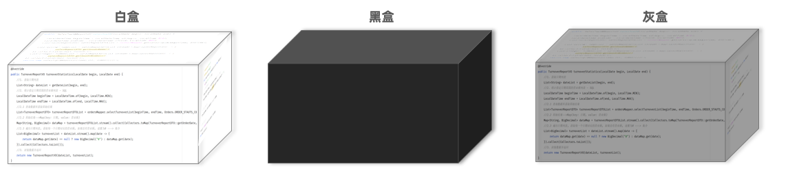

1\)\. 白盒测试

清楚软件内部结构、代码逻辑。

用于验证代码、逻辑正确性。


2\)\. 黑盒测试

不清楚软件内部结构、代码逻辑。

用于验证软件的功能、兼容性、验收测试等方面。


3\)\. 灰盒测试

结合了白盒测试和黑盒测试的特点，既关注软件的内部结构又考虑外部表现（功能）。


## Junit入门

### 单元测试

- 单元测试：就是针对最小的功能单元\(方法\)，编写测试代码对其正确性进行测试。

- JUnit：最流行的Java测试框架之一，提供了一些功能，方便程序进行单元测试（第三方公司提供）。


在之前的课程中，我们进行程序的测试 ，都是main方法中进行测试 。如下图所示：

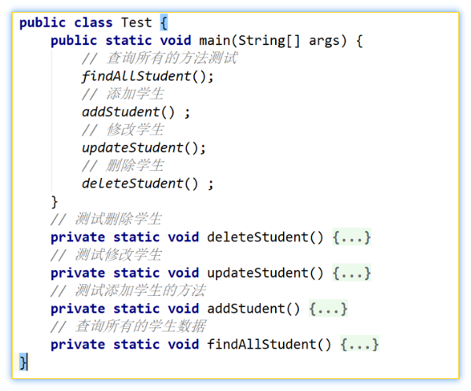

通过**main方法**是可以进行测试的，可以测试程序是否正常运行。但是main方法进行测试时，会存在如下问题：

1. 测试代码与源代码未分开，难维护。

2. 一个方法测试失败，影响后面方法。

3. 无法自动化测试，得到测试报告。


而如果我们使用了**JUnit单元测试**框架进行测试，将会有以下优势：

1. 测试代码与源代码分开，便于维护。

2. 可根据需要进行自动化测试。

3. 可自动分析测试结果，产出测试报告。

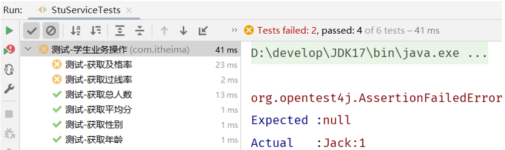


### 入门程序

需求：使用JUnit，对UserService中的业务方法进行单元测试，测试其正确性。

1. 在`pom.xml`中，引入JUnit的依赖。

```XML
<!--Junit单元测试依赖-->
<dependency>
    <groupId>org.junit.jupiter</groupId>
    <artifactId>junit-jupiter</artifactId>
    <version>5.9.1</version>
    <scope>test</scope>
</dependency>
```


2. 在test/java目录下，创建测试类，并编写对应的测试方法，并在方法上声明@Test注解。

```Java
@Test
public void testGetAge(){
    Integer age = new UserService().getAge("110002200505091218");
    System.out.println(age);
}
```


3. 运行单元测试 \(测试通过：绿色；测试失败：红色\)。

- 测试通过显示绿色

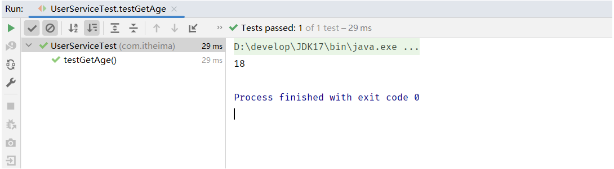

- 测试失败显示红色

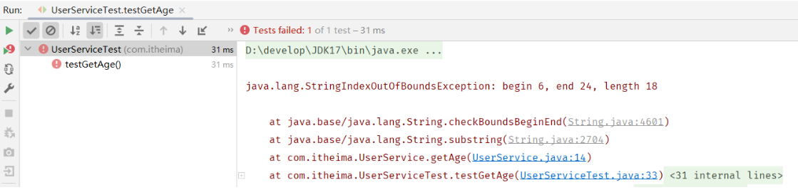


**注意：**

- 测试类的命名规范为：XxxxTest

- 测试方法的命名规定为：public void xxx\(\)\{\.\.\.\}


## 断言

JUnit提供了一些辅助方法，用来帮我们确定被测试的方法是否按照预期的效果正常工作，这种方式称为**断言**。

示例演示：

```Java
package com.itheima;

import org.junit.jupiter.api.*;
import org.junit.jupiter.params.ParameterizedTest;
import org.junit.jupiter.params.provider.ValueSource;

public class UserServiceTest {
    
    @Test
    public void testGetAge2(){
        Integer age = new UserService().getAge("110002200505091218");
        Assertions.assertNotEquals(18, age, "两个值相等");
//        String s1 = new String("Hello");
//        String s2 = "Hello";
//        Assertions.assertSame(s1, s2, "不是同一个对象引用");
    }

    @Test
    public void testGetGender2(){
        String gender = new UserService().getGender("612429198904201611");
        Assertions.assertEquals("男", gender);
    }
}

```

测试结果输出：

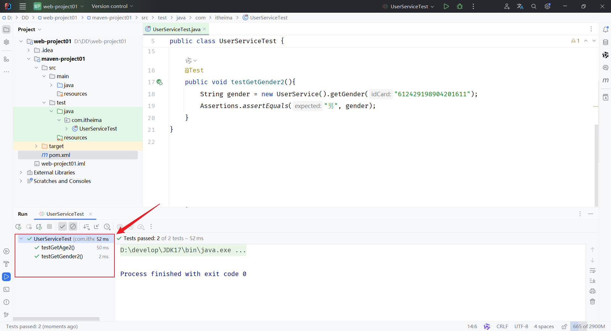


## 常见注解

在JUnit中还提供了一些注解，还增强其功能，常见的注解有以下几个：

演示 `@BeforeEach`，`@AfterEach`，`@BeforeAll`，`@AfterAll` 注解：

```Java
public class UserServiceTest {

    @BeforeEach
    public void testBefore(){
        System.out.println("before...");
    }

    @AfterEach
    public void testAfter(){
        System.out.println("after...");
    }

    @BeforeAll //该方法必须被static修饰
    public static void testBeforeAll(){ 
        System.out.println("before all ...");
    }

    @AfterAll //该方法必须被static修饰
    public static void testAfterAll(){
        System.out.println("after all...");
    }

    @Test
    public void testGetAge(){
        Integer age = new UserService().getAge("110002200505091218");
        System.out.println(age);
    }
    
    @Test
    public void testGetGender(){
        String gender = new UserService().getGender("612429198904201611");
        System.out.println(gender);
    }
 }   
```

输出结果如下：

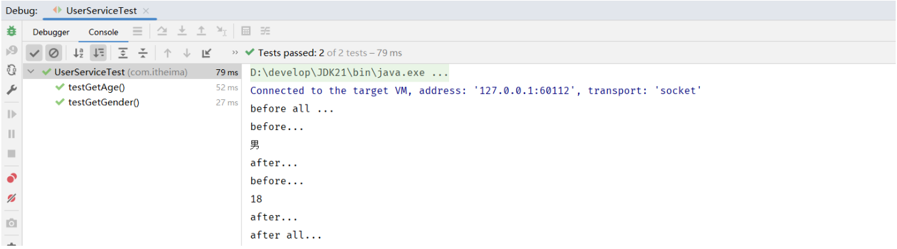


演示 `@ParameterizedTest  `，`@ValueSource` ，`@DisplayName` 注解：

```Java
package com.itheima;

import org.junit.jupiter.api.*;
import org.junit.jupiter.params.ParameterizedTest;
import org.junit.jupiter.params.provider.ValueSource;

@DisplayName("测试-学生业务操作")
public class UserServiceTest {

    @DisplayName("测试-获取年龄")
    @Test
    public void testGetAge(){
        Integer age = new UserService().getAge("110002200505091218");
        System.out.println(age);
    }

    @DisplayName("测试-获取性别")
    @Test
    public void testGetGender(){
        String gender = new UserService().getGender("612429198904201611");
        System.out.println(gender);
    }

    @DisplayName("测试-获取性别3")
    @ParameterizedTest
    @ValueSource(strings = {"612429198904201611","612429198904201631","612429198904201626"})
    public void testGetGender3(String idcard){
        String gender = new UserService().getGender(idcard);
         System.out.println(gender);
    }
}
```

输出结果如下：

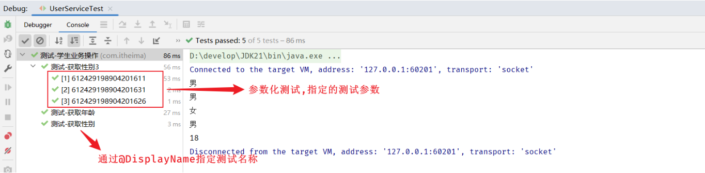


**思考: 在maven项目中，test目录存放单元测试的代码，是否可以在main目录中编写单元测试呢 ？ ****可以，但是不规范**

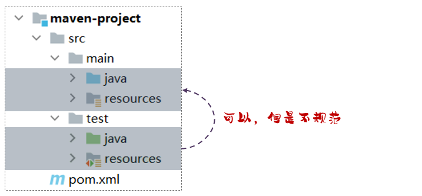


## 依赖范围

依赖的jar包，默认情况下，可以在任何地方使用，在main目录下，可以使用；在test目录下，也可以使用。 

在maven中，如果希望限制依赖的使用范围，可以通过 `<scope>…</scope>` 设置其作用范围。

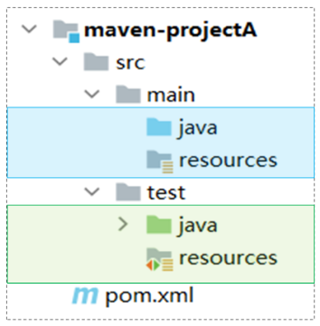

**作用范围：**

- 主程序范围有效。（main文件夹范围内）

- 测试程序范围有效。（test文件夹范围内）

- 是否参与打包运行。（package指令范围内）


可以在pom\.xml中配置 `<scope></scope>` 属性来控制依赖范围。

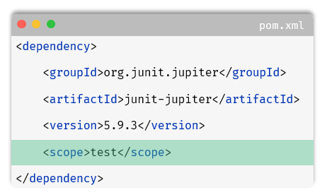

如果对Junit单元测试的依赖，设置了scope为 test，就代表，该依赖，只是在测试程序中可以使用，在主程序中是无法使用的。所以我们会看到如下现象：

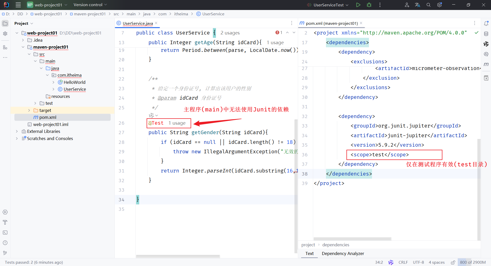

如上图所示，给junit依赖通过scope标签指定依赖的作用范围。 那么这个依赖就只能作用在测试环境，其他环境下不能使用。

scope的取值常见的如下：


