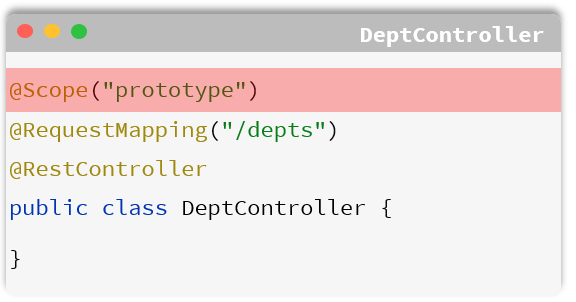
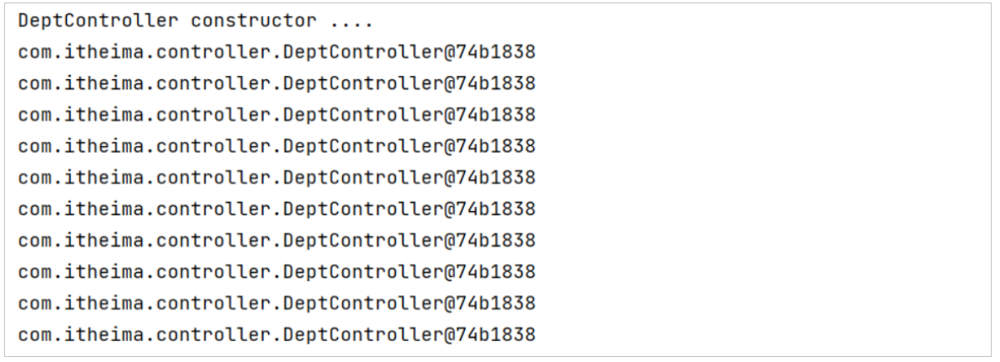
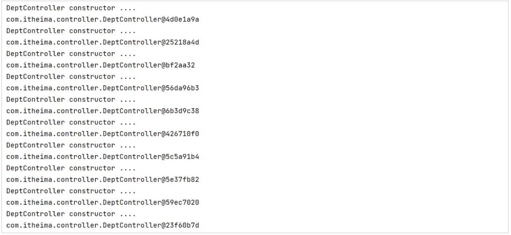

# Bean的管理

在前面的课程当中，我们已经讲过了我们可以通过Spring当中提供的注解@Component以及它的三个衍生注解（@Controller、@Service、@Repository）来声明IOC容器中的bean对象，同时我们也学习了如何为应用程序注入运行时所需要依赖的bean对象，也就是依赖注入DI。

我们今天主要学习IOC容器中Bean的其他使用细节，主要学习以下三方面：

1. bean的作用域配置

2. 管理第三方的bean对象


接下来我们先来学习第一方面，Bean的作用域。

## Bean的作用域

在前面我们提到的IOC容器当中，默认bean对象是单例的 \(只有一个实例对象\)。在Spring中支持五种作用域，后三种在web环境才生效：

知道了bean的5种作用域了，我们要怎么去设置一个bean的作用域呢？

- 可以借助Spring中的@Scope注解来进行配置作用域




**1\)\. 测试一**

- 控制器

```Java
//默认bean的作用域为：singleton (单例)
@RestController
@RequestMapping("/depts")
public class DeptController {

    @Autowired
    private DeptService deptService;

    public DeptController(){
        System.out.println("DeptController constructor ....");
    }

    //省略其他代码...
}
```

- 测试类

```Java
@SpringBootTest
class SpringbootWebConfig2ApplicationTests {

    @Autowired
    private ApplicationContext applicationContext; //IOC容器对象

    //bean的作用域
    @Test
    public void testScope(){
        for (int i = 0; i < 10; i++) {
            DeptController deptController = applicationContext.getBean(DeptController.class);
            System.out.println(deptController);
        }
    }
}
```

重启SpringBoot服务，运行测试方法，查看控制台打印的日志：




**注意事项：**

- IOC容器中的bean默认使用的作用域：singleton \(单例\)

- 默认singleton的bean，在容器启动时被创建，可以使用@Lazy注解来延迟初始化\(延迟到第一次使用时\)


**2\)\. 测试二**

修改控制器DeptController代码：

```Java
@Scope("prototype") //bean作用域为非单例
@RestController
@RequestMapping("/depts")
public class DeptController {

    @Autowired
    private DeptService deptService;

    public DeptController(){
        System.out.println("DeptController constructor ....");
    }

    //省略其他代码...
}
```

重启SpringBoot服务，再次执行测试方法，查看控制吧打印的日志：




**注意事项：**

- prototype的bean，每一次使用该bean的时候都会创建一个新的实例

- 实际开发当中，绝大部分的Bean是单例的，也就是说绝大部分Bean不需要配置scope属性


- 默认singleton的bean，在容器启动时被创建，可以使用@Lazy注解来延迟初始化（延迟到第一次使用时）

- prototype的bean，每一次使用该bean的时候都会创建一个新的实例。

- 实际开发当中，绝大部分的bean是单例的，也就是说绝大部分bean不需要配置scope属性。


## 第三方Bean

学习完bean的获取、bean的作用域之后，接下来我们再来学习第三方bean的配置。

之前我们所配置的bean，像controller、service，dao三层体系下编写的类，这些类都是我们在项目当中自己定义的类\(自定义类\)。当我们要声明这些bean，也非常简单，我们只需要在类上加上`@Component`以及它的这三个衍生注解（`@Controller`、`@Service`、`@Repository`），就可以来声明这个bean对象了。

但是在我们项目开发当中，还有一种情况就是这个类它不是我们自己编写的，而是我们引入的第三方依赖当中提供的，那么此时我们是无法使用 `@Component` 及其衍生注解来声明bean的，此时就需要使用**`@Bean`**注解来声明bean 了。


**演示1：**

- 在启动类中直接声明这个Bean。比如：我们可以将我们之前使用的阿里云OSS操作的工具类，基于@Bean注解的方式来声明Bean。

```Java
import com.itheima.utils.AliyunOSSOperator;
import com.itheima.utils.AliyunOSSProperties;
import org.springframework.boot.SpringApplication;
import org.springframework.boot.autoconfigure.SpringBootApplication;
import org.springframework.boot.web.servlet.ServletComponentScan;
import org.springframework.context.annotation.Bean;
import org.springframework.scheduling.annotation.EnableScheduling;

@ServletComponentScan
@EnableScheduling
@SpringBootApplication
public class TliasWebManagementApplication {

    public static void main(String[] args) {
        SpringApplication.*run*(TliasWebManagementApplication.class, args);
    }

    @Bean
    public AliyunOSSOperator aliyunOSSOperator(AliyunOSSProperties ossProperties) {
        return new AliyunOSSOperator(ossProperties);
    }
}
```

- 测试：

```Java
package com.itheima;

import cn.hutool.core.io.FileUtil;
import com.itheima.utils.AliyunOSSOperator;
import org.junit.jupiter.api.Test;
import org.springframework.beans.factory.annotation.Autowired;
import org.springframework.boot.test.context.SpringBootTest;

import java.io.File;
import java.util.List;
import java.util.Set;

@SpringBootTest
class TliasWebManagementApplicationTests {

    @Autowired
    private AliyunOSSOperator aliyunOSSOperator;

    @Test
    void testUploadFiles() throws Exception {
        // 上传文件, 本地文件 C:\Users\deng\Pictures\6.jpg
        byte[] content = FileUtil.*readBytes*(new File("C:\\Users\\deng\\Pictures\\6.jpg"));
        String url = aliyunOSSOperator.upload(content, "6.jpg");
        System.*out*.println(url);
    }

    @Test
    void testListFiles() throws Exception {
        // 获取文件列表
        List<String> objectNameList = aliyunOSSOperator.listFiles();
        objectNameList.forEach(System.*out*::println);
    }

    @Test
    void testDelFiles() throws Exception {
        // 删除文件
        aliyunOSSOperator.deleteFile("2024/06/43b48632-3a05-4e1d-a00d-96f2d57b2a84.jpg");
    }

}
```


**演示2：**

若要管理的第三方 bean 对象，建议对这些bean进行集中分类配置，可以通过 `@Configuration` 注解声明一个配置类。【推荐】

```Java
package com.itheima.config;

import com.itheima.utils.AliyunOSSOperator;
import com.itheima.utils.AliyunOSSProperties;
import org.springframework.context.annotation.Bean;
import org.springframework.context.annotation.Configuration;

@Configuration
public class OSSConfig {
    @Bean
    public AliyunOSSOperator aliyunOSSOperator(AliyunOSSProperties ossProperties) {
        return new AliyunOSSOperator(ossProperties);
    }
}
```


- 通过`@Bean`注解的name 或 value属性可以声明bean的名称，如果不指定，默认bean的名称就是方法名。

- 如果第三方bean需要依赖其他bean对象，直接在bean定义方法中设置形参即可，容器会根据类型自动装配。


