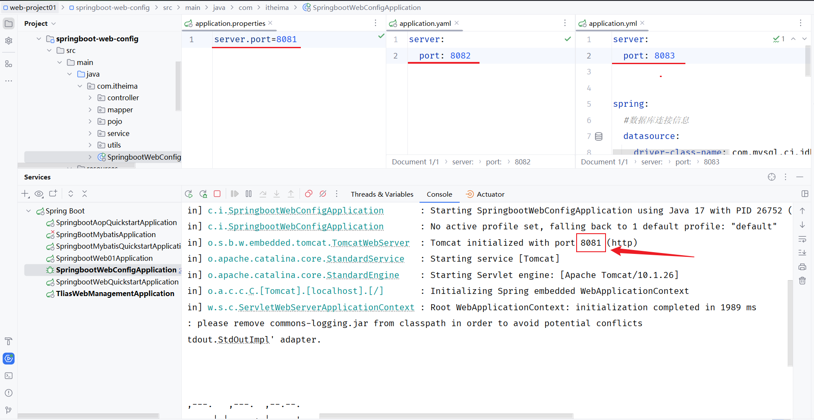
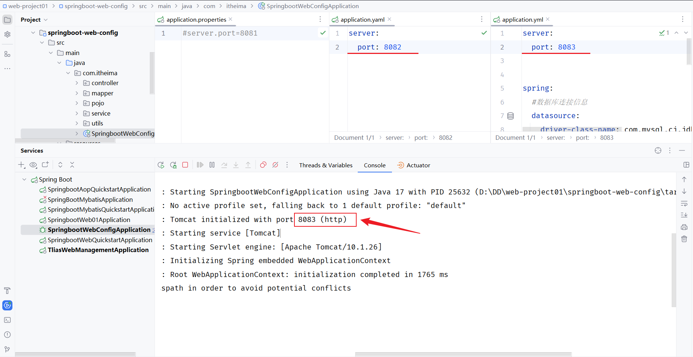
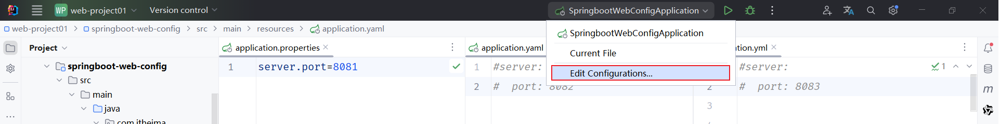
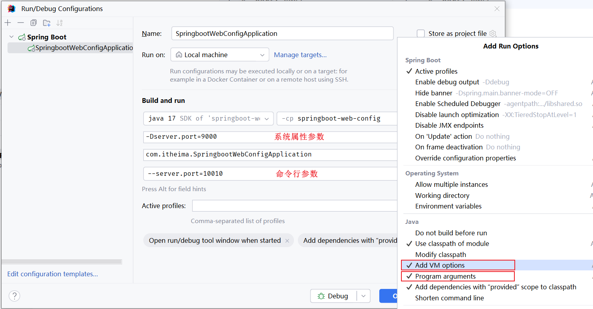
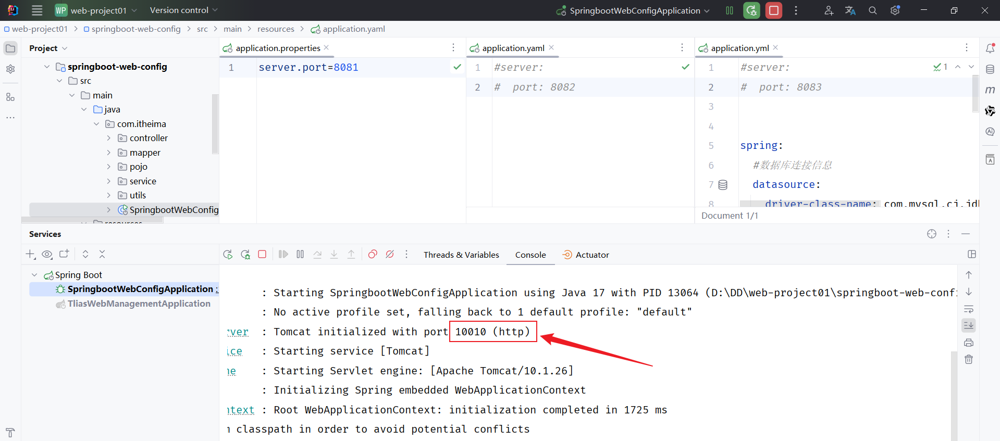
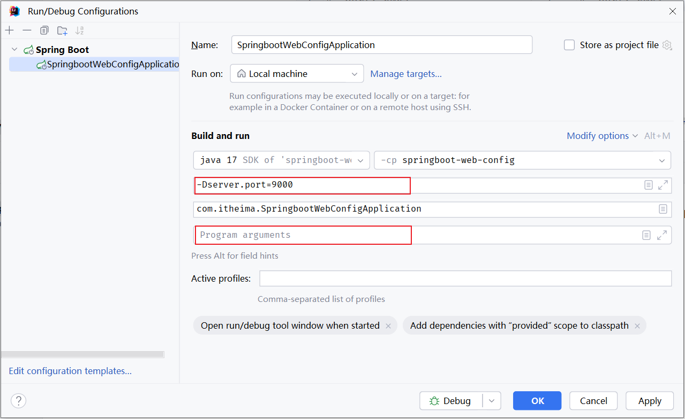
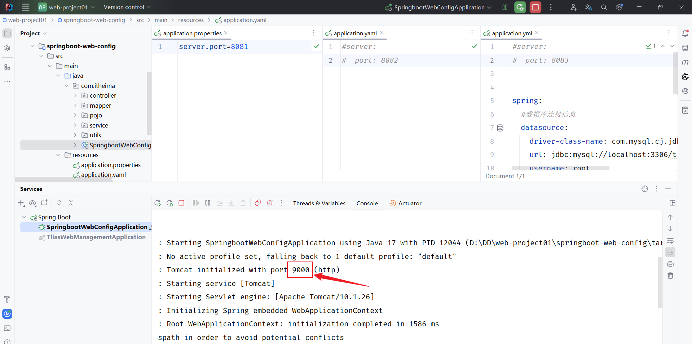
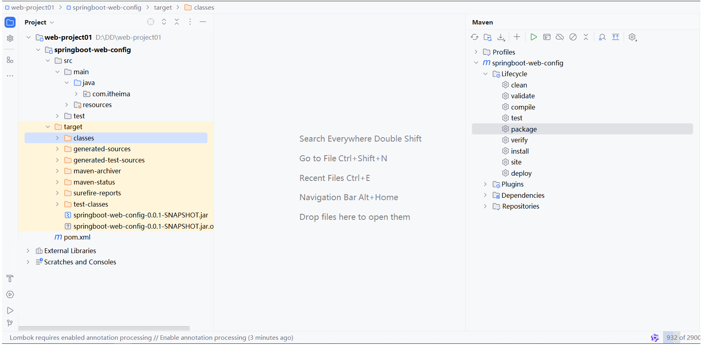
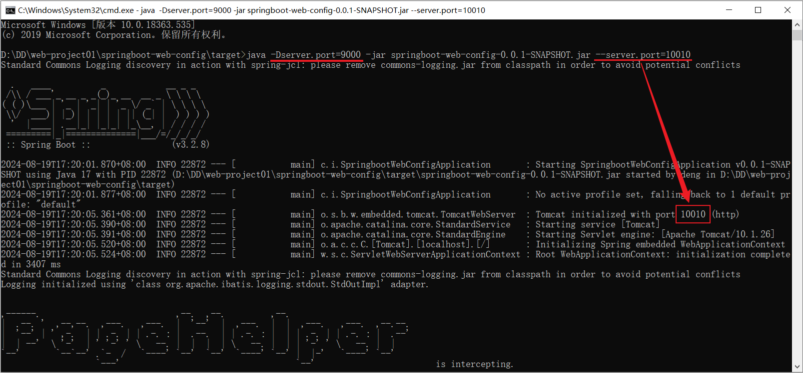
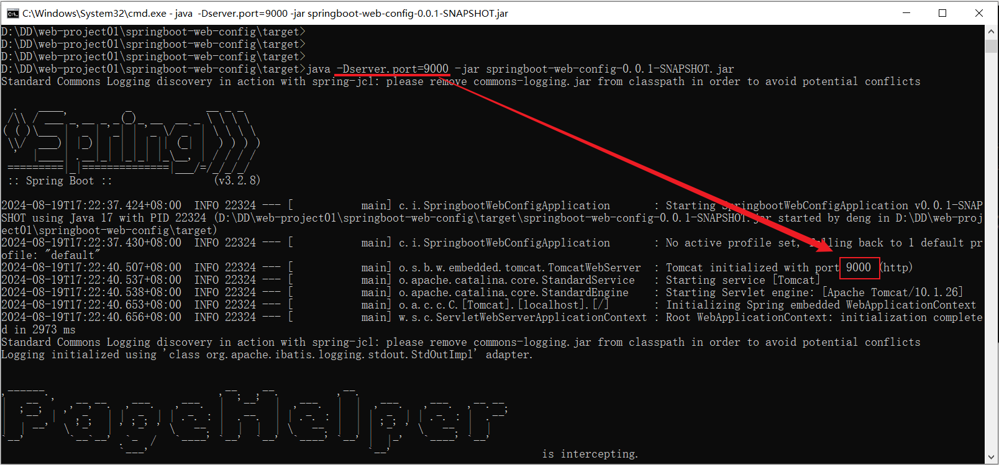

# 配置优先级

在我们前面的课程当中，我们已经讲解了SpringBoot项目当中支持的三类配置文件：

- application\.properties

- application\.yml

- application\.yaml


在SpringBoot项目当中，我们要想配置一个属性，可以通过这三种方式当中的任意一种来配置都可以，那么如果项目中同时存在这三种配置文件，且都配置了同一个属性，如：Tomcat端口号，到底哪一份配置文件生效呢？

- application\.properties

```Properties
server.port=8081
```

- application\.yml

```YAML
server:
   port: 8082
```

- application\.yaml

```YAML
server:
   port: 8082
```


我们启动SpringBoot程序，测试下三个配置文件中哪个Tomcat端口号生效：

- properties、yaml、yml三种配置文件同时存在。 配置好了，启动服务，测试一下：



properties、yaml、yml三种配置文件，优先级最高的是properties


- yaml、yml两种配置文件同时存在



yaml、yml 两种配置文件，优先级最高的是yml。

**配置文件优先级排名（从高到低）：**

1. properties配置文件

2. yml配置文件

3. yaml配置文件

**注意事项：**虽然springboot支持多种格式配置文件，但是在项目开发时，推荐统一使用一种格式的配置。（yml是主流）


在SpringBoot项目当中除了以上3种配置文件外，SpringBoot为了增强程序的扩展性，除了支持配置文件的配置方式以外，还支持另外两种常见的配置方式：

1. Java系统属性配置 （格式： \-Dkey=value）

```YAML
-Dserver.port=9000
```


2. 命令行参数 （格式：\-\-key=value）

```YAML
--server.port=10010
```


那在idea当中运行程序时，如何来指定Java系统属性和命令行参数呢？

- 编辑启动程序的配置信息



打开之后，选择 `Modify options` , 选择 `Add VM options`, `Program arguments`



重启服务，同时配置Tomcat端口\(application\.properties、系统属性、命令行参数\)，测试哪个Tomcat端口号生效：



说明，命令行参数的优先级时最高的，同时配置的情况下，命令行参数的配置项生效。


删除命令行参数配置，重启SpringBoot服务：






**五种配置方式的优先级：** 命令行参数 \>  系统属性参数 \> properties参数 \> yml参数 \> yaml参数


思考：如果项目已经打包上线了，这个时候我们又如何来设置Java系统属性和命令行参数呢？

```YAML
java -Dserver.port=9000 -jar XXXXX.jar --server.port=10010
```


下面我们来演示下打包程序运行时指定Java系统属性和命令行参数：

1. 执行maven打包指令package，把项目打成jar文件




2. 使用命令：java \-jar 方式运行jar文件程序。

同时设置Java系统属性和命令行参数



仅设置Java系统属性




**注意事项：**

- Springboot项目进行打包时，需要引入插件 `spring-boot-maven-plugin` \(基于官网骨架创建项目，会自动添加该插件\)


在SpringBoot项目当中，常见的属性配置方式有5种， 3种配置文件，加上2种外部属性的配置\(Java系统属性、命令行参数\)。通过以上的测试，我们也得出了优先级\(从低到高\)：

- application\.yaml（忽略）

- application\.yml

- application\.properties

- java系统属性（\-Dxxx=xxx）

- 命令行参数（\-\-xxx=xxx）


