# HTTP协议

## HTTP概述

### 介绍

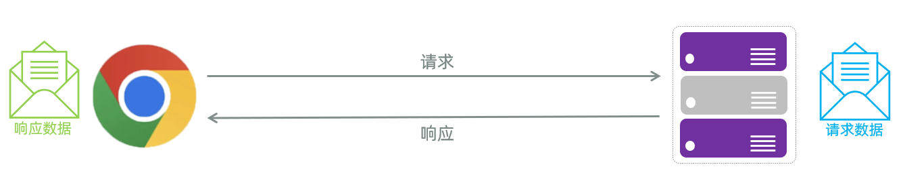

**HTTP**：Hyper Text Transfer Protocol\(超文本传输协议\)，规定了浏览器与服务器之间数据传输的规则。

- http是互联网上应用最为广泛的一种网络协议 

- http协议要求：浏览器在向服务器发送请求数据时，或是服务器在向浏览器发送响应数据时，都必须按照固定的格式进行数据传输


如果想知道http协议的数据传输格式有哪些，可以打开浏览器，点击`F12`打开开发者工具，点击`Network(网络)`来查看

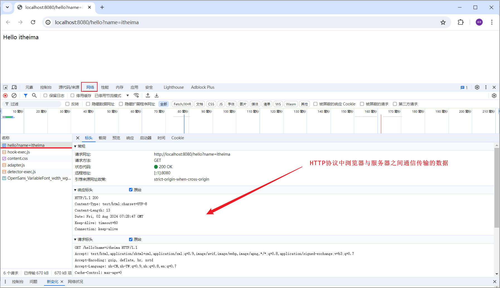


浏览器向服务器进行请求时，服务器按照固定的格式进行解析：

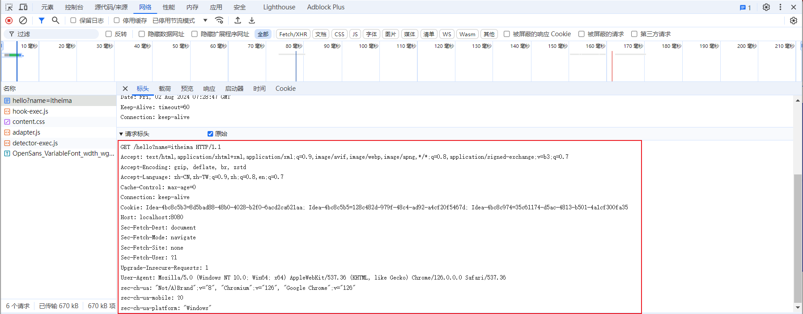


服务器向浏览器进行响应时，浏览器按照固定的格式进行解析：

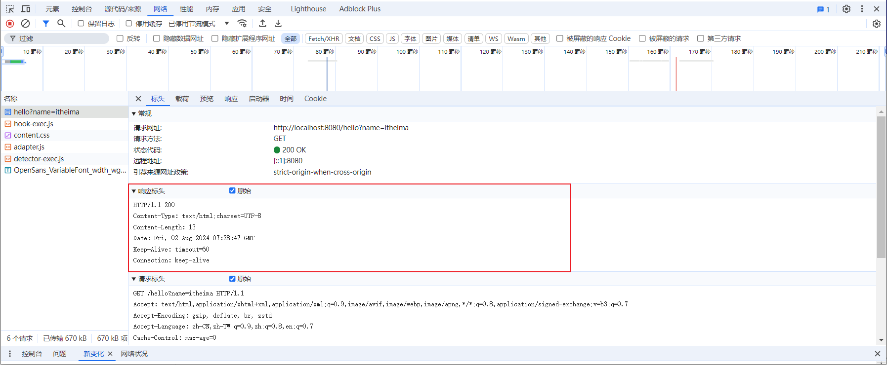

而我们学习HTTP协议，就是来学习请求和响应数据的具体格式内容。


### 特点

我们刚才初步认识了HTTP协议，那么我们在看看HTTP协议有哪些特点：

- **基于TCP协议:** 面向连接，安全

> TCP是一种面向连接的\(建立连接之前是需要经过三次握手\)、可靠的、基于字节流的传输层通信协议，在数据传输方面更安全
> 
> 


- **基于请求\-响应模型:**   一次请求对应一次响应（先请求后响应）

> 请求和响应是一一对应关系，没有请求，就没有响应
> 
> 


- **HTTP协议是****无状态协议****:**  对于数据没有记忆能力。每次请求\-响应都是独立的

> 无状态指的是客户端发送HTTP请求给服务端之后，服务端根据请求响应数据，响应完后，不会记录任何信息。
> 
> - 缺点:  多次请求间不能共享数据
> 
> - 优点:  速度快
> 
> 
> 
> - 请求之间无法共享数据会引发的问题：
> 
>     - 如：京东购物。加入购物车和去购物车结算是两次请求
> 
>     - 由于HTTP协议的无状态特性，加入购物车请求响应结束后，并未记录加入购物车是何商品
> 
>     - 发起去购物车结算的请求后，因为无法获取哪些商品加入了购物车，会导致此次请求无法正确展示数据
> 
> 
> 
> - 具体使用的时候，我们发现京东是可以正常展示数据的，原因是Java早已考虑到这个问题，并提出了使用会话技术\(Cookie、Session\)来解决这个问题。具体如何来做，我们后面课程中会讲到。
> 
> 


刚才提到HTTP协议是规定了请求和响应数据的格式，那具体的格式是什么呢? 接下来，我们就来详细剖析。

HTTP协议又分为：请求协议和响应协议


## HTTP请求协议

### 介绍

- **请求****协议****：**浏览器将数据以请求格式发送到服务器。包括：**请求行、****请求头 、请求体**


- **GET方式的请求协议：**

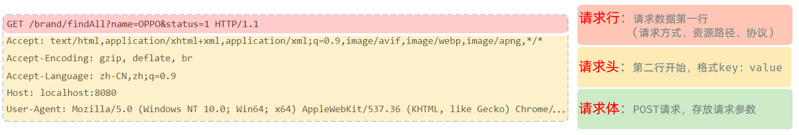

- **请求行**\(以上图中红色部分\) ：HTTP请求中的第一行数据。由：`请求方式`、`资源路径`、`协议/版本`组成（之间使用空格分隔）

    - 请求方式：GET  

    - 资源路径：/brand/findAll?name=OPPO\&status=1

        - 请求路径：/brand/findAll

        - 请求参数：name=OPPO\&status=1

            - 请求参数是以key=value形式出现

            - 多个请求参数之间使用`&`连接

        - 请求路径和请求参数之间使用`?`连接                          

    - 协议/版本：HTTP/1\.1  

- **请求头**\(以上图中黄色部分\) ：第二行开始，上图黄色部分内容就是请求头。格式为key: value形式 

    - http是个无状态的协议，所以在请求头设置浏览器的一些自身信息和想要响应的形式。这样服务器在收到信息后，就可以知道是谁，想干什么了

    - 常见的HTTP请求头有:

        |        请求头|        含义|
        |---|---|
        |        Host|        表示请求的主机名|
        |        User\-Agent|        浏览器版本。 例如：Chrome浏览器的标识类似Mozilla/5\.0 \.\.\.Chrome/79 ，IE浏览器的标识类似Mozilla/5\.0 \(Windows NT \.\.\.\)like Gecko|
        |        Accept|        表示浏览器能接收的资源类型，如text/\*，image/\*或者\*/\*表示所有；|
        |        Accept\-Language|        表示浏览器偏好的语言，服务器可以据此返回不同语言的网页；|
        |        Accept\-Encoding|        表示浏览器可以支持的压缩类型，例如gzip, deflate等。|
        |        Content\-Type|        请求主体的数据类型|
        |        Content\-Length|        数据主体的大小（单位：字节）|

> 举例说明：服务端可以根据请求头中的内容来获取客户端的相关信息，有了这些信息服务端就可以处理不同的业务需求。
> 
> 比如:
> 
> - 不同浏览器解析HTML和CSS标签的结果会有不一致，所以就会导致相同的代码在不同的浏览器会出现不同的效果
> 
> - 服务端根据客户端请求头中的数据获取到客户端的浏览器类型，就可以根据不同的浏览器设置不同的代码来达到一致的效果（这就是我们常说的浏览器兼容问题）
> 
> 


- 请求体 ：存储请求参数

    - GET请求的请求参数在请求行中，故不需要设置请求体


**POST方式的请求协议：**

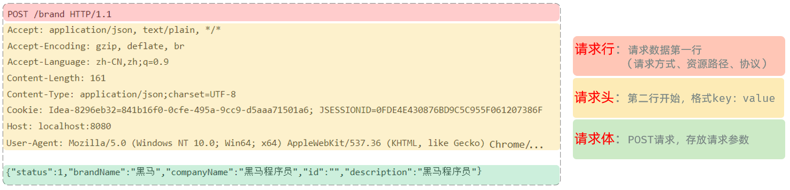

- **请求行**\(以上图中红色部分\)：包含请求方式、资源路径、协议/版本

    - 请求方式：POST

    - 资源路径：/brand

    - 协议/版本：HTTP/1\.1

- **请求头**\(以上图中黄色部分\)   

- **请求体**\(以上图中绿色部分\) ：存储请求参数 

    - 请求体和请求头之间是有一个空行隔开（作用：用于标记请求头结束）


GET请求和POST请求的区别：

|**区别方式**|**GET请求**|**POST请求**|
|---|---|---|
|请求参数|请求参数在请求行中。\<br/\>例：/brand/findAll?name=OPPO\&status=1|请求参数在请求体中|
|请求参数长度|请求参数长度有限制\(浏览器不同限制也不同\)|请求参数长度没有限制|
|安全性|安全性低。原因：请求参数暴露在浏览器地址栏中。|安全性相对高|


### 获取请求数据

Web服务器（Tomcat）对HTTP协议的请求数据进行解析，并进行了封装\(HttpServletRequest\)，并在调用Controller方法的时候传递给了该方法。这样，就使得程序员不必直接对协议进行操作，让Web开发更加便捷。

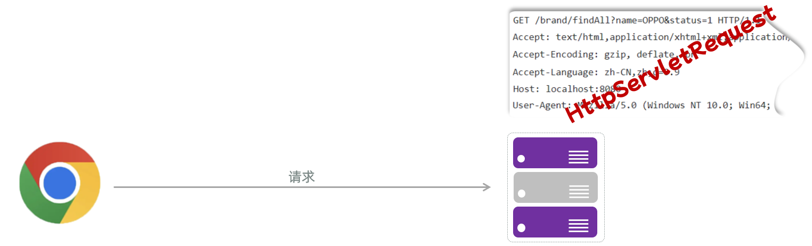


代码演示如下：

```Java
@RestController
public class RequestController {

    */***
*     * 请求路径 http://localhost:8080/request?name=Tom&age=18*
*     * @param request*
*     * @return*
*     */*
*    *@RequestMapping("/request")
    public String request(HttpServletRequest request){
        //1.获取请求参数 name, age
        String name = request.getParameter("name");
        String age = request.getParameter("age");
        System.*out*.println("name = " + name + ", age = " + age);
        
        //2.获取请求路径
        String uri = request.getRequestURI();
        String url = request.getRequestURL().toString();
        System.*out*.println("uri = " + uri);
        System.*out*.println("url = " + url);
        
        //3.获取请求方式
        String method = request.getMethod();
        System.*out*.println("method = " + method);
        
        //4.获取请求头
        String header = request.getHeader("User-Agent");
        System.*out*.println("header = " + header);
        return "request success";
    }

}
```

最终输出内容如下所示：

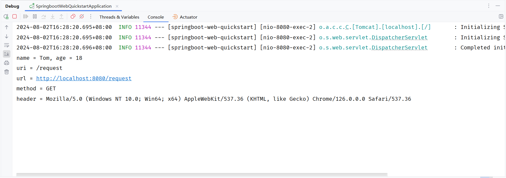


## HTTP响应协议

### 格式介绍

- 响应协议：服务器将数据以响应格式返回给浏览器。包括：**响应行 ****、响应头 、响应体**

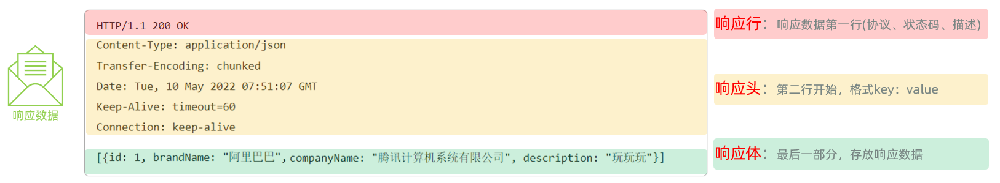

- 响应行\(以上图中红色部分\)：响应数据的第一行。响应行由`协议及版本`、`响应状态码`、`状态码描述`组成

    - 协议/版本：HTTP/1\.1

    - 响应状态码：200

    - 状态码描述：OK

- 响应头\(以上图中黄色部分\)：响应数据的第二行开始。格式为key：value形式

    - http是个无状态的协议，所以可以在请求头和响应头中设置一些信息和想要执行的动作，这样，对方在收到信息后，就可以知道你是谁，你想干什么

    - 常见的HTTP响应头有:

    ```Java
    Content-Type：表示该响应内容的类型，例如text/html，image/jpeg ；
    
    Content-Length：表示该响应内容的长度（字节数）；
    
    Content-Encoding：表示该响应压缩算法，例如gzip ；
    
    Cache-Control：指示客户端应如何缓存，例如max-age=300表示可以最多缓存300秒 ;
    
    Set-Cookie: 告诉浏览器为当前页面所在的域设置cookie ;
    ```

- 响应体\(以上图中绿色部分\)： 响应数据的最后一部分。存储响应的数据

    - 响应体和响应头之间有一个空行隔开（作用：用于标记响应头结束）


### 响应状态码

关于响应状态码，我们先主要认识三个状态码，其余的等后期用到了再去掌握：

- `200 ok`   客户端请求成功

- `404 Not Found`  请求资源不存在

- `500 Internal Server Error`  服务端发生不可预期的错误


### 设置响应数据

Web服务器对HTTP协议的响应数据进行了封装\(HttpServletResponse\)，并在调用Controller方法的时候传递给了该方法。这样，就使得程序员不必直接对协议进行操作，让Web开发更加便捷。

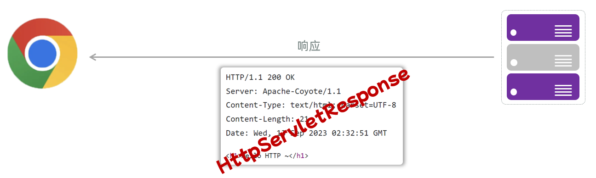

代码演示：

```Java
package com.itheima;

import jakarta.servlet.http.HttpServletResponse;
import org.springframework.http.ResponseEntity;
import org.springframework.web.bind.annotation.RequestMapping;
import org.springframework.web.bind.annotation.RestController;

import java.io.IOException;

@RestController
public class ResponseController {

    @RequestMapping("/response")
    public void response(HttpServletResponse response) throws IOException {
        //1.设置响应状态码
        response.setStatus(401);
        //2.设置响应头
        response.setHeader("name","itcast");
        //3.设置响应体
        response.setContentType("text/html;charset=utf-8");
        response.setCharacterEncoding("utf-8");
        response.getWriter().write("<h1>hello response</h1>");
    }

    @RequestMapping("/response2")
    public ResponseEntity<String> response2(HttpServletResponse response) throws IOException {
        return ResponseEntity
                .*status*(401)
                .header("name","itcast")
                .body("<h1>hello response</h1>");
    }

}
```

浏览器访问测试：

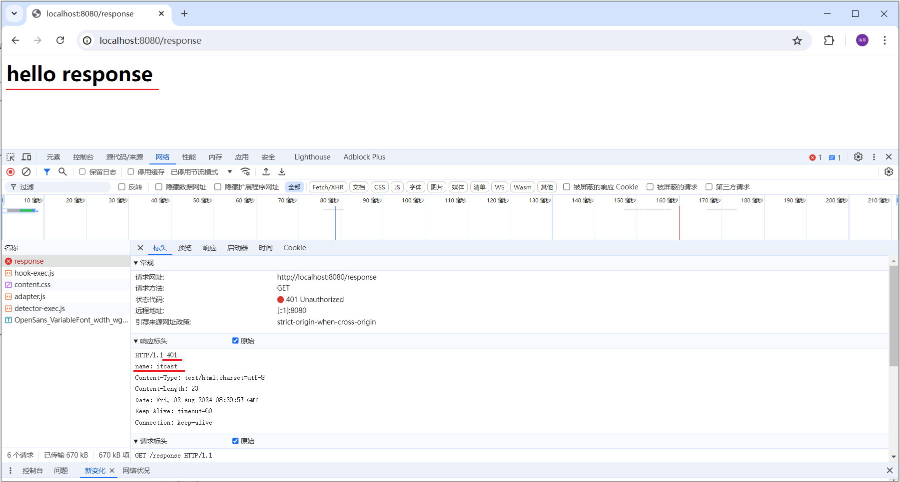


响应状态码 和 响应头如果没有特殊要求的话，通常不手动设定。服务器会根据请求处理的逻辑，自动设置响应状态码和响应头。


