# 分层解耦

## 三层架构

### 介绍

在我们进行程序设计以及程序开发时，尽可能让每一个接口、类、方法的职责更单一些（单一职责原则）。

> 单一职责原则：一个类或一个方法，就只做一件事情，只管一块功能。
> 
> 这样就可以让类、接口、方法的复杂度更低，可读性更强，扩展性更好，也更利于后期的维护。
> 
> 


我们之前开发的程序呢，并不满足单一职责原则。下面我们来分析下之前的程序：

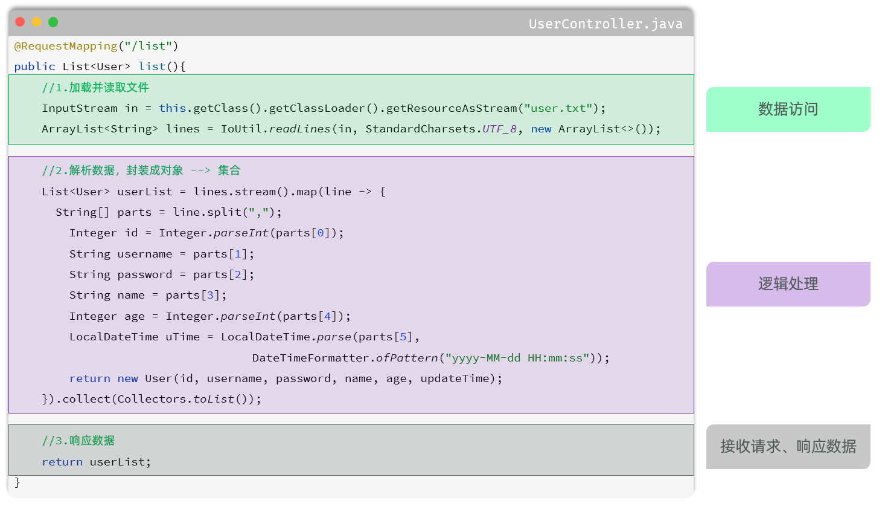


那其实我们上述案例的处理逻辑呢，从组成上看可以分为三个部分：

- 数据访问：负责业务数据的维护操作，包括增、删、改、查等操作。

- 逻辑处理：负责业务逻辑处理的代码。

- 请求处理、响应数据：负责，接收页面的请求，给页面响应数据。


按照上述的三个组成部分，在我们项目开发中呢，可以将代码分为三层，如图所示：

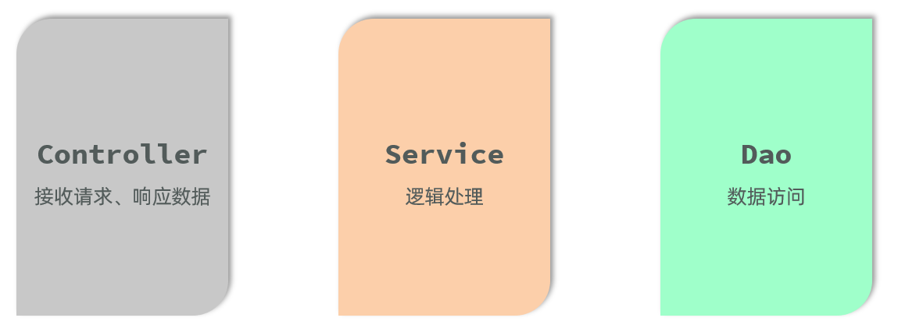

- Controller：控制层。接收前端发送的请求，对请求进行处理，并响应数据。

- Service：业务逻辑层。处理具体的业务逻辑。

- Dao：数据访问层\(Data Access Object\)，也称为持久层。负责数据访问操作，包括数据的增、删、改、查。


基于三层架构的程序执行流程，如图所示：

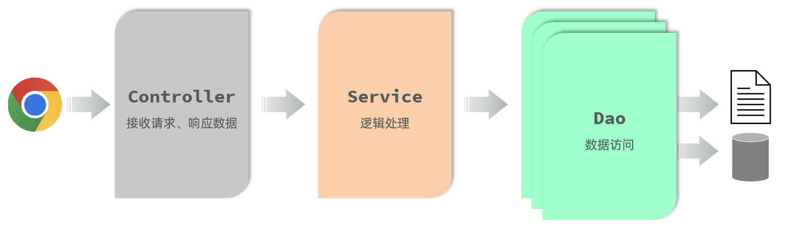

- 前端发起的请求，由Controller层接收（Controller响应数据给前端）

- Controller层调用Service层来进行逻辑处理（Service层处理完后，把处理结果返回给Controller层）

- Serivce层调用Dao层（逻辑处理过程中需要用到的一些数据要从Dao层获取）

- Dao层操作文件中的数据（Dao拿到的数据会返回给Service层）

> 思考：按照三层架构的思想，如果要对业务逻辑\(Service层\)进行变更，会影响到Controller层和Dao层吗？ 
> 
> 答案：不会影响。 （程序的扩展性、维护性变得更好了）
> 
> 


### 代码拆分

我们使用三层架构思想，来改造下之前的程序：

- 控制层包名：`com.itheima.controller`

- 业务逻辑层包名：`com.itheima.service`

- 数据访问层包名：`com.itheima.dao`


**1\)\. 控制层：接收前端发送的请求，对请求进行处理，并响应数据**

在 `com.itheima.controller` 中创建UserController类，代码如下：

```Java
package com.itheima.controller;

import com.itheima.pojo.User;
import com.itheima.service.UserService;
import com.itheima.service.impl.UserServiceImpl;
import org.springframework.web.bind.annotation.RequestMapping;
import org.springframework.web.bind.annotation.RestController;
import java.util.List;

@RestController
public class UserController {
    
    private UserService userService = new UserServiceImpl();

    @RequestMapping("/list")
    public List<User> list(){
        //1.调用Service
        List<User> userList = userService.findAll();
        //2.响应数据
        return userList;
    }

}
```


**2\)\. 业务逻辑层：****处理具体的业务逻辑**

在 `com.itheima.service`中创建UserSerivce接口，代码如下：

```Java
package com.itheima.service;

import com.itheima.pojo.User;
import java.util.List;

public interface UserService {

    public List<User> findAll();

}
```

在 `com.itheima.service.``impl` 中创建UserSerivceImpl接口，代码如下：

```Java
package com.itheima.service.impl;

import com.itheima.dao.UserDao;
import com.itheima.dao.impl.UserDaoImpl;
import com.itheima.pojo.User;
import com.itheima.service.UserService;

import java.time.LocalDateTime;
import java.time.format.DateTimeFormatter;
import java.util.List;
import java.util.stream.Collectors;

public class UserServiceImpl implements UserService {

    private UserDao userDao = new UserDaoImpl();

    @Override
    public List<User> findAll() {
        List<String> lines = userDao.findAll();
        List<User> userList = lines.stream().map(line -> {
            String[] parts = line.split(",");
            Integer id = Integer.*parseInt*(parts[0]);
            String username = parts[1];
            String password = parts[2];
            String name = parts[3];
            Integer age = Integer.*parseInt*(parts[4]);
            LocalDateTime updateTime = LocalDateTime.*parse*(parts[5], DateTimeFormatter.*ofPattern*("yyyy-MM-dd HH:mm:ss"));
            return new User(id, username, password, name, age, updateTime);
        }).collect(Collectors.*toList*());
        return userList;
    }
}
```


**3\)\. 数据访问层：负责数据的访问操作，包含数据的增、删、改、查**

在 `com.itheima.dao`中创建UserDao接口，代码如下：

```Java
package com.itheima.dao;

import java.util.List;

public interface UserDao {

    public List<String> findAll();

}
```

在 `com.itheima.dao.impl` 中创建UserDaoImpl接口，代码如下：

```Java
package com.itheima.dao.impl;

import cn.hutool.core.io.IoUtil;
import com.itheima.dao.UserDao;

import java.io.InputStream;
import java.nio.charset.StandardCharsets;
import java.util.ArrayList;
import java.util.List;

public class UserDaoImpl implements UserDao {
    @Override
    public List<String> findAll() {
        InputStream in = this.getClass().getClassLoader().getResourceAsStream("user.txt");
        ArrayList<String> lines = IoUtil.*readLines*(in, StandardCharsets.*UTF_8*, new ArrayList<>());
        return lines;
    }
}
```


具体的请求调用流程：

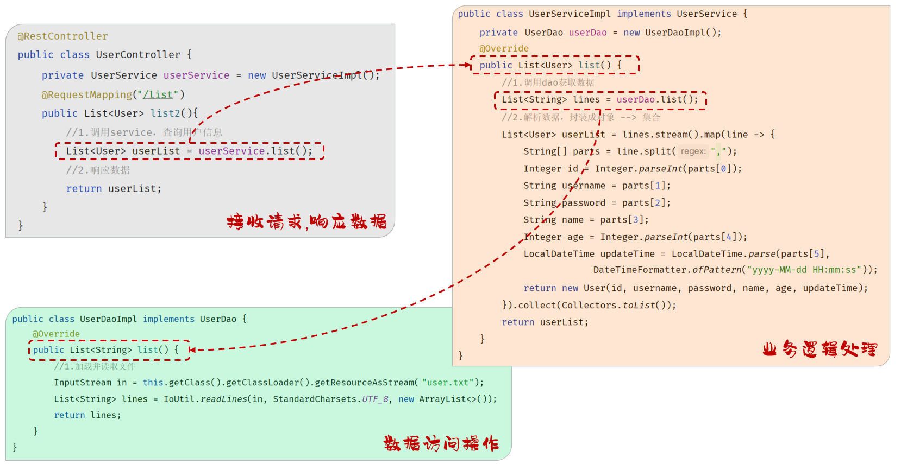


三层架构的好处：

1. 复用性强

2. 便于维护

3. 利用扩展


## 分层解耦

### 问题分析

由于我们现在在程序中，需要什么对象，直接new一个对象 `new UserServiceImpl()`  。

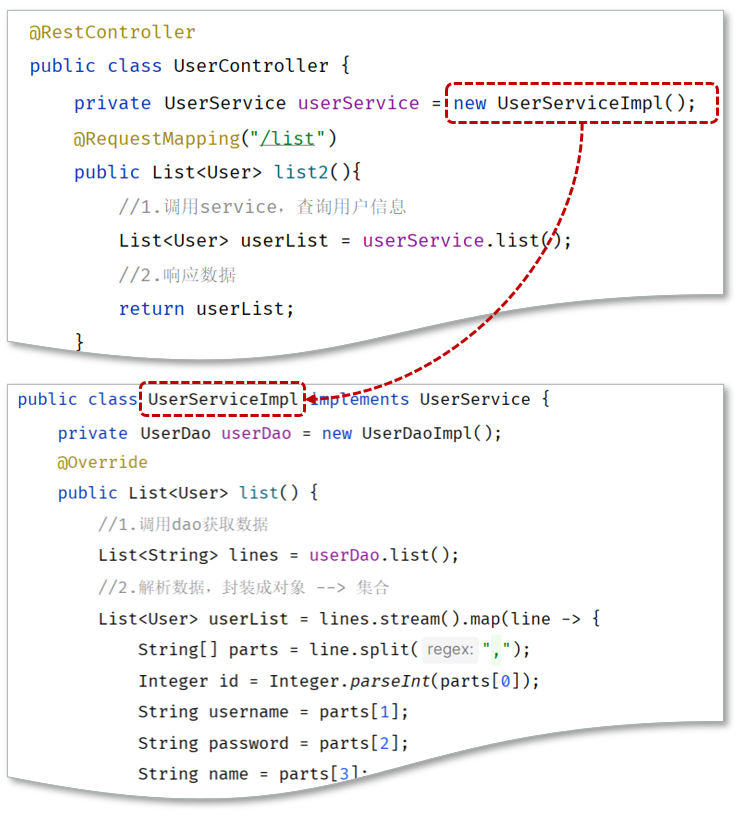


如果说我们需要更换实现类，比如由于业务的变更，UserServiceImpl 不能满足现有的业务需求，我们需要切换为 UserServiceImpl2 这套实现，就需要修改Contorller的代码，需要创建 UserServiceImpl2 的实现`new UserServiceImpl2()` 。

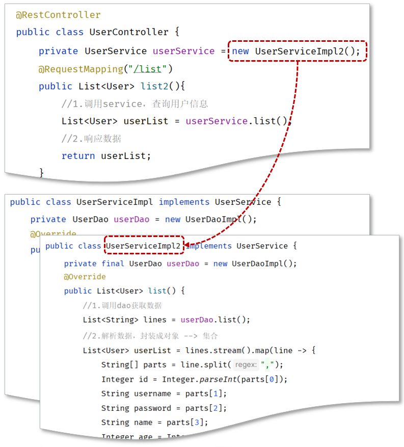

Service中调用Dao，也是类似的问题。这种呢，我们就称之为层与层之间 **耦合** 了。 那什么是耦合呢 ？

首先需要了解软件开发涉及到的两个概念：内聚和耦合。

- **内聚：**软件中各个功能模块内部的功能联系。

- **耦合：**衡量软件中各个层/模块之间的依赖、关联的程度。


**软件设计原则：高内聚低耦合。**

> **高内聚****：**指的是一个模块中各个元素之间的联系的紧密程度，如果各个元素\(语句、程序段\)之间的联系程度越高，则内聚性越高，即 "高内聚"。
> 
> **低耦合：**指的是软件中各个层、模块之间的依赖关联程序越低越好。
> 
> 


目前层与层之间是存在耦合的，Controller耦合了Service、Service耦合了Dao。而 高内聚、低耦合的目的是使程序模块的可重用性、移植性大大增强。

那最终我们的目标呢，就是做到层与层之间，尽可能的降低耦合，甚至解除耦合。

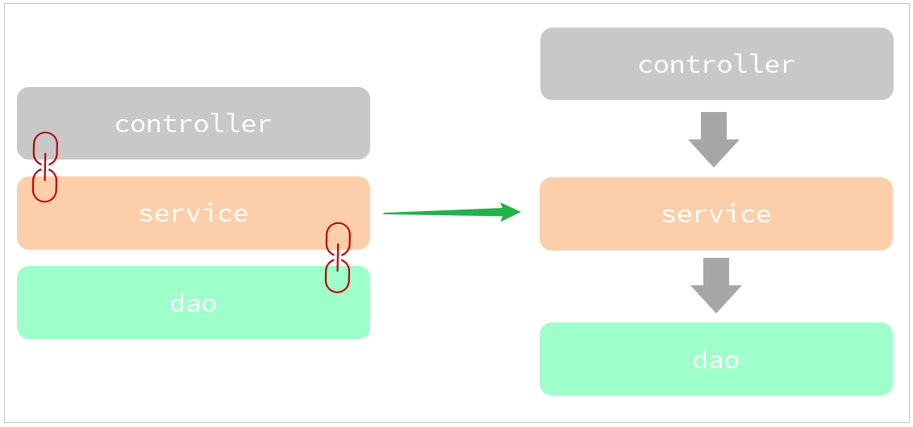


### 解耦思路

之前我们在编写代码时，需要什么对象，就直接new一个就可以了。 这种做法呢，层与层之间代码就耦合了，当service层的实现变了之后， 我们还需要修改controller层的代码。

那应该怎么解耦呢？


**1\)\. 首先不能在EmpController中使用new对象。代码如下：**

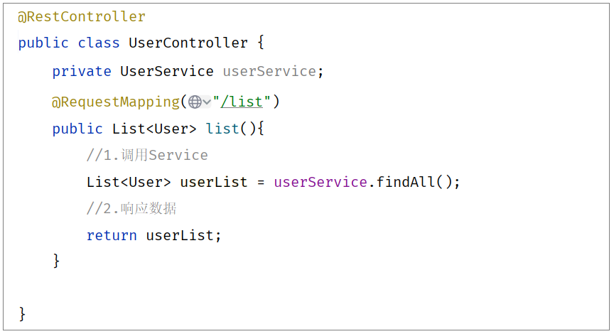

此时，就存在另一个问题了，不能new，就意味着没有业务层对象（程序运行就报错），怎么办呢? 

我们的解决思路是：

- 提供一个容器，容器中存储一些对象\(例：UserService对象\)

- Controller程序从容器中获取UserService类型的对象


**2\)\. 将要用到的对象交给一个容器管理。**

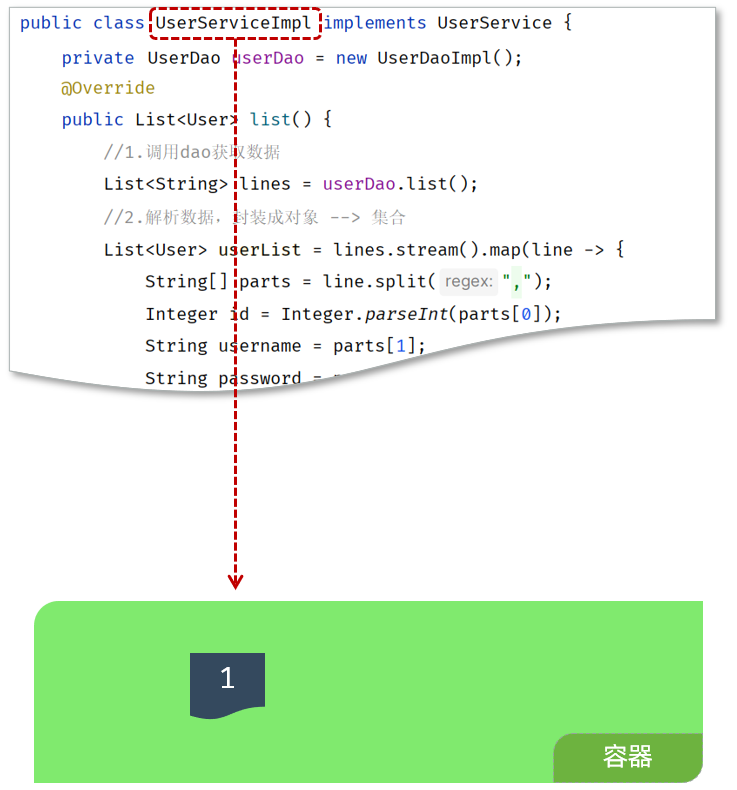


**3\)\. 应用程序中用到这个对象，就直接从容器中获取**

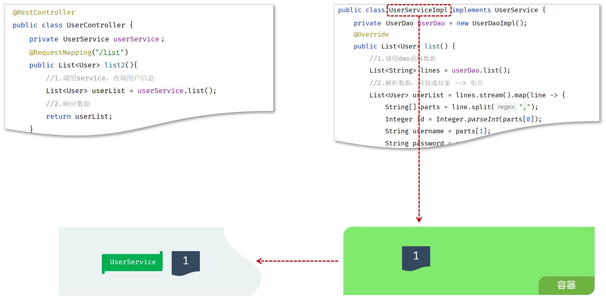

那问题来了，我们如何将对象交给容器管理呢？ 程序运行时，容器如何为程序提供依赖的对象呢？ 


我们想要实现上述解耦操作，就涉及到Spring中的两个核心概念：

- **控制反转****：** Inversion Of Control，简称**IOC**。对象的创建控制权由程序自身转移到外部（容器），这种思想称为控制反转。

    - 对象的创建权由程序员主动创建转移到容器\(由容器创建、管理对象\)。这个容器称为：IOC容器或Spring容器。

    

- **依赖注入****：** Dependency Injection，简称**DI**。容器为应用程序提供运行时，所依赖的资源，称之为依赖注入。

    - 程序运行时需要某个资源，此时容器就为其提供这个资源。

    - 例：EmpController程序运行时需要EmpService对象，Spring容器就为其提供并注入EmpService对象。


- **bean对象：**IOC容器中创建、管理的对象，称之为：bean对象。


## IOC\&DI入门

**1\)\. 将Service及Dao层的实现类，交给IOC容器管理**

在实现类加上 `@Component` 注解，就代表把当前类产生的对象交给IOC容器管理。

**A\. UserDaoImpl**

```Java
**@Component**
public class UserDaoImpl implements UserDao {
    @Override
    public List<String> findAll() {
        InputStream in = this.getClass().getClassLoader().getResourceAsStream("user.txt");
        ArrayList<String> lines = IoUtil.*readLines*(in, StandardCharsets.*UTF_8*, new ArrayList<>());
        return lines;
    }
}
```


**B\. UserServiceImpl**

```Java
**@****Component**
public class UserServiceImpl implements UserService {

    private UserDao userDao;

    @Override
    public List<User> findAll() {
        List<String> lines = userDao.findAll();
        List<User> userList = lines.stream().map(line -> {
            String[] parts = line.split(",");
            Integer id = Integer.*parseInt*(parts[0]);
            String username = parts[1];
            String password = parts[2];
            String name = parts[3];
            Integer age = Integer.*parseInt*(parts[4]);
            LocalDateTime updateTime = LocalDateTime.*parse*(parts[5], DateTimeFormatter.*ofPattern*("yyyy-MM-dd HH:mm:ss"));
            return new User(id, username, password, name, age, updateTime);
        }).collect(Collectors.*toList*());
        return userList;
    }
}
```


**2\)\. 为Controller 及 Service注入运行时所依赖的对象**

**A\. UserServiceImpl**

```Java
@Component
public class UserServiceImpl implements UserService {

    **@Autowired**
    private UserDao userDao;
    
    @Override
    public List<User> findAll() {
        List<String> lines = userDao.findAll();
        List<User> userList = lines.stream().map(line -> {
            String[] parts = line.split(",");
            Integer id = Integer.*parseInt*(parts[0]);
            String username = parts[1];
            String password = parts[2];
            String name = parts[3];
            Integer age = Integer.*parseInt*(parts[4]);
            LocalDateTime updateTime = LocalDateTime.*parse*(parts[5], DateTimeFormatter.*ofPattern*("yyyy-MM-dd HH:mm:ss"));
            return new User(id, username, password, name, age, updateTime);
        }).collect(Collectors.*toList*());
        return userList;
    }
}
```


**B\. UserController**

```Java
@RestController
public class UserController {
    
    **@Autowired**
    private UserService userService;

    @RequestMapping("/list")
    public List<User> list(){
        //1.调用Service
        List<User> userList = userService.findAll();
        //2.响应数据
        return userList;
    }

}
```


启动服务，运行测试。 打开浏览器，地址栏直接访问：`http://localhost:8080/user.html`。依然正常访问，就说明入门程序完成了。已经完成了层与层之间的解耦。

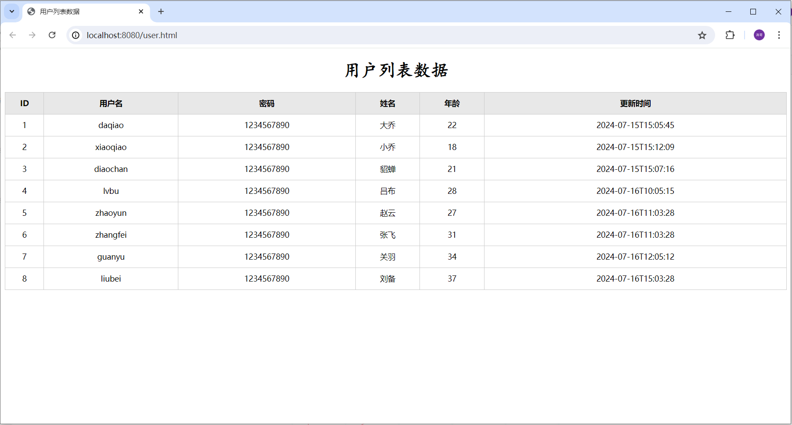


## IOC详解

通过IOC和DI的入门程序呢，我们已经基本了解了IOC和DI的基础操作。接下来呢，我们学习下IOC控制反转和DI依赖注入的细节。

#### 4\.3\.4\.1 Bean的声明

前面我们提到IOC控制反转，就是将对象的控制权交给Spring的IOC容器，由IOC容器创建及管理对象。IOC容器创建的对象称为bean对象。

在之前的入门案例中，要把某个对象交给IOC容器管理，需要在类上添加一个注解：**`@Component`**

而Spring框架为了更好的标识web应用程序开发当中，bean对象到底归属于哪一层，又提供了@Component的衍生注解：

|注解|说明|位置|
|---|---|---|
|@Component|声明bean的基础注解|不属于以下三类时，用此注解|
|@Controller|@Component的衍生注解|标注在控制层类上|
|@Service|@Component的衍生注解|标注在业务层类上|
|@Repository|@Component的衍生注解|标注在数据访问层类上（由于与mybatis整合，用的少）|

那么此时，我们就可以使用 `@Service` 注解声明Service层的bean。 使用 `@Repository` 注解声明Dao层的bean。 代码实现如下：

Service层:

```Java
**@Service**
public class UserServiceImpl implements UserService {

    private UserDao userDao;

    @Override
    public List<User> findAll() {
        List<String> lines = userDao.findAll();
        List<User> userList = lines.stream().map(line -> {
            String[] parts = line.split(",");
            Integer id = Integer.*parseInt*(parts[0]);
            String username = parts[1];
            String password = parts[2];
            String name = parts[3];
            Integer age = Integer.*parseInt*(parts[4]);
            LocalDateTime updateTime = LocalDateTime.*parse*(parts[5], DateTimeFormatter.*ofPattern*("yyyy-MM-dd HH:mm:ss"));
            return new User(id, username, password, name, age, updateTime);
        }).collect(Collectors.*toList*());
        return userList;
    }
}
```

Dao层:

```Java
**@Repository**
public class UserDaoImpl implements UserDao {
    @Override
    public List<String> findAll() {
        InputStream in = this.getClass().getClassLoader().getResourceAsStream("user.txt");
        ArrayList<String> lines = IoUtil.*readLines*(in, StandardCharsets.*UTF_8*, new ArrayList<>());
        return lines;
    }
}
```

**注意1**：声明bean的时候，可以通过注解的value属性指定bean的名字，如果没有指定，默认为类名首字母小写。

**注意2**：使用以上四个注解都可以声明bean，但是在springboot集成web开发中，声明控制器bean只能用@Controller。


#### 4\.3\.4\.2 组件扫描

问题：使用前面学习的四个注解声明的bean，一定会生效吗？

答案：不一定。（原因：bean想要生效，还需要被组件扫描）

- 前面声明bean的四大注解，要想生效，还需要被组件扫描注解 `@ComponentScan` 扫描。

- 该注解虽然没有显式配置，但是实际上已经包含在了启动类声明注解 `@SpringBootApplication` 中，默认扫描的范围是启动类所在包及其子包。

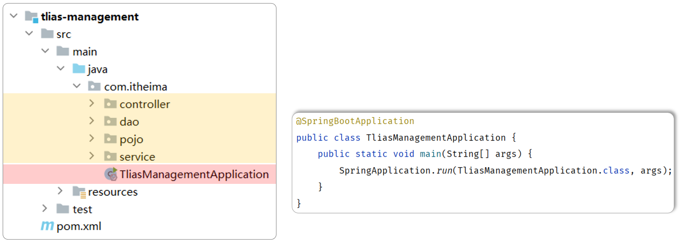

所以，我们在项目开发中，只需要按照如上项目结构，将项目中的所有的业务类，都放在启动类所在包的子包中，就无需考虑组件扫描问题。


## DI详解

上一小节我们讲解了控制反转IOC的细节，接下来呢，我们学习依赖注解DI的细节。

依赖注入，是指IOC容器要为应用程序去提供运行时所依赖的资源，而资源指的就是对象。

在入门程序案例中，我们使用了@Autowired这个注解，完成了依赖注入的操作，而这个Autowired翻译过来叫：自动装配。

`@Autowired`注解，默认是按照**类型**进行自动装配的（去IOC容器中找某个类型的对象，然后完成注入操作）

> 入门程序举例：在EmpController运行的时候，就要到IOC容器当中去查找EmpService这个类型的对象，而我们的IOC容器中刚好有一个EmpService这个类型的对象，所以就找到了这个类型的对象完成注入操作。
> 
> 


### @Autowired用法

@Autowired 进行依赖注入，常见的方式，有如下三种：

1\)\. 属性注入

```Java
@RestController
public class UserController {

    //方式一: 属性注入
    @Autowired
    private UserService userService;
    
  }
```

- 优点：代码简洁、方便快速开发。

- 缺点：隐藏了类之间的依赖关系、可能会破坏类的封装性。


2\)\. 构造函数注入

```Java
@RestController
public class UserController {

    //方式二: 构造器注入
    private final UserService userService;
    
    @Autowired //如果当前类中只存在一个构造函数, @Autowired可以省略
    public UserController(UserService userService) {
        this.userService = userService;
    }
    
 }   
```

- 优点：能清晰地看到类的依赖关系、提高了代码的安全性。

- 缺点：代码繁琐、如果构造参数过多，可能会导致构造函数臃肿。

- **注意：如果只有一个构造函数，@Autowired注解可以省略。（通常来说，也只有一个构造函数）**


3\)\. setter注入

```Java
*/***
* * 用户信息Controller*
* */*
@RestController
public class UserController {
    
    //方式三: setter注入
    private UserService userService;
    
    @Autowired
    public void setUserService(UserService userService) {
        this.userService = userService;
    }
    
}    
```

- 优点：保持了类的封装性，依赖关系更清晰。

- 缺点：需要额外编写setter方法，增加了代码量。


在项目开发中，基于@Autowired进行依赖注入时，基本都是第一种和第二种方式。（官方推荐第二种方式，因为会更加规范）但是在企业项目开发中，很多的项目中，也会选择第一种方式因为更加简洁、高效（在规范性方面进行了妥协）。


### 注意事项

那如果在IOC容器中，存在多个相同类型的bean对象，会出现什么情况呢？

在下面的例子中，我们准备了两个UserService的实现类，并且都交给了IOC容器管理。 代码如下：

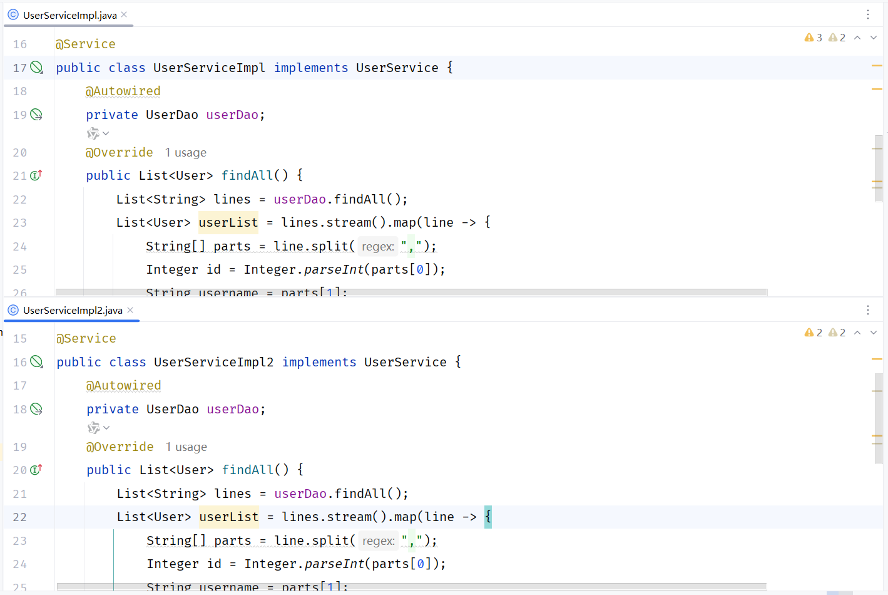

此时，我们启动项目会发现，控制台报错了：

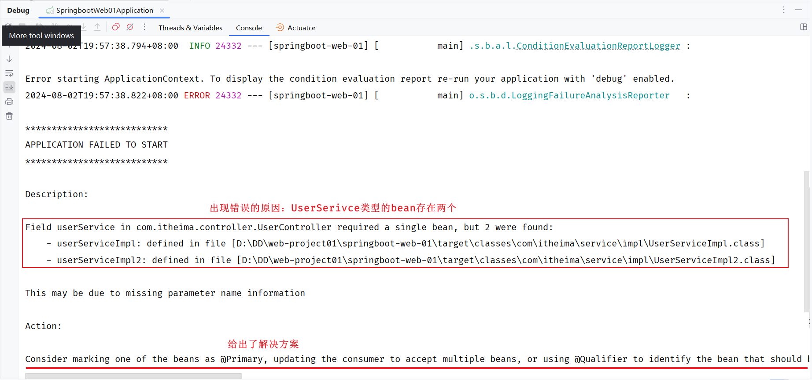

出现错误的原因呢，是因为在Spring的容器中，UserService这个类型的bean存在两个，框架不知道具体要注入哪个bean使用，所以就报错了。


如何解决上述问题呢？Spring提供了以下几种解决方案：

- @Primary

- @Qualifier

- @Resource


**方案一：****使用@Primary注解**

当存在多个相同类型的Bean注入时，加上@Primary注解，来确定默认的实现。

```Java
**@Primary**
@Service
public class UserServiceImpl implements UserService {
}
```


**方案二：使用@Qualifier注解**

指定当前要注入的bean对象。 在@Qualifier的value属性中，指定注入的bean的名称。 @Qualifier注解不能单独使用，必须配合@Autowired使用。

```Java
@RestController
public class UserController {

    **@Qualifier("userServiceImpl")**
    @Autowired
    private UserService userService;
```


**方案三：使用@Resource注解**

是按照bean的名称进行注入。通过name属性指定要注入的bean的名称。

```Java
@RestController
public class UserController {
        
    **@Resource(name = "****userServiceImpl****")**
    private UserService userService;
```


面试题：@Autowird 与 @Resource的区别

- @Autowired 是spring框架提供的注解，而@Resource是JDK提供的注解

- @Autowired 默认是按照类型注入，而@Resource是按照名称注入


