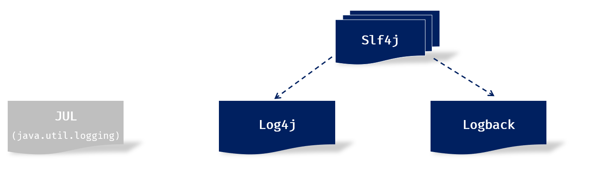
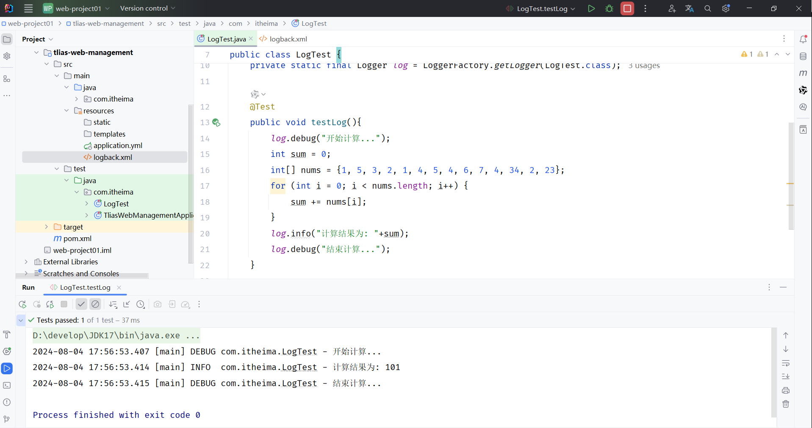

# 日志技术

## 概述

- 什么是日志？

    - 日志就好比生活中的日记，可以随时随地记录你生活中的点点滴滴。

    - 程序中的日志，是用来记录应用程序的运行信息、状态信息、错误信息的。 


- 为什么要在程序中记录日志呢？

    - 便于追踪应用程序中的数据信息、程序的执行过程。

    - 便于对应用程序的性能进行优化。

    - 便于应用程序出现问题之后，排查问题，解决问题。

    - 便于监控系统的运行状态。

    - \.\.\. \.\.\.


- 之前我们编写程序时，也可以通过 `System.out.println(...) `来输出日志，为什么我们还要学习单独的日志技术呢？

这是因为，如果通过  `System.out.println(...) ` 来记录日志，会存在以下几点问题：

- 硬编码。所有的记录日志的代码，都是硬编码，没有办法做到灵活控制，要想不输出这个日志了，只能删除掉记录日志的代码。

- 只能输出日志到控制台。

- 不便于程序的扩展、维护。


所以，在现在的项目开发中，我们一般都会使用专业的日志框架，来解决这些问题。


## 日志框架



- **JUL****：**这是JavaSE平台提供的官方日志框架，也被称为JUL。配置相对简单，但不够灵活，性能较差。

- **Log4j****：**一个流行的日志框架，提供了灵活的配置选项，支持多种输出目标。

- **Logback：**基于Log4j升级而来，提供了更多的功能和配置选项，性能由于Log4j。

- **Slf4j****：**（Simple Logging Facade for Java）简单日志门面，提供了一套日志操作的标准接口及抽象类，允许应用程序使用不同的底层日志框架。


## Logback入门

**1\)\. 准备工作：****引入logback的依赖****（****springboot中无需引入****，****在springboot中已经传递了此依赖****）**

```XML
<dependency>
    <groupId>ch.qos.logback</groupId>
    <artifactId>logback-classic</artifactId>
    <version>1.4.11</version>
</dependency>
```


**2\)\. 引入配置文件 ****`logback.xml`****  （资料中已经提供，拷贝进来，放在 ****`src/main/resources`**** 目录下； 或者直接AI生成）**

```XML
<?xml version="1.0" encoding="UTF-8"?>
<configuration>
    <!-- 控制台输出 -->
    <appender name="STDOUT" class="ch.qos.logback.core.ConsoleAppender">
        <encoder class="ch.qos.logback.classic.encoder.PatternLayoutEncoder">
            <!--格式化输出：%d表示日期，%thread表示线程名，%-5level：级别从左显示5个字符宽度  %msg：日志消息，%n是换行符 -->
            <pattern>%d{yyyy-MM-dd HH:mm:ss.SSS} [%thread] %-5level %logger{50}-%msg%n</pattern>
        </encoder>
    </appender>

    <!-- 日志输出级别 -->
    <root level="ALL">
        <appender-ref ref="STDOUT" />
    </root>
</configuration>
```


**3\)\. 记录日志：定义日志记录对象Logger，记录日志**

```Java
public class LogTest {
    
    //定义日志记录对象
    private static final Logger log = LoggerFactory.getLogger(LogTest.class);

    @Test
    public void testLog(){
        log.debug("开始计算...");
        int sum = 0;
        int[] nums = {1, 5, 3, 2, 1, 4, 5, 4, 6, 7, 4, 34, 2, 23};
        for (int i = 0; i < nums.length; i++) {
            sum += nums[i];
        }
        log.info("计算结果为: "+sum);
        log.debug("结束计算...");
    }

}
```

运行单元测试，可以在控制台中看到输出的日志，如下所示：



我们可以看到在输出的日志信息中，不仅输出了日志的信息，还包括：日志的输出时间、线程名、具体在那个类中输出的。 


## Logback配置文件

Logback日志框架的配置文件叫 `logback.xml` 。 

该配置文件是对Logback日志框架输出的日志进行控制的，可以来配置输出的格式、位置及日志开关等。

常用的两种输出日志的位置：控制台、系统文件。


**1\)\. 如果需要输出日志到控制台。添加如下配置：**

```XML
<!-- 控制台输出 -->
<appender name="STDOUT" class="ch.qos.logback.core.ConsoleAppender">
    <encoder class="ch.qos.logback.classic.encoder.PatternLayoutEncoder">
            <!--格式化输出：%d 表示日期，%thread 表示线程名，%-5level表示级别从左显示5个字符宽度，%msg表示日志消息，%n表示换行符 -->
            <pattern>%d{yyyy-MM-dd HH:mm:ss.SSS} [%thread] %-5level %logger{50}-%msg%n</pattern>
    </encoder>
</appender>
```


**2\)\. 如果需要输出日志到文件。添加如下配置：**

```XML
<!-- 按照每天生成日志文件 -->
<appender name="FILE" class="ch.qos.logback.core.rolling.RollingFileAppender">
    <rollingPolicy class="ch.qos.logback.core.rolling.SizeAndTimeBasedRollingPolicy">
        <!-- 日志文件输出的文件名, %i表示序号 -->
        <FileNamePattern>D:/tlias-%d{yyyy-MM-dd}-%i.log</FileNamePattern>
        <!-- 最多保留的历史日志文件数量 -->
        <MaxHistory>30</MaxHistory>
        <!-- 最大文件大小，超过这个大小会触发滚动到新文件，默认为 10MB -->
        <maxFileSize>10MB</maxFileSize>
    </rollingPolicy>

    <encoder class="ch.qos.logback.classic.encoder.PatternLayoutEncoder">
        <!--格式化输出：%d 表示日期，%thread 表示线程名，%-5level表示级别从左显示5个字符宽度，%msg表示日志消息，%n表示换行符 -->
        <pattern>%d{yyyy-MM-dd HH:mm:ss.SSS} [%thread] %-5level %logger{50}-%msg%n</pattern>
    </encoder>
</appender>
```


**3\)\. 日志开关配置 （开启日志（****ALL****），取消日志（OFF））**

```XML
<!-- 日志输出级别 -->
<root level="ALL">
    <!--输出到控制台-->
    <appender-ref ref="STDOUT" />
    <!--输出到文件-->
    <appender-ref ref="FILE" />
</root>
```


## Logback日志级别

日志级别指的是日志信息的类型，日志都会分级别，常见的日志级别如下（优先级由低到高）：

可以在配置文件`logback.xml`中，灵活的控制输出那些类型的日志。（大于等于配置的日志级别的日志才会输出）

```XML
<!-- 日志输出级别 -->
<root level="info">
    <!--输出到控制台-->
    <appender-ref ref="STDOUT" />
    <!--输出到文件-->
    <appender-ref ref="FILE" />
</root>
```


## 案例日志记录

```Java
*/***
* * 部门管理控制器*
* */*
@Slf4j
@RequestMapping("/depts")
@RestController
public class DeptController {

    @Autowired
    private DeptService deptService;

    */***
*     * 查询部门列表*
*     */*
*    *//@RequestMapping(value = "/depts", method = RequestMethod.GET)
    @GetMapping
    public Result list(){
        //System.out.println("查询部门列表");
        *log*.info("查询部门列表");
        List<Dept> deptList = deptService.findAll();
        return Result.*success*(deptList);
    }

    */***
*     * 根据id删除部门 - delete http://localhost:8080/depts?id=1*
*     */*
*    *@DeleteMapping
    public Result delete(Integer id){
        //System.out.println("根据id删除部门, id=" + id);
        *log*.info("根据id删除部门, id: {}" , id);
        deptService.deleteById(id);
        return Result.*success*();
    }

    */***
*     * 新增部门 - POST http://localhost:8080/depts   请求参数：{"name":"研发部"}*
*     */*
*    *@PostMapping
    public Result save(@RequestBody Dept dept){
        //System.out.println("新增部门, dept=" + dept);
        *log*.info("新增部门, dept: {}" , dept);
        deptService.save(dept);
        return Result.*success*();
    }

    */***
*     * 根据ID查询 - GET http://localhost:8080/depts/1*
*     */*
*    *@GetMapping("/{id}")
    public Result getById(@PathVariable Integer id){
        //System.out.println("根据ID查询, id=" + id);
        *log*.info("根据ID查询, id: {}" , id);
        Dept dept = deptService.getById(id);
        return Result.*success*(dept);
    }

    */***
*     * 修改部门 - PUT http://localhost:8080/depts  请求参数：{"id":1,"name":"研发部"}*
*     */*
*    *@PutMapping
    public Result update(@RequestBody Dept dept){
        //System.out.println("修改部门, dept=" + dept);
        *log*.info("修改部门, dept: {}" , dept);
        deptService.update(dept);
        return Result.*success*();
    }
}
```

lombok中提供的@Slf4j注解，可以简化定义日志记录器这步操作。添加了该注解，就相当于在类中定义了日志记录器，就下面这句代码：

`private static Logger log = LoggerFactory. getLogger(Xxx. class);`


