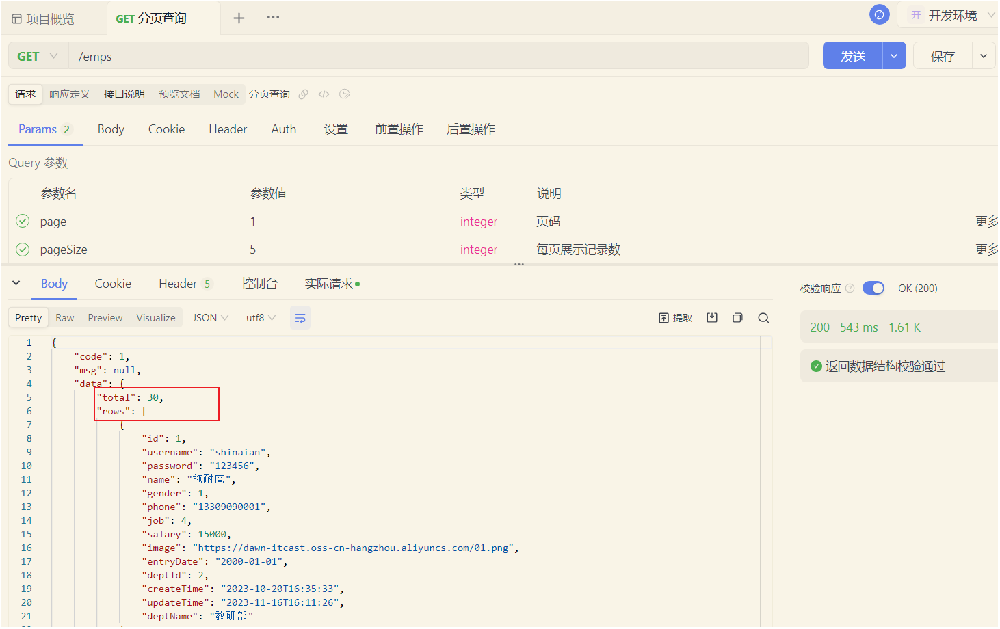
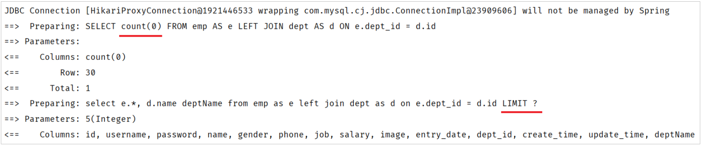

# PageHelper分页插件

## 介绍

前面我们已经完了基础的分页查询，大家会发现：分页查询功能编写起来比较繁琐。 而分页查询的功能是非常常见的，我们查询员工信息需要分页查询，将来在做其他项目时，查询用户信息、订单信息、商品信息等等都是需要进行分页查询的。

而分页查询的思路、步骤是比较固定的。 在Mapper接口中定义两个方法执行两条不同的SQL语句：

1. 查询总记录数

2. 指定页码的数据列表

在Service当中，调用Mapper接口的两个方法，分别获取：总记录数、查询结果列表，然后在将获取的数据结果封装到PageBean对象中。

大家思考下：在未来开发其他项目，只要涉及到分页查询功能\(例：订单、用户、支付、商品\)，都必须按照以上操作完成功能开发

结论：原始方式的分页查询，存在着"步骤固定"、"代码频繁"的问题

解决方案：可以使用一些现成的分页插件完成。对于Mybatis来讲现在最主流的就是PageHelper。


**PageHelper是第三方提供的Mybatis框架中的一款功能强大、方便易用的分页插件，支持任何形式的单标、多表的分页查询。**

官网：https://pagehelper\.github\.io/


那接下来，我们可以对比一下，使用PageHelper分页插件进行分页 与 原始方式进行分页代码实现的上的差别。


- Mapper接口层：

    - 原始的分页查询功能中，我们需要在Mapper接口中定义两条SQL语句。   

    - PageHelper实现分页查询之后，只需要编写一条SQL语句，而且不需要考虑分页操作，就是一条正常的查询语句。

- Service层：

    - 需要根据页码、每页展示记录数，手动的计算起始索引。

    - 无需手动计算起始索引，直接告诉PageHelper需要查询那一页的数据，每页展示多少条记录即可。


## 代码实现

当使用了PageHelper分页插件进行分页，就无需再Mapper中进行手动分页了。 在Mapper中我们只需要进行正常的列表查询即可。在Service层中，调用Mapper的方法之前设置分页参数，在调用Mapper方法执行查询之后，解析分页结果，并将结果封装到PageResult对象中返回。

1\)\. 在pom\.xml引入依赖

```XML
<!--分页插件PageHelper-->
<dependency>
    <groupId>com.github.pagehelper</groupId>
    <artifactId>pagehelper-spring-boot-starter</artifactId>
    <version>1.4.7</version>
</dependency>
```


2\)\. EmpMapper

```Java
/**
 * 查询所有的员工及其对应的部门名称
 */
@Select("select e.*, d.name deptName from emp as e left join dept as d on e.dept_id = d.id")
public List<Emp> list();
```


3\)\. EmpServiceImpl

```Java
@Override
public PageResult page(Integer page, Integer pageSize) {
    //1. 设置分页参数
    PageHelper.startPage(page,pageSize);

    //2. 执行查询
    List<Emp> empList = empMapper.list();
    Page<Emp> p = (Page<Emp>) empList;

    //3. 封装结果
    return new PageResult(p.getTotal(), p.getResult());
}
```


## 功能测试

功能开发完成后，我们重启项目工程，打开Apifox，发起GET请求，访问：`http://localhost:8080/emps?page=1&pageSize=5`



我们可以看到数据可以正常查询返回，是可以正常实现分页查询的。


## 实现机制

我们打开Idea的控制台，可以看到在进行分页查询时，输出的SQL语句。



我们看到执行了两条SQL语句，而这两条SQL语句，其实是从我们在Mapper接口中定义的SQL演变而来的。

- 第一条SQL语句，用来查询总记录数。 


其实就是将我们编写的SQL语句进行的改造增强，将查询返回的字段列表替换成了 `count(0)` 来统计总记录数。


- 第二条SQL语句，用来进行分页查询，查询指定页码对应 的数据列表。


其实就是将我们编写的SQL语句进行的改造增强，在SQL语句之后拼接上了limit进行分页查询，而由于测试时查询的是第一页，起始索引是0，所以简写为limit ？。


而PageHelper在进行分页查询时，会执行上述两条SQL语句，并将查询到的总记录数，与数据列表封装到了 `Page<Emp>` 对象中，我们再获取查询结果时，只需要调用Page对象的方法就可以获取。


**注意：**

- PageHelper实现分页查询时，SQL语句的结尾一定一定一定不要加分号\(;\)\.。

- PageHelper只会对紧跟在其后的第一条SQL语句进行分页处理。


