# SpringBoot原理

经过前面10多天课程的学习，大家也会发现基于SpringBoot进行web程序的开发是非常简单、非常高效的。

SpringBoot使我们能够集中精力地去关注业务功能的开发，而不用过多地关注框架本身的配置使用。而我们前面所讲解的都是面向应用层面的技术，接下来我们开始学习SpringBoot的原理，这部分内容偏向于底层的原理分析。

在剖析SpringBoot的原理之前，我们先来快速回顾一下我们前面所讲解的Spring家族的框架。

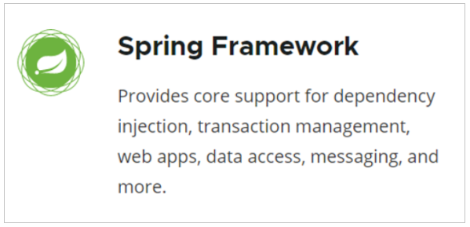

Spring是目前世界上最流行的Java框架，它可以帮助我们更加快速、更加容易的来构建Java项目。而在Spring家族当中提供了很多优秀的框架，而所有的框架都是基于一个基础框架的SpringFramework\(也就是Spring框架\)。而前面我们也提到，如果我们直接基于Spring框架进行项目的开发，会比较繁琐。


这个繁琐主要体现在两个地方：

1. 在pom\.xml中依赖配置比较繁琐，在项目开发时，需要自己去找到对应的依赖，还需要找到依赖它所配套的依赖以及对应版本，否则就会出现版本冲突问题。

2. 在使用Spring框架进行项目开发时，需要在Spring的配置文件中做大量的配置，这就造成Spring框架入门难度较大，学习成本较高。

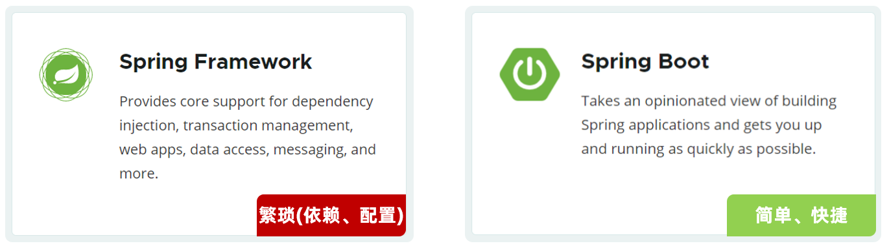

> - 基于Spring存在的问题，官方在Spring框架4\.0版本之后，又推出了一个全新的框架：SpringBoot。
> 
> - 通过 SpringBoot来简化Spring框架的开发\(是简化不是替代\)。我们直接基于SpringBoot来构建Java项目，会让我们的项目开发更加简单，更加快捷。
> 
> 


SpringBoot框架之所以使用起来更简单更快捷，是因为SpringBoot框架底层提供了两个非常重要的功能：一个是起步依赖，一个是自动配置。

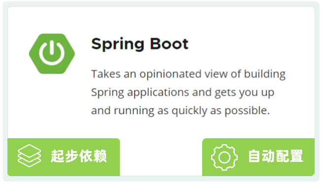

> - 通过SpringBoot所提供的起步依赖，就可以大大的简化pom文件当中依赖的配置，从而解决了Spring框架当中依赖配置繁琐的问题。
> 
> - 通过自动配置的功能就可以大大的简化框架在使用时bean的声明以及bean的配置。我们只需要引入程序开发时所需要的起步依赖，项目开发时所用到常见的配置都已经有了，我们直接使用就可以了。
> 
> 


简单回顾之后，接下来我们来学习下SpringBoot的原理。其实学习SpringBoot的原理就是来解析SpringBoot当中的起步依赖与自动配置的原理。我们首先来学习SpringBoot当中起步依赖的原理。


## 起步依赖

假如我们没有使用SpringBoot，用的是Spring框架进行web程序的开发，此时我们就需要引入web程序开发所需要的一些依赖。

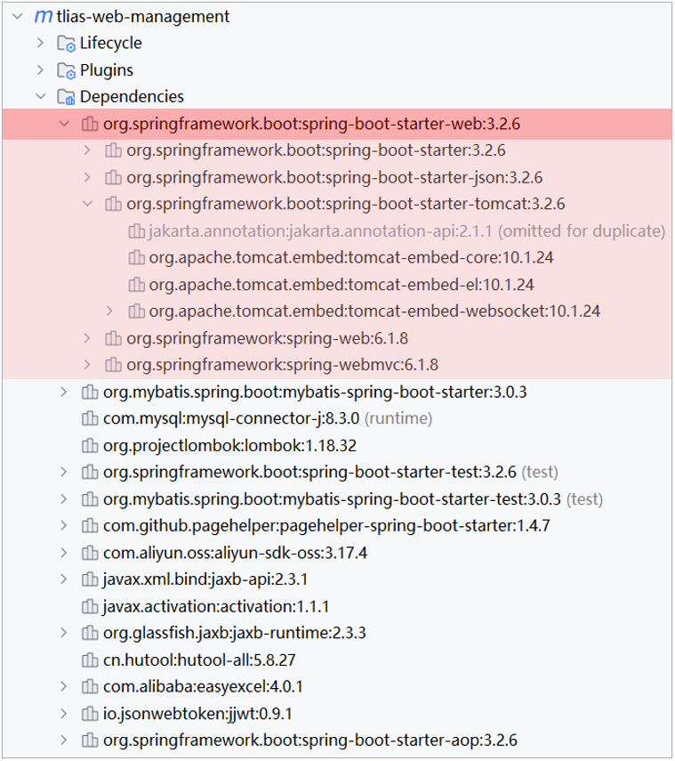

当我们引入了 spring\-boot\-starter\-web 之后，maven会通过**依赖传递**特性，将web开发所需的常见依赖都传递下来。

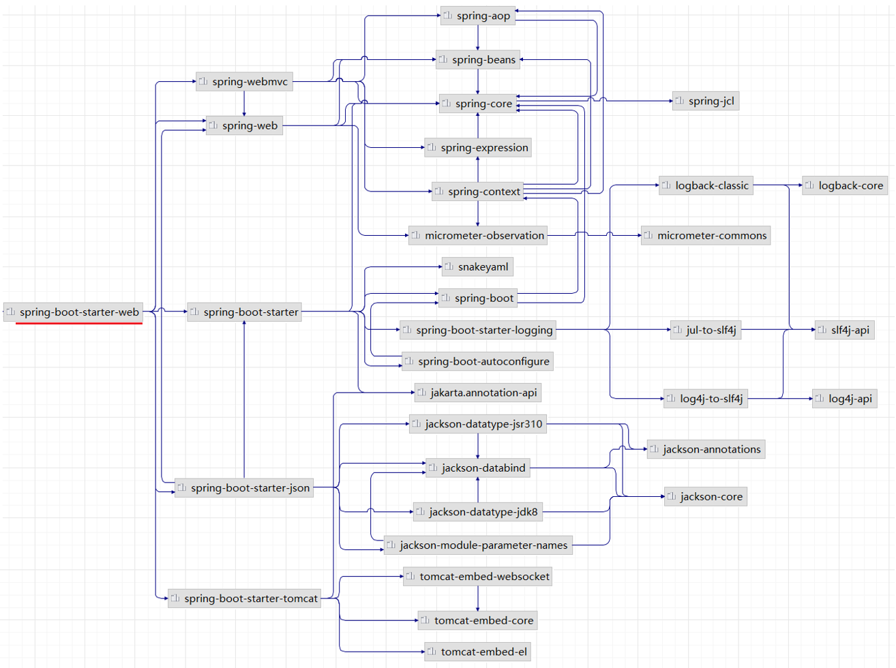

所以，起步依赖的原理就是Maven的依赖传递。

- 在SpringBoot给我们提供的这些起步依赖当中，已提供了当前程序开发所需要的所有的常见依赖\(官网地址：https://docs\.spring\.io/spring\-boot/docs/2\.7\.7/reference/htmlsingle/\#using\.build\-systems\.starters\)。

- 比如：springboot\-starter\-web，这是web开发的起步依赖，在web开发的起步依赖当中，就集成了web开发中常见的依赖：json、web、webmvc、tomcat等。我们只需要引入这一个起步依赖，其他的依赖都会自动的通过Maven的依赖传递进来。


## 自动配置

SpringBoot的自动配置就是当spring容器启动后，一些配置类、bean对象就自动存入到了IOC容器中，不需要我们手动去声明，从而简化了开发，省去了繁琐的配置操作。

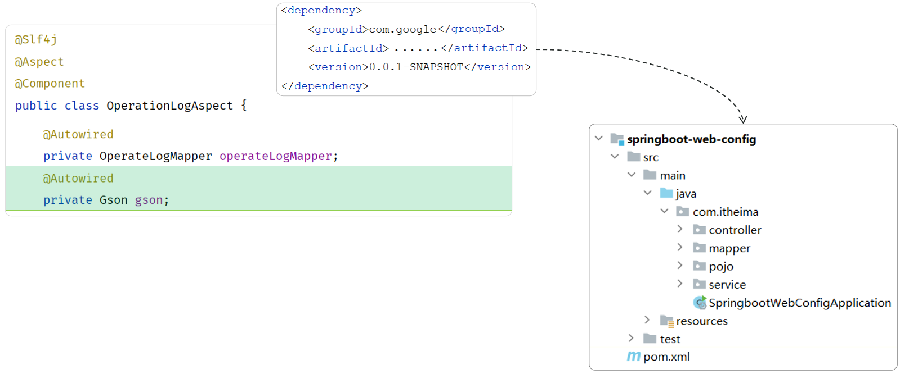

比如，在我们前面讲解AOP记录日志的那个案例中，我们要将一个对象转为json，直接注入一个Gson，然后就可以直接使用了。而我们在我们整个项目中，也并未配置Gson这个类型的bean，为什么可以直接注入使用呢？ 原因就是因为这个bean，springboot中已经帮我们自动配置完毕了，我们是可以直接使用的。

那接下来，我们就要来解析，SpringBoot中到底是如何完成自动配置的。


### 实现方案

我们知道了什么是自动配置之后，接下来我们就要来剖析自动配置的原理。解析自动配置的原理就是分析在 SpringBoot项目当中，我们引入对应的依赖之后，是如何将依赖jar包当中所提供的bean以及配置类直接加载到当前项目的SpringIOC容器当中的。


接下来，我们就直接通过代码来分析自动配置原理。

- 准备工作：在Idea中导入"资料\\03\. 自动配置原理" 下的 `itheima-utils` 工程

- 在SpringBoot项目 `spring-boot-web-config` 工程中，通过坐标引入`itheima-utils`依赖

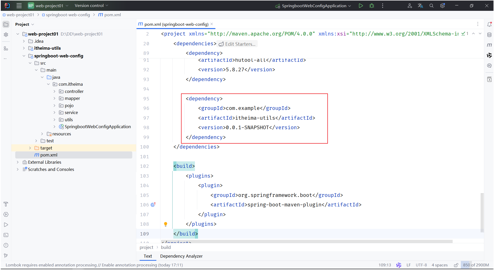

1、引入的 `itheima-utils` 中配置如下:

```Java
@Component
public class TokenParser {
    public void parse(){
        System.out.println("TokenParser ... parse ...");
    }
}
```


2、在测试类中，添加测试方法

```Java
@SpringBootTest
public class AutoConfigurationTests {
    @Autowired
    private ApplicationContext applicationContext;

    @Test
    public void testTokenParse(){
        System.out.println(applicationContext.getBean(TokenParser.class));
    }

    //省略其他代码...
}
```


3、执行测试方法

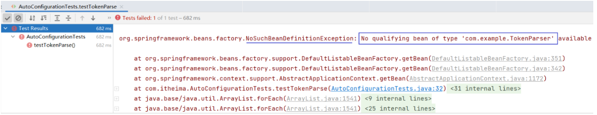

> 异常信息描述： 没有com\.example\.TokenParse类型的bean
> 
> 说明：在Spring容器中没有找到com\.example\.TokenParse类型的bean对象
> 
> 


**思考：引入进来的第三方依赖当中的bean以及配置类为什么没有生效？**

- 原因在我们之前讲解IOC的时候有提到过，在类上添加`@Component`注解来声明bean对象时，还需要保证`@Component`注解能被Spring的组件扫描到。

- SpringBoot项目中的`@SpringBootApplication`注解，具有包扫描的作用，但是它只会扫描启动类所在的当前包以及子包。 

- 当前包：com\.itheima， 第三方依赖中提供的包：com\.example（扫描不到）


**那么如何解决以上问题的呢？**

- 方案1：`@ComponentScan` 组件扫描

- 方案2：`@Import` 导入（使用`@Import`导入的类会被Spring加载到IOC容器中）


#### 方案一

`@ComponentScan`组件扫描

```Java
@SpringBootApplication
@ComponentScan({"com.itheima","com.example"}) //指定要扫描的包
public class SpringbootWebConfigApplication {
    public static void main(String[] args) {
        SpringApplication.run(SpringbootWebConfigApplication.class, args);
    }
}
```

重新执行测试方法，控制台日志输出：

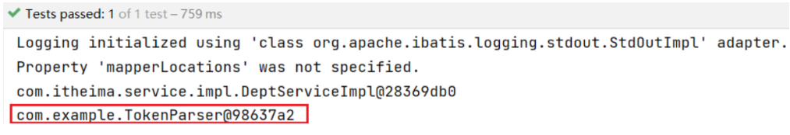


大家可以想象一下，如果采用以上这种方式来完成自动配置，那我们进行项目开发时，当需要引入大量的第三方的依赖，就需要在启动类上配置N多要扫描的包，这种方式会很繁琐。而且这种大面积的扫描性能也比较低。

**缺点：**

1. 使用繁琐

2. 性能低


**结论：SpringBoot中并没有采用以上这种方案。**


#### 方案二

@Import导入

- 导入形式主要有以下几种：

    1. 导入普通类

    2. 导入配置类

    3. 导入ImportSelector接口实现类


**1\)\. 使用@Import****导入普通类****：**

```Java
@Import(TokenParser.class) //导入的类会被Spring加载到IOC容器中
@SpringBootApplication
public class SpringbootWebConfigApplication {
    public static void main(String[] args) {
        SpringApplication.run(SpringbootWebConfigApplication.class, args);
    }
}
```

重新执行测试方法，控制台日志输出：

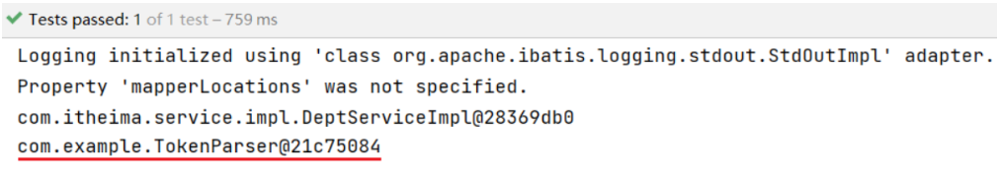


**2\)\. 使用@Import导入配置类：**

- 配置类

```Java
@Configuration
public class HeaderConfig {
    @Bean
    public HeaderParser headerParser(){
        return new HeaderParser();
    }

    @Bean
    public HeaderGenerator headerGenerator(){
        return new HeaderGenerator();
    }
}
```

- 启动类

```Java
@Import(HeaderConfig.class) //导入配置类
@SpringBootApplication
public class SpringbootWebConfig2Application {
    public static void main(String[] args) {
        SpringApplication.run(SpringbootWebConfig2Application.class, args);
    }
}
```

- 测试类

```Java
@SpringBootTest
public class AutoConfigurationTests {
    @Autowired
    private ApplicationContext applicationContext;

    @Test
    public void testHeaderParser(){
        System.out.println(applicationContext.getBean(HeaderParser.class));
    }

    @Test
    public void testHeaderGenerator(){
        System.out.println(applicationContext.getBean(HeaderGenerator.class));
    }
    
    //省略其他代码...
}
```

执行测试方法：

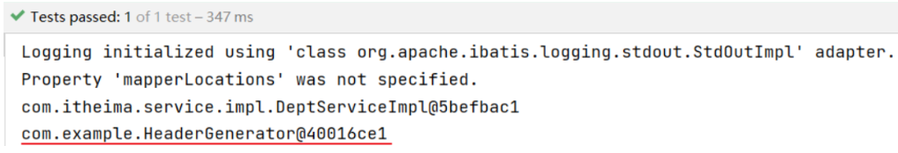


**3\)\. 使用@Import导入ImportSelector接口实现类：**

- ImportSelector接口实现类

```Java
public class MyImportSelector implements ImportSelector {
    public String[] selectImports(AnnotationMetadata importingClassMetadata) {
        //返回值字符串数组（数组中封装了全限定名称的类）
        return new String[]{"com.example.HeaderConfig"};
    }
}
```

- 启动类

```Java
@Import(MyImportSelector.class) //导入ImportSelector接口实现类
@SpringBootApplication
public class SpringbootWebConfig2Application {
    public static void main(String[] args) {
        SpringApplication.run(SpringbootWebConfig2Application.class, args);
    }
}
```

执行测试方法：

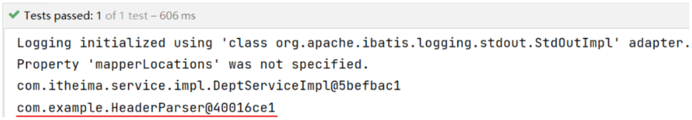

我们使用@Import注解通过这三种方式都可以导入第三方依赖中所提供的bean或者是配置类。

思考：如果基于以上方式完成自动配置，当要引入一个第三方依赖时，是不是还要知道第三方依赖中有哪些配置类和哪些Bean对象？

- 答案：是的。 （对程序员来讲，很不友好，而且比较繁琐）


思考：当我们要使用第三方依赖，依赖中到底有哪些bean和配置类，谁最清楚？

- 答案：第三方依赖自身最清楚。


**结论：我们不用自己指定要导入哪些bean对象和配置类了，让第三方依赖它自己来指定。**

怎么让第三方依赖自己指定bean对象和配置类？

- 比较常见的方案就是第三方依赖给我们提供一个注解，这个注解一般都以@EnableXxxx开头的注解，注解中封装的就是@Import注解


**4****\)\. 使用第三方依赖提供的 @EnableXxxxx注解**

- 第三方依赖中提供的注解

```Java
@Retention(RetentionPolicy.RUNTIME)
@Target(ElementType.TYPE)
@Import(MyImportSelector.class)//指定要导入哪些bean对象或配置类
public @interface EnableHeaderConfig { 
}
```

- 在使用时只需在启动类上加上@EnableXxxxx注解即可

```Java
@EnableHeaderConfig  //使用第三方依赖提供的Enable开头的注解
@SpringBootApplication
public class SpringbootWebConfig2Application {
    public static void main(String[] args) {
        SpringApplication.run(SpringbootWebConfig2Application.class, args);
    }
}
```

执行测试方法：

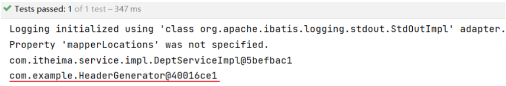

以上四种方式都可以完成导入操作，但是第4种方式会更方便更优雅，而这种方式也是SpringBoot当中所采用的方式。


### 原理分析

#### 源码跟踪

前面我们讲解了在项目当中引入第三方依赖之后，如何加载第三方依赖中定义好的bean对象以及配置类，从而完成自动配置操作。那下面我们通过源码跟踪的形式来剖析下SpringBoot底层到底是如何完成自动配置的。

**源码跟踪技巧：**

在跟踪框架源码的时候，一定要抓住关键点，找到核心流程。一定不要从头到尾一行代码去看，一个方法的去研究，一定要找到关键流程，抓住关键点，先在宏观上对整个流程或者整个原理有一个认识，有精力再去研究其中的细节。


要搞清楚SpringBoot的自动配置原理，要从SpringBoot启动类上使用的核心注解`@SpringBootApplication`开始分析：

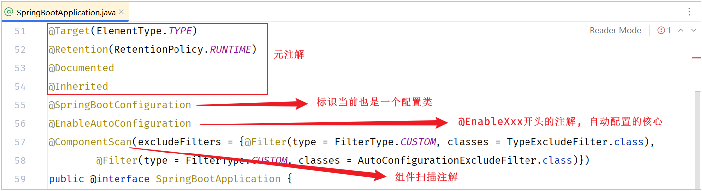

在`@SpringBootApplication`注解中包含了：

- 元注解（不再解释）

- `@SpringBootConfiguration`

- `@EnableAutoConfiguration`

- `@ComponentScan`


- **我们先来看第一个注解：****`@SpringBootConfiguration`**

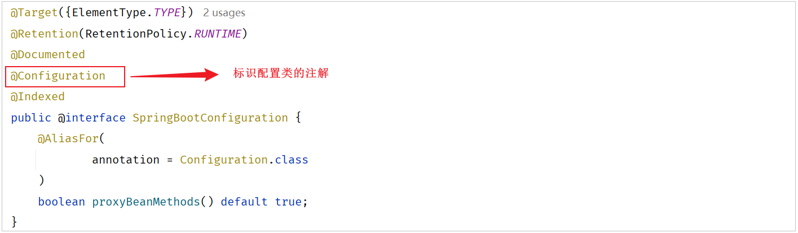

> @SpringBootConfiguration注解上使用了@Configuration，表明SpringBoot启动类就是一个配置类。
> 
> @Indexed注解，是用来加速应用启动的（不用关心）。
> 
> 


- **接下来再先看****`@ComponentScan`****注解：**

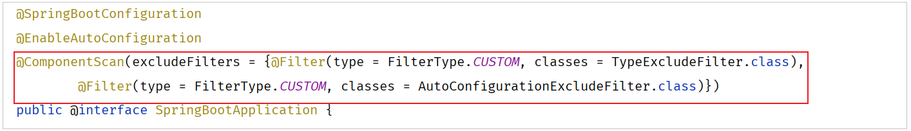

> @ComponentScan注解是用来进行组件扫描的，扫描启动类所在的包及其子包下所有被@Component及其衍生注解声明的类。
> 
> SpringBoot启动类，之所以具备扫描包功能，就是因为包含了@ComponentScan注解。
> 
> 


- **最后我们来看看****`@`****`Enable`****`AutoConfiguration`****注解（自动配置核心注解）：**

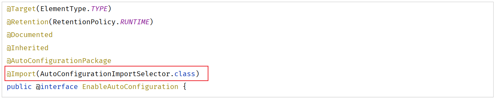

使用`@Import`注解，导入了实现`ImportSelector`接口的实现类。

`AutoConfigurationImportSelector`类是`ImportSelector`接口的实现类。

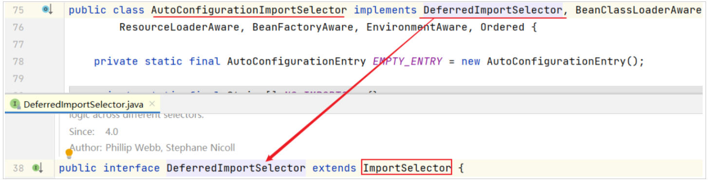


`AutoConfigurationImportSelector`类中重写了`ImportSelector`接口的`selectImports()`方法：

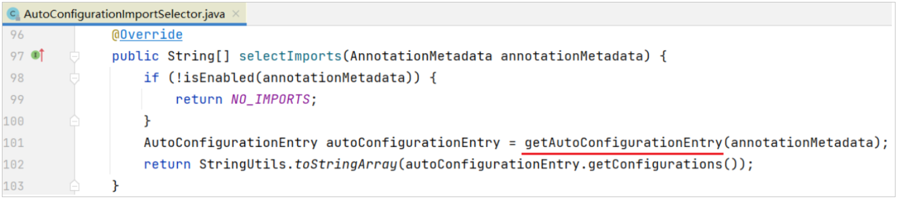

> selectImports\(\)方法底层调用getAutoConfigurationEntry\(\)方法，获取可自动配置的配置类信息集合
> 
> 


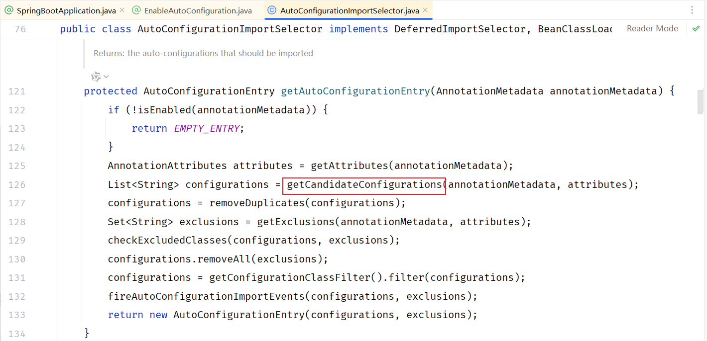

> getAutoConfigurationEntry\(\)方法通过调用getCandidateConfigurations\(annotationMetadata, attributes\)方法获取在配置文件中配置的所有自动配置类的集合
> 
> 


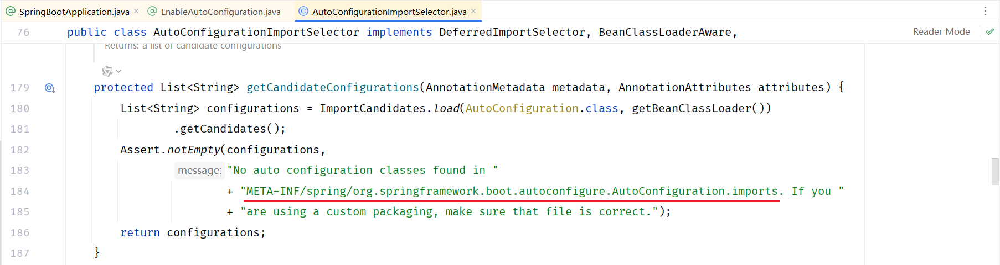

> `getCandidateConfigurations`方法的功能：
> 
> 获取所有基于 `META-INF/spring/org.springframework.boot.autoconfigure.AutoConfiguration.imports`文件中配置类的集合
> 
> 


`META-INF/spring/org.springframework.boot.autoconfigure.AutoConfiguration.imports`文件这两个文件在哪里呢？

- 通常在引入的起步依赖中，都有包含以上文件 

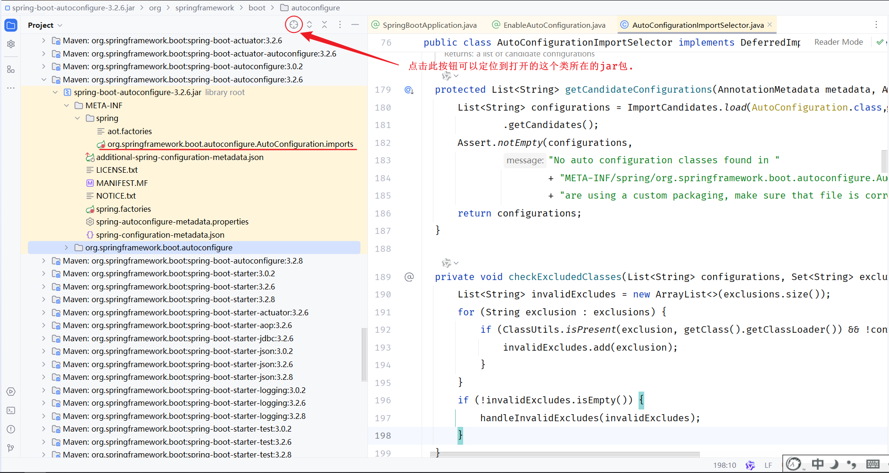

在前面在给大家演示自动配置的时候，我们直接在测试类当中注入了一个叫`gson`的bean对象，进行JSON格式转换。虽然我们没有配置bean对象，但是我们是可以直接注入使用的。原因就是因为在自动配置类当中做了自动配置。到底是在哪个自动配置类当中做的自动配置呢？我们通过搜索来查询一下。


在`META-INF/spring/org.springframework.boot.autoconfigure.AutoConfiguration.imports` 配置文件中指定了第三方依赖Gson的配置类：`GsonAutoConfiguration`

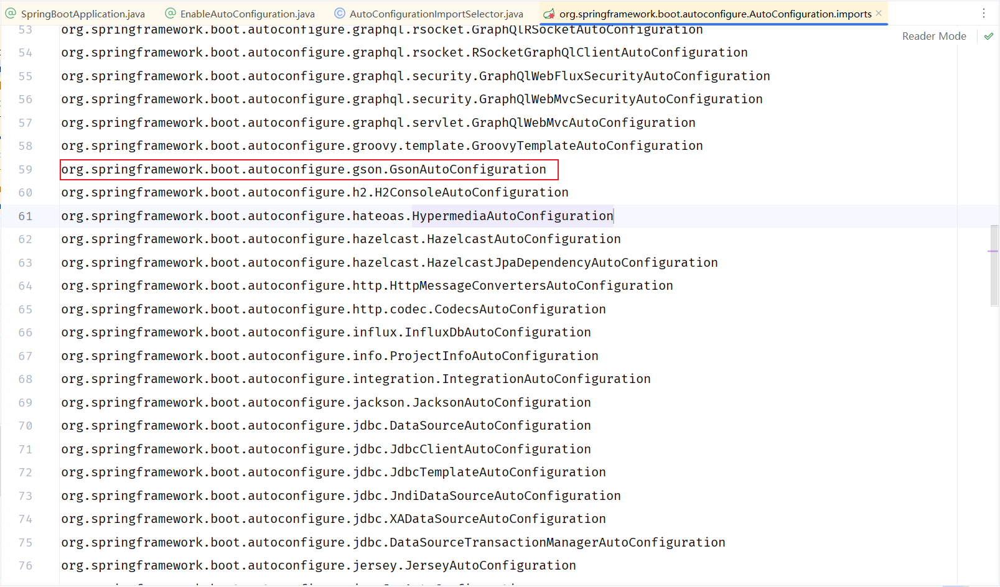


打开上面的第三方依赖中提供的 `GsonAutoConfiguration` 类：

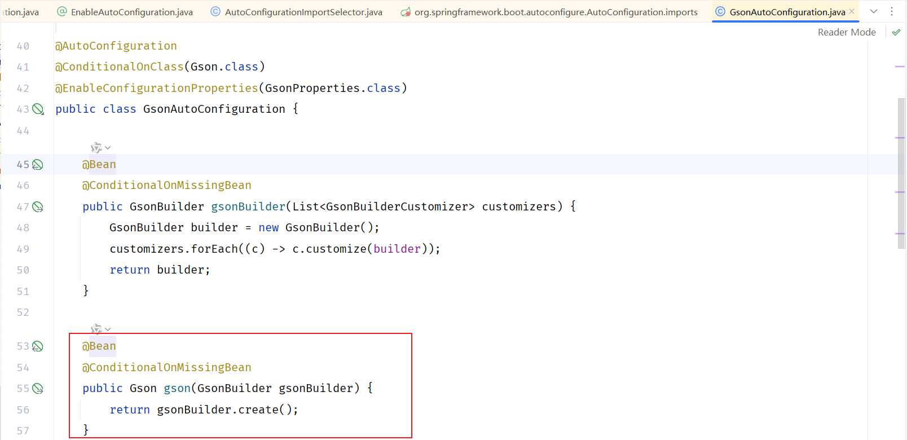


在`GsonAutoConfiguration`类上，添加了注解`@AutoConfiguration`，通过查看源码，可以明确：`GsonAutoConfiguration` 类是一个配置。

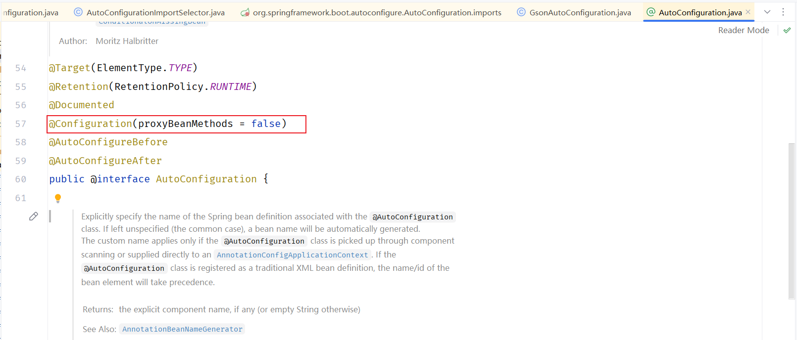

看到这里，大家就应该明白为什么可以完成自动配置了，原理就是在配置类中定义一个`@Bean`标识的方法，而Spring会自动调用配置类中使用`@Bean`标识的方法，并把方法的返回值注册到IOC容器中。


**自动配置源码小结**

自动配置原理源码入口就是 `@SpringBootApplication` 注解，在这个注解中封装了3个注解，分别是：

- @SpringBootConfiguration

    - 声明当前类是一个配置类

- @ComponentScan

    - 进行组件扫描（SpringBoot中默认扫描的是启动类所在的当前包及其子包）

- @EnableAutoConfiguration

    - 封装了@Import注解（Import注解中指定了一个ImportSelector接口的实现类）

    在实现类重写的selectImports\(\)方法，读取当前项目下所有依赖jar包中`META-INF/spring/org.springframework.boot.autoconfigure.AutoConfiguration.imports`两个文件里面定义的配置类（配置类中定义了@Bean注解标识的方法）。


当SpringBoot程序启动时，就会加载配置文件当中所定义的配置类，并将这些配置类信息\(类的全限定名\)封装到String类型的数组中，最终通过@Import注解将这些配置类全部加载到Spring的IOC容器中，交给IOC容器管理。


> 最后呢给大家抛出一个问题：在 `META-INF/spring/org.springframework.boot.autoconfigure.AutoConfiguration.imports` 文件中定义的配置类非常多，而且每个配置类中又可以定义很多的bean，那这些bean都会注册到Spring的IOC容器中吗？
> 
> 答案：并不是。 在声明bean对象时，上面有加一个以 `@Conditional` 开头的注解，这种注解的作用就是按照条件进行装配，只有满足条件之后，才会将bean注册到Spring的IOC容器中（下面会详细来讲解）
> 
> 


#### @Conditional

我们在跟踪SpringBoot自动配置的源码的时候，在自动配置类声明bean的时候，除了在方法上加了一个@Bean注解以外，还会经常用到一个注解，就是以Conditional开头的这一类的注解。以Conditional开头的这些注解都是条件装配的注解。下面我们就来介绍下条件装配注解。

**@Conditional注解：**

- 作用：按照一定的条件进行判断，在满足给定条件后才会注册对应的bean对象到Spring的IOC容器中。

- 位置：方法、类

- @Conditional本身是一个父注解，派生出大量的子注解：

    - @ConditionalOnClass：判断环境中有对应字节码文件，才注册bean到IOC容器。

    - @ConditionalOnMissingBean：判断环境中没有对应的bean\(类型或名称\)，才注册bean到IOC容器。

    - @ConditionalOnProperty：判断配置文件中有对应属性和值，才注册bean到IOC容器。


下面我们通过代码来演示下Conditional注解的使用：

- **`@ConditionalOnClass`****注解**

```Java
@Configuration
public class HeaderConfig {

    @Bean
    @ConditionalOnClass(name="io.jsonwebtoken.Jwts")//环境中存在指定的这个类，才会将该bean加入IOC容器
    public HeaderParser headerParser(){
        return new HeaderParser();
    }
    
    //省略其他代码...
}
```


- pom\.xml

```XML
<!--JWT令牌-->
<dependency>
     <groupId>io.jsonwebtoken</groupId>
     <artifactId>jjwt</artifactId>
     <version>0.9.1</version>
</dependency>
```


- 测试类

```Java
@SpringBootTest
public class AutoConfigurationTests {
    @Autowired
    private ApplicationContext applicationContext;

    @Test
    public void testHeaderParser(){
        System.out.println(applicationContext.getBean(HeaderParser.class));
    }
    
    //省略其他代码...
}
```

执行testHeaderParser\(\)测试方法：

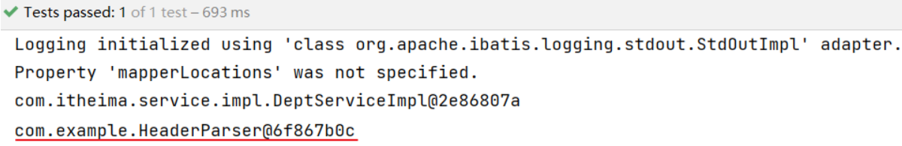


因为 `io.jsonwebtoken.Jwts` 字节码文件在启动SpringBoot程序时已存在，所以创建HeaderParser对象并注册到IOC容器中。


- **@ConditionalOnMissingBean注解**

```Java
@Configuration
public class HeaderConfig {
        
    @Bean
    @ConditionalOnMissingBean //不存在该类型的bean，才会将该bean加入IOC容器
    public HeaderParser headerParser(){
        return new HeaderParser();
    }
    
    //省略其他代码...
}
```

执行testHeaderParser\(\)测试方法：

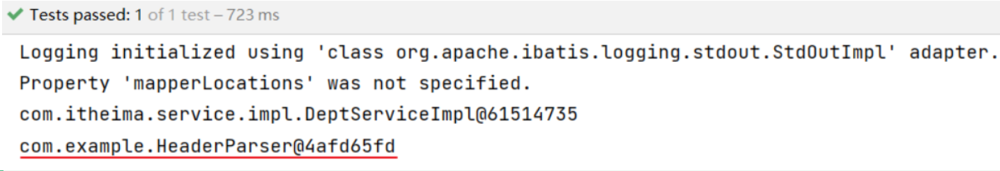

SpringBoot在调用@Bean标识的headerParser\(\)前，IOC容器中是没有HeaderParser类型的bean，所以HeaderParser对象正常创建，并注册到IOC容器中。


- **再次修改****@ConditionalOnMissingBean注解**

```Java
@Configuration
public class HeaderConfig {

    @Bean
    @ConditionalOnMissingBean//不存在指定类型的bean，才会将该bean加入IOC容器
    public HeaderParser headerParser(){
        return new HeaderParser();
    }
    
    //省略其他代码...
}
```

执行testHeaderParser\(\)测试方法：

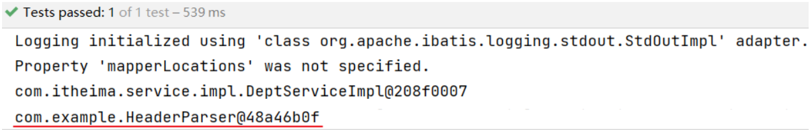


- **`@ConditionalOnProperty`****注解（这个注解和配置文件当中配置的属性有关系）**

先在`application.yml`配置文件中添加如下的键值对：

```YAML
name: itheima
```

在声明bean的时候就可以指定一个条件@ConditionalOnProperty

```Java
@Configuration
public class HeaderConfig {

    @Bean
    @ConditionalOnProperty(name ="name",havingValue = "itheima")//配置文件中存在指定属性名与值，才会将bean加入IOC容器
    public HeaderParser headerParser(){
        return new HeaderParser();
    }

    @Bean
    public HeaderGenerator headerGenerator(){
        return new HeaderGenerator();
    }
}
```

执行testHeaderParser\(\)测试方法：

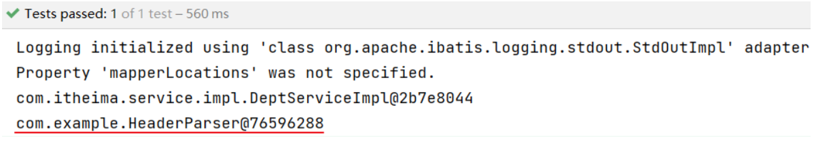


修改`@ConditionalOnProperty`注解：  havingValue的值修改为"itheima2"

```Java
@Bean
@ConditionalOnProperty(name ="name",havingValue = "itheima2")//配置文件中存在指定属性名与值，才会将bean加入IOC容器
public HeaderParser headerParser(){
        return new HeaderParser();
}
```

再次执行testHeaderParser\(\)测试方法：

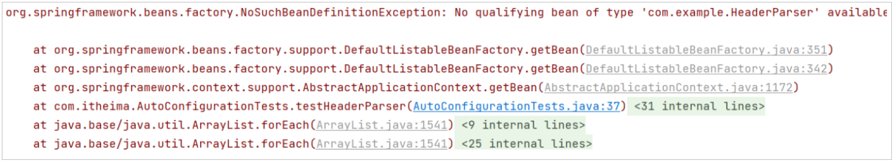

> 因为 `application.yml` 配置文件中，不存在： name:  itheima2，所以HeaderParser对象在IOC容器中不存在
> 
> 


我们再回头看看之前讲解SpringBoot源码时提到的一个配置类：`GsonAutoConfiguration`

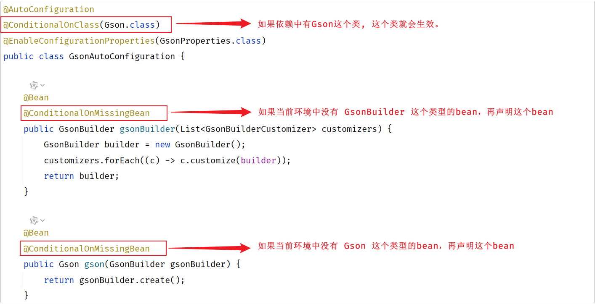

最后再给大家梳理一下自动配置原理：

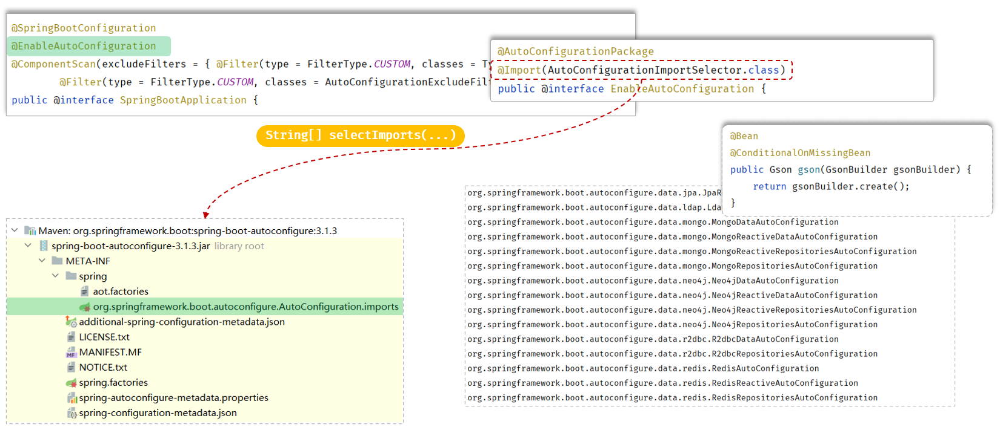


自动配置的核心就在@SpringBootApplication注解上，SpringBootApplication这个注解底层包含了3个注解，分别是：

- @SpringBootConfiguration

- @ComponentScan

- @EnableAutoConfiguration


@EnableAutoConfiguration这个注解才是自动配置的核心。

- 它封装了一个@Import注解，Import注解里面指定了一个ImportSelector接口的实现类。

- 在这个实现类中，重写了ImportSelector接口中的selectImports\(\)方法。

- 而selectImports\(\)方法中会去读取两份配置文件，并将配置文件中定义的配置类做为selectImports\(\)方法的返回值返回，返回值代表的就是需要将哪些类交给Spring的IOC容器进行管理。

- 那么所有自动配置类的中声明的bean都会加载到Spring的IOC容器中吗? 其实并不会，因为这些配置类中在声明bean时，通常都会添加@Conditional开头的注解，这个注解就是进行条件装配。而Spring会根据Conditional注解有选择性的进行bean的创建。

- @Enable 开头的注解底层，它就封装了一个注解 import 注解，它里面指定了一个类，是 ImportSelector 接口的实现类。在实现类当中，我们需要去实现 ImportSelector  接口当中的一个方法 selectImports 这个方法。这个方法的返回值代表的就是我需要将哪些类交给 spring 的 IOC容器进行管理。

- 此时它会去读取两份配置文件，一份儿是 spring\.factories，另外一份儿是 autoConfiguration\.imports。而在  autoConfiguration\.imports 这份儿文件当中，它就会去配置大量的自动配置的类。

- 而前面我们也提到过这些所有的自动配置类当中，所有的 bean都会加载到 spring 的 IOC 容器当中吗？其实并不会，因为这些配置类当中，在声明 bean 的时候，通常会加上这么一类@Conditional 开头的注解。这个注解就是进行条件装配。所以SpringBoot非常的智能，它会根据 @Conditional 注解来进行条件装配。只有条件成立，它才会声明这个bean，才会将这个 bean 交给 IOC 容器管理。


### 自定义starter

#### 分析

前面我们解析了SpringBoot中自动配置的原理，下面我们就通过一个自定义starter案例来加深大家对于自动配置原理的理解。首先介绍一下自定义starter的业务场景，再来分析一下具体的操作步骤。


所谓starter指的就是SpringBoot当中的起步依赖。在SpringBoot当中已经给我们提供了很多的起步依赖了，我们为什么还需要自定义 starter 起步依赖？

这是因为在实际的项目开发当中，我们可能会用到很多第三方的技术，并不是所有的第三方的技术官方都给我们提供了与SpringBoot整合的starter起步依赖，但是这些技术又非常的通用，在很多项目组当中都在使用。


业务场景：

- 我们前面案例当中所使用的阿里云OSS对象存储服务，现在阿里云的官方是没有给我们提供对应的起步依赖的，这个时候使用起来就会比较繁琐，我们需要引入对应的依赖。我们还需要在配置文件当中进行配置，还需要基于官方SDK示例来改造对应的工具类，我们在项目当中才可以进行使用。

- 大家想在我们当前项目当中使用了阿里云OSS，我们需要进行这么多步的操作。在别的项目组当中要想使用阿里云OSS，是不是也需要进行这么多步的操作，所以这个时候我们就可以自定义一些公共组件，在这些公共组件当中，我就可以提前把需要配置的bean都提前配置好。将来在项目当中，我要想使用这个技术，我直接将组件对应的坐标直接引入进来，就已经自动配置好了，就可以直接使用了。我们也可以把公共组件提供给别的项目组进行使用，这样就可以大大的简化我们的开发。

在SpringBoot项目中，一般都会将这些公共组件封装为SpringBoot当中的starter，也就是我们所说的起步依赖。


而在springboot中，官方提供的起步依赖 或 第三方提供的起步依赖，基本都会包含两个模块，如下所示：

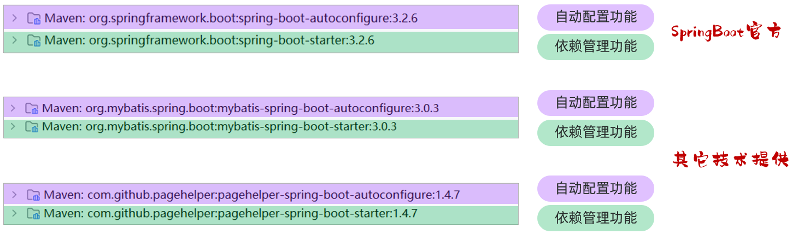

其中，`spring-boot-starter`  或  `xxx-spring-boot-starter` 这个模块主要是依赖管理的功能。 而 `spring-boot-autoconfigure` 或 `xxxx-spring-boot-autoconfigure` 主要是起到自动配置的作用，自动配置的核心代码就在这个模块中编写。

**SpringBoot官方starter命名： **spring\-boot\-starter\-xxxx

**第三组织提供的starter命名： ** xxxx\-spring\-boot\-starter


而自动配置模块的核心，就是编写自动配置的核心代码，然后将自动配置的核心类，配置在核心的配置文件 `META-INF/spring/org.springframework.boot.autoconfigure.AutoConfiguration.imports` 中。 配置如下：

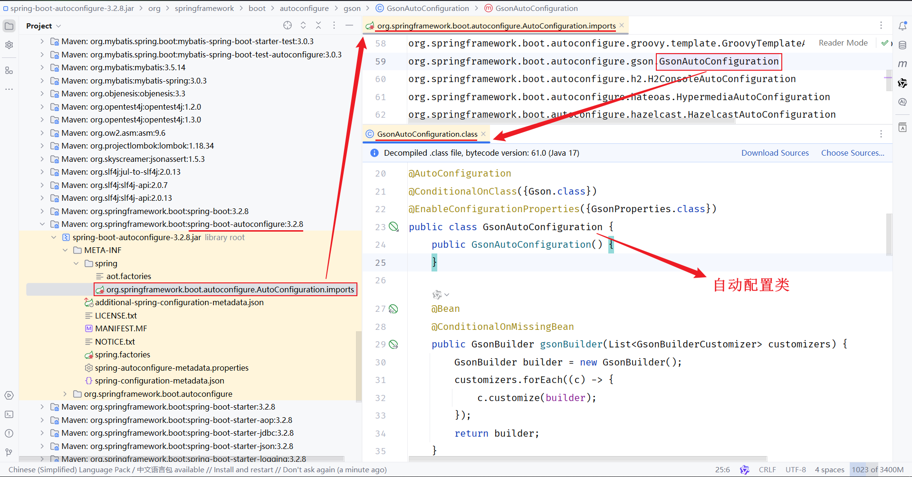

SpringBoot官方的自动配置依赖 `spring-boot-autoconfiure` 中就提供了配置类，并且也提供了springboot会自动读取的配置文件。当SpringBoot项目启动时，会读取到`META-INF/spring/org.springframework.boot.autoconfigure.AutoConfiguration.imports`配置文件中的配置类并加载配置类，生成相关bean对象注册到IOC容器中。


结果：我们可以直接在SpringBoot程序中使用自动配置的bean对象。


**在自定义一个起步依赖starter的时候，按照规范需要定义两个模块：**

1. starter模块（进行依赖管理\[把程序开发所需要的依赖都定义在starter起步依赖中\]）

2. autoconfigure模块（自动配置）

> 将来在项目当中进行相关功能开发时，只需要引入一个起步依赖就可以了，因为它会将autoconfigure自动配置的依赖给传递下来。
> 
> 


#### 需求

上面我们简单介绍了自定义starter的场景，以及自定义starter时涉及到的模块之后，接下来我们就来完成一个自定义starter的案例。

- 需求：自定义`aliyun-oss-spring-boot-starter`，完成阿里云OSS操作工具类 `AliyunOSSOperator` 的自动配置。

- 目标：引入起步依赖引入之后，要想使用阿里云OSS，注入`AliyunOSSOperator` 直接使用即可。


**之前我们的用法：**

1\)\. 在pom\.xml中引入阿里云oss的所有依赖

```XML
<!--阿里云OSS-->
<dependency>
    <groupId>com.aliyun.oss</groupId>
    <artifactId>aliyun-sdk-oss</artifactId>
    <version>3.17.4</version>
</dependency>
<dependency>
    <groupId>javax.xml.bind</groupId>
    <artifactId>jaxb-api</artifactId>
    <version>2.3.1</version>
</dependency>
<dependency>
    <groupId>javax.activation</groupId>
    <artifactId>activation</artifactId>
    <version>1.1.1</version>
</dependency>
<!-- no more than 2.3.3-->
<dependency>
    <groupId>org.glassfish.jaxb</groupId>
    <artifactId>jaxb-runtime</artifactId>
    <version>2.3.3</version>
</dependency>
```


2\)\. application\.yml 中配置阿里云OSS的配置信息

```YAML
*#阿里云oss配置*
aliyun:
  oss:
    endpoint: https://oss-cn-beijing.aliyuncs.com
    bucketName: java422-web-ai
```


3\)\. 定义实体类封装配置信息

```Java
package com.itheima.utils;

import lombok.Data;
import org.springframework.boot.context.properties.ConfigurationProperties;
import org.springframework.stereotype.Component;

@Data
@Component
@ConfigurationProperties(prefix = "aliyun.oss")
public class AliyunOSSProperties {
    private String endpoint;
    private String bucketName;
}
```


4\)\. 定义工具类`AliyunOSSOperator` 

```Java
package com.itheima.utils;

import com.aliyun.oss.OSS;
import com.aliyun.oss.OSSClientBuilder;
import com.aliyun.oss.common.auth.CredentialsProviderFactory;
import com.aliyun.oss.common.auth.EnvironmentVariableCredentialsProvider;
import com.aliyun.oss.model.OSSObjectSummary;
import com.aliyun.oss.model.ObjectListing;
import org.springframework.beans.factory.annotation.Autowired;
import org.springframework.stereotype.Component;

import java.io.ByteArrayInputStream;
import java.time.LocalDate;
import java.time.format.DateTimeFormatter;
import java.util.List;
import java.util.UUID;
import java.util.stream.Collectors;

@Component
public class AliyunOSSOperator {

    @Autowired
    private AliyunOSSProperties aliyunOSSProperties;

    /**
     * 文件上传
     */
    public String upload(byte[] content, String originalFilename) throws Exception {
        String endpoint = aliyunOSSProperties.getEndpoint();
        String bucketName = aliyunOSSProperties.getBucketName();

        // 从环境变量中获取访问凭证。运行本代码示例之前，请确保已设置环境变量OSS_ACCESS_KEY_ID和OSS_ACCESS_KEY_SECRET。
        EnvironmentVariableCredentialsProvider credentialsProvider = CredentialsProviderFactory.newEnvironmentVariableCredentialsProvider();

        // 填写Object完整路径，例如202406/1.png。Object完整路径中不能包含Bucket名称。
        //获取当前系统日期的字符串,格式为 yyyy/MM
        String dir = LocalDate.now().format(DateTimeFormatter.ofPattern("yyyy/MM"));
        //根据原始文件名originalFilename, 生成一个新的不重复的文件名
        String newFileName = UUID.randomUUID().toString() + originalFilename.substring(originalFilename.lastIndexOf("."));
        String objectName = dir + "/" + newFileName;

        // 创建OSSClient实例。
        OSS ossClient = new OSSClientBuilder().build(endpoint, credentialsProvider);

        //文件上传
        try {
            ossClient.putObject(bucketName, objectName, new ByteArrayInputStream(content));
        } finally {
            if (ossClient != null) {
                ossClient.shutdown();
            }
        }

        return endpoint.split("//")[0] + "//" + bucketName + "." + endpoint.split("//")[1] + "/" + objectName;
    }


    /**
     * 查询文件列表
     */
    public List<String> listFiles() throws Exception {
        String endpoint = aliyunOSSProperties.getEndpoint();
        String bucketName = aliyunOSSProperties.getBucketName();
        // 从环境变量中获取访问凭证。运行本代码示例之前，请确保已设置环境变量OSS_ACCESS_KEY_ID和OSS_ACCESS_KEY_SECRET。
        EnvironmentVariableCredentialsProvider credentialsProvider = CredentialsProviderFactory.newEnvironmentVariableCredentialsProvider();
        // 指定前缀，例如exampledir/object。
        String keyPrefix = null;

        // 创建OSSClient实例。
        OSS ossClient = new OSSClientBuilder().build(endpoint, credentialsProvider);

        try {
            // 列举文件。如果不设置keyPrefix，则列举存储空间下的所有文件。如果设置keyPrefix，则列举包含指定前缀的文件。
            ObjectListing objectListing = ossClient.listObjects(bucketName, keyPrefix);
            List<OSSObjectSummary> sums = objectListing.getObjectSummaries();
            if(sums != null && !sums.isEmpty()){
                return sums.stream().map(OSSObjectSummary::getKey).collect(Collectors.toList());
            }
        } finally {
            if (ossClient != null) {
                ossClient.shutdown();
            }
        }
        return null;
    }

    /**
     * 删除指定对象
     */
    public void deleteFile(String objectName) throws Exception {
        String endpoint = aliyunOSSProperties.getEndpoint();
        String bucketName = aliyunOSSProperties.getBucketName();

        // 从环境变量中获取访问凭证。运行本代码示例之前，请确保已设置环境变量OSS_ACCESS_KEY_ID和OSS_ACCESS_KEY_SECRET。
        EnvironmentVariableCredentialsProvider credentialsProvider = CredentialsProviderFactory.newEnvironmentVariableCredentialsProvider();
        // 创建OSSClient实例。
        OSS ossClient = new OSSClientBuilder().build(endpoint, credentialsProvider);

        try {
            // 删除文件或目录。如果要删除目录，目录必须为空。
            ossClient.deleteObject(bucketName, objectName);
        } finally {
            if (ossClient != null) {
                ossClient.shutdown();
            }
        }
    }

}

```


5\)\. 其他地方要使用阿里云OSS，注入工具类，再使用

```Java

@Slf4j
@RestController
public class UploadController {
    @Autowired
    private AliyunOSSOperator aliyunOSSOperator;

    */***
*     * 文件上传*
*     */*
*    *@PostMapping("/upload")
    public Result upload(MultipartFile file) throws Exception {
        *log*.info("上传文件：{}",file.getOriginalFilename());
        //调用aliyun OSS进行文件上传
        String url = aliyunOSSOperator.upload(file.getBytes(), file.getOriginalFilename());
        //返回结果
        return Result.*success*(url);
    }
}
```

我们可以看到，在项目中使用阿里云OSS，需要这么五步操作，而阿里云OSS这个云服务还是非常常见的，很多项目中都要使用。

大家再思考，现在我们使用阿里云OSS，需要做这么几步，将来大家在开发其他的项目的时候，你使用阿里云OSS，这几步你要不要做？当团队中其他小伙伴也在使用阿里云OSS的时候，步骤 不也是一样的。

所以这个时候我们就可以制作一个公共组件\(自定义starter\)。starter定义好之后，将来要使用阿里云OSS进行文件上传，只需要将起步依赖引入进来之后，就可以直接注入 `AliyunOSSOperator` 使用了。


#### 实现

需求明确了，接下来我们再来分析一下具体的实现步骤：

- 第1步：创建自定义starter模块 `aliyun-oss-spring-boot-starter`（进行依赖管理）

    - 把阿里云OSS所有的依赖统一管理起来

- 第2步：创建autoconfigure模块 `aliyun-oss-spring-boot-autoconfigure`

    - 在starter中引入autoconfigure （我们使用时只需要引入starter起步依赖即可）

- 第3步：在autoconfigure模块`aliyun-oss-spring-boot-autoconfigure`中完成自动配置

    1. 定义一个自动配置类，在自动配置类中将所要配置的bean都提前配置好

    2. 定义配置文件，把自动配置类的全类名定义在配置文件\(`META-INF/spring/xxxx.imports`\)中


我们分析完自定义阿里云OSS自动配置的操作步骤了，下面我们就按照分析的步骤来实现自定义starter。


首先我们先来创建两个Maven模块：

**1\)\. 创建 ****`aliyun-oss-spring-boot-starter`**

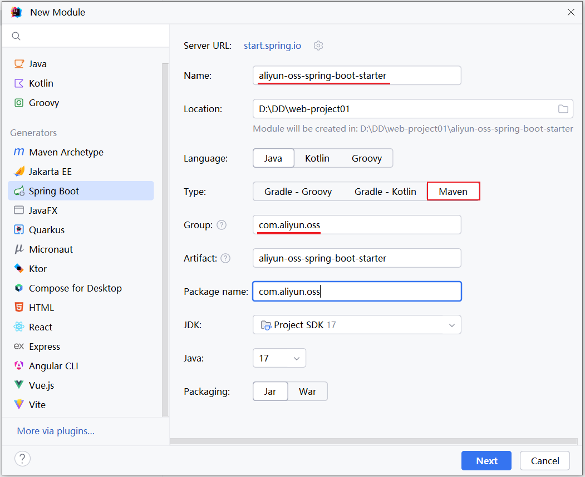

选择springboot的版本，不需要勾选任何的依赖。直接点击 `create` 创建项目。

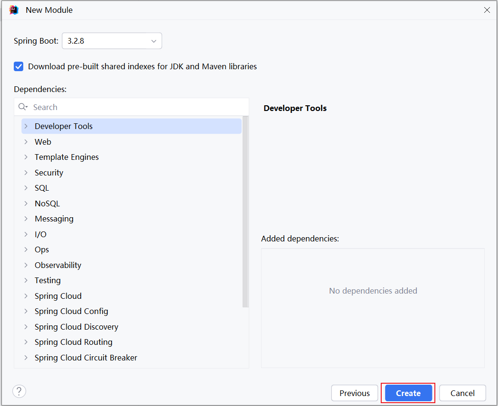

创建完starter模块后，删除多余的文件，只保留一个pom\.xml文件。最终保留内容如下：


pom\.xml 中的配置如下:

```XML
*<?*xml version="1.0" encoding="UTF-8"*?>*
<project xmlns="http://maven.apache.org/POM/4.0.0" xmlns:xsi="http://www.w3.org/2001/XMLSchema-instance"
         xsi:schemaLocation="http://maven.apache.org/POM/4.0.0 https://maven.apache.org/xsd/maven-4.0.0.xsd">
    <modelVersion>4.0.0</modelVersion>
    <parent>
        <groupId>org.springframework.boot</groupId>
        <artifactId>spring-boot-starter-parent</artifactId>
        <version>3.2.8</version>
        <relativePath/> <!-- lookup parent from repository -->
    </parent>

    <groupId>com.aliyun.oss</groupId>
    <artifactId>aliyun-oss-spring-boot-starter</artifactId>
    <version>0.0.1-SNAPSHOT</version>

    <properties>
        <java.version>17</java.version>
    </properties>

    <dependencies>
        <dependency>
            <groupId>org.springframework.boot</groupId>
            <artifactId>spring-boot-starter</artifactId>
        </dependency>
    </dependencies>

</project>
```


**2\)\. 创建 ****`aliyun-oss-spring-boot-autoconfigure`**** 模块**

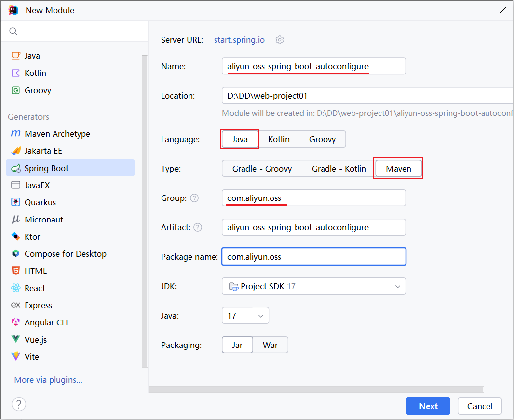

选择Springboot的版本，不用勾选任何依赖。

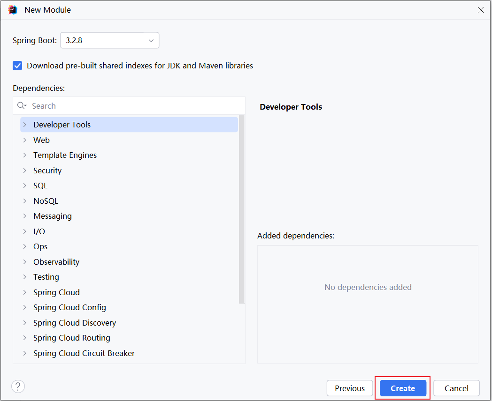

创建完starter模块后，删除多余的文件，只保留 `src` 和 `pom.xml` 。最终保留内容如下：

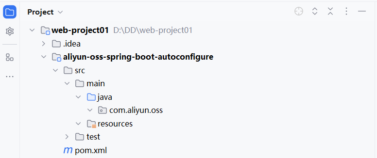


该模块的pom\.xml内容如下：

```XML
*<?*xml version="1.0" encoding="UTF-8"*?>*
<project xmlns="http://maven.apache.org/POM/4.0.0" xmlns:xsi="http://www.w3.org/2001/XMLSchema-instance"
         xsi:schemaLocation="http://maven.apache.org/POM/4.0.0 https://maven.apache.org/xsd/maven-4.0.0.xsd">
    <modelVersion>4.0.0</modelVersion>
    <parent>
        <groupId>org.springframework.boot</groupId>
        <artifactId>spring-boot-starter-parent</artifactId>
        <version>3.2.8</version>
        <relativePath/> <!-- lookup parent from repository -->
    </parent>

    <groupId>com.aliyun.oss</groupId>
    <artifactId>aliyun-oss-spring-boot-autoconfigure</artifactId>
    <version>0.0.1-SNAPSHOT</version>

    <properties>
        <java.version>17</java.version>
    </properties>

    <dependencies>
        <dependency>
            <groupId>org.springframework.boot</groupId>
            <artifactId>spring-boot-starter</artifactId>
        </dependency>
    </dependencies>

</project>
```


按照我们之前的分析，是需要在starter模块中来引入autoconfigure这个模块的。打开starter模块中的pom文件：

```XML
*<?*xml version="1.0" encoding="UTF-8"*?>*
<project xmlns="http://maven.apache.org/POM/4.0.0" xmlns:xsi="http://www.w3.org/2001/XMLSchema-instance"
         xsi:schemaLocation="http://maven.apache.org/POM/4.0.0 https://maven.apache.org/xsd/maven-4.0.0.xsd">
    <modelVersion>4.0.0</modelVersion>
    <parent>
        <groupId>org.springframework.boot</groupId>
        <artifactId>spring-boot-starter-parent</artifactId>
        <version>3.2.8</version>
        <relativePath/> <!-- lookup parent from repository -->
    </parent>

    <groupId>com.aliyun.oss</groupId>
    <artifactId>aliyun-oss-spring-boot-starter</artifactId>
    <version>0.0.1-SNAPSHOT</version>

    <properties>
        <java.version>17</java.version>
    </properties>

    <dependencies>
        <dependency>
            <groupId>org.springframework.boot</groupId>
            <artifactId>spring-boot-starter</artifactId>
        </dependency>

        <dependency>
            <groupId>com.aliyun.oss</groupId>
            <artifactId>aliyun-oss-spring-boot-autoconfigure</artifactId>
            <version>0.0.1-SNAPSHOT</version>
        </dependency>
    </dependencies>

</project>
```


前两步已经完成了，接下来是最关键的就是第三步：在`aliyun-oss-spring-boot-autoconfigure`模块当中来完成自动配置操作。

> 我们将之前案例中所使用的阿里云OSS部分的代码直接拷贝到autoconfigure模块下，然后进行改造就行了。
> 
> 

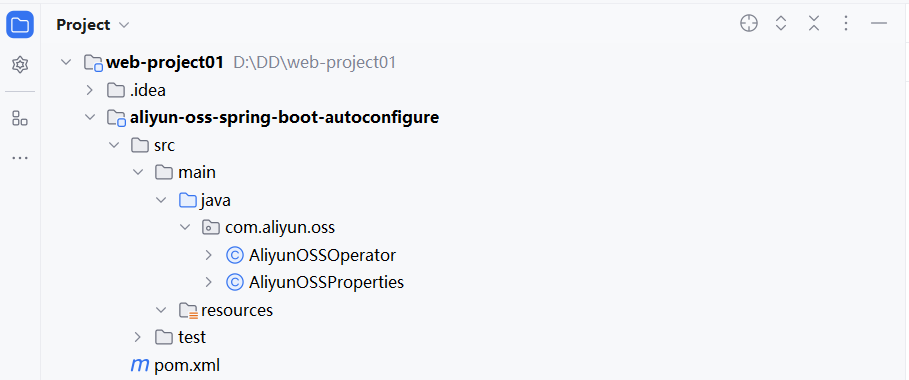


拷贝过来后，还缺失一些相关的依赖，需要把相关依赖也拷贝过来：

```XML
*<?*xml version="1.0" encoding="UTF-8"*?>*
<project xmlns="http://maven.apache.org/POM/4.0.0" xmlns:xsi="http://www.w3.org/2001/XMLSchema-instance"
         xsi:schemaLocation="http://maven.apache.org/POM/4.0.0 https://maven.apache.org/xsd/maven-4.0.0.xsd">
    <modelVersion>4.0.0</modelVersion>
    <parent>
        <groupId>org.springframework.boot</groupId>
        <artifactId>spring-boot-starter-parent</artifactId>
        <version>3.2.8</version>
        <relativePath/> <!-- lookup parent from repository -->
    </parent>

    <groupId>com.aliyun.oss</groupId>
    <artifactId>aliyun-oss-spring-boot-autoconfigure</artifactId>
    <version>0.0.1-SNAPSHOT</version>

    <properties>
        <java.version>17</java.version>
    </properties>

    <dependencies>
        <dependency>
            <groupId>org.springframework.boot</groupId>
            <artifactId>spring-boot-starter</artifactId>
        </dependency>

        <dependency>
            <groupId>org.projectlombok</groupId>
            <artifactId>lombok</artifactId>
        </dependency>

        <!--阿里云OSS-->
        <dependency>
            <groupId>com.aliyun.oss</groupId>
            <artifactId>aliyun-sdk-oss</artifactId>
            <version>3.17.4</version>
        </dependency>
        <dependency>
            <groupId>javax.xml.bind</groupId>
            <artifactId>jaxb-api</artifactId>
            <version>2.3.1</version>
        </dependency>
        <dependency>
            <groupId>javax.activation</groupId>
            <artifactId>activation</artifactId>
            <version>1.1.1</version>
        </dependency>
        <!-- no more than 2.3.3-->
        <dependency>
            <groupId>org.glassfish.jaxb</groupId>
            <artifactId>jaxb-runtime</artifactId>
            <version>2.3.3</version>
        </dependency>

    </dependencies>

</project>
```


那此时，大家思考下，在类上添加的 `@Component` 注解还有用吗？

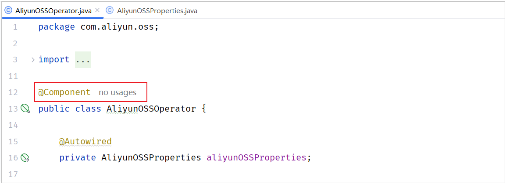

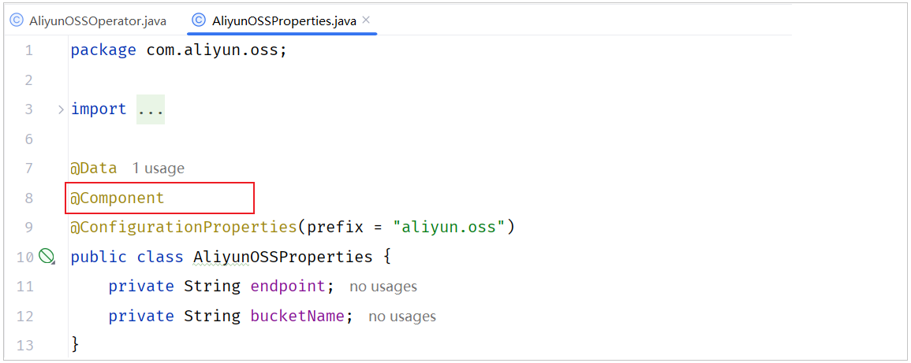

答案：没用了。  在SpringBoot项目中，并不会去扫描com\.aliyun\.oss这个包，不扫描这个包那类上的注解也就失去了作用。


@Component注解不需要使用了，可以从类上删除了。

1\)\. 删除 AliyunOSSOperator 工具类上的 @Component 注解 和 @Autowired 注解。

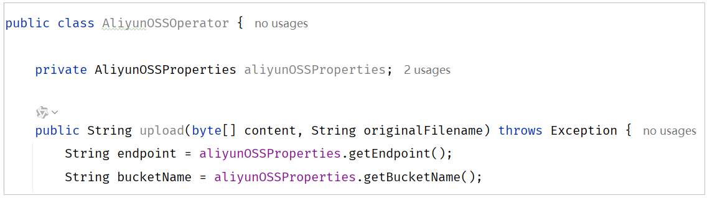


2\)\. 删除 AliyunOSSProperties 实体类上的 @Component 注解。

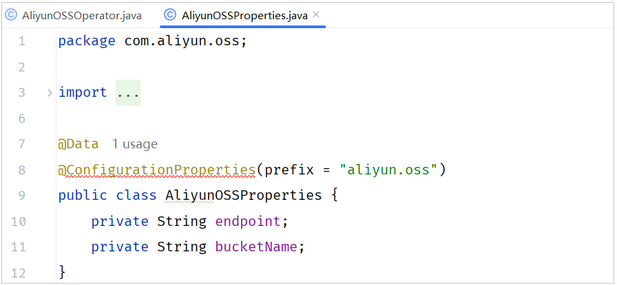

删除后报红色错误，暂时不理会，后面再来处理。


3\)\. 既然不能用 `@Component` 注解声明bean，那就需要按照 starter 的定义规范，定义一个自动配置类，在自动配置类中声明bean。

下面我们就要定义一个自动配置类 `AliOSSAutoConfiguration` 了，在自动配置类当中来声明 `AliOSSOperator` 的bean对象。

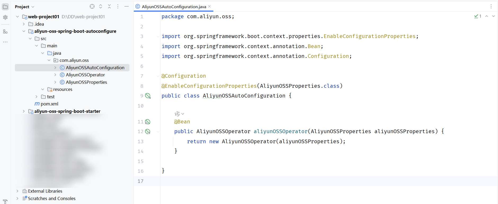

具体代码如下：

```Java
package com.aliyun.oss;

import org.springframework.boot.context.properties.EnableConfigurationProperties;
import org.springframework.context.annotation.Bean;
import org.springframework.context.annotation.Configuration;

@Configuration
@EnableConfigurationProperties(AliyunOSSProperties.class)
public class AliyunOSSAutoConfiguration {
    
    @Bean
    public AliyunOSSOperator aliyunOSSOperator(AliyunOSSProperties aliyunOSSProperties) {
        return new AliyunOSSOperator(aliyunOSSProperties);
    }
    
}
```


AliyunOSSOperator 的代码中需要增加一个有参构造，将 AliyunOSSProperties 对象传递给工具类。代码改造如下：

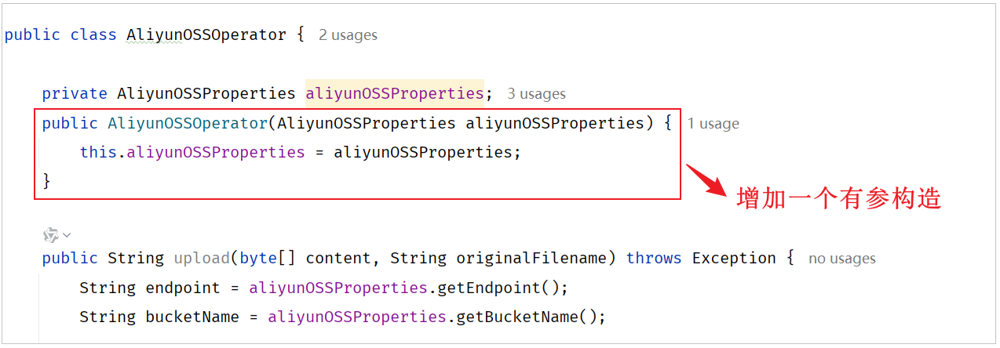


4\)\. 在 `aliyun-oss-spring-boot-autoconfigure` 模块中的resources下，新建自动配置文件 `META-INF/spring/org.springframework.boot.autoconfigure.AutoConfiguration.imports`

将自动配置类的全类名，配置在文件中，这样在springboot启动的时候，就会加载到这份文件，并加载到其中的配置类了。

配置内容如下：

```Java
com.aliyun.oss.AliyunOSSAutoConfiguration
```

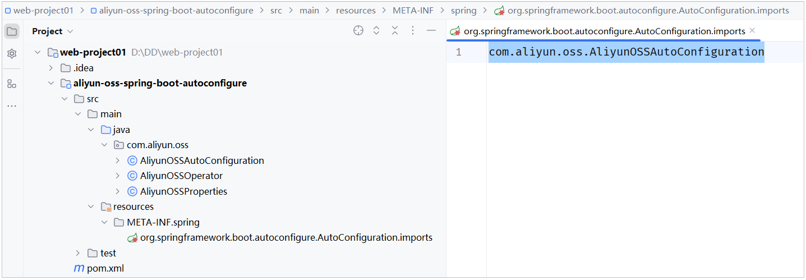


到此呢，这个 `aliyun-oss-spring-boot-stater` 就定义好了，哪里要想使用，就可以直接导入依赖，直接注入使用了。


#### 测试

阿里云OSS的starter我们刚才已经定义好了，接下来我们就来做一个测试。

> 今天的课程资料当中，提供了一个自定义starter的测试工程。我们直接打开文件夹，里面有一个测试工程。测试工程就是 `springboot-autoconfiguration-test`，我们只需要将测试工程直接导入到Idea当中即可。
> 
> 


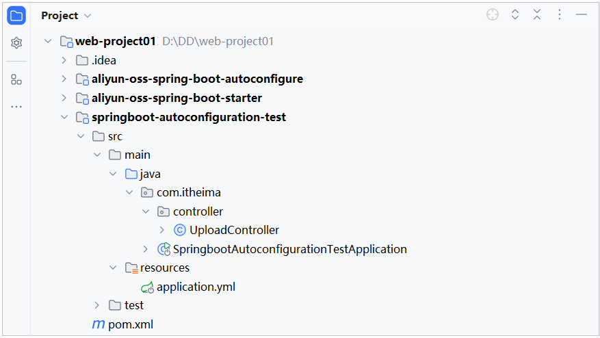


**测试前准备：**

1\)\. 在导入的test工程中引入阿里云starter依赖

```XML
<dependency>
    <groupId>com.aliyun.oss</groupId>
    <artifactId>aliyun-oss-spring-boot-starter</artifactId>
    <version>0.0.1-SNAPSHOT</version>
</dependency>
```


2\)\. 在导入的test工程中的 `application.yml` 中配置阿里云OSS的配置信息

```YAML
aliyun:
  oss:
    endpoint: https://oss-cn-beijing.aliyuncs.com
    bucketName: java422-web-ai
```


3\)\. 在test工程中的 `UploadController` 类编写代码

```Java
package com.itheima.controller;

import com.aliyun.oss.AliyunOSSOperator;
import org.springframework.beans.factory.annotation.Autowired;
import org.springframework.web.bind.annotation.PostMapping;
import org.springframework.web.bind.annotation.RestController;
import org.springframework.web.multipart.MultipartFile;

@RestController
public class UploadController {
    
    @Autowired
    private AliyunOSSOperator aliyunOSSOperator;
    
    @PostMapping("/upload")
    public String upload(MultipartFile image) throws Exception {
        //上传文件到阿里云 OSS
        String url = aliyunOSSOperator.upload(image.getBytes(), image.getOriginalFilename());
        return url;
    }
    
}
```


编写完代码后，我们启动当前的SpringBoot测试工程，使用Apifox工具进行文件上传：

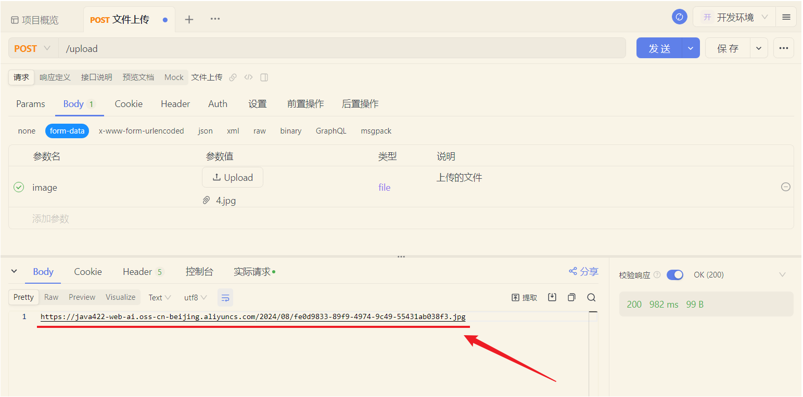


这样，我们就完成了starter的定义。在其他项目中要想使用，引入依赖，配置一下阿里云OSS的信息，就可以直接注入是用了 。


