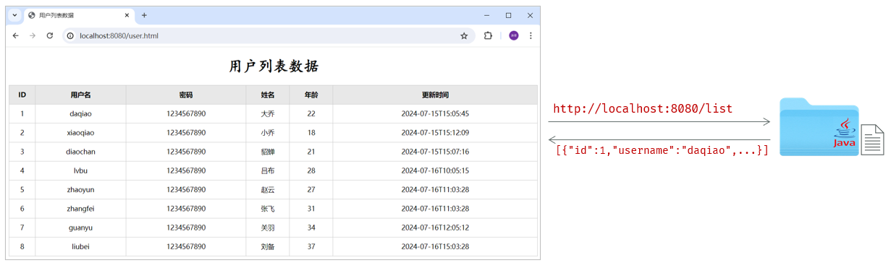
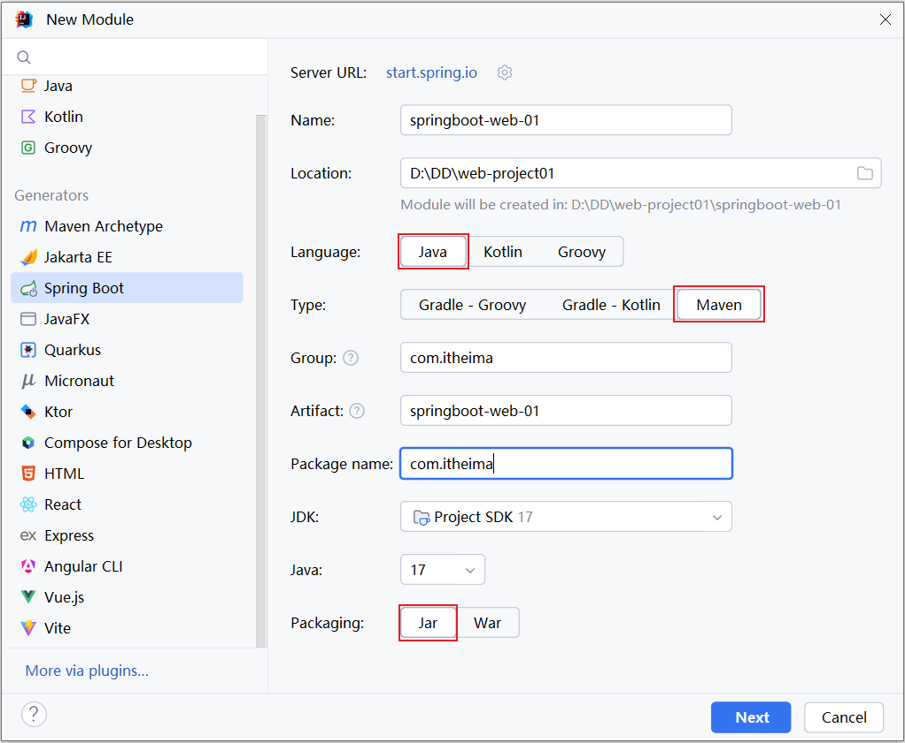
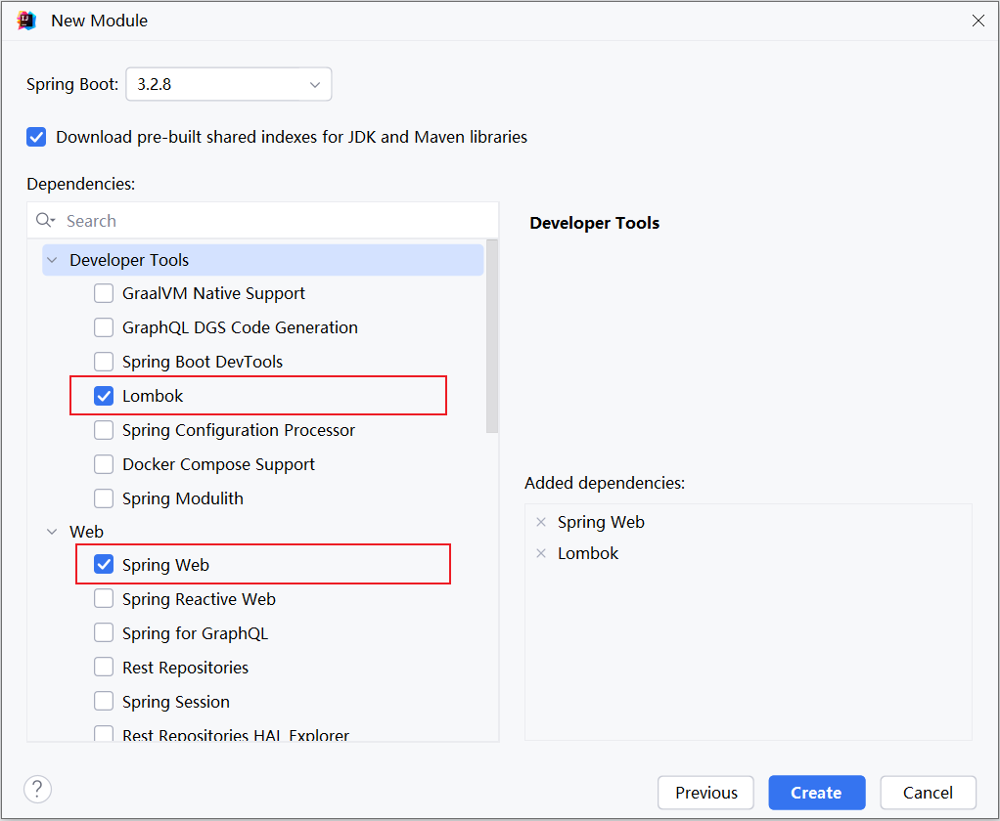
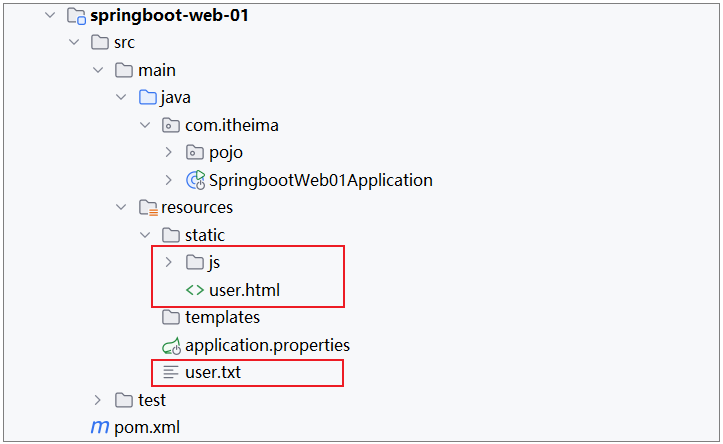
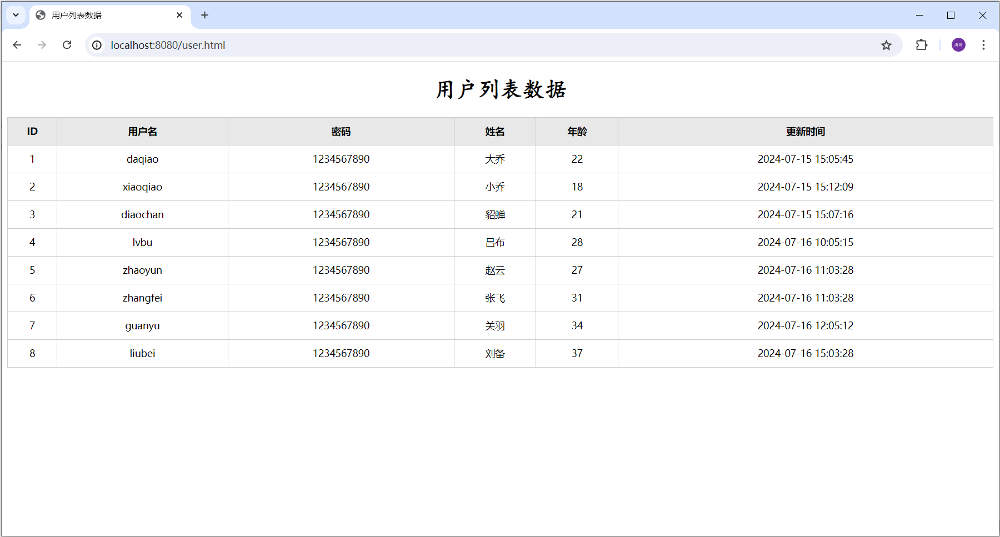
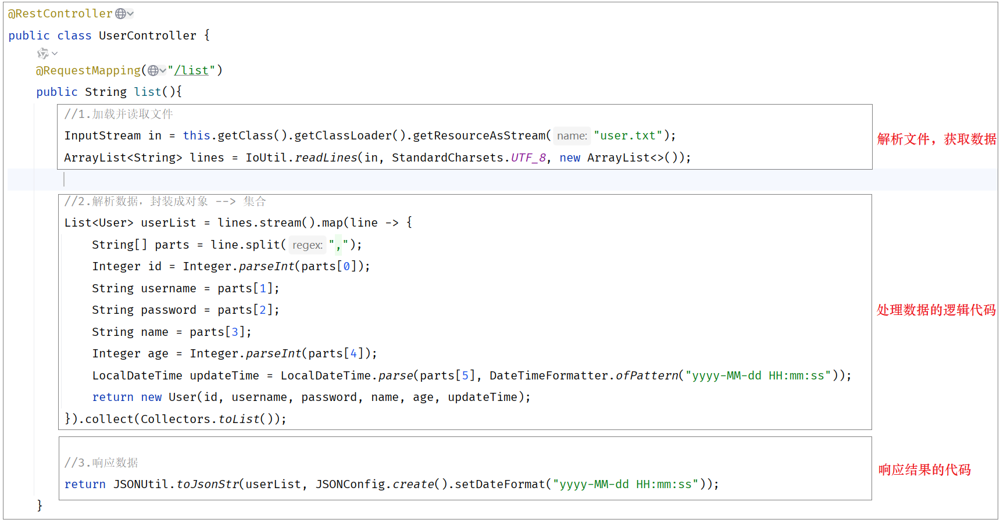

# SpringBootWeb案例

## 需求说明

需求：基于SpringBoot开发web程序，完成用户列表的渲染展示



当在浏览器地址栏，访问前端静态页面（`http://localhost:8080/usre.html`）后，在前端页面上，会发送ajax请求，请求服务端（`http://localhost:8080/list`），服务端程序加载 user\.txt 文件中的数据，读取出来后最终给前端页面响应json格式的数据，前端页面再将数据渲染展示在表格中。


## 代码实现

**1\)\. 准备工作：再创建一个SpringBoot工程，****并勾选web依赖、lombok依赖****。**






**2\)\. 准备工作：引入资料中准备好的数据文件user\.txt，以及static下的前端静态页面**



这些文件，在提供的资料中，已经提供了直接导入进来即可。 


**3\)\. 准备工作：定义封装用户信息的实体类。**

在 `com.itheima` 下再定义一个包 `pojo`，专门用来存放实体类。 在该包下定义一个实体类User：

```Java
package com.itheima.pojo;

import lombok.AllArgsConstructor;
import lombok.Data;
import lombok.NoArgsConstructor;
import java.time.LocalDateTime;

*/***
* * 封装用户信息*
* */*
@Data
@NoArgsConstructor
@AllArgsConstructor
public class User {
    private Integer id;
    private String username;
    private String password;
    private String name;
    private Integer age;
    private LocalDateTime updateTime;
}
```


**3\)\. 开发服务端程序，接收请求，读取文本数据并响应**

由于在案例中，需要读取文本中的数据，并且还需要将对象转为json格式，所以这里呢，我们在项目中再引入一个非常常用的工具包hutool。 然后调用里面的工具类，就可以非常方便快捷的完成业务操作。

- `pom.xml`中引入依赖

```XML
<dependency>
    <groupId>cn.hutool</groupId>
    <artifactId>hutool-all</artifactId>
    <version>5.8.27</version>
</dependency>
```

- 在`com.itheima`包下新建一个子包`controller`，在其中创建一个`UserController`

```Java
import cn.hutool.core.io.IoUtil;
import cn.hutool.json.JSONConfig;
import cn.hutool.json.JSONUtil;
import com.itheima.pojo.User;
import org.springframework.web.bind.annotation.RequestMapping;
import org.springframework.web.bind.annotation.RestController;
import java.io.InputStream;
import java.nio.charset.StandardCharsets;
import java.time.LocalDateTime;
import java.time.format.DateTimeFormatter;
import java.util.ArrayList;
import java.util.List;
import java.util.stream.Collectors;

@RestController
public class UserController {
    
    @RequestMapping("/list")
    public String list(){
        //1.加载并读取文件
        InputStream in = this.getClass().getClassLoader().getResourceAsStream("user.txt");
        ArrayList<String> lines = IoUtil.*readLines*(in, StandardCharsets.*UTF_8*, new ArrayList<>());
        
        //2.解析数据，封装成对象 --> 集合
        List<User> userList = lines.stream().map(line -> {
            String[] parts = line.split(",");
            Integer id = Integer.*parseInt*(parts[0]);
            String username = parts[1];
            String password = parts[2];
            String name = parts[3];
            Integer age = Integer.*parseInt*(parts[4]);
            LocalDateTime updateTime = LocalDateTime.*parse*(parts[5], DateTimeFormatter.*ofPattern*("yyyy-MM-dd HH:mm:ss"));

            return new User(id, username, password, name, age, updateTime);
        }).collect(Collectors.*toList*());
        
        //3.响应数据
        //return JSONUtil.*toJsonStr*(userList, JSONConfig.*create*().setDateFormat("yyyy-MM-dd HH:mm:ss"));
        return userList;
    }
    
}
```


**4\)\. ****启动服务测试****，访问：**`http://localhost:8080/user.html`




## @ResponseBody

前面我们学习过HTTL协议的交互方式：请求响应模式（有请求就有响应）。那么Controller程序呢，除了接收请求外，还可以进行响应。

在我们前面所编写的controller方法中，都已经设置了响应数据。

controller方法中的return的结果，怎么就可以响应给浏览器呢？

答案：使用@ResponseBody注解


**@****ResponseBody****注解：**

- 类型：方法注解、类注解

- 位置：书写在Controller方法上或类上

- 作用：将方法返回值直接响应给浏览器，如果返回值类型是实体对象/集合，将会转换为JSON格式后在响应给浏览器

但是在我们所书写的Controller中，只在类上添加了@RestController注解、方法添加了@RequestMapping注解，并没有使用@ResponseBody注解，怎么给浏览器响应呢？


这是因为，我们在类上加了@RestController注解，而这个注解是由两个注解组合起来的，分别是：@Controller 、@ResponseBody。 那也就意味着，我们在类上已经添加了@ResponseBody注解了，而一旦在类上加了@ResponseBody注解，就相当于该类所有的方法中都已经添加了@ResponseBody注解。 


> 提示：前后端分离的项目中，一般直接在请求处理类上加@RestController注解，就无需在方法上加@ResponseBody注解了。
> 
> 


## 问题分析

上述案例的功能，我们虽然已经实现，但是呢，我们会发现案例中：解析文本文件中的数据，处理数据的逻辑代码，给页面响应的代码全部都堆积在一起了，全部都写在controller方法中了。



当前程序的这个业务逻辑还是比较简单的，如果业务逻辑再稍微复杂一点，我们会看到Controller方法的代码量就很大了。

- 当我们要修改操作数据部分的代码，需要改动Controller

- 当我们要完善逻辑处理部分的代码，需要改动Controller

- 当我们需要修改数据响应的代码，还是需要改动Controller

这样呢，就会造成我们整个工程代码的复用性比较差，而且代码难以维护。 那如何解决这个问题呢？其实在现在的开发中，有非常成熟的解决思路，那就是分层开发。 


