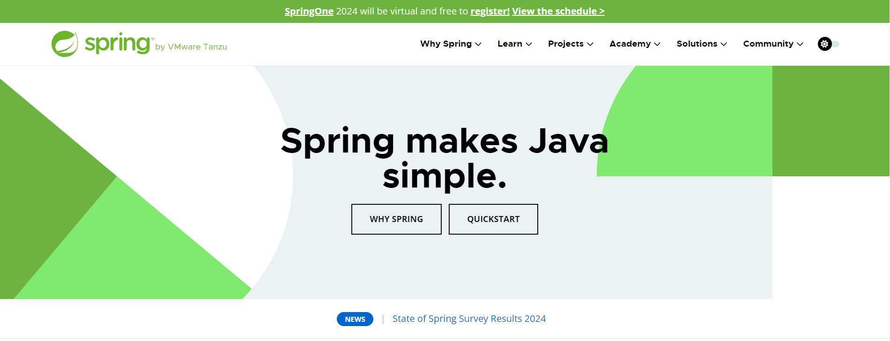
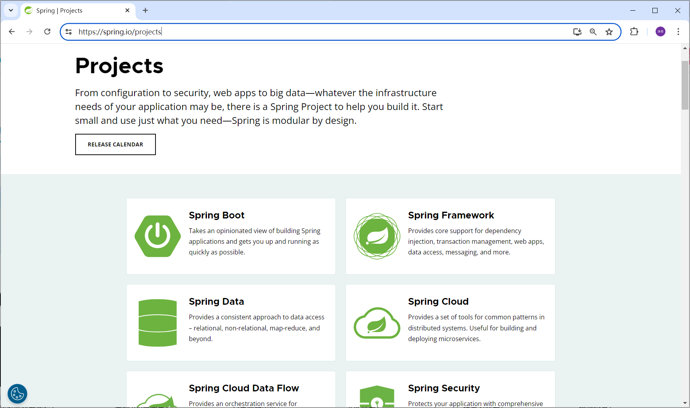
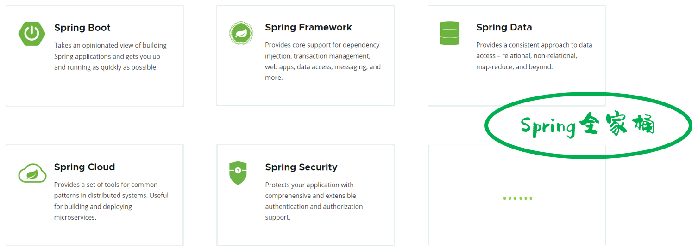
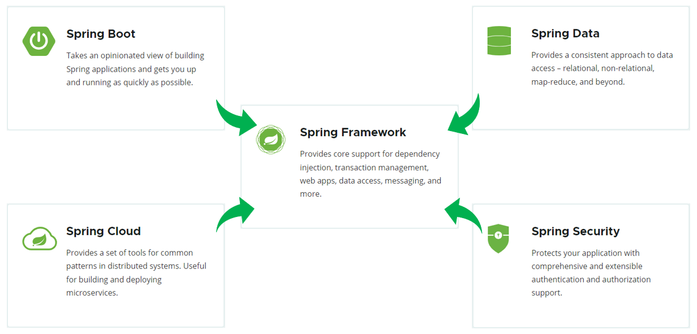
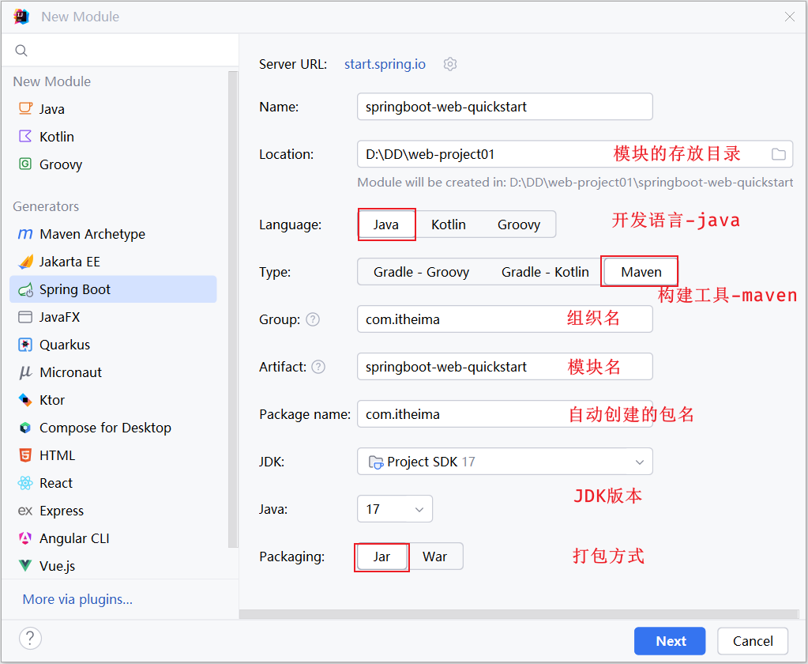
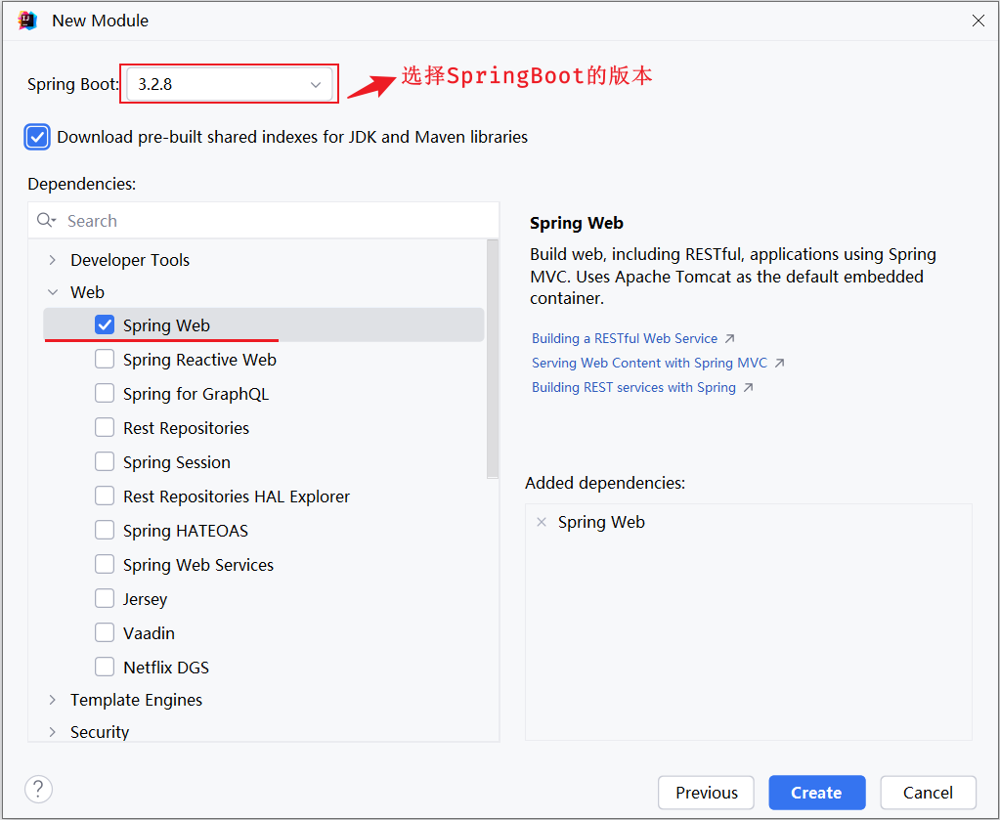
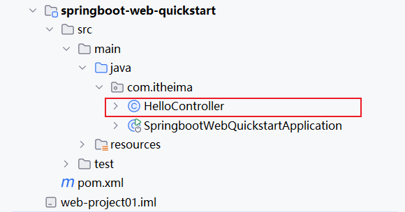
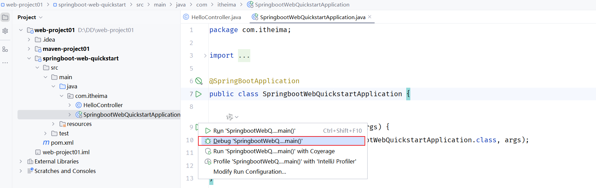
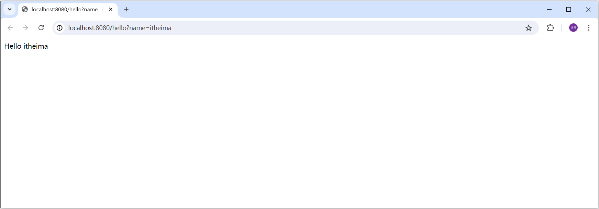
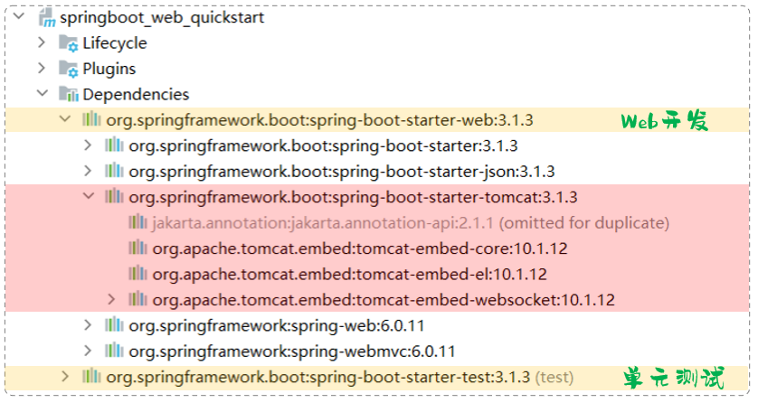

# SpringBootWeb入门

那接下来呢，我们就要来讲解现在企业开发的主流技术 SpringBoot，并基于SpringBoot进行Web程序的开发 。

## 概述

在没有正式的学习SpringBoot之前，我们要先来了解下什么是Spring。

我们可以打开Spring的官网\(https://spring\.io\)，去看一下Spring的简介：Spring makes Java simple。



Spring的官方提供很多开源的项目，我们可以点击上面的projects，看到spring家族旗下的项目，按照流行程度排序为：



Spring发展到今天已经形成了一种开发生态圈，Spring提供了若干个子项目，每个项目用于完成特定的功能。而我们在项目开发时，一般会偏向于选择这一套spring家族的技术，来解决对应领域的问题，那我们称这一套技术为**spring全家桶**。



而Spring家族旗下这么多的技术，最基础、最核心的是 SpringFramework。其他的spring家族的技术，都是基于SpringFramework的，SpringFramework中提供很多实用功能，如：依赖注入、事务管理、web开发支持、数据访问、消息服务等等。



而如果我们在项目中，直接基于**SpringFramework**进行开发，存在两个问题：

- 配置繁琐

- 入门难度大

所以基于此呢，spring官方推荐我们从另外一个项目开始学习，那就是目前最火爆的SpringBoot。 通过springboot就可以快速的帮我们构建应用程序，所以**springboot**呢，最大的特点有两个 ：

- 简化配置

- 快速开发

**Spring Boot 可以帮助我们非常快速的构建应用程序、简化开发、提高效率 。**

**而直接基于SpringBoot进行项目构建和开发，不仅是Spring官方推荐的方式，也是现在企业开发的主流。**


## 入门程序

### 需求

需求：基于SpringBoot的方式开发一个web应用，浏览器发起请求/hello后，给浏览器返回字符串 "Hello xxx \~"。


### 开发步骤

第1步：创建SpringBoot工程，并勾选Web开发相关依赖

第2步：定义HelloController类，添加方法hello，并添加注解


**1\)\. 创建SpringBoot工程（需要联网）**

基于Spring官方骨架，创建SpringBoot工程。




基本信息描述完毕之后，勾选web开发相关依赖。



SpringBoot官方提供的脚手架，里面只能够选择SpringBoot的几个最新的版本，如果要选择其他相对低一点的版本，可以在springboot项目创建完毕之后，修改项目的pom\.xml文件中的版本号。

点击Create之后，就会联网创建这个SpringBoot工程，创建好之后，结构如下：


**注意：在联网创建过程中，会下载相关资源\(请耐心等待\)**


**2\)\. ****定义HelloController类，添加方法hello，并添加注解**

在`com.itheima`这个包下新建一个类：`HelloController`



HelloController中的内容，具体如下：

```Java
package com.itheima;

import org.springframework.web.bind.annotation.RequestMapping;
import org.springframework.web.bind.annotation.RestController;

@RestController //标识当前类是一个请求处理类
public class HelloController {

    @RequestMapping("/hello") //标识请求路径
    public String hello(String name){
        System.*out*.println("HelloController ... hello: " + name);
        return "Hello " + name;
    }

}
```


**3\)\. 运行测试**

运行SpringBoot自动生成的引导类 \(标识有`@SpringBootApplication`注解的类\)




打开浏览器，输入 `http://localhost:8080/hello?name=itheima`




### 常见问题

大伙儿在下来联系的时候，联网基于spring的脚手架创建SpringBoot项目，偶尔可能会因为网内网络的原因，链接不上SpringBoot的脚手架网站，此时会出现如下现象：


此时可以使用阿里云提供的脚手架，网址为：https://start\.aliyun\.com


然后按照项目创建的向导，一步一步的创建项目即可。


## 入门解析

那在上面呢，我们已经完成了SpringBootWeb的入门程序，并且测试通过。 在入门程序中，我们发现，我们只需要一个main方法就可以将web应用启动起来了，然后就可以打开浏览器访问了。

那接下来我们需要明确两个问题：

**1\)\. ****为什么一个main方法就可以将Web应用启动了？**


因为我们在创建springboot项目的时候，选择了web开发的**起步依赖** `spring-boot-starter-web`。而`spring-boot-starter-web`依赖，又依赖了`spring-boot-starter-tomcat`，由于maven的依赖传递特性，那么在我们创建的springboot项目中也就已经有了tomcat的依赖，这个其实就是springboot中内嵌的tomcat。 



而我们运行引导类中的main方法，其实启动的就是springboot中内嵌的Tomcat服务器。 而我们所开发的项目，也会自动的部署在该tomcat服务器中，并占用8080端口号 。 


**起步依赖：**

- 一种为开发者提供简化配置和集成的机制，使得构建Spring应用程序更加轻松。起步依赖本质上是一组预定义的依赖项集合，它们一起提供了在特定场景下开发Spring应用所需的所有库和配置。

    - spring\-boot\-starter\-web：包含了web应用开发所需要的常见依赖。

    - spring\-boot\-starter\-test：包含了单元测试所需要的常见依赖。

- 官方提供的starter：[https://docs\.spring\.io/spring\-boot/docs/3\.1\.3/reference/htmlsingle/\#using\.build\-systems\.starters](https://docs.spring.io/spring-boot/docs/3.1.3/reference/htmlsingle/)


