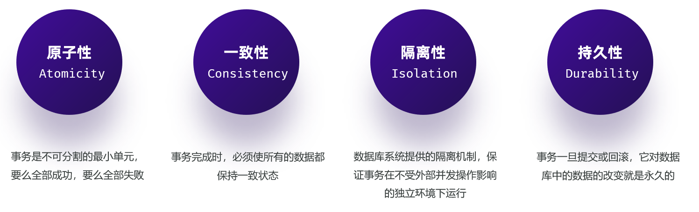

# 事务四大特性

面试题：事务有哪些特性？

- 原子性（Atomicity）：事务是不可分割的最小单元，要么全部成功，要么全部失败。

- 一致性（Consistency）：事务完成时，必须使所有的数据都保持一致状态。

- 隔离性（Isolation）：数据库系统提供的隔离机制，保证事务在不受外部并发操作影响的独立环境下运行。

- 持久性（Durability）：事务一旦提交或回滚，它对数据库中的数据的改变就是永久的。

事务的四大特性简称为：ACID

- **原子性（Atomicity）** ：原子性是指事务包装的一组sql是一个不可分割的工作单元，事务中的操作要么全部成功，要么全部失败。

- **一致性（Consistency）**：一个事务完成之后数据都必须处于一致性状态。

    - 如果事务成功的完成，那么数据库的所有变化将生效。

    - 如果事务执行出现错误，那么数据库的所有变化将会被回滚\(撤销\)，返回到原始状态。

- **隔离性（Isolation）**：多个用户并发的访问数据库时，一个用户的事务不能被其他用户的事务干扰，多个并发的事务之间要相互隔离。

    - 一个事务的成功或者失败对于其他的事务是没有影响。

- **持久性（Durability）**：一个事务一旦被提交或回滚，它对数据库的改变将是永久性的，哪怕数据库发生异常，重启之后数据亦然存在。

