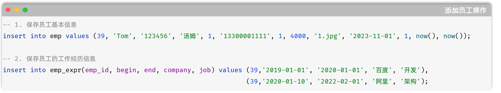

# 介绍

**概念：** 事务是一组操作的集合，它是一个不可分割的工作单位。事务会把所有的操作作为一个整体一起向系统提交或撤销操作请求，即这些操作 要么同时成功，要么同时失败。

就拿添加员工的这个业务为例，在这个业务操作中，包含了两个操作，那这两个操作是一个不可分割的工作单位。

这两个操作，要么同时失败，要么同时成功。

默认MySQL的事务是自动提交的，也就是说，当执行一条DML语句，MySQL会立即隐式的提交事务。

