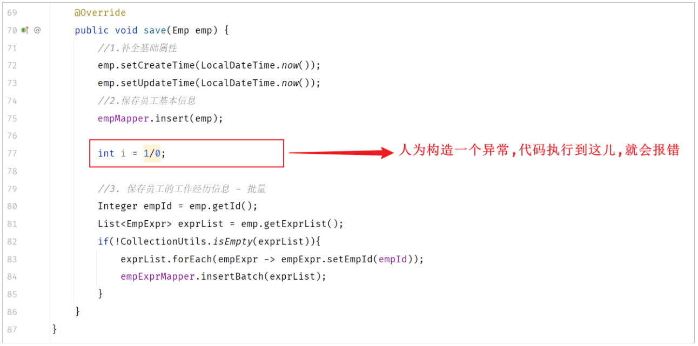
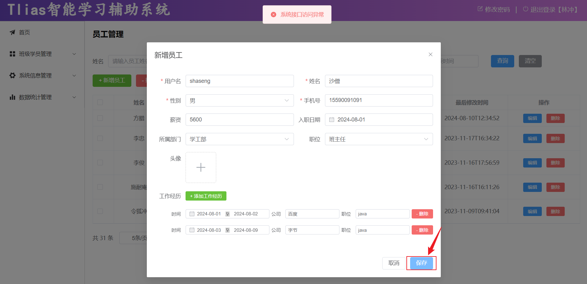
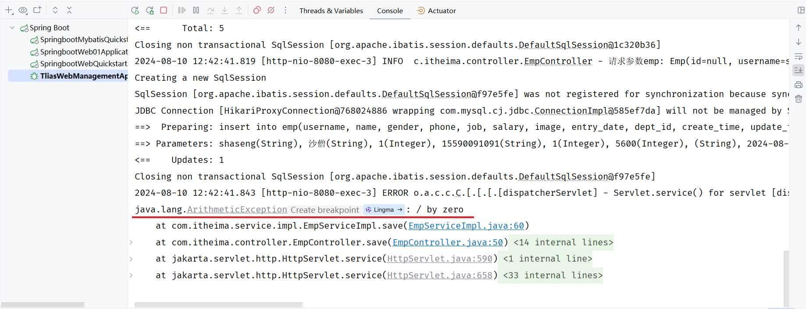
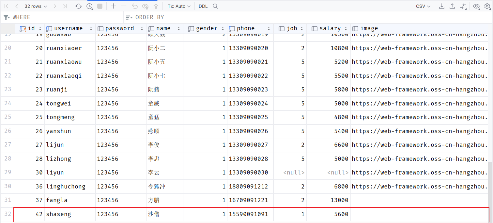
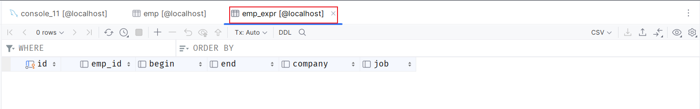

# 问题分析

实现新增员工功能中，要操作两次数据库，新增员工的同时要新增其工作经历，需要执行了两次 insert 操作。

- 第一次：保存员工的基本信息到 `emp` 表中。

- 第二次：保存员工的工作经历信息到 `emp_expr` 表中。

如果说，保存员工的基本信息成功了，而保存员工的工作经历信息出错了，会发生什么现象呢？那接下来，我们来做一个测试 。 我们可以在代码中，人为在保存员工的service层的save方法中，构造一个错误：

那接下来，我们就重启服务，打开浏览器，来做一个测试：

点击 “保存” 之后，提示 “系统接口异常”。我们可以打开IDEA控制台看一下，报出的错误信息。 我们看到，保存了员工的基本信息之后，系统出现了异常。

我们再打开数据库，看看表结构中的数据是否正常。

1\)\. `emp` 员工表中是有 `shaseng` 这条数据的。

2\)\. `emp_expr` 表中没有该员工的工作经历信息。

最终，我们看到，程序出现了异常 ，员工表 `emp` 数据保存成功了, 但是 `emp_expr` 员工工作经历信息表，数据保存失败了。 那是否允许这种情况发生呢？

- 不允许

- 因为这属于一个业务操作，如果保存员工信息成功了，保存工作经历信息失败了，就会造成数据库数据的不完整、不一致。

那如何解决这个问题呢？ 这需要通过数据库中的**事务**来解决这个问题。
