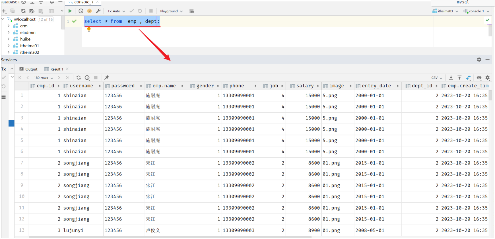
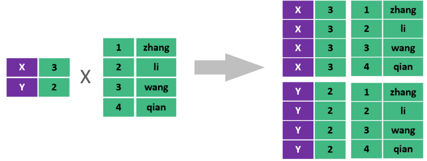
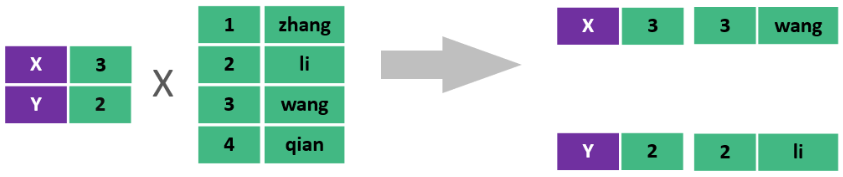
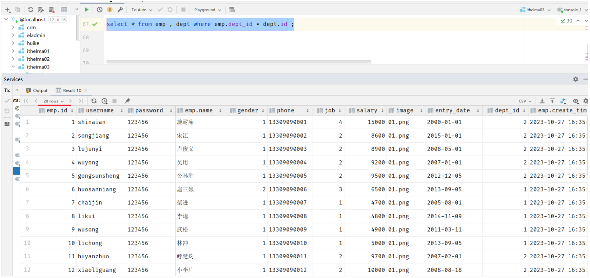
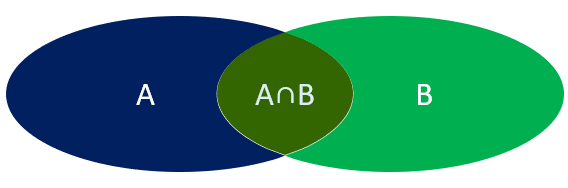

# 多表查询

## 概述

### 数据准备

创建数据库，执行如下SQL脚本：

```SQL
-- 部门管理
create table dept(
    id int unsigned primary key auto_increment comment 'ID, 主键',
    name varchar(10) not null unique comment '部门名称',
    create_time datetime comment '创建时间',
    update_time datetime comment '修改时间'
) comment '部门表' ;

insert into dept (id, name, create_time, update_time) values
        (1,'学工部',now(),now()),
        (2,'教研部',now(),now()),
        (3,'咨询部',now(),now()),
        (4,'就业部',now(),now()),
        (5,'人事部',now(),now());


-- 员工管理
create table emp(
    id int unsigned primary key auto_increment comment 'ID,主键',
    username varchar(20) not null unique comment '用户名',
    password varchar(32) not null comment '密码',
    name varchar(10) not null comment '姓名',
    gender tinyint unsigned not null comment '性别, 1:男, 2:女',
    phone char(11) not null unique comment '手机号',
    job tinyint unsigned comment '职位, 1:班主任,2:讲师,3:学工主管,4:教研主管,5:咨询师',
    salary int unsigned comment '薪资',
    image varchar(300) comment '头像',
    entry_date date comment '入职日期',
    dept_id int unsigned COMMENT '关联的部门ID',
    create_time datetime comment '创建时间',
    update_time datetime comment '修改时间'
) comment '员工表';


-- 准备测试数据
INSERT INTO `emp` VALUES (1,'shinaian','123456','施耐庵',1,'13309090001',4,15000,'https://dawn-itcast.oss-cn-hangzhou.aliyuncs.com/01.png','2000-01-01',2,'2023-10-27 16:35:33','2023-10-27 16:35:35'),
                        (2,'songjiang','123456','宋江',1,'13309090002',2,8600,'https://dawn-itcast.oss-cn-hangzhou.aliyuncs.com/01.png','2015-01-01',2,'2023-10-27 16:35:33','2023-10-27 16:35:37'),
                        (3,'lujunyi','123456','卢俊义',1,'13309090003',2,8900,'https://dawn-itcast.oss-cn-hangzhou.aliyuncs.com/01.png','2008-05-01',2,'2023-10-27 16:35:33','2023-10-27 16:35:39'),
                        (4,'wuyong','123456','吴用',1,'13309090004',2,9200,'https://dawn-itcast.oss-cn-hangzhou.aliyuncs.com/01.png','2007-01-01',2,'2023-10-27 16:35:33','2023-10-27 16:35:41'),
                        (5,'gongsunsheng','123456','公孙胜',1,'13309090005',2,9500,'https://dawn-itcast.oss-cn-hangzhou.aliyuncs.com/01.png','2012-12-05',2,'2023-10-27 16:35:33','2023-10-27 16:35:43'),
                        (6,'huosanniang','123456','扈三娘',2,'13309090006',3,6500,'https://dawn-itcast.oss-cn-hangzhou.aliyuncs.com/01.png','2013-09-05',1,'2023-10-27 16:35:33','2023-10-27 16:35:45'),
                        (7,'chaijin','123456','柴进',1,'13309090007',1,4700,'https://dawn-itcast.oss-cn-hangzhou.aliyuncs.com/01.png','2005-08-01',1,'2023-10-27 16:35:33','2023-10-27 16:35:47'),
                        (8,'likui','123456','李逵',1,'13309090008',1,4800,'https://dawn-itcast.oss-cn-hangzhou.aliyuncs.com/01.png','2014-11-09',1,'2023-10-27 16:35:33','2023-10-27 16:35:49'),
                        (9,'wusong','123456','武松',1,'13309090009',1,4900,'https://dawn-itcast.oss-cn-hangzhou.aliyuncs.com/01.png','2011-03-11',1,'2023-10-27 16:35:33','2023-10-27 16:35:51'),
                        (10,'lichong','123456','林冲',1,'13309090010',1,5000,'https://dawn-itcast.oss-cn-hangzhou.aliyuncs.com/01.png','2013-09-05',1,'2023-10-27 16:35:33','2023-10-27 16:35:53'),
                        (11,'huyanzhuo','123456','呼延灼',1,'13309090011',2,9700,'https://dawn-itcast.oss-cn-hangzhou.aliyuncs.com/01.png','2007-02-01',2,'2023-10-27 16:35:33','2023-10-27 16:35:55'),
                        (12,'xiaoliguang','123456','小李广',1,'13309090012',2,10000,'https://dawn-itcast.oss-cn-hangzhou.aliyuncs.com/01.png','2008-08-18',2,'2023-10-27 16:35:33','2023-10-27 16:35:57'),
                        (13,'yangzhi','123456','杨志',1,'13309090013',1,5300,'https://dawn-itcast.oss-cn-hangzhou.aliyuncs.com/01.png','2012-11-01',1,'2023-10-27 16:35:33','2023-10-27 16:35:59'),
                        (14,'shijin','123456','史进',1,'13309090014',2,10600,'https://dawn-itcast.oss-cn-hangzhou.aliyuncs.com/01.png','2002-08-01',2,'2023-10-27 16:35:33','2023-10-27 16:36:01'),
                        (15,'sunerniang','123456','孙二娘',2,'13309090015',2,10900,'https://dawn-itcast.oss-cn-hangzhou.aliyuncs.com/01.png','2011-05-01',2,'2023-10-27 16:35:33','2023-10-27 16:36:03'),
                        (16,'luzhishen','123456','鲁智深',1,'13309090016',2,9600,'https://dawn-itcast.oss-cn-hangzhou.aliyuncs.com/01.png','2010-01-01',2,'2023-10-27 16:35:33','2023-10-27 16:36:05'),
                        (17,'liying','12345678','李应',1,'13309090017',1,5800,'https://dawn-itcast.oss-cn-hangzhou.aliyuncs.com/01.png','2015-03-21',1,'2023-10-27 16:35:33','2023-10-27 16:36:07'),
                        (18,'shiqian','123456','时迁',1,'13309090018',2,10200,'https://dawn-itcast.oss-cn-hangzhou.aliyuncs.com/01.png','2015-01-01',2,'2023-10-27 16:35:33','2023-10-27 16:36:09'),
                        (19,'gudasao','123456','顾大嫂',2,'13309090019',2,10500,'https://dawn-itcast.oss-cn-hangzhou.aliyuncs.com/01.png','2008-01-01',2,'2023-10-27 16:35:33','2023-10-27 16:36:11'),
                        (20,'ruanxiaoer','123456','阮小二',1,'13309090020',2,10800,'https://dawn-itcast.oss-cn-hangzhou.aliyuncs.com/01.png','2018-01-01',2,'2023-10-27 16:35:33','2023-10-27 16:36:13'),
                        (21,'ruanxiaowu','123456','阮小五',1,'13309090021',5,5200,'https://dawn-itcast.oss-cn-hangzhou.aliyuncs.com/01.png','2015-01-01',3,'2023-10-27 16:35:33','2023-10-27 16:36:15'),
                        (22,'ruanxiaoqi','123456','阮小七',1,'13309090022',5,5500,'https://dawn-itcast.oss-cn-hangzhou.aliyuncs.com/01.png','2016-01-01',3,'2023-10-27 16:35:33','2023-10-27 16:36:17'),
                        (23,'ruanji','123456','阮籍',1,'13309090023',5,5800,'https://dawn-itcast.oss-cn-hangzhou.aliyuncs.com/01.png','2012-01-01',3,'2023-10-27 16:35:33','2023-10-27 16:36:19'),
                        (24,'tongwei','123456','童威',1,'13309090024',5,5000,'https://dawn-itcast.oss-cn-hangzhou.aliyuncs.com/01.png','2006-01-01',3,'2023-10-27 16:35:33','2023-10-27 16:36:21'),
                        (25,'tongmeng','123456','童猛',1,'13309090025',5,4800,'https://dawn-itcast.oss-cn-hangzhou.aliyuncs.com/01.png','2002-01-01',3,'2023-10-27 16:35:33','2023-10-27 16:36:23'),
                        (26,'yanshun','123456','燕顺',1,'13309090026',5,5400,'https://dawn-itcast.oss-cn-hangzhou.aliyuncs.com/01.png','2011-01-01',3,'2023-10-27 16:35:33','2023-10-27 16:36:25'),
                        (27,'lijun','123456','李俊',1,'13309090027',5,6600,'https://dawn-itcast.oss-cn-hangzhou.aliyuncs.com/01.png','2004-01-01',3,'2023-10-27 16:35:33','2023-10-27 16:36:27'),
                        (28,'lizhong','123456','李忠',1,'13309090028',5,5000,'https://dawn-itcast.oss-cn-hangzhou.aliyuncs.com/01.png','2007-01-01',3,'2023-10-27 16:35:33','2023-10-27 16:36:29'),
                        (29,'songqing','123456','宋清',1,'13309090029',NULL,5100,'https://dawn-itcast.oss-cn-hangzhou.aliyuncs.com/01.png','2020-01-01',NULL,'2023-10-27 16:35:33','2023-10-27 16:36:31'),
                        (30,'liyun','123456','李云',1,'13309090030',NULL,NULL,'https://dawn-itcast.oss-cn-hangzhou.aliyuncs.com/01.png','2020-03-01',NULL,'2023-10-27 16:35:33','2023-10-27 16:36:31');

```


### 介绍

多表查询：查询时从多张表中获取所需数据

> 单表查询的SQL语句：select  字段列表  from  表名;
> 
> 那么要执行多表查询，只需要使用逗号分隔多张表即可，如： select   字段列表  from  表1, 表2;
> 
> 


查询用户表和部门表中的数据：

```SQL
select * from  emp , dept;
```



此时，我们看到查询结果中包含了大量的结果集，总共`180`条记录，而这其实就是员工表所有的记录\(30行\)与部门表所有记录\(6行\)的所有组合情况，这种现象称之为**笛卡尔积**。


**笛卡尔积****：**笛卡尔乘积是指在数学中，两个集合\(A集合和B集合\)的所有组合情况。



在多表查询时，需要消除无效的笛卡尔积，只保留表关联部分的数据。



在SQL语句中，如何去除无效的笛卡尔积呢？只需要给多表查询加上连接查询的条件即可。

```SQL
select * from emp , dept where emp.dept_id = dept.id ;
```



这样，我们就查询出来了所有的员工，及其这个员工所属的部门信息。 而由于id为29、30的员工，没有dept\_id字段值，所以在多表查询时，根据连接查询的条件并没有查询到。


### 分类

多表查询可以分为：



1. 连接查询

    - 内连接：相当于查询A、B交集部分数据

    - 外连接

        - 左外连接：查询左表所有数据\(包括两张表交集部分数据\)

        - 右外连接：查询右表所有数据\(包括两张表交集部分数据\)

2. 子查询


## 内连接

内连接查询：查询两表或多表中交集部分数据。

内连接从语法上可以分为：

- 隐式内连接

- 显式内连接


**隐式内连接语法：**

```SQL
select  字段列表   from   表1 , 表2   where  条件 ... ;
```

**显式内连接语法：**

```SQL
select  字段列表   from   表1  [ inner ]  join 表2  on  连接条件 ... ;
```


- 案例1：查询所有员工的ID，姓名，及所属的部门名称

    - 隐式内连接实现

    ```SQL
    select emp.id, emp.name, dept.name from emp , dept where emp.dept_id = dept.id;
    ```

    - 显式内连接实现

    ```SQL
    select emp.id, emp.name, dept.name from emp inner join dept on emp.dept_id = dept.id;
    ```

    

- 案例2：查询 性别为男, 且工资 高于8000 的员工的ID, 姓名, 及所属的部门名称

    - 隐式内连接实现

    ```SQL
    select emp.id, emp.name, dept.name from emp , dept where emp.dept_id = dept.id and emp.gender = 1 and emp.salary > 8000;
    ```

    - 显式内连接实现

    ```SQL
    select emp.id, emp.name, dept.name from emp inner join dept on emp.dept_id = dept.id where emp.gender = 1 and emp.salary > 8000;
    ```

    在多表联查时，我们指定字段时，需要在字段名前面加上表名，来指定具体是哪一张的字段。 如：emp\.dept\_id

    

**给表起别名简化书写：**

```SQL
select  字段列表 from 表1 as 别名1 , 表2 as  别名2  where  条件 ... ;

select  字段列表 from 表1 别名1 , 表2  别名2  where  条件 ... ;  -- as 可以省略
```

使用了别名的多表查询：

```SQL
select e.id, e.name, d.name from emp as e , dept as d where e.dept_id = d.id and e.gender = 1 and e.salary > 8000;
```

**注意事项:** 一旦为表起了别名，就不能再使用表名来指定对应的字段了，此时只能够使用别名来指定字段。


## 外连接

外连接分为两种：左外连接 和 右外连接。

**左外连接语法：**

```SQL
select  字段列表   from   表1  left  [ outer ]  join 表2  on  连接条件 ... ;
```

左外连接相当于查询表1\(左表\)的所有数据，当然也包含表1和表2交集部分的数据。


**右外连接语法：**

```SQL
select  字段列表   from   表1  right  [ outer ]  join 表2  on  连接条件 ... ;
```

右外连接相当于查询表2\(右表\)的所有数据，当然也包含表1和表2交集部分的数据。


案例1：查询员工表 所有 员工的姓名, 和对应的部门名称 \(左外连接\)

```SQL
-- 左外连接：以left join关键字左边的表为主表，查询主表中所有数据，以及和主表匹配的右边表中的数据
select e.name , d.name  from emp as e left join dept as d on e.dept_id = d.id ;
```

案例2：查询部门表 所有 部门的名称, 和对应的员工名称 \(右外连接\)

```SQL
-- 右外连接：以right join关键字右边的表为主表，查询主表中所有数据，以及和主表匹配的左边表中的数据
select e.name , d.name from emp as e right join dept as d on e.dept_id = d.id;
```

案例3：查询工资 高于8000 的 所有员工的姓名, 和对应的部门名称 \(左外连接\)

```SQL
select e.name , d.name  from emp as e left join dept as d on e.dept_id = d.id where e.salary > 8000;
```

**注意事项：**

左外连接和右外连接是可以相互替换的，只需要调整连接查询时SQL语句中表的先后顺序就可以了。而我们在日常开发使用时，更偏向于左外连接。


## 子查询

### 介绍

SQL语句中嵌套select语句，称为嵌套查询，又称子查询。

```SQL
SELECT  *  FROM   t1   WHERE  column1 =  ( SELECT  column1  FROM  t2 ... );
```

子查询外部的语句可以是insert / update / delete / select 的任何一个，最常见的是 select。


根据子查询结果的不同分为：

1. 标量子查询（子查询结果为单个值 \[一行一列\]）

2. 列子查询（子查询结果为一列，但可以是多行）

3. 行子查询（子查询结果为一行，但可以是多列）

4. 表子查询（子查询结果为多行多列\[相当于子查询结果是一张表\]）


子查询可以书写的位置：

1. where之后

2. from之后

3. select之后

子查询的要点是，先对需求做拆分，明确具体的步骤，然后再逐条编写SQL语句。 最终将多条SQL语句合并为一条。


### 标量子查询

子查询返回的结果是单个值\(数字、字符串、日期等\)，最简单的形式，这种子查询称为**标量子查询**。

常用的操作符： =   \<\>   \>    \>=    \<   \<=   


- 案例1：查询 最早入职 的员工信息

```SQL
-- 1. 查询最早的入职时间
select min(entry_date) from emp;  -- 结果: 2000-01-01

-- 2. 查询入职时间 = 最早入职时间的员工信息
select * from emp where entry_date = '2000-01-01';

-- 3. 合并为一条SQL
select * from emp where entry_date = (select min(entry_date) from emp);
```


- 案例2：查询在 阮小五 入职之后入职的员工信息

```SQL
-- 1. 查询 "阮小五" 的入职日期
select entry_date from emp where name = '阮小五'; -- 结果: 2015-01-01

-- 2. 根据上述查询到的这个入职日期, 查询在该日期之后入职的员工信息
select * from emp where entry_date > '2015-01-01';

-- 3. 合并SQL为一条SQL
select * from emp where entry_date > (select entry_date from emp where name = '阮小五');
```


### 列子查询

子查询返回的结果是一列\(可以是多行\)，这种子查询称为列子查询。

常用的操作符：


- 案例1：查询 "教研部" 和 "咨询部" 的所有员工信息

```SQL
-- 1. 查询 "教研部" 和 "咨询部" 的部门ID
select id from dept where name = '教研部' or name = '咨询部'; -- 结果: 3,2

-- 2. 根据上面查询出来的部门ID, 查询员工信息
select * from emp where dept_id in(3,2);

-- 3. 合并SQL为一条SQL语句
select * from emp where dept_id in (select id from dept where name = '教研部' or name = '咨询部');
```


### 行子查询

子查询返回的结果是一行\(可以是多列\)，这种子查询称为行子查询。

常用的操作符：= 、\<\> 、IN 、NOT IN


- 案例1：查询与 "李忠" 的薪资 及 职位都相同的员工信息

```SQL
-- 1. 查询 "李忠" 的薪资和职位
select salary , job from emp where name = '李忠'; -- 结果: 5000, 5

-- 2. 根据上述查询到的薪资和职位 , 查询对应员工的信息
select * from emp where (salary, job) = (5000,5);

-- 3. 将两条SQL合并为一条SQL
select * from emp where (salary, job) = (select salary , job from emp where name = '李忠');
```


### 表子查询

子查询返回的结果是多行多列，常作为临时表，这种子查询称为**表子查询**。


- 案例：*获取每个部门中薪资最高的员工信息*

```SQL
*-- a. 获取每个部门的最高薪资*
select dept_id, *max*(salary) from emp group by dept_id;

*-- b. 查询每个部门中薪资最高的员工信息*
select ** *from emp e , (select dept_id, *max*(salary) max_sal from emp group by dept_id) a
    where e.dept_id = a.dept_id and e.salary = a.max_sal;
```


### 案例

根据需求，完成多表查询的SQL语句的编写。

- 1\. 查询 "教研部" 性别为 男，且在 "2011\-05\-01" 之后入职的员工信息 。

```SQL
select e.* from emp as e , dept as d where e.dept_id = d.id and d.name = '教研部' and e.gender = 1 and e.entry_date > '2011-05-01';
```


- 2\. 查询工资 低于公司平均工资的 且 性别为男 的员工信息 。

```SQL
select e.* from emp as e , dept as d where e.dept_id = d.id and e.salary < (select avg(salary) from emp) and e.gender = 1;
```


- 3\. 查询部门人数超过 10 人的部门名称 。

```SQL
select d.name , count(*) from emp as e , dept as d where e.dept_id = d.id group by d.name having count(*) > 10;
```


- 4\. 查询在 "2010\-05\-01" 后入职，且薪资高于 10000 的 "教研部" 员工信息，并根据薪资倒序排序。

```SQL
select **** *from emp e , dept d where e.dept_id = d.id and e.entry_date > '2010-05-01' and e.salary > 10000 and d.name = '教研部' order by e.salary desc;
```


- 5\. 查询工资 低于本部门平均工资的员工信息 。【难】

```SQL
*-- 5.1 查询每个部门的平均工资*
select dept_id, *avg*(salary) avg_sal from emp group by dept_id;

*-- 5.2 查询工资 低于本部门平均工资 的员工信息 。*
select e.* from emp e , (select dept_id, *avg*(salary) avg_sal from emp group by dept_id) as a
          where e.dept_id = a.dept_id and e.salary < a.avg_sal;
```


