# 多表关系

项目开发中，在进行数据库表结构设计时，会根据业务需求及业务模块之间的关系，分析并设计表结构，由于业务之间相互关联，所以各个表结构之间也存在着各种联系，基本上分为三种：

- 一对多\(多对一\)

- 多对多

- 一对一


## 一对多

- 场景：部门与员工的关系（一个部门下有多个员工）。

- 部门管理的页面原型：

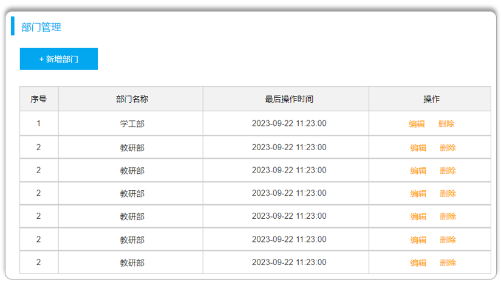

- 员工管理的页面原型：

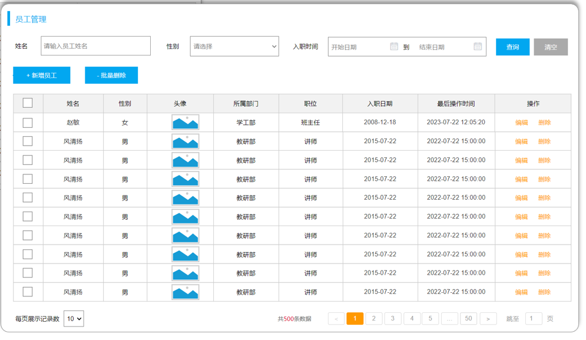

由于一个部门下，会关联多个员工。 而一个员工，是归属于某一个部门的 。那么此时，我们就需要在 `emp` 表中增加一个字段 `dept_id` 来标识这个员工属于哪一个部门，`dept_id` 关联的是 `dept` 的 `id` 。 如下所示：

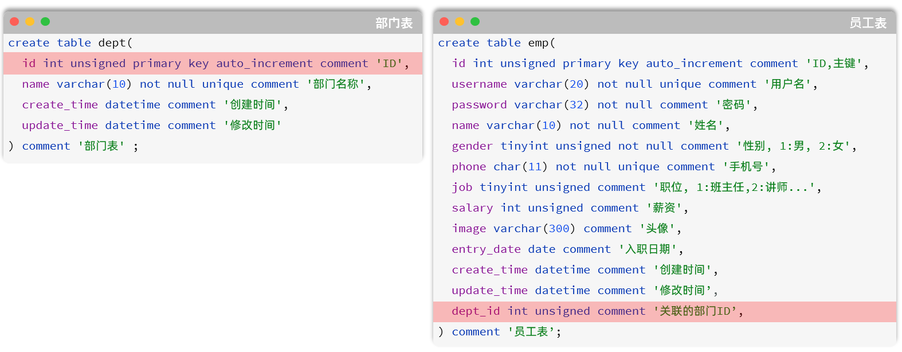

上述的 `emp` 员工表的 `dept_id` 字段，关联的是 `dept` 部门表的 `id` 。部门表是一的一方，也称为**父表**，员工表是多的一方，称之为**子表**。

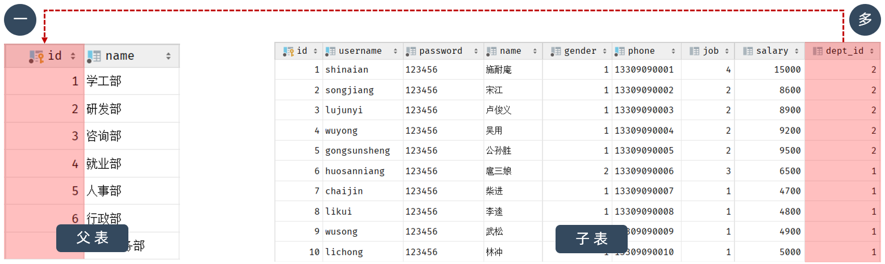


那接下来，我们就可以将上述的两张表创建出来。具体的SQL语句如下：

```SQL
CREATE TABLE dept (
  id int unsigned PRIMARY KEY AUTO_INCREMENT COMMENT 'ID, 主键',
  name varchar(10) NOT NULL UNIQUE COMMENT '部门名称',
  create_time datetime DEFAULT NULL COMMENT '创建时间',
  update_time datetime DEFAULT NULL COMMENT '修改时间'
) COMMENT '部门表';

INSERT INTO dept VALUES (1,'学工部','2024-09-25 09:47:40','2023-04-25 09:47:40'),
                      (2,'教研部','2024-09-25 09:47:40','2024-10-09 15:17:04'),
                      (3,'咨询部2','2024-09-25 09:47:40','2024-11-30 21:26:24'),
                      (4,'就业部','2024-09-25 09:47:40','2024-09-25 09:47:40'),
                      (5,'人事部','2024-09-25 09:47:40','2024-09-25 09:47:40'),
                      (6,'行政部','2024-11-30 20:56:37','2024-11-30 20:56:37');

create table emp(
    id int unsigned primary key auto_increment comment 'ID,主键',
    username varchar(20) not null unique comment '用户名',
    password varchar(50) default '123456' comment '密码',
    name varchar(10) not null comment '姓名',
    gender tinyint unsigned not null comment '性别, 1:男, 2:女',
    phone char(11) not null unique comment '手机号',
    job tinyint unsigned comment '职位, 1 班主任, 2 讲师 , 3 学工主管, 4 教研主管, 5 咨询师',
    salary int unsigned comment '薪资',
    image varchar(300) comment '头像',
    entry_date date comment '入职日期',
    dept_id int unsigned comment '部门ID',
    create_time datetime comment '创建时间',
    update_time datetime comment '修改时间'
) comment '员工表';


INSERT INTO emp VALUES 
    (1,'shinaian','123456','施耐庵',1,'13309090001',4,15000,'5.png','2000-01-01',2,'2023-10-20 16:35:33','2023-11-16 16:11:26'),
    (2,'songjiang','123456','宋江',1,'13309090002',2,8600,'01.png','2015-01-01',2,'2023-10-20 16:35:33','2023-10-20 16:35:37'),
    (3,'lujunyi','123456','卢俊义',1,'13309090003',2,8900,'01.png','2008-05-01',2,'2023-10-20 16:35:33','2023-10-20 16:35:39'),
    (4,'wuyong','123456','吴用',1,'13309090004',2,9200,'01.png','2007-01-01',2,'2023-10-20 16:35:33','2023-10-20 16:35:41'),
    (5,'gongsunsheng','123456','公孙胜',1,'13309090005',2,9500,'01.png','2012-12-05',2,'2023-10-20 16:35:33','2023-10-20 16:35:43'),
    (6,'huosanniang','123456','扈三娘',2,'13309090006',3,6500,'01.png','2013-09-05',1,'2023-10-20 16:35:33','2023-10-20 16:35:45'),
    (7,'chaijin','123456','柴进',1,'13309090007',1,4700,'01.png','2005-08-01',1,'2023-10-20 16:35:33','2023-10-20 16:35:47'),
    (8,'likui','123456','李逵',1,'13309090008',1,4800,'01.png','2014-11-09',1,'2023-10-20 16:35:33','2023-10-20 16:35:49'),
    (9,'wusong','123456','武松',1,'13309090009',1,4900,'01.png','2011-03-11',1,'2023-10-20 16:35:33','2023-10-20 16:35:51'),
    (10,'linchong','123456','林冲',1,'13309090010',1,5000,'01.png','2013-09-05',1,'2023-10-20 16:35:33','2023-10-20 16:35:53'),
    (11,'huyanzhuo','123456','呼延灼',1,'13309090011',2,9700,'01.png','2007-02-01',2,'2023-10-20 16:35:33','2023-10-20 16:35:55'),
    (12,'xiaoliguang','123456','小李广',1,'13309090012',2,10000,'01.png','2008-08-18',2,'2023-10-20 16:35:33','2023-10-20 16:35:57'),
    (13,'yangzhi','123456','杨志',1,'13309090013',1,5300,'01.png','2012-11-01',1,'2023-10-20 16:35:33','2023-10-20 16:35:59'),
    (14,'shijin','123456','史进',1,'13309090014',2,10600,'01.png','2002-08-01',2,'2023-10-20 16:35:33','2023-10-20 16:36:01'),
    (15,'sunerniang','123456','孙二娘',2,'13309090015',2,10900,'01.png','2011-05-01',2,'2023-10-20 16:35:33','2023-10-20 16:36:03'),
    (16,'luzhishen','123456','鲁智深',1,'13309090016',2,9600,'01.png','2010-01-01',2,'2023-10-20 16:35:33','2023-10-20 16:36:05'),
    (17,'liying','12345678','李应',1,'13309090017',1,5800,'01.png','2015-03-21',1,'2023-10-20 16:35:33','2023-10-20 16:36:07'),
    (18,'shiqian','123456','时迁',1,'13309090018',2,10200,'01.png','2015-01-01',2,'2023-10-20 16:35:33','2023-10-20 16:36:09'),
    (19,'gudasao','123456','顾大嫂',2,'13309090019',2,10500,'01.png','2008-01-01',2,'2023-10-20 16:35:33','2023-10-20 16:36:11'),
    (20,'ruanxiaoer','123456','阮小二',1,'13309090020',2,10800,'01.png','2018-01-01',2,'2023-10-20 16:35:33','2023-10-20 16:36:13'),
    (21,'ruanxiaowu','123456','阮小五',1,'13309090021',5,5200,'01.png','2015-01-01',3,'2023-10-20 16:35:33','2023-10-20 16:36:15'),
    (22,'ruanxiaoqi','123456','阮小七',1,'13309090022',5,5500,'01.png','2016-01-01',3,'2023-10-20 16:35:33','2023-10-20 16:36:17'),
    (23,'ruanji','123456','阮籍',1,'13309090023',5,5800,'01.png','2012-01-01',3,'2023-10-20 16:35:33','2023-10-20 16:36:19'),
    (24,'tongwei','123456','童威',1,'13309090024',5,5000,'01.png','2006-01-01',3,'2023-10-20 16:35:33','2023-10-20 16:36:21'),
    (25,'tongmeng','123456','童猛',1,'13309090025',5,4800,'01.png','2002-01-01',3,'2023-10-20 16:35:33','2023-10-20 16:36:23'),
    (26,'yanshun','123456','燕顺',1,'13309090026',5,5400,'01.png','2011-01-01',3,'2023-10-20 16:35:33','2023-11-08 22:12:46'),
    (27,'lijun','123456','李俊',1,'13309090027',2,6600,'8.png','2004-01-01',2,'2023-10-20 16:35:33','2023-11-16 17:56:59'),
    (28,'lizhong','123456','李忠',1,'13309090028',5,5000,'6.png','2007-01-01',3,'2023-10-20 16:35:33','2023-11-17 16:34:22'),
    (30,'liyun','123456','李云',1,'13309090030',NULL,NULL,'01.png','2020-03-01',NULL,'2023-10-20 16:35:33','2023-10-20 16:36:31'),
    (36,'linghuchong','123456','令狐冲',1,'18809091212',2,6800,'1.png','2023-10-19',2,'2023-10-20 20:44:54','2023-11-09 09:41:04');
    
```


**问题：一对多的表关系，在数据库层面该如何实现 ？**

在数据库表中多的一方，添加字段，来关联一的一方的主键 。


## 多表问题分析

### 问题

表结构创建完毕后，我们看到两张表的数据分别为：

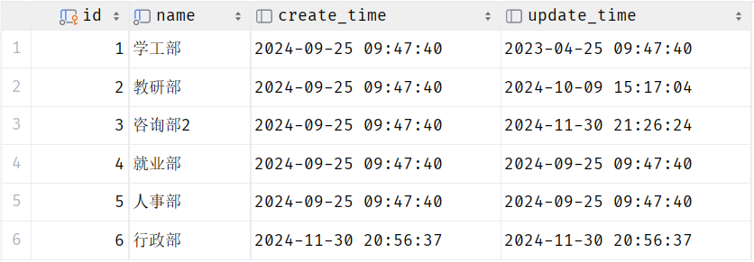

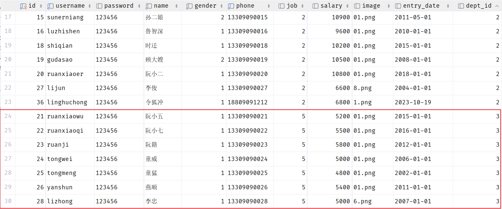

我们看到，在3号部门下，是关联的有7个员工。 当删除了3号部门后，数据变为：

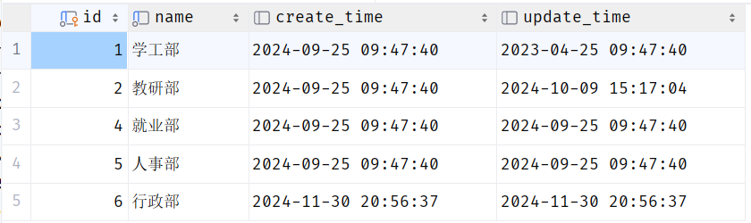


3号部门被删除了，但是依然还有7个员工是属于3号部门的。 此时：就出现数据的不完整、不一致了。 


### 分析

- 现象：部门数据可以直接删除，然而还有部分员工归属于该部门下，此时就出现了数据的不完整、不一致问题 。

- 原因：目前上述的两张表，在数据库层面，并未建立关联，所以是无法保证数据的一致性和完整性的 。

- 解决方案：想解决上述的问题呢，我们就可以通过数据库中的 **外键约束** 来解决。

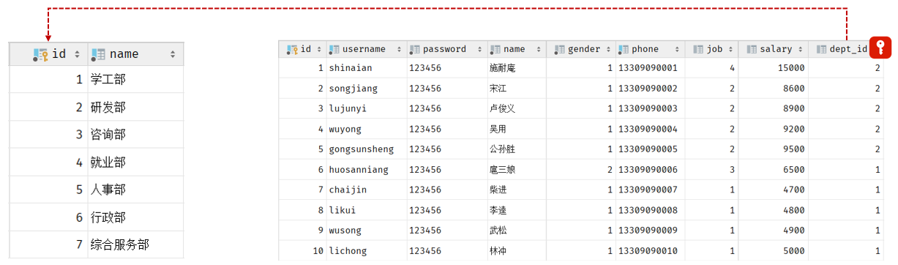


**外键约束：让两张表的数据建立连接，保证数据的一致性和完整性。 **

**对应的关键字：foreign key **


外键约束的语法：

```SQL
-- 创建表时指定
create table 表名(
        字段名    数据类型,
        ...
        [constraint]   [外键名称]  foreign  key (外键字段名)   references   主表 (主表列名)        
);


-- 建完表后，添加外键
alter table  表名  add constraint  外键名称  foreign key(外键字段名) references 主表(主表列名);
```

那接下来，我们就为员工表的dept\_id 建立外键约束，来关联部门表的主键。

当我们添加外键约束时，我们得保证当前数据库表中的数据是完整的。 所以，我们需要将之前删除掉的数据再添加回来。

**方式1：通过SQL语句操作**

```SQL
-- 修改表： 添加外键约束
alter table emp  add  constraint  fk_dept_id  foreign key (dept_id)  references  dept(id);
```


**方式2：****图形化界面操作**

在左侧菜单栏，在emp表上右键，选择 `modify Table... (old UI)`

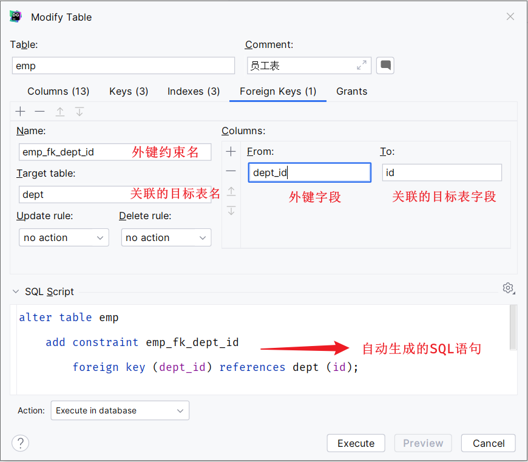


当我们添加了外键之后，再删除ID为3的部门，就会发现，此时数据库报错了，不允许删除。

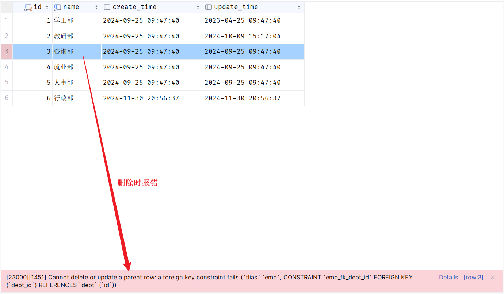

外键约束（foreign key）：保证了数据的完整性和一致性。


### 物理外键与逻辑外键

- 物理外键

    - 概念：使用foreign key定义外键关联另外一张表。

    - 缺点：

        - 影响增、删、改的效率（需要检查外键关系）。

        - 仅用于单节点数据库，不适用于分布式、集群场景。

        - 容易引发数据库的死锁问题，消耗性能。


- 逻辑外键

    - 概念：在业务层逻辑中，解决外键关联。

    - 通过逻辑外键，就可以很方便的解决上述问题。


在现在的企业开发中，很少会使用物理外键，都是使用逻辑外键。 甚至在一些数据库开发规范中，会明确指出禁止使用物理外键 foreign key 


## 一对一

一对一关系表在实际开发中应用起来比较简单，通常是用来做单表的拆分，也就是将一张大表拆分成两张小表，将大表中的一些基础字段放在一张表当中，将其他的字段放在另外一张表当中，以此来提高数据的操作效率。

一对一的应用场景： 用户表\(基本信息\+身份信息\)

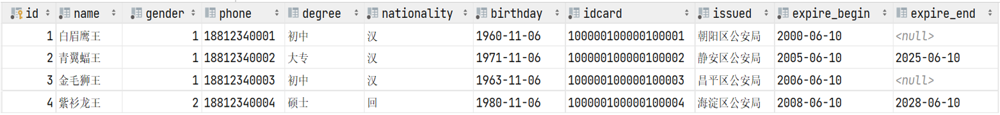

- 基本信息：用户的ID、姓名、性别、手机号、学历

- 身份信息：民族、生日、身份证号、身份证签发机关，身份证的有效期\(开始时间、结束时间\)


如果在业务系统当中，对用户的基本信息查询频率特别的高，但是对于用户的身份信息查询频率很低，此时出于提高查询效率的考虑，我就可以将这张大表拆分成两张小表，第一张表存放的是用户的基本信息，而第二张表存放的就是用户的身份信息。他们两者之间一对一的关系，一个用户只能对应一个身份证，而一个身份证也只能关联一个用户。


那么在数据库层面怎么去体现上述两者之间是一对一的关系呢？

其实一对一我们可以看成一种特殊的一对多。一对多我们是怎么设计表关系的？是不是在多的一方添加外键。同样我们也可以通过外键来体现一对一之间的关系，我们只需要在任意一方来添加一个外键就可以了。

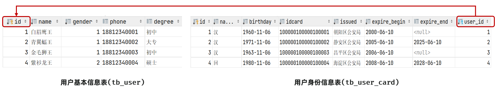


SQL脚本：

```SQL
-- 用户基本信息表
create table tb_user(
    id int unsigned  primary key auto_increment comment 'ID',
    name varchar(10) not null comment '姓名',
    gender tinyint unsigned not null comment '性别, 1 男  2 女',
    phone char(11) comment '手机号',
    degree varchar(10) comment '学历'
) comment '用户基本信息表';
-- 测试数据
insert into tb_user values (1,'白眉鹰王',1,'18812340001','初中'),
                        (2,'青翼蝠王',1,'18812340002','大专'),
                        (3,'金毛狮王',1,'18812340003','初中'),
                        (4,'紫衫龙王',2,'18812340004','硕士');

-- 用户身份信息表
create table tb_user_card(
    id int unsigned  primary key auto_increment comment 'ID',
    nationality varchar(10) not null comment '民族',
    birthday date not null comment '生日',
    idcard char(18) not null comment '身份证号',
    issued varchar(20) not null comment '签发机关',
    expire_begin date not null comment '有效期限-开始',
    expire_end date comment '有效期限-结束',
    user_id int unsigned not null unique comment '用户ID',
    constraint fk_user_id foreign key (user_id) references tb_user(id)
) comment '用户身份信息表';
-- 测试数据
insert into tb_user_card values (1,'汉','1960-11-06','100000100000100001','朝阳区公安局','2000-06-10',null,1),
        (2,'汉','1971-11-06','100000100000100002','静安区公安局','2005-06-10','2025-06-10',2),
        (3,'汉','1963-11-06','100000100000100003','昌平区公安局','2006-06-10',null,3),
        (4,'回','1980-11-06','100000100000100004','海淀区公安局','2008-06-10','2028-06-10',4);
```


**一对一 ：在任意一方加入外键，关联另外一方的主键，并且设置外键为唯一的\(UNIQUE\)**


## 多对多

多对多的关系在开发中属于也比较常见的。比如：学生和老师的关系，一个学生可以有多个授课老师，一个授课老师也可以有多个学生。在比如：学生和课程的关系，一个学生可以选修多门课程，一个课程也可以供多个学生选修。

案例：学生与课程的关系

- 关系：一个学生可以选修多门课程，一门课程也可以供多个学生选择

- 实现关系：建立第三张中间表，中间表至少包含两个外键，分别关联两方主键


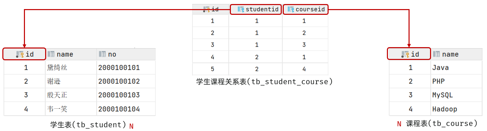


SQL脚本：

```SQL
-- 学生表
create table tb_student(
    id int auto_increment primary key comment '主键ID',
    name varchar(10) comment '姓名',
    no varchar(10) comment '学号'
) comment '学生表';
-- 学生表测试数据
insert into tb_student(name, no) values ('黛绮丝', '2000100101'),
                                        ('谢逊', '2000100102'),
                                        ('殷天正', '2000100103'),
                                        ('韦一笑', '2000100104');

-- 课程表
create table tb_course(
   id int auto_increment primary key comment '主键ID',
   name varchar(10) comment '课程名称'
) comment '课程表';
-- 课程表测试数据
insert into tb_course (name) values ('Java'), ('PHP'), ('MySQL') , ('Hadoop');

-- 学生课程表（中间表）
create table tb_student_course(
   id int auto_increment comment '主键' primary key,
   student_id int not null comment '学生ID',
   course_id  int not null comment '课程ID',
   constraint fk_courseid foreign key (course_id) references tb_course (id),
   constraint fk_studentid foreign key (student_id) references tb_student (id)
)comment '学生课程中间表';

-- 学生课程表测试数据
insert into tb_student_course(student_id, course_id) values (1,1),(1,2),(1,3),(2,2),(2,3),(3,4);
```


**多对多 ：需要建立一张****中间表****，中间表中有两个外键字段，分别关联两方的主键。**


## 案例

下面通过一个综合案例加深对于多表关系的理解，并掌握多表设计的流程。

**需求**

- 根据参考资料中提供的《Talis智能学习辅助系统》页面原型，设计员工管理模块涉及到的表结构。

**步骤**

- 阅读页面原型及需求文档，分析各个模块涉及到的表结构，及表结构之间的关系。

- 根据页面原型及需求文档，分析各个表结构中具体的字段及约束。

**分析**

涉及到的模块有：

- 部门管理

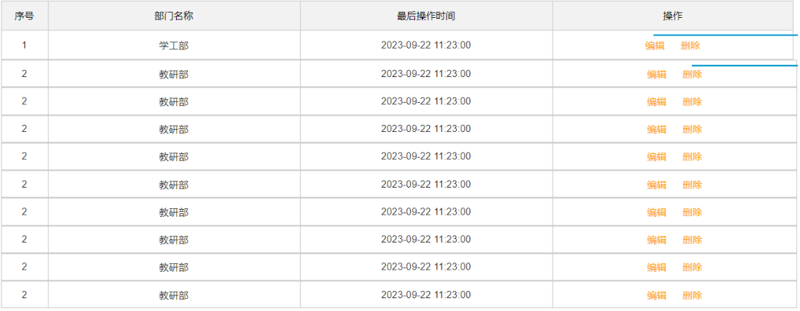

部门管理涉及到一张部门表，这个前面我们都已经设计过了。 无需再进行设计了。


- 员工管理

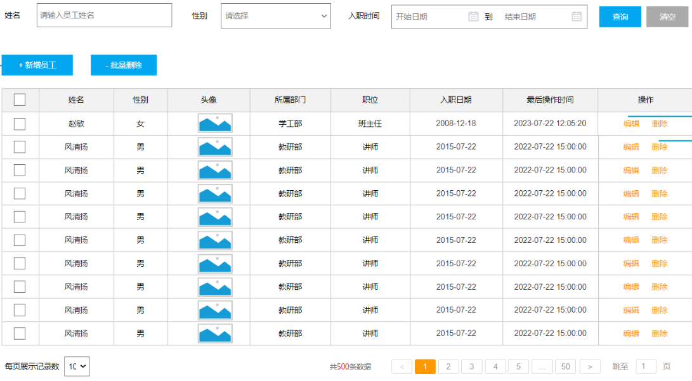

上述在员工列表查询的页面原型，当我们点击 "新增员工" 按钮时，会弹出一个新增员工的表单，表单展示形式如下：

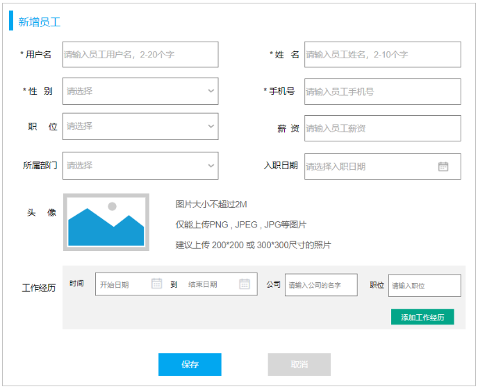

在上述的页面原型中，我们可以看到，每一个员工是归属于某一个部门的，而一个部门下可以有多个员工，所以部门与员工之间的关系是一对多的关系。

从页面员工中，我们可以看到，员工还有工作经历的信息。而每一个员工，是可以添加多个工作经历的。 所以，工作经历我们可以再设计一张表，而员工与员工的工作经历之间的关系，是一对多的关系。

那么，这里总共会涉及三张表，分别是：部门表、员工表、员工工作经历表。


最终，具体的表结构如下：

```SQL
-- 部门表
create table dept (
  id int unsigned PRIMARY KEY AUTO_INCREMENT COMMENT 'ID, 主键',
  name varchar(10) NOT NULL UNIQUE COMMENT '部门名称',
  create_time datetime COMMENT '创建时间',
  update_time datetime COMMENT '修改时间'
) COMMENT '部门表';

-- 员工表
create table emp(
    id int unsigned primary key auto_increment comment 'ID,主键',
    username varchar(20) not null unique comment '用户名',
    password varchar(50) default '123456' comment '密码',
    name varchar(10) not null comment '姓名',
    gender tinyint unsigned not null comment '性别, 1:男, 2:女',
    phone char(11) not null unique comment '手机号',
    job tinyint unsigned comment '职位, 1 班主任, 2 讲师 , 3 学工主管, 4 教研主管, 5 咨询师',
    salary int unsigned comment '薪资',
    image varchar(300) comment '头像',
    entry_date date comment '入职日期',
    dept_id int unsigned comment '部门ID',  -- 关联的是dept部门表的ID
    create_time datetime comment '创建时间',
    update_time datetime comment '修改时间'
) comment '员工表';

-- 员工工作经历表
create table emp_expr(
    id int unsigned primary key auto_increment comment 'ID, 主键',
    emp_id  int unsigned null comment '员工ID', -- 关联的是emp员工表的ID
    begin  date null comment '开始时间',
    end date null comment '结束时间',
    company varchar(50) null comment '公司名称',
    job varchar(50) null comment '职位'
) comment '工作经历';
```

注意：在上述的表结构设计中，我们使用的都是逻辑外键。


