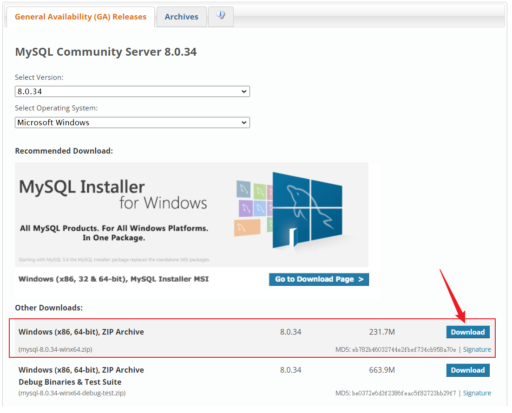
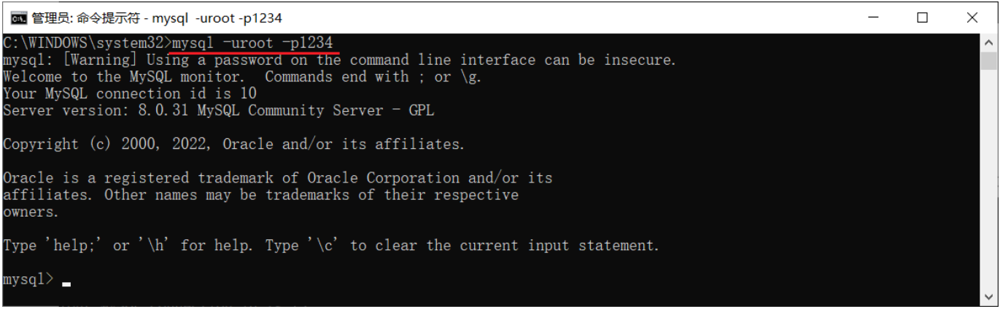
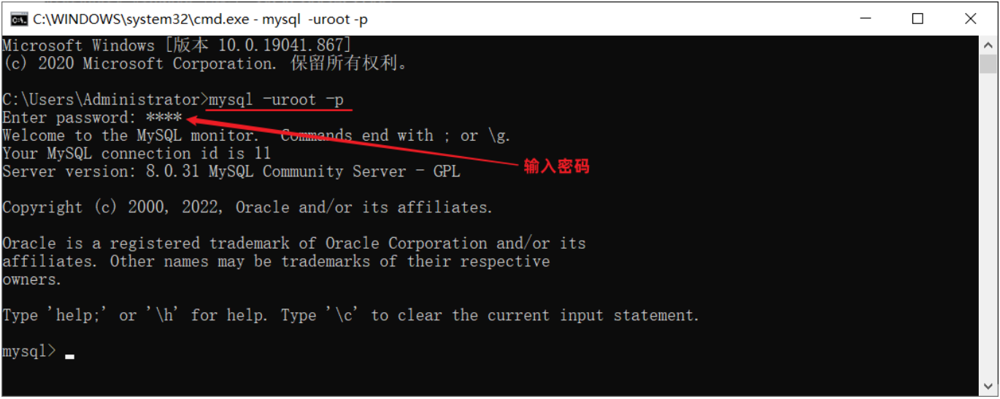
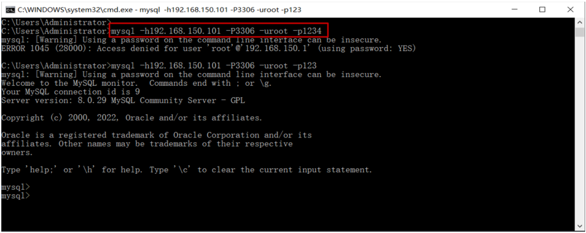
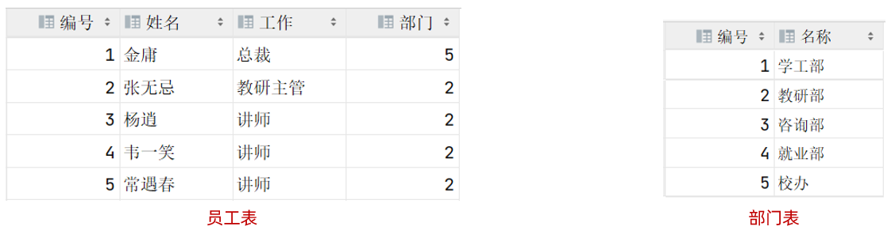
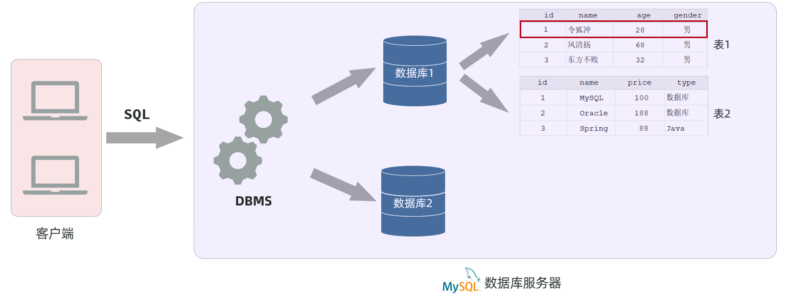

# MySQL概述


官网：https://dev\.mysql\.com/

**MySQL官方提供了两个版本：**

- 商业版本（MySQL Enterprise Edition）
  - 该版本是收费的，我们可以使用30天。 官方会提供对应的技术支持。

- 社区版本（MySQL Community Server）
  - 该版本是免费的，但是MySQL不会提供任何的技术支持。

本课程，采用的是MySQL的社区版本（8\.0\.34）

## 安装

官网下载地址：[https://downloads\.mysql\.com/archives/community/](https://downloads.mysql.com/archives/community/)



## 连接

### 介绍

MySQL服务器启动完毕后，然后再使用如下指令，来连接MySQL服务器：

```Java
mysql -u用户名 -p密码 [-h数据库服务器的IP地址 -P端口号]
```

- \-h 参数不加，默认连接的是本地 127\.0\.0\.1 的MySQL服务器

- \-P 参数不加，默认连接的端口号是 3306

**上述指令，可以有两种形式：**

- 密码直接在\-p参数之后直接指定 （这种方式不安全，密码直接以明文形式出现在命令行）



- 密码在\-p回车之后，在命令行中输入密码，然后回车



### 企业使用方式\(了解\)

上述的MySQL服务器我们是安装在本地的，这个仅仅是在我们学习阶段，在真实的企业开发中，MySQL数据库服务器是不会在我们本地安装的，是在公司的服务器上安装的，而服务器还需要放置在专门的IDC机房中的，IDC机房呢，就需要保证恒温、恒湿、恒压，而且还要保证网络、电源的可靠性\(备用电源及网络\)。


那我们要想使用服务器上的这台MySQL服务器，就需要在我们的电脑上去远程连接这台MySQL 。 而服务器上安装的MySQL数据库呢，并不是你一个人在访问，我们项目组的其他开发人员也是需要访问这台MySQL的。


接下来，就来演示一下，通过MySQL的客户端命令行，如何来连接服务器上部署的MySQL ：

```Java
mysql [-h数据库服务器的IP地址 -P端口号] -u用户名 -p密码
```



## 数据模型

介绍完了Mysql数据库的安装配置之后，接下来我们再来聊一聊Mysql当中的数据模型。学完了这一小节之后，我们就能够知道在Mysql数据库当中到底是如何来存储和管理数据的。

在介绍 Mysql的数据模型之前，需要先了解一个概念：关系型数据库。

### **关系型数据库\*\***（RDBMS）\*\*

概念：建立在关系模型基础上，由多张相互连接的**二维表**组成的数据库。而所谓二维表，指的是由行和列组成的表，如下图：



二维表的优点：

- 使用表存储数据，格式统一，便于维护

- 使用SQL语言操作，标准统一，使用方便，可用于复杂查询

我们之前提到的MySQL、Oracle、DB2、SQLServer这些都是属于关系型数据库，里面都是基于二维表存储数据的。

**结论：**基于二维表存储数据的数据库就成为关系型数据库，不是基于二维表存储数据的数据库，就是非关系型数据库（比如大家后面要学习的Redis，就属于非关系型数据库）。

### 数据模型

介绍完了关系型数据库之后，接下来我们再来看一看在Mysql数据库当中到底是如何来存储数据的，也就是Mysql 的数据模型。

MySQL是关系型数据库，是基于二维表进行数据存储的，具体的结构图下:



- 通过MySQL客户端连接数据库管理系统DBMS，然后通过DBMS操作数据库。

- 使用MySQL客户端，向数据库管理系统发送一条SQL语句，由数据库管理系统根据SQL语句指令去操作数据库中的表结构及数据。

- 一个数据库服务器中可以创建多个数据库，一个数据库中也可以包含多张表，而一张表中又可以包含多行记录。

在Mysql数据库服务器当中存储数据，你需要：

1. 先去创建数据库（可以创建多个数据库，之间是相互独立的）

2. 在数据库下再去创建数据表（一个数据库下可以创建多张表）

3. 再将数据存放在数据表中（一张表可以存储多行数据）
