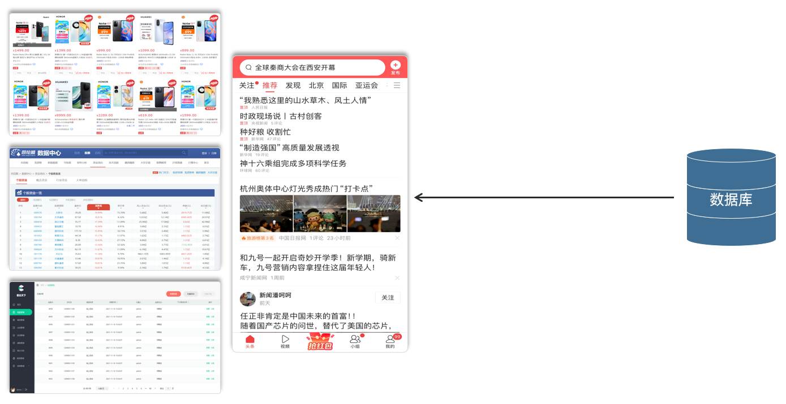
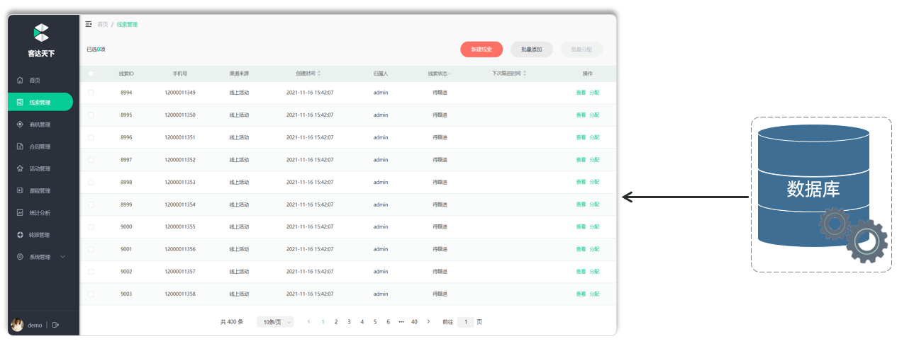
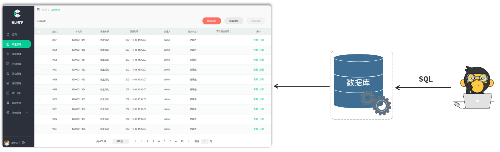
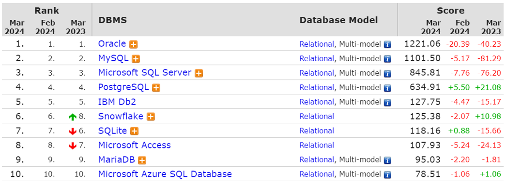

# 相关概念

首先来了解一下什么是数据库。

- **数据库：英文为 DataBase，简称DB，****它是存储和管理数据的仓库。**

像我们日常访问的电商网站京东，企业内部的管理系统OA、ERP、CRM这类的系统，以及大家每天都会刷的头条、抖音类的app，那这些大家所看到的数据，其实都是存储在数据库中的。最终这些数据，只是在浏览器或app中展示出来而已，最终数据的存储和管理都是数据库负责的。

数据是存储在数据库中的，那我们要如何来操作数据库以及数据库中所存放的数据呢？

那这里呢，会涉及到一个软件，那就是数据库管理系统。

- **数据库管理系统（DataBase Management System，简称DBMS），是操作和管理数据库的大型软件。**

将来我们只需要操作这个软件，就可以通过这个软件来操纵和管理数据库了。

此时又出现一个问题：DBMS这个软件怎么知道要操作的是哪个数据库、哪个数据呢？是对数据做修改还是查询呢？

需要给DBMS软件发送一条指令，告诉这个软件我们要执行的是什么样的操作，要对哪个数据进行操作。而这个指令就是SQL语句。

- **SQL（Structured Query Language，简称SQL）：结构化查询语言，它是操作****关系型数据库的****编程语言，定义了一套操作关系型数据库的统一标准。**

我们学习数据库开发，最为重要的就是学习SQL语句 。

关系型数据库：我们后面会详细讲解，现在大家只需要知道我们学习的数据库属于关系型数据库即可。

**结论：**程序员给数据库管理系统\(DBMS\)发送SQL语句，再由数据库管理系统操作数据库当中的数据。

了解了数据库的一些简单概念之后，接下来我们再来介绍下目前主流的数据库，这里截取了排名前十的数据库：

- Oracle：大型的收费数据库，Oracle公司产品，价格昂贵。（通常是不差钱的公司会选择使用这个数据库）

- MySQL：开源免费的中小型数据库，后来Sun公司收购了MySQL，而Oracle又收购了Sun公司。目前Oracle推出两个版本的Mysql：社区版\(开源免费\)、商业版\(收费\)。

- SQL Server：Microsoft 公司推出的收费的中型数据库，C\#、\.net等语言常用。

- PostgreSQL：开源免费的中小型数据库。

- DB2：IBM公司的大型收费数据库产品。

- SQLLite：嵌入式的微型数据库。Android内置的数据库采用的就是该数据库。

- MariaDB：开源免费的中小型数据库。是MySQL数据库的另外一个分支、另外一个衍生产品，与MySQL数据库有很好的兼容性。

那这么多数据库，我们全部都需要学习吗，其实并不用，我们只需要学习其中的一个就可以了，我们此次课程中学习的数据库是现在互联网公司开发使用最为流行的MySQL数据库。

此时大家可能会有一个疑问，我们现在学习的是Mysql数据库，我们以后去公司做开发，如果用到的是Oracle数据库或SQL Server数据库该怎么办？其实大家完全不用担心这个问题，因为这些数据库都是属于关系型数据库，要操作关系型数据库都是通过 SQL语句来实现的，而SQL语句又是操作关系型数据库的统一标准。

**结论：**只要我们学会了SQL语句，就可以通过SQL语句来操作Mysql，也可以通过SQL语句来操作Oracle或SQL Server

课程内容安排：

1. MySQL概述

2. SQL语句（DDL、DML、DQL）

3. 多表设计

4. 多表查询

5. 事务

6. 索引

那么今天呢，我们先来学习前两个章节（MySQL概述、SQL语句），后面随着课程的深入，我们再来讲解后面的课程内容。

