# SQL语句

SQL：结构化查询语言。一门操作关系型数据库的编程语言，定义操作所有关系型数据库的统一标准。SQL语句根据其功能被分为四大类：DDL、DML、DQL、DCL 。

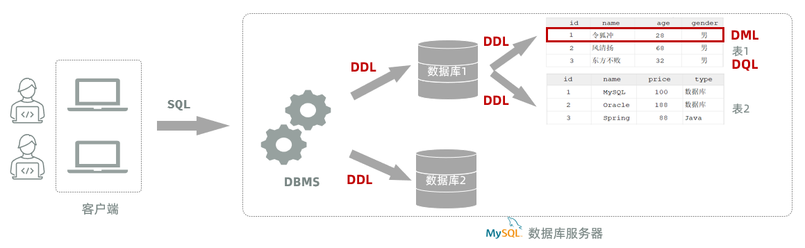


## DDL语句

### 数据库操作

我们在进行数据库设计，需要使用到刚才所介绍SQL分类中的DDL语句。

DDL英文全称是Data Definition Language\(数据定义语言\)，用来定义数据库对象\(数据库、表\)。

DDL中数据库的常见操作：查询、创建、使用、删除。

#### 查询数据库

- 查询所有数据库

```SQL
show databases;
```

命令行中执行效果如下：

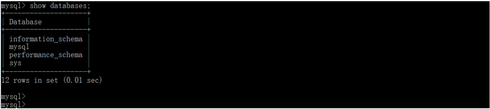


- 查询当前数据库

```SQL
select database();
```

命令行中执行效果如果：

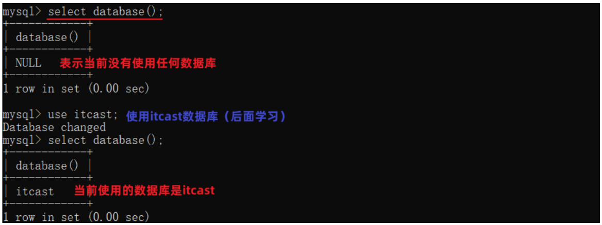

我们要操作某一个数据库，必须要切换到对应的数据库中。 

通过指令：select  database\(\) ，就可以查询到当前所处的数据库 


#### 创建数据库

- 语法：

```SQL
create database [ if not exists ] 数据库名  [default charset utf8mb4];
```

创建数据库时，可以不指定字符集。 因为在MySQL8版本之后，默认的字符集就是 utf8mb4。


- 案例： 创建一个itcast数据库。

```SQL
create database itcast;
```

命令行执行效果如下：


注意：在同一个数据库服务器中，不能创建两个名称相同的数据库，否则将会报错。

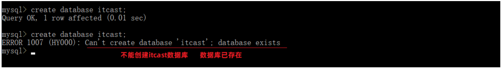

可以使用`if not exists`来避免这个问题

```SQL
-- 数据库不存在,则创建该数据库；如果存在则不创建
create database if not exists itcast; 
```

命令行执行效果如下： 

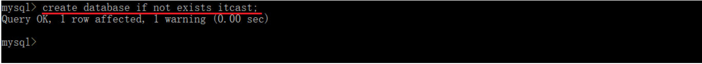


#### 使用数据库

- 语法：

```SQL
use 数据库名 ;
```

我们要操作某一个数据库下的表时，就需要通过该指令，切换到对应的数据库下，否则不能操作。


- 案例：切换到itcast数据

```SQL
use itcast;
```

命令执行效果如下：

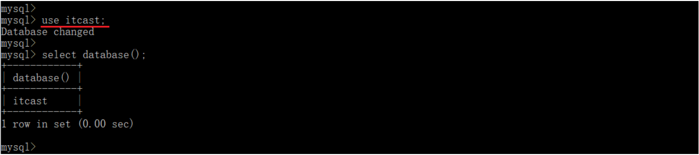


#### 删除数据库

- 语法:

    ```SQL
    drop database [ if exists ] 数据库名 ;
    ```

    - 如果删除一个不存在的数据库，将会报错。

    - 可以加上参数 if exists ，如果数据库存在，再执行删除，否则不执行删除。


- 案例：删除itcast数据库

    ```SQL
    drop database if exists itcast; -- itcast数据库存在时删除
    ```

命令执行效果如下：

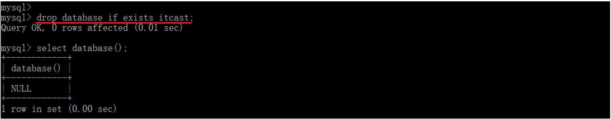

**说明：****上述语法中的database，也可以替换成 schema**

- 如：create schema db01;

- 如：show schemas;


### 图形化工具

#### 介绍

前面我们讲解了DDL中关于数据库操作的SQL语句，在我们编写这些SQL时，都是在命令行当中完成的。大家在练习的时候应该也感受到了，在命令行当中来敲这些SQL语句很不方便，主要的原因有以下 3 点：

1. 没有任何代码提示。（全靠记忆，容易敲错字母造成执行报错）

2. 操作繁琐，影响开发效率。（所有的功能操作都是通过SQL语句来完成的）

3. 编写过的SQL代码无法保存。


在项目开发当中，通常为了提高开发效率，都会借助于现成的图形化管理工具来操作数据库。

目前MySQL主流的图形化界面工具有以下几种：


DataGrip是JetBrains旗下的一款数据库管理工具，是管理和开发MySQL、Oracle、PostgreSQL的理想解决方案。

官网： https://www\.jetbrains\.com/zh\-cn/datagrip/


#### 安装

安装： 参考资料中提供的《DataGrip安装手册》

说明：DataGrip这款工具可以不用安装，因为Jetbrains公司已经将DataGrip这款工具的功能已经集成到了 IDEA当中，所以我们就可以使用IDEA来作为一款图形化界面工具来操作Mysql数据库。


#### 连接数据库

1\)\. 创建Project

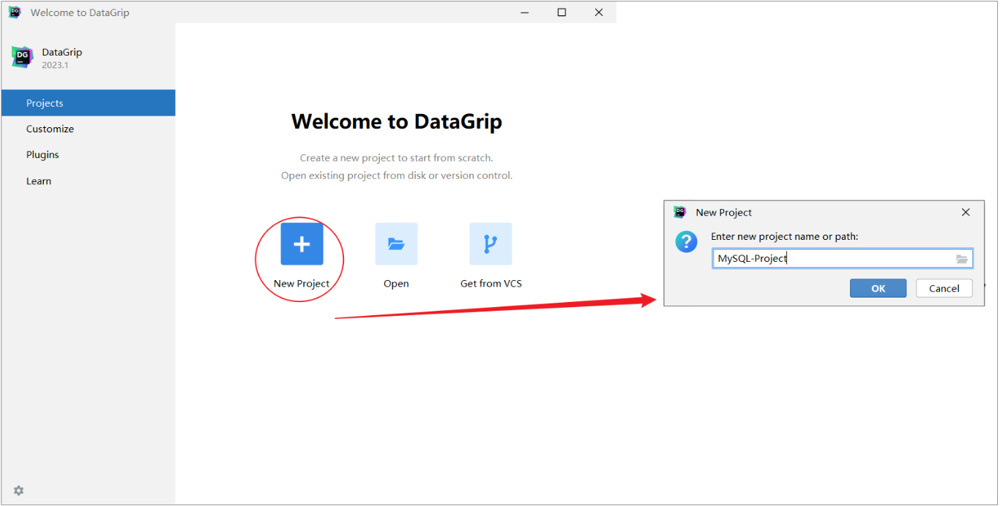


2\)\. 创建连接

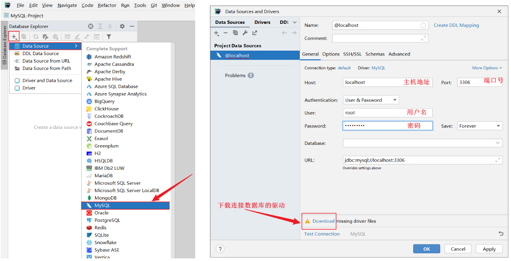


下载驱动, 可能会比较耗时, 耐心等待一会儿。 


3\)\. 测试连接

下载完驱动之后，可以点击 `Test Connection` 来测试一下是否可以正常的连接数据库。

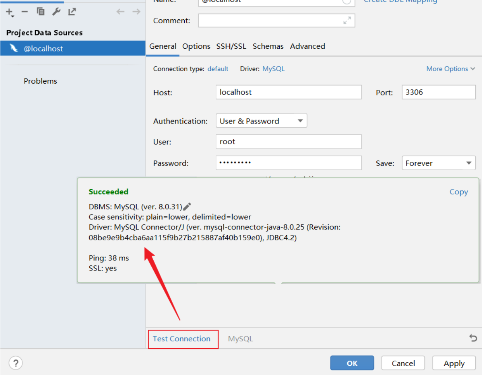

然后点击 OK ， 就已经连接上了MySQL数据库了。 


默认情况下，连接上了MySQL数据库之后， 数据库并没有全部展示出来。 需要选择要展示哪些数据库。具体操作如下：

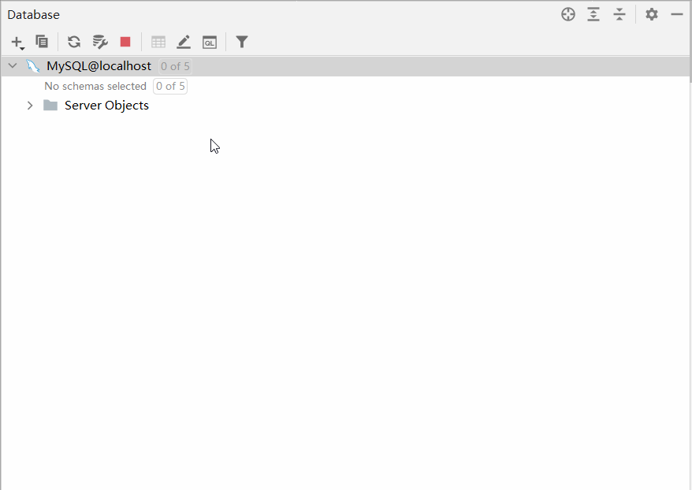


### 表操作

学习完了DDL语句当中关于数据库的操作之后，接下来我们继续学习DDL语句当中关于表结构的操作。

关于表结构的操作也是包含四个部分：创建表、查询表、修改表、删除表。


#### 创建

- 语法：

    ```SQL
    create table  表名(
            字段1  字段1类型 [约束]  [comment  字段1注释 ],
            字段2  字段2类型 [约束]  [comment  字段2注释 ],
            ......
            字段n  字段n类型 [约束]  [comment  字段n注释 ] 
    ) [ comment  表注释 ] ;
    ```

    - 注意： \[ \] 中的内容为可选参数； 最后一个字段后面没有逗号


- 案例：创建tb\_user表

    - 对应的结构如下：

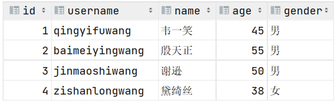

    - 建表语句：

    ```SQL
    create table tb_user (
        id int comment 'ID,唯一标识',   # id是一行数据的唯一标识（不能重复）
        username varchar(20) comment '用户名',
        name varchar(10) comment '姓名',
        age int comment '年龄',
        gender char(1) comment '性别'
    ) comment '用户表';
    ```

    - 数据表创建完成，接下来我们还需要测试一下是否可以往这张表结构当中来存储数据。

    双击打开tb\_user表结构，大家会发现里面没有数据：

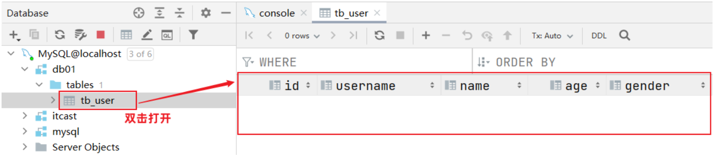

添加数据：

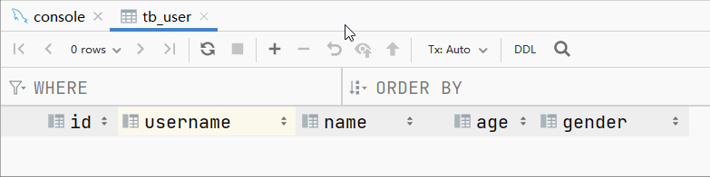

此时我们再插入一条数据：

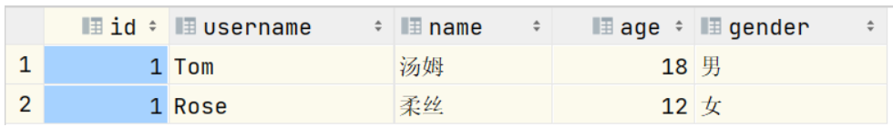

我们之前提到过：id字段是一行数据的唯一标识，不能有重复值。但是现在数据表中有两个相同的id值，这是为什么呢？

- 其实我们现在创建表结构的时候， id这个字段我们只加了一个备注信息说明它是一个唯一标识，但是在数据库层面呢，并没有去限制字段存储的数据。所以id这个字段没有起到唯一标识的作用。

想要限制字段所存储的数据，就需要用到数据库中的约束。


#### 约束

- 概念：所谓约束就是作用在表中字段上的规则，用于限制存储在表中的数据。

- 作用：就是来保证数据库当中数据的正确性、有效性和完整性。（后面的学习会验证这些）

- 在MySQL数据库当中，提供了以下5种约束：

注意：约束是作用于表中字段上的，可以在创建表/修改表的时候添加约束。


- 案例：创建tb\_user表，对应的结构如下：

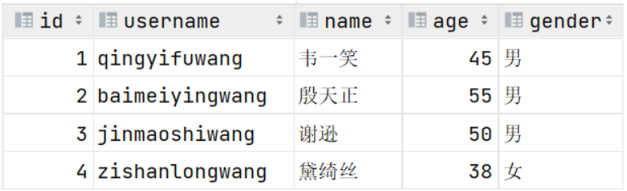

在上述的表结构中:

- id 是一行数据的 **唯一标识**

- username 用户名字段是**非空**且**唯一**的

- name 姓名字段是**不允许存储空值**的

- gender 性别字段是有**默认值**，默认为男

建表语句：

```SQL
create table tb_user (
    id int primary key comment 'ID,唯一标识', 
    username varchar(20) not null unique comment '用户名',
    name varchar(10) not null comment '姓名',
    age int comment '年龄',
    gender char(1) default '男' comment '性别'
) comment '用户表';
```

数据表创建完成，接下来测试一下表中字段上的约束是否生效

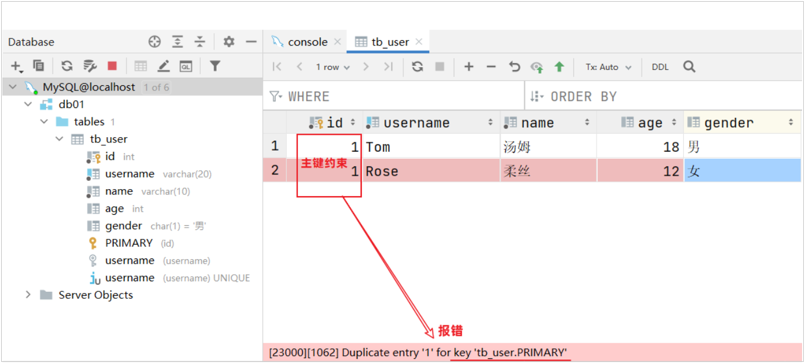

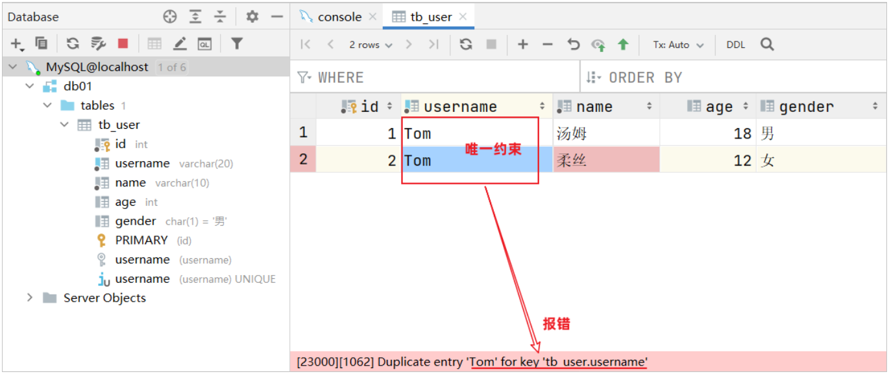

大家有没有发现一个问题：id字段下存储的值，如果由我们自己来维护会比较麻烦\(必须保证值的唯一性\)。MySQL数据库为了解决这个问题，给我们提供了一个关键字：auto\_increment（自动增长）

**主键自增：auto\_increment**

- 每次插入新的行记录时，数据库自动生成id字段\(主键\)下的值

- 具有auto\_increment的数据列是一个正数序列开始增长\(从1开始自增\)

```SQL
create table tb_user (
    id int primary key auto_increment comment 'ID,唯一标识', #主键自动增长
    username varchar(20) not null unique comment '用户名',
    name varchar(10) not null comment '姓名',
    age int comment '年龄',
    gender char(1) default '男' comment '性别'
) comment '用户表';
```

测试主键自增：

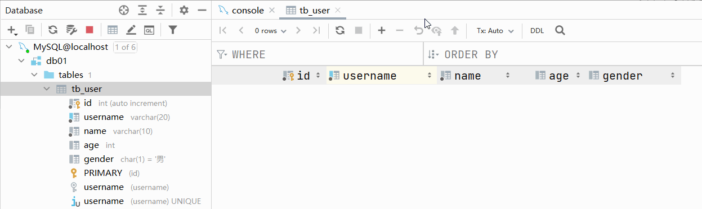


#### 数据类型

在上面建表语句中，我们在指定字段的数据类型时，用到了int 、varchar、char，那么在MySQL中除了以上的数据类型，还有哪些常见的数据类型呢？ 接下来,我们就来详细介绍一下MySQL的数据类型。

MySQL中的数据类型有很多，主要分为三类：数值类型、字符串类型、日期时间类型。


**1\)\. ****数值类型**

- 示例:

```SQL
-- 年龄字段 ---不会出现负数, 而且人的年龄不会太大
   age tinyint unsigned

-- 分数 ---总分100分, 最多出现一位小数
   score double(4,1)
```


**2\)\. ****字符串类型**

char 与 varchar 都可以描述字符串，char是定长字符串，指定长度多长，就占用多少个字符，和字段值的长度无关 。而varchar是变长字符串，指定的长度为最大占用长度 。相对来说，char的性能会更高些。

```SQL
示例： 
    用户名 username ---长度不定, 最长不会超过50
    username varchar(50)
    
    手机号 phone ---固定长度为11
    phone char(11)
```


**3\)\. ****日期时间类型**

```SQL
示例: 
    生日字段  birthday ---生日只需要年月日  
    birthday date
    
    创建时间 createtime --- 需要精确到时分秒
    createtime  datetime
```


#### 表结构设计\-案例

**需求：**根据产品原型/需求创建表\(\(设计合理的数据类型、长度、约束\) 

参考资料中提供的《黑马\-tlias智能学习辅助系统》页面原型，设计员工管理模块的表结构。  **暂不考虑所属部门及工作经历字段。**


**产品原型及需求如下：**

1\)\. 列表展示

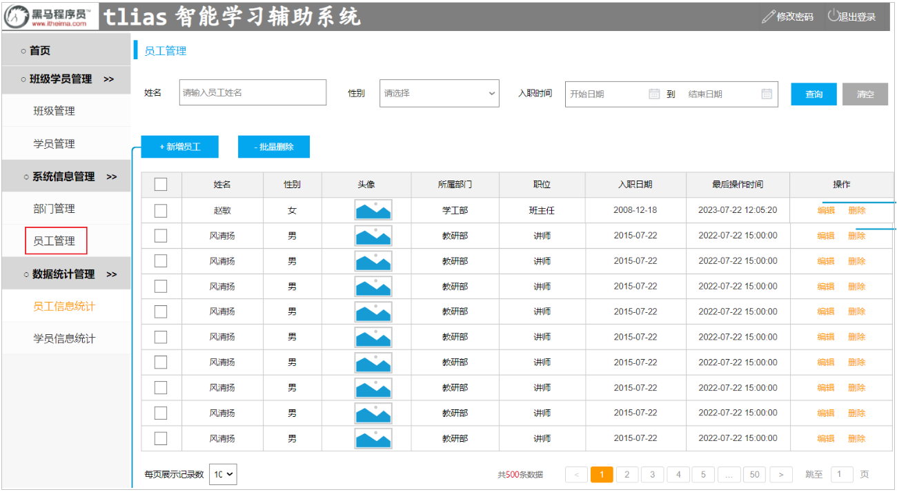


2\)\. 新增员工

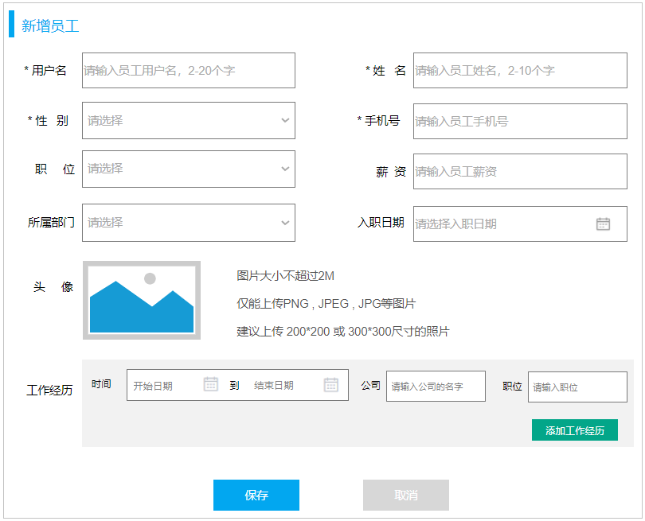


3\)\. 需求说明及字段限制

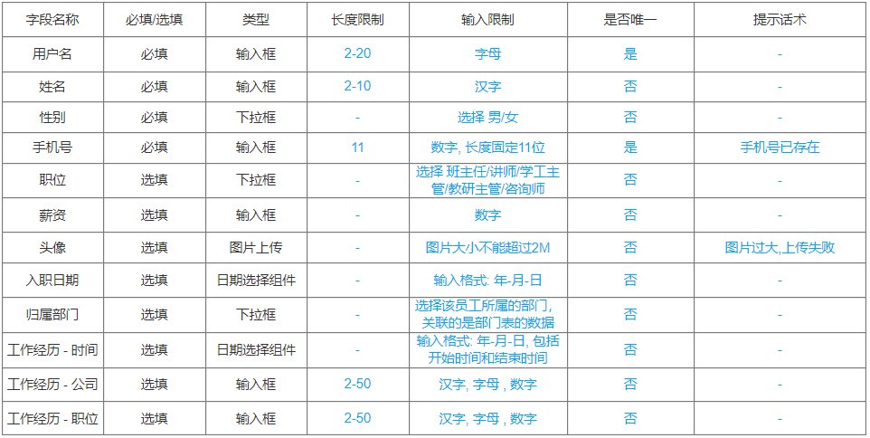


**步骤：**

1. 阅读产品原型及需求文档，看看里面涉及到哪些字段。

2. 查看需求文档说明，确认各个字段的类型以及字段存储数据的长度限制。

3. 在页面原型中描述的基础字段的基础上，再增加额外的基础字段。

使用SQL创建表：

```SQL
create table emp(
    id int unsigned primary key auto_increment comment 'ID,主键',
    username varchar(20) not null unique comment '用户名',
    password varchar(32) not null comment '密码',
    name varchar(10) not null comment '姓名',
    gender tinyint unsigned not null comment '性别, 1:男, 2:女',
    phone char(11) not null unique comment '手机号',
    job tinyint unsigned comment '职位, 1:班主任,2:讲师,3:学工主管,4:教研主管,5:咨询师',
    salary int unsigned comment '薪资',
    image varchar(255) comment '头像',
    entry_date date comment '入职日期',
    create_time datetime comment '创建时间',
    update_time datetime comment '修改时间'
) comment '员工表';
```

除了使用SQL语句创建表外，我们还可以借助于图形化界面来创建表结构，这种创建方式会更加直观、更加方便。


**设计表流程：**

1. 阅读页面原型及需求文档

2. 基于页面原则和需求文档，确定原型字段\(类型、长度限制、约束\)

3. 再增加表设计所需要的业务基础字段\(id、create\_time、update\_time\)

    - create\_time：记录的是当前这条数据插入的时间。 

    - update\_time：记录当前这条数据最后更新的时间。


#### 表操作\-其他操作

上面讲解了表结构的创建、数据类型、设计表的流程，接下来，再来讲解表结构的查询、修改、删除操作 。 

- 查询数据库表的具体的语法：

```SQL
-- 查询当前数据库的所有表
show tables;

-- 查看指定的表结构
desc 表名 ;   -- 可以查看指定表的字段、字段的类型、是否可以为NULL、是否存在默认值等信息

-- 查询指定表的建表语句
show create table 表名 ;
```


- 修改数据库表结构的具体语法：

添加字段

```SQL
-- 添加字段
alter table 表名 add  字段名  类型(长度)  [comment 注释]  [约束];

-- 比如： 为tb_emp表添加字段qq，字段类型为 varchar(11)
alter table tb_emp add  qq  varchar(11) comment 'QQ号码';
```

修改字段

```SQL
-- 修改字段类型
alter table 表名 modify  字段名  新数据类型(长度);

-- 比如： 修改qq字段的字段类型，将其长度由11修改为13
alter table tb_emp modify qq varchar(13) comment 'QQ号码';
```

```SQL
-- 修改字段名，字段类型
alter table 表名 change  旧字段名  新字段名  类型(长度)  [comment 注释]  [约束];

-- 比如： 修改qq字段名为 qq_num，字段类型varchar(13)
alter table tb_emp change qq qq_num varchar(13) comment 'QQ号码';
```

删除字段

```SQL
-- 删除字段
alter table 表名 drop 字段名;

-- 比如： 删除tb_emp表中的qq_num字段
alter table tb_emp drop qq_num;
```


修改表名

```SQL
-- 修改表名
rename table 表名 to  新表名;

-- 比如: 将当前的emp表的表名修改为tb_emp
rename table emp to tb_emp;
```


删除表结构

```SQL
-- 删除表
drop  table [ if exists ]  表名;

-- 比如：如果tb_emp表存在，则删除tb_emp表
drop table if exists tb_emp;  -- 在删除表时，表中的全部数据也会被删除。
```


**关于表结构的查看、修改、删除操作，工作中一般都是直接基于图形化界面操作。**** **


## DML语句

DML英文全称是Data Manipulation Language\(数据操作语言\)，用来对数据库中表的数据记录进行增、删、改操作。

- 添加数据（INSERT）

- 修改数据（UPDATE）

- 删除数据（DELETE） 


### 增加\(insert\)

#### **语法**

- 向指定字段添加数据

```SQL
insert into 表名 (字段名1, 字段名2) values (值1, 值2);
```

- 全部字段添加数据

```SQL
insert into 表名 values (值1, 值2, ...);
```

- 批量添加数据（指定字段）

```SQL
insert into 表名 (字段名1, 字段名2) values (值1, 值2), (值1, 值2);
```

- 批量添加数据（全部字段）

```SQL
insert into 表名 values (值1, 值2, ...), (值1, 值2, ...);
```


#### 案例演示

- 案例1：向emp表的username, name, gender, phone, create\_time, update\_time字段插入数据

```SQL
-- 因为设计表时create_time, update_time两个字段不能为NULL，所以也做为要插入的字段
insert into emp(username, name, gender, phone, create_time, update_time)
values ('wuji', '张无忌', 1, '13309091231', now(), now());
```


- 案例2：向temp表的所有字段插入数据

```SQL
insert into emp2(id, username, password, name, gender, phone, job, salary, image, entry_date, create_time, update_time)
                  values (1,'shinaian','123456','施耐庵',1,'13309090001',4,15000,'1.jpg','2000-01-01',now(),now()),
```


- 案例3：批量向emp表的username、name、gender字段插入数据

```SQL
insert into emp(username, name, gender, phone, create_time, update_time)
values ('Tom1', '汤姆1', 1, '13309091231', now(), now()),
       ('Tom2', '汤姆2', 1, '13309091232', now(), now());
```


**insert操作的注意事项：**

1. 插入数据时，指定的字段顺序需要与值的顺序是一一对应的。

2. 字符串和日期型数据应该包含在引号中。

3. 插入的数据大小，应该在字段的规定范围内。


### 修改\(update\)

#### 语法

```SQL
update 表名 set 字段名1 = 值1 , 字段名2 = 值2 , .... [where 条件] ;
```


#### 案例演示

- 案例1：将emp表中id为1的员工，姓名name字段更新为'张三'

```SQL
update emp set name='张三', update_time=now() where id=1;
```


- 案例2：将emp表的所有员工入职日期更新为'2010\-01\-01'

```SQL
update emp set entry_date='2010-01-01', update_time=now();
```


**注意事项:**

1. 修改语句的条件可以有，也可以没有，如果没有条件，则会修改整张表的所有数据。

2. 在修改数据时，一般需要同时修改公共字段update\_time，将其修改为当前操作时间。


### 删除\(delete\)

#### 语法

```SQL
delete from 表名  [where  条件] ;
```


#### 案例演示

- 案例1：删除emp表中id为1的员工

```SQL
delete from emp where id = 1;
```


- 案例2：删除emp表中所有员工

```SQL
delete from tb_emp;
```


**注意事项:**

- DELETE 语句的条件可以有，也可以没有，如果没有条件，则会删除整张表的所有数据。

- DELETE 语句不能删除某一个字段的值\(可以使用UPDATE，将该字段值置为NULL即可\)。

- 当进行删除全部数据操作时，会提示询问是否确认删除所有数据，直接点击Execute即可。 


## DQL语句

### 介绍

DQL英文全称是Data Query Language\(数据查询语言\)，用来查询数据库表中的记录。

查询关键字：**SELECT**

查询操作是所有SQL语句当中最为常见，也是最为重要的操作。在一个正常的业务系统中，查询操作的使用频次是要远高于增删改操作的。当我们打开某个网站或APP所看到的展示信息，都是通过从数据库中查询得到的，而在这个查询过程中，还会涉及到条件、排序、分页等操作。

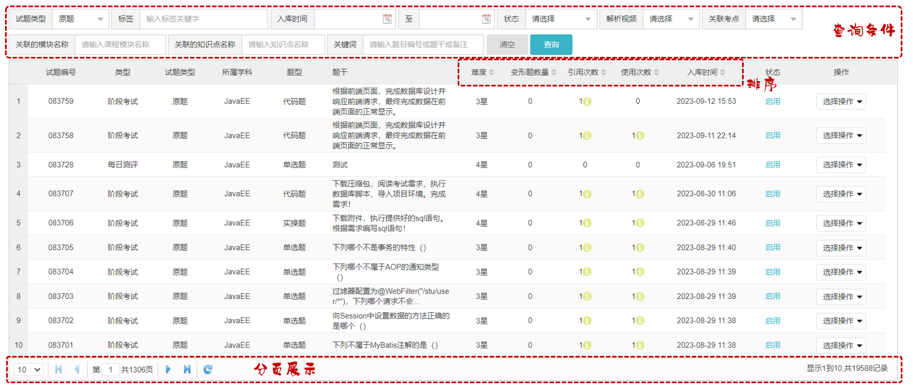


### 语法

DQL查询语句，语法结构如下：

```SQL
SELECT
        字段列表
FROM
        表名列表
WHERE
        条件列表
GROUP  BY
        分组字段列表
HAVING
        分组后条件列表
ORDER BY
        排序字段列表
LIMIT
        分页参数
```

我们今天会将上面的完整语法拆分为以下几个部分学习：

- 基本查询（不带任何条件）

- 条件查询（where）

- 分组查询（group by）

- 排序查询（order by）

- 分页查询（limit）


准备一些测试数据用于查询操作：

```SQL
create table emp(
    id int unsigned primary key auto_increment comment 'ID,主键',
    username varchar(20) not null unique comment '用户名',
    password varchar(32) not null comment '密码',
    name varchar(10) not null comment '姓名',
    gender tinyint unsigned not null comment '性别, 1:男, 2:女',
    phone char(11) not null unique comment '手机号',
    job tinyint unsigned comment '职位, 1:班主任,2:讲师,3:学工主管,4:教研主管,5:咨询师',
    salary int unsigned comment '薪资',
    image varchar(300) comment '头像',
    entry_date date comment '入职日期',
    create_time datetime comment '创建时间',
    update_time datetime comment '修改时间'
) comment '员工表';


-- 准备测试数据
INSERT INTO emp(id, username, password, name, gender, phone, job, salary, image, entry_date, create_time, update_time)
VALUES (1,'shinaian','123456','施耐庵',1,'13309090001',4,15000,'1.jpg','2000-01-01','2024-04-11 16:35:33','2024-04-11 16:35:35'),
     (2,'songjiang','123456','宋江',1,'13309090002',2,8600,'2.jpg','2015-01-01','2024-04-11 16:35:33','2024-04-11 16:35:37'),
     (3,'lujunyi','123456','卢俊义',1,'13309090003',2,8900,'3.jpg','2008-05-01','2024-04-11 16:35:33','2024-04-11 16:35:39'),
     (4,'wuyong','123456','吴用',1,'13309090004',2,9200,'4.jpg','2007-01-01','2024-04-11 16:35:33','2024-04-11 16:35:41'),
     (5,'gongsunsheng','123456','公孙胜',1,'13309090005',2,9500,'5.jpg','2012-12-05','2024-04-11 16:35:33','2024-04-11 16:35:43'),
     (6,'huosanniang','123456','扈三娘',2,'13309090006',3,6500,'6.jpg','2013-09-05','2024-04-11 16:35:33','2024-04-11 16:35:45'),
     (7,'chaijin','123456','柴进',1,'13309090007',1,4700,'7.jpg','2005-08-01','2024-04-11 16:35:33','2024-04-11 16:35:47'),
     (8,'likui','123456','李逵',1,'13309090008',1,4800,'8.jpg','2014-11-09','2024-04-11 16:35:33','2024-04-11 16:35:49'),
     (9,'wusong','123456','武松',1,'13309090009',1,4900,'9.jpg','2011-03-11','2024-04-11 16:35:33','2024-04-11 16:35:51'),
     (10,'lichong','123456','林冲',1,'13309090010',1,5000,'10.jpg','2013-09-05','2024-04-11 16:35:33','2024-04-11 16:35:53'),
     (11,'huyanzhuo','123456','呼延灼',1,'13309090011',2,9700,'11.jpg','2007-02-01','2024-04-11 16:35:33','2024-04-11 16:35:55'),
     (12,'xiaoliguang','123456','小李广',1,'13309090012',2,10000,'12.jpg','2008-08-18','2024-04-11 16:35:33','2024-04-11 16:35:57'),
     (13,'yangzhi','123456','杨志',1,'13309090013',1,5300,'13.jpg','2012-11-01','2024-04-11 16:35:33','2024-04-11 16:35:59'),
     (14,'shijin','123456','史进',1,'13309090014',2,10600,'14.jpg','2002-08-01','2024-04-11 16:35:33','2024-04-11 16:36:01'),
     (15,'sunerniang','123456','孙二娘',2,'13309090015',2,10900,'15.jpg','2011-05-01','2024-04-11 16:35:33','2024-04-11 16:36:03'),
     (16,'luzhishen','123456','鲁智深',1,'13309090016',2,9600,'16.jpg','2010-01-01','2024-04-11 16:35:33','2024-04-11 16:36:05'),
     (17,'liying','12345678','李应',1,'13309090017',1,5800,'17.jpg','2015-03-21','2024-04-11 16:35:33','2024-04-11 16:36:07'),
     (18,'shiqian','123456','时迁',1,'13309090018',2,10200,'18.jpg','2015-01-01','2024-04-11 16:35:33','2024-04-11 16:36:09'),
     (19,'gudasao','123456','顾大嫂',2,'13309090019',2,10500,'19.jpg','2008-01-01','2024-04-11 16:35:33','2024-04-11 16:36:11'),
     (20,'ruanxiaoer','123456','阮小二',1,'13309090020',2,10800,'20.jpg','2018-01-01','2024-04-11 16:35:33','2024-04-11 16:36:13'),
     (21,'ruanxiaowu','123456','阮小五',1,'13309090021',5,5200,'21.jpg','2015-01-01','2024-04-11 16:35:33','2024-04-11 16:36:15'),
     (22,'ruanxiaoqi','123456','阮小七',1,'13309090022',5,5500,'22.jpg','2016-01-01','2024-04-11 16:35:33','2024-04-11 16:36:17'),
     (23,'ruanji','123456','阮籍',1,'13309090023',5,5800,'23.jpg','2012-01-01','2024-04-11 16:35:33','2024-04-11 16:36:19'),
     (24,'tongwei','123456','童威',1,'13309090024',5,5000,'24.jpg','2006-01-01','2024-04-11 16:35:33','2024-04-11 16:36:21'),
     (25,'tongmeng','123456','童猛',1,'13309090025',5,4800,'25.jpg','2002-01-01','2024-04-11 16:35:33','2024-04-11 16:36:23'),
     (26,'yanshun','123456','燕顺',1,'13309090026',5,5400,'26.jpg','2011-01-01','2024-04-11 16:35:33','2024-04-11 16:36:25'),
     (27,'lijun','123456','李俊',1,'13309090027',5,6600,'27.jpg','2004-01-01','2024-04-11 16:35:33','2024-04-11 16:36:27'),
     (28,'lizhong','123456','李忠',1,'13309090028',5,5000,'28.jpg','2007-01-01','2024-04-11 16:35:33','2024-04-11 16:36:29'),
     (29,'songqing','123456','宋清',1,'13309090029',5,5100,'29.jpg','2020-01-01','2024-04-11 16:35:33','2024-04-11 16:36:31'),
     (30,'liyun','123456','李云',1,'13309090030',NULL,NULL,'30.jpg','2020-03-01','2024-04-11 16:35:33','2024-04-11 16:36:31');
```


### 基本查询

在基本查询的DQL语句中，不带任何的查询条件。

**语法如下：**

- 查询多个字段

```SQL
select 字段1, 字段2, 字段3 from  表名;
```

- 查询所有字段（通配符）

```SQL
select *  from  表名;
```

- 设置别名

```SQL
select 字段1 [ as 别名1 ] , 字段2 [ as 别名2 ]  from  表名;
```

- 去除重复记录

```SQL
select distinct 字段列表 from  表名;
```


**案例演示:**

- 案例1：查询指定字段 name，entry\_date并返回

```SQL
select name,entry_date from emp;
```

- 案例2：查询返回所有字段

```SQL
select * from emp;
```

\* 号代表查询所有字段，在实际开发中尽量少用（不直观、影响效率）

- 案例3：查询所有员工的 name, entry\_date，并起别名\(姓名、入职日期\)

```SQL
-- 方式1：
select name AS 姓名, entry_date AS 入职日期 from emp;

-- 方式2： 别名中有特殊字符时，使用''或""包含
select name AS '姓 名', entry_date AS '入职日期' from emp;

-- 方式3：
select name AS "姓名", entry_date AS "入职日期" from emp;
```

- 案例4：查询已有的员工关联了哪几种职位\(不要重复\)

```SQL
select distinct job from emp;
```


### 条件查询

**语法：**

```SQL
select  字段列表  from   表名   where   条件列表 ; -- 条件列表：意味着可以有多个条件
```

学习条件查询就是学习条件的构建方式，而在SQL语句当中构造条件的运算符分为两类：

- 比较运算符

- 逻辑运算符

常用的比较运算符如下: 

常用的逻辑运算符如下:


- 案例1：查询 姓名 为 '杨逍' 的员工

```SQL
select id, username, password, name, gender, phone, salary, job, image, entry_date, create_time, update_time
from emp
where name = '杨逍'; -- 字符串使用''或""包含
```

- 案例2：查询 薪资小于等于 5000 的员工信息

```SQL
select id, username, password, name, gender, phone, salary, job, image, entry_date, create_time, update_time
from emp
where salary <=5000;
```

- 案例3：查询 没有分配职位 的员工信息

```SQL
select id, username, password, name, gender, phone, salary, job, image, entry_date, create_time, update_time
from emp
where job is null ;
```

注意：查询为NULL的数据时，不能使用 `= null` 或 `！=null` 。得使用 `is null` 或 `is not null`。

- 案例4：查询 有职位 的员工信息

```SQL
select id, username, password, name, gender, phone, salary, job, image, entry_date, create_time, update_time
from emp
where job is not null ;
```

- 案例5：查询 密码不等于 '123456' 的员工信息

```SQL
-- 方式1：
select id, username, password, name, gender, phone, salary, job, image, entry_date, create_time, update_time
from emp
where password <> '123456';
```

```SQL
-- 方式2：
select id, username, password, name, gender, phone, salary, job, image, entry_date, create_time, update_time
from emp
where password != '123456';
```

- 案例6：查询 入职日期 在  '2000\-01\-01' \(包含\)  到  '2010\-01\-01'\(包含\) 之间的员工信息

```SQL
-- 方式1：
select id, username, password, name, gender, phone, salary, job, image, entry_date, create_time, update_time
from emp
where entry_date >= '2000-01-01' and entry_date <= '2010-01-01';

-- 方式2： between...and
select id, username, password, name, gender, phone, salary, job, image, entry_date, create_time, update_time
from emp
where entry_date between '2000-01-01' and '2010-01-01';
```

- 案例7：查询 入职时间 在 '2000\-01\-01' \(包含\) 到 '2010\-01\-01'\(包含\) 之间 且 性别为女 的员工信息

```SQL
select id, username, password, name, gender, phone, salary, job, image, entry_date, create_time, update_time
from emp
where entry_date between '2000-01-01' and '2010-01-01';
      and gender = 2;
```

- 案例8：查询 职位是 2 \(讲师\), 3 \(学工主管\), 4 \(教研主管\) 的员工信息

```SQL
-- 方式1：使用or连接多个条件
select id, username, password, name, gender, phone, salary, job, image, entry_date, create_time, update_time
from emp
where job=2 or job=3 or job=4;

-- 方式2：in关键字
select id, username, password, name, gender, phone, salary, job, image, entry_date, create_time, update_time
from emp
where job in (2,3,4);
```

- 案例9：查询 姓名 为两个字的员工信息

```SQL
select id, username, password, name, gender, phone, salary, job, image, entry_date, create_time, update_time
from emp
where name like '__';  # 通配符 "_" 代表任意1个字符
```

- 案例10：查询 姓 '张' 的员工信息

```SQL
select id, username, password, name, gender, phone, salary, job, image, entry_date, create_time, update_time
from emp
where name like '张%'; # 通配符 "%" 代表任意个字符（0个 ~ 多个）
```

- 案例11：查询 姓名中包含 '二'  的员工信息

```SQL
select id, username, password, name, gender, phone, salary, job, image, entry_date, create_time, update_time
from emp
where name like '%二%'; # 通配符 "%" 代表任意个字符（0个 ~ 多个）
```


### 聚合函数

之前我们做的查询都是横向查询，就是根据条件一行一行的进行判断，而使用聚合函数查询就是纵向查询，它是对一列的值进行计算，然后返回一个结果值。（将一列数据作为一个整体，进行纵向计算）

常用聚合函数：

注意 : 聚合函数会忽略空值，对NULL值不作为统计。

- count ：按照列去统计有多少行数据。

    - 在根据指定的列统计的时候，如果这一列中有null的行，该行不会被统计在其中。

- sum ：计算指定列的数值和，如果不是数值类型，那么计算结果为0

- max ：计算指定列的最大值

- min ：计算指定列的最小值

- avg ：计算指定列的平均值


**案例演示:**

- 案例1：统计该企业员工数量

```SQL
-- count(字段)
select count(id) from emp;-- 结果：30
select count(job) from emp;-- 结果：29 （聚合函数对NULL值不做计算）

-- count(常量)
select count(0) from emp;
select count('A') from emp;

-- count(*)  推荐此写法（MySQL底层进行了优化）
select count(*) from emp;
```


- 案例2：统计该企业员工的平均薪资

```SQL
select avg(salary) from  emp;
```


- 案例3：统计该企业员工的最低薪资

```SQL
select min(salary) from emp;
```


- 案例4：统计该企业员工的最高薪资

```SQL
select max(salary) from emp;
```


- 案例5：统计该企业每月要给员工发放的薪资总额\(薪资之和\)

```SQL
select sum(salary) from emp;
```


### 分组查询

- 分组： 按照某一列或者某几列，把相同的数据进行合并输出。

    - 分组其实就是按列进行分类\(指定列下相同的数据归为一类\)，然后可以对分类完的数据进行合并计算。

    - 分组查询通常会使用聚合函数进行计算。

**语法：**

```SQL
select  字段列表  from  表名  [where 条件]  group by 分组字段名  [having 分组后过滤条件];
```


**案例演示：**

- 案例1：根据性别分组 , 统计男性和女性员工的数量

```SQL
select gender, count(*)
from emp
group by gender; -- 按照gender字段进行分组（gender字段下相同的数据归为一组）
```


- 案例2：查询入职时间在 '2015\-01\-01' \(包含\) 以前的员工 , 并对结果根据职位分组 , 获取员工数量大于等于2的职位

```SQL
select job, count(*)
from emp
where entry_date <= '2015-01-01'   -- 分组前条件
group by job                      -- 按照job字段分组
having count(*) >= 2;             -- 分组后条件
```

**注意事项:**

- 分组之后，查询的字段一般为聚合函数和分组字段，查询其他字段无任何意义

- 执行顺序：where \> 聚合函数 \> having 


**where与having区别（面试题）**

- 执行时机不同：where是分组之前进行过滤，不满足where条件，不参与分组；而having是分组之后对结果进行过滤。

- 判断条件不同：where不能对聚合函数进行判断，而having可以。


### 排查查询

排序在日常开发中是非常常见的一个操作，有升序排序，也有降序排序。

**语法：**

```SQL
select  字段列表  
from   表名   
[where  条件列表] 
[group by  分组字段 ] 
order  by  字段1  排序方式1 , 字段2  排序方式2 … ;
```

- 排序方式：

    - ASC ：升序（默认值）

    - DESC：降序


**案例演示：**

- 案例1：根据入职时间, 对员工进行升序排序

```SQL
select id, username, password, name, gender, phone, salary, job, image, entry_date, create_time, update_time
from emp
order by entry_date ASC; -- 按照entrydate字段下的数据进行升序排序

select id, username, password, name, gender, phone, salary, job, image, entry_date, create_time, update_time
from emp
order by  entry_date; -- 默认就是ASC（升序）
```

注意事项：如果是升序, 可以不指定排序方式ASC 


- 案例2：根据入职时间，对员工进行降序排序

```SQL
select id, username, password, name, gender, phone, salary, job, image, entry_date, create_time, update_time
from emp
order by entry_date DESC; -- 按照entrydate字段下的数据进行降序排序
```


- 案例3：根据入职时间对公司的员工进行升序排序，入职时间相同，再按照更新时间进行降序排序

```SQL
select id, username, password, name, gender, phone, salary, job, image, entry_date, create_time, update_time
from emp
order by entry_date ASC , update_time DESC;
```


注意事项：如果是多字段排序，当第一个字段值相同时，才会根据第二个字段进行排序 


### 分页查询

分页操作在业务系统开发时，也是非常常见的一个功能，日常我们在网站中看到的各种各样的分页条，后台也都需要借助于数据库的分页操作。

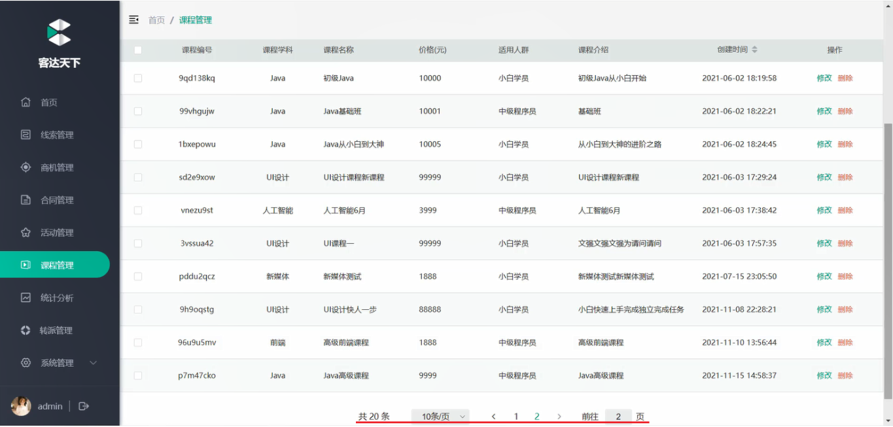

分页查询语法：

```SQL
select  字段列表  from  表名  limit  起始索引, 查询记录数 ;
```


- 案例1：从起始索引0开始查询员工数据, 每页展示5条记录

```SQL
select id, username, password, name, gender, phone, salary, job, image, entry_date, create_time, update_time
from emp
limit 0 , 5; -- 从索引0开始，向后取5条记录
```


- 案例2：查询 第1页 员工数据, 每页展示5条记录

```SQL
select id, username, password, name, gender, phone, salary, job, image, entry_date, create_time, update_time
from emp
limit 5; -- 如果查询的是第1页数据，起始索引可以省略，直接简写为：limit 条数
```


- 案例3：查询 第2页 员工数据, 每页展示5条记录

```SQL
select id, username, password, name, gender, phone, salary, job, image, entry_date, create_time, update_time
from emp
limit 5 , 5; -- 从索引5开始，向后取5条记录
```


- 案例4：查询 第3页 员工数据, 每页展示5条记录

```SQL
select id, username, password, name, gender, phone, salary, job, image, entry_date, create_time, update_time
from emp
limit 10 , 5; -- 从索引10开始，向后取5条记录
```


**注意事项:**

1. 起始索引从0开始。           计算公式 ：起始索引 = （查询页码 \- 1）\* 每页显示记录数

2. 分页查询是数据库的方言，不同的数据库有不同的实现，MySQL中是LIMIT

3. 如果查询的是第一页数据，起始索引可以省略，直接简写为 limit  条数


