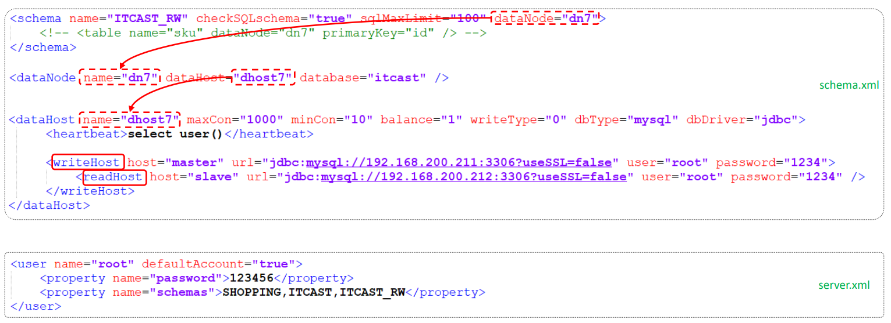
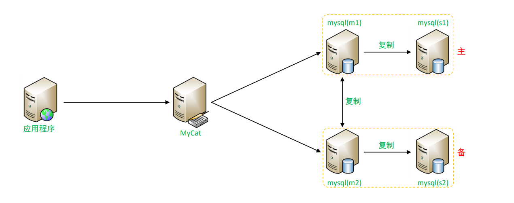
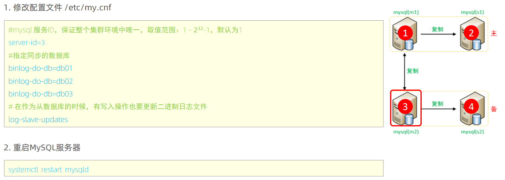
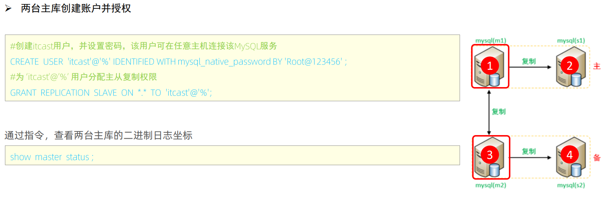
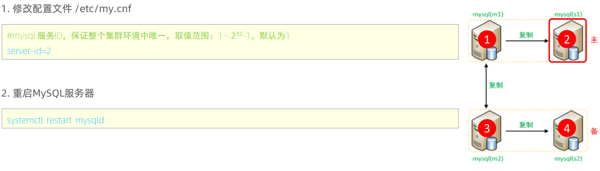
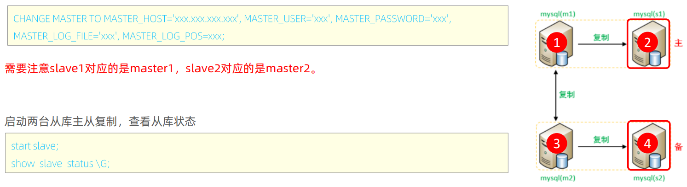
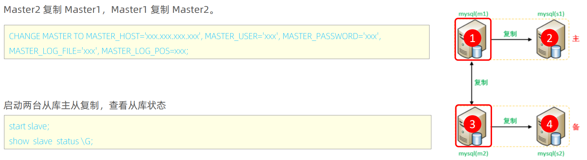
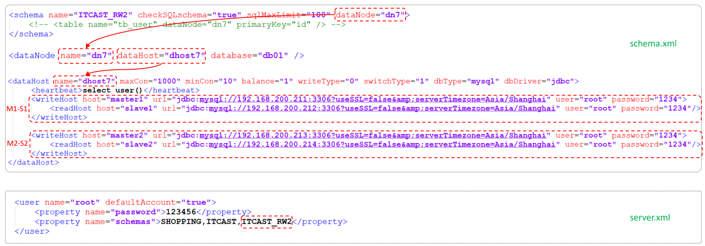

# 读写分离

## 1\.介绍

主从复制在进行数据库操作时，客户端服务器会先判断目前操作是读还是写，再决定是分配到哪个服务器，压力较大。

读写分离,简单地说就是把对数据库的读和写操作分开,以对应不同的数据库服务器。主数据库提供写操作，从数据库提供读操作，这样能有效地减轻单台数据库的压力。

通过MyCat即可轻易实现上述功能，不仅可以支持MySQL，也可以支持Oracle和SQL Server。


## 2\.一主一从

MySQL的主从复制，是基于二进制日志（binlog）实现的。


**环境准备**：

|主机|角色|用户名|密码|
|---|---|---|---|
|192\.168\.200\.211|master|root|1234|
|192\.168\.200\.212|slave|root|1234|

主从复制的搭建，可以参考[十五、主从复制](https://my.feishu.cn/docx/W9swdzMtRoO3ncxEJYHcD39anPT?fromScene=spaceOverview#doxcnunTYx18FhtRkvDniy6mRXe)

## 3\.一主一从读写分离

### 3\.1 配置

MyCat控制后台数据库的读写分离和负载均衡由schema\.xml文件datahost标签的balance属性控制。




|参数值|含义|
|---|---|
|0|不开启读写分离机制 所有读操作都发送到当前可用的writeHost上|
|1|全部的readHost与writeHost备用的 都参与select语句的负载均衡（主要针对于双主双从模式）|
|2|所有的读写操作都随机在writeHost、readHost上分发|
|3|所有的读请求随机分发到writeHost对应的readHost上执行，writeHost不负担读压力|

### 3\.2 测试

连接Mycat，并在Mycat中执行DML、DQL查看是否能够进行读写分离。

- 主节点Master宕机之后，业务系统就只能够读，而不能写入数据了，可以通过双主双从

## 4\.双主双从

一个主机 Master1 用于处理所有写请求，它的从机 Slave1 和另一台主机 Master2 还有它的从机 Slave2 负责所有读请求。当 Master1 主机宕机后，Master2 主机负责写请求，Master1 、Master2 互为备机：



### 4\.1 准备工作

我们需要准备5台服务器，具体的服务器及软件安装情况如下：

|编号|IP|安装软件|角色|
|---|---|---|---|
|1|192\.168\.200\.210|Mycat、MySQL|Mycat中间件服务器|
|2|192\.168\.200\.211|MySQL|M1|
|3|192\.168\.200\.212|MySQL|S1|
|4|192\.168\.200\.213|MySQL|M2|
|5|192\.168\.200\.214|MySQL|S2|

关闭以上所有服务器的防火墙：

- systemctl stop firewalld

- systemctl disable firewalld

### 4\.2 主库配置（ Master1\-192\.168\.200\.211 ）


### 4\.3 主库配置（ Master2\-192\.168\.200\.213 ）



### 4\.4 两台主库创建账户并授权



### 4\.5 从库配置（ Slave1\-192\.168\.200\.212 ）



### 4\.6 从库配置（ Slave2\-192\.168\.200\.214 ）


### 4\.7 两台从库配置关联的主库



- MASTER\_HOST跟从库所关联的主库IP，MASTER\_USER跟用户名，MASTER\_PASSWORD跟用户密码，MASTER\_LOG\_FILE和MASTER\_LOG\_POS可以在对应主库中通过show master status获得

两台从库 2 和 4 都要配置

### 4\.8 两台主库相互复制



### 4\.9 测试

分别在两台主库Master1、Master2上执行DDL、DML语句，查看涉及到的数据库服务器的数据同步情况

```SQL
create database db01;
use db01;
create table tb_user(
        id in(11)not null primary key,
        name varchar(50) not null,
        sex varcahr(1)
)engine=innodb default charset=utf8mb4

insert into tb user(id,name,sex) values(l,'Tom','1');
insert into tb user(id,name,sex) values(2,'Trigger','0');
insert into tb user(id,name,sex) values(3,'Dawn','1');
insert into tb user(id,name,sex) values(4,"ack Ma','1');
insertinto tb user(id,name,sex) values(5,'Coco','0');
insert into tb user(id,name,sex) values(6,'erry','1');
```

## 5\.双主双从读写分离

### 5\.1 配置

MyCat控制后台数据库的读写分离和负载均衡由schema\.xml文件datahost标签的balance属性控制，通过writeType及switchType来完成失败自动切换。




### 5\.2 测试

登录MyCat，测试查询及更新操作，判定是否能够进行读写分离，以及读写分离的策略是否正确。

- 查询时，从哪个服务器查询时随机的，插入时，默认插入到master1当中，然后同步到其他三台服务器

当主库挂掉一个之后，是否能够自动切换。

