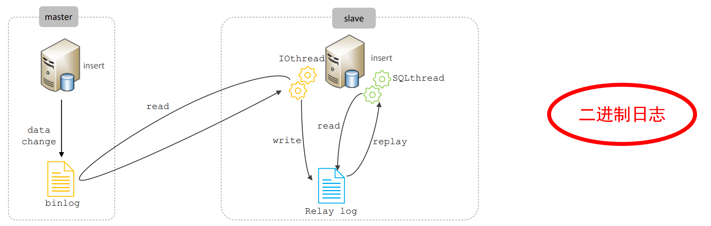
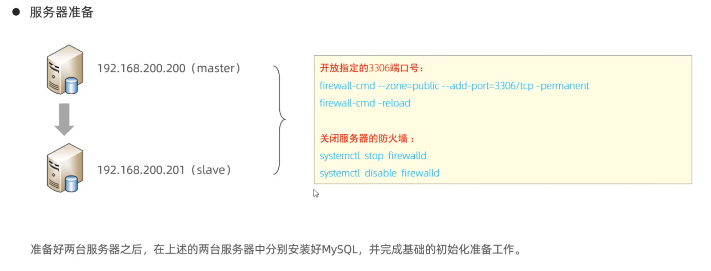

# 主从复制

## 1\.概述

主从复制是指将主数据库的DDL 和 DML 操作通过二进制日志传到从库服务器中，然后在从库上对这些日志重新执行（也叫重做），从而 使得从库和主库的数据保持同步。

MySQL支持一台主库同时向多台从库进行复制， 从库同时也可以作为其他从服务器的主库，实现链状复制。

MySQL 复制的主要特点包含以下三个方面：

1. 主库出现问题，可以快速切换到从库提供服务

2. 实现读写分离，降低主库的访问压力

3. 可以在从库中执行备份，以避免备份期间影响主库服务


## 2\.原理

MySQL主从复制原理：



从上图来看，复制分成三步：

1. Master 主库在事务提交时，会把数据变更记录在二进制日志文件 Binlog（记录原始 SQL 语句 ）中

2. 从库的IO线程读取主库的二进制日志文件 Binlog ，写入到从库的中继日志 Relay Log

3. slave的SQL线程重做中继日志中的事件，即读取中继日志中的 SQL 语句并执行，将改变反映它自己的数据

## 3\.搭建实现

### 3\.1 主库配置




### 3\.2 从库配置


- 设置read\_only=1后，超级管理员不是只读，如果想要让超级管理员也是只读，就需要额外配置`super_read_only=1`


- 当Replica\_IO\_Running和Replica\_SQL\_Running都显示Yes时才表示配置正常，否则检查重新配置

## 4\.测试

1. 在主库上创建数据库、表，并插入数据

```SQL
create database db01;
use db01;
create table tb_use(
        id int(11) primary key not null auto_increment,
        name varchar(50) not null,
        sex varchar(1)
)engine=innodb default charset=utf8mb4;
insert into tb_user(id, name, sex) valurs (null, 'Tom', '1'), (null, 'Trigger', '0'), (null, 'Dawn', '1');
```

2. 在从库中查询数据，验证主从是否同步

