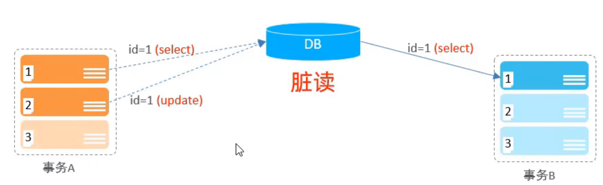
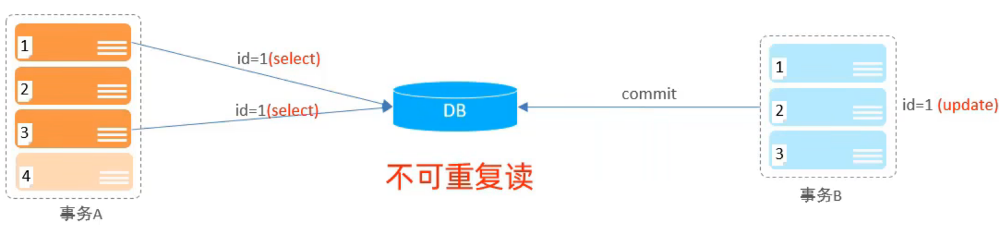
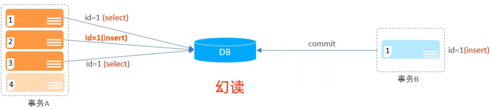

# 事务

事务是一组操作的集合，事务会把所有操作作为一个整体一起向系统提交或撤销操作请求，即这些操作要么同时成功，要么同时失败。

## 1\.代码设置

### 1\.1 方式一

查看/设置事务提交方式

```SQL
SELECT @@AUTOCOMMIT;
SET @@AUTOCOMMIT = 0;
```

- @@AUTOCOMMIT的值有两种：1为自动提交，0为手动提交，该设置只对当前会话有效

提交事务

```SQL
COMMIT;
```

回滚事务

```SQL
ROLLBACK;
```

### 1\.2 方式二

开启事务

```SQL
START TRANSACTION 或 BEGIN [TRANSACTION];
```

提交事务

```SQL
COMMIT;
```

回滚事务

```SQL
ROLLBACK;
```

## 2\.事务的四大特性\(ACID\)

- 原子性\(**A**tomicity\)：事务是不可分割的最小操作单元，要么全部成功，要么全部失败

- 一致性\(**C**onsistency\)：事务完成时，必须使所有数据都保持一致状态

- 隔离性\(**I**solation\)：数据库系统提供的隔离机制，保证事务在不受外部并发操作影响的独立环境下运行

- 持久性\(**D**urability\)：事务一旦提交或回滚，它对数据库中的数据的改变就是永久的

## 3\.并发事务问题

|问题|描述|
|---|---|
|脏读|一个事务读到另一个事务还没提交的数据|
|不可重复读|一个事务先后读取同一条记录，但两次读取的数据不同|
|幻读|一个事务按照条件查询数据时，没有对应的数据行，但是再插入数据时，又发现这行数据已经存在|







## 4\.事务隔离级别

|隔离级别|脏读|不可重复读|幻读|
|---|---|---|---|
|Read uncommitted|√|√|√|
|Read committed|×|√|√|
|Repeatable Read\(默认\)|×|×|√|
|Serializable|×|×|×|

查看事务隔离级别

```SQL
SELECT @@TRANSACTION_ISOLATION;
```

设置事务隔离级别

```SQL
SET [SESSION | GLOBAL] TRANSACTION ISOLATION LEVEL {READ UNCOMMITTED | READ COMMITTED | REPEATABLE READ | SERIALIZABLE};
```

- SESSION 是会话级别，表示只针对当前会话有效，GLOBAL 表示对所有会话有效

- 事务隔离级别越高，数据安全性越安全，但是性能越低，Read uncommitted事务隔离级别最低，Serializable事务隔离级别最高

