# FastAPI入门

## FastAPI概述

FastAPI 是一个基于 Python 的高性能 Web 框架专门用于快速构建 API 接口服务

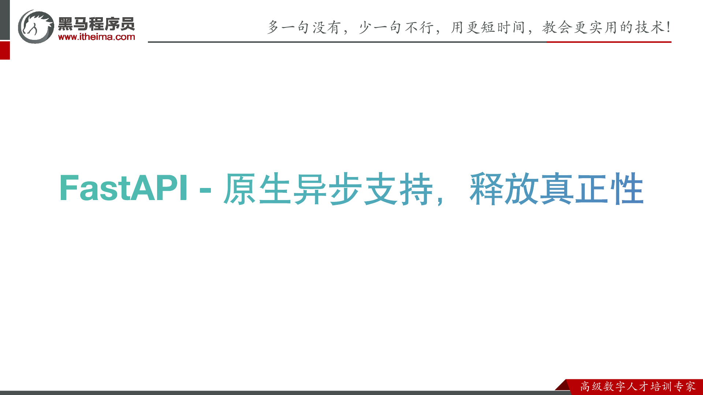

### 同步与异步

```python
@app.get("/async")
async def func_async():
  start = time.time()
  tasks = [asyncio.sleep(1) for i in range(10)]
  await asyncio.gather(*tasks)
  end = time.time()
  return {"time": f'{end-start:.2f}s'}
```

```python
@app.get("/sync")
def func_sync():
  start = time.time()
  for i in range(10):
    time.sleep(1)
  end = time.time()
  return {"time": f'{end-start:.2f}s'}
```

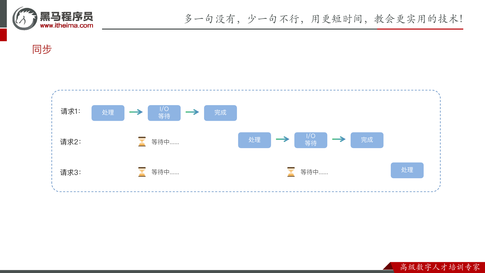

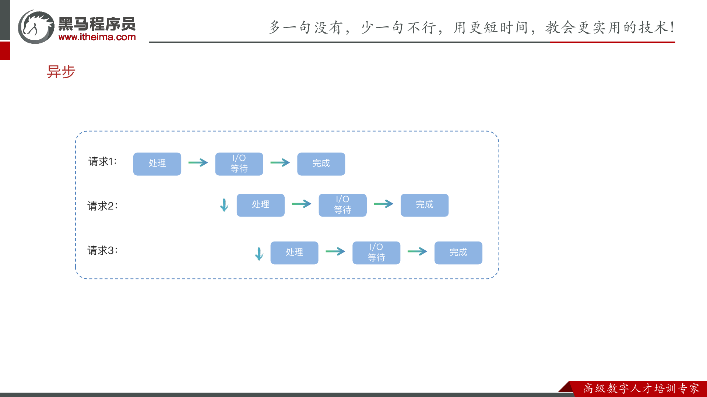

```python
from pydantic import BaseModel
class User(BaseModel):
  username: str
  password: str
@app.post("/register")
async def register(user: User):
  return user
```

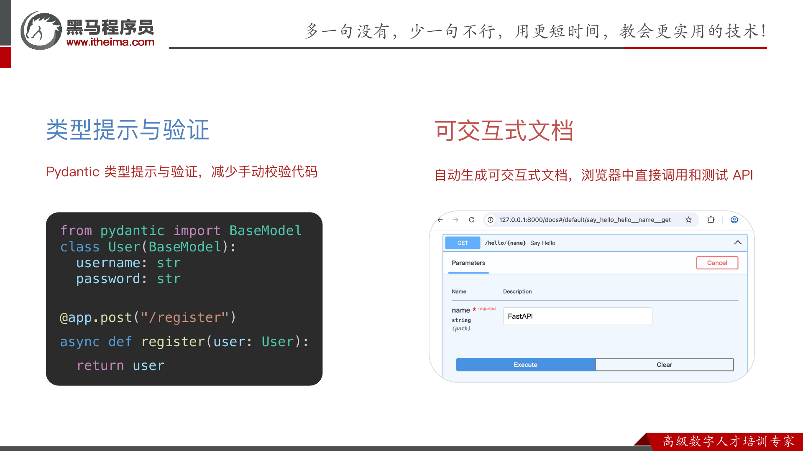

异步性能高

开发效率高

自动生成文档

## FastAPI框架基础

第一个 FastAPI 程序

### 第一个FastAPI程序

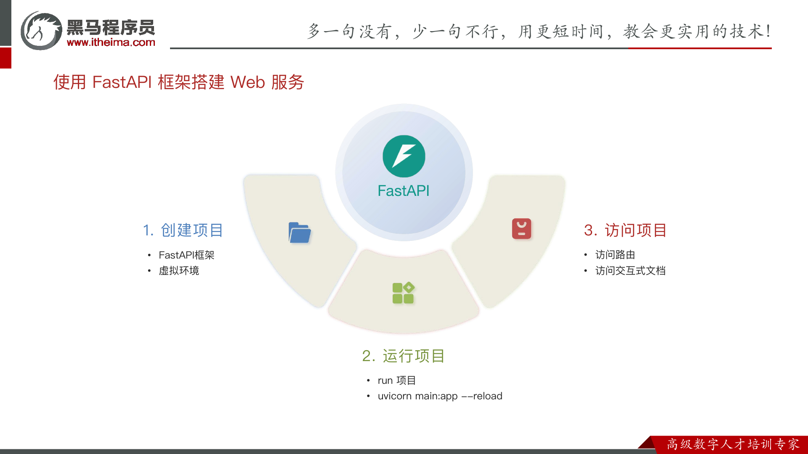

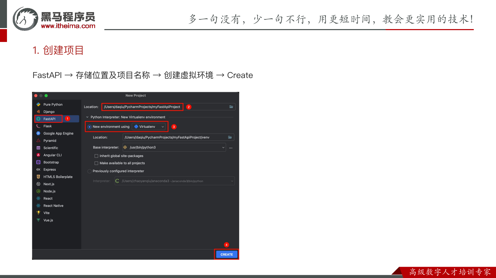

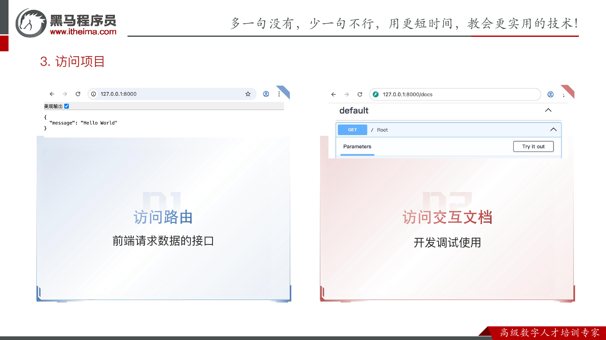

为什么要创建虚拟环境

隔离项目运行环境避免依赖冲突保持全局环境的干净和稳定

怎么运行 FastAPI 项目

run 项目

uvicorn main:app --reload

--reload 更改代码后自动重启服务器

怎么访问 FastAPI 交互式文档

http://127.0.0.1:8000/docs

## 路由

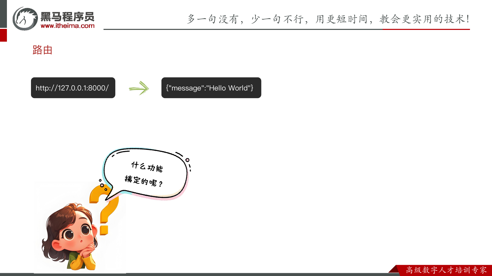

路由就是 URL 地址和处理函数之间的映射关系它决定了当用户访问某个特定网址时服务器应该执行哪段代码来返

回结果。

```python
@app.get("/")
async def root():
  return {"message": "hello world"}
```

什么是路由

路由是 URL 地址和处理函数之间的映射关系

说出下方关键代码的含义

需求访问路径 /user/hello 响应结果是 { "msg": "我正在学习 FastAPI ......" }

## 参数

{"message":"Hello World"}

/book 传入 book_id = 1

返回图书1的信息

/book 传入 book_id = 2

返回图书2的信息

参数就是客户端发送请求时附带的额外信息和指令

参数的作用是让同一个接口能根据不同的输入返回不同的输出实现动态交互

### 参数分类

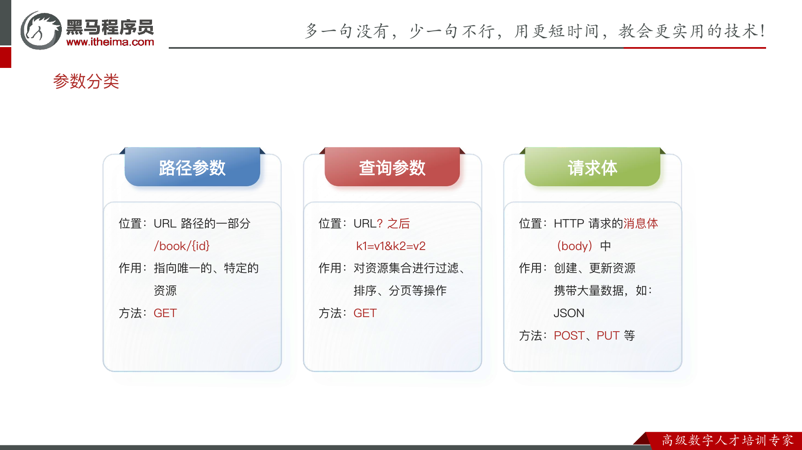

### 路径参数

```python
@app.get("/book/{id}")
async def get_book(id: int):
  return {"id": id, "title": f"这是第{id}本书"}
```

位置 URL 路径的一部分 /book/{id} 作用指向唯一的、特定的资源方法 GET

需求以用户 id 为路径参数设计 URL 要求响应结果包含用户 id 和 名称普通用户 id

参考 URL /user/{id}

响应结果 id: 123, name: 普通用户123

#### Path类型注解

FastAPI 允许为参数声明额外的信息和校验

限制参数

取值范围

导入 FastAPI 的 Path 函数

Path 参数

说明

```python
@app.get("/book/{id}")
async def get_book(id: int = Path()):
  return {"id": id, "title": f"这是第{id}本书"}
```

必填

```python
...
gt/ge
lt/le
description
min_length
max_length
```

大于/大于等于小于/小于等于描述

长度限制

路径参数出现在什么位置

URL 路径的一部分 /book/{id}

如何为路径参数添加类型注解

Python 原生注解 和 Path 注解

需求定义两个接口携带路径参数并使用 Path 来实现类型注解

具体如下

接口1 以 新闻分类 id 为参数设计 URL id 范围为 1 ~ 100

接口2 以 新闻分类名称为参数设计 URL 分类名称长度为 2 ~ 10

### 查询参数

声明的参数不是路径参数时路径操作函数会把该参数自动解释为查询参数

```python
@app.get("/news/news_list")
async def get_news_list(skip: int, limit: int=10):
  return {"skip": skip, "limit": limit}
```

位置 URL? 之后

k1=v1&k2=v2

作用对资源集合进行过滤、 排序、分页等操作方法 GET

#### Query类型注解

导入 FastAPI 的 Query 函数

Query 参数

说明

```python
@app.get("/user")
async def get_book(user_id: int = Query()):
  return {"id": id, "title": f"这是第{id}本书"}
```

必填大于/大于等于小于/小于等于描述

长度限制

查询参数出现在什么位置

URL? 之后  k1=v1&k2=v2

如何为查询参数添加类型注解

Python 原生注解 和 Query 注解

需求设计接口查询图书要求携带两个查询参数图书分类和价格

参数具体要求

图书分类默认值为 Python开发长度限制5 ~ 255

价格限制大小范围 50 ~ 100

### 请求体参数

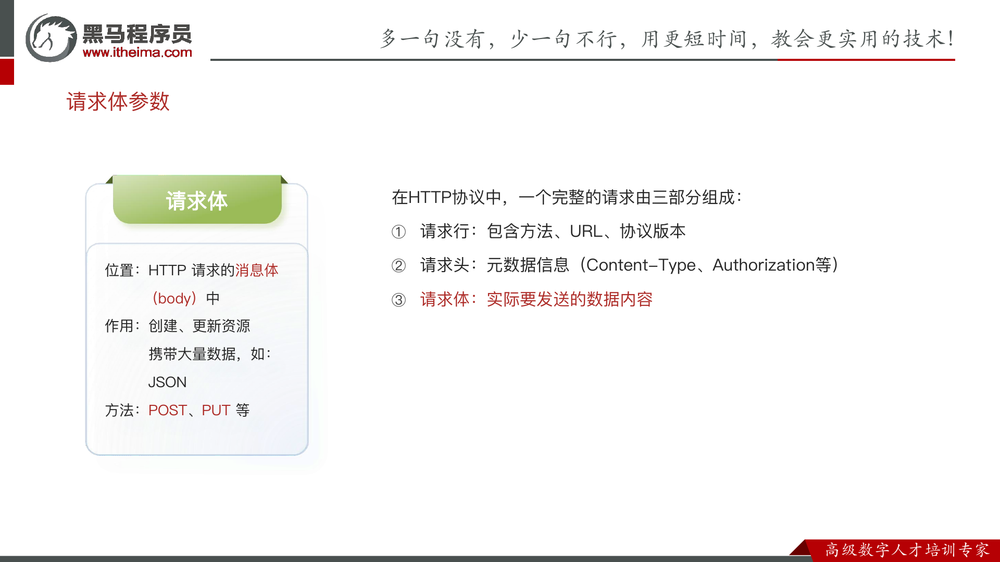

1. 定义类型

```python
from pydantic import BaseModel
class User(BaseModel):
  username: str
  password: str
```

2. 类型注解

```python
@app.post("/register")
async def register(user: User):
  return user
```

需求设计接口新增图书图书信息包含书名、作者、出版社、售价

#### Field类型注解

导入 pydantic 的 Field 函数

Field 参数

说明

```python
from pydantic import BaseModel, Field
class User(BaseModel):
  username: str = Field(...)
  password: str = Field(...)
```

必填

```python
...
gt/ge
lt/le
default
description
min_length
max_length
```

大于/大于等于小于/小于等于默认值

描述

长度限制

请求体参数的作用是什么

创建、更新资源

如何定义、使用请求体参数

如何为请求体参数添加类型注解

Python 原生注解 和 Field 注解

需求设计接口新增图书图书信息包含书名、作者、出版社、售价

具体要求如下

书名不能为空长度 2 ~ 20

作者长度 2 ~ 10

出版社默认值“黑马出版社”

售价不能为空价格大于0元

## 请求与响应

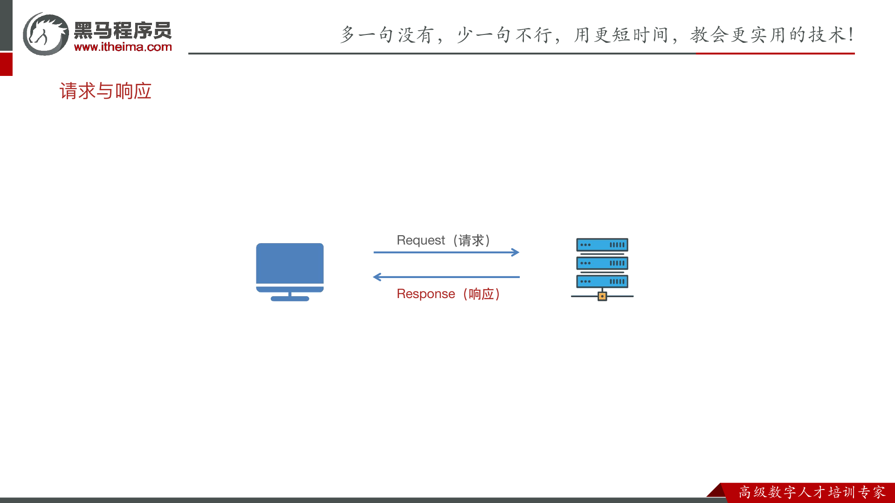

### 响应类型

默认情况下 FastAPI 会自动将路径操作函数返回的 Python 对象字典、列表、Pydantic 模型等经由 jsonable_encoder 转换为 JSON 兼容格式并包装为 JSONResponse 返回。这省去了手动序列化的步骤让开发者能更专注于业务逻辑。

如果需要返回非 JSON 数据如 HTML、文件流) FastAPI 提供了丰富的响应类型来返回不同数据

#### JSON格式

默认情况下 FastAPI 会自动将路径操作函数返回的 Python 对象字典、列表、Pydantic 模型等经由

jsonable_encoder转换为 JSON 兼容格式并包装为 JSONResponse 返回。

#### 响应类型设置方式

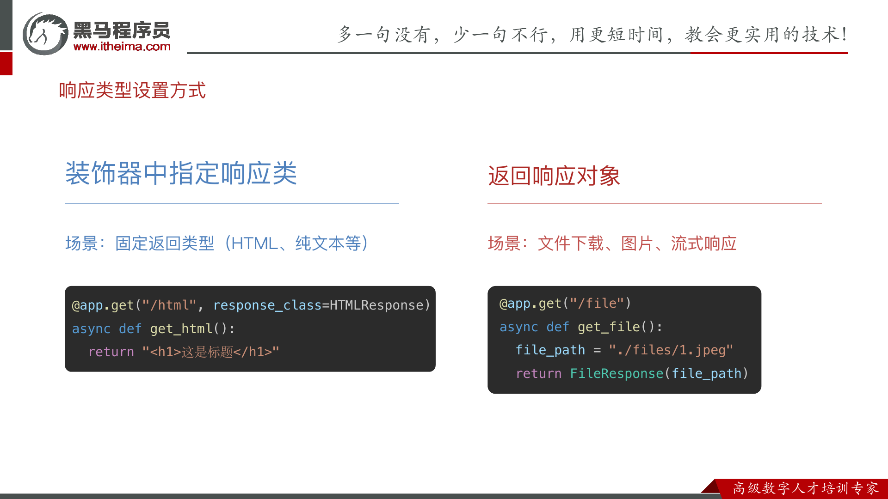

#### HTML格式

设置响应类为 HTMLResponse 当前接口即可返回 HTML 内容

```python
from fastapi.responses import HTMLResponse
@app.get("/html", response_class=HTMLResponse)
async def get_html():
  return "<h1>Hello World</h1>"
```

#### 文件格式

FileResponse 是 FastAPI 提供的专门用于高效返回文件内容如图片、PDF、Excel、音视频等的响应类。它能够智能处理文件路径 、媒体类型推断、范围请求和缓存头部是服务静态文件的推荐方式。

```python
from fastapi.responses import FileResponse
@app.get("/file")
async def get_file():
  file_path = "./files/1.jpeg"
  return FileResponse(file_path)
```

### 自定义响应数据格式

```python
@app.get("/news/{id}")
async def get_news(id: int):
  return {
    "id": id,
  }
```

```python
@app.get("/news/{id}")
async def get_news(id: int):
  return {
    "id": id,
    "title": f"这是第{id}本书"
  }
```

```python
@app.get("/news/{id}")
async def get_news(id: int):
  return {
    "id": id,
    "title": f"这是第{id}本书",
    "content": "这是一本好书"
  }
```

response_model 是路径操作装饰器如 @app.get或 @app.post 的关键参数它通过一个 Pydantic 模型来严格定义和约束 API 端点的输出格式。这一机制在提供自动数据验证和序列化的同时更是保障数据安全性的第一道防线。

```python
from pydantic import BaseModel
class News(BaseModel):
  id: int
  title: str
  content: str
@app.get("/news/{id}", response_model=News)
async def get_news(id: int):
  return {
    "id": id,
    "title": f"这是第{id}本书",
    "content": "这是一本好书"
  }
```

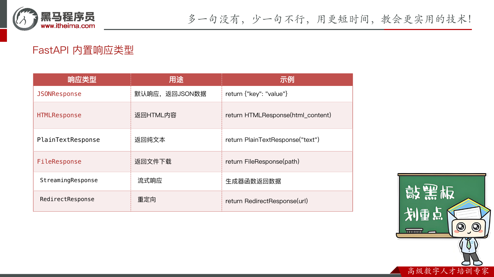

FastAPI中怎么自定义响应数据的格式

response_model

FastAPI中怎么设置响应类型

装饰器中设置响应类 和 返回响应对象

```python
@app.get("/html", response_class=HTMLResponse)
async def get_html():
  return "<h1>这是标题</h1>"
```

```python
@app.get("/file")
async def get_file():
  file_path = "./files/1.jpeg"
  return FileResponse(file_path)
```

### 异常处理

对于客户端引发的错误 4xx 如资源未找到、认证失败应使用 fastapi.HTTPException 来中断正常处理流程

并返回标准错误响应。

```python
from fastapi import FastAPI, HTTPException
@app.get('/news/{id}')
async def get_news(id: int):
  id_list = [1, 2, 3, 4, 5, 6]
  if id not in id_list:
    raise HTTPException(status_code=404, detail="当前id不存在")
  return {"id": id}
```
